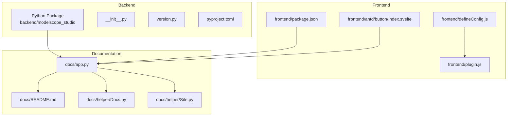
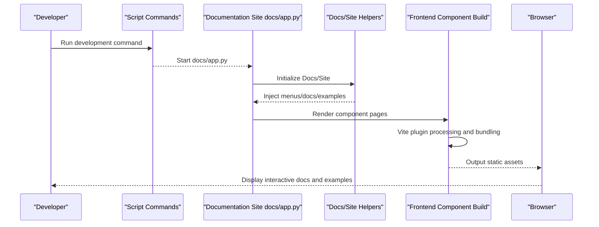
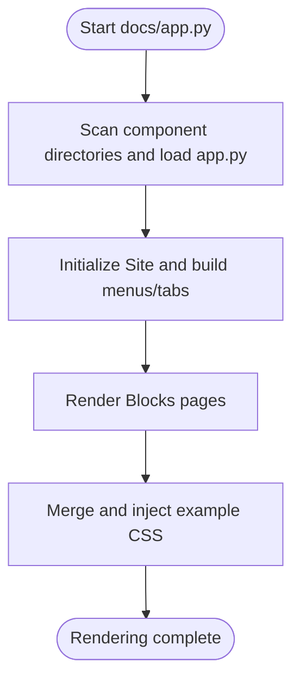
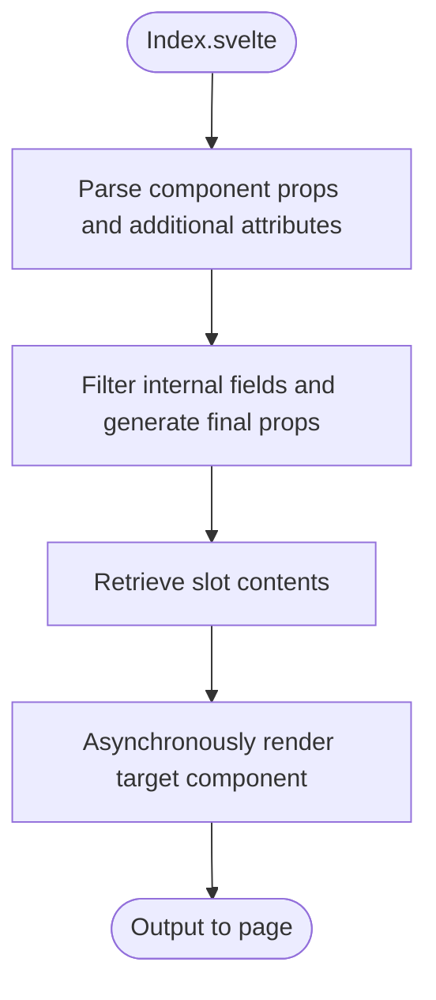
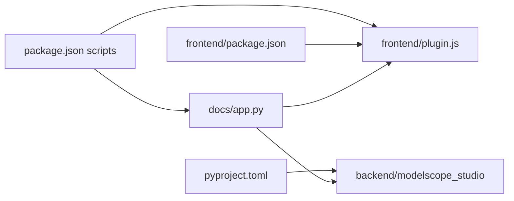

# Development Guide

<cite>
**Files referenced in this document**
- [README.md](file://README.md)
- [package.json](file://package.json)
- [pyproject.toml](file://pyproject.toml)
- [frontend/package.json](file://frontend/package.json)
- [backend/modelscope_studio/__init__.py](file://backend/modelscope_studio/__init__.py)
- [backend/modelscope_studio/version.py](file://backend/modelscope_studio/version.py)
- [docs/app.py](file://docs/app.py)
- [docs/README.md](file://docs/README.md)
- [docs/helper/Docs.py](file://docs/helper/Docs.py)
- [docs/helper/Site.py](file://docs/helper/Site.py)
- [frontend/defineConfig.js](file://frontend/defineConfig.js)
- [frontend/plugin.js](file://frontend/plugin.js)
- [frontend/antd/button/Index.svelte](file://frontend/antd/button/Index.svelte)
- [backend/modelscope_studio/components/antd/__init__.py](file://backend/modelscope_studio/components/antd/__init__.py)
</cite>

## Table of Contents

1. [Introduction](#introduction)
2. [Project Structure](#project-structure)
3. [Core Components](#core-components)
4. [Architecture Overview](#architecture-overview)
5. [Detailed Component Analysis](#detailed-component-analysis)
6. [Dependency Analysis](#dependency-analysis)
7. [Performance Considerations](#performance-considerations)
8. [Troubleshooting Guide](#troubleshooting-guide)
9. [Conclusion](#conclusion)
10. [Appendix](#appendix)

## Introduction

This guide is intended for engineers who wish to participate in the development and extension of ModelScope Studio (a third-party component library based on Gradio). It covers: development environment setup, dependency installation, starting the development server, build configuration, overall architecture and development workflow, standard component development process and best practices, documentation system usage and example conventions, testing and quality assurance, debugging tips and common issues, as well as contributing guidelines and code standards.

## Project Structure

The repository uses a multi-package workspace organization, consisting of the following main parts:

- Backend Python package: Provides component classes and packaging configuration, responsible for component export and distribution on the Python side.
- Frontend Svelte/React ecosystem: Built with Vite, providing frontend implementations and bundling for components.
- Documentation site: A Gradio-based documentation system that dynamically loads documentation and examples for each component.
- Tools and scripts: Changeset version management, release scripts, encoding checks, etc.

**Diagram Sources**

- [backend/modelscope_studio/**init**.py:1-3](file://backend/modelscope_studio/__init__.py#L1-L3)
- [backend/modelscope_studio/version.py:1-2](file://backend/modelscope_studio/version.py#L1-L2)
- [pyproject.toml:1-257](file://pyproject.toml#L1-L257)
- [frontend/package.json:1-59](file://frontend/package.json#L1-L59)
- [frontend/defineConfig.js:1-19](file://frontend/defineConfig.js#L1-L19)
- [frontend/plugin.js:1-168](file://frontend/plugin.js#L1-L168)
- [frontend/antd/button/Index.svelte:1-74](file://frontend/antd/button/Index.svelte#L1-L74)
- [docs/app.py:1-595](file://docs/app.py#L1-L595)
- [docs/README.md:1-75](file://docs/README.md#L1-L75)
- [docs/helper/Docs.py:1-178](file://docs/helper/Docs.py#L1-L178)
- [docs/helper/Site.py:1-255](file://docs/helper/Site.py#L1-L255)

**Section Sources**

- [README.md:80-101](file://README.md#L80-L101)
- [package.json:8-25](file://package.json#L8-L25)
- [pyproject.toml:1-257](file://pyproject.toml#L1-L257)
- [frontend/package.json:1-59](file://frontend/package.json#L1-L59)
- [docs/app.py:1-595](file://docs/app.py#L1-L595)

## Core Components

- Backend component exports: The backend exposes components from various sub-modules through a unified export entry, enabling on-demand import and use.
- Frontend component bridging: The frontend wraps Ant Design/React components as Svelte components, using plugins for global variable mapping and externalization.
- Documentation system: The documentation site generates docs and examples by dynamically loading `app.py` from each component directory, supporting language switching and theme style injection.

**Section Sources**

- [backend/modelscope_studio/components/antd/**init**.py:1-150](file://backend/modelscope_studio/components/antd/__init__.py#L1-L150)
- [frontend/antd/button/Index.svelte:1-74](file://frontend/antd/button/Index.svelte#L1-L74)
- [docs/app.py:19-91](file://docs/app.py#L19-L91)

## Architecture Overview

The diagram below shows the critical path from development to runtime: the developer runs a command locally to start the documentation site, the site reads component documentation and examples, frontend components are built and externalized through the Vite plugin, and are finally rendered in the browser.

**Diagram Sources**

- [package.json:15](file://package.json#L15)
- [docs/app.py:577-595](file://docs/app.py#L577-L595)
- [docs/helper/Docs.py:12-178](file://docs/helper/Docs.py#L12-L178)
- [docs/helper/Site.py:9-255](file://docs/helper/Site.py#L9-L255)
- [frontend/defineConfig.js:1-19](file://frontend/defineConfig.js#L1-L19)
- [frontend/plugin.js:41-168](file://frontend/plugin.js#L41-L168)

## Detailed Component Analysis

### Documentation System and Site Rendering

- Dynamic loading: The site scans directories by component type, dynamically loads each component's `app.py`, and extracts the `docs` dictionary.
- Menus and tabs: The `Site` class organizes top-level tabs and sidebar menus, supporting horizontal menu and nested menu interaction.
- CSS injection: To avoid style loss in multi-Blocks scenarios, CSS from all examples is merged and injected into the root Blocks.

**Diagram Sources**

- [docs/app.py:19-91](file://docs/app.py#L19-L91)
- [docs/helper/Site.py:41-255](file://docs/helper/Site.py#L41-L255)
- [docs/helper/Docs.py:163-178](file://docs/helper/Docs.py#L163-L178)

**Section Sources**

- [docs/app.py:1-595](file://docs/app.py#L1-L595)
- [docs/helper/Site.py:1-255](file://docs/helper/Site.py#L1-L255)
- [docs/helper/Docs.py:1-178](file://docs/helper/Docs.py#L1-L178)

### Frontend Build and Component Bridging

- Vite plugin: Externalizes specific modules by mapping imports to global objects on `window`, reducing bundle size and improving load performance.
- Svelte components: Wraps React/AntD components via `importComponent`, handling props, slots, and visibility control uniformly.

**Diagram Sources**

- [frontend/antd/button/Index.svelte:10-74](file://frontend/antd/button/Index.svelte#L10-L74)
- [frontend/plugin.js:41-168](file://frontend/plugin.js#L41-L168)

**Section Sources**

- [frontend/defineConfig.js:1-19](file://frontend/defineConfig.js#L1-L19)
- [frontend/plugin.js:1-168](file://frontend/plugin.js#L1-L168)
- [frontend/antd/button/Index.svelte:1-74](file://frontend/antd/button/Index.svelte#L1-L74)

### Backend Component Exports and Versioning

- Unified exports: Backend components are centrally exported via `__init__.py` from all sub-modules, enabling users to import on-demand.
- Version management: Version numbers are maintained centrally in `version.py`, ensuring consistency between frontend and backend.

**Section Sources**

- [backend/modelscope_studio/**init**.py:1-3](file://backend/modelscope_studio/__init__.py#L1-L3)
- [backend/modelscope_studio/version.py:1-2](file://backend/modelscope_studio/version.py#L1-L2)
- [backend/modelscope_studio/components/antd/**init**.py:1-150](file://backend/modelscope_studio/components/antd/__init__.py#L1-L150)

## Dependency Analysis

- Python dependencies: The backend is built with hatchling and declares version range constraints on Gradio; frontend dependencies include Ant Design, React, Svelte, and other ecosystem libraries.
- Documentation and scripts: `package.json` defines scripts for development, building, formatting, validation, and release; `pyproject.toml` configures build artifacts and metadata.

**Diagram Sources**

- [package.json:8-25](file://package.json#L8-L25)
- [pyproject.toml:25-43](file://pyproject.toml#L25-L43)
- [frontend/package.json:1-59](file://frontend/package.json#L1-L59)
- [docs/app.py:1-595](file://docs/app.py#L1-L595)

**Section Sources**

- [package.json:1-55](file://package.json#L1-L55)
- [pyproject.toml:1-257](file://pyproject.toml#L1-L257)
- [frontend/package.json:1-59](file://frontend/package.json#L1-L59)

## Performance Considerations

- Externalization and aliases: The Vite plugin externalizes commonly used libraries, reducing repeated bundling and improving initial load speed.
- On-demand rendering: The component bridging layer only renders when `visible` is true, avoiding unnecessary nodes.
- CSS merging: The documentation site merges and injects example CSS to avoid style loss and repaint/flicker in multi-Blocks scenarios.

[This section contains general recommendations and does not involve specific file analysis]

## Troubleshooting Guide

- Documentation site not displaying or style abnormalities
  - Confirm whether `ssr_mode=False` is set in Hugging Face Space.
  - Check whether the documentation site is correctly merging and injecting CSS.
- Component not working or throwing errors
  - Check whether the component has been correctly exported and aggregated in `__init__.py`.
  - Confirm that the frontend component's props and slots are passed according to convention.
- Build failure or externalization errors
  - Check whether the Vite plugin's `external excludes` configuration covers the modules that need to be externalized.
- Development server startup failure
  - Use the command provided in the documentation to start development mode, confirm port and hot-reload configuration.

**Section Sources**

- [README.md:32-33](file://README.md#L32-L33)
- [docs/helper/Site.py:60-73](file://docs/helper/Site.py#L60-L73)
- [frontend/plugin.js:41-76](file://frontend/plugin.js#L41-L76)
- [backend/modelscope_studio/components/antd/**init**.py:1-150](file://backend/modelscope_studio/components/antd/__init__.py#L1-L150)

## Conclusion

This guide provides a complete path from environment setup to component development, documentation system usage, build and deployment, debugging and troubleshooting. During development, it is recommended to follow the unified component development workflow and naming conventions, make full use of the documentation system and script tools, and ensure consistency and maintainability between frontend and backend.

[This section is a summary and does not involve specific file analysis]

## Appendix

### Development Environment Setup and Commands

- Clone the repository and install backend and frontend dependencies
- Use the development command provided in the documentation to start the local documentation site

**Section Sources**

- [README.md:82-101](file://README.md#L82-L101)
- [package.json:15](file://package.json#L15)

### Standard Component Development Process and Best Practices

- Create or complete `app.py` and example files in the corresponding component directory, ensuring the documentation system can load them.
- Keep frontend components with minimal necessary prop passing, avoiding redundant logic.
- Use the unified slot and style injection mechanism to ensure consistent appearance and behavior.

**Section Sources**

- [docs/app.py:19-91](file://docs/app.py#L19-L91)
- [frontend/antd/button/Index.svelte:10-74](file://frontend/antd/button/Index.svelte#L10-L74)

### Documentation System Usage and Example Writing Conventions

- Use the Docs helper to parse Markdown and render examples, supporting collapsing, titles, and position control.
- Show example code and rendered results side by side for easier comparison and debugging.

**Section Sources**

- [docs/helper/Docs.py:82-178](file://docs/helper/Docs.py#L82-L178)

### Testing Strategy and Quality Assurance

- Use scripts for formatting, style checking, and type checking to ensure code consistency.
- Verify component behavior in different environments through the documentation site.

**Section Sources**

- [package.json:18-22](file://package.json#L18-L22)

### Debugging Tips

- Use Gradio's event and update mechanisms to observe menu switching and tab interactions.
- Check component rendering and prop passing in the browser console.

**Section Sources**

- [docs/helper/Site.py:203-255](file://docs/helper/Site.py#L203-L255)

### Contributing Guidelines and Code Standards

- Follow the project's established scripts and toolchain; ensure formatting and validation pass before committing.
- Version changes and release workflows are automated through Changesets and scripts.

**Section Sources**

- [package.json:10-25](file://package.json#L10-L25)
