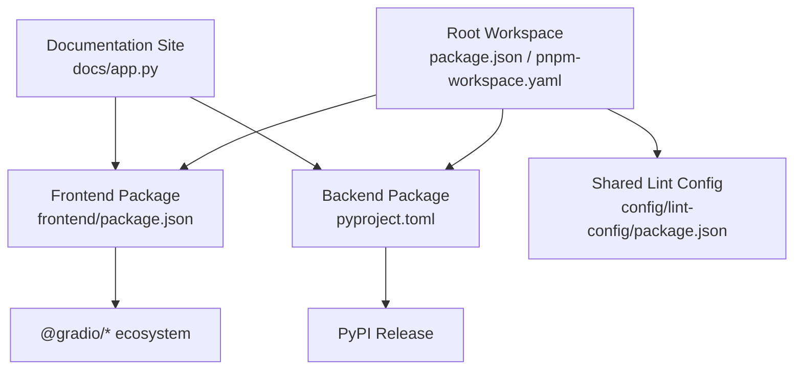
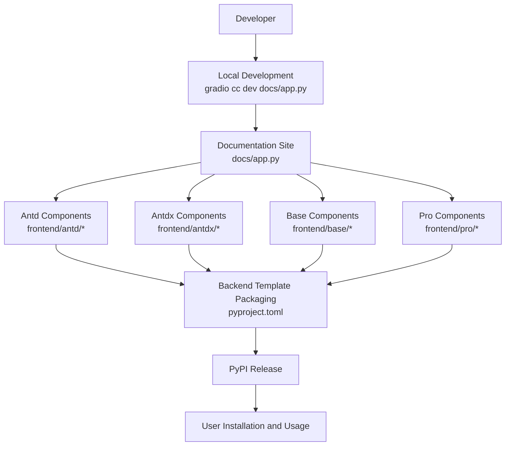
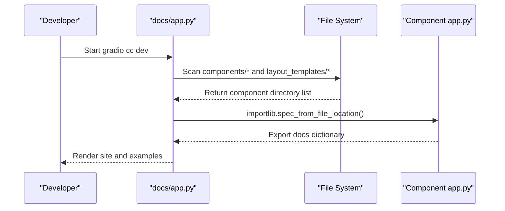
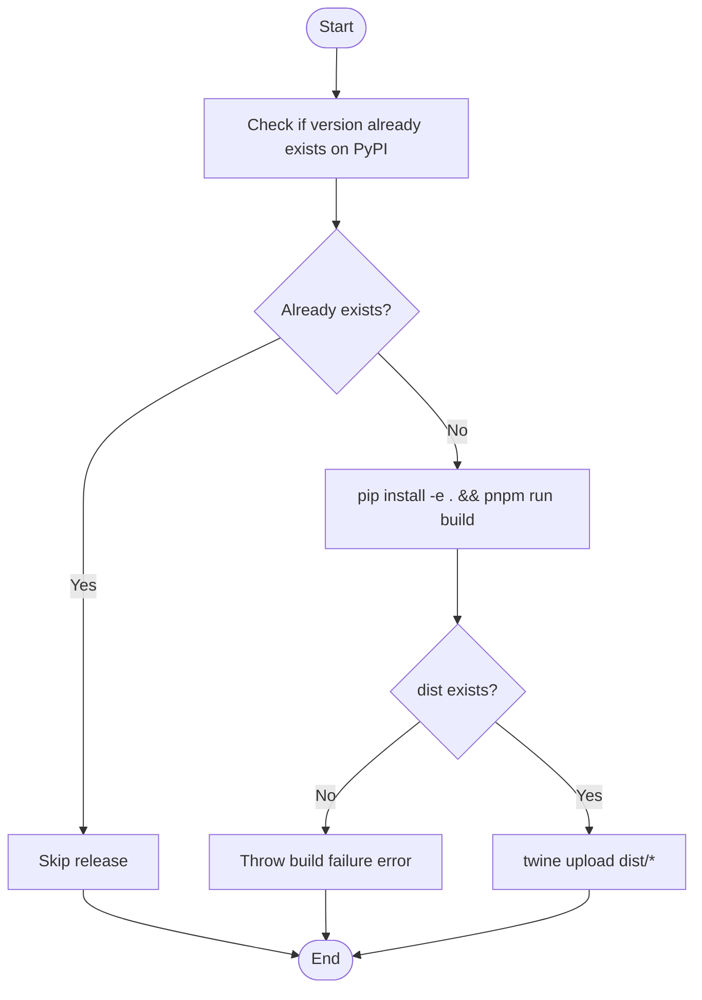
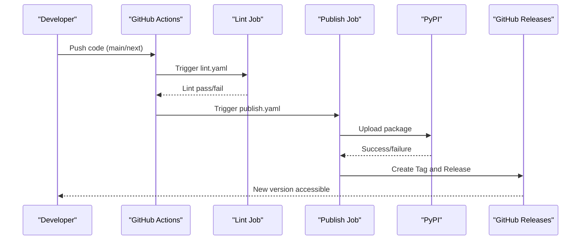
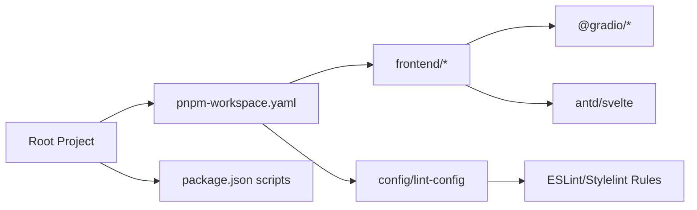

# Development Workflow

<cite>
**Files referenced in this document**
- [package.json](file://package.json)
- [pnpm-workspace.yaml](file://pnpm-workspace.yaml)
- [pyproject.toml](file://pyproject.toml)
- [README.md](file://README.md)
- [docs/app.py](file://docs/app.py)
- [frontend/package.json](file://frontend/package.json)
- [.github/workflows/lint.yaml](file://.github/workflows/lint.yaml)
- [.github/workflows/publish.yaml](file://.github/workflows/publish.yaml)
- [scripts/publish-to-pypi.mts](file://scripts/publish-to-pypi.mts)
- [scripts/create-tag-n-release.mts](file://scripts/create-tag-n-release.mts)
- [backend/modelscope_studio/version.py](file://backend/modelscope_studio/version.py)
</cite>

## Table of Contents

1. [Introduction](#introduction)
2. [Project Structure](#project-structure)
3. [Core Components](#core-components)
4. [Architecture Overview](#architecture-overview)
5. [Detailed Component Analysis](#detailed-component-analysis)
6. [Dependency Analysis](#dependency-analysis)
7. [Performance Considerations](#performance-considerations)
8. [Troubleshooting Guide](#troubleshooting-guide)
9. [Conclusion](#conclusion)
10. [Appendix](#appendix)

## Introduction

This guide is intended for developers and maintainers of ModelScope Studio, systematically explaining the project's overall architecture, development patterns, and release process. The project uses a Monorepo structure, with the frontend based on Svelte and the Gradio component ecosystem, while the backend provides Python package encapsulation and template generation. The documentation site dynamically loads component examples and documentation through Python. This document covers the complete workflow from requirements analysis to component release, including Git workflow, branch management, code review, local development and hot reload, CI/CD, and automated releases.

## Project Structure

- The top level uses pnpm workspace to manage multiple packages, including the root project, frontend packages, base and professional component packages, and shared lint configuration packages.
- The backend is provided as a Python package offering component templates and packaging rules, with build artifacts for PyPI release.
- The documentation site is located in the `docs` directory, dynamically scanning component directories and rendering example pages through Python, supporting local development and hot reload.
- Frontend components are built with Svelte + TypeScript, working with the Gradio ecosystem for demonstration and integration.

**Diagram Sources**

- [pnpm-workspace.yaml:1-12](file://pnpm-workspace.yaml#L1-L12)
- [package.json:1-55](file://package.json#L1-L55)
- [frontend/package.json:1-59](file://frontend/package.json#L1-L59)
- [pyproject.toml:1-257](file://pyproject.toml#L1-L257)
- [docs/app.py:1-595](file://docs/app.py#L1-L595)

**Section Sources**

- [pnpm-workspace.yaml:1-12](file://pnpm-workspace.yaml#L1-L12)
- [package.json:1-55](file://package.json#L1-L55)
- [frontend/package.json:1-59](file://frontend/package.json#L1-L59)
- [pyproject.toml:1-257](file://pyproject.toml#L1-L257)
- [docs/app.py:1-595](file://docs/app.py#L1-L595)

## Core Components

- Documentation site and routing: `docs/app.py` is responsible for dynamically loading `app.py` examples and documentation for each component, organizing multiple tabs and menu items, and enabling hot reload during local development.
- Frontend component ecosystem: The `frontend` directory organizes components by categories such as `antd`, `antdx`, `base`, `pro`, with each component containing Svelte implementation and Gradio configuration.
- Backend Python package: `pyproject.toml` defines build targets and artifact manifests, packaging a large number of template files into the wheel for PyPI use.
- Shared Lint configuration: `config/lint-config` provides unified ESLint and Stylelint rules and parsers, ensuring cross-package consistency.
- CI/CD scripts: The `scripts` directory contains PyPI release and GitHub Release creation scripts, working with GitHub Actions for automated releases.

**Section Sources**

- [docs/app.py:1-595](file://docs/app.py#L1-L595)
- [frontend/package.json:1-59](file://frontend/package.json#L1-L59)
- [pyproject.toml:1-257](file://pyproject.toml#L1-L257)
- [config/lint-config/package.json:1-48](file://config/lint-config/package.json#L1-L48)
- [scripts/publish-to-pypi.mts:1-60](file://scripts/publish-to-pypi.mts#L1-L60)
- [scripts/create-tag-n-release.mts:1-131](file://scripts/create-tag-n-release.mts#L1-L131)

## Architecture Overview

ModelScope Studio's development and release revolves around "documentation-driven component development": frontend components are implemented in Svelte, the backend Python package handles templates and packaging, and the documentation site serves as the unified entry point aggregating all component examples; CI/CD triggers builds and releases on the main branch, ensuring version consistency and traceability.

**Diagram Sources**

- [docs/app.py:1-595](file://docs/app.py#L1-L595)
- [frontend/package.json:1-59](file://frontend/package.json#L1-L59)
- [pyproject.toml:1-257](file://pyproject.toml#L1-L257)
- [package.json:8-25](file://package.json#L8-L25)

**Section Sources**

- [docs/app.py:1-595](file://docs/app.py#L1-L595)
- [pyproject.toml:1-257](file://pyproject.toml#L1-L257)
- [package.json:8-25](file://package.json#L8-L25)

## Detailed Component Analysis

### Documentation Site and Component Discovery Mechanism

The documentation site scans subdirectories under `docs/components` and `docs/layout_templates`, dynamically imports each component's `app.py`, and extracts its `docs` field to form a unified site structure. This mechanism allows new components to be added without modifying site routing; simply provide `app.py` and examples in the corresponding directory.

**Diagram Sources**

- [docs/app.py:19-61](file://docs/app.py#L19-L61)

**Section Sources**

- [docs/app.py:19-61](file://docs/app.py#L19-L61)

### Frontend Component Development and Build

- Components are written in Svelte + TypeScript, each with its own `package.json` and Gradio configuration for independent development and demonstration.
- The top-level `package.json` provides unified build and development scripts, invoking the Gradio CLI to build and start the documentation site.
- Frontend packages depend on `@gradio/*` ecosystem and core libraries such as `antd` and `svelte`, ensuring compatibility with the Gradio component ecosystem.

**Section Sources**

- [frontend/package.json:1-59](file://frontend/package.json#L1-L59)
- [package.json:8-25](file://package.json#L8-L25)

### Backend Template Packaging and Release

- `pyproject.toml` defines packaging rules for a large number of template files; build artifacts include backend component templates, ensuring they can be used directly on the Python side after installation.
- The release process uses scripts to check if the version already exists; if not, it executes the build and uses `twine` to upload to PyPI.

**Diagram Sources**

- [scripts/publish-to-pypi.mts:14-55](file://scripts/publish-to-pypi.mts#L14-L55)
- [pyproject.toml:45-245](file://pyproject.toml#L45-L245)

**Section Sources**

- [scripts/publish-to-pypi.mts:14-55](file://scripts/publish-to-pypi.mts#L14-L55)
- [pyproject.toml:45-245](file://pyproject.toml#L45-L245)

### CI/CD Process and Automated Release

- Lint workflow: Automatically executes on push and pull_request, installing Python and Node dependencies, running the unified lint script to ensure code style consistency.
- Release workflow: Triggers on push to `main`/`next` branches, but requires the commit message to be "chore: update versions"; only commits meeting this condition will execute the PyPI release script; after successful release, a Git Tag is created and a GitHub Release is created with content from the changelog.

**Diagram Sources**

- [.github/workflows/lint.yaml:1-34](file://.github/workflows/lint.yaml#L1-L34)
- [.github/workflows/publish.yaml:1-74](file://.github/workflows/publish.yaml#L1-L74)
- [scripts/publish-to-pypi.mts:32-42](file://scripts/publish-to-pypi.mts#L32-L42)
- [scripts/create-tag-n-release.mts:88-115](file://scripts/create-tag-n-release.mts#L88-L115)

**Section Sources**

- [.github/workflows/lint.yaml:1-34](file://.github/workflows/lint.yaml#L1-L34)
- [.github/workflows/publish.yaml:1-74](file://.github/workflows/publish.yaml#L1-L74)
- [scripts/publish-to-pypi.mts:32-42](file://scripts/publish-to-pypi.mts#L32-L42)
- [scripts/create-tag-n-release.mts:88-115](file://scripts/create-tag-n-release.mts#L88-L115)

## Dependency Analysis

- Package management: The root `package.json` and `pnpm-workspace.yaml` define workspace scope and script commands, with `frontend` and `config/lint-config` as independent packages.
- Language and toolchain: Python side is built with hatchling, Node side manages dependencies and scripts with pnpm; ESLint and Stylelint are provided by the shared lint configuration package.
- Component ecosystem: Frontend depends on `@gradio/*` and `antd/svelte`, documentation site imports component examples through Python, achieving a "documentation as example" development experience.

**Diagram Sources**

- [pnpm-workspace.yaml:1-12](file://pnpm-workspace.yaml#L1-L12)
- [package.json:8-25](file://package.json#L8-L25)
- [frontend/package.json:8-40](file://frontend/package.json#L8-L40)
- [config/lint-config/package.json:8-42](file://config/lint-config/package.json#L8-L42)

**Section Sources**

- [pnpm-workspace.yaml:1-12](file://pnpm-workspace.yaml#L1-L12)
- [package.json:8-25](file://package.json#L8-L25)
- [frontend/package.json:8-40](file://frontend/package.json#L8-L40)
- [config/lint-config/package.json:8-42](file://config/lint-config/package.json#L8-L42)

## Performance Considerations

- Dynamic imports in the documentation site are only enabled in development mode; production builds can optimize startup time by disabling watch or adjusting concurrency parameters.
- Frontend components are built on-demand, avoiding unnecessary full compilation; during local development, it's recommended to focus only on the current component directory to reduce unnecessary file watching.
- Check if the version exists on PyPI before releasing to avoid repeated uploads and network waste.

## Troubleshooting Guide

- Documentation site not hot-reloading
  - Confirm that the environment variable `GRADIO_WATCH_MODULE_NAME` is set correctly and `docs/app.py` is running in dev mode.
  - Reference path: [docs/app.py:10](file://docs/app.py#L10)
- Build failure or dist does not exist
  - Check whether root project and frontend package dependencies are fully installed; confirm that build scripts execute successfully.
  - Reference path: [scripts/publish-to-pypi.mts:22-30](file://scripts/publish-to-pypi.mts#L22-L30)
- PyPI duplicate release skipped
  - If the version already exists on PyPI, the script will skip the upload; confirm whether the version number needs to be changed or clear the cache.
  - Reference path: [scripts/publish-to-pypi.mts:44-51](file://scripts/publish-to-pypi.mts#L44-L51)
- GitHub Release creation failure
  - Check `GITHUB_TOKEN` permissions and repository visibility; confirm that CHANGELOG content can be parsed.
  - Reference path: [scripts/create-tag-n-release.mts:88-115](file://scripts/create-tag-n-release.mts#L88-L115)

**Section Sources**

- [docs/app.py:10](file://docs/app.py#L10)
- [scripts/publish-to-pypi.mts:22-30](file://scripts/publish-to-pypi.mts#L22-L30)
- [scripts/publish-to-pypi.mts:44-51](file://scripts/publish-to-pypi.mts#L44-L51)
- [scripts/create-tag-n-release.mts:88-115](file://scripts/create-tag-n-release.mts#L88-L115)

## Conclusion

ModelScope Studio adopts a "documentation-driven + Monorepo + CI/CD automation" development model. The frontend is centered on Svelte and Gradio ecosystem, while the backend packages templates through a Python package and releases to PyPI. Through unified lint configuration and workflows, the team can collaborate efficiently while maintaining quality and consistency. When adding new components, it's recommended to follow existing directory structure and naming conventions to ensure smooth documentation site and release processes.

## Appendix

### Local Development and Hot Reload

- Install dependencies and build
  - Reference path: [README.md:82-94](file://README.md#L82-L94)
- Start documentation site (with hot reload)
  - Reference path: [package.json:15](file://package.json#L15)
- Version information
  - Reference path: [backend/modelscope_studio/version.py:1-2](file://backend/modelscope_studio/version.py#L1-L2)

**Section Sources**

- [README.md:82-94](file://README.md#L82-L94)
- [package.json:15](file://package.json#L15)
- [backend/modelscope_studio/version.py:1-2](file://backend/modelscope_studio/version.py#L1-L2)
