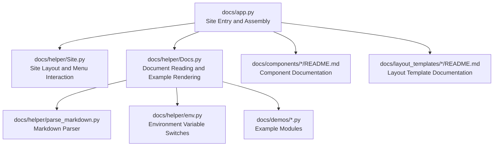
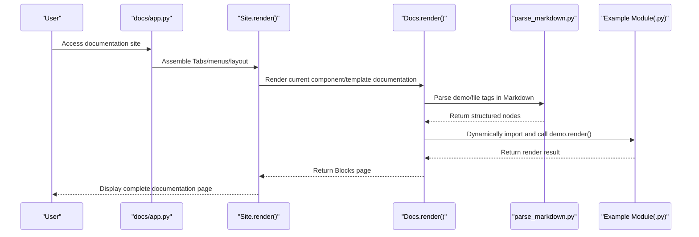
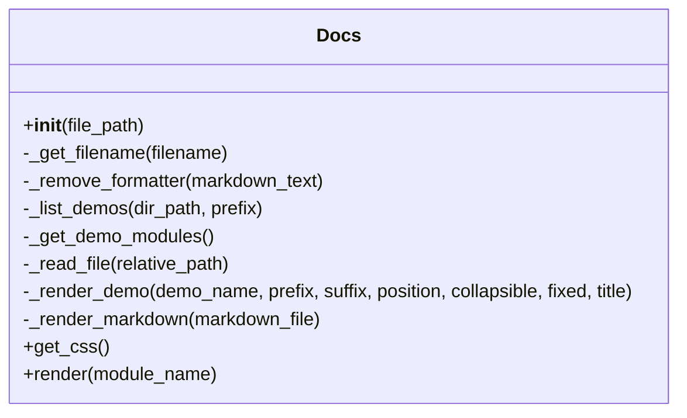
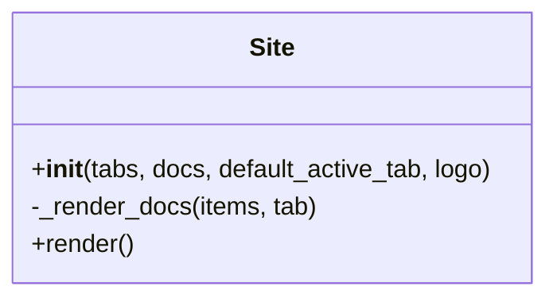
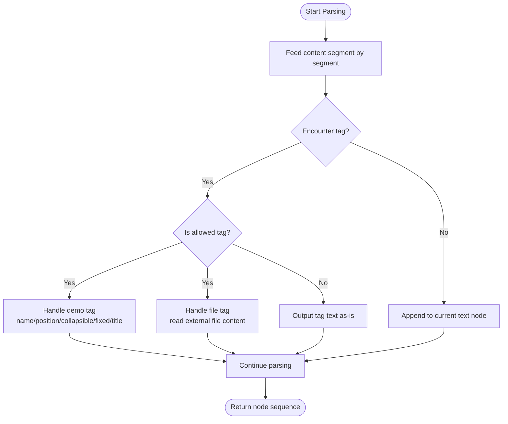
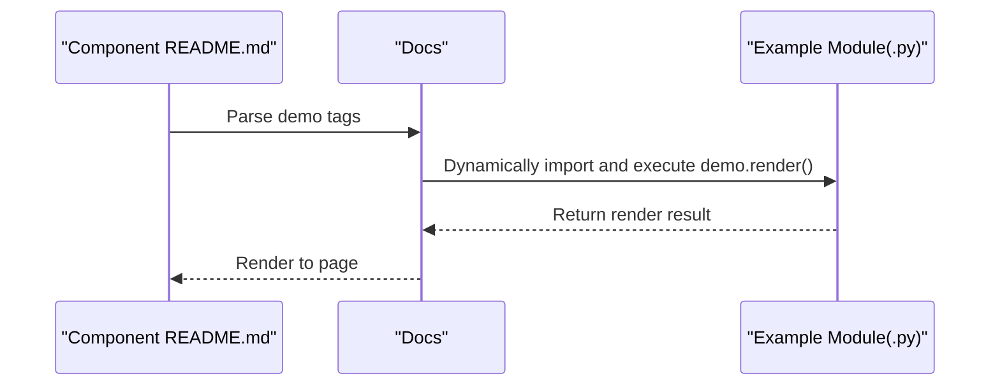
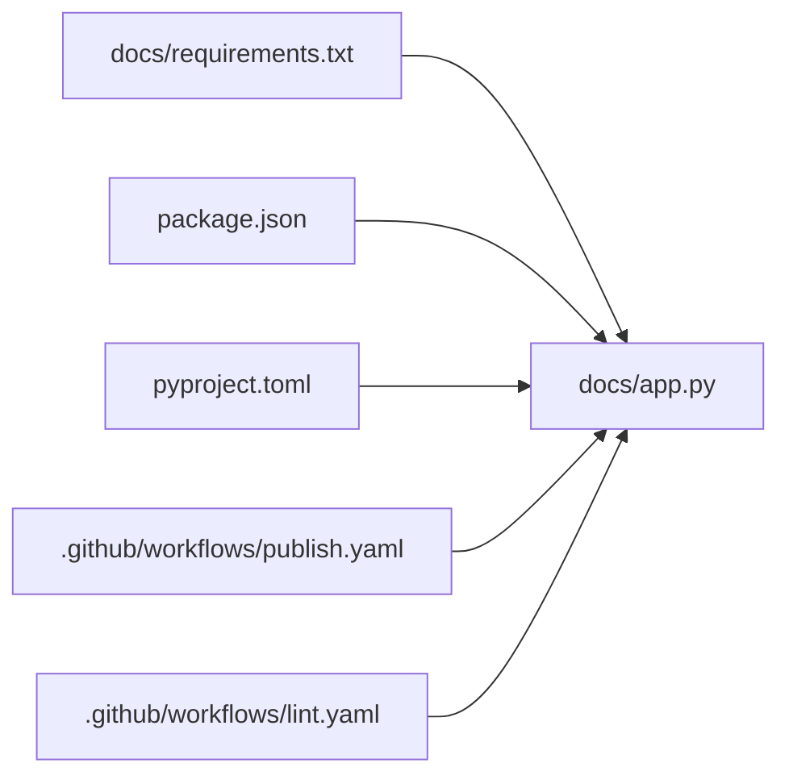

# Documentation System

<cite>
**Files referenced in this document**   
- [docs/app.py](file://docs/app.py)
- [docs/helper/Docs.py](file://docs/helper/Docs.py)
- [docs/helper/Site.py](file://docs/helper/Site.py)
- [docs/helper/parse_markdown.py](file://docs/helper/parse_markdown.py)
- [docs/helper/env.py](file://docs/helper/env.py)
- [docs/components/antd/button/README.md](file://docs/components/antd/button/README.md)
- [docs/components/antd/button/app.py](file://docs/components/antd/button/app.py)
- [docs/layout_templates/chatbot/README.md](file://docs/layout_templates/chatbot/README.md)
- [docs/layout_templates/chatbot/app.py](file://docs/layout_templates/chatbot/app.py)
- [docs/demos/example.py](file://docs/demos/example.py)
- [docs/requirements.txt](file://docs/requirements.txt)
- [.github/workflows/publish.yaml](file://.github/workflows/publish.yaml)
- [.github/workflows/lint.yaml](file://.github/workflows/lint.yaml)
- [package.json](file://package.json)
- [pyproject.toml](file://pyproject.toml)
- [README.md](file://README.md)
</cite>

## Table of Contents

1. [Introduction](#introduction)
2. [Project Structure](#project-structure)
3. [Core Components](#core-components)
4. [Architecture Overview](#architecture-overview)
5. [Detailed Component Analysis](#detailed-component-analysis)
6. [Dependency Analysis](#dependency-analysis)
7. [Performance Considerations](#performance-considerations)
8. [Troubleshooting Guide](#troubleshooting-guide)
9. [Conclusion](#conclusion)
10. [Appendix](#appendix)

## Introduction

This guide is intended for maintainers and contributors, systematically explaining the architecture and usage of the ModelScope Studio documentation system. It covers the following topics:

- Overall architecture and build process of the documentation site
- Component documentation generation mechanism (Markdown parsing, example rendering)
- Example management and demo module loading
- Multi-language support and environment variable handling
- Usage of Docs and Site utility classes
- Documentation update workflow and release strategy

## Project Structure

The documentation system is located in the `docs` directory, organized by "component/template classification + helper tools":

- `docs/app.py`: Site entry and routing, menu, tab layout, site assembly
- `docs/helper/`: Documentation parsing and site rendering utilities
  - `Docs.py`: Document reading, Markdown parsing, example module loading and rendering
  - `Site.py`: Overall site layout, menu interaction, responsive sidebar and content area
  - `parse_markdown.py`: Custom Markdown parser supporting demo/file tags
  - `env.py`: Environment variable switches (whether in ModelScope Studio environment)
- `docs/components/antd/button/...`: Documentation and standalone example pages for each component
- `docs/layout_templates/chatbot/...`: Layout template example pages
- `docs/demos/example.py`: Example demo script template
- `docs/requirements.txt`: Dependencies required to run the documentation site
- `.github/workflows/publish.yaml`, `lint.yaml`: CI release and code checks
- `package.json`, `pyproject.toml`: Frontend and backend build scripts and packaging configuration
- `README.md`: Project overview and development guidelines

**Diagram Sources**

- [docs/app.py:1-595](file://docs/app.py#L1-L595)
- [docs/helper/Site.py:1-255](file://docs/helper/Site.py#L1-L255)
- [docs/helper/Docs.py:1-178](file://docs/helper/Docs.py#L1-L178)
- [docs/helper/parse_markdown.py:1-84](file://docs/helper/parse_markdown.py#L1-L84)
- [docs/helper/env.py:1-4](file://docs/helper/env.py#L1-L4)

**Section Sources**

- [docs/app.py:1-595](file://docs/app.py#L1-L595)
- [docs/requirements.txt:1-4](file://docs/requirements.txt#L1-L4)
- [package.json:1-55](file://package.json#L1-L55)
- [pyproject.toml:1-257](file://pyproject.toml#L1-L257)

## Core Components

- Docs utility class
  - Function: Scans Markdown files and `demos` subdirectory in the same directory; selects Chinese/English documentation based on environment variables; parses Markdown and renders examples; collects example module styles; renders uniformly as Gradio Blocks pages.
  - Key points: Supports demo tags (name, position, collapsible, fixed, title) and demo-prefix/demo-suffix injection; supports file tags for inlining external file content.
- Site utility class
  - Function: Assembles top-level tabs and sidebar menus; renders corresponding documentation in content area; handles menu switch events; dynamically controls sidebar size and visibility; merges CSS from all example modules.
- Markdown parser
  - Function: Lightweight parser based on HTMLParser, recognizing demo/file tags, outputting structured node sequences (text/example) for Docs rendering.
- Environment variable handling
  - Function: Controls whether in Studio environment via `MODELSCOPE_ENVIRONMENT`, determining document naming and filtering rules.

**Section Sources**

- [docs/helper/Docs.py:12-178](file://docs/helper/Docs.py#L12-L178)
- [docs/helper/Site.py:9-255](file://docs/helper/Site.py#L9-L255)
- [docs/helper/parse_markdown.py:12-84](file://docs/helper/parse_markdown.py#L12-L84)
- [docs/helper/env.py:1-4](file://docs/helper/env.py#L1-L4)

## Architecture Overview

The documentation system uses `docs/app.py` as the entry point, with Site responsible for overall layout and menu interaction, and Docs responsible for rendering individual component or template documentation. The Markdown parser converts demo/file tags in documentation into executable rendering instructions, and example modules are dynamically imported by Docs and rendered in the page.

**Diagram Sources**

- [docs/app.py:577-590](file://docs/app.py#L577-L590)
- [docs/helper/Site.py:41-254](file://docs/helper/Site.py#L41-L254)
- [docs/helper/Docs.py:171-178](file://docs/helper/Docs.py#L171-L178)
- [docs/helper/parse_markdown.py:80-84](file://docs/helper/parse_markdown.py#L80-L84)

## Detailed Component Analysis

### Docs Utility Class (Document Rendering)

- Initialization and file discovery
  - Scans `.md` files in the same directory, filtering Chinese/English versions by environment variable; automatically discovers and dynamically imports `.py` example modules in the `demos` subdirectory.
- Markdown parsing
  - Uses `parse_markdown` to convert documentation into a node sequence, supporting three node types: text, demo, file.
- Example rendering
  - Supports demo tag attributes: name, position, collapsible, fixed, title; supports demo-prefix/demo-suffix for injecting prefix/suffix code; supports file tag for inlining external file content.
- CSS merging
  - Iterates through example modules, collecting `css` fields and injecting into the page, solving style loss issues in multi-Blocks scenarios.

**Diagram Sources**

- [docs/helper/Docs.py:12-178](file://docs/helper/Docs.py#L12-L178)

**Section Sources**

- [docs/helper/Docs.py:12-178](file://docs/helper/Docs.py#L12-L178)
- [docs/helper/parse_markdown.py:12-84](file://docs/helper/parse_markdown.py#L12-L84)

### Site Utility Class (Site Layout)

- Tabs and menus
  - Defines multiple Tabs (Overview, Base Components, Advanced Components, Antd Components, Antdx Components), each Tab can contain inline menus and content areas.
- Event interaction
  - Top-level menus and sidebar menus interact; clicking menu items synchronously updates `active_key` and visible content; applies with default sidebar size based on screen width on mount.
- Responsive layout
  - Uses Splitter and Layout for adaptive sidebar and content area; hides sidebar on small screen devices and provides inline menus.
- CSS injection
  - Merges CSS from all example modules to ensure example styles take effect.

**Diagram Sources**

- [docs/helper/Site.py:9-255](file://docs/helper/Site.py#L9-L255)

**Section Sources**

- [docs/helper/Site.py:9-255](file://docs/helper/Site.py#L9-L255)

### Markdown Parser (demo/file tags)

- Supported tags
  - demo: Contains attributes like name, position, collapsible, fixed, title; used to identify example modules to render.
  - demo-prefix/demo-suffix: Used to inject additional code snippets before/after demo.
  - file: Inline reads file content from specified path and inserts at current position.
- Parsing flow
  - Based on HTMLParser, outputs non-allowed tags as-is; constructs corresponding nodes when demo/file tags are encountered; maintains tag stack for correct closing.

**Diagram Sources**

- [docs/helper/parse_markdown.py:12-84](file://docs/helper/parse_markdown.py#L12-L84)

**Section Sources**

- [docs/helper/parse_markdown.py:12-84](file://docs/helper/parse_markdown.py#L12-L84)

### Environment Variables and Multi-language Support

- Environment variables
  - When `MODELSCOPE_ENVIRONMENT=studio`, Chinese documentation and specific filtering logic are enabled; otherwise only English documentation is shown.
- Document naming and filtering
  - Chinese documentation files end with `-zh_CN.md`; English documentation has no suffix; Docs filters available documentation files based on environment variables during initialization.

**Section Sources**

- [docs/helper/env.py:1-4](file://docs/helper/env.py#L1-L4)
- [docs/helper/Docs.py:17-31](file://docs/helper/Docs.py#L17-L31)

### Component Documentation and Example Management

- Component documentation
  - Each component directory contains `README.md` and `app.py`; README.md uses demo tags to reference example modules; `app.py` renders the component's documentation page via Docs.
- Example modules
  - `.py` files are placed in the `demos` directory; Docs dynamically imports and calls their `demo.render()` method for rendering; you can define `css` strings in example modules to inject styles.
- Layout templates
  - Reusable page layout examples are provided under the `layout_templates` directory, also rendered via `app.py` and Docs.

**Diagram Sources**

- [docs/components/antd/button/README.md:1-8](file://docs/components/antd/button/README.md#L1-L8)
- [docs/components/antd/button/app.py:1-7](file://docs/components/antd/button/app.py#L1-L7)
- [docs/helper/Docs.py:82-161](file://docs/helper/Docs.py#L82-L161)

**Section Sources**

- [docs/components/antd/button/README.md:1-8](file://docs/components/antd/button/README.md#L1-L8)
- [docs/components/antd/button/app.py:1-7](file://docs/components/antd/button/app.py#L1-L7)
- [docs/layout_templates/chatbot/README.md:1-20](file://docs/layout_templates/chatbot/README.md#L1-L20)
- [docs/layout_templates/chatbot/app.py:1-7](file://docs/layout_templates/chatbot/app.py#L1-L7)
- [docs/demos/example.py:1-11](file://docs/demos/example.py#L1-L11)

## Dependency Analysis

- Runtime dependencies
  - `docs/requirements.txt` specifies gradio and modelscope_studio versions, ensuring documentation site compatibility with the component library.
- Build and scripts
  - `package.json` provides dev/build/publish scripts; `pyproject.toml` defines backend packaging and artifact manifest.
- CI workflows
  - `publish.yaml`: Installs dependencies, builds, and publishes to PyPI on branch push, creates tags and releases.
  - `lint.yaml`: Executes code style and formatting checks.

**Diagram Sources**

- [docs/requirements.txt:1-4](file://docs/requirements.txt#L1-L4)
- [package.json:1-55](file://package.json#L1-L55)
- [pyproject.toml:1-257](file://pyproject.toml#L1-L257)
- [.github/workflows/publish.yaml:1-74](file://.github/workflows/publish.yaml#L1-L74)
- [.github/workflows/lint.yaml:1-34](file://.github/workflows/lint.yaml#L1-L34)

**Section Sources**

- [docs/requirements.txt:1-4](file://docs/requirements.txt#L1-L4)
- [package.json:1-55](file://package.json#L1-L55)
- [pyproject.toml:1-257](file://pyproject.toml#L1-L257)
- [.github/workflows/publish.yaml:1-74](file://.github/workflows/publish.yaml#L1-L74)
- [.github/workflows/lint.yaml:1-34](file://.github/workflows/lint.yaml#L1-L34)

## Performance Considerations

- CSS injection in multi-Blocks scenarios
  - Site merges CSS from all example modules to avoid style loss caused by repeated injection in multiple Blocks.
- Example module lazy loading
  - Docs only dynamically imports example modules when needed, reducing memory footprint at startup.
- Responsive layout optimization
  - Sidebar size dynamically adjusts based on screen width, improving mobile experience.

**Section Sources**

- [docs/helper/Site.py:55-73](file://docs/helper/Site.py#L55-L73)
- [docs/helper/Docs.py:58-75](file://docs/helper/Docs.py#L58-L75)
- [docs/helper/Site.py:241-249](file://docs/helper/Site.py#L241-L249)

## Troubleshooting Guide

- Documentation not showing Chinese or English incorrectly
  - Check whether `MODELSCOPE_ENVIRONMENT` is set to `studio` or not set; confirm README file naming follows `-zh_CN.md` convention.
- Examples not rendering or throwing errors
  - Confirm that corresponding `.py` files exist in the `demos` directory and contain `demo.render()`; check if example modules can be dynamically imported.
- Page style abnormalities
  - Confirm that example modules have defined `css` strings; Site will merge these styles; if still abnormal, check if multiple Blocks cause styles not being injected.
- Startup failure or port occupied
  - Use the dev script in `package.json` to start; ensure port is not occupied; if necessary, set `ssr_mode=false` in launch parameters.

**Section Sources**

- [docs/helper/env.py:1-4](file://docs/helper/env.py#L1-L4)
- [docs/helper/Docs.py:58-75](file://docs/helper/Docs.py#L58-L75)
- [docs/helper/Site.py:55-73](file://docs/helper/Site.py#L55-L73)
- [README.md:32-32](file://README.md#L32-L32)
- [package.json:15-15](file://package.json#L15-L15)

## Conclusion

The ModelScope Studio documentation system, through the Docs and Site utility classes combined with a custom Markdown parser and example module dynamic loading mechanism, achieves unified rendering and multi-language support for component documentation and layout templates. With clear directory structure and CI workflow, maintainers can efficiently extend documentation content, add examples, and publish updates.

## Appendix

### Usage and Maintenance Guide (Operation Steps)

- Write component documentation
  - Add `README.md` under `docs/components/<category>/<component>/`, using demo tags to reference example modules; for Chinese/English bilingual support, provide both `.md` and `-zh_CN.md` files.
- Add example code
  - Add `.py` files under `docs/demos/`, exporting `demo.render()` method; if styles are needed, export `css` string.
- Configure multi-language support
  - Set `MODELSCOPE_ENVIRONMENT=studio` to enable Chinese documentation; maintain English documentation naming convention.
- Run and debug
  - Use `pnpm dev` to start documentation site; modify `tabs/docs` mapping in `docs/app.py` to register new components or templates.
- Publish and version management
  - Use `ci:publish` script in `package.json` to publish to PyPI; CI workflow will automatically create tags and releases when conditions are met.

**Section Sources**

- [docs/components/antd/button/README.md:1-8](file://docs/components/antd/button/README.md#L1-L8)
- [docs/components/antd/button/app.py:1-7](file://docs/components/antd/button/app.py#L1-L7)
- [docs/layout_templates/chatbot/README.md:1-20](file://docs/layout_templates/chatbot/README.md#L1-L20)
- [docs/layout_templates/chatbot/app.py:1-7](file://docs/layout_templates/chatbot/app.py#L1-L7)
- [docs/demos/example.py:1-11](file://docs/demos/example.py#L1-L11)
- [docs/helper/env.py:1-4](file://docs/helper/env.py#L1-L4)
- [package.json:8-24](file://package.json#L8-L24)
- [.github/workflows/publish.yaml:59-74](file://.github/workflows/publish.yaml#L59-L74)
