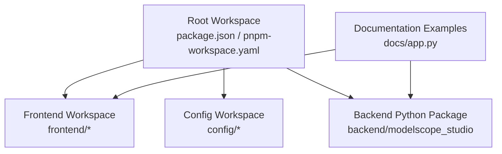
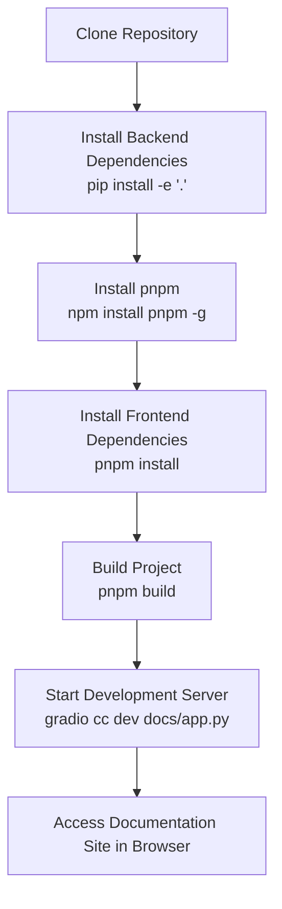
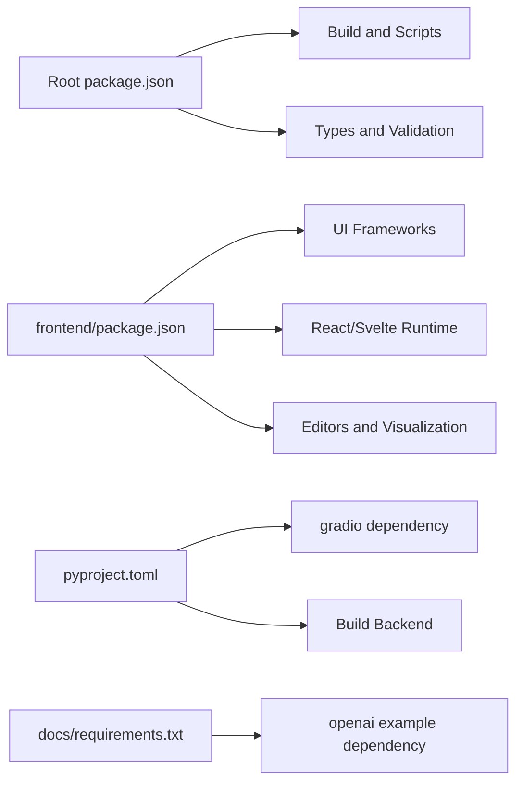

# Environment Setup

<cite>
**Files referenced in this document**
- [README.md](file://README.md)
- [package.json](file://package.json)
- [pnpm-workspace.yaml](file://pnpm-workspace.yaml)
- [pyproject.toml](file://pyproject.toml)
- [frontend/package.json](file://frontend/package.json)
- [frontend/defineConfig.js](file://frontend/defineConfig.js)
- [frontend/tsconfig.json](file://frontend/tsconfig.json)
- [tsconfig.json](file://tsconfig.json)
- [svelte-tsconfig.json](file://svelte-tsconfig.json)
- [docs/requirements.txt](file://docs/requirements.txt)
- [docs/app.py](file://docs/app.py)
- [scripts/publish-to-pypi.mts](file://scripts/publish-to-pypi.mts)
</cite>

## Table of Contents

1. [Introduction](#introduction)
2. [Project Structure](#project-structure)
3. [Core Components](#core-components)
4. [Architecture Overview](#architecture-overview)
5. [Detailed Component Analysis](#detailed-component-analysis)
6. [Dependency Analysis](#dependency-analysis)
7. [Performance Considerations](#performance-considerations)
8. [Troubleshooting Guide](#troubleshooting-guide)
9. [Conclusion](#conclusion)
10. [Appendix](#appendix)

## Introduction

This guide is intended for engineers and contributors who want to set up and develop ModelScope Studio locally. It covers system requirements, Node.js and Python environment configuration, dependency installation, pnpm workspace setup, backend and frontend dependency installation, build process, development server startup and verification methods, and provides considerations for multiple operating systems and common problem solutions.

## Project Structure

The project uses a two-level workspace design:

- Root workspace: Contains frontend sub-packages (`antd`, `antdx`, `base`, `pro`), configuration packages (`lint-config`, `changelog`), and root-level scripts and configurations.
- Backend Python package: Located at `backend/modelscope_studio`, integrated into the Python environment via editable install.
- Documentation and examples: The `docs` directory provides example applications and dependency constraints.

**Diagram Sources**

- [pnpm-workspace.yaml:1-12](file://pnpm-workspace.yaml#L1-L12)
- [package.json:1-55](file://package.json#L1-L55)
- [docs/app.py:1-595](file://docs/app.py#L1-L595)

**Section Sources**

- [pnpm-workspace.yaml:1-12](file://pnpm-workspace.yaml#L1-L12)
- [package.json:1-55](file://package.json#L1-L55)
- [README.md:80-101](file://README.md#L80-L101)

## Core Components

- Root-level scripts and toolchain: Commands for build, development, formatting, validation, etc. are defined via `package.json`.
- pnpm workspace: Unified management of frontend sub-packages and configuration packages, ensuring dependency version consistency and incremental builds.
- Python build and packaging: Uses hatchling as the build backend, supporting source distribution and wheel distribution.
- Documentation site: Based on Gradio's `docs/app.py`, provides component demonstrations and navigation.
- Frontend project: Vite + Svelte 5, with custom plugins and type configurations.

**Section Sources**

- [package.json:8-25](file://package.json#L8-L25)
- [pnpm-workspace.yaml:1-12](file://pnpm-workspace.yaml#L1-L12)
- [pyproject.toml:1-257](file://pyproject.toml#L1-L257)
- [docs/app.py:577-595](file://docs/app.py#L577-L595)
- [frontend/package.json:1-59](file://frontend/package.json#L1-L59)

## Architecture Overview

The diagram below shows the overall process from cloning the repository to starting the documentation site during development:

**Diagram Sources**

- [README.md:82-101](file://README.md#L82-L101)
- [package.json:8-16](file://package.json#L8-L16)
- [docs/app.py:592-595](file://docs/app.py#L592-L595)

## Detailed Component Analysis

### System Requirements and Prerequisites

- Python
  - Minimum version for local development: Python 3.8+
  - CI/CD release environment: Python 3.12 (specified by `.github/workflows/publish.yaml`)
  - Recommended to use virtual environment for dependency isolation
- Node.js
  - Minimum version: Node.js 18.0+, recommended 20+ or newer
  - Uses pnpm as package manager; recommend installing pnpm globally
- Operating System
  - Linux/macOS/Windows all supported, be aware of path separator and permission differences
- Optional: Docker (for twine upload in the release process)

**Section Sources**

- [pyproject.toml:15](file://pyproject.toml#L15)
- [README.md:82-101](file://README.md#L82-L101)

### Clone and Initialize

- Clone the repository locally
- Execute backend editable install in the root directory to make the Python environment recognize `backend/modelscope_studio`
- Install pnpm globally
- Execute `pnpm install` in the root directory to install all workspace dependencies
- Execute `pnpm build` to complete frontend build

**Section Sources**

- [README.md:82-101](file://README.md#L82-L101)
- [package.json:8-16](file://package.json#L8-L16)

### Backend Dependency Installation (Python)

- Use editable install to integrate `backend/modelscope_studio` into the current Python environment
- Python version must meet the minimum requirements in `pyproject.toml`
- For release process, refer to the twine upload steps in the release script

**Section Sources**

- [pyproject.toml:15](file://pyproject.toml#L15)
- [scripts/publish-to-pypi.mts:22-42](file://scripts/publish-to-pypi.mts#L22-L42)

### Frontend Dependency Installation and Build

- pnpm workspace contains multiple frontend sub-packages and configuration packages; unified installation avoids version conflicts
- Frontend project uses Vite and Svelte 5; `defineConfig.js` provides plugin and preprocessing configuration
- `tsconfig.json` and `svelte-tsconfig.json` provide type checking and path alias configuration

**Section Sources**

- [pnpm-workspace.yaml:1-12](file://pnpm-workspace.yaml#L1-L12)
- [frontend/package.json:1-59](file://frontend/package.json#L1-L59)
- [frontend/defineConfig.js:1-19](file://frontend/defineConfig.js#L1-L19)
- [frontend/tsconfig.json:1-8](file://frontend/tsconfig.json#L1-L8)
- [tsconfig.json:1-33](file://tsconfig.json#L1-L33)
- [svelte-tsconfig.json:1-4](file://svelte-tsconfig.json#L1-L4)

### Development Server Startup and Verification

- Use `gradio cc dev docs/app.py` to start the documentation site
- The documentation site will automatically scan example applications under `docs/components` and `docs/layout_templates`
- Access the default address (output by Gradio) to view component demonstrations and navigation

**Section Sources**

- [README.md:96-101](file://README.md#L96-L101)
- [docs/app.py:10,19-61,577-595](file://docs/app.py#L10,L19-L61,L577-L595)

### Release and Packaging (Optional)

- The release script first executes `pip install -e '.'` and `pnpm run build`, then checks if `dist` exists
- If the version does not exist on PyPI, it calls `twine` to upload `dist/*` artifacts

**Section Sources**

- [scripts/publish-to-pypi.mts:14-55](file://scripts/publish-to-pypi.mts#L14-L55)

## Dependency Analysis

- Root-level dependencies
  - Build and scripts: gradio cc, rimraf, tsx, husky, etc.
  - Types and validation: typescript, svelte-check, eslint, stylelint, prettier
- Frontend dependencies
  - UI frameworks: antd, @ant-design/x, @ant-design/icons
  - React/Svelte: react, react-dom, svelte 5
  - Editors and visualization: monaco-editor, @monaco-editor/react, mermaid, katex
- Python dependencies
  - Core: gradio (version range constraint)
  - Build: hatchling, hatch-requirements-txt, hatch-fancy-pypi-readme
  - Optional: openai (used in documentation examples)

**Diagram Sources**

- [package.json:26-52](file://package.json#L26-L52)
- [frontend/package.json:8-40](file://frontend/package.json#L8-L40)
- [pyproject.toml:2,42-43](file://pyproject.toml#L2,L42-L43)
- [docs/requirements.txt:1-4](file://docs/requirements.txt#L1-L4)

**Section Sources**

- [package.json:26-52](file://package.json#L26-L52)
- [frontend/package.json:8-40](file://frontend/package.json#L8-L40)
- [pyproject.toml:2,42-43](file://pyproject.toml#L2,L42-L43)
- [docs/requirements.txt:1-4](file://docs/requirements.txt#L1-L4)

## Performance Considerations

- Use pnpm workspace for unified dependency versions, reducing repeated installations and memory footprint
- Frontend build targets ESNext, leveraging modern browser features for improved runtime efficiency
- Documentation site loads component examples on-demand, avoiding loading all resources at once
- In large projects, it's recommended to enable TypeScript's `noEmit` and `svelte-check` to catch type issues early

## Troubleshooting Guide

- Backend dependency installation failed
  - Confirm Python version meets >=3.8
  - Use virtual environment to avoid global pollution
  - Reference the `pip install -e '.'` process in the release script for troubleshooting
- pnpm installation failed or dependencies incompatible
  - Clear cache and retry: delete `node_modules` and `pnpm-lock.yaml`, then reinstall
  - Confirm pnpm version matches workspace configuration
- Build failed
  - Check whether `pnpm build` has been executed
  - Confirm that the `dist` directory was generated
- Development server inaccessible
  - Confirm `gradio cc dev docs/app.py` has been executed
  - Check firewall and port occupation
  - If using Hugging Face Space, set `ssr_mode=False` as indicated in README

**Section Sources**

- [pyproject.toml:15](file://pyproject.toml#L15)
- [scripts/publish-to-pypi.mts:22-30](file://scripts/publish-to-pypi.mts#L22-L30)
- [README.md:32,96-101](file://README.md#L32,L96-L101)

## Conclusion

By following the steps above, you can successfully set up the ModelScope Studio development environment locally, complete backend and frontend dependency installation, build, and documentation site startup. If you encounter issues, you can troubleshoot item by item according to the troubleshooting section of this guide. It's recommended to clear cache and use a virtual environment before making changes to ensure consistency and reproducibility.

## Appendix

### Common Commands Quick Reference

- Clone and Initialize
  - `pip install -e '.'`
  - `npm install pnpm -g`
  - `pnpm install`
  - `pnpm build`
- Start Development Server
  - `gradio cc dev docs/app.py`
- Format and Validate
  - `pnpm run lint`
  - `pnpm run format`
- Version and Release (CI)
  - `pnpm run version`
  - `pnpm run ci:version`
  - `pnpm run ci:publish`

**Section Sources**

- [README.md:82-101](file://README.md#L82-L101)
- [package.json:8-25](file://package.json#L8-L25)
