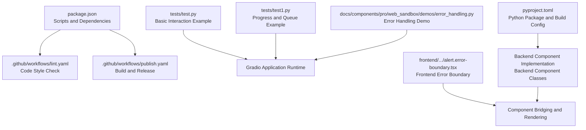
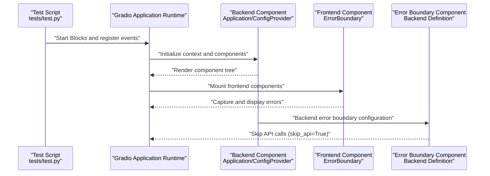
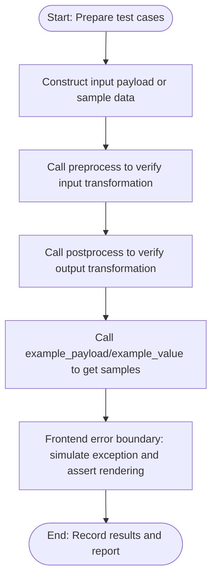
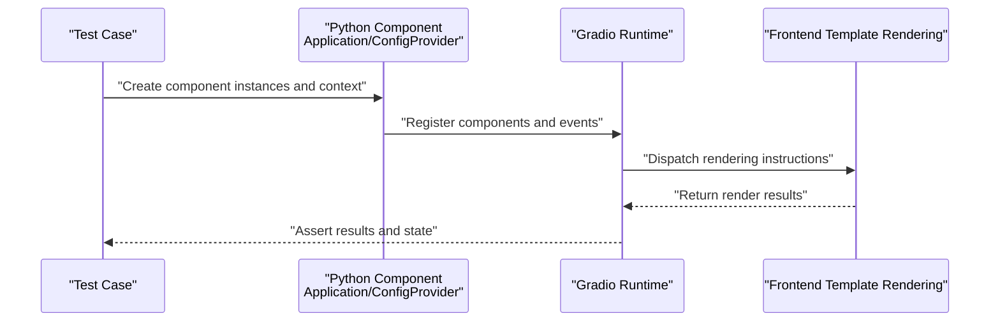
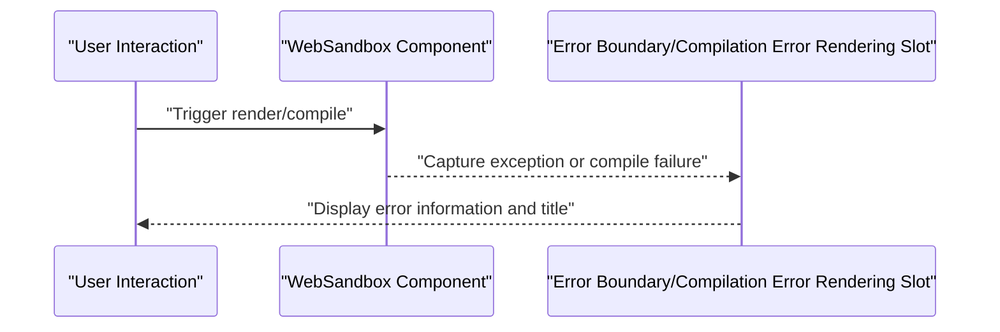
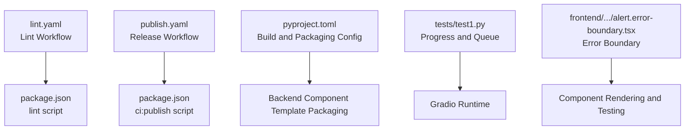

# Testing and Debugging

<cite>
**Files referenced in this document**
- [package.json](file://package.json)
- [.github/workflows/lint.yaml](file://.github/workflows/lint.yaml)
- [.github/workflows/publish.yaml](file://.github/workflows/publish.yaml)
- [pyproject.toml](file://pyproject.toml)
- [tests/test.py](file://tests/test.py)
- [tests/test1.py](file://tests/test1.py)
- [frontend/antd/alert/error-boundary/alert.error-boundary.tsx](file://frontend/antd/alert/error-boundary/alert.error-boundary.tsx)
- [backend/modelscope_studio/components/antd/alert/error_boundary/__init__.py](file://backend/modelscope_studio/components/antd/alert/error_boundary/__init__.py)
- [backend/modelscope_studio/components/pro/monaco_editor/__init__.py](file://backend/modelscope_studio/components/pro/monaco_editor/__init__.py)
- [docs/components/pro/web_sandbox/demos/error_handling.py](file://docs/components/pro/web_sandbox/demos/error_handling.py)
</cite>

## Table of Contents

1. [Introduction](#introduction)
2. [Project Structure](#project-structure)
3. [Core Components](#core-components)
4. [Architecture Overview](#architecture-overview)
5. [Detailed Component Analysis](#detailed-component-analysis)
6. [Dependency Analysis](#dependency-analysis)
7. [Performance Considerations](#performance-considerations)
8. [Troubleshooting Guide](#troubleshooting-guide)
9. [Conclusion](#conclusion)
10. [Appendix](#appendix)

## Introduction

This guide is intended for developers and maintainers of ModelScope Studio, systematically introducing the project's testing and debugging strategies. It covers unit testing, integration testing, and end-to-end test writing and execution methods; debugging techniques, common tool usage, common problem diagnosis and resolution paths, as well as performance testing and optimization recommendations. The documentation is based on existing scripts, workflows, and examples in the repository to ensure operability and traceability.

## Project Structure

ModelScope Studio is a third-party component library based on Gradio, with a separated frontend and backend: the frontend builds components using Svelte (TypeScript), while the backend bridges frontend templates with the Gradio runtime through Python components. Testing and quality assurance mainly rely on the following resources:

- Scripts and workflows: Automated checks and releases through scripts in `package.json` and GitHub Actions workflows.
- Examples and demos: The `tests` directory contains basic functional demo scripts, while `demos` under `docs` provides more complex interactive scenarios and error handling examples.
- Component implementations: Backend components define interfaces such as `preprocess`/`postprocess`, `example_payload`/`example_value` for testing and verification.

**Diagram Sources**

- [package.json:1-55](file://package.json#L1-L55)
- [.github/workflows/lint.yaml:1-34](file://.github/workflows/lint.yaml#L1-L34)
- [.github/workflows/publish.yaml:1-74](file://.github/workflows/publish.yaml#L1-L74)
- [tests/test.py:1-17](file://tests/test.py#L1-L17)
- [tests/test1.py:1-15](file://tests/test1.py#L1-L15)
- [docs/components/pro/web_sandbox/demos/error_handling.py:1-28](file://docs/components/pro/web_sandbox/demos/error_handling.py#L1-L28)
- [pyproject.toml:1-257](file://pyproject.toml#L1-L257)
- [frontend/antd/alert/error-boundary/alert.error-boundary.tsx:1-34](file://frontend/antd/alert/error-boundary/alert.error-boundary.tsx#L1-L34)

**Section Sources**

- [package.json:1-55](file://package.json#L1-L55)
- [.github/workflows/lint.yaml:1-34](file://.github/workflows/lint.yaml#L1-L34)
- [.github/workflows/publish.yaml:1-74](file://.github/workflows/publish.yaml#L1-L74)
- [pyproject.toml:1-257](file://pyproject.toml#L1-L257)

## Core Components

- Test scripts and demos
  - `tests/test.py`: Demonstrates combined usage of Application and ConfigProvider, as well as simple interactions with button click events and input/output.
  - `tests/test1.py`: Demonstrates usage of progress bars and queues in Gradio interfaces.
- Error handling and boundaries
  - Frontend error boundary: `frontend/antd/alert/error-boundary/alert.error-boundary.tsx` bridges Ant Design's ErrorBoundary to the Svelte component system via `sveltify`.
  - Backend error boundary: `backend/modelscope_studio/components/antd/alert/error_boundary/__init__.py` defines an error boundary component with slots support, `skip_api=True` indicates it doesn't directly expose API.
- Integration point examples
  - `docs/components/pro/web_sandbox/demos/error_handling.py`: Demonstrates WebSandbox behavior under render errors, compilation errors, and custom compilation error rendering, suitable for end-to-end testing and regression validation.

**Section Sources**

- [tests/test.py:1-17](file://tests/test.py#L1-L17)
- [tests/test1.py:1-15](file://tests/test1.py#L1-L15)
- [frontend/antd/alert/error-boundary/alert.error-boundary.tsx:1-34](file://frontend/antd/alert/error-boundary/alert.error-boundary.tsx#L1-L34)
- [backend/modelscope_studio/components/antd/alert/error_boundary/**init**.py:20-72](file://backend/modelscope_studio/components/antd/alert/error_boundary/__init__.py#L20-L72)
- [docs/components/pro/web_sandbox/demos/error_handling.py:1-28](file://docs/components/pro/web_sandbox/demos/error_handling.py#L1-L28)

## Architecture Overview

The diagram below shows the critical path from test scripts to component rendering and error handling, reflecting testing perspectives at unit level (component interfaces), integration level (frontend-backend bridging), and end-to-end (application runtime).

**Diagram Sources**

- [tests/test.py:10-17](file://tests/test.py#L10-L17)
- [frontend/antd/alert/error-boundary/alert.error-boundary.tsx:1-34](file://frontend/antd/alert/error-boundary/alert.error-boundary.tsx#L1-L34)
- [backend/modelscope_studio/components/antd/alert/error_boundary/**init**.py:55-72](file://backend/modelscope_studio/components/antd/alert/error_boundary/__init__.py#L55-L72)

## Detailed Component Analysis

### Unit Testing: Component Interfaces and Data Flow

- Objectives
  - Verify that backend component `preprocess`/`postprocess`, `example_payload`/`example_value` behave as expected.
  - Verify that frontend components behave stably in error boundary scenarios.
- Suggested test cases
  - For backend components: construct input payload, assert `preprocess` output; construct backend value, assert `postprocess` output; call `example_payload`/`example_value` to get sample data.
  - For frontend error boundaries: simulate exception throwing, assert whether the error boundary correctly captures and renders the description.
- Reference implementation locations
  - Backend component interface definitions and examples: [backend/modelscope_studio/components/pro/monaco_editor/**init**.py:87-106](file://backend/modelscope_studio/components/pro/monaco_editor/__init__.py#L87-L106)
  - Frontend error boundary implementation: [frontend/antd/alert/error-boundary/alert.error-boundary.tsx:1-34](file://frontend/antd/alert/error-boundary/alert.error-boundary.tsx#L1-L34)

**Diagram Sources**

- [backend/modelscope_studio/components/pro/monaco_editor/**init**.py:87-106](file://backend/modelscope_studio/components/pro/monaco_editor/__init__.py#L87-L106)
- [frontend/antd/alert/error-boundary/alert.error-boundary.tsx:1-34](file://frontend/antd/alert/error-boundary/alert.error-boundary.tsx#L1-L34)

**Section Sources**

- [backend/modelscope_studio/components/pro/monaco_editor/**init**.py:87-106](file://backend/modelscope_studio/components/pro/monaco_editor/__init__.py#L87-L106)
- [frontend/antd/alert/error-boundary/alert.error-boundary.tsx:1-34](file://frontend/antd/alert/error-boundary/alert.error-boundary.tsx#L1-L34)

### Integration Testing: Frontend-Backend Bridging and Context

- Objectives
  - Verify that the bridging between Python components and frontend templates is correct, and that context (such as Application, ConfigProvider) is effective.
- Suggested test cases
  - In test scripts, combine Application and ConfigProvider, trigger component interactions, assert rendering results and state changes.
  - Use progress and queue interfaces to verify scheduling and feedback of async tasks.
- Reference implementation locations
  - Basic interaction examples: [tests/test.py:10-17](file://tests/test.py#L10-L17)
  - Progress and queue examples: [tests/test1.py:6-14](file://tests/test1.py#L6-L14)

**Diagram Sources**

- [tests/test.py:10-17](file://tests/test.py#L10-L17)
- [tests/test1.py:6-14](file://tests/test1.py#L6-L14)

**Section Sources**

- [tests/test.py:10-17](file://tests/test.py#L10-L17)
- [tests/test1.py:6-14](file://tests/test1.py#L6-L14)

### End-to-End Testing: Error Handling and Regression Validation

- Objectives
  - Verify WebSandbox stability and recoverability under render errors, compilation errors, and custom compilation error rendering.
- Suggested test cases
  - Simulate render error: click button to trigger exception, assert error message appears.
  - Simulate compilation error: pass empty template or invalid content, assert compilation error rendering slot is activated.
  - Custom compilation error rendering: via slot parameter mapping, assert title and subtitle are correctly displayed.
- Reference implementation locations
  - Error handling demo: [docs/components/pro/web_sandbox/demos/error_handling.py:1-28](file://docs/components/pro/web_sandbox/demos/error_handling.py#L1-L28)

**Diagram Sources**

- [docs/components/pro/web_sandbox/demos/error_handling.py:1-28](file://docs/components/pro/web_sandbox/demos/error_handling.py#L1-L28)

**Section Sources**

- [docs/components/pro/web_sandbox/demos/error_handling.py:1-28](file://docs/components/pro/web_sandbox/demos/error_handling.py#L1-L28)

## Dependency Analysis

- Quality and build pipeline
  - Lint workflow: Installs Python and Node dependencies, executes unified lint script, covering JS/TS, style, and Python conventions.
  - Release workflow: Executes build and release when conditions are met, and creates tags and release notes.
- Package and build configuration
  - Python packages are built with hatchling, artifacts list includes numerous component template directories, ensuring packaging completeness.
- Testing and debugging tools
  - Gradio provides queue and progress capabilities, suitable for verifying async task scheduling and progress callback performance in test scripts.
  - Frontend error boundary components use `sveltify` and ReactSlot to implement slot rendering, facilitating injection of custom error views in tests.

**Diagram Sources**

- [.github/workflows/lint.yaml:1-34](file://.github/workflows/lint.yaml#L1-L34)
- [.github/workflows/publish.yaml:1-74](file://.github/workflows/publish.yaml#L1-L74)
- [package.json:18-24](file://package.json#L18-L24)
- [pyproject.toml:45-245](file://pyproject.toml#L45-L245)
- [tests/test1.py:6-14](file://tests/test1.py#L6-L14)
- [frontend/antd/alert/error-boundary/alert.error-boundary.tsx:1-34](file://frontend/antd/alert/error-boundary/alert.error-boundary.tsx#L1-L34)

**Section Sources**

- [.github/workflows/lint.yaml:1-34](file://.github/workflows/lint.yaml#L1-L34)
- [.github/workflows/publish.yaml:1-74](file://.github/workflows/publish.yaml#L1-L74)
- [package.json:18-24](file://package.json#L18-L24)
- [pyproject.toml:45-245](file://pyproject.toml#L45-L245)

## Performance Considerations

- Async and queue
  - Using Gradio's `queue()` and `Progress` interfaces, you can verify the performance of task scheduling and progress callbacks in test scripts.
  - Reference: [tests/test1.py:6-14](file://tests/test1.py#L6-L14)
- Frontend rendering and error boundaries
  - Error boundary components should minimize additional rendering overhead to ensure quick degradation and minimal UI display in exception situations.
  - Reference: [frontend/antd/alert/error-boundary/alert.error-boundary.tsx:1-34](file://frontend/antd/alert/error-boundary/alert.error-boundary.tsx#L1-L34)
- Packaging and templates
  - The Python package's artifacts list includes numerous component templates; it's recommended to load only necessary templates during local development to reduce build time.
  - Reference: [pyproject.toml:45-245](file://pyproject.toml#L45-L245)

[This section provides general guidance and does not require specific file analysis]

## Troubleshooting Guide

- Common issues and diagnosis
  - Render errors: Use the demo in `docs/components/pro/web_sandbox/demos/error_handling.py` to confirm whether the error boundary correctly captures and renders.
  - Compilation errors: When templates are empty or have syntax errors, check whether the compilation error rendering slot is activated.
  - Slot parameter mapping: If custom error views are not taking effect, check whether parameter mapping is correctly passed to the slot.
- Debugging steps
  - Start test scripts, observe console output and page interactions.
  - Add logging or minimal rendering to frontend error boundary components to confirm exception paths.
  - Use Gradio's queue and progress interfaces to verify response time and stability of async tasks.
- Reference implementation locations
  - Error handling demo: [docs/components/pro/web_sandbox/demos/error_handling.py:1-28](file://docs/components/pro/web_sandbox/demos/error_handling.py#L1-L28)
  - Frontend error boundary: [frontend/antd/alert/error-boundary/alert.error-boundary.tsx:1-34](file://frontend/antd/alert/error-boundary/alert.error-boundary.tsx#L1-L34)

**Section Sources**

- [docs/components/pro/web_sandbox/demos/error_handling.py:1-28](file://docs/components/pro/web_sandbox/demos/error_handling.py#L1-L28)
- [frontend/antd/alert/error-boundary/alert.error-boundary.tsx:1-34](file://frontend/antd/alert/error-boundary/alert.error-boundary.tsx#L1-L34)

## Conclusion

Based on the repository's existing scripts, workflows, and examples, this guide provides testing strategies and debugging methods covering unit, integration, and end-to-end testing. During daily development, it's recommended to:

- Write unit tests centered on component interfaces and data flow;
- Write integration tests centered on context and event-driven interactions;
- Write end-to-end tests centered on error handling and interaction regression;
- Use Gradio's queue and progress capabilities for performance validation;
- Use GitHub Actions workflows to ensure code quality and release consistency.

[This section is a summary and does not require specific file analysis]

## Appendix

- Run test suite
  - Local execution: Refer to scripts in `package.json`, install dependencies first, then run the corresponding test scripts.
  - Reference: [package.json:8-24](file://package.json#L8-L24)
- Quality checks and release
  - Lint workflow: [lint.yaml:1-34](file://.github/workflows/lint.yaml#L1-L34)
  - Release workflow: [publish.yaml:1-74](file://.github/workflows/publish.yaml#L1-L74)
- Component packaging and templates
  - Python package build configuration: [pyproject.toml:45-245](file://pyproject.toml#L45-L245)

**Section Sources**

- [package.json:8-24](file://package.json#L8-L24)
- [.github/workflows/lint.yaml:1-34](file://.github/workflows/lint.yaml#L1-L34)
- [.github/workflows/publish.yaml:1-74](file://.github/workflows/publish.yaml#L1-L74)
- [pyproject.toml:45-245](file://pyproject.toml#L45-L245)
