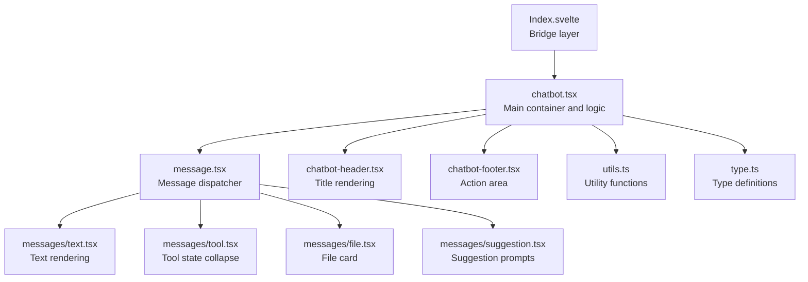
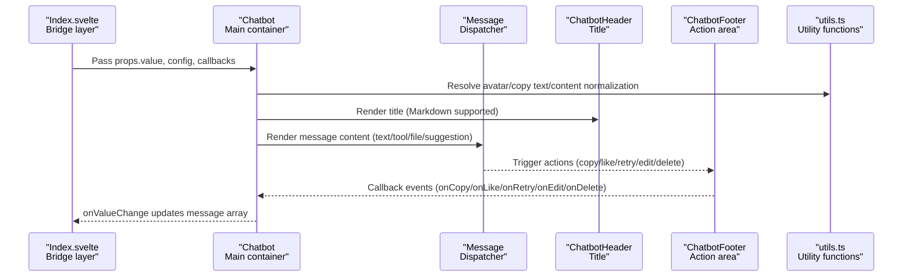
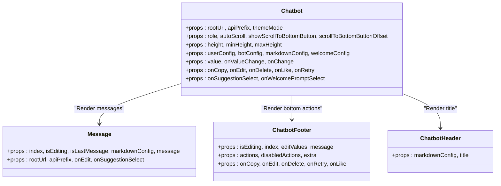
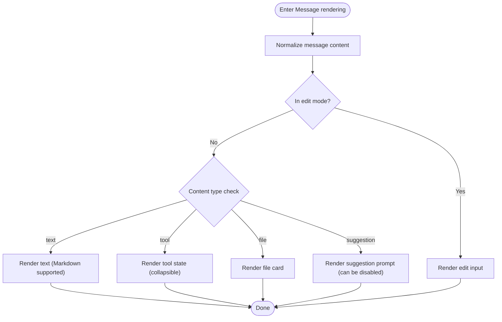
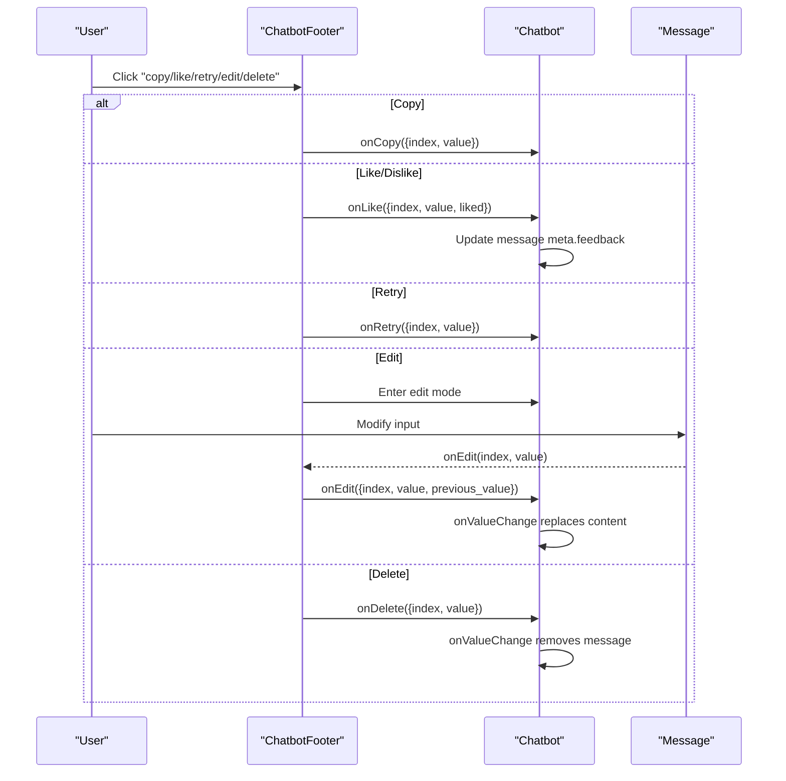
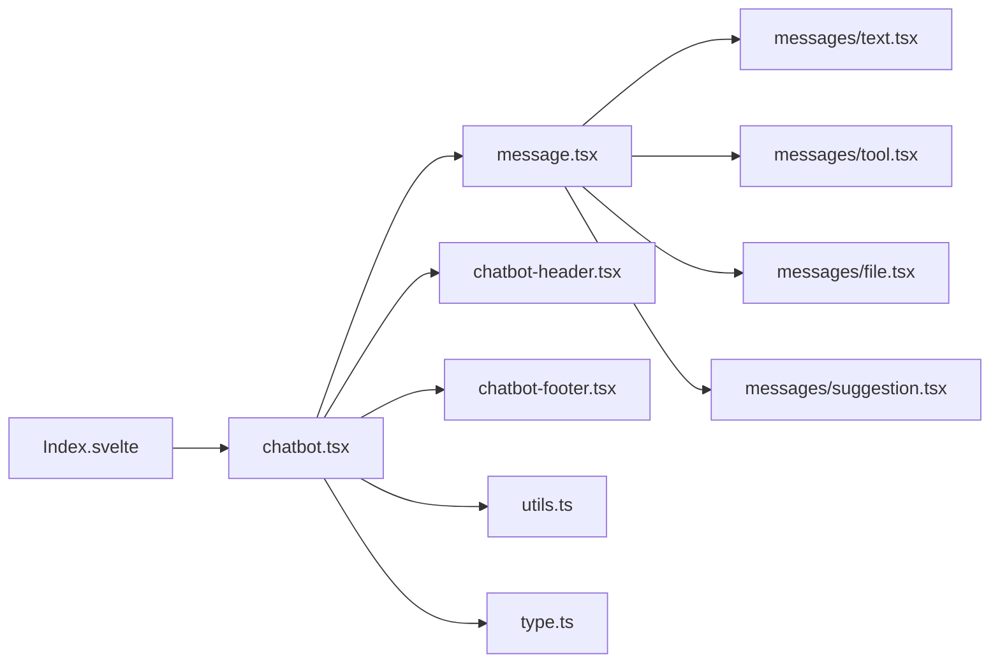

# Basic Usage

<cite>
**Files Referenced in This Document**
- [frontend/pro/chatbot/Index.svelte](file://frontend/pro/chatbot/Index.svelte)
- [frontend/pro/chatbot/chatbot.tsx](file://frontend/pro/chatbot/chatbot.tsx)
- [frontend/pro/chatbot/type.ts](file://frontend/pro/chatbot/type.ts)
- [frontend/pro/chatbot/utils.ts](file://frontend/pro/chatbot/utils.ts)
- [frontend/pro/chatbot/message.tsx](file://frontend/pro/chatbot/message.tsx)
- [frontend/pro/chatbot/chatbot-footer.tsx](file://frontend/pro/chatbot/chatbot-footer.tsx)
- [frontend/pro/chatbot/chatbot-header.tsx](file://frontend/pro/chatbot/chatbot-header.tsx)
- [frontend/pro/chatbot/messages/text.tsx](file://frontend/pro/chatbot/messages/text.tsx)
- [frontend/pro/chatbot/messages/file.tsx](file://frontend/pro/chatbot/messages/file.tsx)
- [frontend/pro/chatbot/messages/suggestion.tsx](file://frontend/pro/chatbot/messages/suggestion.tsx)
- [frontend/pro/chatbot/messages/tool.tsx](file://frontend/pro/chatbot/messages/tool.tsx)
- [docs/layout_templates/chatbot/README-zh_CN.md](file://docs/layout_templates/chatbot/README-zh_CN.md)
- [docs/layout_templates/chatbot/app.py](file://docs/layout_templates/chatbot/app.py)
</cite>

## Table of Contents

1. [Introduction](#introduction)
2. [Project Structure](#project-structure)
3. [Core Components](#core-components)
4. [Architecture Overview](#architecture-overview)
5. [Detailed Component Analysis](#detailed-component-analysis)
6. [Dependency Analysis](#dependency-analysis)
7. [Performance Considerations](#performance-considerations)
8. [Troubleshooting Guide](#troubleshooting-guide)
9. [Conclusion](#conclusion)
10. [Appendix](#appendix)

## Introduction

This chapter is aimed at beginners and introduces the basic concepts and core capabilities of the Chatbot component to help you quickly get started and build your first chatbot application. The Chatbot component provides message display, user interaction, welcome guidance, scroll behavior control, Markdown rendering, attachment display, suggestion prompts, and tool state expand/collapse functionality. Through a unified message data model and configurable role styles, you can flexibly customize the appearance and interaction of user and bot messages.

## Project Structure

The Chatbot component is located in the frontend Pro block, using Svelte as the bridge layer, with React components as the core implementation internally. It uses Ant Design X's Bubble.List to host message rendering and interaction. Message content supports multiple types: text, tool state (collapsible), file, and suggestion prompts; the bottom action area supports copy, like/dislike, retry, edit, and delete actions; the top title supports Markdown rendering; the welcome area supports guide text and suggestion prompts.

Diagram sources

- [frontend/pro/chatbot/Index.svelte:1-90](file://frontend/pro/chatbot/Index.svelte#L1-L90)
- [frontend/pro/chatbot/chatbot.tsx:1-475](file://frontend/pro/chatbot/chatbot.tsx#L1-L475)
- [frontend/pro/chatbot/message.tsx:1-184](file://frontend/pro/chatbot/message.tsx#L1-L184)
- [frontend/pro/chatbot/chatbot-header.tsx:1-23](file://frontend/pro/chatbot/chatbot-header.tsx#L1-L23)
- [frontend/pro/chatbot/chatbot-footer.tsx:1-363](file://frontend/pro/chatbot/chatbot-footer.tsx#L1-L363)
- [frontend/pro/chatbot/utils.ts:1-157](file://frontend/pro/chatbot/utils.ts#L1-L157)
- [frontend/pro/chatbot/type.ts:1-197](file://frontend/pro/chatbot/type.ts#L1-L197)
- [frontend/pro/chatbot/messages/text.tsx:1-19](file://frontend/pro/chatbot/messages/text.tsx#L1-L19)
- [frontend/pro/chatbot/messages/tool.tsx:1-46](file://frontend/pro/chatbot/messages/tool.tsx#L1-L46)
- [frontend/pro/chatbot/messages/file.tsx:1-119](file://frontend/pro/chatbot/messages/file.tsx#L1-L119)
- [frontend/pro/chatbot/messages/suggestion.tsx:1-37](file://frontend/pro/chatbot/messages/suggestion.tsx#L1-L37)

Section sources

- [frontend/pro/chatbot/Index.svelte:1-90](file://frontend/pro/chatbot/Index.svelte#L1-L90)
- [frontend/pro/chatbot/chatbot.tsx:1-475](file://frontend/pro/chatbot/chatbot.tsx#L1-L475)

## Core Components

- Main container Chatbot: Responsible for message list rendering, scroll control, welcome area, Markdown configuration, user/bot role configuration, and event callbacks (copy, edit, delete, like/dislike, retry, suggestion selection, welcome prompt selection).
- Message dispatcher Message: Dispatches to corresponding sub-components for rendering based on message content type (text/tool/file/suggestion).
- Top title ChatbotHeader: Supports Markdown rendering in titles.
- Bottom action area ChatbotFooter: Uniformly handles copy, like/dislike, retry, edit, delete, and other actions, supporting disable and confirmation dialogs.
- Utility functions utils: Provides avatar resolution, message content normalization, copy text extraction, and suggestion content traversal.
- Type definitions type: Defines message body, role configuration, Markdown configuration, file/suggestion/tool content configuration, and event data structures.
- Sub-message components: Text, tool state (collapsible), file card, suggestion prompts.

Section sources

- [frontend/pro/chatbot/chatbot.tsx:51-475](file://frontend/pro/chatbot/chatbot.tsx#L51-L475)
- [frontend/pro/chatbot/message.tsx:25-184](file://frontend/pro/chatbot/message.tsx#L25-L184)
- [frontend/pro/chatbot/chatbot-header.tsx:6-23](file://frontend/pro/chatbot/chatbot-header.tsx#L6-L23)
- [frontend/pro/chatbot/chatbot-footer.tsx:34-363](file://frontend/pro/chatbot/chatbot-footer.tsx#L34-L363)
- [frontend/pro/chatbot/utils.ts:19-157](file://frontend/pro/chatbot/utils.ts#L19-L157)
- [frontend/pro/chatbot/type.ts:27-197](file://frontend/pro/chatbot/type.ts#L27-L197)

## Architecture Overview

The diagram below shows the overall flow from the bridge layer to the React main container, then to message rendering and interaction:

Diagram sources

- [frontend/pro/chatbot/Index.svelte:64-89](file://frontend/pro/chatbot/Index.svelte#L64-L89)
- [frontend/pro/chatbot/chatbot.tsx:107-472](file://frontend/pro/chatbot/chatbot.tsx#L107-L472)
- [frontend/pro/chatbot/message.tsx:39-184](file://frontend/pro/chatbot/message.tsx#L39-L184)
- [frontend/pro/chatbot/chatbot-header.tsx:11-22](file://frontend/pro/chatbot/chatbot-header.tsx#L11-L22)
- [frontend/pro/chatbot/chatbot-footer.tsx:255-362](file://frontend/pro/chatbot/chatbot-footer.tsx#L255-L362)
- [frontend/pro/chatbot/utils.ts:46-140](file://frontend/pro/chatbot/utils.ts#L46-L140)

## Detailed Component Analysis

### Main Container Chatbot (Properties and Behavior)

- Key Properties
  - Size and layout: height, minHeight, maxHeight
  - Scroll behavior: autoScroll, showScrollToBottomButton, scrollToBottomButtonOffset
  - Role configuration: userConfig, botConfig (including avatar, styles, class names, actions, disabled actions, etc.)
  - Content configuration: markdownConfig (whether to render Markdown, root path, theme mode, etc.)
  - Welcome configuration: welcomeConfig (welcome text, icon, suggestion prompts, etc.)
  - Data and callbacks: value (message array), onValueChange, onChange, onCopy, onEdit, onDelete, onLike, onRetry, onSuggestionSelect, onWelcomePromptSelect
- Behavior Characteristics
  - Auto-scroll to bottom and "scroll to bottom" button
  - Welcome area placeholder and guidance
  - Interactions: copy, like/dislike, retry, edit, delete
  - Markdown rendering and theme adaptation
  - Message indexing and last message marking

Diagram sources

- [frontend/pro/chatbot/chatbot.tsx:51-107](file://frontend/pro/chatbot/chatbot.tsx#L51-L107)
- [frontend/pro/chatbot/message.tsx:25-49](file://frontend/pro/chatbot/message.tsx#L25-L49)
- [frontend/pro/chatbot/chatbot-footer.tsx:34-51](file://frontend/pro/chatbot/chatbot-footer.tsx#L34-L51)
- [frontend/pro/chatbot/chatbot-header.tsx:6-14](file://frontend/pro/chatbot/chatbot-header.tsx#L6-L14)

Section sources

- [frontend/pro/chatbot/chatbot.tsx:51-475](file://frontend/pro/chatbot/chatbot.tsx#L51-L475)

### Message Content Types and Rendering

- Text messages: Supports Markdown toggle and Markdown parameter pass-through
- Tool messages: Supports title and status (in-progress/complete), defaults to collapse incomplete items
- File messages: Supports image/video/audio preview cards, auto-resolves accessible links
- Suggestion messages: Supports multi-level prompts, automatically disabled when not the last message

Diagram sources

- [frontend/pro/chatbot/message.tsx:52-175](file://frontend/pro/chatbot/message.tsx#L52-L175)
- [frontend/pro/chatbot/messages/text.tsx:11-18](file://frontend/pro/chatbot/messages/text.tsx#L11-L18)
- [frontend/pro/chatbot/messages/tool.tsx:13-45](file://frontend/pro/chatbot/messages/tool.tsx#L13-L45)
- [frontend/pro/chatbot/messages/file.tsx:44-118](file://frontend/pro/chatbot/messages/file.tsx#L44-L118)
- [frontend/pro/chatbot/messages/suggestion.tsx:16-36](file://frontend/pro/chatbot/messages/suggestion.tsx#L16-L36)

Section sources

- [frontend/pro/chatbot/message.tsx:25-184](file://frontend/pro/chatbot/message.tsx#L25-L184)
- [frontend/pro/chatbot/messages/text.tsx:1-19](file://frontend/pro/chatbot/messages/text.tsx#L1-L19)
- [frontend/pro/chatbot/messages/tool.tsx:1-46](file://frontend/pro/chatbot/messages/tool.tsx#L1-L46)
- [frontend/pro/chatbot/messages/file.tsx:1-119](file://frontend/pro/chatbot/messages/file.tsx#L1-L119)
- [frontend/pro/chatbot/messages/suggestion.tsx:1-37](file://frontend/pro/chatbot/messages/suggestion.tsx#L1-L37)

### Welcome Area and Suggestion Prompts

- Welcome area: Displayed when there are no messages, supports custom styles, avatar, guide text, and suggestion prompts
- Suggestion prompts: Click enabled only for the last message; automatically disabled for other messages to prevent accidental triggers

Section sources

- [frontend/pro/chatbot/chatbot.tsx:306-328](file://frontend/pro/chatbot/chatbot.tsx#L306-L328)
- [frontend/pro/chatbot/messages/suggestion.tsx:16-36](file://frontend/pro/chatbot/messages/suggestion.tsx#L16-L36)

### Action Area Interaction (Copy/Like/Retry/Edit/Delete)

- Copy: Extracts copyable text based on content type, supports JSON-serializing file links
- Like/Dislike: Updates feedback status in message meta, supports cancellation
- Retry: Triggers the external onRetry callback
- Edit: Enters edit mode, supports sequential editing of multiple content segments, writes back after confirmation
- Delete: Removes the corresponding message

Diagram sources

- [frontend/pro/chatbot/chatbot-footer.tsx:102-362](file://frontend/pro/chatbot/chatbot-footer.tsx#L102-L362)
- [frontend/pro/chatbot/chatbot.tsx:195-245](file://frontend/pro/chatbot/chatbot.tsx#L195-L245)
- [frontend/pro/chatbot/utils.ts:74-103](file://frontend/pro/chatbot/utils.ts#L74-L103)

Section sources

- [frontend/pro/chatbot/chatbot-footer.tsx:34-363](file://frontend/pro/chatbot/chatbot-footer.tsx#L34-L363)
- [frontend/pro/chatbot/chatbot.tsx:172-245](file://frontend/pro/chatbot/chatbot.tsx#L172-L245)
- [frontend/pro/chatbot/utils.ts:74-140](file://frontend/pro/chatbot/utils.ts#L74-L140)

## Dependency Analysis

- Bridge layer: Index.svelte uses importComponent to dynamically import React components and passes props, slots, and shared context (rootUrl, apiPrefix, theme).
- Main container: chatbot.tsx depends on Ant Design X's Bubble.List and Antd components, combined with utils and type for rendering and interaction.
- Message sub-components: Each depends on Markdown rendering and Antd components; file messages depend on upload utilities to resolve accessible links.
- Type system: Uniformly defines message body, role configuration, content configuration, and event data to ensure cross-component consistency.

Diagram sources

- [frontend/pro/chatbot/Index.svelte:12-87](file://frontend/pro/chatbot/Index.svelte#L12-L87)
- [frontend/pro/chatbot/chatbot.tsx:1-49](file://frontend/pro/chatbot/chatbot.tsx#L1-L49)
- [frontend/pro/chatbot/message.tsx:1-25](file://frontend/pro/chatbot/message.tsx#L1-L25)

Section sources

- [frontend/pro/chatbot/Index.svelte:1-90](file://frontend/pro/chatbot/Index.svelte#L1-L90)
- [frontend/pro/chatbot/chatbot.tsx:1-475](file://frontend/pro/chatbot/chatbot.tsx#L1-L475)

## Performance Considerations

- Message list optimization: Uses useMemo and shallow comparison to reduce re-renders; triggers onChange only when value changes.
- Scroll control: useScroll provides smooth scrolling and button show/hide to avoid frequent DOM calculations.
- Content normalization: normalizeMessageContent uniformly wraps strings/arrays/objects to reduce branching complexity.
- Markdown rendering: Renders on demand, supports disabling Markdown to reduce overhead.
- File links: Lazy resolution and caching strategy to avoid repeated computation of accessible URLs.

Section sources

- [frontend/pro/chatbot/chatbot.tsx:117-183](file://frontend/pro/chatbot/chatbot.tsx#L117-L183)
- [frontend/pro/chatbot/utils.ts:46-72](file://frontend/pro/chatbot/utils.ts#L46-L72)

## Troubleshooting Guide

- Messages not displaying or blank
  - Check whether value is empty; if empty, the welcome area placeholder will be displayed
  - Confirm message content type and options configuration are correct
- Copy not working
  - Check whether the content is copyable (some types are not copyable by default)
  - Confirm rootUrl and apiPrefix are correct to generate accessible links
- File cannot open
  - Confirm the file URL or path has been correctly resolved to an accessible address
- Scroll abnormal
  - Adjust autoScroll and scrollToBottomButtonOffset parameters
  - Ensure the container height is set reasonably (height/minHeight/maxHeight)
- Action buttons not working
  - Check actions and disabled_actions configuration
  - Confirm callback functions (onCopy/onLike/onRetry/onEdit/onDelete) are bound

Section sources

- [frontend/pro/chatbot/chatbot.tsx:433-468](file://frontend/pro/chatbot/chatbot.tsx#L433-L468)
- [frontend/pro/chatbot/utils.ts:105-140](file://frontend/pro/chatbot/utils.ts#L105-L140)
- [frontend/pro/chatbot/messages/file.tsx:18-42](file://frontend/pro/chatbot/messages/file.tsx#L18-L42)

## Conclusion

The Chatbot component provides complete chat message rendering and interaction capabilities through a clear type system and modular design. With a unified configuration and callback mechanism, you can quickly build a chat interface with welcome guidance, message editing, file and suggestion prompts, and Markdown rendering. It is recommended to start with the minimal working demo and progressively extend role styles and interaction actions for a better user experience.

## Appendix

### Getting Started Example (Step-by-step)

- Create a minimal chat interface
  - Prepare an empty message array as the initial value
  - Set the container height and scroll behavior
  - Bind onValueChange to receive message changes
  - Optional: Configure userConfig/botConfig to control avatar and styles
- Add the first message
  - Add a user message to the message array (role=user)
  - When the bot replies, insert an assistant message (role=assistant)
- Start the application
  - Run the application using the startup method in the documentation template

Section sources

- [docs/layout_templates/chatbot/README-zh_CN.md:1-20](file://docs/layout_templates/chatbot/README-zh_CN.md#L1-L20)
- [docs/layout_templates/chatbot/app.py:1-7](file://docs/layout_templates/chatbot/app.py#L1-L7)

### Common Properties and Parameter Descriptions

- Size and scroll
  - height/minHeight/maxHeight: Container size control
  - autoScroll: Whether to auto-scroll to the bottom
  - showScrollToBottomButton/scrollToBottomButtonOffset: Bottom button show/hide and offset
- Role configuration
  - userConfig/botConfig: Avatar, styles, class names, actions, disabled actions, extra header/footer content
- Content configuration
  - markdownConfig: Whether to render Markdown, root path, theme mode, etc.
  - welcomeConfig: Welcome text, icon, suggestion prompts, etc.
- Event callbacks
  - onValueChange: Message array changes
  - onCopy/onEdit/onDelete/onLike/onRetry: Corresponding action callbacks
  - onSuggestionSelect/onWelcomePromptSelect: Suggestion and welcome prompt selection callbacks

Section sources

- [frontend/pro/chatbot/chatbot.tsx:51-107](file://frontend/pro/chatbot/chatbot.tsx#L51-L107)
- [frontend/pro/chatbot/type.ts:86-119](file://frontend/pro/chatbot/type.ts#L86-L119)
- [frontend/pro/chatbot/type.ts:27-41](file://frontend/pro/chatbot/type.ts#L27-L41)
