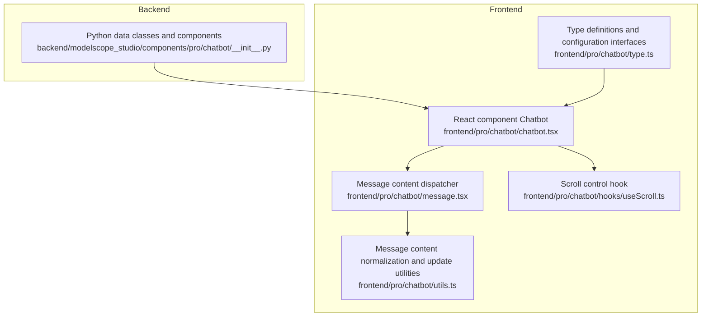
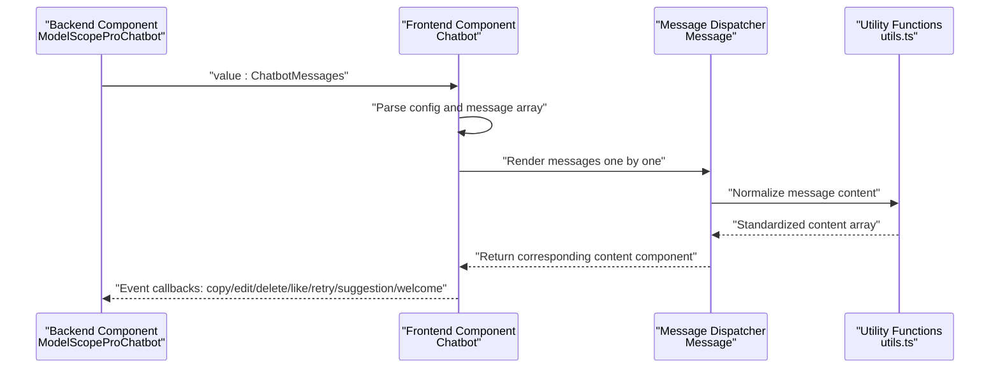
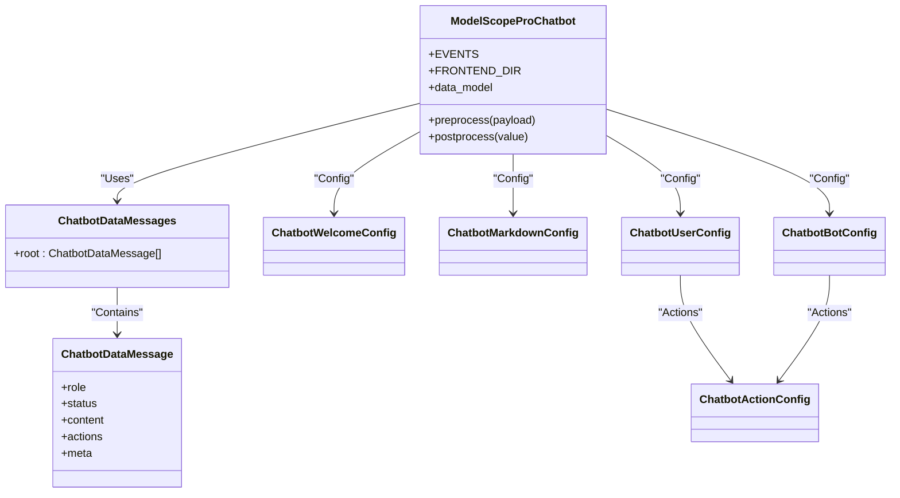
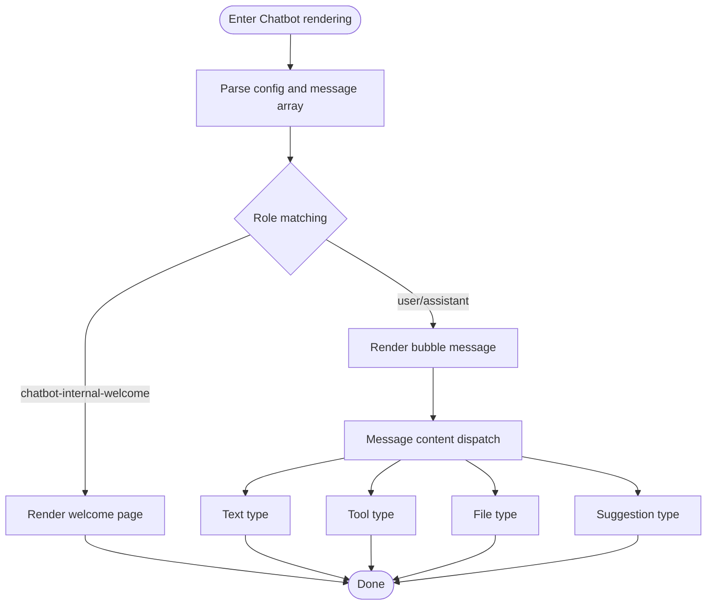
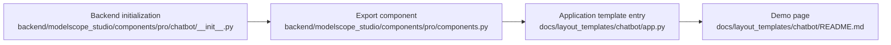

# Chatbot

<cite>
**Files Referenced in This Document**
- [backend/modelscope_studio/components/pro/chatbot/__init__.py](file://backend/modelscope_studio/components/pro/chatbot/__init__.py)
- [frontend/pro/chatbot/chatbot.tsx](file://frontend/pro/chatbot/chatbot.tsx)
- [frontend/pro/chatbot/type.ts](file://frontend/pro/chatbot/type.ts)
- [frontend/pro/chatbot/message.tsx](file://frontend/pro/chatbot/message.tsx)
- [frontend/pro/chatbot/utils.ts](file://frontend/pro/chatbot/utils.ts)
- [frontend/pro/chatbot/hooks/useScroll.ts](file://frontend/pro/chatbot/hooks/useScroll.ts)
- [docs/layout_templates/chatbot/README.md](file://docs/layout_templates/chatbot/README.md)
- [docs/layout_templates/chatbot/app.py](file://docs/layout_templates/chatbot/app.py)
- [backend/modelscope_studio/components/pro/components.py](file://backend/modelscope_studio/components/pro/components.py)
</cite>

## Table of Contents

1. [Introduction](#introduction)
2. [Project Structure](#project-structure)
3. [Core Components](#core-components)
4. [Architecture Overview](#architecture-overview)
5. [Detailed Component Analysis](#detailed-component-analysis)
6. [Dependency Analysis](#dependency-analysis)
7. [Performance Considerations](#performance-considerations)
8. [Troubleshooting Guide](#troubleshooting-guide)
9. [Conclusion](#conclusion)
10. [Appendix](#appendix)

## Introduction

This document is aimed at developers who need to build intelligent chat applications on the model platform. It systematically describes the design and implementation of the Chatbot component, covering the following core capabilities:

- Message processing: Supports multiple content types including text, tool, file, and suggestion; supports message states (such as pending) and feedback markers.
- Multimodal support: Unified message content normalization and rendering, supporting file upload, preview, and download link generation.
- Thinking chain display: Presents reasoning and decision-making processes through tool messages and suggestion prompts combined with Markdown rendering.
- Tool invocation: Message content can embed tool execution results, supporting state management and title annotation.
- Configuration system: Provides welcome page, Markdown rendering, user and bot message style, and behavior configuration.

The document also provides complete usage examples, internal architecture and message flow mechanism descriptions, performance optimization recommendations, and solutions to common issues.

## Project Structure

The Chatbot component consists of a backend Python data class and frontend React/Svelte dual implementations, adopting a layered design of "data class definition + frontend rendering":

- Backend: Defines message data models, pre/post-processing logic, and static resource service encapsulation.
- Frontend: Renders messages using @ant-design/x's Bubble list, dispatches to specific message components by content type, and provides interactions such as scroll, edit, copy, like/dislike, and retry.

**Diagram sources**

- [backend/modelscope_studio/components/pro/chatbot/**init**.py:286-495](file://backend/modelscope_studio/components/pro/chatbot/__init__.py#L286-L495)
- [frontend/pro/chatbot/chatbot.tsx:51-475](file://frontend/pro/chatbot/chatbot.tsx#L51-L475)
- [frontend/pro/chatbot/type.ts:1-197](file://frontend/pro/chatbot/type.ts#L1-L197)
- [frontend/pro/chatbot/message.tsx:25-184](file://frontend/pro/chatbot/message.tsx#L25-L184)
- [frontend/pro/chatbot/utils.ts:46-103](file://frontend/pro/chatbot/utils.ts#L46-L103)
- [frontend/pro/chatbot/hooks/useScroll.ts](file://frontend/pro/chatbot/hooks/useScroll.ts)

**Section sources**

- [backend/modelscope_studio/components/pro/chatbot/**init**.py:1-495](file://backend/modelscope_studio/components/pro/chatbot/__init__.py#L1-L495)
- [frontend/pro/chatbot/chatbot.tsx:1-475](file://frontend/pro/chatbot/chatbot.tsx#L1-L475)
- [frontend/pro/chatbot/type.ts:1-197](file://frontend/pro/chatbot/type.ts#L1-L197)
- [frontend/pro/chatbot/message.tsx:1-184](file://frontend/pro/chatbot/message.tsx#L1-L184)
- [frontend/pro/chatbot/utils.ts:46-103](file://frontend/pro/chatbot/utils.ts#L46-L103)
- [frontend/pro/chatbot/hooks/useScroll.ts](file://frontend/pro/chatbot/hooks/useScroll.ts)

## Core Components

- Backend Component: ModelScopeProChatbot
  - Defines message data models and configuration items, responsible for message content preprocessing, postprocessing, and static resource path conversion.
  - Provides event binding (change, copy, edit, delete, like, retry, suggestion_select, welcome_prompt_select).
- Frontend Component: Chatbot (React)
  - Maps message arrays to @ant-design/x's Bubble list, rendering by role and content type.
  - Supports interactions including auto-scroll, scroll-to-bottom button, edit, copy, like/dislike, delete, retry, suggestion selection, and welcome prompt selection.
- Types and Configuration: type.ts
  - Defines interfaces for welcome page, Markdown, user/bot configuration, message body, action objects, content types, and options.
- Message Dispatcher: message.tsx
  - Normalizes message content and dispatches to text, tool, file, and suggestion message components by type.
- Utility Functions: utils.ts
  - Normalizes message content, batch updates content values, supports mixed string/array/object structures.
- Scroll Control: useScroll.ts
  - Controls list scroll and "scroll to bottom" button display threshold logic.

**Section sources**

- [backend/modelscope_studio/components/pro/chatbot/**init**.py:14-284](file://backend/modelscope_studio/components/pro/chatbot/__init__.py#L14-L284)
- [frontend/pro/chatbot/chatbot.tsx:51-475](file://frontend/pro/chatbot/chatbot.tsx#L51-L475)
- [frontend/pro/chatbot/type.ts:27-197](file://frontend/pro/chatbot/type.ts#L27-L197)
- [frontend/pro/chatbot/message.tsx:25-184](file://frontend/pro/chatbot/message.tsx#L25-L184)
- [frontend/pro/chatbot/utils.ts:46-103](file://frontend/pro/chatbot/utils.ts#L46-L103)
- [frontend/pro/chatbot/hooks/useScroll.ts](file://frontend/pro/chatbot/hooks/useScroll.ts)

## Architecture Overview

The diagram below shows the overall flow from backend data classes to frontend rendering, as well as the event callback propagation path.

**Diagram sources**

- [backend/modelscope_studio/components/pro/chatbot/**init**.py:418-495](file://backend/modelscope_studio/components/pro/chatbot/__init__.py#L418-L495)
- [frontend/pro/chatbot/chatbot.tsx:176-472](file://frontend/pro/chatbot/chatbot.tsx#L176-L472)
- [frontend/pro/chatbot/message.tsx:52-184](file://frontend/pro/chatbot/message.tsx#L52-L184)
- [frontend/pro/chatbot/utils.ts:46-103](file://frontend/pro/chatbot/utils.ts#L46-L103)

## Detailed Component Analysis

### Backend Component: ModelScopeProChatbot

- Data Model
  - ChatbotDataMessage: Defines fields for message role, key, status, content, actions, meta information, etc.
  - ChatbotDataMessages: Root message container.
  - Configuration classes: ChatbotWelcomeConfig, ChatbotMarkdownConfig, ChatbotUserConfig, ChatbotBotConfig, ChatbotActionConfig, etc.
- Preprocessing and Postprocessing
  - preprocess: Preprocesses file paths and other content in messages for frontend rendering.
  - postprocess: Converts file content to FileData, processes avatar and static resource paths.
- Event Binding
  - EVENTS: Binds change, copy, edit, delete, like, retry, suggestion_select, welcome_prompt_select, and other events.
- Frontend Directory
  - FRONTEND_DIR: Points to the frontend pro/chatbot directory to ensure correct component loading.

**Diagram sources**

- [backend/modelscope_studio/components/pro/chatbot/**init**.py:14-284](file://backend/modelscope_studio/components/pro/chatbot/__init__.py#L14-L284)
- [backend/modelscope_studio/components/pro/chatbot/**init**.py:286-495](file://backend/modelscope_studio/components/pro/chatbot/__init__.py#L286-L495)

**Section sources**

- [backend/modelscope_studio/components/pro/chatbot/**init**.py:14-284](file://backend/modelscope_studio/components/pro/chatbot/__init__.py#L14-L284)
- [backend/modelscope_studio/components/pro/chatbot/**init**.py:286-495](file://backend/modelscope_studio/components/pro/chatbot/__init__.py#L286-L495)

### Frontend Component: Chatbot (React)

- Role and Rendering
  - Uses withRoleItemsContextProvider to provide rendering strategies for different roles (user, bot, system, divider, welcome page).
  - Skips system and divider by default, retaining chatbot-internal-welcome, user, and assistant.
- Content Rendering
  - Dispatches to text, tool, file, and suggestion components based on message content type.
  - Supports edit mode (text/tool only); triggers onValueChange update after editing.
- Interaction Events
  - Copy, like/dislike, delete, retry, suggestion selection, welcome prompt selection, and other events are passed to the backend via callbacks.
- Scroll Control
  - useScroll controls auto-scroll and the display threshold for the "scroll to bottom" button.

**Diagram sources**

- [frontend/pro/chatbot/chatbot.tsx:107-472](file://frontend/pro/chatbot/chatbot.tsx#L107-L472)
- [frontend/pro/chatbot/message.tsx:52-184](file://frontend/pro/chatbot/message.tsx#L52-L184)

**Section sources**

- [frontend/pro/chatbot/chatbot.tsx:51-475](file://frontend/pro/chatbot/chatbot.tsx#L51-L475)
- [frontend/pro/chatbot/message.tsx:25-184](file://frontend/pro/chatbot/message.tsx#L25-L184)

### Types and Configuration: type.ts

- Welcome page config ChatbotWelcomeConfig: Supports icon, title, description, extra info, and prompt collections.
- Markdown config ChatbotMarkdownConfig: Controls whether to render, line breaks, LaTeX delimiters, HTML sanitization, etc.
- User/bot config ChatbotUserConfig/ChatbotBotConfig: Action list, disabled actions, avatar, variant, shape, placement, loading state, etc.
- Action object ChatbotActionConfig: Supports Tooltip and Popconfirm.
- Message content types: text, tool, file, suggestion; each type has corresponding option configurations.
- Event data structures: CopyData, EditData, DeleteData, LikeData, RetryData, SuggestionData, WelcomePromptData.

**Section sources**

- [frontend/pro/chatbot/type.ts:27-197](file://frontend/pro/chatbot/type.ts#L27-L197)

### Message Content Normalization and Update: utils.ts

- normalizeMessageContent: Unifies strings, arrays, and objects into content object arrays for rendering.
- updateContent: Performs batch updates on edited values, supporting mixed string and object structures.

**Section sources**

- [frontend/pro/chatbot/utils.ts:46-103](file://frontend/pro/chatbot/utils.ts#L46-L103)

### Scroll Control: useScroll.ts

- Controls list scroll to bottom and button display threshold to improve user experience.

**Section sources**

- [frontend/pro/chatbot/hooks/useScroll.ts](file://frontend/pro/chatbot/hooks/useScroll.ts)

## Dependency Analysis

- Component Export
  - The backend exports ProChatbot via components/pro/components.py for direct use by upper-level applications.
- Documentation Templates
  - layout_templates/chatbot provides application templates and example entry points for quick demonstration and integration.

**Diagram sources**

- [backend/modelscope_studio/components/pro/chatbot/**init**.py:386-388](file://backend/modelscope_studio/components/pro/chatbot/__init__.py#L386-L388)
- [backend/modelscope_studio/components/pro/components.py:1-8](file://backend/modelscope_studio/components/pro/components.py#L1-L8)
- [docs/layout_templates/chatbot/app.py:1-7](file://docs/layout_templates/chatbot/app.py#L1-L7)
- [docs/layout_templates/chatbot/README.md:1-20](file://docs/layout_templates/chatbot/README.md#L1-L20)

**Section sources**

- [backend/modelscope_studio/components/pro/components.py:1-8](file://backend/modelscope_studio/components/pro/components.py#L1-L8)
- [docs/layout_templates/chatbot/README.md:1-20](file://docs/layout_templates/chatbot/README.md#L1-L20)
- [docs/layout_templates/chatbot/app.py:1-7](file://docs/layout_templates/chatbot/app.py#L1-L7)

## Performance Considerations

- Message Rendering Optimization
  - Uses useMemo to cache configuration parsing and message array conversion to reduce unnecessary re-renders.
  - Enables the edit input only for the last message or when in edit state, avoiding full rendering.
- File Processing
  - Converts file paths to FileData on the backend; the frontend renders on demand to avoid duplicate requests.
- Scroll Control
  - Controls "scroll to bottom" button display via threshold to reduce overhead from frequent scrolling.
- Event Callbacks
  - Wraps callbacks with useMemoizedFn to reduce the number of event handler reconstructions.

## Troubleshooting Guide

- Messages not displaying or rendering abnormal
  - Check whether message content conforms to the ChatbotDataMessage structure, especially the type and options of content.
  - Confirm whether the backend postprocess has correctly handled file paths and avatar resources.
- Files cannot be previewed or downloaded
  - Confirm the file path is a local file or HTTP address; the backend generates FileData based on the path type.
- Edit function not working
  - Confirm the message content type is text or tool, and the editable field is not disabled.
- Scroll button not appearing
  - Check autoScroll and scroll_to_bottom_button_offset configuration; confirm the message count and height settings are reasonable.
- Events not triggering
  - Confirm the frontend has bound the corresponding event callbacks and the backend EVENTS includes the corresponding event listener.

**Section sources**

- [backend/modelscope_studio/components/pro/chatbot/**init**.py:418-495](file://backend/modelscope_studio/components/pro/chatbot/__init__.py#L418-L495)
- [frontend/pro/chatbot/chatbot.tsx:176-472](file://frontend/pro/chatbot/chatbot.tsx#L176-L472)
- [frontend/pro/chatbot/message.tsx:37-184](file://frontend/pro/chatbot/message.tsx#L37-L184)

## Conclusion

The Chatbot component achieves multimodal message processing, thinking chain display, and tool invocation integration through a clear data model and frontend/backend collaboration. Its configuration system is flexible, its event callbacks are comprehensive, and it is suitable for building high-quality intelligent chat applications in complex conversational scenarios. It is recommended to configure the welcome page, Markdown rendering, and message actions according to business requirements for the best user experience.

## Appendix

### Usage Examples and Best Practices

- Basic Chat
  - Initialize ModelScopeProChatbot with an initial message array and basic configuration.
  - Listen to events such as change, copy, edit, delete, like, and retry to implement business logic.
- Multimodal Input
  - Use the file type of ChatbotDataMessageContent to carry attachment lists; the backend automatically converts them to FileData.
  - The frontend previews based on image/video/audioProps in options.
- Tool Integration
  - Use the tool type to carry tool execution results; annotate execution status with options.title and status.
- Thinking Chain Display
  - Use the suggestion type to provide input suggestions; combine with Markdown rendering to enhance readability.
- Configuration Key Points
  - Welcome page: Set icon, title, description, prompts, etc.
  - Markdown: Control line breaks, LaTeX delimiters, HTML sanitization, and tag allowlist.
  - User/bot: Customize actions, avatar, variant, and placement to improve UI consistency.
