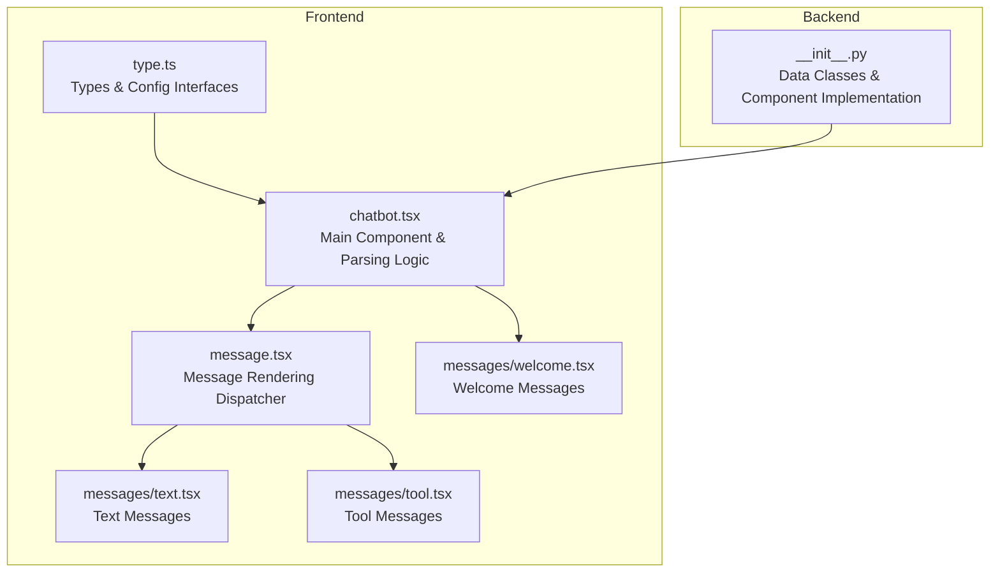
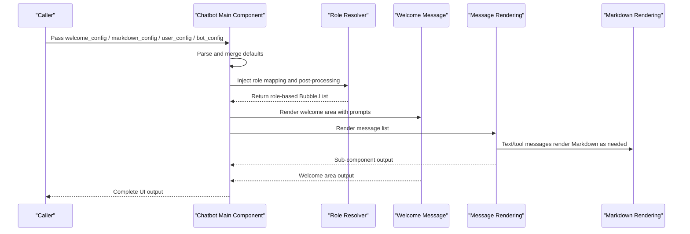
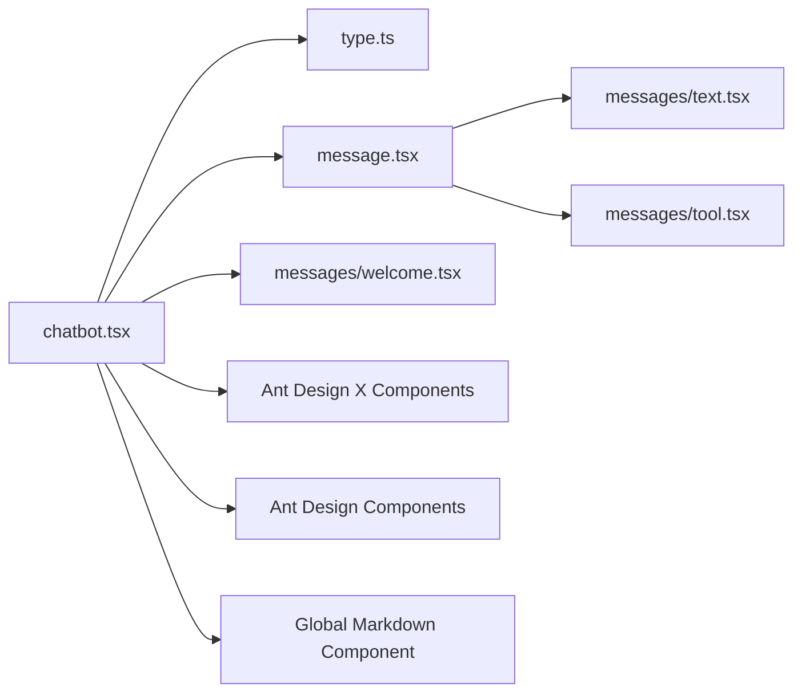

# Configuration Options

<cite>
**Files Referenced in This Document**
- [frontend/pro/chatbot/type.ts](file://frontend/pro/chatbot/type.ts)
- [frontend/pro/chatbot/chatbot.tsx](file://frontend/pro/chatbot/chatbot.tsx)
- [frontend/pro/chatbot/message.tsx](file://frontend/pro/chatbot/message.tsx)
- [frontend/pro/chatbot/messages/text.tsx](file://frontend/pro/chatbot/messages/text.tsx)
- [frontend/pro/chatbot/messages/tool.tsx](file://frontend/pro/chatbot/messages/tool.tsx)
- [frontend/pro/chatbot/messages/welcome.tsx](file://frontend/pro/chatbot/messages/welcome.tsx)
- [backend/modelscope_studio/components/pro/chatbot/__init__.py](file://backend/modelscope_studio/components/pro/chatbot/__init__.py)
- [docs/layout_templates/chatbot/demos/basic.py](file://docs/layout_templates/chatbot/demos/basic.py)
- [docs/layout_templates/chatbot/demos/fine_grained_control.py](file://docs/layout_templates/chatbot/demos/fine_grained_control.py)
- [docs/layout_templates/chatbot/README-zh_CN.md](file://docs/layout_templates/chatbot/README-zh_CN.md)
</cite>

## Table of Contents

1. [Introduction](#introduction)
2. [Project Structure](#project-structure)
3. [Core Components](#core-components)
4. [Architecture Overview](#architecture-overview)
5. [Detailed Component Analysis](#detailed-component-analysis)
6. [Dependency Analysis](#dependency-analysis)
7. [Performance Considerations](#performance-considerations)
8. [Troubleshooting Guide](#troubleshooting-guide)
9. [Conclusion](#conclusion)
10. [Appendix](#appendix)

## Introduction

This chapter is aimed at developers and product personnel using the Chatbot component, systematically covering frontend and backend configuration options, including `welcome_config`, `markdown_config`, `user_config`, and `bot_config`. It explains the purpose, allowed values, and default behavior of each configuration option, provides configuration examples and typical use cases, explains the relationships and priority between configurations, and offers advanced tips and performance optimization recommendations.

## Project Structure

The Chatbot component is composed of a frontend Svelte/React implementation and backend Gradio data class definitions:

- **Frontend**: Type definitions, rendering logic, message sub-components, welcome message component, etc.
- **Backend**: Data model, event binding, static resource handling, pre/post-processing logic

**Diagram Sources**

- [frontend/pro/chatbot/type.ts:1-197](file://frontend/pro/chatbot/type.ts#L1-L197)
- [frontend/pro/chatbot/chatbot.tsx:1-475](file://frontend/pro/chatbot/chatbot.tsx#L1-L475)
- [frontend/pro/chatbot/message.tsx:1-184](file://frontend/pro/chatbot/message.tsx#L1-L184)
- [frontend/pro/chatbot/messages/text.tsx:1-19](file://frontend/pro/chatbot/messages/text.tsx#L1-L19)
- [frontend/pro/chatbot/messages/tool.tsx:1-46](file://frontend/pro/chatbot/messages/tool.tsx#L1-L46)
- [frontend/pro/chatbot/messages/welcome.tsx:1-55](file://frontend/pro/chatbot/messages/welcome.tsx#L1-L55)
- [backend/modelscope_studio/components/pro/chatbot/**init**.py:1-495](file://backend/modelscope_studio/components/pro/chatbot/__init__.py#L1-L495)

**Section Sources**

- [frontend/pro/chatbot/type.ts:1-197](file://frontend/pro/chatbot/type.ts#L1-L197)
- [frontend/pro/chatbot/chatbot.tsx:1-475](file://frontend/pro/chatbot/chatbot.tsx#L1-L475)
- [backend/modelscope_studio/components/pro/chatbot/**init**.py:1-495](file://backend/modelscope_studio/components/pro/chatbot/__init__.py#L1-L495)

## Core Components

- **Types and config interfaces**: Define the structure and optional fields of `welcome_config`, `markdown_config`, `user_config`, `bot_config`, and message content objects
- **Main component**: Responsible for merging defaults, parsing configurations, injecting theme and root path, and rendering the message list and welcome area
- **Message rendering**: Dispatches to text, tool, file, suggestion, and other sub-components based on content type
- **Welcome message**: Renders the welcome text and prompt word cards

**Section Sources**

- [frontend/pro/chatbot/type.ts:27-158](file://frontend/pro/chatbot/type.ts#L27-L158)
- [frontend/pro/chatbot/chatbot.tsx:51-472](file://frontend/pro/chatbot/chatbot.tsx#L51-L472)
- [frontend/pro/chatbot/message.tsx:25-184](file://frontend/pro/chatbot/message.tsx#L25-L184)
- [frontend/pro/chatbot/messages/welcome.tsx:11-54](file://frontend/pro/chatbot/messages/welcome.tsx#L11-L54)

## Architecture Overview

The diagram below illustrates the Chatbot configuration parsing and rendering flow, showing key nodes and dependencies from props to final rendering.

**Diagram Sources**

- [frontend/pro/chatbot/chatbot.tsx:76-472](file://frontend/pro/chatbot/chatbot.tsx#L76-L472)
- [frontend/pro/chatbot/messages/welcome.tsx:18-54](file://frontend/pro/chatbot/messages/welcome.tsx#L18-L54)
- [frontend/pro/chatbot/message.tsx:39-184](file://frontend/pro/chatbot/message.tsx#L39-L184)
- [frontend/pro/chatbot/messages/text.tsx:11-18](file://frontend/pro/chatbot/messages/text.tsx#L11-L18)
- [frontend/pro/chatbot/messages/tool.tsx:13-45](file://frontend/pro/chatbot/messages/tool.tsx#L13-L45)

## Detailed Component Analysis

### Welcome Configuration (`welcome_config`)

- **Purpose**: Controls the appearance, text, and prompt word cards of the welcome area
- **Key fields**:
  - `variant`: Appearance variant, supports `borderless`, `filled`
  - `icon`: Icon, can be a string, path, or file data
  - `title`: Title
  - `description`: Description
  - `extra`: Additional content
  - `elem_style` / `elem_classes` / `styles` / `class_names`: Styles and class names
  - `prompts`: Collection of prompt word cards (see "Prompt Configuration" below)
- **Default behavior**:
  - If not provided, the main component uses `borderless` as the default variant
- **Relationship with prompts**:
  - The `prompts` field can nest prompt word card configurations to guide users to quickly get started

**Section Sources**

- [frontend/pro/chatbot/type.ts:34-41](file://frontend/pro/chatbot/type.ts#L34-L41)
- [frontend/pro/chatbot/chatbot.tsx:108-115](file://frontend/pro/chatbot/chatbot.tsx#L108-L115)
- [frontend/pro/chatbot/messages/welcome.tsx:24-51](file://frontend/pro/chatbot/messages/welcome.tsx#L24-L51)
- [backend/modelscope_studio/components/pro/chatbot/**init**.py:38-50](file://backend/modelscope_studio/components/pro/chatbot/__init__.py#L38-L50)

### Prompt Configuration (`prompts` in `welcome_config`)

- **Purpose**: Displays a set of prompt word cards in the welcome area to help users quickly start a conversation
- **Key fields**:
  - `title`: Title of the prompt area
  - `vertical` / `wrap`: Layout direction and wrapping
  - `styles` / `class_names` / `elem_style` / `elem_classes`: Styles and class names
  - `items`: Array of prompt entries (each entry contains `label`, `description`, `children`, etc.)

**Section Sources**

- [frontend/pro/chatbot/type.ts:27-32](file://frontend/pro/chatbot/type.ts#L27-L32)
- [frontend/pro/chatbot/messages/welcome.tsx:41-51](file://frontend/pro/chatbot/messages/welcome.tsx#L41-L51)
- [backend/modelscope_studio/components/pro/chatbot/**init**.py:26-36](file://backend/modelscope_studio/components/pro/chatbot/__init__.py#L26-L36)

### Markdown Configuration (`markdown_config`)

- **Purpose**: Uniformly controls the Markdown rendering behavior in text and tool messages
- **Key fields**:
  - `renderMarkdown`: Whether to enable Markdown rendering (frontend)
  - `render_markdown`: Whether to enable Markdown rendering (backend)
  - `latex_delimiters`: LaTeX delimiter configuration
  - `sanitize_html`: Whether to sanitize HTML
  - `line_breaks`: Whether to preserve line breaks
  - `rtl`: Whether to render right-to-left
  - `allow_tags`: Allowed tags or boolean switch
- **Default behavior**:
  - Frontend enables `renderMarkdown` by default and sets the line break strategy
  - Backend enables rendering, HTML sanitization, line breaks, and multiple LaTeX delimiter groups by default

**Section Sources**

- [frontend/pro/chatbot/type.ts:54-56](file://frontend/pro/chatbot/type.ts#L54-L56)
- [frontend/pro/chatbot/message.tsx:87-95](file://frontend/pro/chatbot/message.tsx#L87-L95)
- [frontend/pro/chatbot/messages/tool.tsx:14-18](file://frontend/pro/chatbot/messages/tool.tsx#L14-L18)
- [backend/modelscope_studio/components/pro/chatbot/**init**.py:52-106](file://backend/modelscope_studio/components/pro/chatbot/__init__.py#L52-L106)

### User Configuration (`user_config`)

- **Purpose**: Controls the appearance, avatar, action buttons, and styles of user message bubbles
- **Key fields**:
  - `actions`: Action button list, supports `copy`, `edit`, `delete`; or objects with `tooltip`/`popconfirm`
  - `disabled_actions`: Set of disabled actions
  - `header` / `footer`: Header and footer text
  - `avatar`: Avatar, can be a string, file data, or avatar property object
  - `variant` / `shape` / `placement`: Appearance, shape, and position
  - `loading` / `typing`: Loading and typing effects
  - `elem_style` / `elem_classes` / `styles` / `class_names`: Styles and class names
- **Default behavior**:
  - Only the `copy` action is enabled by default (backend default)

**Section Sources**

- [frontend/pro/chatbot/type.ts:86-97](file://frontend/pro/chatbot/type.ts#L86-L97)
- [frontend/pro/chatbot/chatbot.tsx:246-432](file://frontend/pro/chatbot/chatbot.tsx#L246-L432)
- [backend/modelscope_studio/components/pro/chatbot/**init**.py:117-151](file://backend/modelscope_studio/components/pro/chatbot/__init__.py#L117-L151)
- [backend/modelscope_studio/components/pro/chatbot/**init**.py:123-131](file://backend/modelscope_studio/components/pro/chatbot/__init__.py#L123-L131)

### Bot Configuration (`bot_config`)

- **Purpose**: Controls the appearance, avatar, action buttons, and styles of bot message bubbles
- **Key fields**:
  - `actions`: Action button list, supports `copy`, `like`, `dislike`, `retry`, `edit`, `delete`; or objects with `tooltip`/`popconfirm`
  - `disabled_actions`: Set of disabled actions
  - `header` / `footer`: Header and footer text
  - `avatar`: Avatar
  - `variant` / `shape` / `placement`: Appearance, shape, and position
  - `loading` / `typing`: Loading and typing effects
  - `elem_style` / `elem_classes` / `styles` / `class_names`: Styles and class names
- **Default behavior**:
  - The `copy` action is enabled by default (backend default)

**Section Sources**

- [frontend/pro/chatbot/type.ts:108-119](file://frontend/pro/chatbot/type.ts#L108-L119)
- [frontend/pro/chatbot/chatbot.tsx:246-432](file://frontend/pro/chatbot/chatbot.tsx#L246-L432)
- [backend/modelscope_studio/components/pro/chatbot/**init**.py:153-180](file://backend/modelscope_studio/components/pro/chatbot/__init__.py#L153-L180)
- [backend/modelscope_studio/components/pro/chatbot/**init**.py:162-170](file://backend/modelscope_studio/components/pro/chatbot/__init__.py#L162-L170)

### Message Content and Rendering (Message Types and Options)

- **Content types**:
  - `text`: Plain text or Markdown text
  - `tool`: Tool message, collapsible display with title and content
  - `file`: File list, supports image/video/audio properties
  - `suggestion`: Suggestion list, supports disabled state and click callbacks
- **Content options**:
  - Text/tool: Inherits Markdown configuration; tool messages support `title` and `status` (`pending`/`done`)
  - File: Inherits Flex layout configuration, supports `imageProps`/`videoProps`/`audioProps`
  - Suggestion: Inherits prompt configuration
- **Edit and copyable**:
  - Editing can be controlled via `content.options.editable`
  - Copying can be controlled via `content.options.copyable`

**Section Sources**

- [frontend/pro/chatbot/type.ts:43-68](file://frontend/pro/chatbot/type.ts#L43-L68)
- [frontend/pro/chatbot/type.ts:121-135](file://frontend/pro/chatbot/type.ts#L121-L135)
- [frontend/pro/chatbot/message.tsx:52-174](file://frontend/pro/chatbot/message.tsx#L52-L174)
- [frontend/pro/chatbot/messages/text.tsx:11-18](file://frontend/pro/chatbot/messages/text.tsx#L11-L18)
- [frontend/pro/chatbot/messages/tool.tsx:13-45](file://frontend/pro/chatbot/messages/tool.tsx#L13-L45)

### Configuration Priority and Merge Rules

- **Main component parsing order**:
  - `welcome_config`: Uses `borderless` as the default variant; other fields are overridden by what is passed in
  - `markdown_config`: Frontend enables line breaks and rendering by default; backend enables rendering and sanitization by default
  - `user_config` / `bot_config`: Overridden by what is passed in; defaults to empty object if not provided
  - Message-level configuration: `message.options` merges with global `markdown_config`; `message.options` takes priority
- **Avatar and static resources**:
  - The backend wraps `avatar` and `welcome.icon` as static resources to ensure accessibility
- **Role and styles**:
  - The main component applies different styles and class names based on role (`user`/`assistant`/`chatbot-internal-welcome`)

**Section Sources**

- [frontend/pro/chatbot/chatbot.tsx:108-136](file://frontend/pro/chatbot/chatbot.tsx#L108-L136)
- [frontend/pro/chatbot/chatbot.tsx:246-432](file://frontend/pro/chatbot/chatbot.tsx#L246-L432)
- [backend/modelscope_studio/components/pro/chatbot/**init**.py:363-380](file://backend/modelscope_studio/components/pro/chatbot/__init__.py#L363-L380)

### Configuration Examples and Use Cases

- **Basic example**:
  - Use `welcome_config` to set title, description, and prompt word cards
  - Use `user_config`/`bot_config` to configure action buttons and avatars
  - Reference: [basic.py:516-564](file://docs/layout_templates/chatbot/demos/basic.py#L516-L564)
- **Fine-grained control example**:
  - Custom role rendering, message state, and feedback buttons
  - Reference: [fine_grained_control.py:575-800](file://docs/layout_templates/chatbot/demos/fine_grained_control.py#L575-L800)
- **Use cases**:
  - Instant assistant: Enable copy, like/dislike, retry, delete actions
  - Multi-turn conversation: Combine session list with message state management
  - Multimedia input: Combine file upload with file message rendering

**Section Sources**

- [docs/layout_templates/chatbot/demos/basic.py:516-564](file://docs/layout_templates/chatbot/demos/basic.py#L516-L564)
- [docs/layout_templates/chatbot/demos/fine_grained_control.py:575-800](file://docs/layout_templates/chatbot/demos/fine_grained_control.py#L575-L800)
- [docs/layout_templates/chatbot/README-zh_CN.md:1-20](file://docs/layout_templates/chatbot/README-zh_CN.md#L1-L20)

## Dependency Analysis

- **Component coupling**:
  - The main component depends on type definitions and message sub-components; message sub-components depend on Markdown rendering
  - Welcome messages depend on the prompt component and file URL handling
- **External dependencies**:
  - Ant Design X (Welcome, Prompts, Bubble.List)
  - Ant Design (Avatar, Button, Collapse, Flex, etc.)
  - Global Markdown component and file upload utilities

**Diagram Sources**

- [frontend/pro/chatbot/chatbot.tsx:26-47](file://frontend/pro/chatbot/chatbot.tsx#L26-L47)
- [frontend/pro/chatbot/message.tsx:10-23](file://frontend/pro/chatbot/message.tsx#L10-L23)
- [frontend/pro/chatbot/messages/text.tsx:2-4](file://frontend/pro/chatbot/messages/text.tsx#L2-L4)
- [frontend/pro/chatbot/messages/tool.tsx:3-4](file://frontend/pro/chatbot/messages/tool.tsx#L3-L4)
- [frontend/pro/chatbot/messages/welcome.tsx:3-6](file://frontend/pro/chatbot/messages/welcome.tsx#L3-L6)

## Performance Considerations

- **Rendering optimization**:
  - Use `elem_style` / `styles` and `class_names` judiciously to avoid excessive reflows
  - Tool messages use collapse to reduce initial rendering overhead
- **Resource handling**:
  - Avatars and welcome icons are served via the static resource service to avoid repeated transfers
- **Interaction throttling**:
  - Debounce/throttle frequently triggered events (e.g., scroll, edit) (implemented at the parent application level)
- **Memory and state**:
  - For long conversations, consider limiting the number of messages or adopting pagination/lazy loading strategies

## Troubleshooting Guide

- **Welcome icon not displayed**:
  - Check whether `welcome_config.icon` is a valid path or file data; confirm that the static resource service is enabled
- **Markdown rendering issues**:
  - Frontend: check the `renderMarkdown` switch; Backend: check `render_markdown` and `sanitize_html`
- **Action buttons not working**:
  - Confirm that `actions` and `disabled_actions` are correctly configured; use `tooltip`/`popconfirm` dialogs as needed
- **File message cannot be previewed**:
  - Check file path and MIME type; confirm that the post-processing stage has converted to `FileData`

**Section Sources**

- [frontend/pro/chatbot/messages/welcome.tsx:32-38](file://frontend/pro/chatbot/messages/welcome.tsx#L32-L38)
- [backend/modelscope_studio/components/pro/chatbot/**init**.py:363-380](file://backend/modelscope_studio/components/pro/chatbot/__init__.py#L363-L380)
- [frontend/pro/chatbot/messages/tool.tsx:14-18](file://frontend/pro/chatbot/messages/tool.tsx#L14-L18)

## Conclusion

With systematic configuration options and clear priority rules, the Chatbot component can flexibly adapt to various business scenarios. In real-world projects, it is recommended to:

- Clearly define the boundaries of responsibility for each configuration option to avoid redundant overrides
- Centralize Markdown and style configurations globally, with local fine-tuning
- Apply collapse/lazy loading strategies for multimedia and long text content
- Use fine-grained control examples as a basis for secondary encapsulation in complex interaction scenarios

## Appendix

- **Quick Reference Table**:
  - `welcome_config`: `variant` / `icon` / `title` / `description` / `extra` / `prompt`
  - `markdown_config`: `renderMarkdown` / `render_markdown` / `latex_delimiters` / `sanitize_html` / `line_breaks` / `rtl` / `allow_tags`
  - `user_config`: `actions` / `disabled_actions` / `header` / `footer` / `avatar` / `variant` / `shape` / `placement` / `loading` / `typing` / `elem_style` / `elem_classes` / `styles` / `class_names`
  - `bot_config`: `actions` / `disabled_actions` / `header` / `footer` / `avatar` / `variant` / `shape` / `placement` / `loading` / `typing` / `elem_style` / `elem_classes` / `styles` / `class_names`
  - Message content: `text` / `tool` / `file` / `suggestion`, each supporting `options` and `copyable`/`editable`
