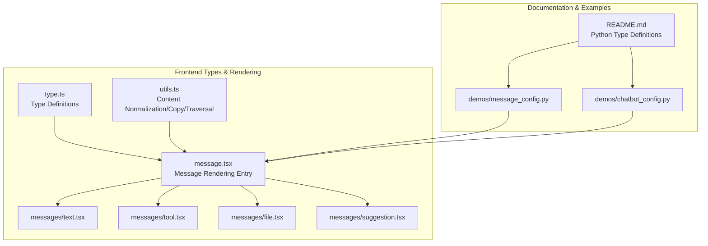
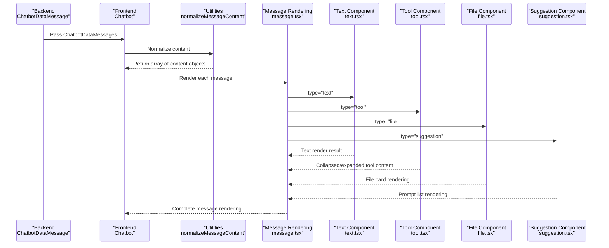
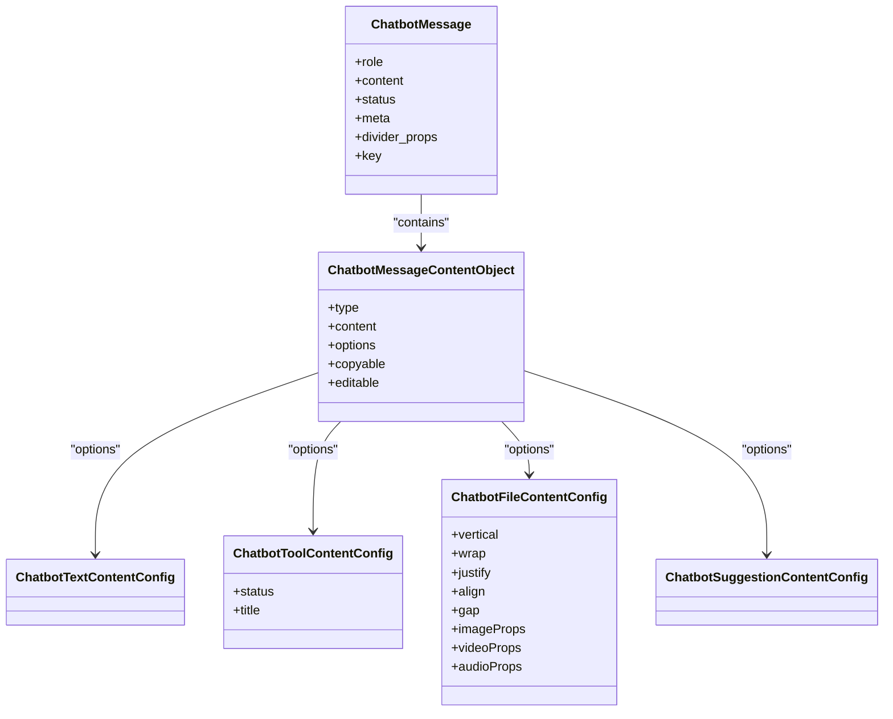
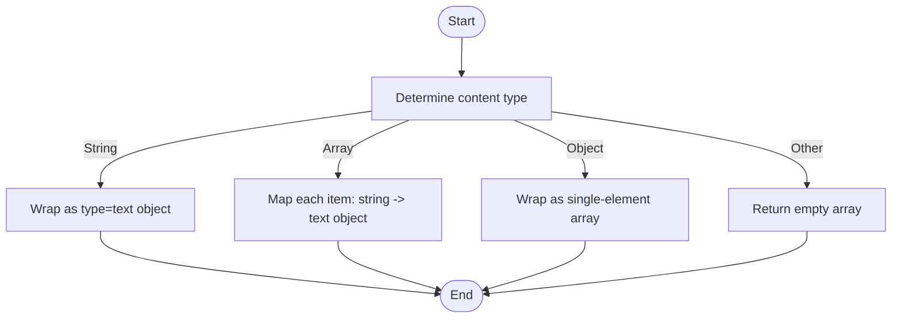
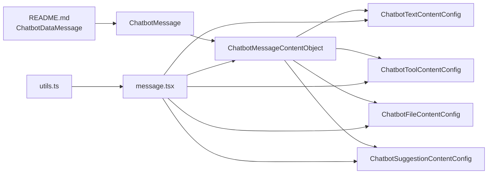

# Data Model

<cite>
**Files Referenced in This Document**
- [frontend/pro/chatbot/type.ts](file://frontend/pro/chatbot/type.ts)
- [frontend/pro/chatbot/utils.ts](file://frontend/pro/chatbot/utils.ts)
- [frontend/pro/chatbot/message.tsx](file://frontend/pro/chatbot/message.tsx)
- [frontend/pro/chatbot/messages/text.tsx](file://frontend/pro/chatbot/messages/text.tsx)
- [frontend/pro/chatbot/messages/tool.tsx](file://frontend/pro/chatbot/messages/tool.tsx)
- [frontend/pro/chatbot/messages/file.tsx](file://frontend/pro/chatbot/messages/file.tsx)
- [frontend/pro/chatbot/messages/suggestion.tsx](file://frontend/pro/chatbot/messages/suggestion.tsx)
- [docs/components/pro/chatbot/README.md](file://docs/components/pro/chatbot/README.md)
- [docs/components/pro/chatbot/demos/message_config.py](file://docs/components/pro/chatbot/demos/message_config.py)
- [docs/components/pro/chatbot/demos/chatbot_config.py](file://docs/components/pro/chatbot/demos/chatbot_config.py)
</cite>

## Table of Contents

1. [Introduction](#introduction)
2. [Project Structure](#project-structure)
3. [Core Components](#core-components)
4. [Architecture Overview](#architecture-overview)
5. [Detailed Component Analysis](#detailed-component-analysis)
6. [Dependency Analysis](#dependency-analysis)
7. [Performance Considerations](#performance-considerations)
8. [Troubleshooting Guide](#troubleshooting-guide)
9. [Conclusion](#conclusion)
10. [Appendix](#appendix)

## Introduction

This chapter focuses on the data model of the Chatbot component, systematically covering message and content data structures, field definitions, rendering behavior, serialization/deserialization paths, and validation and error handling strategies. The key types covered include:

- `ChatbotMessage`: A single message
- `ChatbotMessages`: An array of messages
- `ChatbotMessageContentObject`: A message content object
- The structure and configuration of four content types: text, tool, file, and suggestion
- The mapping relationship between the frontend rendering pipeline and the backend Python model

## Project Structure

Code related to the data model is primarily distributed across the frontend Pro Chatbot component and documentation examples:

- Type definitions and configuration: `frontend/pro/chatbot/type.ts`
- Message content normalization and copy logic: `frontend/pro/chatbot/utils.ts`
- Single message rendering entry point: `frontend/pro/chatbot/message.tsx`
- Content sub-components: `text.tsx`, `tool.tsx`, `file.tsx`, `suggestion.tsx`
- Documentation and examples (Python backend model): `docs/components/pro/chatbot/README.md`, `demos/*.py`

**Diagram Sources**

- [frontend/pro/chatbot/type.ts:1-197](file://frontend/pro/chatbot/type.ts#L1-L197)
- [frontend/pro/chatbot/utils.ts:1-157](file://frontend/pro/chatbot/utils.ts#L1-L157)
- [frontend/pro/chatbot/message.tsx:1-184](file://frontend/pro/chatbot/message.tsx#L1-L184)
- [frontend/pro/chatbot/messages/text.tsx:1-19](file://frontend/pro/chatbot/messages/text.tsx#L1-L19)
- [frontend/pro/chatbot/messages/tool.tsx:1-46](file://frontend/pro/chatbot/messages/tool.tsx#L1-L46)
- [frontend/pro/chatbot/messages/file.tsx:1-119](file://frontend/pro/chatbot/messages/file.tsx#L1-L119)
- [frontend/pro/chatbot/messages/suggestion.tsx:1-37](file://frontend/pro/chatbot/messages/suggestion.tsx#L1-L37)
- [docs/components/pro/chatbot/README.md:80-354](file://docs/components/pro/chatbot/README.md#L80-L354)
- [docs/components/pro/chatbot/demos/message_config.py:1-65](file://docs/components/pro/chatbot/demos/message_config.py#L1-L65)
- [docs/components/pro/chatbot/demos/chatbot_config.py:1-123](file://docs/components/pro/chatbot/demos/chatbot_config.py#L1-L123)

**Section Sources**

- [frontend/pro/chatbot/type.ts:1-197](file://frontend/pro/chatbot/type.ts#L1-L197)
- [frontend/pro/chatbot/utils.ts:1-157](file://frontend/pro/chatbot/utils.ts#L1-L157)
- [frontend/pro/chatbot/message.tsx:1-184](file://frontend/pro/chatbot/message.tsx#L1-L184)
- [docs/components/pro/chatbot/README.md:80-354](file://docs/components/pro/chatbot/README.md#L80-L354)

## Core Components

This section provides a detailed breakdown of the key types in the data model, including field semantics, allowed values, default behaviors, and usage notes.

- **ChatbotMessage** (single message)
  - Key fields:
    - `role`: user, assistant, system, divider, or internal welcome identifier
    - `content`: string, content object, or array of content objects; supports multi-segment content composition
    - `status`: pending/done; when pending, the action area (action buttons and footer info) is not rendered
    - `meta.feedback`: like/dislike feedback state
    - `divider_props`, `key`, header/footer/avatar symbol keys: used for rendering and identification
  - Usage:
    - Construct message lists via `ChatbotDataMessage` on the backend and pass them to the frontend Chatbot component
    - Frontend `message.tsx` normalizes `content` to an array of content objects and dispatches to the corresponding sub-component

- **ChatbotMessages** (message array)
  - Type alias: `ChatbotMessage[]`
  - Purpose: Carries the complete conversation history as the component's `value` prop

- **ChatbotMessageContentObject** (message content object)
  - Key fields:
    - `type`: one of `text`, `tool`, `file`, `suggestion`
    - `content`: the actual value for the corresponding type
    - `options`: type-specific configuration
    - `copyable`, `editable`: whether copying/editing is allowed (only applies to text/tool)

- **Text content** (`text`)
  - Value type: string
  - Configuration: Inherits Markdown rendering capabilities (whether to render, tag whitelist, line breaks, RTL, etc.)
  - Behavior: Supports copying and editing (when `editable` is true and in an editable context)

- **Tool content** (`tool`)
  - Value type: string
  - Configuration: Title, status (`pending`/`done`), Markdown rendering
  - Behavior: Determines collapse/expand based on status; supports copying and editing

- **File content** (`file`)
  - Value type: string or array of attachment objects
  - Configuration: Flex layout parameters (vertical/wrap/justify/align/gap), as well as image/video/audio card properties
  - Behavior: Parses strings or attachments into previewable file cards with link opening support

- **Suggestion content** (`suggestion`)
  - Value type: array of prompt items (Ant Design X Prompts)
  - Configuration: Title, vertical layout, wrap, styles, and class names
  - Behavior: Renders as a clickable prompt list; interaction is disabled for non-last messages

- **User/bot configuration** (`ChatbotUserConfig`, `ChatbotBotConfig`)
  - Actions: copy, edit, delete (user); copy, like, dislike, retry, edit, delete (bot)
  - Header/footer/avatar: supports customization
  - Styles: `elem_style`, `elem_classes`, `styles`, `class_names`

**Section Sources**

- [frontend/pro/chatbot/type.ts:121-160](file://frontend/pro/chatbot/type.ts#L121-L160)
- [frontend/pro/chatbot/type.ts:137-158](file://frontend/pro/chatbot/type.ts#L137-L158)
- [docs/components/pro/chatbot/README.md:297-352](file://docs/components/pro/chatbot/README.md#L297-L352)

## Architecture Overview

The diagram below illustrates the end-to-end flow from "message content" to "concrete rendering", covering frontend type definitions, content normalization, sub-component rendering, and backend model mapping.

**Diagram Sources**

- [docs/components/pro/chatbot/README.md:321-352](file://docs/components/pro/chatbot/README.md#L321-L352)
- [frontend/pro/chatbot/utils.ts:46-72](file://frontend/pro/chatbot/utils.ts#L46-L72)
- [frontend/pro/chatbot/message.tsx:52-175](file://frontend/pro/chatbot/message.tsx#L52-L175)
- [frontend/pro/chatbot/messages/text.tsx:11-18](file://frontend/pro/chatbot/messages/text.tsx#L11-L18)
- [frontend/pro/chatbot/messages/tool.tsx:13-45](file://frontend/pro/chatbot/messages/tool.tsx#L13-L45)
- [frontend/pro/chatbot/messages/file.tsx:44-118](file://frontend/pro/chatbot/messages/file.tsx#L44-L118)
- [frontend/pro/chatbot/messages/suggestion.tsx:16-36](file://frontend/pro/chatbot/messages/suggestion.tsx#L16-L36)

## Detailed Component Analysis

### Type System and Relationships

**Diagram Sources**

- [frontend/pro/chatbot/type.ts:121-160](file://frontend/pro/chatbot/type.ts#L121-L160)
- [frontend/pro/chatbot/type.ts:54-68](file://frontend/pro/chatbot/type.ts#L54-L68)

**Section Sources**

- [frontend/pro/chatbot/type.ts:121-160](file://frontend/pro/chatbot/type.ts#L121-L160)

### Content Normalization and Copy

- **Normalization rules**:
  - String: converted to a single-element content object (`type=text`)
  - Array: each item is checked; strings are converted to `text` objects, otherwise the original object is kept
  - Other objects: wrapped as a single-element array
- **Copy rules**:
  - If content is not copyable (`copyable=false`), returns an empty string
  - String: returned directly
  - File: serialized as a JSON list of accessible URLs
  - Other: serialized as a JSON string
- **Edit update**:
  - Supports batch updating content objects or strings by index

**Diagram Sources**

- [frontend/pro/chatbot/utils.ts:46-72](file://frontend/pro/chatbot/utils.ts#L46-L72)

**Section Sources**

- [frontend/pro/chatbot/utils.ts:46-103](file://frontend/pro/chatbot/utils.ts#L46-L103)

### Text Content Rendering

- Configuration: whether to render Markdown, LaTeX delimiters, HTML sanitization, line breaks, RTL, allowed tags
- Behavior: displays directly or delegates to the Markdown component based on configuration

**Section Sources**

- [frontend/pro/chatbot/messages/text.tsx:11-18](file://frontend/pro/chatbot/messages/text.tsx#L11-L18)
- [docs/components/pro/chatbot/README.md:120-174](file://docs/components/pro/chatbot/README.md#L120-L174)

### Tool Content Rendering

- Configuration: title, status (`pending`/`done` controls collapse), Markdown rendering
- Behavior: initializes collapse state based on status; supports click to toggle

**Section Sources**

- [frontend/pro/chatbot/messages/tool.tsx:13-45](file://frontend/pro/chatbot/messages/tool.tsx#L13-L45)
- [docs/components/pro/chatbot/README.md:254-261](file://docs/components/pro/chatbot/README.md#L254-L261)

### File Content Rendering

- Value parsing: strings or attachment objects are uniformly parsed to the fields required by the file card (uid/name/url/type/size)
- Configuration: Flex layout and image/video/audio card properties
- Behavior: renders file cards with preview links

**Section Sources**

- [frontend/pro/chatbot/messages/file.tsx:18-42](file://frontend/pro/chatbot/messages/file.tsx#L18-L42)
- [frontend/pro/chatbot/messages/file.tsx:44-118](file://frontend/pro/chatbot/messages/file.tsx#L44-L118)
- [docs/components/pro/chatbot/README.md:264-281](file://docs/components/pro/chatbot/README.md#L264-L281)

### Suggestion Content Rendering

- Value type: array of prompt items (supports nested `children`)
- Configuration: title, vertical/wrap, styles, and class names
- Behavior: renders as a clickable prompt list; disables interaction for non-last messages

**Section Sources**

- [frontend/pro/chatbot/messages/suggestion.tsx:16-36](file://frontend/pro/chatbot/messages/suggestion.tsx#L16-L36)
- [docs/components/pro/chatbot/README.md:284-291](file://docs/components/pro/chatbot/README.md#L284-L291)

### Serialization and Deserialization Examples

- **Backend to frontend**:
  - Backend constructs message lists using `ChatbotDataMessage`/`ChatbotDataMessages`
  - Frontend `message.tsx` receives and calls `normalizeMessageContent` to normalize
  - Sub-components are dispatched to render based on `type`
- **Frontend to backend**:
  - Copy: `getCopyText` serializes content to a string or JSON
  - Edit: `updateContent` updates content objects or strings by index
- **Example references**:
  - Basic message configuration and action buttons: [docs/components/pro/chatbot/demos/message_config.py:10-61](file://docs/components/pro/chatbot/demos/message_config.py#L10-L61)
  - Welcome prompt and retry: [docs/components/pro/chatbot/demos/chatbot_config.py:43-119](file://docs/components/pro/chatbot/demos/chatbot_config.py#L43-L119)

**Section Sources**

- [docs/components/pro/chatbot/demos/message_config.py:10-61](file://docs/components/pro/chatbot/demos/message_config.py#L10-L61)
- [docs/components/pro/chatbot/demos/chatbot_config.py:43-119](file://docs/components/pro/chatbot/demos/chatbot_config.py#L43-L119)
- [frontend/pro/chatbot/utils.ts:105-140](file://frontend/pro/chatbot/utils.ts#L105-L140)
- [frontend/pro/chatbot/utils.ts:74-103](file://frontend/pro/chatbot/utils.ts#L74-L103)

### Data Validation and Error Handling

- Role enum validation: `role` must be one of the supported enum values
- Content type validation: `type` must be one of `text`/`tool`/`file`/`suggestion`
- Editability: only enters edit mode when `editable` is true and the type is `text`/`tool`
- Status affects rendering: action area is not rendered when `status=pending`
- Suggestion disabling: interaction is automatically disabled for non-last messages
- Copy protection: copy returns an empty string when `copyable=false`

**Section Sources**

- [frontend/pro/chatbot/type.ts:137-158](file://frontend/pro/chatbot/type.ts#L137-L158)
- [frontend/pro/chatbot/type.ts:121-135](file://frontend/pro/chatbot/type.ts#L121-L135)
- [frontend/pro/chatbot/message.tsx:52-175](file://frontend/pro/chatbot/message.tsx#L52-L175)
- [frontend/pro/chatbot/utils.ts:105-140](file://frontend/pro/chatbot/utils.ts#L105-L140)

## Dependency Analysis

- **Type dependencies**:
  - `ChatbotMessage` depends on `ChatbotMessageContentObject` and configuration types (user/bot)
  - Content objects depend on their respective configuration types (text/tool/file/suggestion)
- **Rendering dependencies**:
  - `message.tsx` depends on each sub-component (text/tool/file/suggestion)
  - `utils.ts` provides content normalization, copy, and traversal capabilities to `message.tsx`
- **Backend mapping**:
  - `ChatbotDataMessage`/`ChatbotDataMessages` in `README.md` documentation correspond one-to-one with frontend types

**Diagram Sources**

- [frontend/pro/chatbot/type.ts:121-160](file://frontend/pro/chatbot/type.ts#L121-L160)
- [frontend/pro/chatbot/message.tsx:52-175](file://frontend/pro/chatbot/message.tsx#L52-L175)
- [frontend/pro/chatbot/utils.ts:46-72](file://frontend/pro/chatbot/utils.ts#L46-L72)
- [docs/components/pro/chatbot/README.md:321-352](file://docs/components/pro/chatbot/README.md#L321-L352)

**Section Sources**

- [frontend/pro/chatbot/type.ts:121-160](file://frontend/pro/chatbot/type.ts#L121-L160)
- [frontend/pro/chatbot/message.tsx:52-175](file://frontend/pro/chatbot/message.tsx#L52-L175)
- [frontend/pro/chatbot/utils.ts:46-72](file://frontend/pro/chatbot/utils.ts#L46-L72)
- [docs/components/pro/chatbot/README.md:321-352](file://docs/components/pro/chatbot/README.md#L321-L352)

## Performance Considerations

- **Content normalization**: Avoid repeated checks and conversions; construct standardized structures upstream (backend) whenever possible
- **Rendering optimization**: It is recommended to enable virtual scrolling for long lists; apply lazy loading and size constraints for file cards
- **Copy and edit**: Avoid unnecessary re-renders during batch updates; prefer immutable update strategies
- **Markdown rendering**: Configure allowed tags and sanitization policies appropriately to reduce DOM injection risks

## Troubleshooting Guide

- **Symptom**: Action buttons not displayed for messages
  - Possible cause: `status=pending`
  - Fix: Set `status` to `done` or remove the pending state
- **Symptom**: Suggestion items cannot be clicked
  - Possible cause: Not the last message
  - Fix: Ensure the message is the last one, or disable suggestion items before rendering
- **Symptom**: Copy returns empty
  - Possible cause: `copyable=false` or content is not copyable
  - Fix: Enable `copyable` or adjust the content type
- **Symptom**: Tool content not collapsed
  - Possible cause: `status` not set to `done`
  - Fix: Set `status` to `done` to initially collapse

**Section Sources**

- [frontend/pro/chatbot/type.ts:137-158](file://frontend/pro/chatbot/type.ts#L137-L158)
- [frontend/pro/chatbot/messages/tool.tsx:13-18](file://frontend/pro/chatbot/messages/tool.tsx#L13-L18)
- [frontend/pro/chatbot/utils.ts:105-140](file://frontend/pro/chatbot/utils.ts#L105-L140)

## Conclusion

This document systematically covers the data model of the Chatbot component, clarifying message and content object fields, rendering behavior, and configuration methods, and providing front-to-backend mapping, serialization/deserialization paths, and troubleshooting for common issues. Following the structure and constraints in this document allows you to extend more content types and interaction capabilities while maintaining consistency.

## Appendix

- **Example References**
  - Basic messages and action buttons: [docs/components/pro/chatbot/demos/message_config.py:10-61](file://docs/components/pro/chatbot/demos/message_config.py#L10-L61)
  - Welcome prompt and retry: [docs/components/pro/chatbot/demos/chatbot_config.py:43-119](file://docs/components/pro/chatbot/demos/chatbot_config.py#L43-L119)
- **Type Definition References**
  - Python types such as `ChatbotDataMessage`/`ChatbotDataMessages`: [docs/components/pro/chatbot/README.md:297-352](file://docs/components/pro/chatbot/README.md#L297-L352)
  - Frontend type definitions: [frontend/pro/chatbot/type.ts:121-160](file://frontend/pro/chatbot/type.ts#L121-L160)
