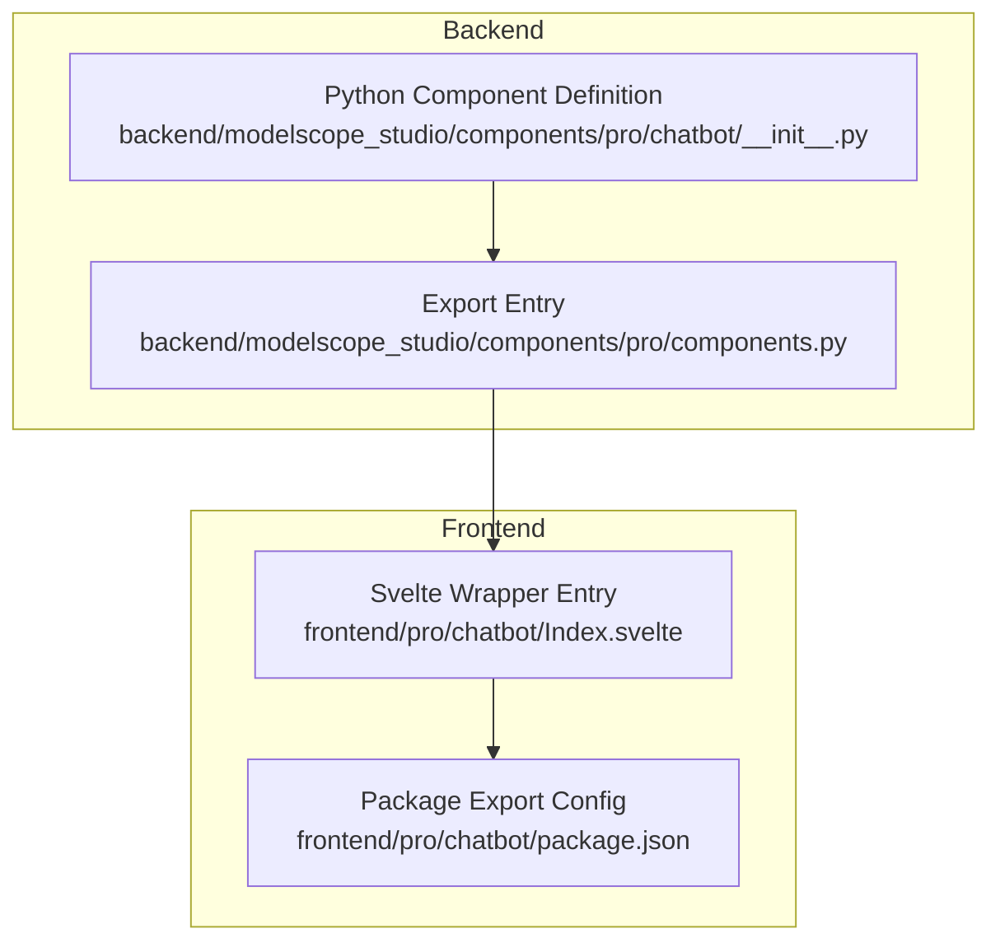
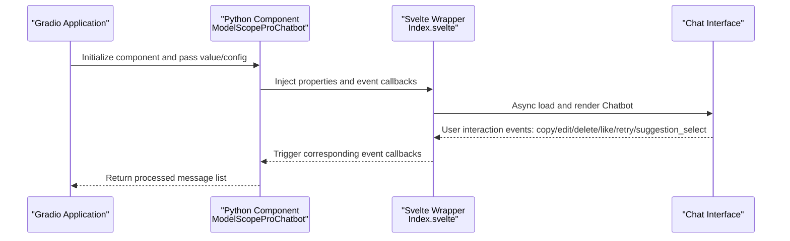
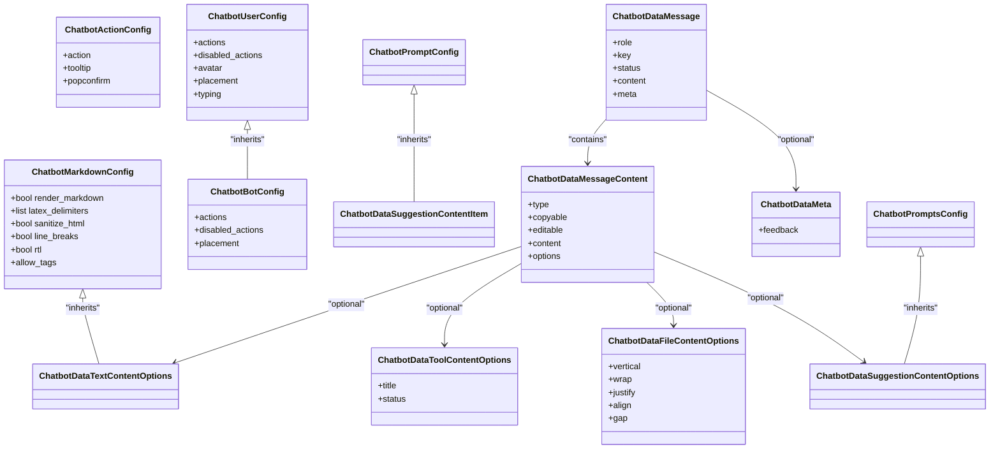
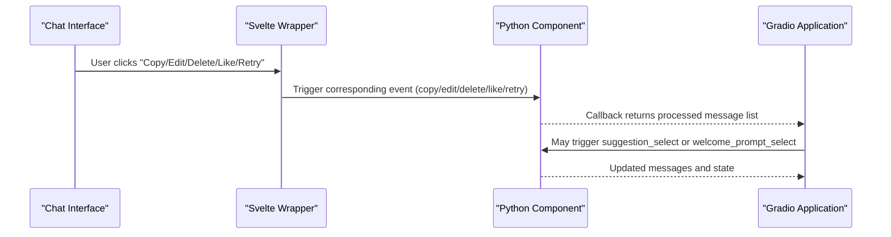
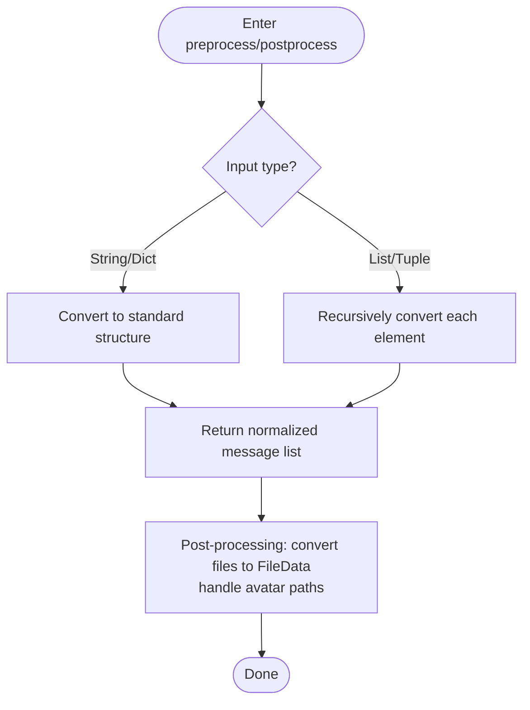
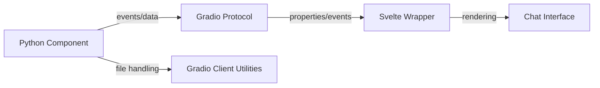

# Integration Examples

<cite>
**Files Referenced in This Document**
- [backend/modelscope_studio/components/pro/chatbot/__init__.py](file://backend/modelscope_studio/components/pro/chatbot/__init__.py)
- [backend/modelscope_studio/components/pro/components.py](file://backend/modelscope_studio/components/pro/components.py)
- [frontend/pro/chatbot/Index.svelte](file://frontend/pro/chatbot/Index.svelte)
- [frontend/pro/chatbot/package.json](file://frontend/pro/chatbot/package.json)
- [docs/layout_templates/chatbot/README.md](file://docs/layout_templates/chatbot/README.md)
- [docs/layout_templates/chatbot/app.py](file://docs/layout_templates/chatbot/app.py)
</cite>

## Table of Contents

1. [Introduction](#introduction)
2. [Project Structure](#project-structure)
3. [Core Components](#core-components)
4. [Architecture Overview](#architecture-overview)
5. [Detailed Component Analysis](#detailed-component-analysis)
6. [Dependency Analysis](#dependency-analysis)
7. [Performance Considerations](#performance-considerations)
8. [Troubleshooting Guide](#troubleshooting-guide)
9. [Conclusion](#conclusion)
10. [Appendix](#appendix)

## Introduction

This document is aimed at developers who need to integrate the Chatbot component into real-world projects, providing complete integration examples and best practices from the backend Python component to the frontend Svelte wrapper layer. Topics covered include: integration methods with Gradio applications, message data models and event binding, connection approaches with external AI services, data interaction strategies with databases, and implementation methods for various typical use cases (customer service bots, Q&A systems, content creation assistants). Deployment guidance, common problem solutions, and performance optimization recommendations are also provided.

## Project Structure

The Chatbot component consists of a backend Python component and a frontend Svelte wrapper:

- **Backend**: A Gradio-based custom component responsible for the message data model, pre/post-processing, static resource hosting, and event binding
- **Frontend**: A Svelte wrapper layer responsible for mapping Gradio properties to the internal chat component and enabling on-demand rendering via async loading

**Diagram Sources**

- [backend/modelscope_studio/components/pro/chatbot/**init**.py:286-495](file://backend/modelscope_studio/components/pro/chatbot/__init__.py#L286-L495)
- [backend/modelscope_studio/components/pro/components.py:1-8](file://backend/modelscope_studio/components/pro/components.py#L1-L8)
- [frontend/pro/chatbot/Index.svelte:1-90](file://frontend/pro/chatbot/Index.svelte#L1-L90)
- [frontend/pro/chatbot/package.json:1-15](file://frontend/pro/chatbot/package.json#L1-L15)

**Section Sources**

- [backend/modelscope_studio/components/pro/chatbot/**init**.py:286-495](file://backend/modelscope_studio/components/pro/chatbot/__init__.py#L286-L495)
- [backend/modelscope_studio/components/pro/components.py:1-8](file://backend/modelscope_studio/components/pro/components.py#L1-L8)
- [frontend/pro/chatbot/Index.svelte:1-90](file://frontend/pro/chatbot/Index.svelte#L1-L90)
- [frontend/pro/chatbot/package.json:1-15](file://frontend/pro/chatbot/package.json#L1-L15)

## Core Components

- **Message data model and configuration class family**:
  - Multiple content type options: text, tool, file, suggestion, etc.
  - User/bot message styles, avatars, action buttons, meta information, etc.
- **Main component**:
  - Supports height control, auto-scroll, welcome page, Markdown rendering, user/bot configuration
  - Event binding: change, copy, edit, delete, like, retry, suggestion_select, welcome_prompt_select
- **Pre-processing and post-processing**:
  - Converts message content passed in from the frontend to a format recognized by the backend; converts file paths to Gradio `FileData` and injects MIME types
  - Handles avatar and static resource paths

**Section Sources**

- [backend/modelscope_studio/components/pro/chatbot/**init**.py:14-284](file://backend/modelscope_studio/components/pro/chatbot/__init__.py#L14-L284)
- [backend/modelscope_studio/components/pro/chatbot/**init**.py:286-495](file://backend/modelscope_studio/components/pro/chatbot/__init__.py#L286-L495)

## Architecture Overview

The diagram below illustrates the call chain and data flow from the Gradio application to the Chatbot component:

**Diagram Sources**

- [backend/modelscope_studio/components/pro/chatbot/**init**.py:286-314](file://backend/modelscope_studio/components/pro/chatbot/__init__.py#L286-L314)
- [frontend/pro/chatbot/Index.svelte:67-89](file://frontend/pro/chatbot/Index.svelte#L67-L89)

## Detailed Component Analysis

### Data Model and Message Structure

- **Content types**:
  - Text, tool (with title and status), file (supports multiple files, auto-injects FileData), suggestion (Prompts)
- **Message object**:
  - Role (`user`/`assistant`/`system`/`divider`), key, status (`pending`/`done`), content, actions, meta information
- **Markdown and rendering**:
  - Configurable Markdown rendering, LaTeX delimiters, HTML sanitization, line breaks, RTL, allowed tags
- **File display layout**:
  - Flex layout parameters (vertical/wrap/justify/align/gap), with separately configurable image/video/audio properties
- **Action buttons**:
  - User and bot action sets can be independently configured, supporting Tooltip and confirmation popups

**Diagram Sources**

- [backend/modelscope_studio/components/pro/chatbot/**init**.py:14-284](file://backend/modelscope_studio/components/pro/chatbot/__init__.py#L14-L284)

**Section Sources**

- [backend/modelscope_studio/components/pro/chatbot/**init**.py:14-284](file://backend/modelscope_studio/components/pro/chatbot/__init__.py#L14-L284)

### Event Binding and Interaction Flow

- **Event list**:
  - `change`, `copy`, `edit`, `delete`, `like`, `retry`, `suggestion_select`, `welcome_prompt_select`
- **Binding mechanism**:
  - Corresponding callbacks are bound at initialization via Gradio event listeners; upon triggering, they update the internal state and return it to the application

**Diagram Sources**

- [backend/modelscope_studio/components/pro/chatbot/**init**.py:289-314](file://backend/modelscope_studio/components/pro/chatbot/__init__.py#L289-L314)

**Section Sources**

- [backend/modelscope_studio/components/pro/chatbot/**init**.py:289-314](file://backend/modelscope_studio/components/pro/chatbot/__init__.py#L289-L314)

### Pre-Processing and Post-Processing Logic

- **Pre-processing**:
  - Extracts `FileData` paths from file-type content as strings for cross-layer transfer
- **Post-processing**:
  - Converts file paths to Gradio `FileData`, auto-infers MIME type and size, supports HTTP/local paths
  - Avatar and static resource paths are uniformly processed via `serve_static_file`

**Diagram Sources**

- [backend/modelscope_studio/components/pro/chatbot/**init**.py:400-495](file://backend/modelscope_studio/components/pro/chatbot/__init__.py#L400-L495)

**Section Sources**

- [backend/modelscope_studio/components/pro/chatbot/**init**.py:400-495](file://backend/modelscope_studio/components/pro/chatbot/__init__.py#L400-L495)

### Integration with Gradio Applications

- **Export and import**:
  - Components are uniformly exposed via the export entry on the backend; the frontend is parsed by Gradio in Svelte wrapper form
- **Property passing**:
  - The Svelte wrapper layer passes Gradio shared properties (`root`, `api_prefix`, `theme`) through to the component
- **Example templates**:
  - Application templates and demo pages are provided, showcasing multi-conversation management, history operations, interrupt notifications, input suggestions, and file upload features

**Section Sources**

- [backend/modelscope_studio/components/pro/components.py:1-8](file://backend/modelscope_studio/components/pro/components.py#L1-L8)
- [frontend/pro/chatbot/Index.svelte:14-89](file://frontend/pro/chatbot/Index.svelte#L14-L89)
- [docs/layout_templates/chatbot/README.md:1-20](file://docs/layout_templates/chatbot/README.md#L1-L20)
- [docs/layout_templates/chatbot/app.py:1-7](file://docs/layout_templates/chatbot/app.py#L1-L7)

## Dependency Analysis

- **Component coupling**:
  - The backend component and frontend wrapper are decoupled via the Gradio protocol; the frontend is only responsible for property mapping and async loading
- **External dependencies**:
  - Uses Gradio's data classes and event system; file processing depends on Gradio Client utilities
- **Package export**:
  - The frontend package exports the entry point in a Gradio-compatible manner, ensuring it can be used directly in the Gradio ecosystem

**Diagram Sources**

- [backend/modelscope_studio/components/pro/chatbot/**init**.py:286-495](file://backend/modelscope_studio/components/pro/chatbot/__init__.py#L286-L495)
- [frontend/pro/chatbot/package.json:4-13](file://frontend/pro/chatbot/package.json#L4-L13)

**Section Sources**

- [backend/modelscope_studio/components/pro/chatbot/**init**.py:286-495](file://backend/modelscope_studio/components/pro/chatbot/__init__.py#L286-L495)
- [frontend/pro/chatbot/package.json:4-13](file://frontend/pro/chatbot/package.json#L4-L13)

## Performance Considerations

- **Rendering optimization**:
  - Use async component loading to avoid blocking the initial render
  - Control the number of messages and file sizes; use pagination or lazy loading when necessary
- **Event handling**:
  - Throttle or debounce high-frequency events (such as copy/edit)
- **File handling**:
  - Prefer using HTTP links to reduce local read overhead; local files auto-calculate size and MIME type
- **Theme and styles**:
  - Unified rendering via Gradio shared theme properties reduces redundant computations

## Troubleshooting Guide

- **Unable to display file content**:
  - Check whether the file path is correct and whether the HTTP link is accessible; confirm that the post-processing stage has converted to `FileData`
- **Avatar not displayed**:
  - Confirm that the avatar path has been converted via the static resource handling function
- **Events not triggered**:
  - Confirm that event names are spelled consistently and have been bound at initialization
- **Message status is abnormal**:
  - `pending` status does not render the action area; check the status setting logic

**Section Sources**

- [backend/modelscope_studio/components/pro/chatbot/**init**.py:390-495](file://backend/modelscope_studio/components/pro/chatbot/__init__.py#L390-L495)

## Conclusion

The Chatbot component, with its clear data model, comprehensive event system, and decoupled frontend-backend design, can efficiently support various chat scenarios. Combined with Gradio application templates and the Svelte wrapper layer, developers can quickly build intelligent chat interfaces with multi-turn conversation, history management, file upload, and feedback capabilities, and then extend and optimize from there.

## Appendix

### Scenario-Specific Integration Notes

- **Customer service bot**:
  - Use the welcome page and prompts to guide users; enable "retry" and "edit" actions to improve error correction efficiency
- **Q&A system**:
  - Use "suggestion select" and "welcome prompt select" to quickly generate questions; enable LaTeX rendering for formula support
- **Content creation assistant**:
  - Support multiple file type uploads and display; use "like/feedback" to collect user preferences

### Deployment and Running

- **Running example application templates**:
  - Use the entry script provided by the documentation template to start queues and services
- **Package export and installation**:
  - The frontend package is exported in a Gradio-compatible manner and can be referenced directly in a Gradio environment

**Section Sources**

- [docs/layout_templates/chatbot/app.py:1-7](file://docs/layout_templates/chatbot/app.py#L1-L7)
- [frontend/pro/chatbot/package.json:4-13](file://frontend/pro/chatbot/package.json#L4-L13)
