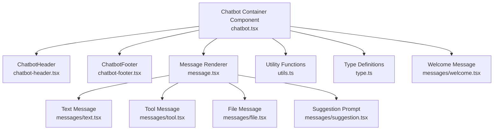
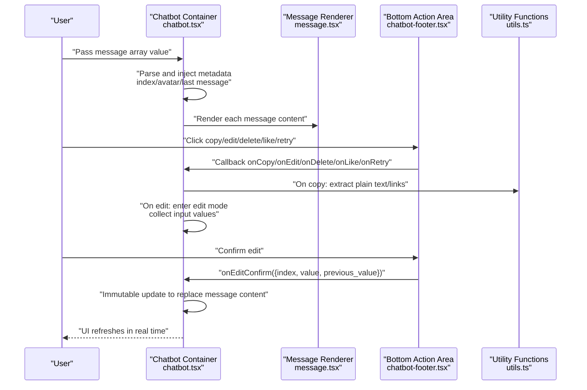
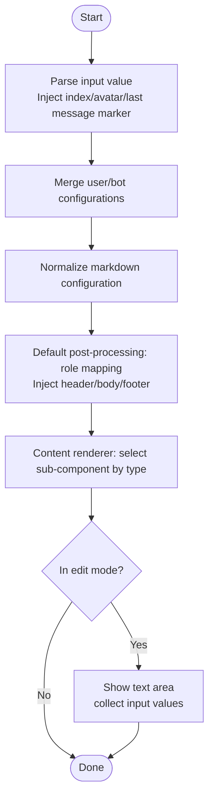
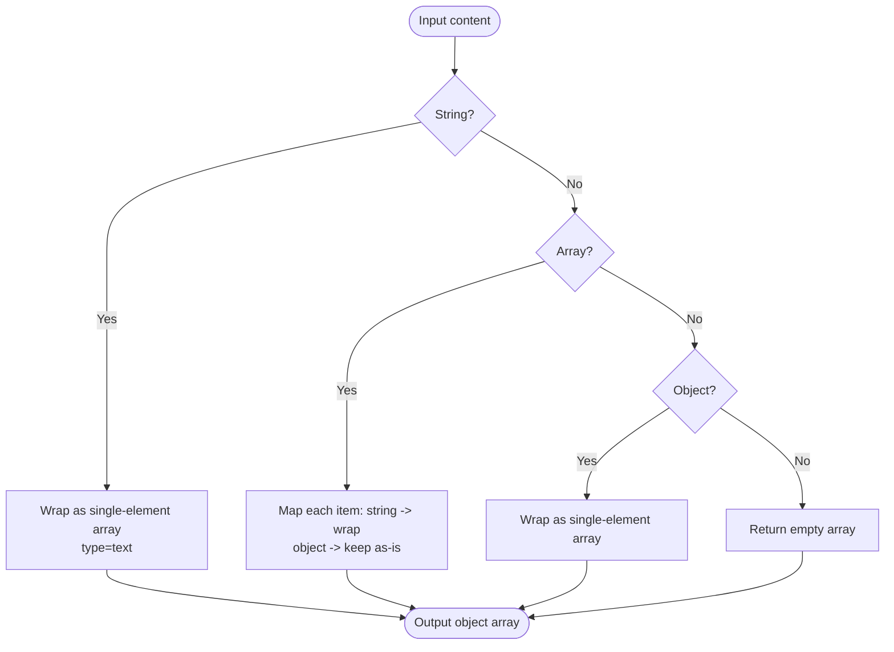
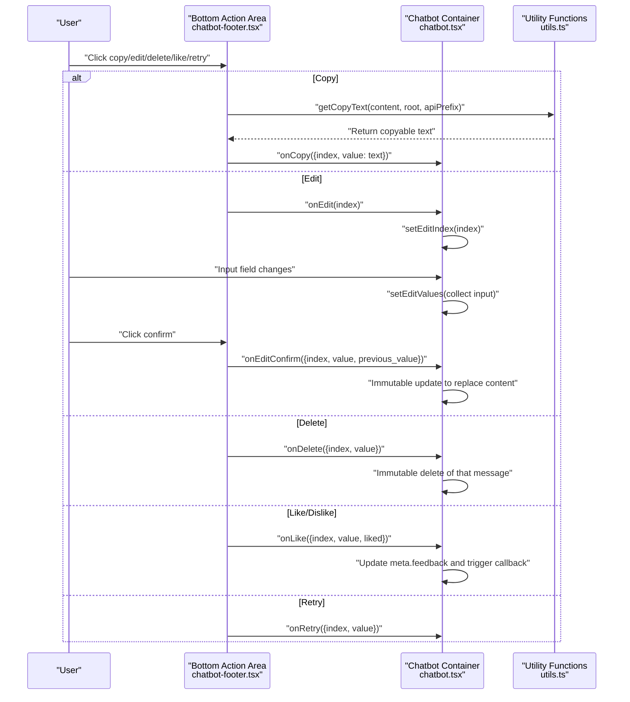
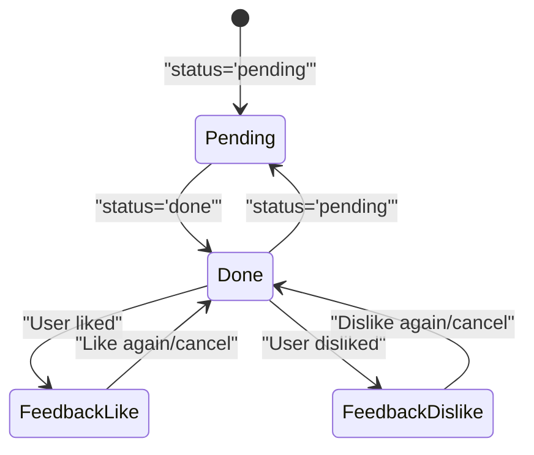
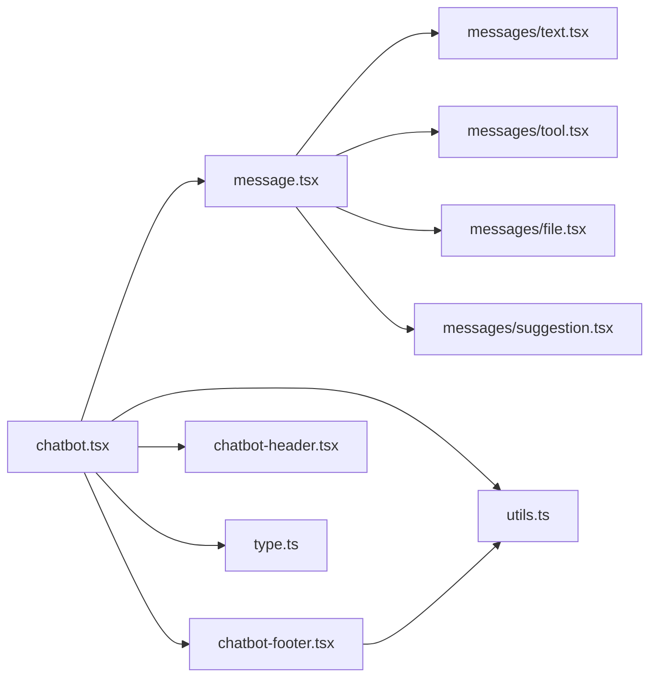

# Message Processing

<cite>
**Files Referenced in This Document**
- [frontend/pro/chatbot/chatbot.tsx](file://frontend/pro/chatbot/chatbot.tsx)
- [frontend/pro/chatbot/message.tsx](file://frontend/pro/chatbot/message.tsx)
- [frontend/pro/chatbot/utils.ts](file://frontend/pro/chatbot/utils.ts)
- [frontend/pro/chatbot/type.ts](file://frontend/pro/chatbot/type.ts)
- [frontend/pro/chatbot/chatbot-footer.tsx](file://frontend/pro/chatbot/chatbot-footer.tsx)
- [frontend/pro/chatbot/chatbot-header.tsx](file://frontend/pro/chatbot/chatbot-header.tsx)
- [frontend/pro/chatbot/messages/text.tsx](file://frontend/pro/chatbot/messages/text.tsx)
- [frontend/pro/chatbot/messages/tool.tsx](file://frontend/pro/chatbot/messages/tool.tsx)
- [frontend/pro/chatbot/messages/file.tsx](file://frontend/pro/chatbot/messages/file.tsx)
- [frontend/pro/chatbot/messages/suggestion.tsx](file://frontend/pro/chatbot/messages/suggestion.tsx)
- [frontend/pro/chatbot/messages/welcome.tsx](file://frontend/pro/chatbot/messages/welcome.tsx)
</cite>

## Table of Contents

1. [Introduction](#introduction)
2. [Project Structure](#project-structure)
3. [Core Components](#core-components)
4. [Architecture Overview](#architecture-overview)
5. [Detailed Component Analysis](#detailed-component-analysis)
6. [Dependency Analysis](#dependency-analysis)
7. [Performance Considerations](#performance-considerations)
8. [Troubleshooting Guide](#troubleshooting-guide)
9. [Conclusion](#conclusion)

## Introduction

This chapter covers the message processing capabilities of the Chatbot component, systematically explaining the pre-processing and post-processing mechanisms for messages, content transformation and formatting, event binding and handling (copy, edit, delete, like/dislike, retry, etc.), message state management (pending, done) and real-time update strategies, and provides extensible customization methods and callback usage recommendations. The document is organized in a progressive manner, suitable both for quick onboarding and for in-depth understanding of implementation details.

## Project Structure

Message processing code is concentrated in the frontend `pro/chatbot` directory, using a layered design of "container component + message sub-components + utility functions + type definitions":

- **Container component**: Responsible for message list rendering, event bridging, state management, and scroll control
- **Message sub-components**: Render text, tool output, file attachments, suggestion prompts, and other types
- **Utility functions**: Message content normalization, copy text extraction, edit content update, avatar property parsing, etc.
- **Type definitions**: Unified message structure, action data, configuration items, and callback parameters

**Diagram Sources**

- [frontend/pro/chatbot/chatbot.tsx:1-475](file://frontend/pro/chatbot/chatbot.tsx#L1-L475)
- [frontend/pro/chatbot/message.tsx:1-184](file://frontend/pro/chatbot/message.tsx#L1-L184)
- [frontend/pro/chatbot/utils.ts:1-157](file://frontend/pro/chatbot/utils.ts#L1-L157)
- [frontend/pro/chatbot/type.ts:1-197](file://frontend/pro/chatbot/type.ts#L1-L197)
- [frontend/pro/chatbot/chatbot-footer.tsx:1-363](file://frontend/pro/chatbot/chatbot-footer.tsx#L1-L363)
- [frontend/pro/chatbot/chatbot-header.tsx:1-23](file://frontend/pro/chatbot/chatbot-header.tsx#L1-L23)
- [frontend/pro/chatbot/messages/text.tsx:1-19](file://frontend/pro/chatbot/messages/text.tsx#L1-L19)
- [frontend/pro/chatbot/messages/tool.tsx:1-46](file://frontend/pro/chatbot/messages/tool.tsx#L1-L46)
- [frontend/pro/chatbot/messages/file.tsx:1-119](file://frontend/pro/chatbot/messages/file.tsx#L1-L119)
- [frontend/pro/chatbot/messages/suggestion.tsx:1-37](file://frontend/pro/chatbot/messages/suggestion.tsx#L1-L37)
- [frontend/pro/chatbot/messages/welcome.tsx:1-55](file://frontend/pro/chatbot/messages/welcome.tsx#L1-L55)

**Section Sources**

- [frontend/pro/chatbot/chatbot.tsx:1-475](file://frontend/pro/chatbot/chatbot.tsx#L1-L475)
- [frontend/pro/chatbot/message.tsx:1-184](file://frontend/pro/chatbot/message.tsx#L1-L184)
- [frontend/pro/chatbot/utils.ts:1-157](file://frontend/pro/chatbot/utils.ts#L1-L157)
- [frontend/pro/chatbot/type.ts:1-197](file://frontend/pro/chatbot/type.ts#L1-L197)

## Core Components

- **Chatbot container component**: Responsible for message list rendering, scroll control, event bridging (copy, edit, delete, like/dislike, retry, suggestion selection, welcome prompt selection), and message state changes (e.g., feedback marking)
- **Message renderer**: Differentiates rendering based on message content type (text, tool, file, suggestion); supports inline editing of editable content in edit mode
- **Message sub-components**: Handle text Markdown rendering, tool output collapsible panels, file attachment cards, and suggestion prompt lists respectively
- **Utility functions**: Message content normalization, copy text extraction, edit content update, avatar property parsing, suggestion content traversal
- **Type definitions**: Unified message structure, action data, configuration items, and callback parameters to ensure compile-time constraints and IDE hints

**Section Sources**

- [frontend/pro/chatbot/chatbot.tsx:51-472](file://frontend/pro/chatbot/chatbot.tsx#L51-L472)
- [frontend/pro/chatbot/message.tsx:25-183](file://frontend/pro/chatbot/message.tsx#L25-L183)
- [frontend/pro/chatbot/utils.ts:46-157](file://frontend/pro/chatbot/utils.ts#L46-L157)
- [frontend/pro/chatbot/type.ts:121-197](file://frontend/pro/chatbot/type.ts#L121-L197)

## Architecture Overview

The overall message processing flow is as follows:

- The input message array is parsed by the container component into Bubble list items, with injected index, header/footer info, avatar properties, and "is last message" markers
- Each message is dispatched by the Message renderer to the corresponding sub-component based on type in the default post-processing stage
- Users trigger copy, edit, delete, like/dislike, and retry events through the bottom action area; the container component passes events and indexes to the parent application via callbacks
- The edit flow uses a two-stage interaction of "edit mode → confirm/cancel"; upon confirmation, the corresponding message content is replaced via an immutable update
- State management records feedback state via the message object's `meta` field, supporting `pending`/`done` states to drive collapsible panels in tool messages

**Diagram Sources**

- [frontend/pro/chatbot/chatbot.tsx:137-245](file://frontend/pro/chatbot/chatbot.tsx#L137-L245)
- [frontend/pro/chatbot/message.tsx:52-175](file://frontend/pro/chatbot/message.tsx#L52-L175)
- [frontend/pro/chatbot/chatbot-footer.tsx:255-362](file://frontend/pro/chatbot/chatbot-footer.tsx#L255-L362)
- [frontend/pro/chatbot/utils.ts:105-140](file://frontend/pro/chatbot/utils.ts#L105-L140)

## Detailed Component Analysis

### Message Pre-Processing and Post-Processing Mechanisms

- **Pre-processing**:
  - Parse the input message array, inject index, header/footer info, avatar properties, "is last message" marker, and generate a unique key for each message
  - Merge user/bot configurations, unify styles, class names, element classes, etc.
  - Normalize the markdown configuration, inject root path and theme mode
- **Post-processing**:
  - Default post-processing stage: render header/body/footer based on role, inject avatar, title, and content renderer
  - Content renderer: selects text, tool, file, or suggestion component based on message type
  - Edit mode: when a message is in edit mode, editable types (text, tool) display a text area, with input values temporarily stored in `editValues`

**Diagram Sources**

- [frontend/pro/chatbot/chatbot.tsx:137-165](file://frontend/pro/chatbot/chatbot.tsx#L137-L165)
- [frontend/pro/chatbot/chatbot.tsx:246-422](file://frontend/pro/chatbot/chatbot.tsx#L246-L422)
- [frontend/pro/chatbot/message.tsx:52-81](file://frontend/pro/chatbot/message.tsx#L52-L81)

**Section Sources**

- [frontend/pro/chatbot/chatbot.tsx:137-165](file://frontend/pro/chatbot/chatbot.tsx#L137-L165)
- [frontend/pro/chatbot/chatbot.tsx:246-422](file://frontend/pro/chatbot/chatbot.tsx#L246-L422)
- [frontend/pro/chatbot/message.tsx:52-81](file://frontend/pro/chatbot/message.tsx#L52-L81)

### Message Content Transformation, Validation, and Formatting

- **Normalization**: Uniformly wraps string, array, or object-form content as an array of objects, ensuring consistent downstream rendering
- **Copy text extraction**: Extracts copyable text based on content type and `copyable` flag; file types return a JSON representation of accessible link URLs
- **Edit content update**: Generates a new content structure based on the current content shape (string/array/object) and edit mapping
- **Suggestion content traversal**: Recursively traverses nested suggestions to uniformly set disabled state and other properties

**Diagram Sources**

- [frontend/pro/chatbot/utils.ts:46-72](file://frontend/pro/chatbot/utils.ts#L46-L72)

**Section Sources**

- [frontend/pro/chatbot/utils.ts:46-157](file://frontend/pro/chatbot/utils.ts#L46-L157)

### Message Event Binding and Handling (copy/edit/delete/like/retry)

- **Copy** (`copy`):
  - Triggered by the copy button in the bottom action area; internally calls the copy text extraction function and ultimately triggers the `onCopy` callback
- **Edit** (`edit`):
  - After entering edit mode, input values are temporarily stored in `editValues`; upon confirmation, the corresponding message content is replaced via an immutable update and the `onEdit` callback is triggered
- **Delete** (`delete`):
  - Triggered by an immutable update that deletes the message item at the corresponding index, and triggers the `onDelete` callback
- **Like/Dislike** (`like`/`dislike`):
  - Updates the message's `meta.feedback` field, supports toggling; triggers the `onLike` callback simultaneously
- **Retry** (`retry`):
  - Triggers the `onRetry` callback, leaving it to the parent to decide how to handle it

**Diagram Sources**

- [frontend/pro/chatbot/chatbot-footer.tsx:53-100](file://frontend/pro/chatbot/chatbot-footer.tsx#L53-L100)
- [frontend/pro/chatbot/chatbot-footer.tsx:255-362](file://frontend/pro/chatbot/chatbot-footer.tsx#L255-L362)
- [frontend/pro/chatbot/chatbot.tsx:195-245](file://frontend/pro/chatbot/chatbot.tsx#L195-L245)
- [frontend/pro/chatbot/utils.ts:105-140](file://frontend/pro/chatbot/utils.ts#L105-L140)

**Section Sources**

- [frontend/pro/chatbot/chatbot-footer.tsx:53-100](file://frontend/pro/chatbot/chatbot-footer.tsx#L53-L100)
- [frontend/pro/chatbot/chatbot-footer.tsx:255-362](file://frontend/pro/chatbot/chatbot-footer.tsx#L255-L362)
- [frontend/pro/chatbot/chatbot.tsx:195-245](file://frontend/pro/chatbot/chatbot.tsx#L195-L245)
- [frontend/pro/chatbot/utils.ts:105-140](file://frontend/pro/chatbot/utils.ts#L105-L140)

### Message State Management (pending, done) and Real-Time Updates

- **Status field**: Message objects support a `status` field to identify "pending" or "done" states
- **Tool message state linkage**: The tool message component controls the collapsible panel's initial expanded state based on `status`
- **Feedback state**: The message object's `meta.feedback` records user feedback (like/dislike/null), used for UI coloring and state toggling
- **Immutable updates**: Edit confirmation, deletion, and like/dislike all modify the message array via an immutable update strategy, ensuring effective React diff and re-rendering

**Diagram Sources**

- [frontend/pro/chatbot/type.ts:154-157](file://frontend/pro/chatbot/type.ts#L154-L157)
- [frontend/pro/chatbot/messages/tool.tsx:14-18](file://frontend/pro/chatbot/messages/tool.tsx#L14-L18)
- [frontend/pro/chatbot/chatbot.tsx:222-237](file://frontend/pro/chatbot/chatbot.tsx#L222-L237)

**Section Sources**

- [frontend/pro/chatbot/type.ts:154-157](file://frontend/pro/chatbot/type.ts#L154-L157)
- [frontend/pro/chatbot/messages/tool.tsx:14-18](file://frontend/pro/chatbot/messages/tool.tsx#L14-L18)
- [frontend/pro/chatbot/chatbot.tsx:222-237](file://frontend/pro/chatbot/chatbot.tsx#L222-L237)

### Custom Extensions and Callback Usage

- **Custom rendering**:
  - Inject styles, class names, element classes, header/footer content, and avatars via Chatbot's `userConfig`/`botConfig`
  - Control Markdown rendering behavior and theme mode via `markdownConfig`
- **Custom actions**:
  - `actions`/`disabled_actions` supports enabling/disabling and secondary confirmation for copy, edit, delete, like/dislike, and retry actions
  - Actions can include Tooltip and Popconfirm prompts
- **Callback extensions**:
  - `onCopy`/`onEdit`/`onDelete`/`onLike`/`onRetry`/`onSuggestionSelect`/`onWelcomePromptSelect` and other callbacks for business integration
  - `onValueChange` for receiving the latest value after message array changes, for persistence or further processing

**Section Sources**

- [frontend/pro/chatbot/chatbot.tsx:66-107](file://frontend/pro/chatbot/chatbot.tsx#L66-L107)
- [frontend/pro/chatbot/chatbot.tsx:379-400](file://frontend/pro/chatbot/chatbot.tsx#L379-L400)
- [frontend/pro/chatbot/type.ts:79-119](file://frontend/pro/chatbot/type.ts#L79-L119)

### Message Sub-Components and Rendering Logic

- **Text messages**: Support Markdown rendering or direct text display
- **Tool messages**: Support Markdown rendering for title and content; state-driven collapsible panel
- **File messages**: Support image/video/audio cards; automatically resolves accessible links
- **Suggestion prompts**: Support multi-level nesting with unified disabled state and click callbacks
- **Welcome messages**: Integrate welcome text and prompt word lists; support icon URL resolution

**Section Sources**

- [frontend/pro/chatbot/messages/text.tsx:11-18](file://frontend/pro/chatbot/messages/text.tsx#L11-L18)
- [frontend/pro/chatbot/messages/tool.tsx:13-45](file://frontend/pro/chatbot/messages/tool.tsx#L13-L45)
- [frontend/pro/chatbot/messages/file.tsx:44-118](file://frontend/pro/chatbot/messages/file.tsx#L44-L118)
- [frontend/pro/chatbot/messages/suggestion.tsx:16-36](file://frontend/pro/chatbot/messages/suggestion.tsx#L16-L36)
- [frontend/pro/chatbot/messages/welcome.tsx:18-54](file://frontend/pro/chatbot/messages/welcome.tsx#L18-L54)

## Dependency Analysis

- **Component coupling**:
  - Chatbot has strong dependencies on Message, ChatbotHeader, ChatbotFooter, utility functions, and type definitions
  - Message has conditional rendering dependencies on each message sub-component
  - ChatbotFooter directly calls copy text extraction and content update functions from utility functions
- **External dependencies**:
  - Uses Ant Design component library and `@ant-design/x`'s Bubble/List/Prompts/Welcome and other components
  - Uses `immer` for immutable updates
  - Uses `lodash-es`'s `isEqual`/`omit` and other utility functions

**Diagram Sources**

- [frontend/pro/chatbot/chatbot.tsx:20-47](file://frontend/pro/chatbot/chatbot.tsx#L20-L47)
- [frontend/pro/chatbot/message.tsx:6-23](file://frontend/pro/chatbot/message.tsx#L6-L23)
- [frontend/pro/chatbot/chatbot-footer.tsx:32-31](file://frontend/pro/chatbot/chatbot-footer.tsx#L32-L31)

**Section Sources**

- [frontend/pro/chatbot/chatbot.tsx:1-475](file://frontend/pro/chatbot/chatbot.tsx#L1-L475)
- [frontend/pro/chatbot/message.tsx:1-184](file://frontend/pro/chatbot/message.tsx#L1-L184)
- [frontend/pro/chatbot/chatbot-footer.tsx:1-363](file://frontend/pro/chatbot/chatbot-footer.tsx#L1-L363)
- [frontend/pro/chatbot/utils.ts:1-157](file://frontend/pro/chatbot/utils.ts#L1-L157)
- [frontend/pro/chatbot/type.ts:1-197](file://frontend/pro/chatbot/type.ts#L1-L197)

## Performance Considerations

- **Immutable updates**: Reduce unnecessary re-renders via immutable update strategy to improve list update efficiency
- **Event memoization**: Wrap callbacks with `useMemoizedFn` to reduce sub-component re-renders caused by reference changes
- **Conditional rendering**: Only render the bottom action area and edit mode UI when needed, avoiding unnecessary DOM structure
- **State minimization**: Edit mode only saves the necessary `editValues` mapping, avoiding redundant state
- **Scroll control**: Use `useScroll` hooks to control scroll button display and scroll behavior, avoiding frequent scroll calculations

**Section Sources**

- [frontend/pro/chatbot/chatbot.tsx:172-183](file://frontend/pro/chatbot/chatbot.tsx#L172-L183)
- [frontend/pro/chatbot/chatbot.tsx:433-438](file://frontend/pro/chatbot/chatbot.tsx#L433-L438)
- [frontend/pro/chatbot/chatbot-footer.tsx:273-301](file://frontend/pro/chatbot/chatbot-footer.tsx#L273-L301)

## Troubleshooting Guide

- **Copy result is empty**:
  - Check whether the content is marked as not copyable (`copyable=false`) or if the content shape doesn't support extraction
  - Confirm that `rootUrl` and `apiPrefix` are correct and that file link resolution is available
- **Edit confirmation has no effect**:
  - Confirm that the current message is in edit mode (`isEditing`) and that `editIndex` matches the current index
  - Check whether `editValues` contains the input value for the corresponding index
- **Like/dislike state is abnormal**:
  - Check whether `meta.feedback` is being correctly updated and whether the UI coloring depends on this field
- **Tool message not collapsed as expected**:
  - Confirm whether `status` is `'pending'` or `'done'`; the initial collapse state of the panel is determined by this status
- **Welcome prompt click has no response**:
  - Check whether the `onWelcomePromptSelect` callback is correctly passed and whether the `items` in Prompts are correctly parsed

**Section Sources**

- [frontend/pro/chatbot/utils.ts:105-140](file://frontend/pro/chatbot/utils.ts#L105-L140)
- [frontend/pro/chatbot/chatbot-footer.tsx:291-298](file://frontend/pro/chatbot/chatbot-footer.tsx#L291-L298)
- [frontend/pro/chatbot/chatbot.tsx:222-237](file://frontend/pro/chatbot/chatbot.tsx#L222-L237)
- [frontend/pro/chatbot/messages/tool.tsx:14-18](file://frontend/pro/chatbot/messages/tool.tsx#L14-L18)
- [frontend/pro/chatbot/messages/welcome.tsx:46-51](file://frontend/pro/chatbot/messages/welcome.tsx#L46-L51)

## Conclusion

Through a clear pre-processing/post-processing pipeline, comprehensive event bridging, and an immutable update strategy, this component achieves efficient rendering and interaction of multiple message types. With rich configuration and callback extension points, developers can flexibly customize the UI and business logic without disrupting the overall structure. Combined with performance optimization and troubleshooting advice, this further enhances user experience and development efficiency.
