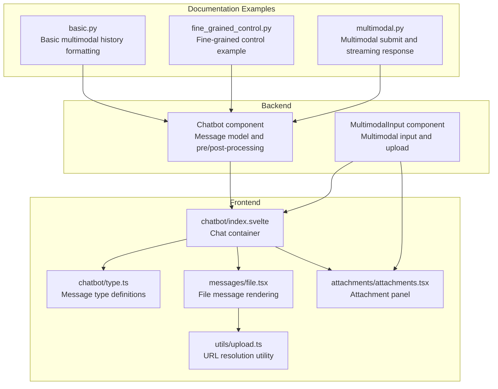
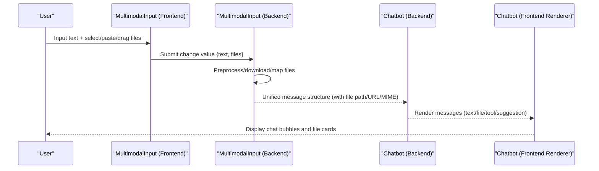
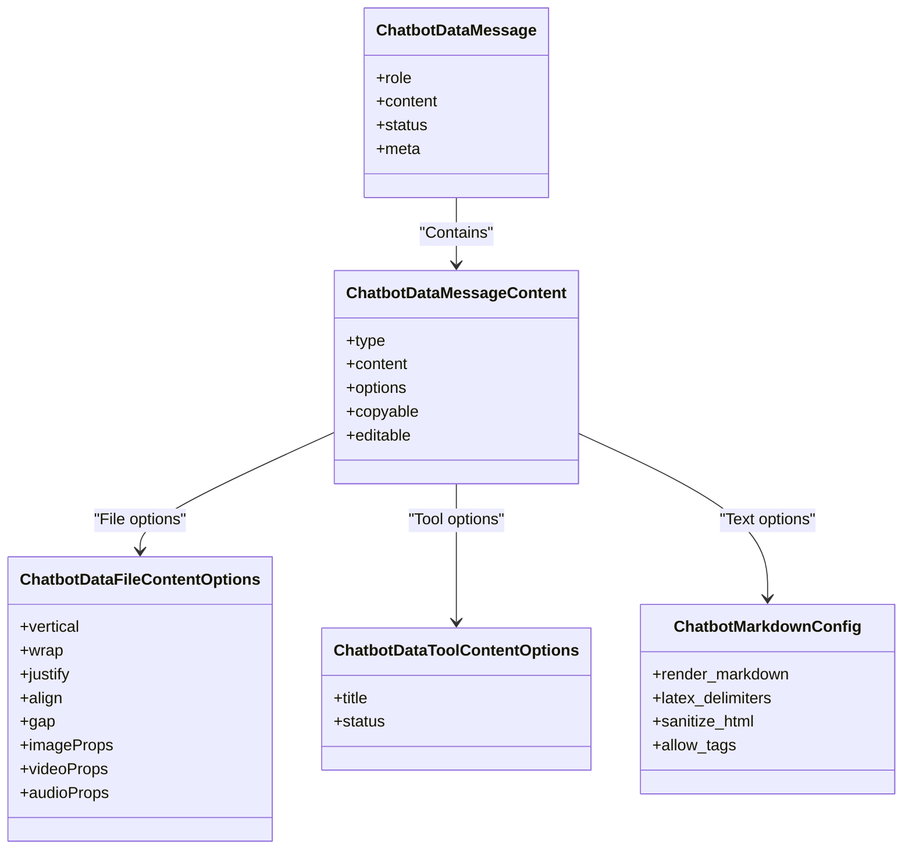
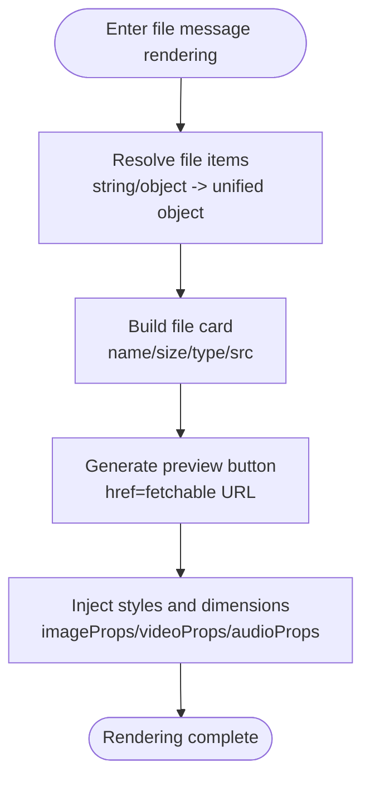
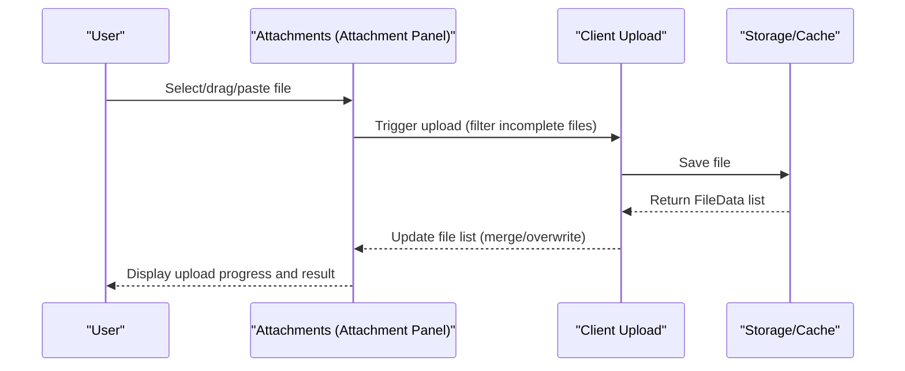
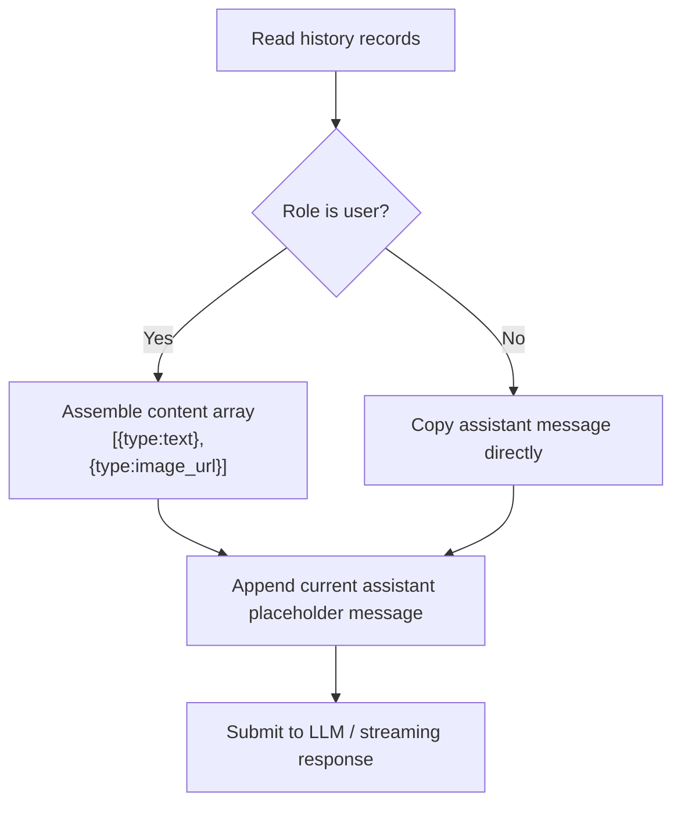
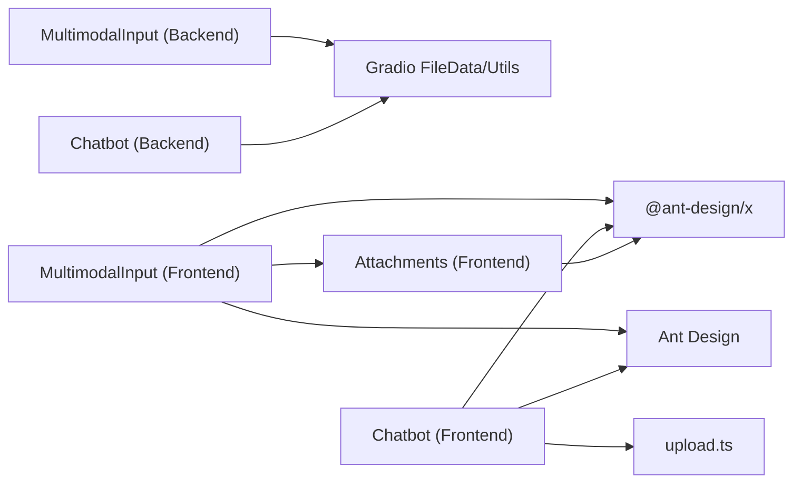

# Multimodal Support

<cite>
**Files Referenced in This Document**
- [backend/modelscope_studio/components/pro/chatbot/__init__.py](file://backend/modelscope_studio/components/pro/chatbot/__init__.py)
- [backend/modelscope_studio/components/pro/multimodal_input/__init__.py](file://backend/modelscope_studio/components/pro/multimodal_input/__init__.py)
- [frontend/pro/chatbot/index.svelte](file://frontend/pro/chatbot/index.svelte)
- [frontend/pro/multimodal-input/index.svelte](file://frontend/pro/multimodal-input/index.svelte)
- [frontend/pro/chatbot/type.ts](file://frontend/pro/chatbot/type.ts)
- [frontend/pro/chatbot/messages/file.tsx](file://frontend/pro/chatbot/messages/file.tsx)
- [frontend/antdx/attachments/attachments.tsx](file://frontend/antdx/attachments/attachments.tsx)
- [frontend/utils/upload.ts](file://frontend/utils/upload.ts)
- [docs/layout_templates/chatbot/demos/basic.py](file://docs/layout_templates/chatbot/demos/basic.py)
- [docs/layout_templates/chatbot/demos/fine_grained_control.py](file://docs/layout_templates/chatbot/demos/fine_grained_control.py)
- [docs/components/pro/chatbot/demos/multimodal.py](file://docs/components/pro/chatbot/demos/multimodal.py)
</cite>

## Table of Contents

1. [Introduction](#introduction)
2. [Project Structure](#project-structure)
3. [Core Components](#core-components)
4. [Architecture Overview](#architecture-overview)
5. [Detailed Component Analysis](#detailed-component-analysis)
6. [Dependency Analysis](#dependency-analysis)
7. [Performance Considerations](#performance-considerations)
8. [Troubleshooting Guide](#troubleshooting-guide)
9. [Conclusion](#conclusion)
10. [Appendix](#appendix)

## Introduction

This chapter focuses on the multimodal support capabilities of the Chatbot component. It systematically describes the processing mechanisms for multimedia content such as images, videos, audio, and files, covering message structure definitions, frontend/backend data flow, upload/download/preview processes, and security and performance optimization strategies. Readers can use this to build conversational applications with multimodal input/output capabilities in the Gradio/ModelScope ecosystem.

## Project Structure

Multimodal support is accomplished collaboratively by three parts: "backend component + frontend rendering + utility functions":

- Backend components are responsible for the message data model, preprocessing/postprocessing logic, static resource services, and event binding
- Frontend components handle chat bubble rendering, attachment panels, file card display, and interaction
- Utility functions handle file URL resolution and fetchable URL generation

**Diagram sources**

- [backend/modelscope_studio/components/pro/chatbot/**init**.py:286-495](file://backend/modelscope_studio/components/pro/chatbot/__init__.py#L286-L495)
- [backend/modelscope_studio/components/pro/multimodal_input/**init**.py:82-259](file://backend/modelscope_studio/components/pro/multimodal_input/__init__.py#L82-L259)
- [frontend/pro/chatbot/index.svelte:1-90](file://frontend/pro/chatbot/index.svelte#L1-L90)
- [frontend/pro/multimodal-input/index.svelte:1-99](file://frontend/pro/multimodal-input/index.svelte#L1-L99)
- [frontend/pro/chatbot/type.ts:1-197](file://frontend/pro/chatbot/type.ts#L1-L197)
- [frontend/pro/chatbot/messages/file.tsx:1-119](file://frontend/pro/chatbot/messages/file.tsx#L1-L119)
- [frontend/antdx/attachments/attachments.tsx:1-413](file://frontend/antdx/attachments/attachments.tsx#L1-L413)
- [frontend/utils/upload.ts:1-45](file://frontend/utils/upload.ts#L1-L45)
- [docs/layout_templates/chatbot/demos/basic.py:145-181](file://docs/layout_templates/chatbot/demos/basic.py#L145-L181)
- [docs/layout_templates/chatbot/demos/fine_grained_control.py:100-133](file://docs/layout_templates/chatbot/demos/fine_grained_control.py#L100-L133)
- [docs/components/pro/chatbot/demos/multimodal.py:82-118](file://docs/components/pro/chatbot/demos/multimodal.py#L82-L118)

**Section sources**

- [backend/modelscope_studio/components/pro/chatbot/**init**.py:286-495](file://backend/modelscope_studio/components/pro/chatbot/__init__.py#L286-L495)
- [backend/modelscope_studio/components/pro/multimodal_input/**init**.py:82-259](file://backend/modelscope_studio/components/pro/multimodal_input/__init__.py#L82-L259)
- [frontend/pro/chatbot/index.svelte:1-90](file://frontend/pro/chatbot/index.svelte#L1-L90)
- [frontend/pro/multimodal-input/index.svelte:1-99](file://frontend/pro/multimodal-input/index.svelte#L1-L99)
- [frontend/pro/chatbot/type.ts:1-197](file://frontend/pro/chatbot/type.ts#L1-L197)
- [frontend/pro/chatbot/messages/file.tsx:1-119](file://frontend/pro/chatbot/messages/file.tsx#L1-L119)
- [frontend/antdx/attachments/attachments.tsx:1-413](file://frontend/antdx/attachments/attachments.tsx#L1-L413)
- [frontend/utils/upload.ts:1-45](file://frontend/utils/upload.ts#L1-L45)
- [docs/layout_templates/chatbot/demos/basic.py:145-181](file://docs/layout_templates/chatbot/demos/basic.py#L145-L181)
- [docs/layout_templates/chatbot/demos/fine_grained_control.py:100-133](file://docs/layout_templates/chatbot/demos/fine_grained_control.py#L100-L133)
- [docs/components/pro/chatbot/demos/multimodal.py:82-118](file://docs/components/pro/chatbot/demos/multimodal.py#L82-L118)

## Core Components

- Chatbot component (backend): Defines message structure, supports four content types: text/tool/file/suggestion; provides preprocessing and postprocessing hooks to uniformly handle file paths/URLs, MIME types, and static resource services.
- MultimodalInput component (backend): Encapsulates multimodal input, supporting text and file lists; provides upload pre/post-processing, cached downloads, HTTP link resolution, and local file mapping.
- Frontend renderer (chatbot): Renders text, tool, file, or suggestion based on message type; file messages are displayed via file card components with image/video/audio support, along with preview and download links.
- Attachment panel (attachments): Provides drag-and-drop/paste/select upload, maximum count limit, placeholder, icon rendering, and preview configuration.
- Utility functions (upload): Converts relative paths to fetchable URLs, compatible with http/https protocols and backend API prefixes.

**Section sources**

- [backend/modelscope_studio/components/pro/chatbot/**init**.py:229-284](file://backend/modelscope_studio/components/pro/chatbot/__init__.py#L229-L284)
- [backend/modelscope_studio/components/pro/multimodal_input/**init**.py:76-137](file://backend/modelscope_studio/components/pro/multimodal_input/__init__.py#L76-L137)
- [frontend/pro/chatbot/type.ts:43-135](file://frontend/pro/chatbot/type.ts#L43-L135)
- [frontend/pro/chatbot/messages/file.tsx:1-119](file://frontend/pro/chatbot/messages/file.tsx#L1-L119)
- [frontend/antdx/attachments/attachments.tsx:1-413](file://frontend/antdx/attachments/attachments.tsx#L1-L413)
- [frontend/utils/upload.ts:12-44](file://frontend/utils/upload.ts#L12-L44)

## Architecture Overview

The diagram below shows the full chain from user input to message rendering: the frontend MultimodalInput uploads text and files to the backend; the backend component performs preprocessing/postprocessing; and the result is passed to the frontend Chatbot renderer as a unified message structure.

**Diagram sources**

- [frontend/pro/multimodal-input/index.svelte:68-75](file://frontend/pro/multimodal-input/index.svelte#L68-L75)
- [backend/modelscope_studio/components/pro/multimodal_input/**init**.py:213-248](file://backend/modelscope_studio/components/pro/multimodal_input/__init__.py#L213-L248)
- [backend/modelscope_studio/components/pro/chatbot/**init**.py:418-488](file://backend/modelscope_studio/components/pro/chatbot/__init__.py#L418-L488)
- [frontend/pro/chatbot/index.svelte:67-89](file://frontend/pro/chatbot/index.svelte#L67-L89)

## Detailed Component Analysis

### Message Structure and Content Types

- Supported content types: text, tool, file, suggestion
- File content supports string paths, FileData objects, attachment objects, and extended properties (such as type)
- Text content supports Markdown rendering, LaTeX delimiters, HTML sanitization, and tag allowlists
- Tool content supports title and status (pending/done)
- Suggestion content uses prompt group configuration, supporting vertical/wrapping layout and styles

**Diagram sources**

- [backend/modelscope_studio/components/pro/chatbot/**init**.py:229-284](file://backend/modelscope_studio/components/pro/chatbot/__init__.py#L229-L284)
- [frontend/pro/chatbot/type.ts:54-135](file://frontend/pro/chatbot/type.ts#L54-L135)

**Section sources**

- [backend/modelscope_studio/components/pro/chatbot/**init**.py:229-284](file://backend/modelscope_studio/components/pro/chatbot/__init__.py#L229-L284)
- [frontend/pro/chatbot/type.ts:43-135](file://frontend/pro/chatbot/type.ts#L43-L135)

### File Message Rendering and Preview

- File messages are displayed via file card components, supporting image thumbnails, video/audio players, file size, and name
- Preview buttons use fetchable URLs to open new windows, ensuring cross-origin security
- Image/video/audio dimensions and styles can be injected via options

**Diagram sources**

- [frontend/pro/chatbot/messages/file.tsx:18-118](file://frontend/pro/chatbot/messages/file.tsx#L18-L118)
- [frontend/utils/upload.ts:12-44](file://frontend/utils/upload.ts#L12-L44)

**Section sources**

- [frontend/pro/chatbot/messages/file.tsx:1-119](file://frontend/pro/chatbot/messages/file.tsx#L1-L119)
- [frontend/utils/upload.ts:1-45](file://frontend/utils/upload.ts#L1-L45)

### Attachment Panel and Upload Flow

- Supports drag-and-drop, paste, and select upload; configurable maximum count, placeholder, icon, and preview behavior
- Automatically deduplicates during upload; uses temporary state and merge strategies; supports single file overwrite and multiple file append
- Provides download, preview, and remove event callbacks for easy business logic integration

**Diagram sources**

- [frontend/antdx/attachments/attachments.tsx:275-354](file://frontend/antdx/attachments/attachments.tsx#L275-L354)
- [frontend/pro/multimodal-input/multimodal-input.tsx:181-246](file://frontend/pro/multimodal-input/multimodal-input.tsx#L181-L246)

**Section sources**

- [frontend/antdx/attachments/attachments.tsx:1-413](file://frontend/antdx/attachments/attachments.tsx#L1-L413)
- [frontend/pro/multimodal-input/multimodal-input.tsx:1-619](file://frontend/pro/multimodal-input/multimodal-input.tsx#L1-L619)

### History Message Formatting and Multimodal Submission

- History messages need to be organized by role and content type; user messages can contain text and file arrays
- File items can be paths or FileData; the backend uniformly converts them to fetchable URLs or local paths
- Examples demonstrate converting images to base64 and combining files with text as multimodal messages

**Diagram sources**

- [docs/layout_templates/chatbot/demos/basic.py:145-181](file://docs/layout_templates/chatbot/demos/basic.py#L145-L181)
- [docs/layout_templates/chatbot/demos/fine_grained_control.py:100-133](file://docs/layout_templates/chatbot/demos/fine_grained_control.py#L100-L133)
- [docs/components/pro/chatbot/demos/multimodal.py:82-118](file://docs/components/pro/chatbot/demos/multimodal.py#L82-L118)

**Section sources**

- [docs/layout_templates/chatbot/demos/basic.py:145-181](file://docs/layout_templates/chatbot/demos/basic.py#L145-L181)
- [docs/layout_templates/chatbot/demos/fine_grained_control.py:100-133](file://docs/layout_templates/chatbot/demos/fine_grained_control.py#L100-L133)
- [docs/components/pro/chatbot/demos/multimodal.py:82-118](file://docs/components/pro/chatbot/demos/multimodal.py#L82-L118)

### Frontend/Backend Data Flow and Event Binding

- The Chatbot component exposes event listeners for change/copy/edit/delete/like/retry/suggestion_select/welcome_prompt_select, etc.
- The MultimodalInput component exposes events for change/submit/cancel/keyDown/keyPress/focus/blur/upload/paste/paste_file/drop/download/preview/remove, etc.
- The frontend container passes the Gradio shared context (rootUrl, apiPrefix) to rendering components for file URL resolution and download

**Section sources**

- [backend/modelscope_studio/components/pro/chatbot/**init**.py:286-314](file://backend/modelscope_studio/components/pro/chatbot/__init__.py#L286-L314)
- [backend/modelscope_studio/components/pro/multimodal_input/**init**.py:82-135](file://backend/modelscope_studio/components/pro/multimodal_input/__init__.py#L82-L135)
- [frontend/pro/chatbot/index.svelte:76-84](file://frontend/pro/chatbot/index.svelte#L76-L84)
- [frontend/pro/multimodal-input/index.svelte:80-93](file://frontend/pro/multimodal-input/index.svelte#L80-L93)

## Dependency Analysis

- The backend Chatbot component depends on Gradio data classes and the event system, responsible for message structuring and static resource services
- The backend MultimodalInput component depends on Gradio FileData and cached download utilities, responsible for file upload and local mapping
- The frontend Chatbot renderer depends on Ant Design X and Ant Design component ecosystems, responsible for message rendering and interaction
- The attachment panel and file card components reuse Ant Design X's Attachments and FileCard for a consistent upload experience
- Utility functions uniformly handle file URL generation to ensure cross-origin accessibility

**Diagram sources**

- [backend/modelscope_studio/components/pro/multimodal_input/**init**.py:1-259](file://backend/modelscope_studio/components/pro/multimodal_input/__init__.py#L1-L259)
- [backend/modelscope_studio/components/pro/chatbot/**init**.py:1-495](file://backend/modelscope_studio/components/pro/chatbot/__init__.py#L1-L495)
- [frontend/pro/multimodal-input/multimodal-input.tsx:1-619](file://frontend/pro/multimodal-input/multimodal-input.tsx#L1-L619)
- [frontend/antdx/attachments/attachments.tsx:1-413](file://frontend/antdx/attachments/attachments.tsx#L1-L413)
- [frontend/pro/chatbot/messages/file.tsx:1-119](file://frontend/pro/chatbot/messages/file.tsx#L1-L119)
- [frontend/utils/upload.ts:1-45](file://frontend/utils/upload.ts#L1-L45)

**Section sources**

- [backend/modelscope_studio/components/pro/multimodal_input/**init**.py:1-259](file://backend/modelscope_studio/components/pro/multimodal_input/__init__.py#L1-L259)
- [backend/modelscope_studio/components/pro/chatbot/**init**.py:1-495](file://backend/modelscope_studio/components/pro/chatbot/__init__.py#L1-L495)
- [frontend/pro/multimodal-input/multimodal-input.tsx:1-619](file://frontend/pro/multimodal-input/multimodal-input.tsx#L1-L619)
- [frontend/antdx/attachments/attachments.tsx:1-413](file://frontend/antdx/attachments/attachments.tsx#L1-L413)
- [frontend/pro/chatbot/messages/file.tsx:1-119](file://frontend/pro/chatbot/messages/file.tsx#L1-L119)
- [frontend/utils/upload.ts:1-45](file://frontend/utils/upload.ts#L1-L45)

## Performance Considerations

- File upload
  - Uses Gradio cache directory and download utilities to avoid repeated network requests
  - Limits maximum file count; enables single file overwrite mode to reduce memory usage
- Render optimization
  - File cards are set to fixed size and border radius to avoid layout jitter
  - Image thumbnails and media controls are loaded on demand to reduce initial render pressure
- Streaming response
  - The backend marks assistant messages as loading/pending; the frontend only renders completed parts to improve perceived speed
- Resource service
  - A unified fetchable URL generation strategy reduces cross-origin and permission issues

## Troubleshooting Guide

- File cannot be previewed
  - Check whether the file is an http/https link or is fetchable through the backend API
  - Confirm root path and API prefix configuration are correct
  - Reference: [frontend/utils/upload.ts:12-44](file://frontend/utils/upload.ts#L12-L44)
- Upload fails or gets stuck
  - Check upload disabled state (disabled/loading/readOnly/uploading)
  - Check maximum count limit and beforeUpload callback return value
  - Reference: [frontend/antdx/attachments/attachments.tsx:168-354](file://frontend/antdx/attachments/attachments.tsx#L168-L354)
- History message format error
  - User messages must contain type and content arrays; file items should be paths or FileData
  - Reference: [docs/layout_templates/chatbot/demos/basic.py:145-181](file://docs/layout_templates/chatbot/demos/basic.py#L145-L181)
- Events not triggering
  - Confirm the frontend container has bound the corresponding events (e.g., suggestionSelect, welcomePromptSelect)
  - Reference: [frontend/pro/chatbot/index.svelte:58-61](file://frontend/pro/chatbot/index.svelte#L58-L61)

**Section sources**

- [frontend/utils/upload.ts:12-44](file://frontend/utils/upload.ts#L12-L44)
- [frontend/antdx/attachments/attachments.tsx:168-354](file://frontend/antdx/attachments/attachments.tsx#L168-L354)
- [docs/layout_templates/chatbot/demos/basic.py:145-181](file://docs/layout_templates/chatbot/demos/basic.py#L145-L181)
- [frontend/pro/chatbot/index.svelte:58-61](file://frontend/pro/chatbot/index.svelte#L58-L61)

## Conclusion

This multimodal support solution is centered on a standardized message structure. By combining backend component data processing with frontend component rendering capabilities, it achieves unified input, upload, storage, and display of images, videos, audio, and files. Through configurable attachment panels and file cards, developers can flexibly extend and customize the form of multimodal chatbots without sacrificing user experience.

## Appendix

- Multimodal message sending example
  - Combine text and file arrays into a user message, submit to the backend, and await streaming response
  - Reference: [docs/components/pro/chatbot/demos/multimodal.py:82-118](file://docs/components/pro/chatbot/demos/multimodal.py#L82-L118)
- History message formatting
  - User messages contain text and image arrays; images can be converted to base64 or kept as paths
  - Reference: [docs/layout_templates/chatbot/demos/basic.py:145-181](file://docs/layout_templates/chatbot/demos/basic.py#L145-L181)
- Fine-grained control
  - Customize file item fields (such as text/files) and assemble messages on demand
  - Reference: [docs/layout_templates/chatbot/demos/fine_grained_control.py:100-133](file://docs/layout_templates/chatbot/demos/fine_grained_control.py#L100-L133)

**Section sources**

- [docs/components/pro/chatbot/demos/multimodal.py:82-118](file://docs/components/pro/chatbot/demos/multimodal.py#L82-L118)
- [docs/layout_templates/chatbot/demos/basic.py:145-181](file://docs/layout_templates/chatbot/demos/basic.py#L145-L181)
- [docs/layout_templates/chatbot/demos/fine_grained_control.py:100-133](file://docs/layout_templates/chatbot/demos/fine_grained_control.py#L100-L133)
