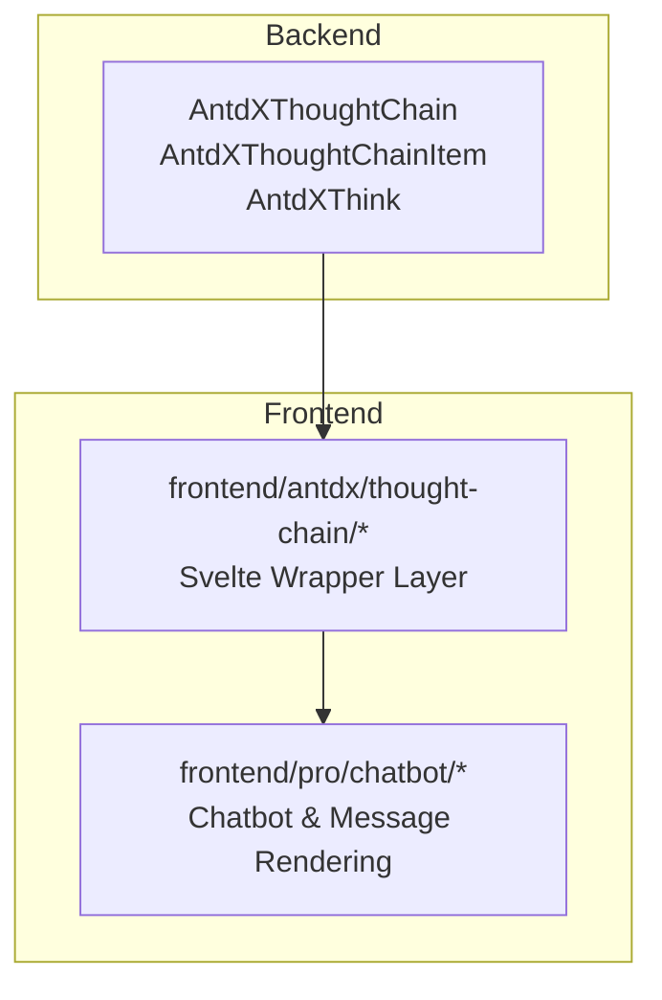
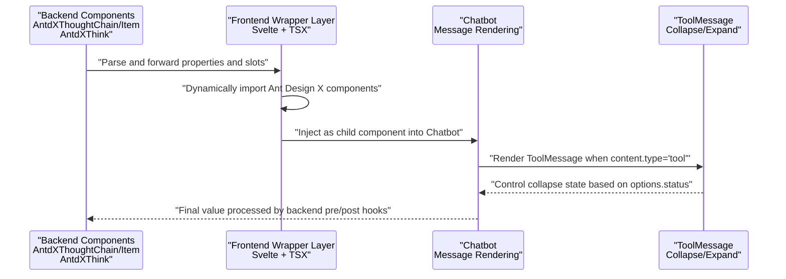
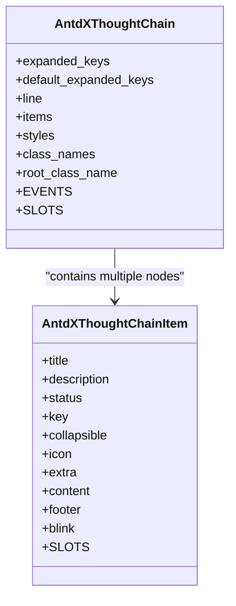
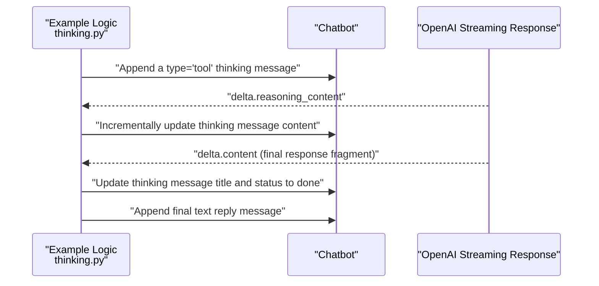
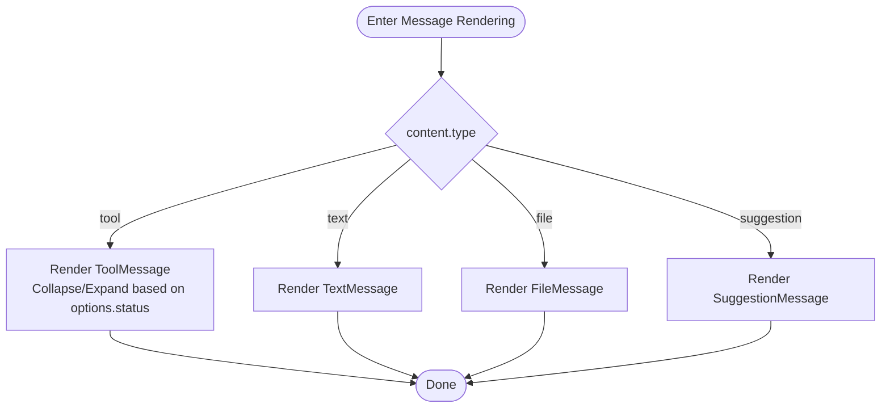
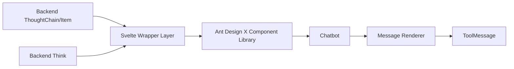

# Thinking Process Display

<cite>
**Files Referenced in This Document**
- [backend/modelscope_studio/components/antdx/thought_chain/__init__.py](file://backend/modelscope_studio/components/antdx/thought_chain/__init__.py)
- [backend/modelscope_studio/components/antdx/thought_chain/thought_chain_item/__init__.py](file://backend/modelscope_studio/components/antdx/thought_chain/thought_chain_item/__init__.py)
- [backend/modelscope_studio/components/antdx/think/__init__.py](file://backend/modelscope_studio/components/antdx/think/__init__.py)
- [backend/modelscope_studio/components/pro/chatbot/__init__.py](file://backend/modelscope_studio/components/pro/chatbot/__init__.py)
- [frontend/antdx/thought-chain/Index.svelte](file://frontend/antdx/thought-chain/Index.svelte)
- [frontend/antdx/thought-chain/thought-chain.tsx](file://frontend/antdx/thought-chain/thought-chain.tsx)
- [frontend/antdx/thought-chain/thought-chain-item/Index.svelte](file://frontend/antdx/thought-chain/thought-chain-item/Index.svelte)
- [frontend/pro/chatbot/chatbot.tsx](file://frontend/pro/chatbot/chatbot.tsx)
- [frontend/pro/chatbot/message.tsx](file://frontend/pro/chatbot/message.tsx)
- [frontend/pro/chatbot/messages/tool.tsx](file://frontend/pro/chatbot/messages/tool.tsx)
- [frontend/pro/chatbot/type.ts](file://frontend/pro/chatbot/type.ts)
- [docs/components/antdx/thought_chain/README-zh_CN.md](file://docs/components/antdx/thought_chain/README-zh_CN.md)
- [docs/components/antdx/thought_chain/demos/basic.py](file://docs/components/antdx/thought_chain/demos/basic.py)
- [docs/components/pro/chatbot/demos/thinking.py](file://docs/components/pro/chatbot/demos/thinking.py)
</cite>

## Table of Contents

1. [Introduction](#introduction)
2. [Project Structure](#project-structure)
3. [Core Components](#core-components)
4. [Architecture Overview](#architecture-overview)
5. [Component Details](#component-details)
6. [Dependency Analysis](#dependency-analysis)
7. [Performance Considerations](#performance-considerations)
8. [Troubleshooting Guide](#troubleshooting-guide)
9. [Conclusion](#conclusion)
10. [Appendix](#appendix)

## Introduction

This document provides a systematic explanation of the "Thinking Process Display" capability within the Chatbot component. It aims to help developers correctly configure and present AI reasoning processes, including intermediate reasoning results, tool call chains, state transitions, and timing control for final responses. The document covers the following key points:

- How to insert "thinking" messages (type `tool`) into Chatbot and visualize them using ThoughtChain/Think components
- Configuration options, state management, and nested usage of Thought Chain
- Timing control and interaction design for thinking processes vs. final responses
- Visualization approaches and debugging/optimization recommendations

## Project Structure

This feature involves collaboration between backend Python components and the frontend Svelte/React layer:

- **Backend**: Provides component classes such as ThoughtChain, ThoughtChainItem, and Think, responsible for property forwarding and frontend resource resolution
- **Frontend**: The Svelte wrapper bridges Ant Design X's ThoughtChain/Item into consumable components; the Chatbot message renderer selects ToolMessage or other message types based on content type

**Diagram Sources**

- [backend/modelscope_studio/components/antdx/thought_chain/**init**.py:12-86](file://backend/modelscope_studio/components/antdx/thought_chain/__init__.py#L12-L86)
- [backend/modelscope_studio/components/antdx/thought_chain/thought_chain_item/**init**.py:51-80](file://backend/modelscope_studio/components/antdx/thought_chain/thought_chain_item/__init__.py#L51-L80)
- [backend/modelscope_studio/components/antdx/think/**init**.py:8-79](file://backend/modelscope_studio/components/antdx/think/__init__.py#L8-L79)
- [frontend/antdx/thought-chain/Index.svelte:1-62](file://frontend/antdx/thought-chain/Index.svelte#L1-L62)
- [frontend/antdx/thought-chain/thought-chain.tsx:1-43](file://frontend/antdx/thought-chain/thought-chain.tsx#L1-L43)
- [frontend/pro/chatbot/chatbot.tsx:1-475](file://frontend/pro/chatbot/chatbot.tsx#L1-L475)
- [frontend/pro/chatbot/message.tsx:1-133](file://frontend/pro/chatbot/message.tsx#L1-L133)

**Section Sources**

- [backend/modelscope_studio/components/antdx/thought_chain/**init**.py:12-86](file://backend/modelscope_studio/components/antdx/thought_chain/__init__.py#L12-L86)
- [frontend/antdx/thought-chain/Index.svelte:1-62](file://frontend/antdx/thought-chain/Index.svelte#L1-L62)
- [frontend/pro/chatbot/chatbot.tsx:1-475](file://frontend/pro/chatbot/chatbot.tsx#L1-L475)

## Core Components

- **ThoughtChain** (backend class): Container for multiple ThoughtChainItems, supporting expand/collapse, line styles, root class names, and other configurations
- **ThoughtChainItem** (backend class): A single thinking node, supporting title, description, status, collapsible, extra action area, content area, and footer area
- **Think** (backend class): Used within Chatbot to display intermediate reasoning or tool call UI fragments in a "thinking" style
- **Chatbot** (backend class): Message container supporting multiple content types (text/tool/file/suggestion), defining the message data model and pre/post-processing logic
- **Frontend Wrapper Layer**: Svelte bridges Ant Design X's ThoughtChain/Item components as consumable components, while passing slots and props
- **ToolMessage**: Renders `tool` type messages, supporting collapse/expand and Markdown rendering

**Section Sources**

- [backend/modelscope_studio/components/antdx/thought_chain/**init**.py:12-86](file://backend/modelscope_studio/components/antdx/thought_chain/__init__.py#L12-L86)
- [backend/modelscope_studio/components/antdx/thought_chain/thought_chain_item/**init**.py:51-80](file://backend/modelscope_studio/components/antdx/thought_chain/thought_chain_item/__init__.py#L51-L80)
- [backend/modelscope_studio/components/antdx/think/**init**.py:8-79](file://backend/modelscope_studio/components/antdx/think/__init__.py#L8-L79)
- [backend/modelscope_studio/components/pro/chatbot/**init**.py:286-495](file://backend/modelscope_studio/components/pro/chatbot/__init__.py#L286-L495)
- [frontend/antdx/thought-chain/thought-chain.tsx:1-43](file://frontend/antdx/thought-chain/thought-chain.tsx#L1-L43)
- [frontend/pro/chatbot/messages/tool.tsx:1-46](file://frontend/pro/chatbot/messages/tool.tsx#L1-L46)

## Architecture Overview

The diagram below illustrates the overall flow from backend components to frontend rendering, as well as the insertion and display path for "thinking" messages in Chatbot.

**Diagram Sources**

- [frontend/antdx/thought-chain/Index.svelte:1-62](file://frontend/antdx/thought-chain/Index.svelte#L1-L62)
- [frontend/antdx/thought-chain/thought-chain.tsx:1-43](file://frontend/antdx/thought-chain/thought-chain.tsx#L1-L43)
- [frontend/pro/chatbot/chatbot.tsx:1-475](file://frontend/pro/chatbot/chatbot.tsx#L1-L475)
- [frontend/pro/chatbot/message.tsx:1-133](file://frontend/pro/chatbot/message.tsx#L1-L133)
- [frontend/pro/chatbot/messages/tool.tsx:1-46](file://frontend/pro/chatbot/messages/tool.tsx#L1-L46)

## Component Details

### ThoughtChain and ThoughtChainItem Configuration and Usage

- **ThoughtChain** supports:
  - `expanded_keys` / `default_expanded_keys`: Controls initially expanded items
  - `line`: Connection line style (solid/dashed/dotted)
  - `items`: Explicitly pass a list of nodes
  - Root-level styles/class names: `styles` / `class_names` / `root_class_name`
  - Events: `expand` (callback for expanded key changes)
- **ThoughtChainItem** supports:
  - `title` / `description` / `status` / `prefixCls` / `icon` / `key` / `collapsible`
  - Slots: `extra` / `content` / `footer`
  - Inject complex content via `slots` (e.g., buttons, icons, paragraphs)

**Diagram Sources**

- [backend/modelscope_studio/components/antdx/thought_chain/**init**.py:30-67](file://backend/modelscope_studio/components/antdx/thought_chain/__init__.py#L30-L67)
- [backend/modelscope_studio/components/antdx/thought_chain/thought_chain_item/**init**.py:51-60](file://backend/modelscope_studio/components/antdx/thought_chain/thought_chain_item/__init__.py#L51-L60)

**Section Sources**

- [backend/modelscope_studio/components/antdx/thought_chain/**init**.py:12-86](file://backend/modelscope_studio/components/antdx/thought_chain/__init__.py#L12-L86)
- [backend/modelscope_studio/components/antdx/thought_chain/thought_chain_item/**init**.py:51-80](file://backend/modelscope_studio/components/antdx/thought_chain/thought_chain_item/__init__.py#L51-L80)
- [docs/components/antdx/thought_chain/README-zh_CN.md:1-10](file://docs/components/antdx/thought_chain/README-zh_CN.md#L1-L10)
- [docs/components/antdx/thought_chain/demos/basic.py:1-77](file://docs/components/antdx/thought_chain/demos/basic.py#L1-L77)

### Using the Think Component in Chatbot

- Think provides a UI fragment for "thinking" segments, supporting `loading`, default expansion, blink effects, and more
- In Chatbot, the "thinking" process can be displayed by appending an entry with type `tool` to the message content array
- The example demonstrates how, during a streaming response, a `tool` message titled "Thinking..." is first inserted, then its content is updated in real time; when the first final response fragment arrives, the "thinking" title is updated to "End of Thought (elapsed time)" and marked as done

**Diagram Sources**

- [docs/components/pro/chatbot/demos/thinking.py:82-118](file://docs/components/pro/chatbot/demos/thinking.py#L82-L118)
- [frontend/pro/chatbot/messages/tool.tsx:13-18](file://frontend/pro/chatbot/messages/tool.tsx#L13-L18)

**Section Sources**

- [backend/modelscope_studio/components/antdx/think/**init**.py:8-79](file://backend/modelscope_studio/components/antdx/think/__init__.py#L8-L79)
- [docs/components/pro/chatbot/demos/thinking.py:82-118](file://docs/components/pro/chatbot/demos/thinking.py#L82-L118)
- [frontend/pro/chatbot/messages/tool.tsx:13-18](file://frontend/pro/chatbot/messages/tool.tsx#L13-L18)

### Chatbot Message Types and ToolMessage Rendering

- Chatbot-supported message types: `text`, `tool`, `file`, `suggestion`
- `tool` type messages are rendered by ToolMessage, which supports:
  - `options.title`: Title (Markdown rendering depends on `renderMarkdown`)
  - `options.status`: `'pending'` / `'done'` determines whether to collapse
  - Content area supports Markdown rendering or plain text
- The Chatbot message renderer dispatches to the corresponding component based on `content.type`

**Diagram Sources**

- [frontend/pro/chatbot/message.tsx:39-133](file://frontend/pro/chatbot/message.tsx#L39-L133)
- [frontend/pro/chatbot/messages/tool.tsx:13-45](file://frontend/pro/chatbot/messages/tool.tsx#L13-L45)
- [frontend/pro/chatbot/type.ts:121-135](file://frontend/pro/chatbot/type.ts#L121-L135)

**Section Sources**

- [backend/modelscope_studio/components/pro/chatbot/**init**.py:286-495](file://backend/modelscope_studio/components/pro/chatbot/__init__.py#L286-L495)
- [frontend/pro/chatbot/message.tsx:39-133](file://frontend/pro/chatbot/message.tsx#L39-L133)
- [frontend/pro/chatbot/messages/tool.tsx:13-45](file://frontend/pro/chatbot/messages/tool.tsx#L13-L45)
- [frontend/pro/chatbot/type.ts:54-66](file://frontend/pro/chatbot/type.ts#L54-L66)

### Thought Chain Configuration and Usage

- In Chatbot, if you need to display reasoning and tool calls step-by-step in a "thought chain" style, use the ThoughtChain/Item components
- Combine multiple ThoughtChainItems into a chain through the backend component class's `slots` mechanism
- Supports placing `extra` / `content` / `footer` slots within each node for richer interaction and information density

**Section Sources**

- [docs/components/antdx/thought_chain/README-zh_CN.md:1-10](file://docs/components/antdx/thought_chain/README-zh_CN.md#L1-L10)
- [docs/components/antdx/thought_chain/demos/basic.py:24-77](file://docs/components/antdx/thought_chain/demos/basic.py#L24-L77)
- [frontend/antdx/thought-chain/Index.svelte:1-62](file://frontend/antdx/thought-chain/Index.svelte#L1-L62)
- [frontend/antdx/thought-chain/thought-chain.tsx:1-43](file://frontend/antdx/thought-chain/thought-chain.tsx#L1-L43)

## Dependency Analysis

- Backend component classes are only responsible for property forwarding and frontend directory resolution; they do not participate directly in business logic
- The frontend Svelte wrapper layer is responsible for bridging Ant Design X's ThoughtChain/Item components as consumable components and handling slots and props
- Chatbot dispatches to specific message components (TextMessage/ToolMessage/FileMessage/SuggestionMessage) based on message type

**Diagram Sources**

- [backend/modelscope_studio/components/antdx/thought_chain/**init**.py:68-86](file://backend/modelscope_studio/components/antdx/thought_chain/__init__.py#L68-L86)
- [backend/modelscope_studio/components/antdx/thought_chain/thought_chain_item/**init**.py:61-80](file://backend/modelscope_studio/components/antdx/thought_chain/thought_chain_item/__init__.py#L61-L80)
- [backend/modelscope_studio/components/antdx/think/**init**.py:61-79](file://backend/modelscope_studio/components/antdx/think/__init__.py#L61-L79)
- [frontend/antdx/thought-chain/Index.svelte:10-62](file://frontend/antdx/thought-chain/Index.svelte#L10-L62)
- [frontend/antdx/thought-chain/thought-chain.tsx:11-40](file://frontend/antdx/thought-chain/thought-chain.tsx#L11-L40)
- [frontend/pro/chatbot/chatbot.tsx:450-472](file://frontend/pro/chatbot/chatbot.tsx#L450-L472)

**Section Sources**

- [frontend/antdx/thought-chain/Index.svelte:1-62](file://frontend/antdx/thought-chain/Index.svelte#L1-L62)
- [frontend/antdx/thought-chain/thought-chain.tsx:1-43](file://frontend/antdx/thought-chain/thought-chain.tsx#L1-L43)
- [frontend/pro/chatbot/chatbot.tsx:1-475](file://frontend/pro/chatbot/chatbot.tsx#L1-L475)

## Performance Considerations

- **Streaming update strategy**: Use incremental updates in Chatbot to avoid frequently re-rendering the entire message list
- **ToolMessage collapse control**: Use `options.status` to initially determine collapse state, reducing unnecessary renders
- **Judicious use of slots**: Only inject necessary content into ThoughtChain/Item nodes to avoid overly deep nesting
- **Backend pre/post processing**: Pre-process static assets such as file paths and avatars to reduce frontend rendering cost

[This section provides general guidance and requires no specific file references]

## Troubleshooting Guide

- **Thinking message not displayed**
  - Check whether the message type is `tool` and whether `content` contains valid content
  - Confirm whether `options.status` has been set to `done`, causing automatic collapse
- **Thinking title not updated**
  - Confirm that when the first `delta.content` is received, the thinking message's `options.title` and `options.status` have been updated
- **ThoughtChain/Item not taking effect**
  - Confirm that the backend component class's `slots` are correctly passed and that the frontend wrapper layer has correctly resolved the `slots`
- **Performance issues**
  - Reduce the amount of data updated per round; merge multiple incremental updates
  - Pay attention to text size when enabling Markdown rendering for long content

**Section Sources**

- [docs/components/pro/chatbot/demos/thinking.py:82-118](file://docs/components/pro/chatbot/demos/thinking.py#L82-L118)
- [frontend/pro/chatbot/messages/tool.tsx:13-18](file://frontend/pro/chatbot/messages/tool.tsx#L13-L18)

## Conclusion

By using ThoughtChain/Item and Think components in combination with Chatbot's message type system, you can clearly display AI reasoning processes and tool call chains. Properly configuring states and slots, combined with a streaming update strategy, both enhances user experience and ensures good performance. In real-world projects, it is recommended to prioritize using `tool` type messages to carry "thinking" content, and to promptly update the status and title when the final response arrives, forming a complete "think → execute → feedback" loop.

[This section is a summary and requires no specific file references]

## Appendix

- **Example References**
  - ThoughtChain basic example: [docs/components/antdx/thought_chain/demos/basic.py:1-77](file://docs/components/antdx/thought_chain/demos/basic.py#L1-L77)
  - Chatbot thinking process example: [docs/components/pro/chatbot/demos/thinking.py:1-218](file://docs/components/pro/chatbot/demos/thinking.py#L1-L218)
- **Component Documentation**
  - ThoughtChain docs: [docs/components/antdx/thought_chain/README-zh_CN.md:1-10](file://docs/components/antdx/thought_chain/README-zh_CN.md#L1-L10)

[This section is supplementary material and requires no specific file references]
