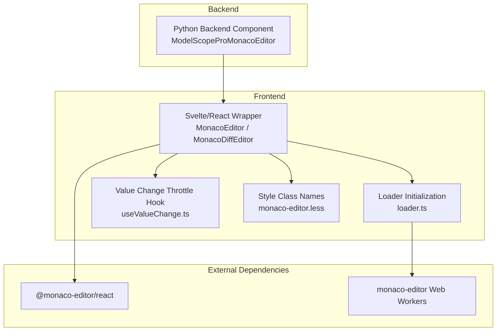
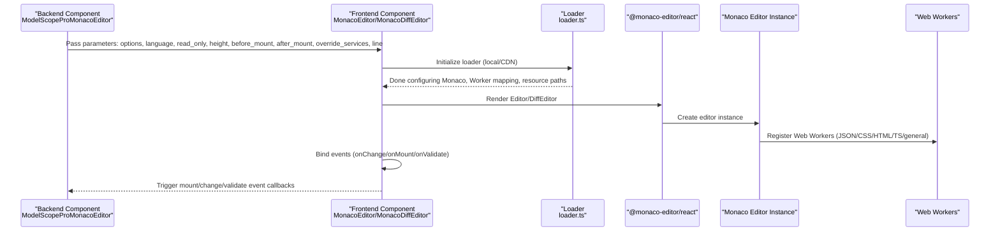
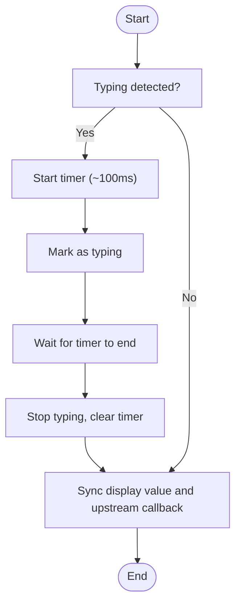
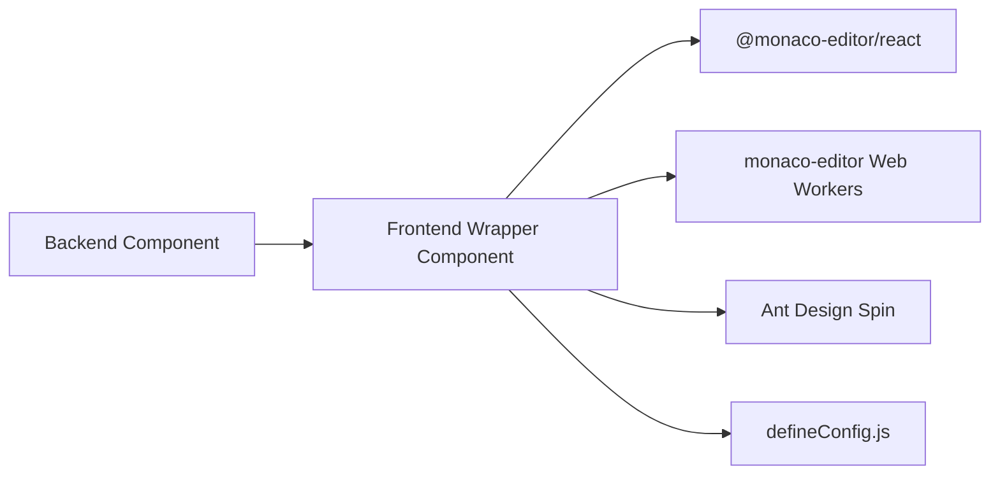

# Advanced Features

<cite>
**Files Referenced in This Document**
- [backend/modelscope_studio/components/pro/monaco_editor/__init__.py](file://backend/modelscope_studio/components/pro/monaco_editor/__init__.py)
- [frontend/pro/monaco-editor/monaco-editor.tsx](file://frontend/pro/monaco-editor/monaco-editor.tsx)
- [frontend/pro/monaco-editor/diff-editor/monaco-editor.diff-editor.tsx](file://frontend/pro/monaco-editor/diff-editor/monaco-editor.diff-editor.tsx)
- [frontend/pro/monaco-editor/loader.ts](file://frontend/pro/monaco-editor/loader.ts)
- [frontend/pro/monaco-editor/useValueChange.ts](file://frontend/pro/monaco-editor/useValueChange.ts)
- [frontend/pro/monaco-editor/monaco-editor.less](file://frontend/pro/monaco-editor/monaco-editor.less)
- [frontend/defineConfig.js](file://frontend/defineConfig.js)
- [backend/modelscope_studio/components/pro/components.py](file://backend/modelscope_studio/components/pro/components.py)
- [docs/components/pro/monaco_editor/demos/monaco_editor_options.py](file://docs/components/pro/monaco_editor/demos/monaco_editor_options.py)
</cite>

## Table of Contents

1. [Introduction](#introduction)
2. [Project Structure](#project-structure)
3. [Core Components](#core-components)
4. [Architecture Overview](#architecture-overview)
5. [Detailed Component Analysis](#detailed-component-analysis)
6. [Dependency Analysis](#dependency-analysis)
7. [Performance Considerations](#performance-considerations)
8. [Troubleshooting Guide](#troubleshooting-guide)
9. [Conclusion](#conclusion)
10. [Appendix](#appendix)

## Introduction

This "Advanced Features" document focuses on the advanced usage and extensibility of MonacoEditor in ModelScope Studio, covering the following topics:

- **JavaScript customization**: How to inject custom logic before and after mounting (e.g., language services, theme switching, event binding)
- **Service overrides**: Replacing or enhancing Monaco's internal services via the `override_services` parameter
- **Loader configuration**: Choosing and configuring between local loading and CDN loading modes
- **Editor extensions**: Custom language support, plugin development, and theme customization
- **Complex scenario integration**: Deep integration examples with the Gradio ecosystem (Blocks, ConfigProvider, Application)
- **Underlying implementation and performance optimization**: Event binding, value synchronization strategies, Web Worker and resource path management

## Project Structure

The MonacoEditor implementation uses a layered design of "backend component + frontend Svelte/React wrapper":

- The backend component handles parameter forwarding, event binding, loader configuration, and service override configuration
- The frontend component wraps `@monaco-editor/react` to provide a unified React/Svelte interface, with built-in loader initialization, value change throttling, and theme adaptation

Diagram Source

- [backend/modelscope_studio/components/pro/monaco_editor/**init**.py:16-107](file://backend/modelscope_studio/components/pro/monaco_editor/__init__.py#L16-L107)
- [frontend/pro/monaco-editor/monaco-editor.tsx:1-95](file://frontend/pro/monaco-editor/monaco-editor.tsx#L1-L95)
- [frontend/pro/monaco-editor/diff-editor/monaco-editor.diff-editor.tsx:1-161](file://frontend/pro/monaco-editor/diff-editor/monaco-editor.diff-editor.tsx#L1-L161)
- [frontend/pro/monaco-editor/loader.ts:1-95](file://frontend/pro/monaco-editor/loader.ts#L1-L95)
- [frontend/pro/monaco-editor/useValueChange.ts:1-44](file://frontend/pro/monaco-editor/useValueChange.ts#L1-L44)
- [frontend/pro/monaco-editor/monaco-editor.less:1-7](file://frontend/pro/monaco-editor/monaco-editor.less#L1-L7)

Section Source

- [backend/modelscope_studio/components/pro/monaco_editor/**init**.py:16-107](file://backend/modelscope_studio/components/pro/monaco_editor/__init__.py#L16-L107)
- [frontend/pro/monaco-editor/monaco-editor.tsx:1-95](file://frontend/pro/monaco-editor/monaco-editor.tsx#L1-L95)
- [frontend/pro/monaco-editor/diff-editor/monaco-editor.diff-editor.tsx:1-161](file://frontend/pro/monaco-editor/diff-editor/monaco-editor.diff-editor.tsx#L1-L161)
- [frontend/pro/monaco-editor/loader.ts:1-95](file://frontend/pro/monaco-editor/loader.ts#L1-L95)
- [frontend/pro/monaco-editor/useValueChange.ts:1-44](file://frontend/pro/monaco-editor/useValueChange.ts#L1-L44)
- [frontend/pro/monaco-editor/monaco-editor.less:1-7](file://frontend/pro/monaco-editor/monaco-editor.less#L1-L7)

## Core Components

- **Backend Component**: `ModelScopeProMonacoEditor`
  - Supported events: `mount`, `change`, `validate`
  - Supported slots: `loading`
  - Supported loader configuration: `LOADER` (default: `local` mode)
  - Key parameters: `language`, `options`, `read_only`, `height`, `before_mount`, `after_mount`, `override_services`, `line`
- **Frontend Components**: `MonacoEditor` (single editor), `MonacoDiffEditor` (diff editor)
  - Provide `themeMode`, `height`, `readOnly`, `onValueChange`, `loading` slot, etc.
  - Built-in loader initialization, value change throttling, and theme mapping (`dark` ↔ `vs-dark`)

Section Source

- [backend/modelscope_studio/components/pro/monaco_editor/**init**.py:16-107](file://backend/modelscope_studio/components/pro/monaco_editor/__init__.py#L16-L107)
- [frontend/pro/monaco-editor/monaco-editor.tsx:12-95](file://frontend/pro/monaco-editor/monaco-editor.tsx#L12-L95)
- [frontend/pro/monaco-editor/diff-editor/monaco-editor.diff-editor.tsx:19-161](file://frontend/pro/monaco-editor/diff-editor/monaco-editor.diff-editor.tsx#L19-L161)

## Architecture Overview

The diagram below shows the overall call chain from the Python backend to the frontend wrapper components, then to the Monaco editor and Web Workers.

Diagram Source

- [backend/modelscope_studio/components/pro/monaco_editor/**init**.py:21-38](file://backend/modelscope_studio/components/pro/monaco_editor/__init__.py#L21-L38)
- [frontend/pro/monaco-editor/monaco-editor.tsx:38-91](file://frontend/pro/monaco-editor/monaco-editor.tsx#L38-L91)
- [frontend/pro/monaco-editor/diff-editor/monaco-editor.diff-editor.tsx:67-98](file://frontend/pro/monaco-editor/diff-editor/monaco-editor.diff-editor.tsx#L67-L98)
- [frontend/pro/monaco-editor/loader.ts:27-94](file://frontend/pro/monaco-editor/loader.ts#L27-L94)

## Detailed Component Analysis

### Backend Component: ModelScopeProMonacoEditor

- **Event system**
  - `mount`: Triggered when the editor mounts; used to execute `before_mount`/`after_mount` callbacks
  - `change`: Triggered when editor content changes; can be used for real-time validation or saving
  - `validate`: Triggered after marker (error/warning) updates complete
- **Slots and loader**
  - `loading` slot: Allows customizing the loading state UI
  - `LOADER`: Supports both `local` and `CDN` modes; defaults to `local`
- **Key parameters**
  - `language`: Language identifier that drives syntax highlighting and language services
  - `options`: Configuration object passed to Monaco
  - `read_only`: Read-only mode
  - `height`: Container height
  - `before_mount`/`after_mount`: Hooks executed before/after mounting
  - `override_services`: Service override dictionary
  - `line`: Navigate to the specified line (diff editor)

Section Source

- [backend/modelscope_studio/components/pro/monaco_editor/**init**.py:16-107](file://backend/modelscope_studio/components/pro/monaco_editor/__init__.py#L16-L107)

### Frontend Component: MonacoEditor (Single Editor)

- **Theme and sizing**
  - `themeMode` mapping: `dark` → `vs-dark`; `light` → `light`
  - `height` controls container height
- **Value changes and events**
  - Uses `useValueChange` for input throttling (~100ms) to avoid high-frequency callbacks
  - `onChange` → `setValue` → `onValueChange`, ensuring consistency with the Gradio data flow
- **Loading state**
  - Default loading state is `Spin`; can be replaced via the `loading` slot
- **Web Workers and loader**
  - Initialized by `loader.ts`, returning the corresponding Worker by language type

Section Source

- [frontend/pro/monaco-editor/monaco-editor.tsx:21-95](file://frontend/pro/monaco-editor/monaco-editor.tsx#L21-L95)
- [frontend/pro/monaco-editor/useValueChange.ts:4-44](file://frontend/pro/monaco-editor/useValueChange.ts#L4-L44)
- [frontend/pro/monaco-editor/monaco-editor.less:1-7](file://frontend/pro/monaco-editor/monaco-editor.less#L1-L7)

### Frontend Component: MonacoDiffEditor (Diff Editor)

- **Features**
  - Supports `modified`/`original` dual-view comparison
  - `onValidate`: Listens for marker changes and returns `markers`
  - `line`: Automatically scrolls to the specified line
- **Lifecycle and events**
  - `onMount`: Registers content change and marker change listeners; releases `IDisposable` on cleanup
  - `onChange`: Syncs the modified value upstream
- **Loading state and theme**
  - Same loading state and theme mapping as the single editor

Section Source

- [frontend/pro/monaco-editor/diff-editor/monaco-editor.diff-editor.tsx:35-161](file://frontend/pro/monaco-editor/diff-editor/monaco-editor.diff-editor.tsx#L35-L161)

### Loader and Service Overrides

- **Loader initialization**
  - `initLocalLoader`: Dynamically imports `monaco-editor` and various Workers, sets `MonacoEnvironment.getWorker`
  - `initCDNLoader`: Specifies the resource path via `loader.config(paths.vs = cdn)`
- **Service overrides**
  - The backend passes the service dictionary to the frontend wrapper component via `override_services`
  - The frontend can access the `monaco` instance in `before_mount` to replace or extend services (e.g., replacing language services, registering custom contribution points)

Section Source

- [frontend/pro/monaco-editor/loader.ts:27-94](file://frontend/pro/monaco-editor/loader.ts#L27-L94)
- [backend/modelscope_studio/components/pro/monaco_editor/**init**.py:54-84](file://backend/modelscope_studio/components/pro/monaco_editor/__init__.py#L54-L84)

### Value Change Throttling and Data Flow

Diagram Source

- [frontend/pro/monaco-editor/useValueChange.ts:14-32](file://frontend/pro/monaco-editor/useValueChange.ts#L14-L32)

## Dependency Analysis

- **Component coupling**
  - The backend component is tightly coupled to the frontend wrapper component through parameter forwarding; event callbacks are decoupled via the Gradio event system
  - The frontend component's coupling with Monaco is decoupled through `@monaco-editor/react` and `loader.ts`
- **External dependencies**
  - `@monaco-editor/react`: Editor rendering and lifecycle management
  - `monaco-editor` Web Workers: Language services and syntax parsing
  - Ant Design `Spin`: Loading state UI
- **Build and packaging**
  - `defineConfig.js` provides Vite plugins and preprocessing configuration to ensure proper Svelte/React wrapper builds

Diagram Source

- [frontend/defineConfig.js:8-18](file://frontend/defineConfig.js#L8-L18)
- [frontend/pro/monaco-editor/monaco-editor.tsx:1-11](file://frontend/pro/monaco-editor/monaco-editor.tsx#L1-L11)

Section Source

- [frontend/defineConfig.js:8-18](file://frontend/defineConfig.js#L8-L18)
- [backend/modelscope_studio/components/pro/components.py:1-8](file://backend/modelscope_studio/components/pro/components.py#L1-L8)

## Performance Considerations

- **Input throttling**
  - `useValueChange` reduces `onChange` frequency with an ~100ms timer, lessening the burden on upstream callbacks and re-renders
- **Worker dispatch**
  - Returns the precise Worker by language type, avoiding unnecessary multi-threading overhead
- **Resource paths**
  - In CDN mode, `loader.config(paths.vs = cdn)` reduces local bundle size and initial load time
- **Theme switching**
  - `themeMode` switching only affects the theme mapping without rebuilding the editor instance, minimizing jitter

Section Source

- [frontend/pro/monaco-editor/useValueChange.ts:14-24](file://frontend/pro/monaco-editor/useValueChange.ts#L14-L24)
- [frontend/pro/monaco-editor/loader.ts:53-69](file://frontend/pro/monaco-editor/loader.ts#L53-L69)

## Troubleshooting Guide

- **Loading failure or blank screen**
  - Check whether the `LOADER` configuration is correct (local/CDN) and confirm that the CDN path is reachable
  - If using CDN, ensure cross-origin and caching policies are correctly configured
- **Language service issues**
  - Confirm that `language` matches the actual code
  - For custom language services, use `before_mount` to inject Monaco service replacement logic
- **Events not firing**
  - Confirm that the relevant event binding is enabled (`bind_mount_event`/`bind_change_event`/`bind_validate_event`)
  - Check that the Gradio event system is functioning correctly (queue and launch)
- **Diff editor line navigation not working**
  - Confirm that the `line` parameter is a valid number and that it is set only after `onMount` completes

Section Source

- [backend/modelscope_studio/components/pro/monaco_editor/**init**.py:21-38](file://backend/modelscope_studio/components/pro/monaco_editor/__init__.py#L21-L38)
- [frontend/pro/monaco-editor/diff-editor/monaco-editor.diff-editor.tsx:109-113](file://frontend/pro/monaco-editor/diff-editor/monaco-editor.diff-editor.tsx#L109-L113)

## Conclusion

The advanced features of MonacoEditor in ModelScope Studio revolve around "parameter forwarding + frontend wrapper + loader initialization + event system", ensuring seamless integration with the Gradio ecosystem while providing flexible extension points (language services, theming, loading strategies). Through throttling and precise Worker dispatch, it balances interaction smoothness and runtime efficiency.

## Appendix

### Integration Examples with the Gradio Ecosystem

- **Blocks and ConfigProvider**: Use the component within a Blocks context for unified global configuration
- **Application**: Provides application-level context for easier event and state management
- **Example reference**: Demonstrates basic usage and `options` configuration (e.g., disabling minimap, hiding line numbers)

Section Source

- [docs/components/pro/monaco_editor/demos/monaco_editor_options.py:6-34](file://docs/components/pro/monaco_editor/demos/monaco_editor_options.py#L6-L34)
