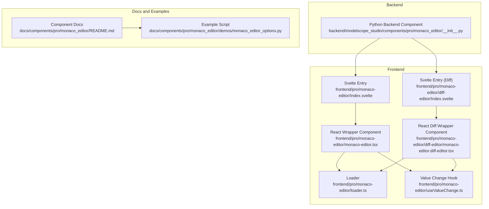
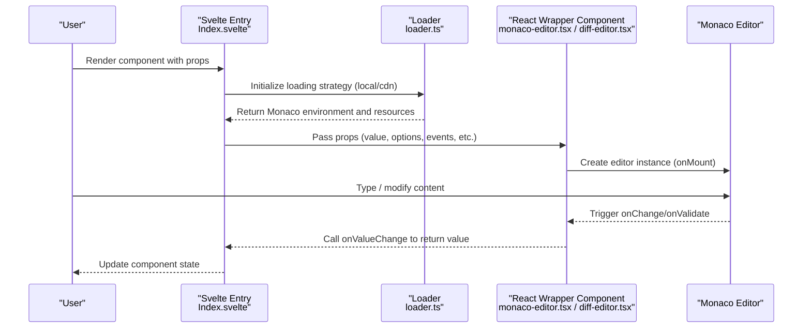
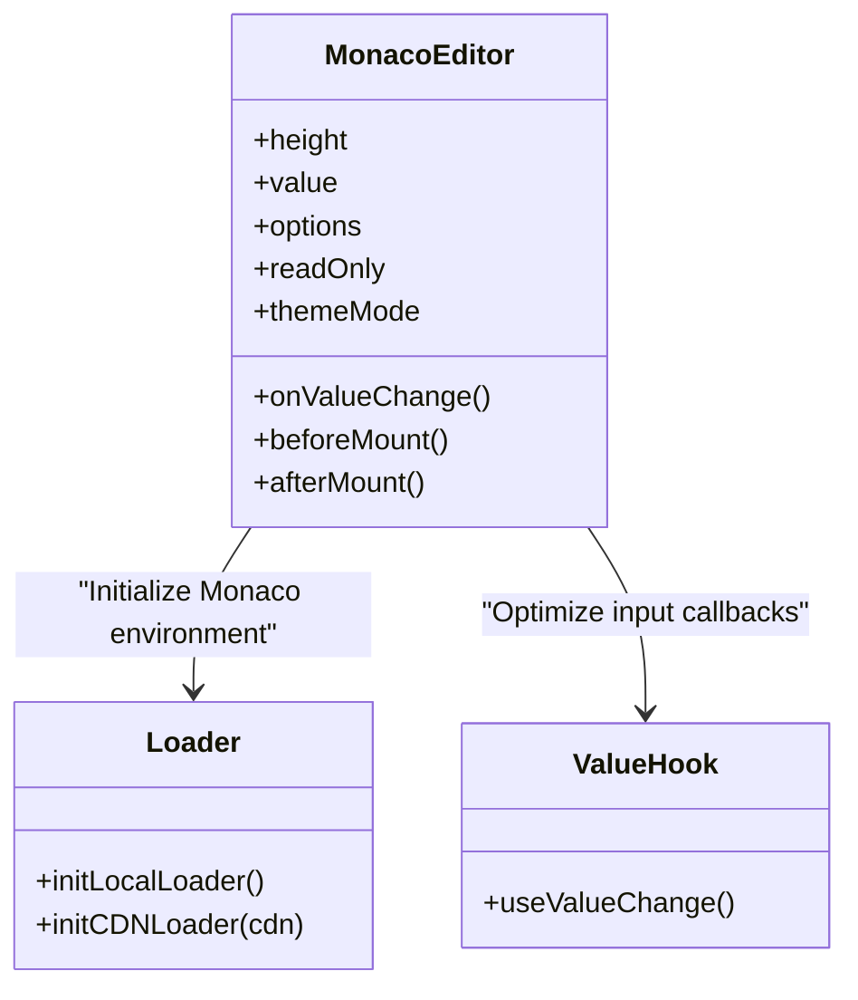
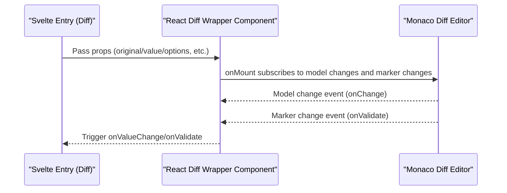
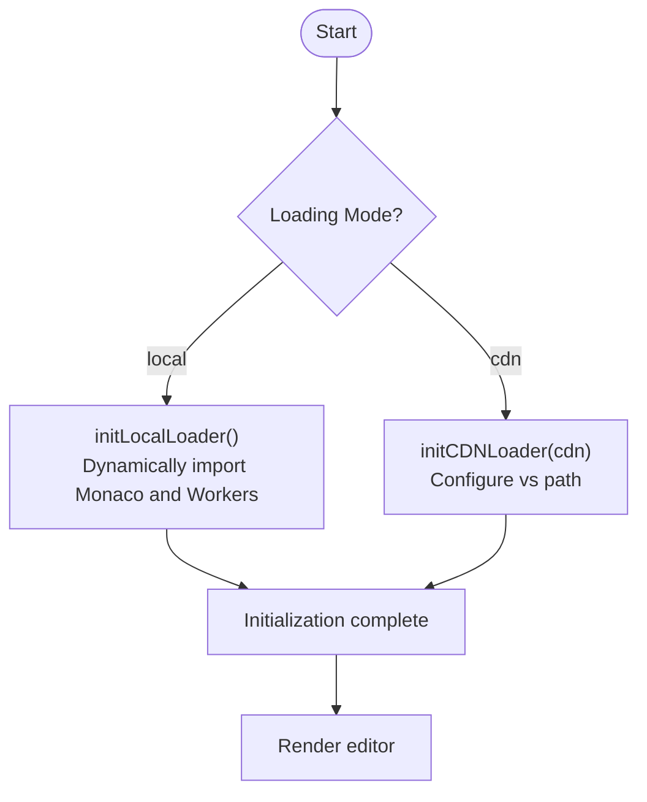
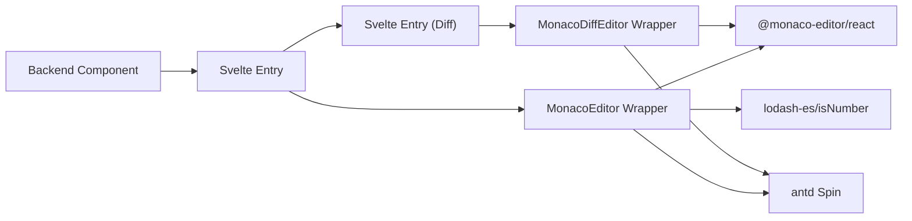

# Component Overview

<cite>
**Files Referenced in This Document**
- [backend/modelscope_studio/components/pro/monaco_editor/__init__.py](file://backend/modelscope_studio/components/pro/monaco_editor/__init__.py)
- [frontend/pro/monaco-editor/Index.svelte](file://frontend/pro/monaco-editor/Index.svelte)
- [frontend/pro/monaco-editor/monaco-editor.tsx](file://frontend/pro/monaco-editor/monaco-editor.tsx)
- [frontend/pro/monaco-editor/loader.ts](file://frontend/pro/monaco-editor/loader.ts)
- [frontend/pro/monaco-editor/useValueChange.ts](file://frontend/pro/monaco-editor/useValueChange.ts)
- [frontend/pro/monaco-editor/diff-editor/Index.svelte](file://frontend/pro/monaco-editor/diff-editor/Index.svelte)
- [frontend/pro/monaco-editor/diff-editor/monaco-editor.diff-editor.tsx](file://frontend/pro/monaco-editor/diff-editor/monaco-editor.diff-editor.tsx)
- [docs/components/pro/monaco_editor/README.md](file://docs/components/pro/monaco_editor/README.md)
- [docs/components/pro/monaco_editor/demos/monaco_editor_options.py](file://docs/components/pro/monaco_editor/demos/monaco_editor_options.py)
</cite>

## Table of Contents

1. [Introduction](#introduction)
2. [Project Structure](#project-structure)
3. [Core Components](#core-components)
4. [Architecture Overview](#architecture-overview)
5. [Detailed Component Analysis](#detailed-component-analysis)
6. [Dependency Analysis](#dependency-analysis)
7. [Performance Considerations](#performance-considerations)
8. [Troubleshooting Guide](#troubleshooting-guide)
9. [Conclusion](#conclusion)
10. [Appendix](#appendix)

## Introduction

MonacoEditor is a professional code editor component based on Gradio, integrating Microsoft's Monaco editor at its core. It provides syntax highlighting, IntelliSense, error markers, theme adaptation, and supports diff comparison editing (Diff Editor). This component is widely used in machine learning and AI applications for:

- Writing and validating model training scripts and configuration files
- Prompt engineering and prompt template editing
- Code/text mixed editing in multimodal input scenarios
- Online code review and comparison display

Component features include:

- Syntax highlighting and language mode switching
- IntelliSense and autocomplete
- Error markers and validation events
- Theme adaptation (light/dark themes)
- Diff comparison editing (side-by-side comparison)
- Pluggable loading strategy (local bundling or CDN)

## Project Structure

The MonacoEditor component is composed of a backend Python component definition and a frontend Svelte/React implementation, with documentation and examples in the `docs` directory.

**Diagram Sources**

- [backend/modelscope_studio/components/pro/monaco_editor/**init**.py:16-107](file://backend/modelscope_studio/components/pro/monaco_editor/__init__.py#L16-L107)
- [frontend/pro/monaco-editor/Index.svelte:1-101](file://frontend/pro/monaco-editor/Index.svelte#L1-L101)
- [frontend/pro/monaco-editor/monaco-editor.tsx:1-95](file://frontend/pro/monaco-editor/monaco-editor.tsx#L1-L95)
- [frontend/pro/monaco-editor/diff-editor/Index.svelte:1-103](file://frontend/pro/monaco-editor/diff-editor/Index.svelte#L1-L103)
- [frontend/pro/monaco-editor/diff-editor/monaco-editor.diff-editor.tsx:1-161](file://frontend/pro/monaco-editor/diff-editor/monaco-editor.diff-editor.tsx#L1-L161)
- [frontend/pro/monaco-editor/loader.ts:1-95](file://frontend/pro/monaco-editor/loader.ts#L1-L95)
- [frontend/pro/monaco-editor/useValueChange.ts:1-44](file://frontend/pro/monaco-editor/useValueChange.ts#L1-L44)
- [docs/components/pro/monaco_editor/README.md:1-89](file://docs/components/pro/monaco_editor/README.md#L1-L89)
- [docs/components/pro/monaco_editor/demos/monaco_editor_options.py:1-34](file://docs/components/pro/monaco_editor/demos/monaco_editor_options.py#L1-L34)

**Section Sources**

- [docs/components/pro/monaco_editor/README.md:1-89](file://docs/components/pro/monaco_editor/README.md#L1-L89)

## Core Components

- **Python backend component**: Responsible for declaring component properties, event bindings, default loading strategy, and frontend directory resolution.
- **Frontend wrapper components**:
  - Standard editor: Bridges the Monaco Editor React component as a Svelte component, handling value changes, themes, loading state, and event forwarding.
  - Diff editor: Extends the standard editor with left/right source comparison, line positioning, and validation events.
- **Loader**: Supports both local bundling and CDN loading modes; initializes the Monaco environment and Web Workers on demand.
- **Value change hook**: Optimizes the input experience by delaying change callbacks to avoid frequent re-renders.

**Section Sources**

- [backend/modelscope_studio/components/pro/monaco_editor/**init**.py:16-107](file://backend/modelscope_studio/components/pro/monaco_editor/__init__.py#L16-L107)
- [frontend/pro/monaco-editor/monaco-editor.tsx:12-95](file://frontend/pro/monaco-editor/monaco-editor.tsx#L12-L95)
- [frontend/pro/monaco-editor/diff-editor/monaco-editor.diff-editor.tsx:19-161](file://frontend/pro/monaco-editor/diff-editor/monaco-editor.diff-editor.tsx#L19-L161)
- [frontend/pro/monaco-editor/loader.ts:27-94](file://frontend/pro/monaco-editor/loader.ts#L27-L94)
- [frontend/pro/monaco-editor/useValueChange.ts:4-43](file://frontend/pro/monaco-editor/useValueChange.ts#L4-L43)

## Architecture Overview

The runtime control flow of MonacoEditor is as follows:

**Diagram Sources**

- [frontend/pro/monaco-editor/Index.svelte:64-90](file://frontend/pro/monaco-editor/Index.svelte#L64-L90)
- [frontend/pro/monaco-editor/loader.ts:27-94](file://frontend/pro/monaco-editor/loader.ts#L27-L94)
- [frontend/pro/monaco-editor/monaco-editor.tsx:38-91](file://frontend/pro/monaco-editor/monaco-editor.tsx#L38-L91)
- [frontend/pro/monaco-editor/diff-editor/monaco-editor.diff-editor.tsx:67-107](file://frontend/pro/monaco-editor/diff-editor/monaco-editor.diff-editor.tsx#L67-L107)

## Detailed Component Analysis

### Standard Editor Component (MonacoEditor)

- **Responsibilities**
  - Maps Gradio properties to the Monaco React component
  - Handles read-only, height, theme, loading state, and event forwarding
  - Uses the value change hook to optimize the input experience
- **Key points**
  - Passes Monaco configuration via `options`; merges `readOnly` with `options`
  - Theme is automatically selected as light/dark based on the Gradio shared theme
  - Supports custom loading slots or default loading indicators
- **Applicable scenarios**
  - Code/configuration file editing
  - Text content input with real-time validation

**Diagram Sources**

- [frontend/pro/monaco-editor/monaco-editor.tsx:12-95](file://frontend/pro/monaco-editor/monaco-editor.tsx#L12-L95)
- [frontend/pro/monaco-editor/loader.ts:27-94](file://frontend/pro/monaco-editor/loader.ts#L27-L94)
- [frontend/pro/monaco-editor/useValueChange.ts:4-43](file://frontend/pro/monaco-editor/useValueChange.ts#L4-L43)

**Section Sources**

- [frontend/pro/monaco-editor/monaco-editor.tsx:21-95](file://frontend/pro/monaco-editor/monaco-editor.tsx#L21-L95)
- [frontend/pro/monaco-editor/loader.ts:27-94](file://frontend/pro/monaco-editor/loader.ts#L27-L94)
- [frontend/pro/monaco-editor/useValueChange.ts:4-43](file://frontend/pro/monaco-editor/useValueChange.ts#L4-L43)

### Diff Editor Component (MonacoEditor.DiffEditor)

- **Responsibilities**
  - Compares "original" and "modified" content
  - Provides line positioning, validation events, and model change listeners
- **Key points**
  - Subscribes to model change and marker change events in `onMount`
  - Supports independently setting `original_language` and `modified_language`
  - Supports `line` parameter to scroll to a specified line
- **Applicable scenarios**
  - Code reviews, change comparisons, configuration diff display

**Diagram Sources**

- [frontend/pro/monaco-editor/diff-editor/Index.svelte:66-91](file://frontend/pro/monaco-editor/diff-editor/Index.svelte#L66-L91)
- [frontend/pro/monaco-editor/diff-editor/monaco-editor.diff-editor.tsx:35-161](file://frontend/pro/monaco-editor/diff-editor/monaco-editor.diff-editor.tsx#L35-L161)

**Section Sources**

- [frontend/pro/monaco-editor/diff-editor/monaco-editor.diff-editor.tsx:35-161](file://frontend/pro/monaco-editor/diff-editor/monaco-editor.diff-editor.tsx#L35-L161)

### Loader and Resource Initialization

- **Functionality**
  - Local loading: Dynamically imports Monaco and various language Workers
  - CDN loading: Points to CDN resources via path configuration
  - Unified initialization: Ensures the Monaco environment is available before rendering the editor
- **Notes**
  - Local loading introduces a larger bundle size; CDN is recommended for production
  - CDN path can be customized for intranet deployment

**Diagram Sources**

- [frontend/pro/monaco-editor/loader.ts:27-94](file://frontend/pro/monaco-editor/loader.ts#L27-L94)

**Section Sources**

- [frontend/pro/monaco-editor/loader.ts:27-94](file://frontend/pro/monaco-editor/loader.ts#L27-L94)

### Value Change and Input Optimization

- **Mechanism**
  - `useValueChange` delays triggering callbacks during input to reduce frequent updates
  - Coordinates typing state and timers to ensure the final value and callback timing are consistent
- **Effect**
  - Improves smoothness for large document input and real-time preview

**Section Sources**

- [frontend/pro/monaco-editor/useValueChange.ts:4-43](file://frontend/pro/monaco-editor/useValueChange.ts#L4-L43)

## Dependency Analysis

- **Component coupling**
  - The backend component is only responsible for declarations and frontend directory resolution; logic decoupling is clean
  - The frontend bridges React components via Svelte with single-responsibility
- **External dependencies**
  - `@monaco-editor/react`: Core editor capabilities
  - antd Spin: Loading state display
  - `lodash-es/isNumber`: Type and nullability helpers
- **Circular dependencies**
  - No direct circular dependencies found; the loader and components are decoupled through function calls

**Diagram Sources**

- [backend/modelscope_studio/components/pro/monaco_editor/**init**.py:16-107](file://backend/modelscope_studio/components/pro/monaco_editor/__init__.py#L16-L107)
- [frontend/pro/monaco-editor/monaco-editor.tsx:1-10](file://frontend/pro/monaco-editor/monaco-editor.tsx#L1-L10)
- [frontend/pro/monaco-editor/diff-editor/monaco-editor.diff-editor.tsx:1-13](file://frontend/pro/monaco-editor/diff-editor/monaco-editor.diff-editor.tsx#L1-L13)

**Section Sources**

- [backend/modelscope_studio/components/pro/monaco_editor/**init**.py:16-107](file://backend/modelscope_studio/components/pro/monaco_editor/__init__.py#L16-L107)
- [frontend/pro/monaco-editor/monaco-editor.tsx:1-10](file://frontend/pro/monaco-editor/monaco-editor.tsx#L1-L10)
- [frontend/pro/monaco-editor/diff-editor/monaco-editor.diff-editor.tsx:1-13](file://frontend/pro/monaco-editor/diff-editor/monaco-editor.diff-editor.tsx#L1-L13)

## Performance Considerations

- **Loading strategy**
  - CDN is recommended for production to reduce initial bundle size
  - Local loading is suitable for development/debugging or offline environments
- **Input optimization**
  - `useValueChange` delays callbacks to reduce the rendering impact of high-frequency input
- **Theme and styles**
  - Light/dark theme switching is handled internally by Monaco; be careful to avoid duplicate style overrides
- **Diff editor**
  - Large document comparisons may create memory pressure; consider splitting or limiting line count

[This section contains general guidelines with no specific file sources]

## Troubleshooting Guide

- **Editor not displayed or blank**
  - Check whether the loader initialization is complete (local/cdn)
  - Confirm `_loader` configuration and network reachability
- **Language highlighting/IntelliSense not working**
  - Confirm `language` and `options` are correctly set
  - If using custom `before_mount`/`after_mount`, check whether they affect the Monaco instance
- **Validation event not triggered**
  - Validation events are only triggered for languages with rich IntelliSense support
- **Line positioning not working**
  - Confirm `line` is a number and within a valid range
- **Loading state not displayed**
  - If a custom loading slot is used, ensure the slot content can be rendered

**Section Sources**

- [docs/components/pro/monaco_editor/README.md:66-89](file://docs/components/pro/monaco_editor/README.md#L66-L89)
- [frontend/pro/monaco-editor/monaco-editor.tsx:71-82](file://frontend/pro/monaco-editor/monaco-editor.tsx#L71-L82)
- [frontend/pro/monaco-editor/diff-editor/monaco-editor.diff-editor.tsx:141-152](file://frontend/pro/monaco-editor/diff-editor/monaco-editor.diff-editor.tsx#L141-L152)

## Conclusion

The MonacoEditor component uses Gradio as its entry point, combined with a Svelte-React bridging approach, to deliver a stable and extensible code editing experience. Its core advantages are:

- Seamless integration with Monaco's powerful language services and ecosystem
- Clear separation of front/backend responsibilities and configurable loading strategies
- Differentiated capabilities for AI/ML scenarios (Diff Editor, validation events, theme adaptation)

For beginners, it is recommended to start with basic usage, progressively master language settings, option configuration, and event binding, and then explore advanced customization and loading strategy optimization.

[This section is a summary with no specific file sources]

## Appendix

### Basic Usage Example and Configuration Key Points

- The example script demonstrates how to pass `value`, `language`, `height`, and `options` (e.g., disabling minimap and line numbers)
- The documentation provides API tables and event descriptions for easy reference

**Section Sources**

- [docs/components/pro/monaco_editor/demos/monaco_editor_options.py:6-30](file://docs/components/pro/monaco_editor/demos/monaco_editor_options.py#L6-L30)
- [docs/components/pro/monaco_editor/README.md:31-89](file://docs/components/pro/monaco_editor/README.md#L31-L89)

### Component API Overview (Key Fields)

- **Common properties**
  - `value`: Initial editor value
  - `language`: Language mode
  - `options`: Monaco constructor options
  - `read_only`: Read-only toggle
  - `height`: Component height
  - `before_mount`/`after_mount`: JS strings executed before/after mounting
- **Events**
  - `mount`: Editor mount completed
  - `change`: Content changed
  - `validate`: Validation triggered with error markers present
- **Slots**
  - `loading`: Custom loading state

**Section Sources**

- [docs/components/pro/monaco_editor/README.md:31-89](file://docs/components/pro/monaco_editor/README.md#L31-L89)
