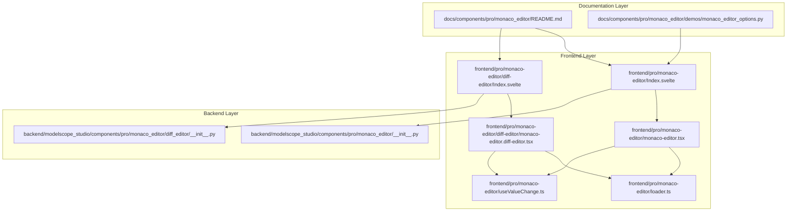
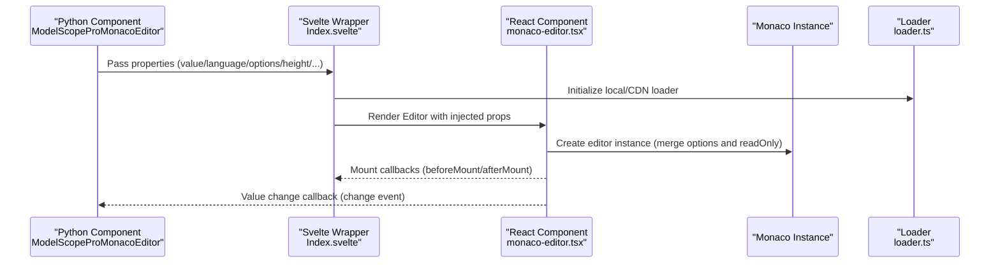
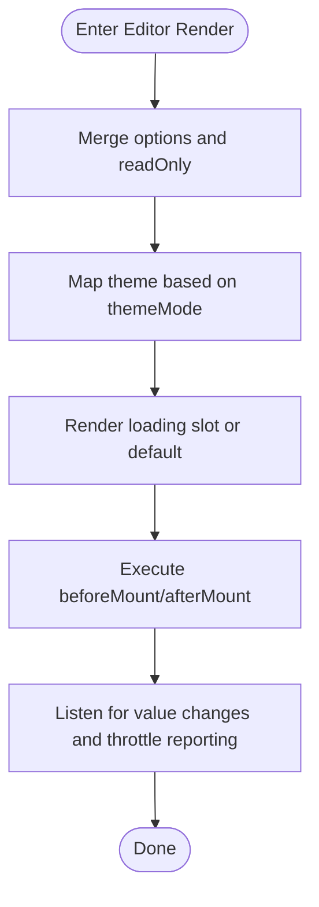
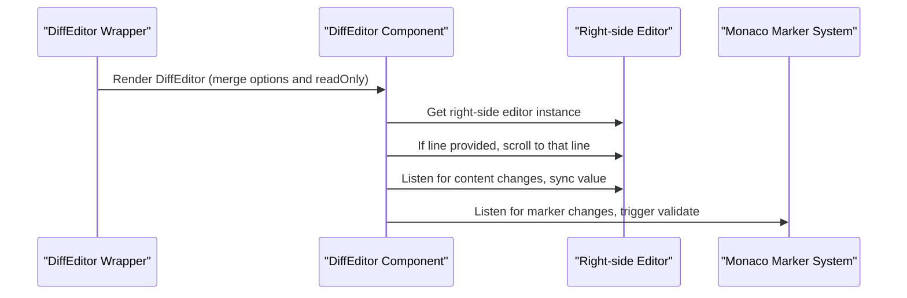
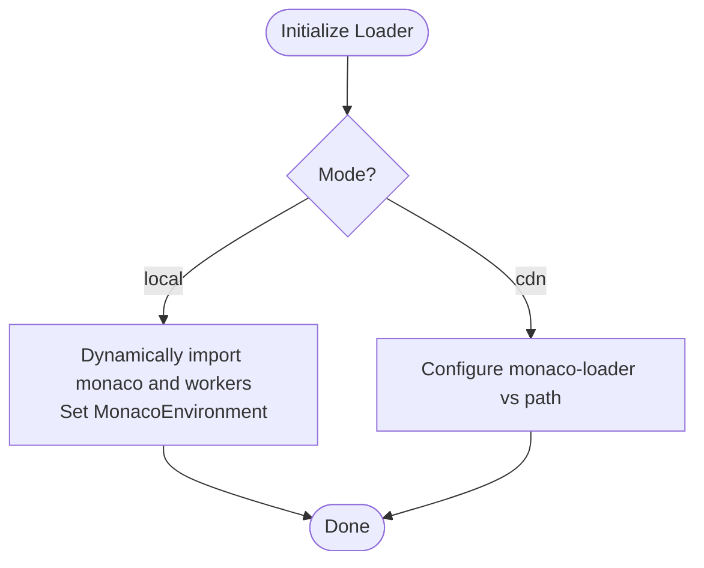
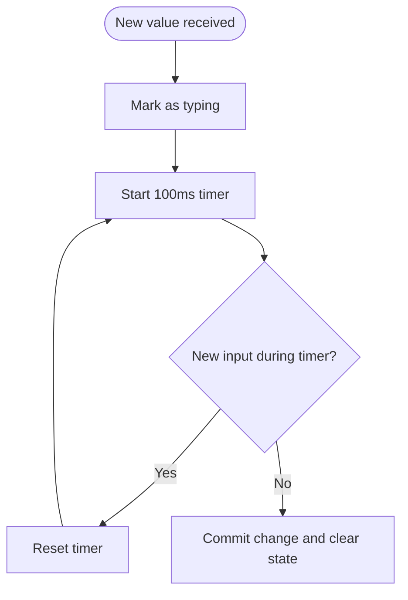
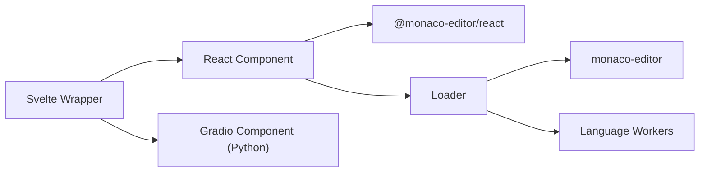

# Configuration Options

<cite>
**Files Referenced in This Document**
- [frontend/pro/monaco-editor/monaco-editor.tsx](file://frontend/pro/monaco-editor/monaco-editor.tsx)
- [frontend/pro/monaco-editor/diff-editor/monaco-editor.diff-editor.tsx](file://frontend/pro/monaco-editor/diff-editor/monaco-editor.diff-editor.tsx)
- [frontend/pro/monaco-editor/loader.ts](file://frontend/pro/monaco-editor/loader.ts)
- [frontend/pro/monaco-editor/useValueChange.ts](file://frontend/pro/monaco-editor/useValueChange.ts)
- [frontend/pro/monaco-editor/Index.svelte](file://frontend/pro/monaco-editor/Index.svelte)
- [frontend/pro/monaco-editor/diff-editor/Index.svelte](file://frontend/pro/monaco-editor/diff-editor/Index.svelte)
- [backend/modelscope_studio/components/pro/monaco_editor/__init__.py](file://backend/modelscope_studio/components/pro/monaco_editor/__init__.py)
- [backend/modelscope_studio/components/pro/monaco_editor/diff_editor/__init__.py](file://backend/modelscope_studio/components/pro/monaco_editor/diff_editor/__init__.py)
- [docs/components/pro/monaco_editor/README.md](file://docs/components/pro/monaco_editor/README.md)
- [docs/components/pro/monaco_editor/demos/monaco_editor_options.py](file://docs/components/pro/monaco_editor/demos/monaco_editor_options.py)
</cite>

## Table of Contents

1. [Introduction](#introduction)
2. [Project Structure](#project-structure)
3. [Core Components](#core-components)
4. [Architecture Overview](#architecture-overview)
5. [Detailed Component Analysis](#detailed-component-analysis)
6. [Dependency Analysis](#dependency-analysis)
7. [Performance Considerations](#performance-considerations)
8. [Troubleshooting Guide](#troubleshooting-guide)
9. [Conclusion](#conclusion)
10. [Appendix: Configuration Reference and Examples](#appendix-configuration-reference-and-examples)

## Introduction

This document is a complete configuration options reference for MonacoEditor in the current repository, covering key aspects such as editor appearance, behavior, functionality, language and theme, loading and performance. Combined with the frontend and Python backend integration approach, it provides directly applicable configuration recommendations, best practices, and common compatibility considerations.

## Project Structure

The configuration and usage of MonacoEditor spans the following layers:

- **Documentation layer**: Provides component API descriptions and example entry points
- **Frontend layer**: Svelte wrapper, React component, loader, and event bridging
- **Backend layer**: Gradio component wrapper exposing properties, events, and slots

Diagram Sources

- [frontend/pro/monaco-editor/Index.svelte:1-101](file://frontend/pro/monaco-editor/Index.svelte#L1-L101)
- [frontend/pro/monaco-editor/diff-editor/Index.svelte:1-103](file://frontend/pro/monaco-editor/diff-editor/Index.svelte#L1-L103)
- [frontend/pro/monaco-editor/monaco-editor.tsx:1-95](file://frontend/pro/monaco-editor/monaco-editor.tsx#L1-L95)
- [frontend/pro/monaco-editor/diff-editor/monaco-editor.diff-editor.tsx:1-161](file://frontend/pro/monaco-editor/diff-editor/monaco-editor.diff-editor.tsx#L1-L161)
- [frontend/pro/monaco-editor/loader.ts:1-95](file://frontend/pro/monaco-editor/loader.ts#L1-L95)
- [frontend/pro/monaco-editor/useValueChange.ts:1-44](file://frontend/pro/monaco-editor/useValueChange.ts#L1-L44)
- [backend/modelscope_studio/components/pro/monaco_editor/**init**.py:1-107](file://backend/modelscope_studio/components/pro/monaco_editor/__init__.py#L1-L107)
- [backend/modelscope_studio/components/pro/monaco_editor/diff_editor/**init**.py:1-106](file://backend/modelscope_studio/components/pro/monaco_editor/diff_editor/__init__.py#L1-L106)

Section Sources

- [docs/components/pro/monaco_editor/README.md:1-89](file://docs/components/pro/monaco_editor/README.md#L1-L89)
- [frontend/pro/monaco-editor/Index.svelte:1-101](file://frontend/pro/monaco-editor/Index.svelte#L1-L101)
- [frontend/pro/monaco-editor/diff-editor/Index.svelte:1-103](file://frontend/pro/monaco-editor/diff-editor/Index.svelte#L1-L103)

## Core Components

- **MonacoEditor (Standard Editor)**
  - Maps Gradio properties to Monaco constructor parameters, handling loading state, read-only, theme mode, value changes, and mount callbacks
  - Supports passing Monaco constructor options via `options`; supports injecting JS strings via `before_mount`/`after_mount`
- **MonacoDiffEditor (Diff Editor)**
  - Displays left/right content comparison, supports separate language settings for original and modified content, line positioning, and validation marker listening
  - Supports `options` and read-only configuration; supports the `line` parameter to scroll to a specified line after mounting
- **Loader (local/CDN)**
  - Initializes the Monaco environment and Web Workers; selects local bundling or CDN path on demand
- **Value change throttling**
  - Uses a timer to avoid frequent upper-level callback triggers, improving input experience and performance

Section Sources

- [frontend/pro/monaco-editor/monaco-editor.tsx:12-95](file://frontend/pro/monaco-editor/monaco-editor.tsx#L12-L95)
- [frontend/pro/monaco-editor/diff-editor/monaco-editor.diff-editor.tsx:19-161](file://frontend/pro/monaco-editor/diff-editor/monaco-editor.diff-editor.tsx#L19-L161)
- [frontend/pro/monaco-editor/loader.ts:1-95](file://frontend/pro/monaco-editor/loader.ts#L1-L95)
- [frontend/pro/monaco-editor/useValueChange.ts:1-44](file://frontend/pro/monaco-editor/useValueChange.ts#L1-L44)

## Architecture Overview

The call chain for MonacoEditor in this project is as follows:

Diagram Sources

- [backend/modelscope_studio/components/pro/monaco_editor/**init**.py:46-107](file://backend/modelscope_studio/components/pro/monaco_editor/__init__.py#L46-L107)
- [frontend/pro/monaco-editor/Index.svelte:64-90](file://frontend/pro/monaco-editor/Index.svelte#L64-L90)
- [frontend/pro/monaco-editor/monaco-editor.tsx:56-88](file://frontend/pro/monaco-editor/monaco-editor.tsx#L56-L88)
- [frontend/pro/monaco-editor/loader.ts:27-78](file://frontend/pro/monaco-editor/loader.ts#L27-L78)

## Detailed Component Analysis

### Standard Editor (MonacoEditor) Configuration Key Points

- **Property mapping and defaults**
  - `value`, `language`, `line`, `read_only`, `loading`, `options`, `overrideServices`, `height`, `before_mount`, `after_mount`
  - Theme mode is determined by `themeMode`; dark mode maps to `vs-dark`, otherwise `light`
- **Behavioral characteristics**
  - `options` and `readOnly` are merged and passed to the underlying constructor
  - The `onChange` callback synchronously updates the displayed value to avoid frequent upstream notifications
  - Loading state supports custom slots or the default spinner
- **Events and slots**
  - Events: `mount`, `change`, `validate` (only triggered in languages with rich IntelliSense)
  - Slots: `loading`

Diagram Sources

- [frontend/pro/monaco-editor/monaco-editor.tsx:64-88](file://frontend/pro/monaco-editor/monaco-editor.tsx#L64-L88)
- [frontend/pro/monaco-editor/useValueChange.ts:14-32](file://frontend/pro/monaco-editor/useValueChange.ts#L14-L32)

Section Sources

- [frontend/pro/monaco-editor/monaco-editor.tsx:12-95](file://frontend/pro/monaco-editor/monaco-editor.tsx#L12-L95)
- [docs/components/pro/monaco_editor/README.md:35-74](file://docs/components/pro/monaco_editor/README.md#L35-L74)

### Diff Editor (MonacoDiffEditor) Configuration Key Points

- **Property mapping and defaults**
  - `value` (right side), `original` (left side), `language`, `original_language`, `modified_language`, `line`, `read_only`, `loading`, `options`, `overrideServices`, `height`, `before_mount`, `after_mount`
- **Behavioral characteristics**
  - Read-only and `options` are merged and passed to the underlying constructor
  - After mounting, scrolls to the line specified by the `line` parameter
  - Listens for model marker changes and triggers the `validate` event
  - The `onChange` callback synchronously updates the right-side editor value
- **Events and slots**
  - Events: `mount`, `change`, `validate`
  - Slots: `loading`

Diagram Sources

- [frontend/pro/monaco-editor/diff-editor/monaco-editor.diff-editor.tsx:67-98](file://frontend/pro/monaco-editor/diff-editor/monaco-editor.diff-editor.tsx#L67-L98)
- [frontend/pro/monaco-editor/diff-editor/monaco-editor.diff-editor.tsx:127-153](file://frontend/pro/monaco-editor/diff-editor/monaco-editor.diff-editor.tsx#L127-L153)

Section Sources

- [frontend/pro/monaco-editor/diff-editor/monaco-editor.diff-editor.tsx:19-161](file://frontend/pro/monaco-editor/diff-editor/monaco-editor.diff-editor.tsx#L19-L161)
- [docs/components/pro/monaco_editor/README.md:48-74](file://docs/components/pro/monaco_editor/README.md#L48-L74)

### Loader and Theme

- **Loader**
  - Local loading: Dynamically imports Monaco and various language workers; sets `MonacoEnvironment.getWorker`
  - CDN loading: Configures the `vs` path via monaco-loader
- **Theme**
  - Maps dark mode to `vs-dark` via `themeMode`, otherwise `light`; uniformly handled by the underlying Editor

Diagram Sources

- [frontend/pro/monaco-editor/loader.ts:27-78](file://frontend/pro/monaco-editor/loader.ts#L27-L78)
- [frontend/pro/monaco-editor/loader.ts:80-94](file://frontend/pro/monaco-editor/loader.ts#L80-L94)
- [frontend/pro/monaco-editor/monaco-editor.tsx:87-88](file://frontend/pro/monaco-editor/monaco-editor.tsx#L87-L88)

Section Sources

- [frontend/pro/monaco-editor/loader.ts:1-95](file://frontend/pro/monaco-editor/loader.ts#L1-L95)
- [frontend/pro/monaco-editor/monaco-editor.tsx:12-95](file://frontend/pro/monaco-editor/monaco-editor.tsx#L12-L95)

### Value Change Throttle Mechanism

- **Goal**: Reduce callback storms caused by high-frequency input
- **Mechanism**: Starts a timer on input; if no new input occurs within 100ms, commits one change
- **Effect**: Reduces upper-level processing pressure and improves interaction smoothness

Diagram Sources

- [frontend/pro/monaco-editor/useValueChange.ts:14-24](file://frontend/pro/monaco-editor/useValueChange.ts#L14-L24)
- [frontend/pro/monaco-editor/useValueChange.ts:26-32](file://frontend/pro/monaco-editor/useValueChange.ts#L26-L32)

Section Sources

- [frontend/pro/monaco-editor/useValueChange.ts:1-44](file://frontend/pro/monaco-editor/useValueChange.ts#L1-L44)

## Dependency Analysis

- **Component coupling**
  - The Svelte wrapper is responsible for property forwarding and loader initialization
  - The React component is responsible for specific editor instantiation and event binding
  - The loader and Workers are decoupled from the editor logic
- **External dependencies**
  - `@monaco-editor/react` provides Editor/DiffEditor
  - `monaco-editor` and language workers
  - Gradio component bridging (Python layer)

Diagram Sources

- [frontend/pro/monaco-editor/Index.svelte:10-12](file://frontend/pro/monaco-editor/Index.svelte#L10-L12)
- [frontend/pro/monaco-editor/monaco-editor.tsx:1-2](file://frontend/pro/monaco-editor/monaco-editor.tsx#L1-L2)
- [frontend/pro/monaco-editor/loader.ts:33-51](file://frontend/pro/monaco-editor/loader.ts#L33-L51)

Section Sources

- [frontend/pro/monaco-editor/Index.svelte:1-101](file://frontend/pro/monaco-editor/Index.svelte#L1-L101)
- [frontend/pro/monaco-editor/monaco-editor.tsx:1-95](file://frontend/pro/monaco-editor/monaco-editor.tsx#L1-L95)
- [frontend/pro/monaco-editor/loader.ts:1-95](file://frontend/pro/monaco-editor/loader.ts#L1-L95)

## Performance Considerations

- **Loading strategy**
  - Prefer local loading to reduce the impact of network jitter on initial load; for offline or intranet deployments, fix the version and pre-warm
  - In CDN mode, ensure paths are stable to avoid repeated downloads
- **Language and Workers**
  - Load only the workers needed for the required languages to reduce memory usage
  - If custom languages are needed, introduce additional workers carefully
- **Input performance**
  - Use the built-in throttle mechanism to avoid upper-level redraws caused by high-frequency changes
- **View and layout**
  - Set `height` reasonably to avoid unnecessary reflows from oversized containers
  - Disable unnecessary features (e.g., `minimap`, `lineNumbers`) to reduce rendering cost

Section Sources

- [frontend/pro/monaco-editor/loader.ts:53-69](file://frontend/pro/monaco-editor/loader.ts#L53-L69)
- [frontend/pro/monaco-editor/useValueChange.ts:14-24](file://frontend/pro/monaco-editor/useValueChange.ts#L14-L24)
- [docs/components/pro/monaco_editor/demos/monaco_editor_options.py:24-29](file://docs/components/pro/monaco_editor/demos/monaco_editor_options.py#L24-L29)

## Troubleshooting Guide

- **Editor not loading or blank**
  - Check the `_loader` configuration (mode/local/cdn_url); confirm that loader initialization succeeded
  - Confirm that `before_mount`/`after_mount` do not block the main thread
- **Language highlighting missing**
  - Confirm `language` is set correctly; if using a custom language, check whether the corresponding worker is loaded
- **Read-only not working**
  - Confirm there is no conflict between how `read_only` is passed and `options` (the latter overrides the former); it is recommended to control this consistently via `read_only`
- **Line scroll not working**
  - For DiffEditor, the `line` parameter takes effect after mounting; confirm `line` is a number and is set after mount completes
- **Event not triggered**
  - The `validate` event is only triggered in languages with rich IntelliSense; confirm the language and validation rules are enabled

Section Sources

- [frontend/pro/monaco-editor/loader.ts:27-78](file://frontend/pro/monaco-editor/loader.ts#L27-L78)
- [frontend/pro/monaco-editor/diff-editor/monaco-editor.diff-editor.tsx:110-113](file://frontend/pro/monaco-editor/diff-editor/monaco-editor.diff-editor.tsx#L110-L113)
- [docs/components/pro/monaco_editor/README.md:74-74](file://docs/components/pro/monaco_editor/README.md#L74-L74)

## Conclusion

The MonacoEditor wrapper in this repository provides clear property mapping, event bridging, and loader abstraction, preserving Monaco's powerful capabilities while lowering the barrier to use in the Gradio ecosystem. By properly configuring `options`, choosing the appropriate loading mode and language workers, and utilizing the built-in throttle mechanism, you can achieve good performance while maintaining a smooth user experience.

## Appendix: Configuration Reference and Examples

### Property Overview (Standard Editor)

- `value`: Initial editor value
- `language`: Editor language
- `line`: Scroll vertically to the specified line
- `read_only`: Whether read-only
- `loading`: Loading prompt text or slot
- `options`: Monaco constructor options (passes through `IStandaloneEditorConstructionOptions`)
- `overrideServices`: Service overrides (passes through `IEditorOverrideServices`)
- `height`: Component height (number = px, string = CSS unit)
- `before_mount`: JS function string executed before loading (can access `monaco`)
- `after_mount`: JS function string executed after loading (can access `editor` and `monaco`)

Section Sources

- [docs/components/pro/monaco_editor/README.md:35-47](file://docs/components/pro/monaco_editor/README.md#L35-L47)
- [frontend/pro/monaco-editor/monaco-editor.tsx:35-70](file://frontend/pro/monaco-editor/monaco-editor.tsx#L35-L70)

### Property Overview (Diff Editor)

- `value`: Modified source (right side)
- `original`: Original source (left side)
- `language`: Editor language
- `original_language`: Separate language for the original source
- `modified_language`: Separate language for the modified source
- `line`: Scroll vertically to the specified line
- `read_only`: Whether read-only
- `loading`: Loading prompt text or slot
- `options`: Monaco constructor options (passes through `IStandaloneEditorConstructionOptions`)
- `overrideServices`: Service overrides (passes through `IEditorOverrideServices`)
- `height`: Component height (number = px, string = CSS unit)
- `before_mount`: JS function string executed before loading (can access `monaco`)
- `after_mount`: JS function string executed after loading (can access `editor` and `monaco`)

Section Sources

- [docs/components/pro/monaco_editor/README.md:48-65](file://docs/components/pro/monaco_editor/README.md#L48-L65)
- [frontend/pro/monaco-editor/diff-editor/monaco-editor.diff-editor.tsx:49-153](file://frontend/pro/monaco-editor/diff-editor/monaco-editor.diff-editor.tsx#L49-L153)

### Events and Slots

- **Events**
  - `mount`: Editor mount completed
  - `change`: Editor value changed
  - `validate`: Triggered when validation markers are present (only certain languages)
- **Slots**
  - `loading`: Custom loading state

Section Sources

- [docs/components/pro/monaco_editor/README.md:66-89](file://docs/components/pro/monaco_editor/README.md#L66-L89)

### Configuration Examples and Best Practices

- **Basic example (with options)**
  - Reference: docs/components/pro/monaco_editor/demos/monaco_editor_options.py
  - Recommendation: Disable `minimap` and line numbers in `options` for better performance
- **Language and theme**
  - Language: Set via `language`; for different languages on each side of the diff editor, set `original_language` and `modified_language` separately
  - Theme: Automatically mapped to `vs-dark`/`light` via `themeMode`
- **Loading mode**
  - Local: Suitable for controlled environments and offline scenarios
  - CDN: Suitable for quick deployment and multi-version management

Section Sources

- [docs/components/pro/monaco_editor/demos/monaco_editor_options.py:1-34](file://docs/components/pro/monaco_editor/demos/monaco_editor_options.py#L1-L34)
- [frontend/pro/monaco-editor/monaco-editor.tsx:87-88](file://frontend/pro/monaco-editor/monaco-editor.tsx#L87-L88)
- [backend/modelscope_studio/components/pro/monaco_editor/**init**.py:43-44](file://backend/modelscope_studio/components/pro/monaco_editor/__init__.py#L43-L44)
