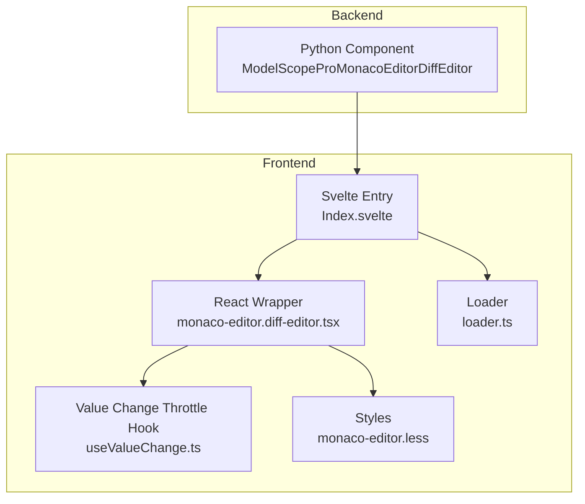
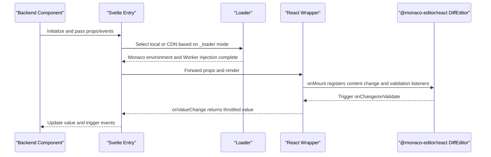
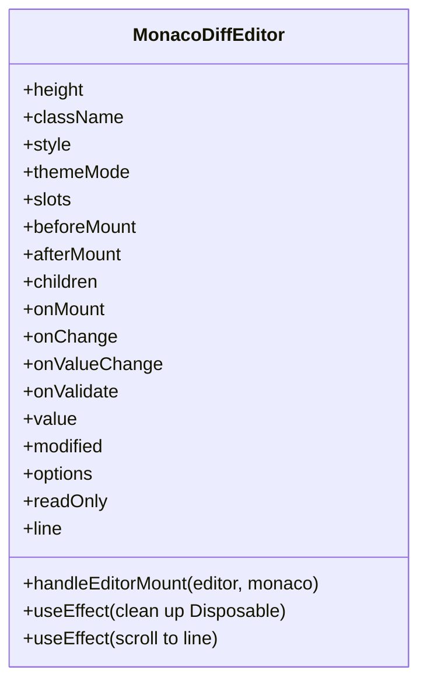
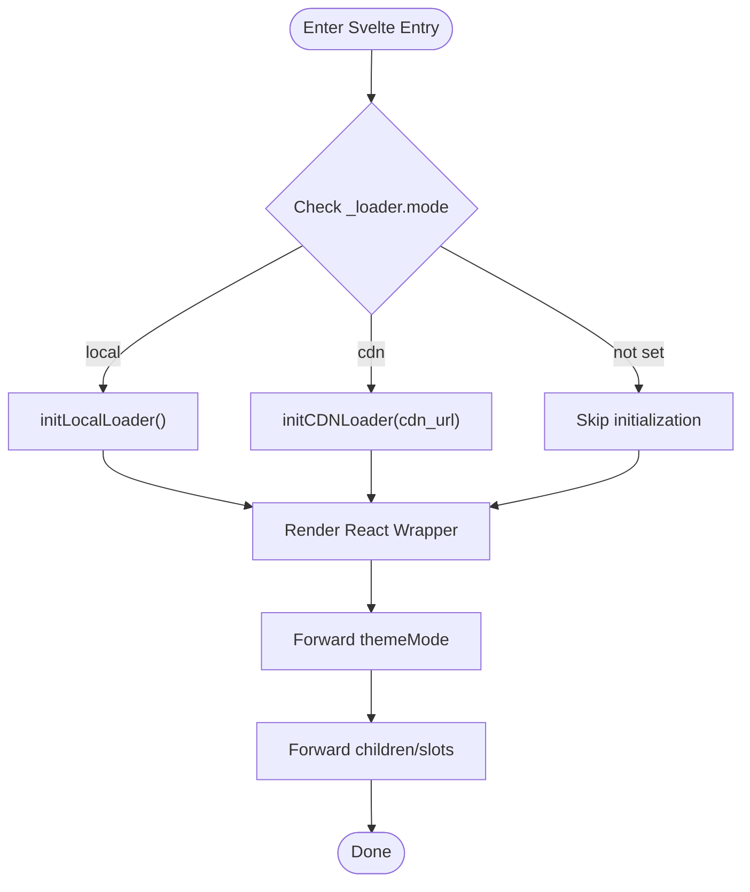
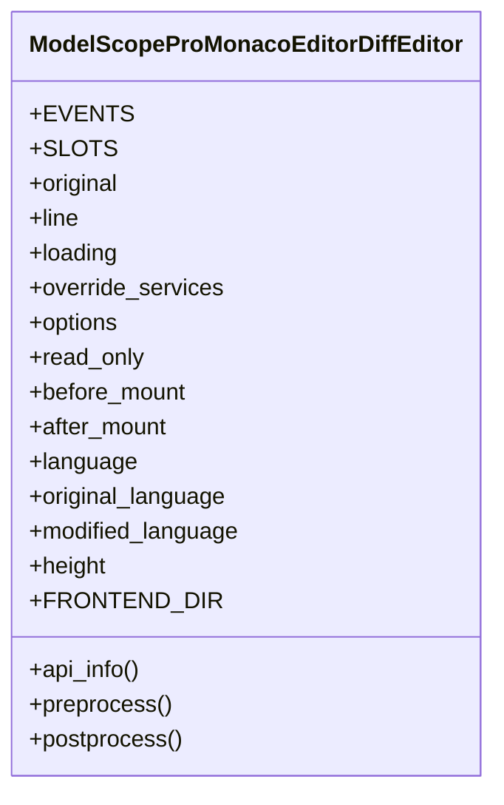
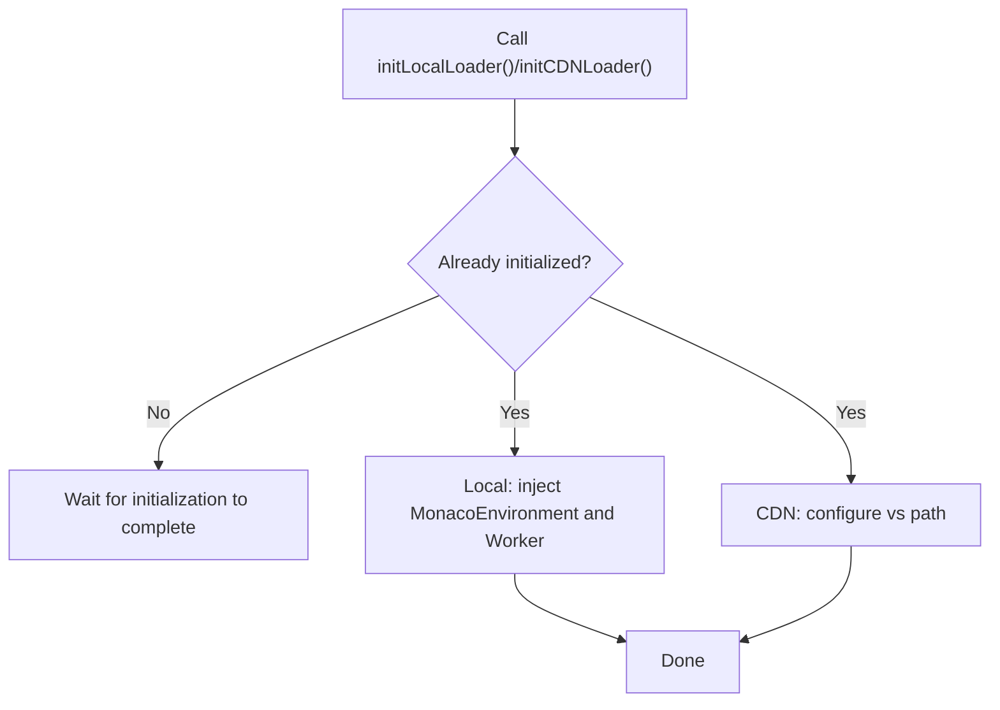
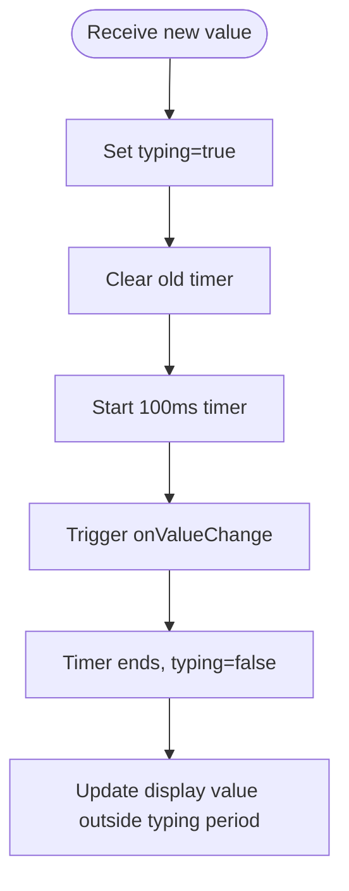
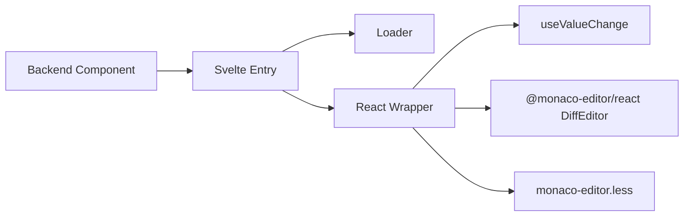

# Diff Editor

<cite>
**Files Referenced in This Document**   
- [frontend/pro/monaco-editor/diff-editor/monaco-editor.diff-editor.tsx](file://frontend/pro/monaco-editor/diff-editor/monaco-editor.diff-editor.tsx)
- [frontend/pro/monaco-editor/diff-editor/Index.svelte](file://frontend/pro/monaco-editor/diff-editor/Index.svelte)
- [backend/modelscope_studio/components/pro/monaco_editor/diff_editor/__init__.py](file://backend/modelscope_studio/components/pro/monaco_editor/diff_editor/__init__.py)
- [docs/components/pro/monaco_editor/README.md](file://docs/components/pro/monaco_editor/README.md)
- [docs/components/pro/monaco_editor/README-zh_CN.md](file://docs/components/pro/monaco_editor/README-zh_CN.md)
- [docs/components/pro/monaco_editor/demos/diff_editor.py](file://docs/components/pro/monaco_editor/demos/diff_editor.py)
- [frontend/pro/monaco-editor/loader.ts](file://frontend/pro/monaco-editor/loader.ts)
- [frontend/pro/monaco-editor/useValueChange.ts](file://frontend/pro/monaco-editor/useValueChange.ts)
- [frontend/pro/monaco-editor/monaco-editor.less](file://frontend/pro/monaco-editor/monaco-editor.less)
</cite>

## Table of Contents

1. [Introduction](#introduction)
2. [Project Structure](#project-structure)
3. [Core Components](#core-components)
4. [Architecture Overview](#architecture-overview)
5. [Detailed Component Analysis](#detailed-component-analysis)
6. [Dependency Analysis](#dependency-analysis)
7. [Performance Considerations](#performance-considerations)
8. [Troubleshooting Guide](#troubleshooting-guide)
9. [Conclusion](#conclusion)
10. [Appendix](#appendix)

## Introduction

This document focuses on the Diff Editor capability of MonacoEditor. It systematically explains how to use the diff editor for side-by-side comparison, diff highlighting, and synchronized scrolling within the ModelScope Studio Pro component system. It covers configuration options, event binding, loading modes (local/CDN), and usage recommendations for version control and code review scenarios. It also provides technical analysis of internal implementation mechanisms such as value change throttling, validation marker listening, theming, and loading states, helping readers customize and optimize behavior in complex scenarios.

## Project Structure

The diff editor is composed of three coordinated parts: a frontend Svelte component bridge, a React wrapper layer, and a backend Gradio component:

- The frontend Svelte layer handles prop forwarding, loader initialization, and slot rendering;
- The React wrapper layer handles integration with `@monaco-editor/react` DiffEditor, event binding, value change throttling, and validation marker listening;
- The backend Python component manages the Gradio lifecycle, event declarations, and frontend resource directory mapping.

**Diagram Source**

- [frontend/pro/monaco-editor/diff-editor/Index.svelte:1-103](file://frontend/pro/monaco-editor/diff-editor/Index.svelte#L1-L103)
- [frontend/pro/monaco-editor/diff-editor/monaco-editor.diff-editor.tsx:1-160](file://frontend/pro/monaco-editor/diff-editor/monaco-editor.diff-editor.tsx#L1-L160)
- [frontend/pro/monaco-editor/loader.ts:1-95](file://frontend/pro/monaco-editor/loader.ts#L1-L95)
- [frontend/pro/monaco-editor/useValueChange.ts:1-44](file://frontend/pro/monaco-editor/useValueChange.ts#L1-L44)
- [frontend/pro/monaco-editor/monaco-editor.less:1-7](file://frontend/pro/monaco-editor/monaco-editor.less#L1-L7)

**Section Source**

- [frontend/pro/monaco-editor/diff-editor/Index.svelte:1-103](file://frontend/pro/monaco-editor/diff-editor/Index.svelte#L1-L103)
- [frontend/pro/monaco-editor/diff-editor/monaco-editor.diff-editor.tsx:1-160](file://frontend/pro/monaco-editor/diff-editor/monaco-editor.diff-editor.tsx#L1-L160)
- [backend/modelscope_studio/components/pro/monaco_editor/diff_editor/**init**.py:1-106](file://backend/modelscope_studio/components/pro/monaco_editor/diff_editor/__init__.py#L1-L106)

## Core Components

- **Frontend Diff Editor Wrapper**: Handles integration with `@monaco-editor/react` DiffEditor, processes value changes, validation markers, theme switching, loading state, and mount callbacks.
- **Svelte Entry Component**: Handles loader initialization (local or CDN), prop forwarding, slot rendering, and visibility control.
- **Backend Gradio Component**: Declares events (`mount`/`change`/`validate`), exposes properties and default values, and maps the frontend resource directory.
- **Loader**: Uniformly initializes the Monaco environment and Web Workers, supporting both local bundling and CDN path configuration.
- **Value Change Throttle Hook**: Reduces callback frequency during high-frequency input, improving interaction smoothness.
- **Styles**: Provides full-size loading container dimensions and theme class name conventions.

**Section Source**

- [frontend/pro/monaco-editor/diff-editor/monaco-editor.diff-editor.tsx:19-33](file://frontend/pro/monaco-editor/diff-editor/monaco-editor.diff-editor.tsx#L19-L33)
- [frontend/pro/monaco-editor/diff-editor/Index.svelte:1-103](file://frontend/pro/monaco-editor/diff-editor/Index.svelte#L1-L103)
- [backend/modelscope_studio/components/pro/monaco_editor/diff_editor/**init**.py:10-31](file://backend/modelscope_studio/components/pro/monaco_editor/diff_editor/__init__.py#L10-L31)
- [frontend/pro/monaco-editor/loader.ts:1-95](file://frontend/pro/monaco-editor/loader.ts#L1-L95)
- [frontend/pro/monaco-editor/useValueChange.ts:1-44](file://frontend/pro/monaco-editor/useValueChange.ts#L1-L44)
- [frontend/pro/monaco-editor/monaco-editor.less:1-7](file://frontend/pro/monaco-editor/monaco-editor.less#L1-L7)

## Architecture Overview

The diff editor call chain is as follows:

- The backend component instantiates and declares events;
- The frontend Svelte entry initializes the loader based on the `_loader` configuration;
- The React wrapper mounts the DiffEditor and registers content change and validation marker listeners;
- User interactions trigger value changes, which are throttled before being passed upstream;
- The theme switches with the Gradio shared theme, and the loading state supports customizable slots.

**Diagram Source**

- [backend/modelscope_studio/components/pro/monaco_editor/diff_editor/**init**.py:14-31](file://backend/modelscope_studio/components/pro/monaco_editor/diff_editor/__init__.py#L14-L31)
- [frontend/pro/monaco-editor/diff-editor/Index.svelte:66-91](file://frontend/pro/monaco-editor/diff-editor/Index.svelte#L66-L91)
- [frontend/pro/monaco-editor/loader.ts:27-94](file://frontend/pro/monaco-editor/loader.ts#L27-L94)
- [frontend/pro/monaco-editor/diff-editor/monaco-editor.diff-editor.tsx:67-98](file://frontend/pro/monaco-editor/diff-editor/monaco-editor.diff-editor.tsx#L67-L98)

## Detailed Component Analysis

### React Wrapper (Diff Editor)

This component is the core implementation of the diff editor. Its responsibilities include:

- Receiving and merging `options` and read-only state;
- Listening to content changes on the modified editor side, triggering `onValueChange` and `onChange`;
- Listening to validation marker changes, triggering `onValidate`;
- Supporting line number-based positioning and scrolling;
- Automatically switching themes with the Gradio theme;
- Providing a pluggable `loading` slot.

**Diagram Source**

- [frontend/pro/monaco-editor/diff-editor/monaco-editor.diff-editor.tsx:19-33](file://frontend/pro/monaco-editor/diff-editor/monaco-editor.diff-editor.tsx#L19-L33)
- [frontend/pro/monaco-editor/diff-editor/monaco-editor.diff-editor.tsx:67-98](file://frontend/pro/monaco-editor/diff-editor/monaco-editor.diff-editor.tsx#L67-L98)
- [frontend/pro/monaco-editor/diff-editor/monaco-editor.diff-editor.tsx:109-113](file://frontend/pro/monaco-editor/diff-editor/monaco-editor.diff-editor.tsx#L109-L113)

**Section Source**

- [frontend/pro/monaco-editor/diff-editor/monaco-editor.diff-editor.tsx:1-160](file://frontend/pro/monaco-editor/diff-editor/monaco-editor.diff-editor.tsx#L1-L160)

### Svelte Entry (Loading and Prop Forwarding)

- Decides between local loading and CDN based on `_loader.mode`;
- Forwards the Gradio shared theme to the React wrapper to enable theme synchronization;
- Renders `children` as a React Slot, supporting the `loading` slot;
- Writes back the value from `onValueChange` to the component state via `updateProps`.

**Diagram Source**

- [frontend/pro/monaco-editor/diff-editor/Index.svelte:66-91](file://frontend/pro/monaco-editor/diff-editor/Index.svelte#L66-L91)
- [frontend/pro/monaco-editor/loader.ts:27-94](file://frontend/pro/monaco-editor/loader.ts#L27-L94)

**Section Source**

- [frontend/pro/monaco-editor/diff-editor/Index.svelte:1-103](file://frontend/pro/monaco-editor/diff-editor/Index.svelte#L1-L103)

### Backend Component (Gradio)

- Declares events: `mount`, `change`, `validate`;
- Supports slots: `loading`;
- Exposes properties: `original`, `language`, `original_language`, `modified_language`, `line`, `read_only`, `options`, `override_services`, `height`, `before_mount`, `after_mount`, etc.;
- Maps the frontend resource directory to `pro/monaco-editor/diff-editor`.

**Diagram Source**

- [backend/modelscope_studio/components/pro/monaco_editor/diff_editor/**init**.py:14-31](file://backend/modelscope_studio/components/pro/monaco_editor/diff_editor/__init__.py#L14-L31)
- [backend/modelscope_studio/components/pro/monaco_editor/diff_editor/**init**.py:36-82](file://backend/modelscope_studio/components/pro/monaco_editor/diff_editor/__init__.py#L36-L82)
- [backend/modelscope_studio/components/pro/monaco_editor/diff_editor/**init**.py:84-86](file://backend/modelscope_studio/components/pro/monaco_editor/diff_editor/__init__.py#L84-L86)

**Section Source**

- [backend/modelscope_studio/components/pro/monaco_editor/diff_editor/**init**.py:1-106](file://backend/modelscope_studio/components/pro/monaco_editor/diff_editor/__init__.py#L1-L106)

### Loader (Local/CDN)

- **Local loading**: Dynamically imports `monaco-editor` and various language Workers, then injects `MonacoEnvironment`;
- **CDN loading**: Points to a CDN via path configuration;
- Unified initialization entry point to avoid duplicate loading.

**Diagram Source**

- [frontend/pro/monaco-editor/loader.ts:27-94](file://frontend/pro/monaco-editor/loader.ts#L27-L94)

**Section Source**

- [frontend/pro/monaco-editor/loader.ts:1-95](file://frontend/pro/monaco-editor/loader.ts#L1-L95)

### Value Change Throttle Hook

- Delays triggering `onValueChange` during high-frequency input to reduce upstream update frequency;
- Controls the display value and callback timing via a timer and `typing` state.

**Diagram Source**

- [frontend/pro/monaco-editor/useValueChange.ts:14-32](file://frontend/pro/monaco-editor/useValueChange.ts#L14-L32)

**Section Source**

- [frontend/pro/monaco-editor/useValueChange.ts:1-44](file://frontend/pro/monaco-editor/useValueChange.ts#L1-L44)

## Dependency Analysis

- The React wrapper depends on `@monaco-editor/react` DiffEditor and `monaco-editor` types;
- Uses `useValueChange` for throttling;
- The Svelte entry depends on the loader and `ReactSlot`;
- The backend component depends on the Gradio event system and frontend resource directory mapping.

**Diagram Source**

- [backend/modelscope_studio/components/pro/monaco_editor/diff_editor/**init**.py:84-86](file://backend/modelscope_studio/components/pro/monaco_editor/diff_editor/__init__.py#L84-L86)
- [frontend/pro/monaco-editor/diff-editor/Index.svelte:12-14](file://frontend/pro/monaco-editor/diff-editor/Index.svelte#L12-L14)
- [frontend/pro/monaco-editor/diff-editor/monaco-editor.diff-editor.tsx:1-17](file://frontend/pro/monaco-editor/diff-editor/monaco-editor.diff-editor.tsx#L1-L17)
- [frontend/pro/monaco-editor/useValueChange.ts:1-2](file://frontend/pro/monaco-editor/useValueChange.ts#L1-L2)
- [frontend/pro/monaco-editor/monaco-editor.less:1-7](file://frontend/pro/monaco-editor/monaco-editor.less#L1-L7)

**Section Source**

- [frontend/pro/monaco-editor/diff-editor/monaco-editor.diff-editor.tsx:1-17](file://frontend/pro/monaco-editor/diff-editor/monaco-editor.diff-editor.tsx#L1-L17)
- [frontend/pro/monaco-editor/diff-editor/Index.svelte:12-14](file://frontend/pro/monaco-editor/diff-editor/Index.svelte#L12-L14)

## Performance Considerations

- **Input throttling**: `useValueChange` reduces callback frequency during high-frequency input, preventing excessive upstream propagation and re-renders.
- **Disposable management**: Releases editor and marker listener subscriptions on unmount to prevent memory leaks.
- **Theme switching**: Switches `vs-dark`/`light` on demand, avoiding unnecessary redraws.
- **Loading strategy**: Prefer local loading to reduce network latency; in CDN mode, ensure correct paths and cache hit rates.
- **Large document optimization**: It is recommended to configure options such as `minimap`, `lineNumbers`, and `scrollBeyondLastLine` appropriately to reduce rendering overhead.

[This section is general guidance and does not directly analyze specific files]

## Troubleshooting Guide

- **Editor not displaying or showing blank**
  - Check whether the `_loader` configuration is correct and confirm that local loading or CDN path is available;
  - Confirm that the Gradio theme is properly forwarded to `themeMode`.
- **Value not propagating or events not firing**
  - Confirm that `onValueChange` is correctly bound;
  - Check whether `onChange`/`onValidate` are registered;
  - Confirm that the `before_mount`/`after_mount` string functions are valid.
- **Validation markers not appearing**
  - Only triggered for languages with rich IntelliSense support (TypeScript, JavaScript, CSS, LESS, SCSS, JSON, HTML);
  - Confirm that the `monaco.editor.onDidChangeMarkers` subscription is active.
- **Line number navigation not working**
  - Confirm that `line` is passed as a numeric value;
  - Confirm that `revealLine` is called only after the editor is ready.

**Section Source**

- [frontend/pro/monaco-editor/diff-editor/monaco-editor.diff-editor.tsx:67-98](file://frontend/pro/monaco-editor/diff-editor/monaco-editor.diff-editor.tsx#L67-L98)
- [frontend/pro/monaco-editor/diff-editor/monaco-editor.diff-editor.tsx:109-113](file://frontend/pro/monaco-editor/diff-editor/monaco-editor.diff-editor.tsx#L109-L113)
- [docs/components/pro/monaco_editor/README.md:66-74](file://docs/components/pro/monaco_editor/README.md#L66-L74)

## Conclusion

The diff editor in ModelScope Studio achieves a stable and extensible side-by-side comparison and diff highlighting experience through a layered design of "backend events + frontend bridging + React wrapper + loader". Combined with value change throttling, validation marker listening, and theme synchronization, it works efficiently in version control and code review scenarios. In production environments, it is recommended to combine large-document optimizations with appropriate loading strategies, and to continuously manage event and subscription lifecycles.

[This section is a summary and does not directly analyze specific files]

## Appendix

### Usage Examples and Scenarios

- **Basic diff editor example**: Demonstrates comparison between `original` and `value`, read-only toggling, and `change` event binding.
- **Version control scenario**: The left side shows the baseline version, the right side shows current modifications, combined with the `validate` event to highlight error locations.
- **Code review scenario**: Enable read-only mode to allow only viewing diffs and comments, with `before_mount`/`after_mount` for extending advanced capabilities.

**Section Source**

- [docs/components/pro/monaco_editor/demos/diff_editor.py:1-44](file://docs/components/pro/monaco_editor/demos/diff_editor.py#L1-L44)

### Property and Event Reference

- **Properties (DiffEditor)**: `value`, `original`, `language`, `original_language`, `modified_language`, `line`, `read_only`, `loading`, `options`, `override_services`, `height`, `before_mount`, `after_mount`.
- **Events**: `mount`, `change`, `validate`.
- **Slots**: `loading`.

**Section Source**

- [docs/components/pro/monaco_editor/README.md:48-64](file://docs/components/pro/monaco_editor/README.md#L48-L64)
- [docs/components/pro/monaco_editor/README-zh_CN.md:48-64](file://docs/components/pro/monaco_editor/README-zh_CN.md#L48-L64)
- [backend/modelscope_studio/components/pro/monaco_editor/diff_editor/**init**.py:14-31](file://backend/modelscope_studio/components/pro/monaco_editor/diff_editor/__init__.py#L14-L31)
