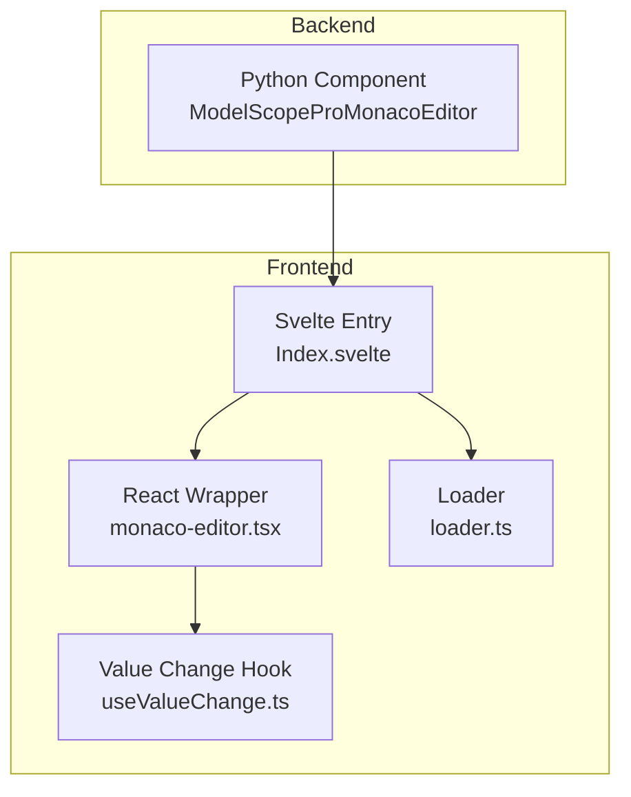
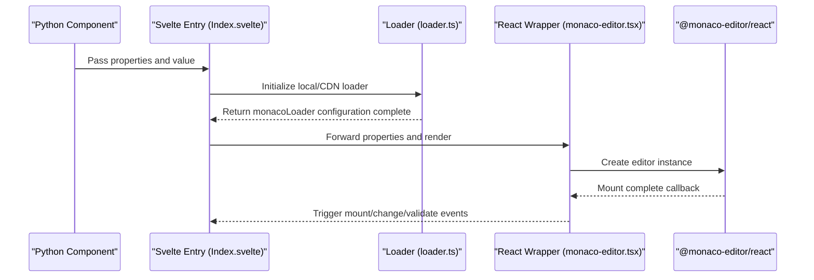
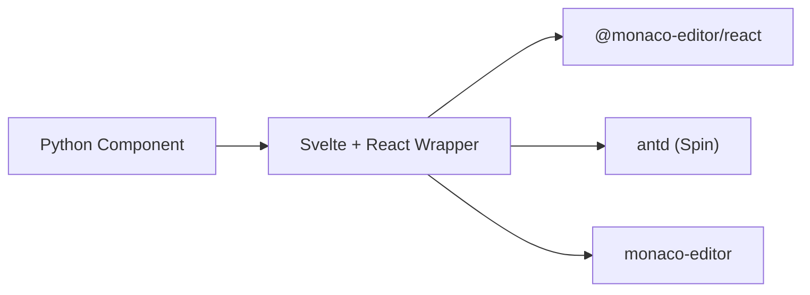
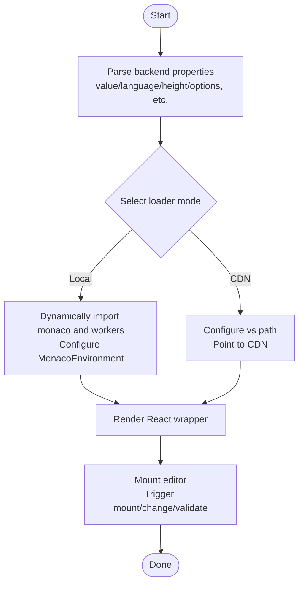

# Getting Started

<cite>
**Files Referenced in This Document**
- [frontend/pro/monaco-editor/Index.svelte](file://frontend/pro/monaco-editor/Index.svelte)
- [frontend/pro/monaco-editor/monaco-editor.tsx](file://frontend/pro/monaco-editor/monaco-editor.tsx)
- [frontend/pro/monaco-editor/loader.ts](file://frontend/pro/monaco-editor/loader.ts)
- [frontend/pro/monaco-editor/useValueChange.ts](file://frontend/pro/monaco-editor/useValueChange.ts)
- [backend/modelscope_studio/components/pro/monaco_editor/__init__.py](file://backend/modelscope_studio/components/pro/monaco_editor/__init__.py)
- [docs/components/pro/monaco_editor/README.md](file://docs/components/pro/monaco_editor/README.md)
- [docs/components/pro/monaco_editor/demos/monaco_editor_options.py](file://docs/components/pro/monaco_editor/demos/monaco_editor_options.py)
- [frontend/package.json](file://frontend/package.json)
</cite>

## Table of Contents

1. [Introduction](#introduction)
2. [Project Structure](#project-structure)
3. [Core Components](#core-components)
4. [Architecture Overview](#architecture-overview)
5. [Detailed Component Analysis](#detailed-component-analysis)
6. [Dependency Analysis](#dependency-analysis)
7. [Performance Considerations](#performance-considerations)
8. [Troubleshooting Guide](#troubleshooting-guide)
9. [Conclusion](#conclusion)
10. [Appendix](#appendix)

## Introduction

This chapter is intended for beginners and introduces how to quickly get started with MonacoEditor in the ModelScope Studio Pro component system. Topics covered:

- The simplest usage examples: basic text editing, language settings, height configuration
- Common parameter descriptions: how to use `language`, `height`, and `options`
- Editor initialization flow and basic configuration items
- Directly referenceable example paths and runtime behavior descriptions

## Project Structure

MonacoEditor is integrated on the frontend using a Svelte + React wrapper approach, and exposed to Python on the backend as a Gradio component. Key directories and files:

- Frontend component entry: frontend/pro/monaco-editor/Index.svelte
- React wrapper: frontend/pro/monaco-editor/monaco-editor.tsx
- Loader: frontend/pro/monaco-editor/loader.ts
- Value change handling: frontend/pro/monaco-editor/useValueChange.ts
- Backend component definition: backend/modelscope_studio/components/pro/monaco_editor/**init**.py
- Documentation and examples: docs/components/pro/monaco_editor/README.md, demos/monaco_editor_options.py
- Dependency declarations: frontend/package.json

Diagram Sources

- [frontend/pro/monaco-editor/Index.svelte:1-100](file://frontend/pro/monaco-editor/Index.svelte#L1-L100)
- [frontend/pro/monaco-editor/monaco-editor.tsx:1-94](file://frontend/pro/monaco-editor/monaco-editor.tsx#L1-L94)
- [frontend/pro/monaco-editor/loader.ts:1-95](file://frontend/pro/monaco-editor/loader.ts#L1-L95)
- [frontend/pro/monaco-editor/useValueChange.ts:1-44](file://frontend/pro/monaco-editor/useValueChange.ts#L1-L44)

Section Sources

- [frontend/pro/monaco-editor/Index.svelte:1-100](file://frontend/pro/monaco-editor/Index.svelte#L1-L100)
- [frontend/pro/monaco-editor/monaco-editor.tsx:1-94](file://frontend/pro/monaco-editor/monaco-editor.tsx#L1-L94)
- [frontend/pro/monaco-editor/loader.ts:1-95](file://frontend/pro/monaco-editor/loader.ts#L1-L95)
- [frontend/pro/monaco-editor/useValueChange.ts:1-44](file://frontend/pro/monaco-editor/useValueChange.ts#L1-L44)
- [backend/modelscope_studio/components/pro/monaco_editor/**init**.py:1-107](file://backend/modelscope_studio/components/pro/monaco_editor/__init__.py#L1-L107)
- [docs/components/pro/monaco_editor/README.md:1-89](file://docs/components/pro/monaco_editor/README.md#L1-L89)
- [docs/components/pro/monaco_editor/demos/monaco_editor_options.py:1-34](file://docs/components/pro/monaco_editor/demos/monaco_editor_options.py#L1-L34)
- [frontend/package.json:1-59](file://frontend/package.json#L1-L59)

## Core Components

- **Backend component**: `ModelScopeProMonacoEditor` (supports language, height, options, read-only, before/after mount callbacks, etc.)
- **Frontend wrapper**: `MonacoEditor` (based on `@monaco-editor/react`, responsible for rendering and event bridging)
- **Loader**: Supports local bundling or CDN mode for loading Monaco dependencies
- **Value change hook**: `useValueChange` (debounces and merges inputs to avoid frequent triggers)

Section Sources

- [backend/modelscope_studio/components/pro/monaco_editor/**init**.py:46-85](file://backend/modelscope_studio/components/pro/monaco_editor/__init__.py#L46-L85)
- [frontend/pro/monaco-editor/monaco-editor.tsx:12-19](file://frontend/pro/monaco-editor/monaco-editor.tsx#L12-L19)
- [frontend/pro/monaco-editor/loader.ts:27-94](file://frontend/pro/monaco-editor/loader.ts#L27-L94)
- [frontend/pro/monaco-editor/useValueChange.ts:4-43](file://frontend/pro/monaco-editor/useValueChange.ts#L4-L43)

## Architecture Overview

The MonacoEditor call chain goes from the Python component to the Svelte entry, then to the React wrapper, and is finally rendered by `@monaco-editor/react`. The loader is responsible for initializing the Monaco environment in either local or CDN mode.

Diagram Sources

- [frontend/pro/monaco-editor/Index.svelte:64-99](file://frontend/pro/monaco-editor/Index.svelte#L64-L99)
- [frontend/pro/monaco-editor/loader.ts:27-94](file://frontend/pro/monaco-editor/loader.ts#L27-L94)
- [frontend/pro/monaco-editor/monaco-editor.tsx:21-92](file://frontend/pro/monaco-editor/monaco-editor.tsx#L21-L92)

## Detailed Component Analysis

### Backend Component: ModelScopeProMonacoEditor

- **Supported key parameters**
  - `value`: Initial editor value
  - `language`: Language mode (e.g., python/javascript)
  - `height`: Editor height (number = px, string = CSS unit)
  - `options`: Monaco editor constructor options dictionary
  - `read_only`: Whether read-only
  - `before_mount`/`after_mount`: JS callback strings executed before/after mounting
  - `line`: Scroll to specified line
  - `loading`: Loading prompt text
  - `override_services`: Override service configuration
  - `_loader`: Loader configuration (mode/cdn_url)
- **Events**
  - `mount`: Triggered when the editor mounts
  - `change`: Triggered when the editor value changes
  - `validate`: Triggered when validation markers are ready (supported by certain languages)
- **Slots**
  - `loading`: Custom loading state content

Section Sources

- [backend/modelscope_studio/components/pro/monaco_editor/**init**.py:46-85](file://backend/modelscope_studio/components/pro/monaco_editor/__init__.py#L46-L85)
- [docs/components/pro/monaco_editor/README.md:29-89](file://docs/components/pro/monaco_editor/README.md#L29-L89)

### Frontend Wrapper: MonacoEditor (React)

- **Property mapping**
  - Receives all properties from the backend and passes them through to the `@monaco-editor/react` Editor
  - Internally handles `themeMode` (dark/light), `height`, `options` (including `readOnly`), etc.
  - Provides bridging between `onValueChange` and `onChange`
- **Loading state**
  - Uses the Spin component as the default loading indicator; can be replaced via a slot
- **Event bridging**
  - `onMount`/`afterMount`: Uniformly triggers mount events
  - `onChange`: Combines with `useValueChange` for debounced updates

Section Sources

- [frontend/pro/monaco-editor/monaco-editor.tsx:12-19](file://frontend/pro/monaco-editor/monaco-editor.tsx#L12-L19)
- [frontend/pro/monaco-editor/monaco-editor.tsx:21-92](file://frontend/pro/monaco-editor/monaco-editor.tsx#L21-L92)

### Loader: Local/CDN Mode

- **Local mode**
  - Dynamically imports `monaco-editor` and various workers
  - Sets `MonacoEnvironment.getWorker` to dispatch the appropriate worker by language type
  - Injects the monaco instance via `monacoLoader.config`
- **CDN mode**
  - Specifies the `vs` path via `monacoLoader.config` (points to a public CDN by default)
  - Supports custom `cdn_url`

Section Sources

- [frontend/pro/monaco-editor/loader.ts:27-94](file://frontend/pro/monaco-editor/loader.ts#L27-L94)

### Value Change Handling: useValueChange

- **Design goal**
  - Avoid frequent external callbacks during user input
  - Decouples the "typing" state from the final value using a timer
- **Behavior**
  - Input start: Enters `typing` state
  - Input end (timer): Syncs the displayed value and triggers `onValueChange`
  - Component unmount: Clears the timer

Section Sources

- [frontend/pro/monaco-editor/useValueChange.ts:4-43](file://frontend/pro/monaco-editor/useValueChange.ts#L4-L43)

### Svelte Entry: Index.svelte

- **Responsibilities**
  - Parses backend-provided properties and additional attributes
  - Selects the local or CDN loader based on `_loader` configuration
  - Forwards theme, styles, id, class names, value, etc. to the React wrapper
  - Handles visibility and slot rendering

Section Sources

- [frontend/pro/monaco-editor/Index.svelte:14-99](file://frontend/pro/monaco-editor/Index.svelte#L14-L99)

### Example: Minimal Usage

- Python-side example (path)
  - [docs/components/pro/monaco_editor/demos/monaco_editor_options.py:6-30](file://docs/components/pro/monaco_editor/demos/monaco_editor_options.py#L6-L30)
- Runtime behavior
  - Displays an editor with default height and syntax highlighting
  - Language can be switched via `language`; height can be adjusted via `height`
  - Disable minimap and line numbers via `options`

Section Sources

- [docs/components/pro/monaco_editor/demos/monaco_editor_options.py:6-30](file://docs/components/pro/monaco_editor/demos/monaco_editor_options.py#L6-L30)

### Parameter Details and Best Practices

- **language**
  - Purpose: Enables syntax highlighting and IntelliSense for the corresponding language
  - Recommendation: Match the actual content for better readability and validation
- **height**
  - Purpose: Controls the editor container height
  - Recommendation: Use a number (px) or CSS unit string (e.g., `"50vh"`)
- **options**
  - Purpose: Passes Monaco constructor options such as `minimap`, `lineNumbers`, `scrollbar`, etc.
  - Recommendation: Enable only necessary features to avoid excessive decoration impacting performance
- **read_only**
  - Purpose: Disables editing capability
  - Recommendation: Use with diff editor or read-only display scenarios
- **before_mount/after_mount**
  - Purpose: Injects JS logic before/after mounting (accessing `monaco` or `editor` objects)
  - Recommendation: Use with caution to avoid blocking initialization
- **line**
  - Purpose: Scrolls to the specified line after the first render
  - Recommendation: Combine with `value`/`modified` to ensure the editor is ready before scrolling

Section Sources

- [backend/modelscope_studio/components/pro/monaco_editor/**init**.py:46-85](file://backend/modelscope_studio/components/pro/monaco_editor/__init__.py#L46-L85)
- [docs/components/pro/monaco_editor/README.md:29-89](file://docs/components/pro/monaco_editor/README.md#L29-L89)

## Dependency Analysis

- **Frontend dependencies**
  - `@monaco-editor/react`: Core editor wrapper
  - `monaco-editor`: Editor and workers
  - `antd`: Spin loading state component
  - `svelte`: Component framework
- **Backend dependencies**
  - Gradio component base class and event system

Diagram Sources

- [frontend/package.json:17-31](file://frontend/package.json#L17-L31)
- [frontend/pro/monaco-editor/monaco-editor.tsx:1-10](file://frontend/pro/monaco-editor/monaco-editor.tsx#L1-L10)

Section Sources

- [frontend/package.json:1-59](file://frontend/package.json#L1-L59)
- [frontend/pro/monaco-editor/monaco-editor.tsx:1-10](file://frontend/pro/monaco-editor/monaco-editor.tsx#L1-L10)

## Performance Considerations

- **Option trimming**: Disable unnecessary features via `options` (e.g., minimap, scrollbar, line numbers) to reduce DOM and rendering overhead
- **Debounced input**: `useValueChange` delays callbacks during input to reduce jitter from frequent updates
- **Local/CDN choice**: Local mode has a larger bundle but works offline; CDN mode has a faster initial load but requires stable network
- **Read-only scenarios**: `read_only` can significantly reduce interaction and validation costs

## Troubleshooting Guide

- **Editor not displayed or blank**
  - Check whether the `_loader` configuration (mode/cdn_url) is correct
  - Confirm the loader initialization is complete before rendering the editor
- **Language highlighting not working**
  - Confirm `language` is set correctly and the corresponding language exists
  - If using a custom worker, check the `MonacoEnvironment.getWorker` dispatch logic
- **Loading state not disappearing**
  - Confirm the loader `done()` has been called
  - If using a custom loading slot, ensure the slot content renders correctly
- **Input lag**
  - Check whether `options` enables many decorations (e.g., minimap, large font, complex themes)
  - Adjust the `useValueChange` throttle strategy or reduce external listeners

Section Sources

- [frontend/pro/monaco-editor/loader.ts:27-94](file://frontend/pro/monaco-editor/loader.ts#L27-L94)
- [frontend/pro/monaco-editor/monaco-editor.tsx:71-82](file://frontend/pro/monaco-editor/monaco-editor.tsx#L71-L82)
- [frontend/pro/monaco-editor/useValueChange.ts:14-24](file://frontend/pro/monaco-editor/useValueChange.ts#L14-L24)

## Conclusion

With the components and flow described above, ModelScope Studio's MonacoEditor can fulfill basic editing requirements in the Python environment with minimal configuration. It is recommended to start with the minimal configuration (`language`, `height`, `options`) and progressively introduce advanced capabilities such as read-only mode, mount callbacks, and line positioning for a better development experience and performance.

## Appendix

- **Quick example (Python)**
  - Example path: [docs/components/pro/monaco_editor/demos/monaco_editor_options.py:6-30](file://docs/components/pro/monaco_editor/demos/monaco_editor_options.py#L6-L30)
- **API reference**
  - Property and event descriptions: [docs/components/pro/monaco_editor/README.md:29-89](file://docs/components/pro/monaco_editor/README.md#L29-L89)
- **Initialization flow diagram**

Diagram Sources

- [frontend/pro/monaco-editor/Index.svelte:64-99](file://frontend/pro/monaco-editor/Index.svelte#L64-L99)
- [frontend/pro/monaco-editor/loader.ts:27-94](file://frontend/pro/monaco-editor/loader.ts#L27-L94)
- [frontend/pro/monaco-editor/monaco-editor.tsx:21-92](file://frontend/pro/monaco-editor/monaco-editor.tsx#L21-L92)
