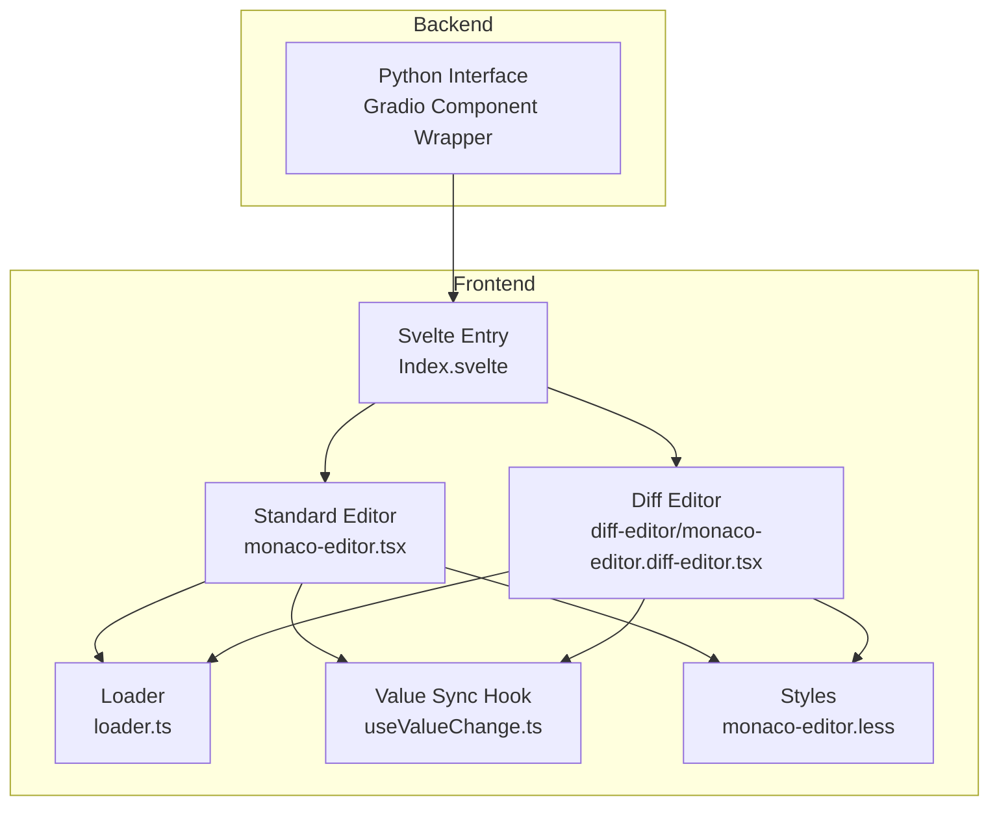
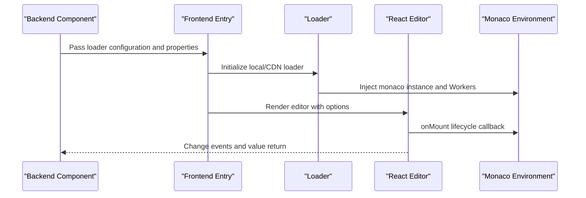
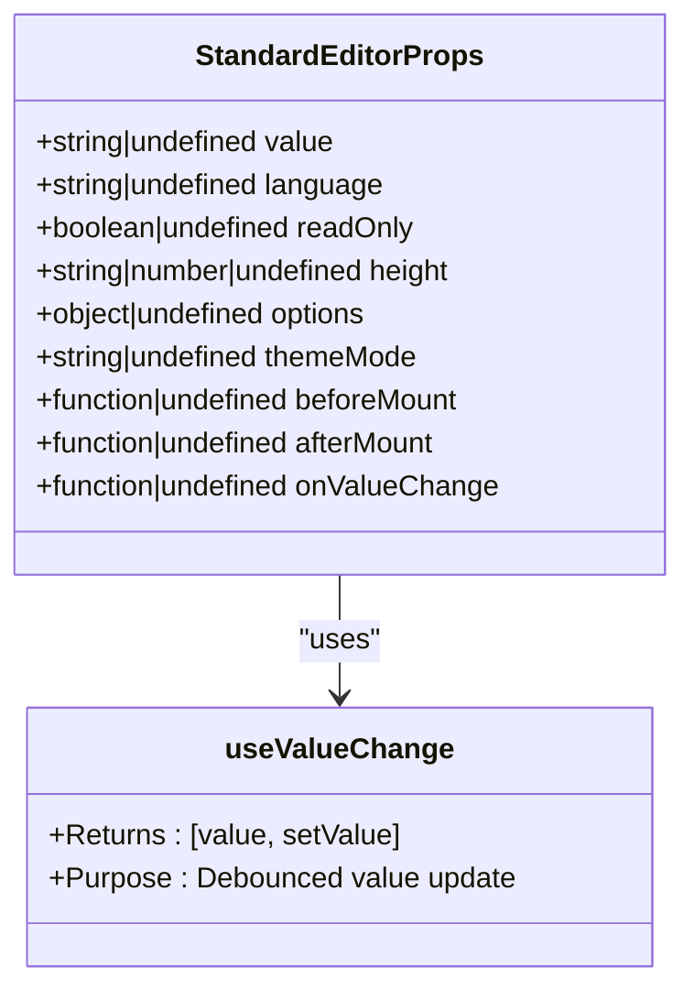
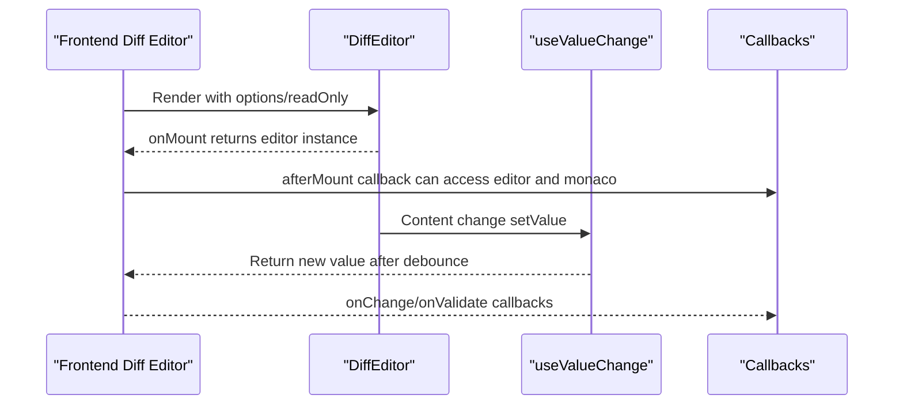
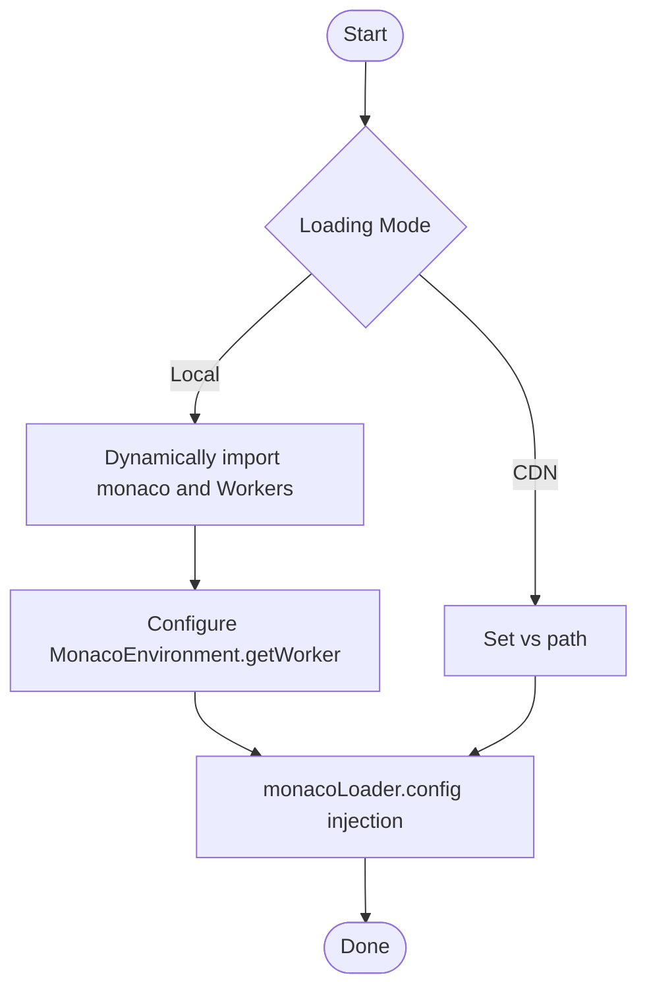
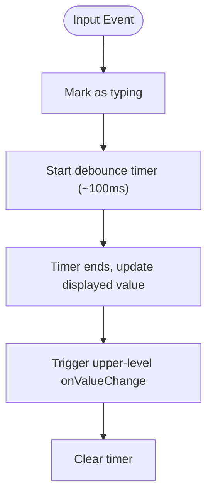
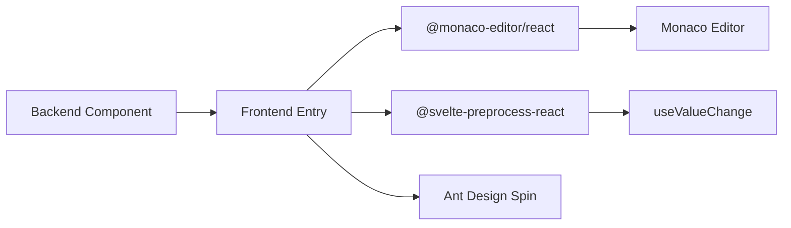

# MonacoEditor

<cite>
**Files Referenced in This Document**
- [backend/modelscope_studio/components/pro/monaco_editor/__init__.py](file://backend/modelscope_studio/components/pro/monaco_editor/__init__.py)
- [backend/modelscope_studio/components/pro/monaco_editor/diff_editor/__init__.py](file://backend/modelscope_studio/components/pro/monaco_editor/diff_editor/__init__.py)
- [backend/modelscope_studio/components/pro/components.py](file://backend/modelscope_studio/components/pro/components.py)
- [frontend/pro/monaco-editor/monaco-editor.tsx](file://frontend/pro/monaco-editor/monaco-editor.tsx)
- [frontend/pro/monaco-editor/diff-editor/monaco-editor.diff-editor.tsx](file://frontend/pro/monaco-editor/diff-editor/monaco-editor.diff-editor.tsx)
- [frontend/pro/monaco-editor/loader.ts](file://frontend/pro/monaco-editor/loader.ts)
- [frontend/pro/monaco-editor/useValueChange.ts](file://frontend/pro/monaco-editor/useValueChange.ts)
- [frontend/pro/monaco-editor/monaco-editor.less](file://frontend/pro/monaco-editor/monaco-editor.less)
- [docs/components/pro/monaco_editor/README.md](file://docs/components/pro/monaco_editor/README.md)
- [docs/components/pro/monaco_editor/README-zh_CN.md](file://docs/components/pro/monaco_editor/README-zh_CN.md)
</cite>

## Table of Contents

1. [Introduction](#introduction)
2. [Project Structure](#project-structure)
3. [Core Components](#core-components)
4. [Architecture Overview](#architecture-overview)
5. [Detailed Component Analysis](#detailed-component-analysis)
6. [Dependency Analysis](#dependency-analysis)
7. [Performance Considerations](#performance-considerations)
8. [Troubleshooting Guide](#troubleshooting-guide)
9. [Conclusion](#conclusion)
10. [Appendix](#appendix)

## Introduction

This document is intended for developers who need to integrate a professional code editor into their applications. It systematically introduces the code editing capabilities based on Monaco Editor: syntax highlighting, IntelliSense, code completion, Diff editor, and more. The document covers component configuration (editor options, JavaScript customization, diff editor, etc.), usage examples (support for different programming languages and custom configurations), the editor loading mechanism and performance optimization strategies, theme configuration, keyboard shortcut binding, and plugin extension approaches. The content balances technical depth with readability to help you quickly deliver a high-quality code editing experience.

## Project Structure

This component is built on a clearly layered frontend/backend architecture, using a hybrid approach of "Python backend + React frontend + Svelte preprocessing":

- The backend is wrapped as a Gradio component, providing a unified Python API and event bindings
- The frontend uses `@monaco-editor/react` as the rendering layer, combined with a local/CDN loader to initialize the Monaco environment
- Two forms are provided: a standard editor and a Diff editor, supporting theme switching, read-only mode, line positioning, and custom loading states

Diagram Sources

- [frontend/pro/monaco-editor/monaco-editor.tsx:1-95](file://frontend/pro/monaco-editor/monaco-editor.tsx#L1-L95)
- [frontend/pro/monaco-editor/diff-editor/monaco-editor.diff-editor.tsx:1-160](file://frontend/pro/monaco-editor/diff-editor/monaco-editor.diff-editor.tsx#L1-L160)
- [frontend/pro/monaco-editor/loader.ts:1-95](file://frontend/pro/monaco-editor/loader.ts#L1-L95)
- [frontend/pro/monaco-editor/useValueChange.ts:1-44](file://frontend/pro/monaco-editor/useValueChange.ts#L1-L44)
- [frontend/pro/monaco-editor/monaco-editor.less:1-7](file://frontend/pro/monaco-editor/monaco-editor.less#L1-L7)

Section Sources

- [backend/modelscope_studio/components/pro/monaco_editor/**init**.py:1-107](file://backend/modelscope_studio/components/pro/monaco_editor/__init__.py#L1-L107)
- [backend/modelscope_studio/components/pro/monaco_editor/diff_editor/**init**.py:68-105](file://backend/modelscope_studio/components/pro/monaco_editor/diff_editor/__init__.py#L68-L105)
- [backend/modelscope_studio/components/pro/components.py:1-8](file://backend/modelscope_studio/components/pro/components.py#L1-L8)

## Core Components

- **Standard Editor Component**: Provides basic code editing capabilities, supporting theme mode, read-only, height, loading state, event bindings, JavaScript customization hooks, etc.
- **Diff Editor Component (MonacoEditorDiffEditor)**: Used to compare the differences between two texts, with independent language settings for the left and right sides, line positioning, and validation callbacks.
  - **Backend export entry**: `MonacoEditorDiffEditor` is exported through [backend/modelscope_studio/components/pro/**init**.py](file://backend/modelscope_studio/components/pro/__init__.py); import with `from modelscope_studio.components.pro import MonacoEditorDiffEditor`
  - **Relationship with the standard editor**: `MonacoEditorDiffEditor` is a sub-component of `MonacoEditor`, both belonging to the `pro` module. The standard editor is for single-file editing; the diff editor is specifically for displaying a diff comparison between two versions of code.
- **Loader**: Supports both local bundling and CDN loading modes, automatically injecting the Monaco environment and multi-language Workers
- **Value sync hook**: Performs debouncing for high-frequency input scenarios to avoid frequently triggering upper-level logic

Section Sources

- [backend/modelscope_studio/components/pro/monaco_editor/**init**.py:16-107](file://backend/modelscope_studio/components/pro/monaco_editor/__init__.py#L16-L107)
- [backend/modelscope_studio/components/pro/monaco_editor/diff_editor/**init**.py:68-105](file://backend/modelscope_studio/components/pro/monaco_editor/diff_editor/__init__.py#L68-L105)
- [frontend/pro/monaco-editor/monaco-editor.tsx:12-95](file://frontend/pro/monaco-editor/monaco-editor.tsx#L12-L95)
- [frontend/pro/monaco-editor/diff-editor/monaco-editor.diff-editor.tsx:19-160](file://frontend/pro/monaco-editor/diff-editor/monaco-editor.diff-editor.tsx#L19-L160)
- [frontend/pro/monaco-editor/loader.ts:27-95](file://frontend/pro/monaco-editor/loader.ts#L27-L95)
- [frontend/pro/monaco-editor/useValueChange.ts:4-44](file://frontend/pro/monaco-editor/useValueChange.ts#L4-L44)

## Architecture Overview

The overall call chain is as follows:

- The backend component instantiation sets loader mode, language, read-only, height, and other parameters
- The frontend entry initializes the Monaco environment (local or CDN) based on the loader configuration
- The React layer renders the editor via `@monaco-editor/react`, bridging lifecycle hooks and events
- Value changes are debounced by `useValueChange` to ensure performance and consistency

Diagram Sources

- [frontend/pro/monaco-editor/loader.ts:3-95](file://frontend/pro/monaco-editor/loader.ts#L3-L95)
- [frontend/pro/monaco-editor/monaco-editor.tsx:38-92](file://frontend/pro/monaco-editor/monaco-editor.tsx#L38-L92)
- [frontend/pro/monaco-editor/diff-editor/monaco-editor.diff-editor.tsx:67-158](file://frontend/pro/monaco-editor/diff-editor/monaco-editor.diff-editor.tsx#L67-L158)

## Detailed Component Analysis

### Standard Editor Component

- **Responsibility**: Wraps Monaco Editor as a React component, providing a unified property interface and event bindings
- **Key features**:
  - Theme mode: Switches between `vs-dark` or `light` based on `themeMode`
  - Read-only mode: Controlled via `readOnly`
  - Height control: `height` supports numeric values (px) and CSS strings
  - Loading state: Supports custom loading slots or default Spin
  - Event bindings: Supports `mount` / `change` / `validate` and other events
  - JavaScript customization: `before_mount`/`after_mount` accept JS string functions to execute before/after loading
  - Value sync: Internally uses `useValueChange` for debouncing to avoid performance issues from high-frequency input

Diagram Sources

- [frontend/pro/monaco-editor/monaco-editor.tsx:12-95](file://frontend/pro/monaco-editor/monaco-editor.tsx#L12-L95)
- [frontend/pro/monaco-editor/useValueChange.ts:4-44](file://frontend/pro/monaco-editor/useValueChange.ts#L4-L44)

Section Sources

- [frontend/pro/monaco-editor/monaco-editor.tsx:12-95](file://frontend/pro/monaco-editor/monaco-editor.tsx#L12-L95)
- [frontend/pro/monaco-editor/monaco-editor.less:1-7](file://frontend/pro/monaco-editor/monaco-editor.less#L1-L7)
- [backend/modelscope_studio/components/pro/monaco_editor/**init**.py:16-107](file://backend/modelscope_studio/components/pro/monaco_editor/__init__.py#L16-L107)

### Diff Editor Component

- **Responsibility**: Compares differences between two texts, with independent language settings for left/right sides, line positioning, read-only, and validation callbacks
- **Key features**:
  - Left and right values: `original` (left original value), `value`/`modified` (right modified value)
  - Independent language settings: `original_language` and `modified_language` can be set independently
  - Line positioning: `line` specifies the initial visible line, with runtime update support
  - Validation callback: `onValidate` retrieves validation results for easy integration with error markers
  - Event binding: `onChange` fires when the right editor content changes
  - Loading state: Supports custom loading slots or default Spin

Diagram Sources

- [frontend/pro/monaco-editor/diff-editor/monaco-editor.diff-editor.tsx:35-159](file://frontend/pro/monaco-editor/diff-editor/monaco-editor.diff-editor.tsx#L35-L159)

Section Sources

- [frontend/pro/monaco-editor/diff-editor/monaco-editor.diff-editor.tsx:19-160](file://frontend/pro/monaco-editor/diff-editor/monaco-editor.diff-editor.tsx#L19-L160)
- [backend/modelscope_studio/components/pro/monaco_editor/diff_editor/**init**.py:68-105](file://backend/modelscope_studio/components/pro/monaco_editor/diff_editor/__init__.py#L68-L105)

### Loader and Environment Initialization

- **Local loading (recommended for offline/intranet deployment)**
  - Dynamically imports `monaco-editor` and various language Workers
  - Sets `MonacoEnvironment.getWorker` to select the corresponding Worker by label
  - Injects the monaco instance via `monacoLoader.config`
- **CDN loading**
  - Specifies the `vs` path via `monacoLoader.config`
  - Suitable for scenarios where external network access is available
- **Concurrent initialization**
  - Uses a global Promise to avoid duplicate initialization
  - Supports safe completion callbacks for multiple calls

Diagram Sources

- [frontend/pro/monaco-editor/loader.ts:27-95](file://frontend/pro/monaco-editor/loader.ts#L27-L95)

Section Sources

- [frontend/pro/monaco-editor/loader.ts:3-95](file://frontend/pro/monaco-editor/loader.ts#L3-L95)

### Value Sync and Debounce Strategy

- **Scenario**: High-frequency `onChange` triggered from the editor; upper-level logic may be expensive
- **Strategy**: `useValueChange` merges updates within a short time window and returns the latest value only after the debounce period ends
- **Behavior**: Manages typing state and timers to ensure a smooth experience during input

Diagram Sources

- [frontend/pro/monaco-editor/useValueChange.ts:14-32](file://frontend/pro/monaco-editor/useValueChange.ts#L14-L32)

Section Sources

- [frontend/pro/monaco-editor/useValueChange.ts:4-44](file://frontend/pro/monaco-editor/useValueChange.ts#L4-L44)

## Dependency Analysis

- **Component exports**
  - Backend exports both the standard editor and diff editor classes
- **Frontend dependencies**
  - `@monaco-editor/react`: Editor rendering and event bridging
  - `@svelte-preprocess-react`: Svelte and React interoperability
  - Ant Design Spin: Default loading state component
  - `useValueChange`: Custom hook for value sync and debouncing
- **External interfaces**
  - Monaco Editor official types and API
  - Gradio event listening and property forwarding

Diagram Sources

- [backend/modelscope_studio/components/pro/components.py:1-8](file://backend/modelscope_studio/components/pro/components.py#L1-L8)
- [frontend/pro/monaco-editor/monaco-editor.tsx:1-10](file://frontend/pro/monaco-editor/monaco-editor.tsx#L1-L10)
- [frontend/pro/monaco-editor/diff-editor/monaco-editor.diff-editor.tsx:1-17](file://frontend/pro/monaco-editor/diff-editor/monaco-editor.diff-editor.tsx#L1-L17)

Section Sources

- [backend/modelscope_studio/components/pro/components.py:1-8](file://backend/modelscope_studio/components/pro/components.py#L1-L8)

## Performance Considerations

- **Debounced updates**: `useValueChange` merges high-frequency changes to reduce processing pressure on the upper layer
- **On-demand loading**: CDN mode loads only necessary resources; local mode selects Workers by label to avoid overhead from irrelevant language parsing
- **Rendering isolation**: The editor container has independent styles to prevent global style pollution
- **Event minimization**: `onChange`/`validate` fires only when necessary to avoid unnecessary re-renders
- **Line positioning**: The Diff editor supports the `line` parameter to avoid full-page scroll searching

## Troubleshooting Guide

- **Editor not loading**
  - Check whether loader initialization is complete (local/CDN)
  - Confirm that `monacoLoader.config` is correctly set
- **Worker loading failed**
  - Verify Worker import paths match the labels (json/css/html/typescript/javascript)
  - If using CDN, confirm the `vs` path is accessible
- **Input lag**
  - Check whether `onChange` subscriptions are too frequent; use the debounce strategy
  - Reduce complexity: disable unnecessary syntax highlighting/autocomplete options
- **Diff editor not showing differences**
  - Confirm that `original` and `modified` values are correctly passed in
  - Check whether language settings are consistent or independently configured
- **Theme not applied**
  - Confirm `themeMode` and Monaco theme mapping (`dark` → `vs-dark`, `light` → `light`)

Section Sources

- [frontend/pro/monaco-editor/loader.ts:53-78](file://frontend/pro/monaco-editor/loader.ts#L53-L78)
- [frontend/pro/monaco-editor/monaco-editor.tsx:83-88](file://frontend/pro/monaco-editor/monaco-editor.tsx#L83-L88)
- [frontend/pro/monaco-editor/diff-editor/monaco-editor.diff-editor.tsx:127-153](file://frontend/pro/monaco-editor/diff-editor/monaco-editor.diff-editor.tsx#L127-L153)

## Conclusion

This component uses Gradio as the backend interface, combined with `@monaco-editor/react` and a custom loader, to provide stable and extensible code editing capabilities. Through local/CDN dual-mode loading, debounced value sync, theme and read-only control, and Diff comparison features, it meets the requirements of most application scenarios. It is recommended to prefer local loading in production for improved stability, and to configure languages, Workers, and editor options appropriately for your use case to achieve the best performance and user experience.

## Appendix

### Configuration Quick Reference (Standard Editor)

- `value`: Initial editor value
- `language`: Editor language (supports all Monaco base languages)
- `read_only`: Whether read-only
- `height`: Height (number = px, string = CSS unit)
- `options`: Editor constructor options (see Monaco official types)
- `theme_mode`: Theme mode (dark/light)
- `before_mount`/`after_mount`: JS string functions executed before/after loading
- `loading`: Loading text or custom loading slot
- `on_value_change`: Value change callback

Section Sources

- [docs/components/pro/monaco_editor/README.md:48-64](file://docs/components/pro/monaco_editor/README.md#L48-L64)
- [docs/components/pro/monaco_editor/README-zh_CN.md:48-64](file://docs/components/pro/monaco_editor/README-zh_CN.md#L48-L64)

### Configuration Quick Reference (Diff Editor)

- `value`: Right modified value (alternative to `modified`)
- `original`: Left original value
- `language`: Unified language (if not set independently)
- `original_language`: Left side language
- `modified_language`: Right side language
- `line`: Initial visible line
- `read_only`: Whether read-only
- `options`: Editor constructor options
- `before_mount`/`after_mount`: JS string functions
- `loading`: Loading text or custom loading slot
- `on_change`: Right side content change callback
- `on_validate`: Validation callback

Section Sources

- [docs/components/pro/monaco_editor/README.md:48-64](file://docs/components/pro/monaco_editor/README.md#L48-L64)
- [docs/components/pro/monaco_editor/README-zh_CN.md:48-64](file://docs/components/pro/monaco_editor/README-zh_CN.md#L48-L64)
