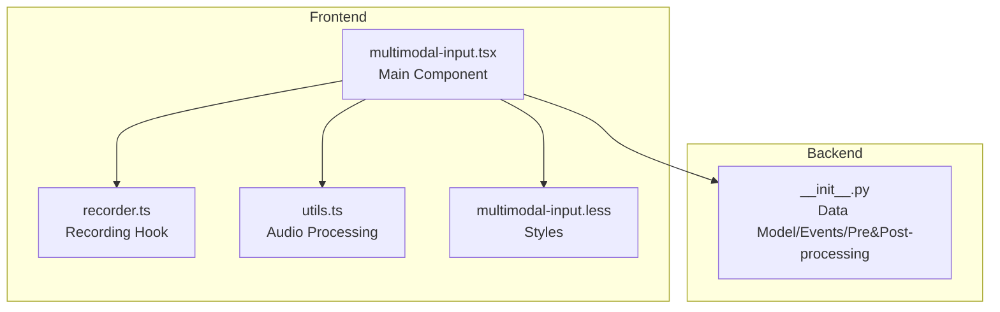
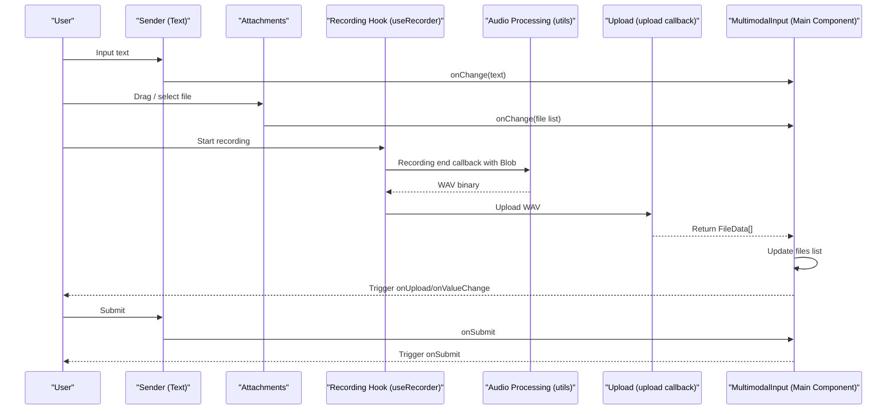
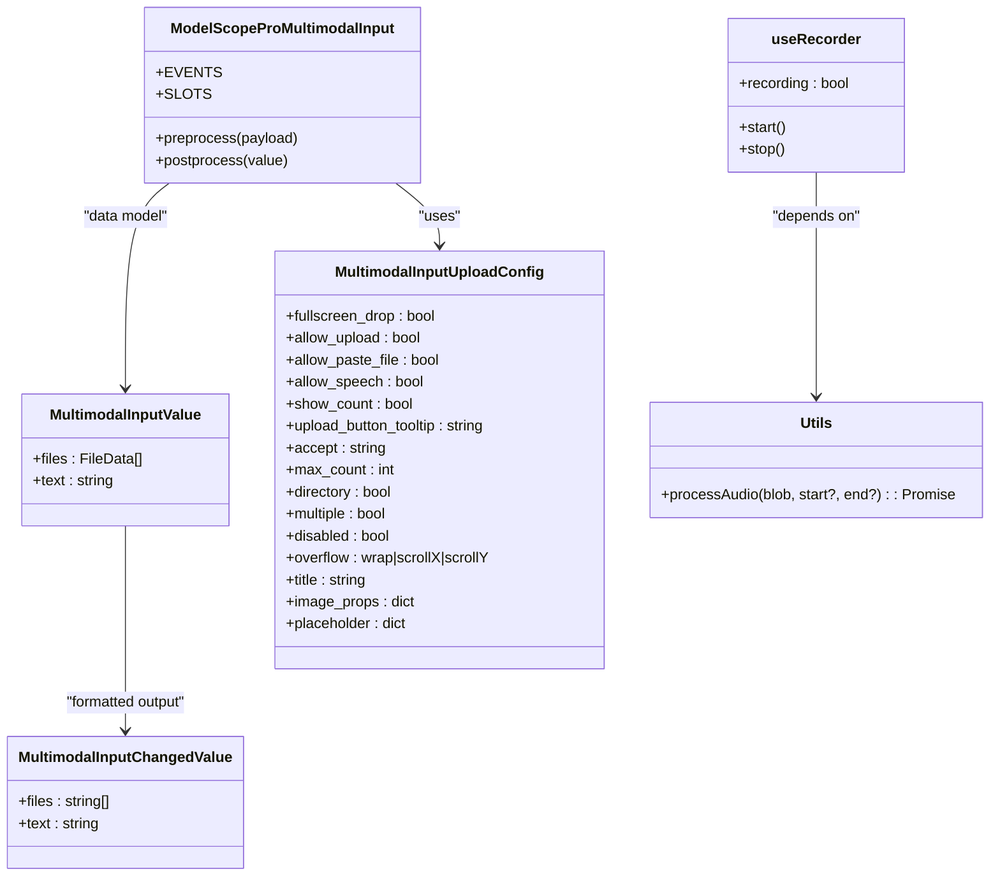
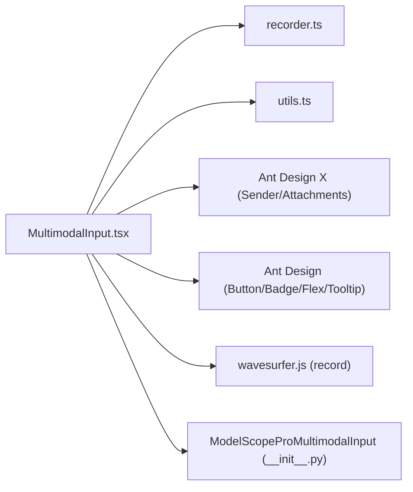

# Component Overview

<cite>
**Files Referenced in This Document**
- [multimodal-input.tsx](file://frontend/pro/multimodal-input/multimodal-input.tsx)
- [recorder.ts](file://frontend/pro/multimodal-input/recorder.ts)
- [utils.ts](file://frontend/pro/multimodal-input/utils.ts)
- [multimodal-input.less](file://frontend/pro/multimodal-input/multimodal-input.less)
- [__init__.py](file://backend/modelscope_studio/components/pro/multimodal_input/__init__.py)
- [README.md](file://docs/components/pro/multimodal_input/README.md)
- [upload_config.py](file://docs/components/pro/multimodal_input/demos/upload_config.py)
- [basic.py](file://docs/components/pro/multimodal_input/demos/basic.py)
</cite>

## Table of Contents

1. [Introduction](#introduction)
2. [Project Structure](#project-structure)
3. [Core Components](#core-components)
4. [Architecture Overview](#architecture-overview)
5. [Detailed Component Analysis](#detailed-component-analysis)
6. [Dependency Analysis](#dependency-analysis)
7. [Performance Considerations](#performance-considerations)
8. [Troubleshooting Guide](#troubleshooting-guide)
9. [Conclusion](#conclusion)
10. [Appendix](#appendix)

## Introduction

MultimodalInput is a multimodal input component based on Ant Design X, supporting text input, image upload, audio recording, file drag-and-drop, and other input modes. It has significant value in machine learning and conversational applications: it can carry natural language instructions as well as receive multimedia data such as images and audio, making it easy to build richer interaction experiences and multimodal model training/inference pipelines.

Component design philosophy:

- Uses "text + file" as the core data model, uniformly exposing `value` and change events externally.
- Based on the combination of Ant Design X's `Sender` and `Attachments`, providing a consistent input and attachment management experience.
- Supports `inline`/`block` two rendering modes to adapt to different layout requirements.
- Provides flexible upload configuration (type restrictions, quantity limits, paste upload, fullscreen drag, etc.) and pluggable recording capability.

## Project Structure

MultimodalInput adopts a React + Svelte Preprocess bridging approach on the frontend, and interfaces with the Python environment via Gradio data classes and event bindings on the backend. Core file distribution:

- **Frontend**: `multimodal-input.tsx` (main component), `recorder.ts` (recording hook), `utils.ts` (audio processing), `multimodal-input.less` (styles)
- **Backend**: `__init__.py` (data model, events, pre/post-processing)
- **Documentation and examples**: `README.md` (API description), example scripts in `demos`

**Diagram Sources**

- [multimodal-input.tsx:1-619](file://frontend/pro/multimodal-input/multimodal-input.tsx#L1-L619)
- [recorder.ts:1-48](file://frontend/pro/multimodal-input/recorder.ts#L1-L48)
- [utils.ts:1-127](file://frontend/pro/multimodal-input/utils.ts#L1-L127)
- [multimodal-input.less:1-13](file://frontend/pro/multimodal-input/multimodal-input.less#L1-L13)
- [**init**.py:1-259](file://backend/modelscope_studio/components/pro/multimodal_input/__init__.py#L1-L259)

**Section Sources**

- [multimodal-input.tsx:1-619](file://frontend/pro/multimodal-input/multimodal-input.tsx#L1-L619)
- [**init**.py:1-259](file://backend/modelscope_studio/components/pro/multimodal_input/__init__.py#L1-L259)

## Core Components

- **Main component**: `MultimodalInput` (React-wrapped Svelte component), responsible for text input, attachment panel, record button, submit/cancel, and other interactions.
- **Recording hook**: `useRecorder`, encapsulates recording start/stop and state management, and callbacks the generated audio Blob when recording ends.
- **Audio processing**: `processAudio`/`process_audio`, converts recordings to WAV format and returns binary data.
- **Data model**: `MultimodalInputValue` (files/text), `MultimodalInputUploadConfig` (upload configuration).
- **Backend component**: `ModelScopeProMultimodalInput`, defines events, slots, pre/post-processing logic, and default upload configuration.

**Section Sources**

- [multimodal-input.tsx:32-104](file://frontend/pro/multimodal-input/multimodal-input.tsx#L32-L104)
- [recorder.ts:6-47](file://frontend/pro/multimodal-input/recorder.ts#L6-L47)
- [utils.ts:60-126](file://frontend/pro/multimodal-input/utils.ts#L60-L126)
- [**init**.py:18-79](file://backend/modelscope_studio/components/pro/multimodal_input/__init__.py#L18-L79)
- [**init**.py:82-259](file://backend/modelscope_studio/components/pro/multimodal_input/__init__.py#L82-L259)

## Architecture Overview

MultimodalInput integrates "text input + attachment upload + audio recording" into a unified data flow:

- **Input layer**: `Sender` handles text input; the attachment panel is provided by `Attachments`.
- **Capture layer**: Recording is implemented via wavesurfer.js + record plugin; after completion it converts to WAV and triggers upload.
- **Upload layer**: Calls the external `upload` callback to write files to the backend and returns a `FileData` list to update the internal file list.
- **Event layer**: Events such as `onChange`/`onSubmit`/`onUpload`/`onRemove`/`onPasteFile` run through the entire flow, making it easy for upstream business logic to subscribe.

**Diagram Sources**

- [multimodal-input.tsx:157-169](file://frontend/pro/multimodal-input/multimodal-input.tsx#L157-L169)
- [utils.ts:94-126](file://frontend/pro/multimodal-input/utils.ts#L94-L126)
- [multimodal-input.tsx:181-246](file://frontend/pro/multimodal-input/multimodal-input.tsx#L181-L246)
- [multimodal-input.tsx:336-360](file://frontend/pro/multimodal-input/multimodal-input.tsx#L336-L360)

## Detailed Component Analysis

### Component Interface and Data Model

- `MultimodalInputValue`: Contains two fields, `files` (file array) and `text` (text), serving as the component's value object.
- `MultimodalInputChangedValue`: The externally exposed change value; `files` is an array of string paths, `text` is a string.
- `MultimodalInputUploadConfig`: Upload-related configuration items, such as `accept`, `max_count`, `allow_speech`, `allow_paste_file`, `fullscreen_drop`, `multiple`, `directory`, `overflow`, `title`, `image_props`, `placeholder`, etc.

**Section Sources**

- [multimodal-input.tsx:32-66](file://frontend/pro/multimodal-input/multimodal-input.tsx#L32-L66)
- [multimodal-input.tsx:42-57](file://frontend/pro/multimodal-input/multimodal-input.tsx#L42-L57)
- [**init**.py:18-79](file://backend/modelscope_studio/components/pro/multimodal_input/__init__.py#L18-L79)

### Rendering Modes and Slots

- `mode`: Two modes, `inline` and `block`. In block mode, the input area is separated from the send/loading button; the footer provides an extra operations area and action area.
- `slots`: Supports `suffix`/`header`/`prefix`/`footer` and `skill.*` series slots for extending UI with skill prompts, close icons, etc.

**Section Sources**

- [multimodal-input.tsx:86-104](file://frontend/pro/multimodal-input/multimodal-input.tsx#L86-L104)
- [multimodal-input.tsx:426-457](file://frontend/pro/multimodal-input/multimodal-input.tsx#L426-L457)
- [**init**.py:139-143](file://backend/modelscope_studio/components/pro/multimodal_input/__init__.py#L139-L143)

### Upload and File Management

- **Upload entry**: Writes files to the backend via the `upload` callback, returns a `FileData` list, and merges into the current file list.
- **Restriction strategy**: Supports `max_count` for single-file replacement or batch appending; supports `multiple`/`directory`/`fullscreen_drop`, etc.
- **Event callbacks**: `onUpload`/`onRemove`/`onPreview`/`onDownload`/`onDrop`, etc., for upstream handling of download/preview/remove behaviors.

**Section Sources**

- [multimodal-input.tsx:181-246](file://frontend/pro/multimodal-input/multimodal-input.tsx#L181-L246)
- [multimodal-input.tsx:511-602](file://frontend/pro/multimodal-input/multimodal-input.tsx#L511-L602)
- [**init**.py:111-135](file://backend/modelscope_studio/components/pro/multimodal_input/__init__.py#L111-L135)

### Recording and Audio Processing

- **Recording hook**: `useRecorder` provides `recording` state and `start`/`stop` methods, with a callback for the Blob when recording ends.
- **Audio processing**: `processAudio` decodes the Blob to an `AudioBuffer`, trims as needed, converts to a WAV byte stream, and wraps as a `File` object to trigger upload.

**Section Sources**

- [recorder.ts:6-47](file://frontend/pro/multimodal-input/recorder.ts#L6-L47)
- [utils.ts:94-126](file://frontend/pro/multimodal-input/utils.ts#L94-L126)
- [multimodal-input.tsx:157-169](file://frontend/pro/multimodal-input/multimodal-input.tsx#L157-L169)

### Events and Lifecycle

- **Events**: `change`/`submit`/`cancel`/`key_down`/`key_press`/`focus`/`blur`/`upload`/`paste`/`paste_file`/`skill_closable_close`/`drop`/`download`/`preview`/`remove`
- **Lifecycle**: The component internally maintains `value` and `fileList`; callbacks such as `onChange`/`onSubmit`/`onUpload`/`onRemove` chain together frontend-backend interactions.

**Section Sources**

- [**init**.py:86-135](file://backend/modelscope_studio/components/pro/multimodal_input/__init__.py#L86-L135)
- [multimodal-input.tsx:336-360](file://frontend/pro/multimodal-input/multimodal-input.tsx#L336-L360)
- [multimodal-input.tsx:511-602](file://frontend/pro/multimodal-input/multimodal-input.tsx#L511-L602)

### Class Diagram (Code Level)

**Diagram Sources**

- [multimodal-input.tsx:32-66](file://frontend/pro/multimodal-input/multimodal-input.tsx#L32-L66)
- [multimodal-input.tsx:42-57](file://frontend/pro/multimodal-input/multimodal-input.tsx#L42-L57)
- [**init**.py:18-79](file://backend/modelscope_studio/components/pro/multimodal_input/__init__.py#L18-L79)
- [**init**.py:82-259](file://backend/modelscope_studio/components/pro/multimodal_input/__init__.py#L82-L259)
- [recorder.ts:6-47](file://frontend/pro/multimodal-input/recorder.ts#L6-L47)
- [utils.ts:94-126](file://frontend/pro/multimodal-input/utils.ts#L94-L126)

## Dependency Analysis

- **Frontend dependencies**: `@ant-design/x` (Sender/Attachments), Ant Design (Button/Badge/Flex/Tooltip), wavesurfer.js (recording), lodash-es (utility functions).
- **Backend dependencies**: gradio/gradio_client, `gradio.data_classes` (FileData/ListFiles), `typing_extensions` (Literal).
- **Component coupling**: The main component is loosely coupled with the recording hook and audio processing module; decoupled from the backend via the `upload` callback.

**Diagram Sources**

- [multimodal-input.tsx:1-26](file://frontend/pro/multimodal-input/multimodal-input.tsx#L1-L26)
- [recorder.ts:1-4](file://frontend/pro/multimodal-input/recorder.ts#L1-L4)
- [utils.ts:1-4](file://frontend/pro/multimodal-input/utils.ts#L1-L4)
- [**init**.py:1-15](file://backend/modelscope_studio/components/pro/multimodal_input/__init__.py#L1-L15)

**Section Sources**

- [multimodal-input.tsx:1-26](file://frontend/pro/multimodal-input/multimodal-input.tsx#L1-L26)
- [**init**.py:1-15](file://backend/modelscope_studio/components/pro/multimodal_input/__init__.py#L1-L15)

## Performance Considerations

- **Upload concurrency and progress**: The component sets `uploading` state during upload to avoid repeated uploads; limit with `max_count` to reduce memory usage.
- **Audio processing**: Decode and trim after recording ends; use caution when enabling `allow_speech` on mobile to avoid memory pressure from long recordings.
- **DOM and rendering**: In block mode, footer is rendered separately to reduce unnecessary reflows; upload count is only shown when the panel is closed to reduce visual noise.
- **Event throttling**: Callbacks like `onValueChange`/`onSubmit` are triggered on demand to avoid frequent re-renders.

## Troubleshooting Guide

- **Cannot upload files**:
  - Check whether the `upload` callback is correctly implemented and returns a `FileData` array
  - Confirm that `uploadConfig`'s `accept`/`max_count`/`multiple`/`directory` match the actual files
- **Recording unresponsive**:
  - Confirm the browser allows microphone permission; check if the recording container is mounted successfully
  - If upload is not triggered after recording ends, check the `onStop` callback and `processAudio` flow
- **File list anomalies**:
  - Note that `maxCount=1` will replace the current file; ensure the limit is not exceeded for multi-file uploads
  - After removing files, value must be updated synchronously; confirm `onRemove`/`onValueChange` is called
- **Events not triggered**:
  - Confirm the component has bound the corresponding event listeners (such as `change`/`submit`/`upload`, etc.)

**Section Sources**

- [multimodal-input.tsx:178-180](file://frontend/pro/multimodal-input/multimodal-input.tsx#L178-L180)
- [multimodal-input.tsx:181-246](file://frontend/pro/multimodal-input/multimodal-input.tsx#L181-L246)
- [multimodal-input.tsx:511-602](file://frontend/pro/multimodal-input/multimodal-input.tsx#L511-L602)
- [recorder.ts:24-41](file://frontend/pro/multimodal-input/recorder.ts#L24-L41)
- [utils.ts:94-126](file://frontend/pro/multimodal-input/utils.ts#L94-L126)

## Conclusion

MultimodalInput integrates text, image, audio, and file drag-and-drop multimodal input capabilities into a single component with a concise interface and strong extensibility. Its clear event system and flexible upload configuration make it very suitable for use in conversational bots, multimodal evaluation platforms, intelligent customer service, and other scenarios. For first-time users, it is recommended to start with the basic examples, gradually explore upload configuration and recording capabilities, and complete end-to-end integration using the backend `upload` callback.

## Appendix

### Usage Examples and Core Configuration

- **Basic usage**: Refer to example scripts to create a `MultimodalInput` and bind the `submit` event.
- **Upload configuration**: Use `MultimodalInputUploadConfig` to set `accept`, `max_count`, `fullscreen_drop`, `multiple`, `directory`, `allow_speech`, `allow_paste_file`, `title`, `placeholder`, etc.
- **Block mode**: With `mode="block"`, the input area is separated from the send/loading button; the `footer` provides an extra operations and action area.

**Section Sources**

- [basic.py:1-17](file://docs/components/pro/multimodal_input/demos/basic.py#L1-L17)
- [upload_config.py:1-38](file://docs/components/pro/multimodal_input/demos/upload_config.py#L1-L38)
- [README.md:27-119](file://docs/components/pro/multimodal_input/README.md#L27-L119)
