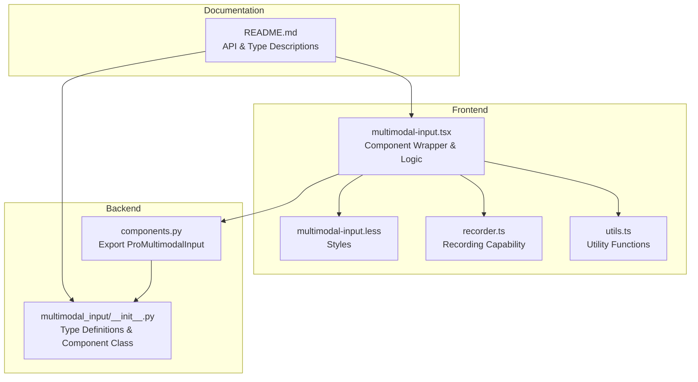
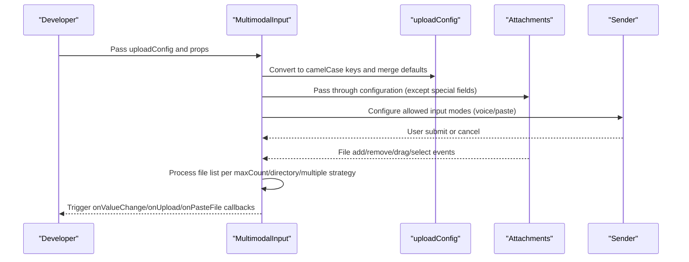
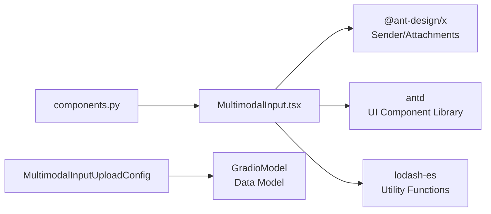

# Configuration Options

<cite>
**Files Referenced in This Document**
- [multimodal-input.tsx](file://frontend/pro/multimodal-input/multimodal-input.tsx)
- [README.md](file://docs/components/pro/multimodal_input/README.md)
- [components.py](file://backend/modelscope_studio/components/pro/components.py)
</cite>

## Table of Contents

1. [Introduction](#introduction)
2. [Project Structure](#project-structure)
3. [Core Components](#core-components)
4. [Architecture Overview](#architecture-overview)
5. [Detailed Component Analysis](#detailed-component-analysis)
6. [Dependency Analysis](#dependency-analysis)
7. [Performance Considerations](#performance-considerations)
8. [Troubleshooting Guide](#troubleshooting-guide)
9. [Conclusion](#conclusion)
10. [Appendix](#appendix)

## Introduction

This document is aimed at developers and systematically covers the configuration options of the MultimodalInput component, with a focus on analyzing all parameters of the `MultimodalInputUploadConfig` class: `fullscreen_drop`, `allow_upload`, `allow_paste_file`, `allow_speech`, `show_count`, `accept`, `max_count`, `directory`, `multiple`, `disabled`, `overflow`, `image_props`, `placeholder`, `title`, `upload_button_tooltip`, etc. The document explains the purpose, default value, and typical use case for each configuration option, provides path references for real examples of various configuration combinations, and helps you quickly complete customized development.

## Project Structure

The MultimodalInput component consists of a frontend Svelte/React wrapper layer and a backend Gradio data model. Documentation and examples are in the `docs` directory, component source code is in `frontend/pro/multimodal-input`, and backend type definitions are in `backend/modelscope_studio/components/pro/multimodal_input`.

**Diagram Sources**

- [multimodal-input.tsx:1-619](file://frontend/pro/multimodal-input/multimodal-input.tsx#L1-L619)
- [components.py:1-8](file://backend/modelscope_studio/components/pro/components.py#L1-L8)
- [README.md:1-119](file://docs/components/pro/multimodal_input/README.md#L1-L119)

**Section Sources**

- [multimodal-input.tsx:1-619](file://frontend/pro/multimodal-input/multimodal-input.tsx#L1-L619)
- [components.py:1-8](file://backend/modelscope_studio/components/pro/components.py#L1-L8)
- [README.md:1-119](file://docs/components/pro/multimodal_input/README.md#L1-L119)

## Core Components

- **`MultimodalInputUploadConfig`**: Configures the behavior and appearance of the file upload area, including accepted types, quantity limits, directory upload, multi-select, disabled state, overflow behavior, placeholder information, title, image properties, etc.
- **`MultimodalInput`**: Based on the combination of Ant Design X's Sender and Attachments, supports text input, file upload, voice recording, paste files, and other capabilities; controls upload area behavior via `uploadConfig`.

**Section Sources**

- [multimodal-input.tsx:42-57](file://frontend/pro/multimodal-input/multimodal-input.tsx#L42-L57)
- [README.md:56-118](file://docs/components/pro/multimodal_input/README.md#L56-L118)

## Architecture Overview

MultimodalInput converts the externally passed `uploadConfig` to an internally usable configuration object, passes it to the `Attachments` component, and controls feature enabled states based on switches like `allowUpload`/`allowSpeech`/`allowPasteFile`. During the upload process, file collection merging and deduplication are performed according to `maxCount` and directory/multi-select strategies.

**Diagram Sources**

- [multimodal-input.tsx:174-177](file://frontend/pro/multimodal-input/multimodal-input.tsx#L174-L177)
- [multimodal-input.tsx:466-478](file://frontend/pro/multimodal-input/multimodal-input.tsx#L466-L478)
- [multimodal-input.tsx:282-284](file://frontend/pro/multimodal-input/multimodal-input.tsx#L282-L284)

**Section Sources**

- [multimodal-input.tsx:174-177](file://frontend/pro/multimodal-input/multimodal-input.tsx#L174-L177)
- [multimodal-input.tsx:466-478](file://frontend/pro/multimodal-input/multimodal-input.tsx#L466-L478)
- [multimodal-input.tsx:282-284](file://frontend/pro/multimodal-input/multimodal-input.tsx#L282-L284)

## Detailed Component Analysis

### MultimodalInputUploadConfig Parameter Reference

All parameters below come from backend type definitions and frontend implementation mappings. Purposes and default values are based on documentation and source code.

- **`fullscreen_drop`**
  - Purpose: Whether to allow dragging files to the entire page window to trigger the attachment panel.
  - Default: `False`
  - Use case: When you need to open the attachment panel by releasing files anywhere on the page.
  - Implementation note: When enabled, `getDropContainer` returns `document.body`, expanding the drag range to global.
  - Reference: [multimodal-input.tsx:480-486](file://frontend/pro/multimodal-input/multimodal-input.tsx#L480-L486)

- **`allow_upload`**
  - Purpose: Whether to enable the upload area and file selection/drag features.
  - Default: `True`
  - Use case: Only need text input, don't want users to upload files.
  - Implementation note: Affects the availability of `allowSpeech`/`allowPasteFile` (both only work when `allowUpload` is true).
  - Reference: [multimodal-input.tsx:282-284](file://frontend/pro/multimodal-input/multimodal-input.tsx#L282-L284)

- **`allow_paste_file`**
  - Purpose: Whether to allow pasting files via clipboard.
  - Default: `True`
  - Use case: Improves convenience by allowing users to paste file content directly.
  - Implementation note: Controlled by `allow_upload`; if disabled, paste events are ignored.
  - Reference: [multimodal-input.tsx:352-360](file://frontend/pro/multimodal-input/multimodal-input.tsx#L352-L360)

- **`allow_speech`**
  - Purpose: Whether to enable voice input (microphone recording).
  - Default: `False`
  - Use case: Needed for speech-to-text or uploading audio files.
  - Implementation note: Only takes effect when `allowUpload` is true; upload is automatically triggered after recording ends.
  - References: [multimodal-input.tsx:317-333](file://frontend/pro/multimodal-input/multimodal-input.tsx#L317-L333), [multimodal-input.tsx:157-169](file://frontend/pro/multimodal-input/multimodal-input.tsx#L157-L169)

- **`show_count`**
  - Purpose: Whether to show a file count badge when the attachment panel is closed.
  - Default: `True`
  - Use case: Indicates the number of added files without expanding the panel.
  - Reference: [multimodal-input.tsx:288-294](file://frontend/pro/multimodal-input/multimodal-input.tsx#L288-L294)

- **`upload_button_tooltip`**
  - Purpose: Hover tooltip text for the upload button.
  - Default: None (empty string)
  - Use case: Provides additional description for the upload entry.
  - Reference: [multimodal-input.tsx:287-305](file://frontend/pro/multimodal-input/multimodal-input.tsx#L287-L305)

- **`accept`**
  - Purpose: Restricts the selectable file types (HTML input accept attribute semantics).
  - Default: `None`
  - Use case: Only allow images, documents, or specific format files.
  - Reference: [multimodal-input.tsx:466-478](file://frontend/pro/multimodal-input/multimodal-input.tsx#L466-L478)

- **`max_count`**
  - Purpose: Limits the total number of uploadable files; replaces the current file when set to 1.
  - Default: `None`
  - Use case: Single-file replacement upload (e.g., avatar), batch upload quota control.
  - Implementation note: Truncates valid file list based on remaining quota when adding/pasting/dragging.
  - References: [multimodal-input.tsx:187-204](file://frontend/pro/multimodal-input/multimodal-input.tsx#L187-L204), [multimodal-input.tsx:543-552](file://frontend/pro/multimodal-input/multimodal-input.tsx#L543-L552)

- **`directory`**
  - Purpose: Whether to support uploading entire directories (all files within a folder).
  - Default: `False`
  - Use case: Need to batch upload a directory structure.
  - Reference: [multimodal-input.tsx:466-478](file://frontend/pro/multimodal-input/multimodal-input.tsx#L466-L478)

- **`multiple`**
  - Purpose: Whether to allow multi-file selection (with Ctrl/Cmd multi-select).
  - Default: `False`
  - Use case: Need to select multiple files at once.
  - Reference: [multimodal-input.tsx:466-478](file://frontend/pro/multimodal-input/multimodal-input.tsx#L466-L478)

- **`disabled`**
  - Purpose: Globally disable the upload area and buttons.
  - Default: `False`
  - Use case: Read-only mode or waiting for conditions to be met before enabling.
  - Implementation note: `uploadDisabled` is computed from `disabled`/`loading`/`readOnly`/`uploading` combined.
  - Reference: [multimodal-input.tsx:178-179](file://frontend/pro/multimodal-input/multimodal-input.tsx#L178-L179)

- **`overflow`**
  - Purpose: Overflow behavior when the file list exceeds the display area (`wrap`/`scrollX`/`scrollY`).
  - Default: `None`
  - Use case: Display a large number of files in a limited space.
  - Reference: [multimodal-input.tsx:466-478](file://frontend/pro/multimodal-input/multimodal-input.tsx#L466-L478)

- **`image_props`**
  - Purpose: Configuration passed to the internal image preview component (same as Ant Design Image).
  - Default: `None`
  - Use case: Customize image zoom, load failure fallback, etc.
  - Reference: [multimodal-input.tsx:476-478](file://frontend/pro/multimodal-input/multimodal-input.tsx#L476-L478)

- **`placeholder`**
  - Purpose: Placeholder information when there are no files, supporting `inline` and `drop` shapes.
  - Default: Built-in values including `inline`/`title`/`description`/`icon` and `drop`/`title`.
  - Use case: Guide users to click/drag to upload.
  - References: [multimodal-input.tsx:488-507](file://frontend/pro/multimodal-input/multimodal-input.tsx#L488-L507), [README.md:103-112](file://docs/components/pro/multimodal_input/README.md#L103-L112)

- **`title`**
  - Purpose: Attachment panel title.
  - Default: `"Attachments"`
  - Use case: Localization or business-customized title.
  - References: [multimodal-input.tsx:461-461](file://frontend/pro/multimodal-input/multimodal-input.tsx#L461-L461), [README.md:101-101](file://docs/components/pro/multimodal_input/README.md#L101-L101)

**Section Sources**

- [multimodal-input.tsx:42-57](file://frontend/pro/multimodal-input/multimodal-input.tsx#L42-L57)
- [multimodal-input.tsx:174-507](file://frontend/pro/multimodal-input/multimodal-input.tsx#L174-L507)
- [README.md:56-118](file://docs/components/pro/multimodal_input/README.md#L56-L118)

### Configuration Combination Examples (Path References)

All examples below come from documentation and sample applications. Refer to the corresponding paths for complete implementations and results:

- **Basic example (with upload configuration)**:
  - Example path: [README.md:23-25](file://docs/components/pro/multimodal_input/README.md#L23-L25)

- **Upload configuration example (demonstrating multiple options)**:
  - Example path: [README.md:23-25](file://docs/components/pro/multimodal_input/README.md#L23-L25)

- **Integration with Chatbot example**:
  - Example path: [README.md:11-13](file://docs/components/pro/multimodal_input/README.md#L11-L13)

- **Block Mode**:
  - Example path: [README.md:19-21](file://docs/components/pro/multimodal_input/README.md#L19-L21)

- **Additional button configuration example**:
  - Example path: [README.md:15-17](file://docs/components/pro/multimodal_input/README.md#L15-L17)

- **Basic example**:
  - Example path: [README.md:7-9](file://docs/components/pro/multimodal_input/README.md#L7-L9)

**Section Sources**

- [README.md:7-25](file://docs/components/pro/multimodal_input/README.md#L7-L25)

## Dependency Analysis

- **Frontend dependencies**:
  - `@ant-design/x`: Sender and Attachments components provide input and attachment management capabilities.
  - `antd`: UI components such as Button, Badge, Flex, Tooltip for interface and interaction.
  - `lodash-es`: Utility functions (e.g., `omit`) for configuration and event handling.
- **Backend dependencies**:
  - `GradioModel`: Base class for `MultimodalInputUploadConfig` and `MultimodalInputValue` data models.
  - `components.py`: Exports `ProMultimodalInput` for use by upstream applications.

**Diagram Sources**

- [multimodal-input.tsx:1-26](file://frontend/pro/multimodal-input/multimodal-input.tsx#L1-L26)
- [components.py:1-8](file://backend/modelscope_studio/components/pro/components.py#L1-L8)
- [README.md:56-118](file://docs/components/pro/multimodal_input/README.md#L56-L118)

**Section Sources**

- [multimodal-input.tsx:1-26](file://frontend/pro/multimodal-input/multimodal-input.tsx#L1-L26)
- [components.py:1-8](file://backend/modelscope_studio/components/pro/components.py#L1-L8)
- [README.md:56-118](file://docs/components/pro/multimodal_input/README.md#L56-L118)

## Performance Considerations

- **File quantity and size**: Use `max_count` to control concurrency and storage pressure; for large files, consider chunked uploads or server-side validation.
- **Rendering and updates**: Optimize rendering and state sync with `useMemo` and `useValueChange` to avoid unnecessary re-renders.
- **Upload strategy**: Short-circuit the upload flow when `allowUpload=false` or `disabled`/`loading`/`readOnly` to reduce invalid requests.
- **Drag range**: `fullscreen_drop` sets the drag container to `document.body`; be aware of additional event overhead in complex pages.

**Section Sources**

- [multimodal-input.tsx:174-177](file://frontend/pro/multimodal-input/multimodal-input.tsx#L174-L177)
- [multimodal-input.tsx:178-179](file://frontend/pro/multimodal-input/multimodal-input.tsx#L178-L179)
- [multimodal-input.tsx:480-486](file://frontend/pro/multimodal-input/multimodal-input.tsx#L480-L486)

## Troubleshooting Guide

- **Cannot upload files**:
  - Check whether `allow_upload` is true; confirm `disabled`/`loading`/`readOnly`/`uploading` states.
  - Confirm `accept` and `multiple` settings meet expectations.
  - References: [multimodal-input.tsx:282-284](file://frontend/pro/multimodal-input/multimodal-input.tsx#L282-L284), [multimodal-input.tsx:178-179](file://frontend/pro/multimodal-input/multimodal-input.tsx#L178-L179), [multimodal-input.tsx:466-478](file://frontend/pro/multimodal-input/multimodal-input.tsx#L466-L478)

- **Paste file not working**:
  - Check whether `allow_paste_file` is true; ensure browser permissions and clipboard content is recognizable.
  - Reference: [multimodal-input.tsx:352-360](file://frontend/pro/multimodal-input/multimodal-input.tsx#L352-L360)

- **Voice input unavailable**:
  - Check `allow_speech` and `allow_upload`; confirm browser microphone permissions.
  - References: [multimodal-input.tsx:317-333](file://frontend/pro/multimodal-input/multimodal-input.tsx#L317-L333), [multimodal-input.tsx:282-284](file://frontend/pro/multimodal-input/multimodal-input.tsx#L282-L284)

- **File count exceeds limit**:
  - Check `max_count`; when set to 1 the current file will be replaced; when greater than 1, truncates based on remaining quota.
  - References: [multimodal-input.tsx:187-204](file://frontend/pro/multimodal-input/multimodal-input.tsx#L187-L204), [multimodal-input.tsx:543-552](file://frontend/pro/multimodal-input/multimodal-input.tsx#L543-L552)

- **Drag range is abnormal**:
  - When `fullscreen_drop` is true, the drag range extends to `document.body`; confirm page structure and event conflicts.
  - Reference: [multimodal-input.tsx:480-486](file://frontend/pro/multimodal-input/multimodal-input.tsx#L480-L486)

**Section Sources**

- [multimodal-input.tsx:178-179](file://frontend/pro/multimodal-input/multimodal-input.tsx#L178-L179)
- [multimodal-input.tsx:187-204](file://frontend/pro/multimodal-input/multimodal-input.tsx#L187-L204)
- [multimodal-input.tsx:282-284](file://frontend/pro/multimodal-input/multimodal-input.tsx#L282-L284)
- [multimodal-input.tsx:317-333](file://frontend/pro/multimodal-input/multimodal-input.tsx#L317-L333)
- [multimodal-input.tsx:352-360](file://frontend/pro/multimodal-input/multimodal-input.tsx#L352-L360)
- [multimodal-input.tsx:480-486](file://frontend/pro/multimodal-input/multimodal-input.tsx#L480-L486)
- [multimodal-input.tsx:543-552](file://frontend/pro/multimodal-input/multimodal-input.tsx#L543-L552)

## Conclusion

`MultimodalInputUploadConfig` provides comprehensive configuration capabilities from file types, quantities, directories, multi-select to upload area behavior and placeholder information. By reasonably combining parameters like `allow_upload`, `allow_speech`, `allow_paste_file`, `max_count`, `fullscreen_drop`, `accept`, `multiple`, `directory`, `disabled`, `overflow`, `image_props`, `placeholder`, `title`, and `upload_button_tooltip`, you can quickly adapt to various scenarios from simple text input to complex multimodal interaction. It is recommended to first clarify the business goal (single/multi-file, whether to allow directories, whether speech/paste is needed), then choose appropriate default values and overrides.

## Appendix

- **Related type definitions and default value references**:
  - [README.md:56-118](file://docs/components/pro/multimodal_input/README.md#L56-L118)
- **Component export and integration**:
  - [components.py:1-8](file://backend/modelscope_studio/components/pro/components.py#L1-L8)
