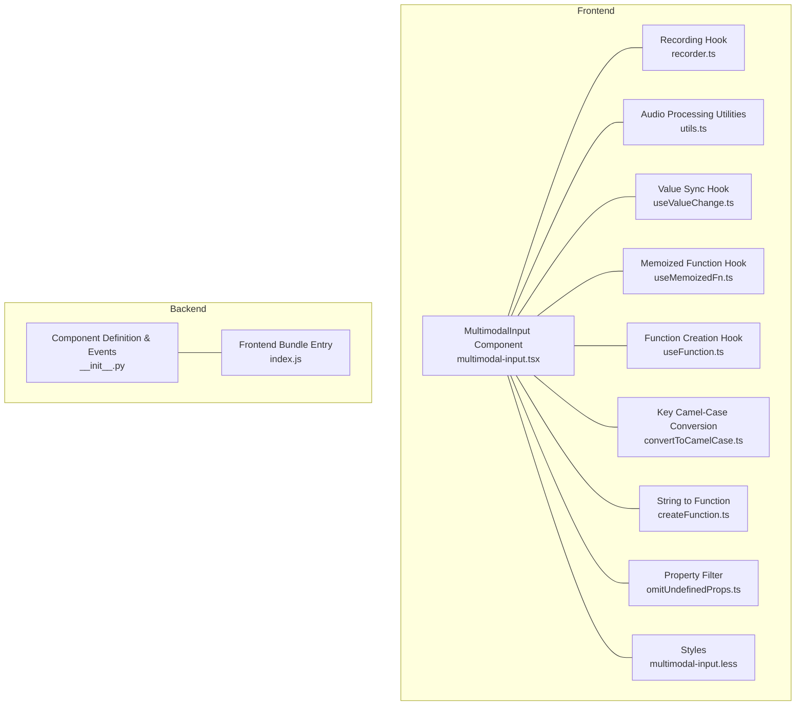
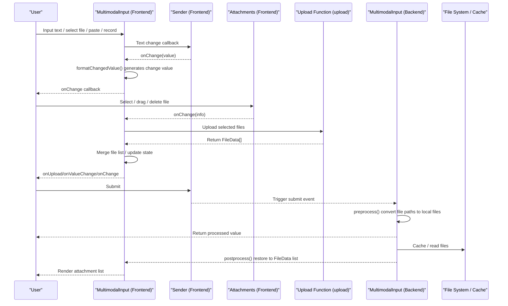
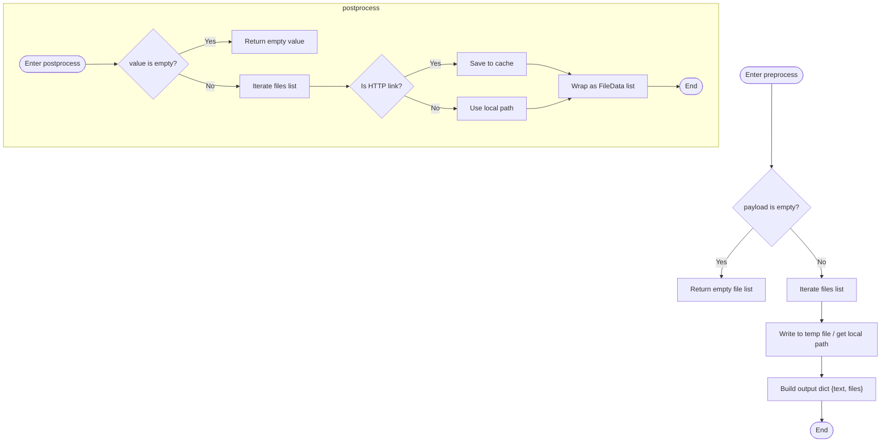
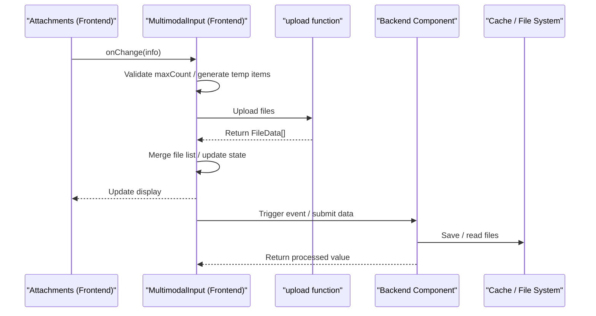
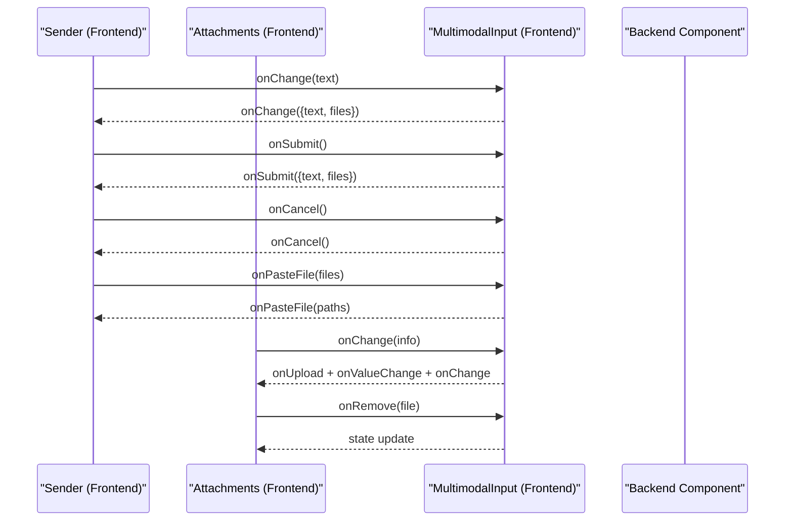
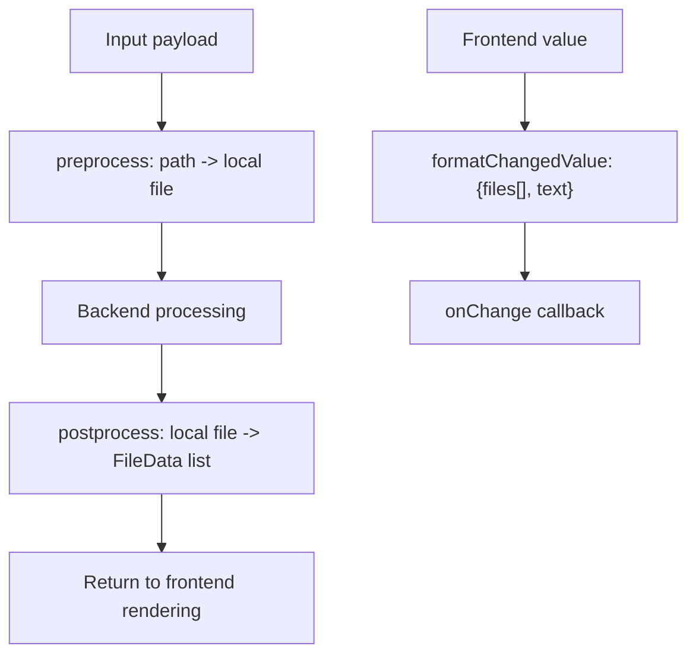
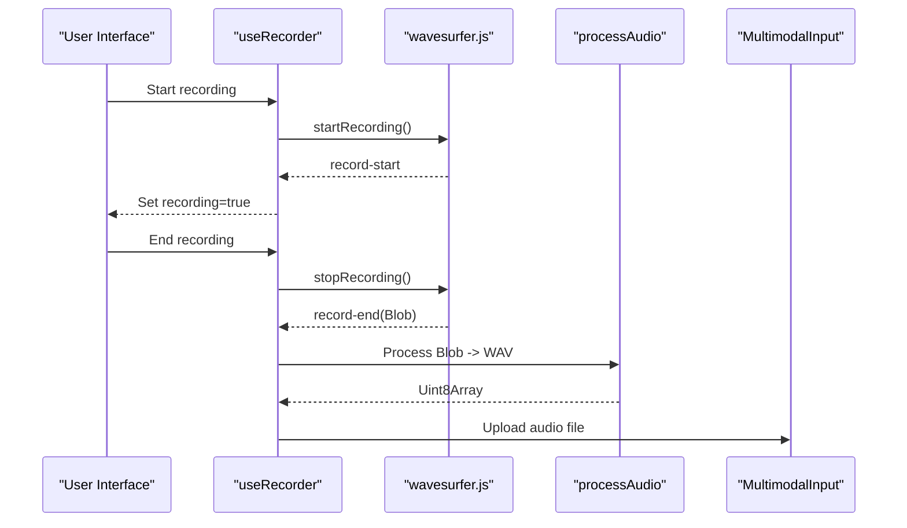
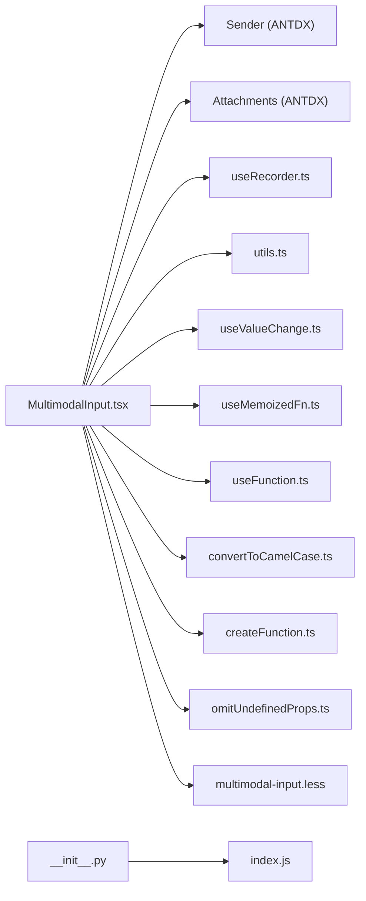

# Data Processing Mechanism

<cite>
**Files Referenced in This Document**
- [multimodal-input.tsx](file://frontend/pro/multimodal-input/multimodal-input.tsx)
- [recorder.ts](file://frontend/pro/multimodal-input/recorder.ts)
- [utils.ts](file://frontend/pro/multimodal-input/utils.ts)
- [useValueChange.ts](file://frontend/utils/hooks/useValueChange.ts)
- [useMemoizedFn.ts](file://frontend/utils/hooks/useMemoizedFn.ts)
- [useFunction.ts](file://frontend/utils/hooks/useFunction.ts)
- [convertToCamelCase.ts](file://frontend/utils/convertToCamelCase.ts)
- [createFunction.ts](file://frontend/utils/createFunction.ts)
- [omitUndefinedProps.ts](file://frontend/utils/omitUndefinedProps.ts)
- [multimodal-input.less](file://frontend/pro/multimodal-input/multimodal-input.less)
- [__init__.py](file://backend/modelscope_studio/components/pro/multimodal_input/__init__.py)
- [index.js](file://backend/modelscope_studio/components/pro/multimodal_input/templates/component/index.js)
- [basic.py](file://docs/components/pro/multimodal_input/demos/basic.py)
- [README.md](file://docs/components/pro/multimodal_input/README.md)
</cite>

## Table of Contents

1. [Introduction](#introduction)
2. [Project Structure](#project-structure)
3. [Core Components](#core-components)
4. [Architecture Overview](#architecture-overview)
5. [Detailed Component Analysis](#detailed-component-analysis)
6. [Dependency Analysis](#dependency-analysis)
7. [Performance Considerations](#performance-considerations)
8. [Troubleshooting Guide](#troubleshooting-guide)
9. [Conclusion](#conclusion)
10. [Appendix](#appendix)

## Introduction

This document focuses on the data processing mechanism of the MultimodalInput component, systematically explaining:

- Data models and conversion flows between frontend and backend (preprocess/postprocess)
- File upload, download, and caching strategies
- Event listening mechanisms (change, submit, cancel, upload, paste, etc.), their triggering conditions, and callback handling
- Best practices for data format conversion and error handling

## Project Structure

MultimodalInput's implementation spans both frontend and backend:

- **Frontend**: Based on Ant Design X's Sender and Attachments, combined with recording and upload logic, responsible for user interaction and data formatting
- **Backend**: Based on Gradio's data classes and event binding, responsible for input pre-processing and output post-processing

**Diagram Sources**

- [multimodal-input.tsx:1-619](file://frontend/pro/multimodal-input/multimodal-input.tsx#L1-L619)
- [recorder.ts:1-48](file://frontend/pro/multimodal-input/recorder.ts#L1-L48)
- [utils.ts:1-127](file://frontend/pro/multimodal-input/utils.ts#L1-L127)
- [useValueChange.ts:1-30](file://frontend/utils/hooks/useValueChange.ts#L1-L30)
- [useMemoizedFn.ts:1-11](file://frontend/utils/hooks/useMemoizedFn.ts#L1-L11)
- [useFunction.ts:1-13](file://frontend/utils/hooks/useFunction.ts#L1-L13)
- [convertToCamelCase.ts:1-22](file://frontend/utils/convertToCamelCase.ts#L1-L22)
- [createFunction.ts:1-38](file://frontend/utils/createFunction.ts#L1-L38)
- [omitUndefinedProps.ts:1-17](file://frontend/utils/omitUndefinedProps.ts#L1-L17)
- [multimodal-input.less:1-13](file://frontend/pro/multimodal-input/multimodal-input.less#L1-L13)
- [**init**.py:1-259](file://backend/modelscope_studio/components/pro/multimodal_input/__init__.py#L1-L259)
- [index.js:1-6](file://backend/modelscope_studio/components/pro/multimodal_input/templates/component/index.js#L1-L6)

**Section Sources**

- [multimodal-input.tsx:1-619](file://frontend/pro/multimodal-input/multimodal-input.tsx#L1-L619)
- [**init**.py:1-259](file://backend/modelscope_studio/components/pro/multimodal_input/__init__.py#L1-L259)

## Core Components

- **Frontend component**: `MultimodalInput` (React component wrapped via `sveltify`), internally combines `Sender` and `Attachments`, and integrates recording capability
- **Backend component**: `ModelScopeProMultimodalInput` (Gradio component), defines data model and event binding

Key responsibilities:

- **Frontend**: Maintains local state (text and file list), handles upload/paste/delete interactions, formats change values, triggers event callbacks
- **Backend**: `preprocess` converts file paths passed in from the frontend to locally cached files; `postprocess` restores local files to a displayable `FileData` list

**Section Sources**

- [multimodal-input.tsx:32-104](file://frontend/pro/multimodal-input/multimodal-input.tsx#L32-L104)
- [**init**.py:76-137](file://backend/modelscope_studio/components/pro/multimodal_input/__init__.py#L76-L137)

## Architecture Overview

MultimodalInput's data flow starts from user interaction, traverses frontend state management, upload processing, backend pre-processing and post-processing, and returns to frontend rendering.

**Diagram Sources**

- [multimodal-input.tsx:336-360](file://frontend/pro/multimodal-input/multimodal-input.tsx#L336-L360)
- [multimodal-input.tsx:511-602](file://frontend/pro/multimodal-input/multimodal-input.tsx#L511-L602)
- [multimodal-input.tsx:220-246](file://frontend/pro/multimodal-input/multimodal-input.tsx#L220-L246)
- [**init**.py:213-248](file://backend/modelscope_studio/components/pro/multimodal_input/__init__.py#L213-L248)

## Detailed Component Analysis

### Data Model and Field Meanings

- **Frontend data model**:
  - `MultimodalInputValue`: Contains `text` (text) and `files` (file array) fields
  - `MultimodalInputChangedValue`: Used for `onChange` callback; `files` is an array of file path strings, `text` is a string
- **Backend data model**:
  - `MultimodalInputValue`: Consistent with frontend, but `files` is of Gradio's `ListFiles` type
  - `MultimodalInputUploadConfig`: Controls upload behavior (e.g., whether to allow upload, paste, voice, maximum count, etc.)

Field descriptions (from type definitions and comments):

- `files`: File collection, supports multi-file and single-file modes
- `text`: Text content entered by the user
- `upload_config`: Upload configuration object, including `fullscreen_drop`, `allow_upload`, `allow_paste_file`, `allow_speech`, `max_count`, `placeholder`, etc.

**Section Sources**

- [multimodal-input.tsx:32-57](file://frontend/pro/multimodal-input/multimodal-input.tsx#L32-L57)
- [**init**.py:18-74](file://backend/modelscope_studio/components/pro/multimodal_input/__init__.py#L18-L74)
- [README.md:54-118](file://docs/components/pro/multimodal_input/README.md#L54-L118)

### How preprocess and postprocess Work

- **preprocess (backend)**:
  - Input: `MultimodalInputValue` (containing `text` and `files`)
  - Processing: Iterates over `files`, writes each file path to a temporary file, and returns a dict containing `text` and local file paths
  - Purpose: Ensures the backend can stably access files, preventing external links from becoming invalid
- **postprocess (backend)**:
  - Input: Backend processing result (may contain file paths)
  - Processing: Downloads or locally caches the file paths, then wraps them as a `FileData` list to return to the frontend
  - Purpose: Restores file paths stored in the backend to displayable file information for the frontend (including original name, size, etc.)

**Diagram Sources**

- [**init**.py:213-248](file://backend/modelscope_studio/components/pro/multimodal_input/__init__.py#L213-L248)

**Section Sources**

- [**init**.py:213-248](file://backend/modelscope_studio/components/pro/multimodal_input/__init__.py#L213-L248)

### File Upload, Download, and Caching

- **Upload flow**:
  - User selects/drags files in Attachments, triggering `onChange`
  - Frontend limits valid file count based on `maxCount`, generates temporary upload items, sets state to `uploading`
  - Calls the `upload` function (injected by the parent) to perform actual upload, returning a `FileData` array
  - Merges file lists, triggers `onUpload`, `onValueChange`, `onChange`
- **Download and caching**:
  - Backend saves remote files to a local cache directory in `preprocess`
  - In `postprocess`, restores local file paths to `FileData` for frontend display

**Diagram Sources**

- [multimodal-input.tsx:511-602](file://frontend/pro/multimodal-input/multimodal-input.tsx#L511-L602)
- [multimodal-input.tsx:220-246](file://frontend/pro/multimodal-input/multimodal-input.tsx#L220-L246)
- [**init**.py:213-248](file://backend/modelscope_studio/components/pro/multimodal_input/__init__.py#L213-L248)

**Section Sources**

- [multimodal-input.tsx:181-246](file://frontend/pro/multimodal-input/multimodal-input.tsx#L181-L246)
- [multimodal-input.tsx:511-602](file://frontend/pro/multimodal-input/multimodal-input.tsx#L511-L602)
- [**init**.py:213-248](file://backend/modelscope_studio/components/pro/multimodal_input/__init__.py#L213-L248)

### Event Listening Mechanism

- **Event binding (backend)**:
  - Supported events: `change`, `submit`, `cancel`, `key_down`, `key_press`, `focus`, `blur`, `upload`, `paste`, `paste_file`, `skill_closable_close`, `drop`, `download`, `preview`, `remove`
  - Registered via `EventListener`, bound to the component's internal update flow
- **Frontend event triggering**:
  - Text change: `Sender.onChange` → `onChange` (formatted to change value)
  - Submit: `Sender.onSubmit` → `onSubmit` (only when suggestion panel is not open)
  - Cancel: `Sender.onCancel` → `onCancel`
  - Paste: `Sender.onPasteFile` → `onPasteFile` (if paste is allowed)
  - Upload: `Attachments.onChange` → `onUpload` + `onValueChange` + `onChange`
  - Remove: `Attachments.onChange` → `onRemove` + state update
  - Recording: `useRecorder` triggers recording state changes; on stop, calls the upload function

**Diagram Sources**

- [multimodal-input.tsx:344-360](file://frontend/pro/multimodal-input/multimodal-input.tsx#L344-L360)
- [multimodal-input.tsx:336-343](file://frontend/pro/multimodal-input/multimodal-input.tsx#L336-L343)
- [multimodal-input.tsx:352-360](file://frontend/pro/multimodal-input/multimodal-input.tsx#L352-L360)
- [multimodal-input.tsx:511-602](file://frontend/pro/multimodal-input/multimodal-input.tsx#L511-L602)
- [**init**.py:86-135](file://backend/modelscope_studio/components/pro/multimodal_input/__init__.py#L86-L135)

**Section Sources**

- [multimodal-input.tsx:344-360](file://frontend/pro/multimodal-input/multimodal-input.tsx#L344-L360)
- [multimodal-input.tsx:511-602](file://frontend/pro/multimodal-input/multimodal-input.tsx#L511-L602)
- [**init**.py:86-135](file://backend/modelscope_studio/components/pro/multimodal_input/__init__.py#L86-L135)

### Data Format Conversion and Best Practices

- **Frontend formatting**:
  - `formatChangedValue`: Converts `MultimodalInputValue` to `MultimodalInputChangedValue` for callback passing
  - `convertObjectKeyToCamelCase`: Converts `snake_case` key names in upload configuration to `camelCase` to match component props
  - `omitUndefinedProps`: Filters out `undefined`/`null` properties to avoid passing invalid configurations
  - `createFunction`/`useFunction`: Parses string-form function expressions to executable functions, supporting slots and formatting
- **Backend conversion**:
  - `preprocess`: Writes file paths to temporary files to ensure backend accessibility
  - `postprocess`: Restores local files to `FileData`, including original name and size metadata

**Diagram Sources**

- [multimodal-input.tsx:59-66](file://frontend/pro/multimodal-input/multimodal-input.tsx#L59-L66)
- [convertToCamelCase.ts:13-21](file://frontend/utils/convertToCamelCase.ts#L13-L21)
- [omitUndefinedProps.ts:1-17](file://frontend/utils/omitUndefinedProps.ts#L1-L17)
- [createFunction.ts:10-37](file://frontend/utils/createFunction.ts#L10-L37)
- [**init**.py:213-248](file://backend/modelscope_studio/components/pro/multimodal_input/__init__.py#L213-L248)

**Section Sources**

- [multimodal-input.tsx:59-66](file://frontend/pro/multimodal-input/multimodal-input.tsx#L59-L66)
- [convertToCamelCase.ts:13-21](file://frontend/utils/convertToCamelCase.ts#L13-L21)
- [**init**.py:213-248](file://backend/modelscope_studio/components/pro/multimodal_input/__init__.py#L213-L248)

### Recording and Audio Processing

- **Recording hook**:
  - `useRecorder`: Based on wavesurfer.js and the record plugin, provides recording state and `start`/`stop` control
  - On recording stop, the callback returns a Blob; the frontend converts it to WAV format and triggers upload
- **Audio processing utilities**:
  - `processAudio`: Decodes the Blob to an `AudioBuffer`, trims as needed, then encodes to a WAV byte stream

**Diagram Sources**

- [recorder.ts:11-47](file://frontend/pro/multimodal-input/recorder.ts#L11-L47)
- [utils.ts:94-126](file://frontend/pro/multimodal-input/utils.ts#L94-L126)
- [multimodal-input.tsx:157-169](file://frontend/pro/multimodal-input/multimodal-input.tsx#L157-L169)

**Section Sources**

- [recorder.ts:11-47](file://frontend/pro/multimodal-input/recorder.ts#L11-L47)
- [utils.ts:94-126](file://frontend/pro/multimodal-input/utils.ts#L94-L126)
- [multimodal-input.tsx:157-169](file://frontend/pro/multimodal-input/multimodal-input.tsx#L157-L169)

### Frontend State and UI Slots

- **Value sync**: `useValueChange` ensures bidirectional consistency between `valueProp` and internal state, avoiding jitter
- **Function memoization**: `useMemoizedFn` keeps callback references stable to reduce re-renders
- **Slots and formatting**: `useFunction` + `createFunction` support string function expressions, combined with `slotConfig` for structured input
- **UI structure**: Switches header/footer layout based on `mode` (`inline`/`block`), supporting skill prompts and closable icon extensions

**Section Sources**

- [useValueChange.ts:9-29](file://frontend/utils/hooks/useValueChange.ts#L9-L29)
- [useMemoizedFn.ts:1-11](file://frontend/utils/hooks/useMemoizedFn.ts#L1-L11)
- [useFunction.ts:5-12](file://frontend/utils/hooks/useFunction.ts#L5-L12)
- [multimodal-input.tsx:407-457](file://frontend/pro/multimodal-input/multimodal-input.tsx#L407-L457)

## Dependency Analysis

- **Component coupling**: MultimodalInput depends on multiple utility hooks and functions, forming a highly cohesive, loosely coupled modular design; upload configuration is robustly handled through `convertObjectKeyToCamelCase` and `omitUndefinedProps`
- **External dependencies**: Ant Design X (Sender/Attachments), Ant Design (Button/Badge/Flex), wavesurfer.js (recording), Gradio (backend data classes and event system)

**Diagram Sources**

- [multimodal-input.tsx:1-619](file://frontend/pro/multimodal-input/multimodal-input.tsx#L1-L619)
- [**init**.py:1-259](file://backend/modelscope_studio/components/pro/multimodal_input/__init__.py#L1-L259)
- [index.js:1-6](file://backend/modelscope_studio/components/pro/multimodal_input/templates/component/index.js#L1-L6)

**Section Sources**

- [multimodal-input.tsx:1-619](file://frontend/pro/multimodal-input/multimodal-input.tsx#L1-L619)
- [**init**.py:1-259](file://backend/modelscope_studio/components/pro/multimodal_input/__init__.py#L1-L259)
- [index.js:1-6](file://backend/modelscope_studio/components/pro/multimodal_input/templates/component/index.js#L1-L6)

## Performance Considerations

- **Upload concurrency and throttling**: Use `uploading` state to prevent repeated uploads; limit one-time upload quantity with `maxCount` to reduce memory and network pressure
- **Rendering optimization**: `useMemoizedFn` keeps callback references stable to reduce sub-component re-renders; `useValueChange` only updates when the value changes, avoiding unnecessary side effects
- **Audio processing**: Decode and encode immediately after recording ends to shorten main thread blocking time; use chunked or streaming processing for large files (based on business requirements)

## Troubleshooting Guide

- **Upload failure**:
  - Check that the `upload` function return value is `FileData[]` and the `uid` corresponds to the temporary item
  - Pay attention to exception catching and `uploading` state recovery
- **Incorrect file count**:
  - Confirm `maxCount` configuration and merge logic (single-file mode clears the old list)
- **Events not triggered**:
  - Confirm backend `EVENTS` binding is enabled and frontend callbacks are correctly passed
- **Recording no output**:
  - Check recording container availability, browser permissions, and audio context initialization

**Section Sources**

- [multimodal-input.tsx:242-245](file://frontend/pro/multimodal-input/multimodal-input.tsx#L242-L245)
- [multimodal-input.tsx:598-601](file://frontend/pro/multimodal-input/multimodal-input.tsx#L598-L601)
- [**init**.py:86-135](file://backend/modelscope_studio/components/pro/multimodal_input/__init__.py#L86-L135)

## Conclusion

MultimodalInput achieves a complete multimodal input experience through frontend-backend collaboration: text input, file upload, paste, and recording, combined with strict pre/post-processing flows to ensure data consistency and stability. Its modular frontend implementation and clear event system provide a solid foundation for extending more interaction capabilities.

## Appendix

- Sample applications: Basic usage and integration with Chatbot
- API documentation: Properties, slots, and type definition references

**Section Sources**

- [basic.py:7-16](file://docs/components/pro/multimodal_input/demos/basic.py#L7-L16)
- [README.md:27-118](file://docs/components/pro/multimodal_input/README.md#L27-L118)
