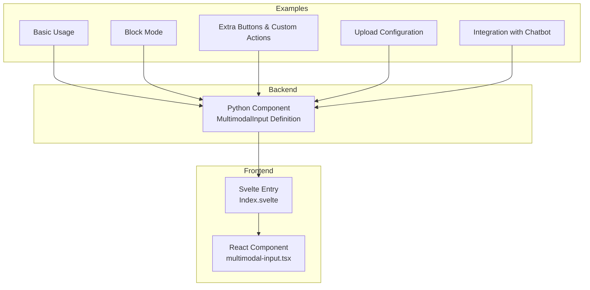
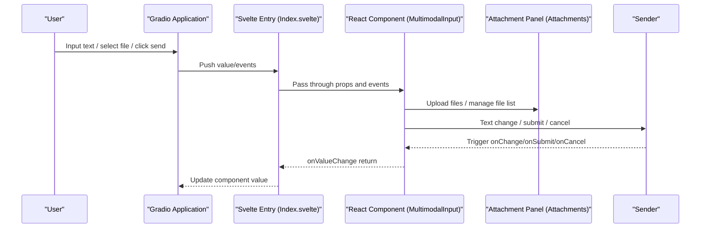
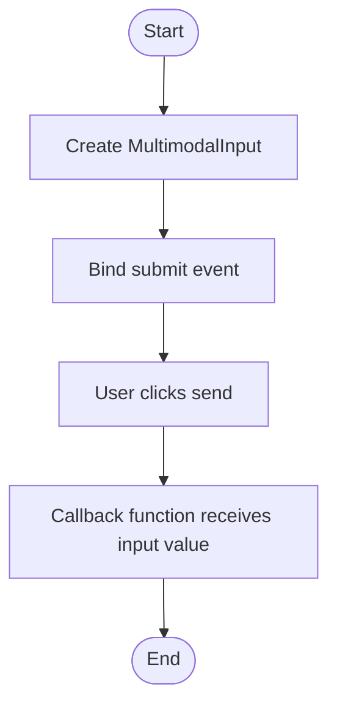
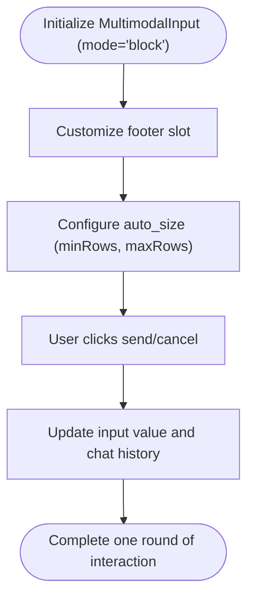
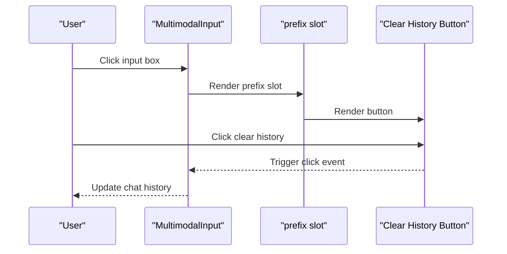
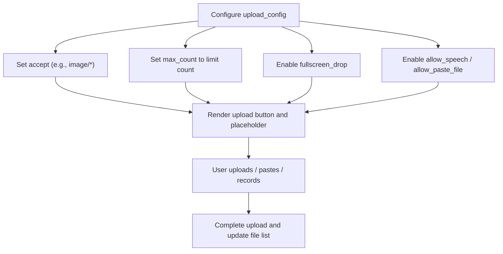
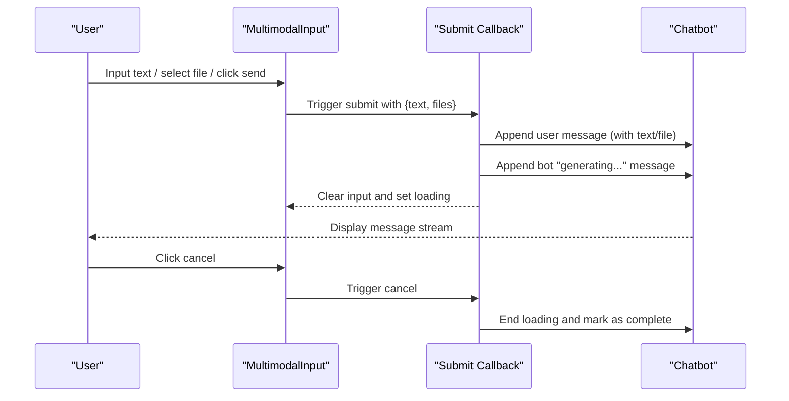
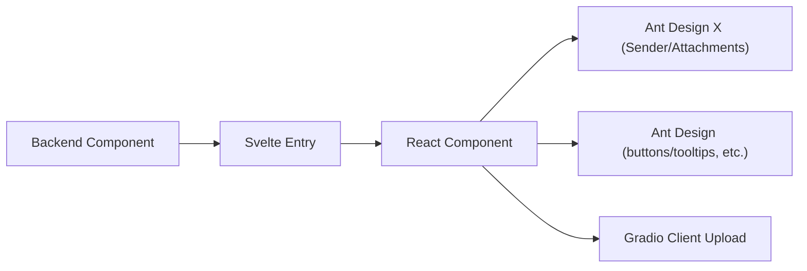

# Integration Examples

<cite>
**Files Referenced in This Document**
- [Backend module: MultimodalInput definition](file://backend/modelscope_studio/components/pro/multimodal_input/__init__.py)
- [Frontend index: MultimodalInput component entry](file://frontend/pro/multimodal-input/Index.svelte)
- [Frontend implementation: MultimodalInput React component](file://frontend/pro/multimodal-input/multimodal-input.tsx)
- [Example: Basic usage](file://docs/components/pro/multimodal_input/demos/basic.py)
- [Example: Block mode](file://docs/components/pro/multimodal_input/demos/block_mode.py)
- [Example: Extra buttons and custom actions](file://docs/components/pro/multimodal_input/demos/extra_button.py)
- [Example: Upload configuration](file://docs/components/pro/multimodal_input/demos/upload_config.py)
- [Example: Integration with Chatbot component](file://docs/components/pro/multimodal_input/demos/with_chatbot.py)
- [Chatbot component documentation (Chinese)](file://docs/components/pro/chatbot/README-zh_CN.md)
</cite>

## Table of Contents

1. [Introduction](#introduction)
2. [Project Structure](#project-structure)
3. [Core Components](#core-components)
4. [Architecture Overview](#architecture-overview)
5. [Detailed Component Analysis](#detailed-component-analysis)
6. [Dependency Analysis](#dependency-analysis)
7. [Performance Considerations](#performance-considerations)
8. [Troubleshooting Guide](#troubleshooting-guide)
9. [Conclusion](#conclusion)
10. [Appendix](#appendix)

## Introduction

This document is aimed at developers who want to use the MultimodalInput component in the Gradio/ModelScope Studio ecosystem, providing complete usage examples and descriptions ranging from basic text input to integration with Chatbot. Topics covered:

- **Basic usage**: The simplest text input and submit flow
- **Block mode**: Rendering the input area and send button separately for more complex layouts
- **Custom actions**: Adding prefix/suffix buttons and toolbars via slots
- **Upload configuration**: Restricting file types, counts, paste/voice capabilities
- **Integration with Chatbot**: Receiving user text and files in real chat applications while handling cancellation and loading states

## Project Structure

MultimodalInput consists of a backend Python component and a frontend React/Svelte implementation. Documentation examples are in `docs/components/pro/multimodal_input/demos`.

**Diagram Sources**

- [Frontend index: MultimodalInput component entry:1-99](file://frontend/pro/multimodal-input/Index.svelte#L1-L99)
- [Frontend implementation: MultimodalInput React component:1-619](file://frontend/pro/multimodal-input/multimodal-input.tsx#L1-L619)
- [Example: Basic usage:1-17](file://docs/components/pro/multimodal_input/demos/basic.py#L1-L17)
- [Example: Block mode:1-81](file://docs/components/pro/multimodal_input/demos/block_mode.py#L1-L81)
- [Example: Extra buttons and custom actions:1-78](file://docs/components/pro/multimodal_input/demos/extra_button.py#L1-L78)
- [Example: Upload configuration:1-38](file://docs/components/pro/multimodal_input/demos/upload_config.py#L1-L38)
- [Example: Integration with Chatbot component:1-57](file://docs/components/pro/multimodal_input/demos/with_chatbot.py#L1-L57)

**Section Sources**

- [Frontend index: MultimodalInput component entry:1-99](file://frontend/pro/multimodal-input/Index.svelte#L1-L99)
- [Frontend implementation: MultimodalInput React component:1-619](file://frontend/pro/multimodal-input/multimodal-input.tsx#L1-L619)
- [Example: Basic usage:1-17](file://docs/components/pro/multimodal_input/demos/basic.py#L1-L17)

## Core Components

- **Backend component**: `ModelScopeProMultimodalInput` provides value model, event binding, pre/post-processing logic, and frontend directory mapping
- **Frontend component**: `MultimodalInput` (React) wraps `Sender` and `Attachments`, supporting text input, file upload, voice recording, paste files, slot extensions, etc.
- **Slots**: Supports `header`/`prefix`/`footer`/`suffix` and skill-related slots (`skill.*`)

Key points:

- **Value model**: `MultimodalInputValue` contains `text` and `files` fields
- **Events**: `change`/`submit`/`cancel`/`key_down`/`key_press`/`focus`/`blur`/`upload`/`paste`/`paste_file`/`skill_closable_close`/`drop`/`download`/`preview`/`remove`
- **Mode**: `mode` supports `inline` and `block`; in block mode, `footer` is rendered as an independent area containing send/loading/voice and other controls

**Section Sources**

- [Backend module: MultimodalInput definition:76-259](file://backend/modelscope_studio/components/pro/multimodal_input/__init__.py#L76-L259)
- [Frontend implementation: MultimodalInput React component:32-104](file://frontend/pro/multimodal-input/multimodal-input.tsx#L32-L104)

## Architecture Overview

MultimodalInput imports the React component through the Svelte entry on the frontend, bridges the Gradio-side props and events to the React component internals, and passes value changes back to Gradio.

**Diagram Sources**

- [Frontend index: MultimodalInput component entry:68-98](file://frontend/pro/multimodal-input/Index.svelte#L68-L98)
- [Frontend implementation: MultimodalInput React component:311-351](file://frontend/pro/multimodal-input/multimodal-input.tsx#L311-L351)

## Detailed Component Analysis

### Basic Usage

- **Goal**: Demonstrates the most basic text input and submission
- **Key points**: Create a `MultimodalInput` and bind the `submit` event; the function receives the input value (containing `text` and `files`)
- **Applicable scenarios**: Quickly build a chat input box without file upload or extra buttons

**Diagram Sources**

- [Example: Basic usage:7-16](file://docs/components/pro/multimodal_input/demos/basic.py#L7-L16)

**Section Sources**

- [Example: Basic usage:1-17](file://docs/components/pro/multimodal_input/demos/basic.py#L1-L17)

### Block Mode

- **Goal**: Separates the input area and send button; customizes footer area layout
- **Key points**: `mode="block"`; the `footer` slot can contain "clear history" and other buttons; `auto_size` controls row range
- **Applicable scenarios**: Scenarios requiring clearer input/action separation, such as a vertically laid out chat window

**Diagram Sources**

- [Example: Block mode:57-77](file://docs/components/pro/multimodal_input/demos/block_mode.py#L57-L77)

**Section Sources**

- [Example: Block mode:1-81](file://docs/components/pro/multimodal_input/demos/block_mode.py#L1-L81)

### Adding Extra Buttons and Custom Actions

- **Goal**: Add buttons and icons in the prefix/suffix area via slots
- **Key points**: Use `ms.Slot("prefix")`/`("suffix")` to inject buttons; combine Tooltip/Button/Icon to implement "clear history" and other operations
- **Applicable scenarios**: Adding frequently used operation entries beside the input box to improve interaction efficiency

**Diagram Sources**

- [Example: Extra buttons and custom actions:59-74](file://docs/components/pro/multimodal_input/demos/extra_button.py#L59-L74)

**Section Sources**

- [Example: Extra buttons and custom actions:1-78](file://docs/components/pro/multimodal_input/demos/extra_button.py#L1-L78)

### Upload Configuration (File types, count, paste/voice, etc.)

- **Goal**: Flexibly control file upload behavior and appearance
- **Key points**: `MultimodalInputUploadConfig` supports `accept`, `max_count`, `fullscreen_drop`, `multiple`, `allow_speech`, `allow_paste_file`, `placeholder`, etc.
- **Applicable scenarios**: Restricting upload types (e.g., images only), limiting count, enabling fullscreen drag, allowing voice/paste file

**Diagram Sources**

- [Example: Upload configuration:12-34](file://docs/components/pro/multimodal_input/demos/upload_config.py#L12-L34)

**Section Sources**

- [Example: Upload configuration:1-38](file://docs/components/pro/multimodal_input/demos/upload_config.py#L1-L38)

### Integration with Chatbot Component

- **Goal**: Receive user text and files in a real chat application while handling cancellation and loading states
- **Key points**: `MultimodalInput.submit` outputs `{text, files}`; Chatbot supports multimodal messages (text/file/tool/suggestion) and can manage message streams via the `value` list
- **Applicable scenarios**: Building intelligent customer service, Q&A assistants, etc. with file/voice input

**Diagram Sources**

- [Example: Integration with Chatbot component:10-53](file://docs/components/pro/multimodal_input/demos/with_chatbot.py#L10-L53)
- [Chatbot component documentation (Chinese):298-349](file://docs/components/pro/chatbot/README-zh_CN.md#L298-L349)

**Section Sources**

- [Example: Integration with Chatbot component:1-57](file://docs/components/pro/multimodal_input/demos/with_chatbot.py#L1-L57)
- [Chatbot component documentation (Chinese):1-354](file://docs/components/pro/chatbot/README-zh_CN.md#L1-L354)

## Dependency Analysis

- **Backend dependencies**: Gradio data classes, event system, file processing utilities
- **Frontend dependencies**: `@ant-design/x`'s Sender/Attachments, Ant Design icons and components, Gradio client upload tools
- **Slots and events**: Bridged to the React side via slot and event name mappings (e.g., `key_press`/`paste_file`)

**Diagram Sources**

- [Frontend implementation: MultimodalInput React component:1-26](file://frontend/pro/multimodal-input/multimodal-input.tsx#L1-L26)
- [Frontend index: MultimodalInput component entry:1-15](file://frontend/pro/multimodal-input/Index.svelte#L1-L15)

**Section Sources**

- [Frontend implementation: MultimodalInput React component:1-619](file://frontend/pro/multimodal-input/multimodal-input.tsx#L1-L619)
- [Frontend index: MultimodalInput component entry:1-99](file://frontend/pro/multimodal-input/Index.svelte#L1-L99)

## Performance Considerations

- **Upload throttling and concurrency**: Frontend marks `uploading` state to avoid repeated uploads
- **File deduplication and merging**: Merge temporary files and server-returned data based on `uid` to reduce repeated renders
- **Behavioral limits**: `max_count` and `multiple` can reduce one-time upload pressure
- **Loading state and cancellation**: `loading` and `cancel` events are used to interrupt long tasks, improving user experience

[This section provides general guidance and requires no specific file references]

## Troubleshooting Guide

- **Cannot upload files**:
  - Check `upload_config`'s `allow_upload`/`disabled` and `max_count`
  - Confirm file type and `accept` settings
- **File not displayed after upload**:
  - Confirm that `onUpload` callback and `onChange` correctly update `value`
- **Send button unavailable**:
  - Check `disabled`/`loading`/`read_only` states
- **Cancel not working**:
  - Ensure `cancel`'s `cancels` correctly points to the `submit` event
- **Block mode footer not displayed**:
  - Confirm `mode="block"` and the `footer` slot is correctly injected

**Section Sources**

- [Frontend implementation: MultimodalInput React component:174-246](file://frontend/pro/multimodal-input/multimodal-input.tsx#L174-L246)
- [Example: Block mode:69-77](file://docs/components/pro/multimodal_input/demos/block_mode.py#L69-L77)

## Conclusion

MultimodalInput provides an integrated capability from basic text input to complex multimodal interaction: through a concise API and flexible slot system, it can both meet quick integration needs and support richer interaction designs. Combined with the Chatbot component, you can easily build intelligent chat applications with file/voice input capabilities.

[This section is a summary and requires no specific file references]

## Appendix

- **Value model and event reference**:
  - Value model: `MultimodalInputValue(text, files)`
  - Events: `change`/`submit`/`cancel`/`key_down`/`key_press`/`focus`/`blur`/`upload`/`paste`/`paste_file`/`skill_closable_close`/`drop`/`download`/`preview`/`remove`
- **Slot list**: `suffix`/`header`/`prefix`/`footer`/`skill.title`/`skill.toolTip.title`/`skill.closable.closeIcon`

**Section Sources**

- [Backend module: MultimodalInput definition:76-143](file://backend/modelscope_studio/components/pro/multimodal_input/__init__.py#L76-L143)
- [Frontend implementation: MultimodalInput React component:95-104](file://frontend/pro/multimodal-input/multimodal-input.tsx#L95-L104)
