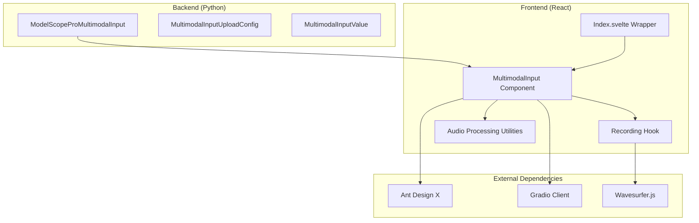
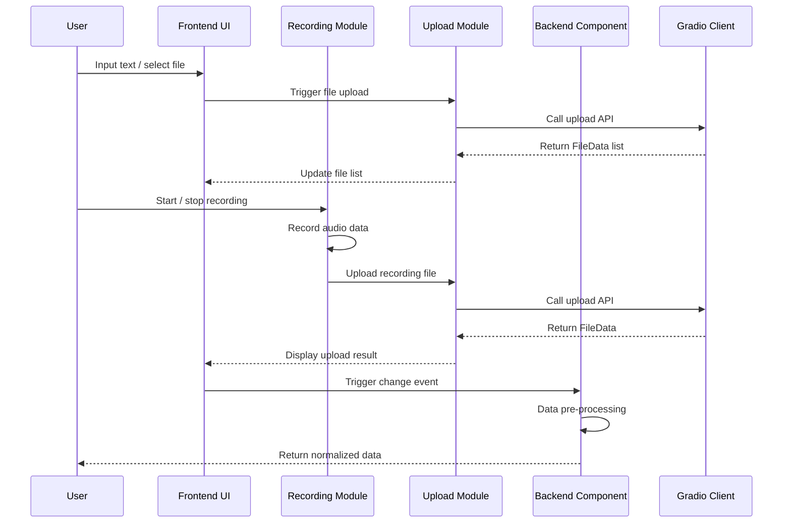
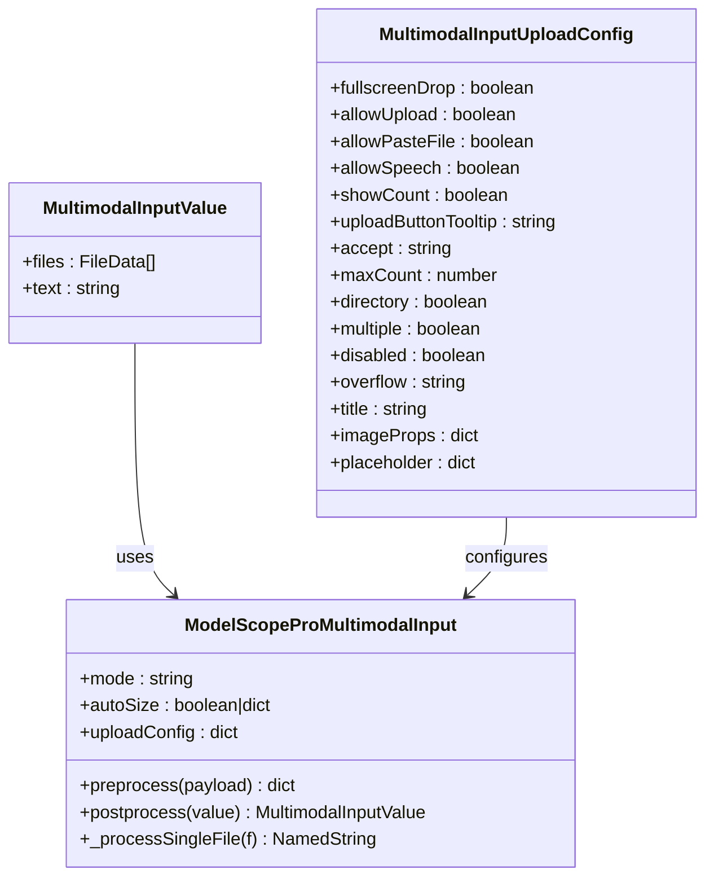
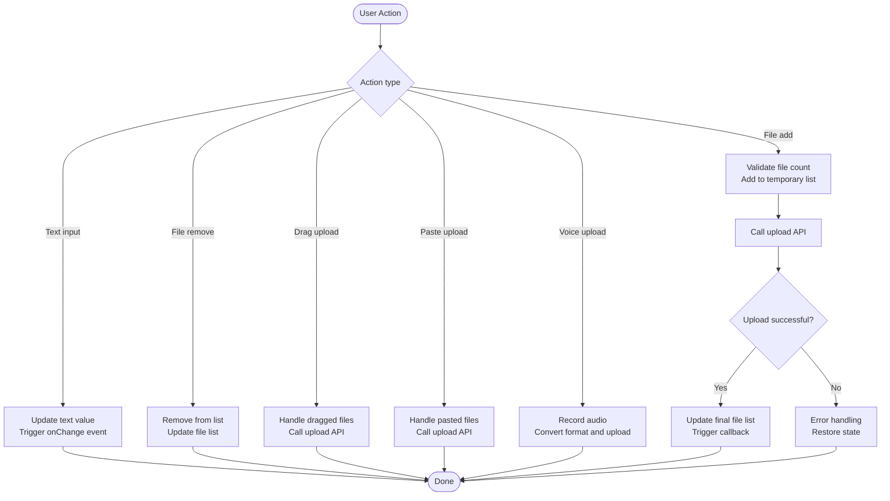
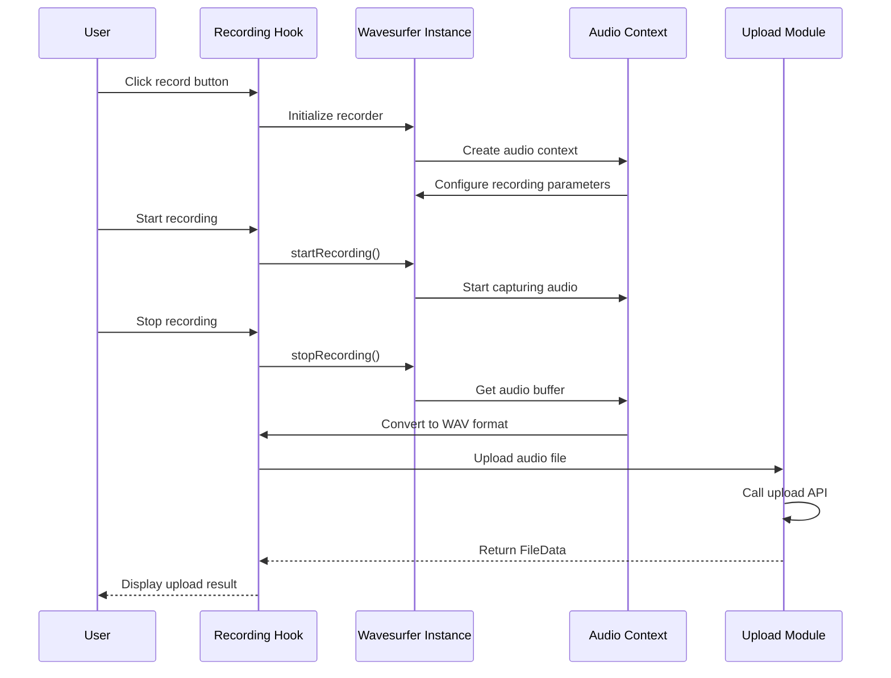
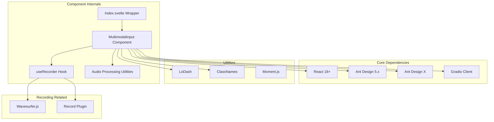

# MultimodalInput

<cite>
**Files Referenced in This Document**
- [Backend module definition](file://backend/modelscope_studio/components/pro/multimodal_input/__init__.py)
- [Frontend component implementation](file://frontend/pro/multimodal-input/multimodal-input.tsx)
- [Frontend entry wrapper](file://frontend/pro/multimodal-input/Index.svelte)
- [Recording hook](file://frontend/pro/multimodal-input/recorder.ts)
- [Audio processing utilities](file://frontend/pro/multimodal-input/utils.ts)
- [Component documentation](file://docs/components/pro/multimodal_input/README.md)
- [Component package export config](file://frontend/pro/multimodal-input/package.json)
- [Component build config](file://frontend/pro/multimodal-input/gradio.config.js)
</cite>

## Table of Contents

1. [Introduction](#introduction)
2. [Project Structure](#project-structure)
3. [Core Components](#core-components)
4. [Architecture Overview](#architecture-overview)
5. [Detailed Component Analysis](#detailed-component-analysis)
6. [Dependency Analysis](#dependency-analysis)
7. [Performance Considerations](#performance-considerations)
8. [Troubleshooting Guide](#troubleshooting-guide)
9. [Conclusion](#conclusion)
10. [Appendix](#appendix)

## Introduction

MultimodalInput is a multimodal input component based on Ant Design X, supporting multiple interaction modes including text input, file upload, voice recording, paste upload, and drag-and-drop upload. The component is implemented in React on the frontend and bridged to the backend via Gradio components, providing comprehensive multimodal data processing capabilities.

Key features include:

- Text input with automatic height adjustment
- File upload (single/multiple files, directory upload)
- Voice recording (based on Web Audio API)
- Paste upload (clipboard files)
- Drag-and-drop upload (supports fullscreen drag)
- Real-time preview and download
- Configurable attachment panel
- Structured input support (skill/slot mode)

## Project Structure

MultimodalInput adopts a frontend-backend separated architecture:

**Diagram Sources**

- [Backend module definition:18-259](file://backend/modelscope_studio/components/pro/multimodal_input/__init__.py#L18-L259)
- [Frontend component implementation:1-619](file://frontend/pro/multimodal-input/multimodal-input.tsx#L1-L619)
- [Frontend entry wrapper:1-99](file://frontend/pro/multimodal-input/Index.svelte#L1-L99)

**Section Sources**

- [Backend module definition:1-259](file://backend/modelscope_studio/components/pro/multimodal_input/__init__.py#L1-L259)
- [Frontend component implementation:1-619](file://frontend/pro/multimodal-input/multimodal-input.tsx#L1-L619)
- [Frontend entry wrapper:1-99](file://frontend/pro/multimodal-input/Index.svelte#L1-L99)

## Core Components

MultimodalInput consists of three core parts:

### Backend Component Class

The backend is implemented via the `ModelScopeProMultimodalInput` class, which inherits from `ModelScopeDataLayoutComponent` and provides complete Gradio component lifecycle management.

### Frontend Component Implementation

The frontend is implemented using React + TypeScript, built on the `Sender` and `Attachments` components from `@ant-design/x`.

### Recording Module

Integrates Wavesurfer.js to provide recording functionality, supporting real-time waveform display and audio format conversion.

**Section Sources**

- [Backend module definition:82-259](file://backend/modelscope_studio/components/pro/multimodal_input/__init__.py#L82-L259)
- [Frontend component implementation:75-104](file://frontend/pro/multimodal-input/multimodal-input.tsx#L75-L104)
- [Recording hook:11-47](file://frontend/pro/multimodal-input/recorder.ts#L11-L47)

## Architecture Overview

MultimodalInput uses a layered architecture to ensure clear separation of the frontend-backend data flow:

**Diagram Sources**

- [Frontend component implementation:157-169](file://frontend/pro/multimodal-input/multimodal-input.tsx#L157-L169)
- [Frontend component implementation:220-246](file://frontend/pro/multimodal-input/multimodal-input.tsx#L220-L246)
- [Frontend entry wrapper:68-75](file://frontend/pro/multimodal-input/Index.svelte#L68-L75)

## Detailed Component Analysis

### Data Model and Type Definitions

**Diagram Sources**

- [Backend module definition:18-80](file://backend/modelscope_studio/components/pro/multimodal_input/__init__.py#L18-L80)
- [Backend module definition:82-205](file://backend/modelscope_studio/components/pro/multimodal_input/__init__.py#L82-L205)

### Upload Configuration Reference

| Option                | Type    | Default       | Description                                                                            |
| --------------------- | ------- | ------------- | -------------------------------------------------------------------------------------- |
| `fullscreenDrop`      | boolean | false         | Whether to allow dragging files to the entire page window to open the attachment panel |
| `allowUpload`         | boolean | true          | Whether to enable file upload                                                          |
| `allowPasteFile`      | boolean | true          | Whether to allow paste file upload                                                     |
| `allowSpeech`         | boolean | false         | Whether to allow voice input                                                           |
| `showCount`           | boolean | true          | Whether to show file count badge when attachment panel is closed                       |
| `uploadButtonTooltip` | string  | null          | Tooltip text for the upload button                                                     |
| `accept`              | string  | null          | Accepted file types                                                                    |
| `maxCount`            | number  | null          | Maximum number of files                                                                |
| `directory`           | boolean | false         | Support uploading entire directories                                                   |
| `multiple`            | boolean | false         | Support multi-file selection                                                           |
| `disabled`            | boolean | false         | Disable file upload                                                                    |
| `overflow`            | string  | null          | File list overflow behavior                                                            |
| `title`               | string  | "Attachments" | Attachment panel title                                                                 |
| `imageProps`          | dict    | null          | Image configuration                                                                    |
| `placeholder`         | dict    | built-in      | Placeholder info when no files                                                         |

### Event Handling Mechanism

**Diagram Sources**

- [Frontend component implementation:511-602](file://frontend/pro/multimodal-input/multimodal-input.tsx#L511-L602)
- [Frontend component implementation:352-360](file://frontend/pro/multimodal-input/multimodal-input.tsx#L352-L360)

### Recording Feature Implementation

The recording feature is implemented via Wavesurfer.js, supporting:

- Real-time waveform display
- Audio format conversion (WAV)
- Automatic trimming and resampling
- Recording state management

**Diagram Sources**

- [Recording hook:24-41](file://frontend/pro/multimodal-input/recorder.ts#L24-L41)
- [Audio processing utilities:94-126](file://frontend/pro/multimodal-input/utils.ts#L94-L126)

**Section Sources**

- [Recording hook:1-48](file://frontend/pro/multimodal-input/recorder.ts#L1-L48)
- [Audio processing utilities:1-127](file://frontend/pro/multimodal-input/utils.ts#L1-L127)

## Dependency Analysis

**Diagram Sources**

- [Frontend component implementation:1-26](file://frontend/pro/multimodal-input/multimodal-input.tsx#L1-L26)
- [Recording hook:1-5](file://frontend/pro/multimodal-input/recorder.ts#L1-L5)
- [Component package export config:1-15](file://frontend/pro/multimodal-input/package.json#L1-L15)

**Section Sources**

- [Component package export config:1-15](file://frontend/pro/multimodal-input/package.json#L1-L15)
- [Component build config:1-4](file://frontend/pro/multimodal-input/gradio.config.js#L1-L4)

## Performance Considerations

### File Upload Optimization

- Supports batch upload control; use `maxCount` to limit simultaneously uploading files
- Uses a temporary file list mechanism to avoid redundant renders
- Asynchronous upload processing to avoid blocking the main thread

### Memory Management

- Release audio context resources promptly after recording ends
- Clear temporary file references after file upload completes
- Use `useMemoizedFn` to optimize function references

### Rendering Optimization

- Conditionally render the attachment panel to reduce unnecessary DOM elements
- Use virtual scrolling to handle large file lists
- Load recording plugin on demand

## Troubleshooting Guide

### Common Issues and Solutions

**Issue 1: Recording feature not working**

- Check browser permission settings
- Confirm HTTPS environment (recording requires a secure context)
- Verify microphone device availability

**Issue 2: File upload failed**

- Check network connection status
- Verify file size limits
- Confirm server upload API is working properly

**Issue 3: Drag-and-drop upload unresponsive**

- Confirm `fullscreenDrop` configuration is correct
- Check for CSS style conflicts
- Verify browser compatibility

**Issue 4: Audio format incompatibility**

- Confirm browser supports WAV format
- Check audio sample rate settings
- Verify audio channel count configuration

**Section Sources**

- [Recording hook:24-41](file://frontend/pro/multimodal-input/recorder.ts#L24-L41)
- [Frontend component implementation:178-179](file://frontend/pro/multimodal-input/multimodal-input.tsx#L178-L179)

## Conclusion

MultimodalInput is a feature-complete, architecturally clear multimodal input component. Through a well-designed layered architecture and comprehensive error handling mechanisms, it provides developers with powerful rich media input capabilities. The component supports multiple input modes, has good extensibility and configurability, and is suitable for building various complex rich media application interfaces.

## Appendix

### Usage Example Overview

Due to the extensive code examples, it is recommended to refer to the example pages in the official documentation for complete usage samples.

### API Reference

For the complete set of properties and event interfaces supported by the component, refer to the API section in the component documentation.

### Version Compatibility

- React 18+
- Ant Design 5.x
- Ant Design X
- Gradio 3.x+
