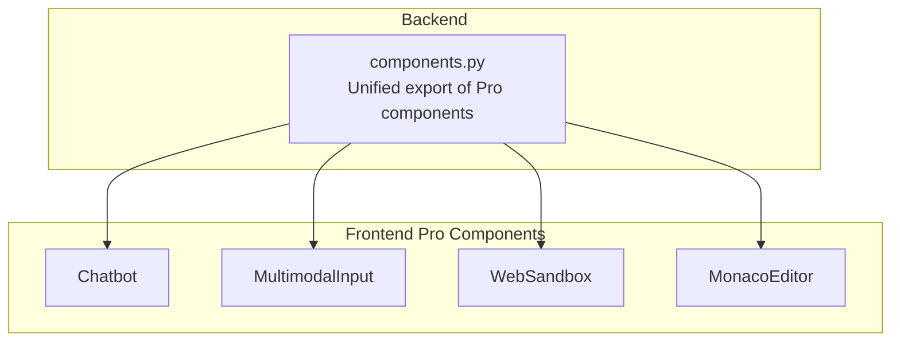
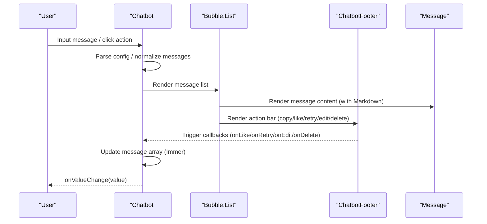
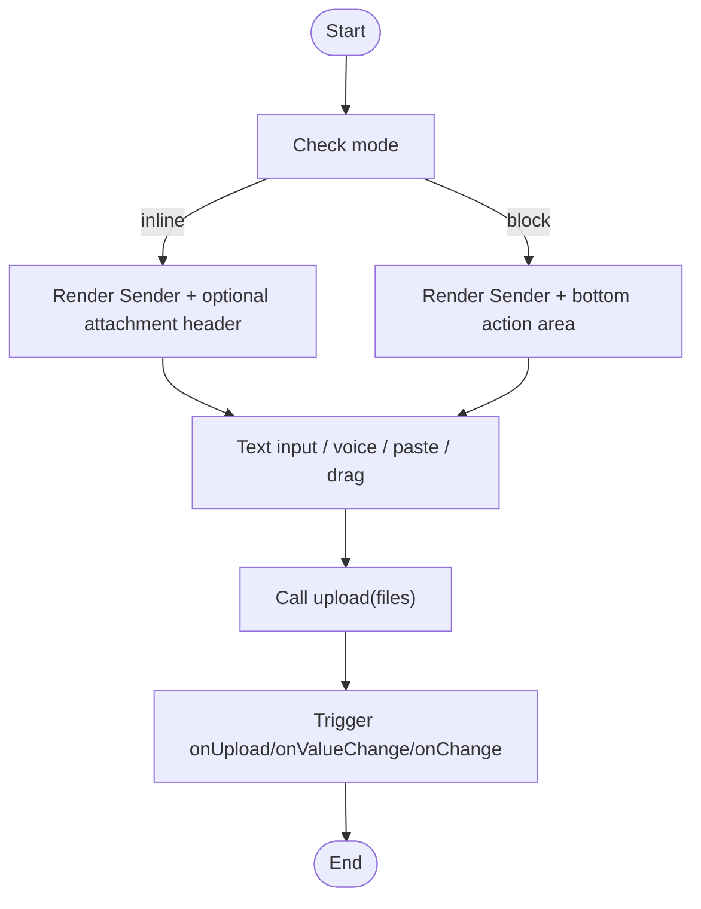
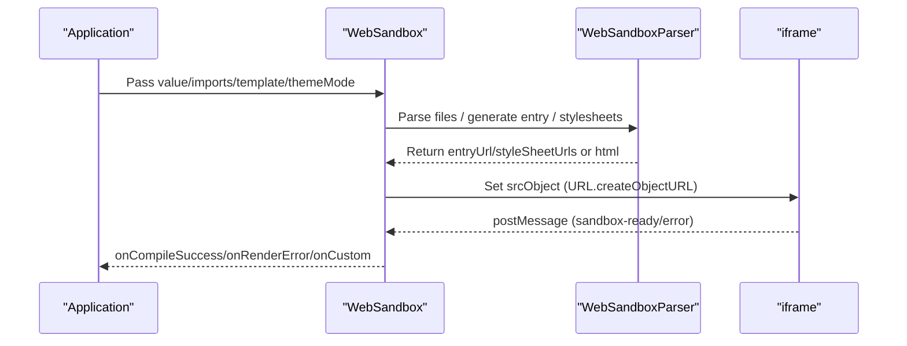
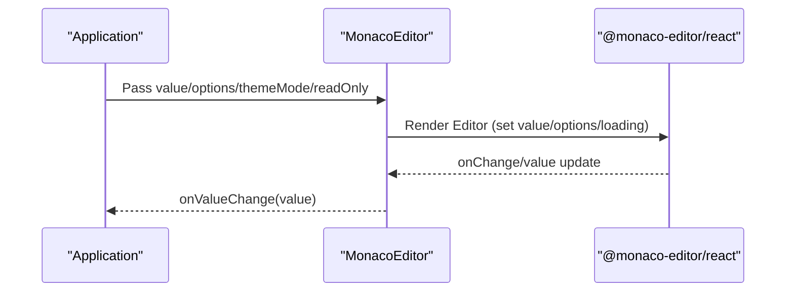
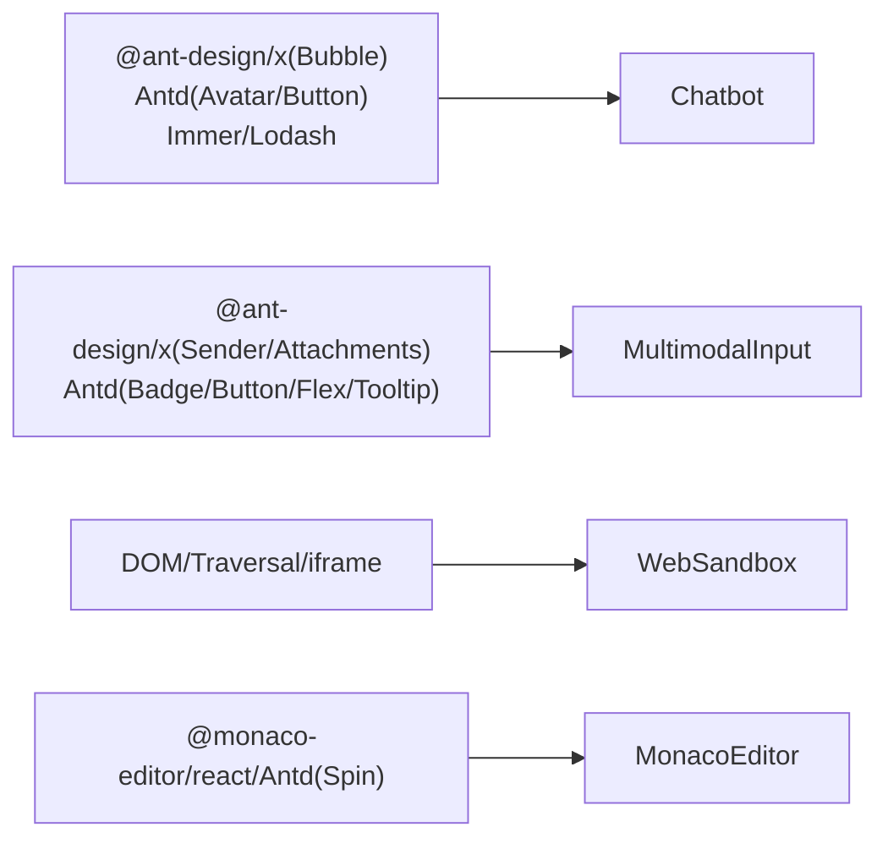

# Pro Components

<cite>
**Files Referenced in This Document**
- [chatbot.tsx](file://frontend/pro/chatbot/chatbot.tsx)
- [type.ts](file://frontend/pro/chatbot/type.ts)
- [utils.ts](file://frontend/pro/chatbot/utils.ts)
- [multimodal-input.tsx](file://frontend/pro/multimodal-input/multimodal-input.tsx)
- [recorder.ts](file://frontend/pro/multimodal-input/recorder.ts)
- [utils.ts](file://frontend/pro/multimodal-input/utils.ts)
- [web-sandbox.tsx](file://frontend/pro/web-sandbox/web-sandbox.tsx)
- [monaco-editor.tsx](file://frontend/pro/monaco-editor/monaco-editor.tsx)
- [components.py](file://backend/modelscope_studio/components/pro/components.py)
</cite>

## Table of Contents

1. [Introduction](#introduction)
2. [Project Structure](#project-structure)
3. [Core Components](#core-components)
4. [Architecture Overview](#architecture-overview)
5. [Detailed Component Analysis](#detailed-component-analysis)
6. [Dependency Analysis](#dependency-analysis)
7. [Performance Considerations](#performance-considerations)
8. [Troubleshooting Guide](#troubleshooting-guide)
9. [Conclusion](#conclusion)
10. [Appendix](#appendix)

## Introduction

This document is aimed at experienced developers and systematically covers the advanced components in the ModelScope Studio Pro component library: Chatbot, MultimodalInput, WebSandbox, and MonacoEditor. The document provides in-depth explanations from architecture design, data flow, processing logic, integration methods, performance optimization, to troubleshooting, with source code path references to help developers efficiently deploy in complex professional scenarios.

## Project Structure

Pro components are located in the `pro` submodule of the frontend directory; the backend aggregates and exports them via components.py to form a unified component entry. Each component is encapsulated in React + Svelte preprocessing mode, reusing the capabilities of Ant Design X and Ant Design, and achieving high-performance interaction integrated with the Gradio ecosystem.

Diagram sources

- [components.py:1-8](file://backend/modelscope_studio/components/pro/components.py#L1-L8)

Section sources

- [components.py:1-8](file://backend/modelscope_studio/components/pro/components.py#L1-L8)

## Core Components

- Chatbot: A conversational component based on bubble message lists, supporting user/assistant roles, welcome prompts, and interactions such as copy/like/retry/edit/delete, with built-in scroll control and Markdown rendering.
- MultimodalInput: An input component supporting text and file uploads, with built-in extension slots for voice recording, paste upload, attachment management, and skill panels.
- WebSandbox: Compiles multi-file/HTML source code into a sandbox environment that runs safely in an iframe, supporting React/HTML templates and theme injection.
- MonacoEditor: A lightweight encapsulation of the Monaco editor, providing read-only mode, theme switching, value change callbacks, and loading placeholders.

Section sources

- [chatbot.tsx:51-76](file://frontend/pro/chatbot/chatbot.tsx#L51-L76)
- [multimodal-input.tsx:75-94](file://frontend/pro/multimodal-input/multimodal-input.tsx#L75-L94)
- [web-sandbox.tsx:21-35](file://frontend/pro/web-sandbox/web-sandbox.tsx#L21-L35)
- [monaco-editor.tsx:12-19](file://frontend/pro/monaco-editor/monaco-editor.tsx#L12-L19)

## Architecture Overview

All four pro components are organized using a "property-driven + context/utility functions" pattern. Internally, they achieve a data loop through state management and event callbacks; externally, they provide unified callbacks such as onValueChange/onChange/onSubmit for easy integration with upper-level applications or servers.

```mermaid
graph TB
subgraph "Chatbot"
CB_API["Props: value/onValueChange/markdownConfig etc."]
CB_CORE["Render: Bubble messages/welcome prompt/action bar"]
CB_EVT["Events: onCopy/onEdit/onLike/onRetry etc."]
end
subgraph "MultimodalInput"
MI_API["Props: value/upload/onSubmit/uploadConfig"]
MI_CORE["Render: Sender + Attachments + Skill panel"]
MI_EVT["Events: onUpload/onPasteFile/onRemove etc."]
end
subgraph "WebSandbox"
WS_API["Props: value/imports/template/themeMode"]
WS_PARSER["Parse: WebSandboxParser/template rendering"]
WS_IFRAME["Output: iframe + theme injection + error reporting"]
end
subgraph "MonacoEditor"
ME_API["Props: value/options/themeMode/readOnly"]
ME_EDITOR["Render: @monaco-editor/react"]
end
CB_API --> CB_CORE --> CB_EVT
MI_API --> MI_CORE --> MI_EVT
WS_API --> WS_PARSER --> WS_IFRAME
ME_API --> ME_EDITOR
```

Diagram sources

- [chatbot.tsx:77-472](file://frontend/pro/chatbot/chatbot.tsx#L77-L472)
- [multimodal-input.tsx:105-616](file://frontend/pro/multimodal-input/multimodal-input.tsx#L105-L616)
- [web-sandbox.tsx:37-362](file://frontend/pro/web-sandbox/web-sandbox.tsx#L37-L362)
- [monaco-editor.tsx:21-93](file://frontend/pro/monaco-editor/monaco-editor.tsx#L21-L93)

## Detailed Component Analysis

### Chatbot

- Feature Highlights
  - Role-based message rendering: User/assistant/system/separator role mapping, supporting custom head/body/footer/avatar.
  - Welcome prompt: Built-in welcome message area with prompt selection callback support.
  - Interaction capabilities: Copy, like/dislike, retry, edit, delete, suggestion item selection.
  - Auto-scroll and scroll-to-bottom button: Configurable auto-scroll and "scroll to bottom" button.
  - Markdown rendering: Unified Markdown configuration with line break and rendering toggle support.
- Key Properties and Callbacks
  - Basic: rootUrl, apiPrefix, themeMode, height/minHeight/maxHeight, autoScroll, showScrollToBottomButton, scrollToBottomButtonOffset.
  - Configuration: userConfig, botConfig, markdownConfig, welcomeConfig.
  - Data: value (message array), onValueChange.
  - Callbacks: onCopy, onEdit, onDelete, onLike, onRetry, onSuggestionSelect, onWelcomePromptSelect.
- Internal Mechanism
  - Uses context providers and role preprocessing to normalize external messages into bubble items.
  - Uses Immer for immutable updates to ensure stability of edit/like/delete operations.
  - Uses scroll hooks to control scroll position and button display.

Diagram sources

- [chatbot.tsx:107-472](file://frontend/pro/chatbot/chatbot.tsx#L107-L472)

Section sources

- [chatbot.tsx:51-475](file://frontend/pro/chatbot/chatbot.tsx#L51-L475)
- [type.ts](file://frontend/pro/chatbot/type.ts)
- [utils.ts](file://frontend/pro/chatbot/utils.ts)

### MultimodalInput

- Feature Highlights
  - Text input and submission: Based on the Sender component, supports voice recording, paste upload, and submit callback.
  - File upload: Based on Attachments, supports drag-and-drop, fullscreen drag, count display, and maximum count limit.
  - Attachment management: Supports download, preview, removal, and customization of placeholders and icons.
  - Skill panel: Extension slots for title, prompt, closable, supporting custom rendering and functional configuration.
  - State and disable: loading/disabled/readOnly controls the upload flow.
- Key Properties and Callbacks
  - Basic: value, mode (inline/block), upload (file upload function), onValueChange/onChange/onSubmit.
  - Upload config: uploadConfig (allowUpload/allowSpeech/allowPasteFile/showCount/title/placeholder/fullscreenDrop/maxCount, etc.).
  - Events: onUpload/onPasteFile/onRemove/onDownload/onDrop/onPreview.
- Internal Mechanism
  - Uses useValueChange to sync external value with internal state.
  - Recorder hook supports microphone recording and converts to audio file before uploading.
  - Maintains a temporary file list during upload, merges into the final file list upon completion, and triggers callbacks.

Diagram sources

- [multimodal-input.tsx:105-616](file://frontend/pro/multimodal-input/multimodal-input.tsx#L105-L616)

Section sources

- [multimodal-input.tsx:75-619](file://frontend/pro/multimodal-input/multimodal-input.tsx#L75-L619)
- [recorder.ts](file://frontend/pro/multimodal-input/recorder.ts)
- [utils.ts](file://frontend/pro/multimodal-input/utils.ts)

### WebSandbox

- Feature Highlights
  - Multi-file/HTML source code compilation: Parses entry files, extracts stylesheets and scripts, and generates runnable HTML or React entry points.
  - Secure sandbox: Hosted in an iframe to avoid conflicts with the host page.
  - Theme injection: Supports passing theme mode to iframe content.
  - Error handling: Visual display and callback notification for compile and render errors.
- Key Properties and Callbacks
  - Basic: value (file dictionary), imports (third-party dependency mapping), template (react/html), themeMode, height.
  - Behavior: showRenderError/showCompileError, onCompileError/onCompileSuccess/onRenderError/onCustom.
  - Customization: compileErrorRender slot and function.
- Internal Mechanism
  - Selects parsing strategy based on template: extracts and replaces inline scripts in HTML mode; generates entry URL in React mode.
  - Uses WebSandboxParser to parse files and map dependencies, generating import maps and stylesheet links.
  - Communicates with the iframe via postMessage, receiving events such as sandbox-ready/sandbox-error.

Diagram sources

- [web-sandbox.tsx:37-362](file://frontend/pro/web-sandbox/web-sandbox.tsx#L37-L362)

Section sources

- [web-sandbox.tsx:21-365](file://frontend/pro/web-sandbox/web-sandbox.tsx#L21-L365)

### MonacoEditor

- Feature Highlights
  - Theme adaptation: Switches between vs-dark/light based on themeMode.
  - Read-only mode: Controls editing behavior via the readOnly property.
  - Loading placeholder: Supports custom loading slot or default Spin.
  - Value synchronization: Unified useValueChange implements two-way binding.
- Key Properties and Callbacks
  - Basic: value, options, themeMode, readOnly, height.
  - Callbacks: onMount/beforeMount/afterMount, onChange/onValueChange.
- Internal Mechanism
  - Passes props directly to the Editor component of @monaco-editor/react.
  - Chains onMount/afterMount in the mount lifecycle to ensure initialization order.

Diagram sources

- [monaco-editor.tsx:21-93](file://frontend/pro/monaco-editor/monaco-editor.tsx#L21-L93)

Section sources

- [monaco-editor.tsx:12-95](file://frontend/pro/monaco-editor/monaco-editor.tsx#L12-L95)

## Dependency Analysis

- Inter-component Coupling
  - Each component maintains low coupling, decoupled from upper-level applications through unified callbacks such as onValueChange/onChange/onSubmit.
  - Chatbot/MultimodalInput/WebSandbox/MonacoEditor are independently encapsulated with clear responsibilities.
- External Dependencies
  - Chatbot: @ant-design/x (Bubble.List), Ant Design (Avatar/Button), Immer, Lodash.
  - MultimodalInput: @ant-design/x (Sender/Attachments), Ant Design (Badge/Button/Flex/Tooltip), audio recording and file processing utilities.
  - WebSandbox: @ant-design/x (HTML parsing and event listening), DOM parsing and traversal utilities, iframe communication.
  - MonacoEditor: @monaco-editor/react, Antd Spin.

Diagram sources

- [chatbot.tsx:1-25](file://frontend/pro/chatbot/chatbot.tsx#L1-L25)
- [multimodal-input.tsx:1-26](file://frontend/pro/multimodal-input/multimodal-input.tsx#L1-L26)
- [web-sandbox.tsx:1-17](file://frontend/pro/web-sandbox/web-sandbox.tsx#L1-L17)
- [monaco-editor.tsx:1-10](file://frontend/pro/monaco-editor/monaco-editor.tsx#L1-L10)

Section sources

- [chatbot.tsx:1-475](file://frontend/pro/chatbot/chatbot.tsx#L1-L475)
- [multimodal-input.tsx:1-619](file://frontend/pro/multimodal-input/multimodal-input.tsx#L1-L619)
- [web-sandbox.tsx:1-365](file://frontend/pro/web-sandbox/web-sandbox.tsx#L1-L365)
- [monaco-editor.tsx:1-95](file://frontend/pro/monaco-editor/monaco-editor.tsx#L1-L95)

## Performance Considerations

- Chatbot
  - Uses useMemo and useMemoizedFn to reduce rendering and callback overhead; uses Immer for partial immutable updates to avoid deep copying.
  - Scroll control is triggered only when necessary to reduce DOM operations.
- MultimodalInput
  - Validates maximum count and disabled state before upload to reduce invalid requests; the temporary file list only exists during the upload phase and is cleaned up promptly.
  - Audio transcoding and upload are executed asynchronously to avoid blocking the UI.
- WebSandbox
  - Generates import maps and stylesheet links during the parsing phase to avoid repeated computation; iframe URLs use revokeObjectURL to release memory promptly.
  - Compile and render errors are quickly fed back to avoid long waits.
- MonacoEditor
  - Reduces unnecessary redraws through options merging and read-only control; loading placeholders avoid blank flickering.

## Troubleshooting Guide

- Chatbot
  - Symptom: Messages not displaying or style abnormal
  - Diagnosis: Confirm whether value is empty or not normalized; check whether userConfig/botConfig/class_names are passed correctly.
  - Reference: [chatbot.tsx:108-165](file://frontend/pro/chatbot/chatbot.tsx#L108-L165)
- MultimodalInput
  - Symptom: Upload not responding or files not displaying
  - Diagnosis: Check whether the upload function returns a FileData array; confirm maxCount and disabled state; check whether onUpload/onValueChange is triggered.
  - Reference: [multimodal-input.tsx:174-246](file://frontend/pro/multimodal-input/multimodal-input.tsx#L174-L246)
- WebSandbox
  - Symptom: Compile failure or render error
  - Diagnosis: Check whether an entry file exists in value; confirm whether the imports mapping is complete; check onCompileError/onRenderError callbacks and the compileErrorRender slot.
  - Reference: [web-sandbox.tsx:95-218](file://frontend/pro/web-sandbox/web-sandbox.tsx#L95-L218)
- MonacoEditor
  - Symptom: Editor not displaying or theme not taking effect
  - Diagnosis: Confirm themeMode and options; check whether the beforeMount/afterMount lifecycle is correctly chained.
  - Reference: [monaco-editor.tsx:39-87](file://frontend/pro/monaco-editor/monaco-editor.tsx#L39-L87)

Section sources

- [chatbot.tsx:108-165](file://frontend/pro/chatbot/chatbot.tsx#L108-L165)
- [multimodal-input.tsx:174-246](file://frontend/pro/multimodal-input/multimodal-input.tsx#L174-L246)
- [web-sandbox.tsx:95-218](file://frontend/pro/web-sandbox/web-sandbox.tsx#L95-L218)
- [monaco-editor.tsx:39-87](file://frontend/pro/monaco-editor/monaco-editor.tsx#L39-L87)

## Conclusion

Through high cohesion and low coupling design, the ModelScope Studio Pro component library provides plug-and-play capabilities for complex professional scenarios: Chatbot provides an extensible message and interaction model; MultimodalInput combines text and file capabilities to meet multimodal input requirements; WebSandbox combines frontend engineering with sandbox security; MonacoEditor provides a consistent editing experience through a concise encapsulation. With a unified callback and configuration system, developers can quickly build high-quality professional applications.

## Appendix

- Component Export Entry
  - Unified backend export: [components.py:1-8](file://backend/modelscope_studio/components/pro/components.py#L1-L8)
  - **MonacoEditorDiffEditor Export Entry**: `MonacoEditorDiffEditor` is exported in [backend/modelscope_studio/components/pro/**init**.py](file://backend/modelscope_studio/components/pro/__init__.py), imported as `from modelscope_studio.components.pro import MonacoEditorDiffEditor`. This component is a sub-component of MonacoEditor, specifically designed for code diff comparison scenarios.
- Types and Utilities
  - Chatbot types and utilities: [type.ts](file://frontend/pro/chatbot/type.ts), [utils.ts](file://frontend/pro/chatbot/utils.ts)
  - MultimodalInput utilities and recording: [recorder.ts](file://frontend/pro/multimodal-input/recorder.ts), [utils.ts](file://frontend/pro/multimodal-input/utils.ts)
