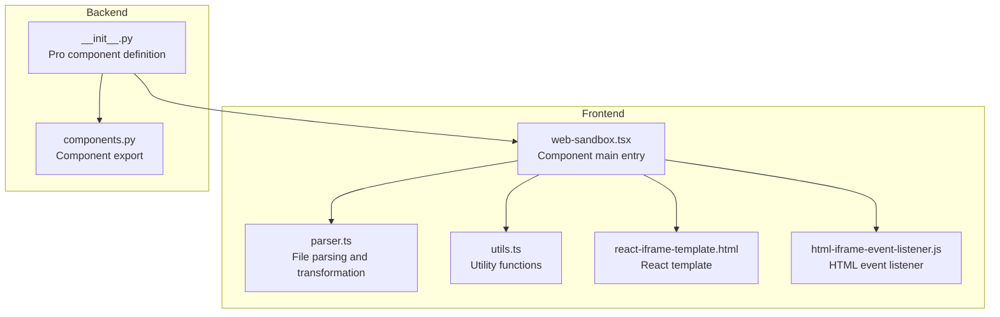
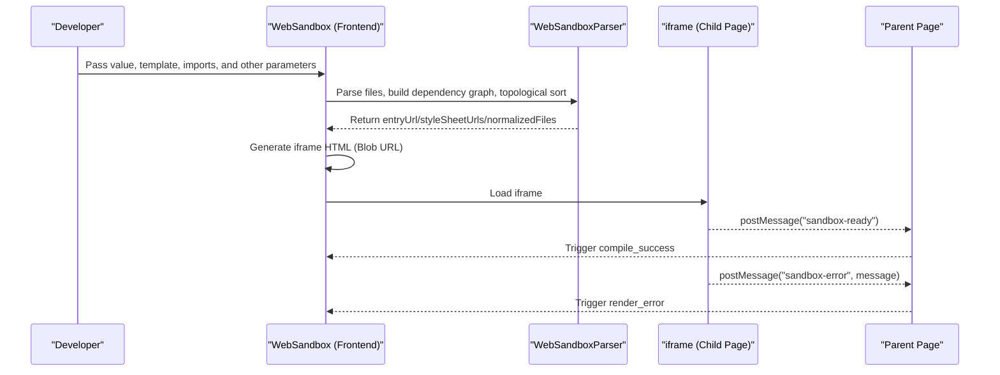
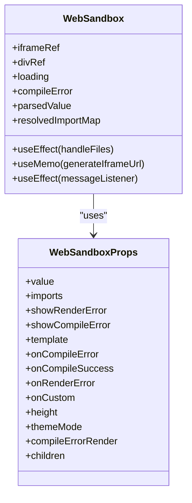
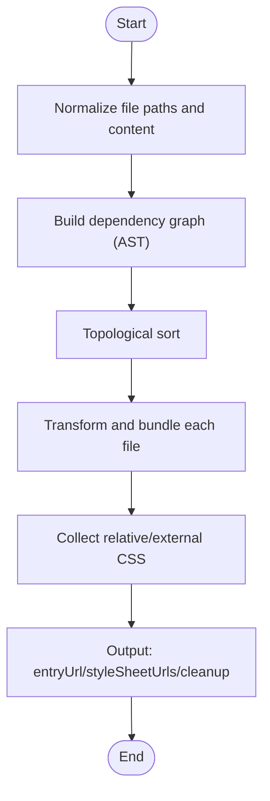
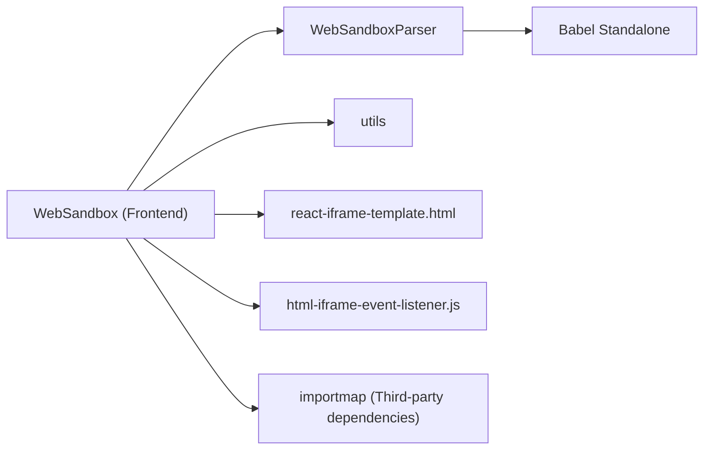

# Component Overview

<cite>
**Files Referenced in This Document**
- [web-sandbox.tsx](file://frontend/pro/web-sandbox/web-sandbox.tsx)
- [parser.ts](file://frontend/pro/web-sandbox/parser.ts)
- [utils.ts](file://frontend/pro/web-sandbox/utils.ts)
- [react-iframe-template.html](file://frontend/pro/web-sandbox/react-iframe-template.html)
- [html-iframe-event-listener.js](file://frontend/pro/web-sandbox/html-iframe-event-listener.js)
- [README.md (WebSandbox Docs)](file://docs/components/pro/web_sandbox/README.md)
- [react.py (Example)](file://docs/components/pro/web_sandbox/demos/react.py)
- [html.py (Example)](file://docs/components/pro/web_sandbox/demos/html.py)
- [error_handling.py (Example)](file://docs/components/pro/web_sandbox/demos/error_handling.py)
- [custom_sandbox_event.py (Example)](file://docs/components/pro/web_sandbox/demos/custom_sandbox_event.py)
- [__init__.py (Backend Component Entry)](file://backend/modelscope_studio/components/pro/web_sandbox/__init__.py)
- [components.py (Backend Component Export)](file://backend/modelscope_studio/components/pro/components.py)
</cite>

## Table of Contents

1. [Introduction](#introduction)
2. [Project Structure](#project-structure)
3. [Core Components](#core-components)
4. [Architecture Overview](#architecture-overview)
5. [Detailed Component Analysis](#detailed-component-analysis)
6. [Dependency Analysis](#dependency-analysis)
7. [Performance Considerations](#performance-considerations)
8. [Troubleshooting Guide](#troubleshooting-guide)
9. [Conclusion](#conclusion)
10. [Appendix: Quick Start and Basic Usage](#appendix-quick-start-and-basic-usage)

## Introduction

WebSandbox is a secure sandbox component for compiling and previewing React or HTML code within a page. It parses, transforms, and bundles user-provided source files, then runs them in an isolated iframe to safely render third-party content. This component is widely applicable for online code demos, tutorial examples, and low-trust frontend content previews.

## Project Structure

The WebSandbox component consists of two parts: frontend and backend.

- **Frontend (Svelte/React)**: Parses and compiles user code, generates iframe content, handles errors and theme injection, and communicates with the parent page.
- **Backend (Python)**: Exposes the component as a Gradio Pro component, binding events and slots for use on the Python side.

Diagram Sources

- [web-sandbox.tsx:1-365](file://frontend/pro/web-sandbox/web-sandbox.tsx#L1-L365)
- [parser.ts:1-314](file://frontend/pro/web-sandbox/parser.ts#L1-L314)
- [utils.ts:1-83](file://frontend/pro/web-sandbox/utils.ts#L1-L83)
- [react-iframe-template.html:1-43](file://frontend/pro/web-sandbox/react-iframe-template.html#L1-L43)
- [html-iframe-event-listener.js:1-13](file://frontend/pro/web-sandbox/html-iframe-event-listener.js#L1-L13)
- [**init**.py (Backend Component Entry):1-86](file://backend/modelscope_studio/components/pro/web_sandbox/__init__.py#L1-L86)
- [components.py (Backend Component Export):1-8](file://backend/modelscope_studio/components/pro/components.py#L1-L8)

Section Sources

- [web-sandbox.tsx:1-365](file://frontend/pro/web-sandbox/web-sandbox.tsx#L1-L365)
- [parser.ts:1-314](file://frontend/pro/web-sandbox/parser.ts#L1-L314)
- [utils.ts:1-83](file://frontend/pro/web-sandbox/utils.ts#L1-L83)
- [react-iframe-template.html:1-43](file://frontend/pro/web-sandbox/react-iframe-template.html#L1-L43)
- [html-iframe-event-listener.js:1-13](file://frontend/pro/web-sandbox/html-iframe-event-listener.js#L1-L13)
- [**init**.py (Backend Component Entry):1-86](file://backend/modelscope_studio/components/pro/web_sandbox/__init__.py#L1-L86)
- [components.py (Backend Component Export):1-8](file://backend/modelscope_studio/components/pro/components.py#L1-L8)

## Core Components

- **Component Name**: WebSandbox (Pro)
- **Purpose**: Compile and render React or HTML code in a securely isolated iframe, supporting error messages, theme injection, and custom event forwarding.
- **Key Capabilities**:
  - Multi-template support: React and HTML template types.
  - Automatic dependency mapping: Injects third-party dependencies (e.g., React ecosystem) via importmap.
  - Compilation and bundling: Transforms and bundles JS/TS/JSX/TSX, inlines relative CSS, and links external CSS.
  - Security isolation: Isolates resources and scripts via Blob URLs and iframes.
  - Error handling: Compile errors and render errors are reported separately with optional display.
  - Theme and events: Injects theme information into the iframe; supports custom events forwarded from iframe to parent page.

Section Sources

- [README.md (WebSandbox Docs):1-70](file://docs/components/pro/web_sandbox/README.md#L1-L70)
- [web-sandbox.tsx:21-35](file://frontend/pro/web-sandbox/web-sandbox.tsx#L21-L35)
- [parser.ts:176-283](file://frontend/pro/web-sandbox/parser.ts#L176-L283)
- [utils.ts:48-75](file://frontend/pro/web-sandbox/utils.ts#L48-L75)

## Architecture Overview

The overall WebSandbox flow includes: receive user files → parse and dependency analysis → transform and bundle → generate iframe content → render and error reporting → theme injection and event forwarding.

Diagram Sources

- [web-sandbox.tsx:94-218](file://frontend/pro/web-sandbox/web-sandbox.tsx#L94-L218)
- [parser.ts:285-312](file://frontend/pro/web-sandbox/parser.ts#L285-L312)
- [react-iframe-template.html:24-28](file://frontend/pro/web-sandbox/react-iframe-template.html#L24-L28)
- [html-iframe-event-listener.js:8-12](file://frontend/pro/web-sandbox/html-iframe-event-listener.js#L8-L12)

## Detailed Component Analysis

### Component Class and Interface (Frontend)

WebSandbox, as a Svelte-wrapped React component, defines props, events, and slots, and internally maintains loading state, compile errors, and parse results.

Diagram Sources

- [web-sandbox.tsx:21-365](file://frontend/pro/web-sandbox/web-sandbox.tsx#L21-L365)

Section Sources

- [web-sandbox.tsx:21-365](file://frontend/pro/web-sandbox/web-sandbox.tsx#L21-L365)

### Parser

WebSandboxParser is responsible for:

- Normalizing file paths and content
- Building the dependency graph (AST analysis of imports)
- Topological sorting to detect circular dependencies
- Transforming and bundling (JS/TS/JSX/TSX), replacing relative imports with Blob URLs, inlining/linking CSS
- Generating entry file URL and stylesheet URL list

Diagram Sources

- [parser.ts:28-312](file://frontend/pro/web-sandbox/parser.ts#L28-L312)

Section Sources

- [parser.ts:14-314](file://frontend/pro/web-sandbox/parser.ts#L14-L314)

### Utility Functions (Utils)

- File extension and default entry file sets
- Path normalization
- Template rendering
- Entry file selection logic

Section Sources

- [utils.ts:1-83](file://frontend/pro/web-sandbox/utils.ts#L1-L83)

### iframe Template and Event Listeners

- **React template**: Injects importmap, stylesheets, and entry module, listens for error and ready events, and notifies the parent page via postMessage.
- **HTML event listener**: Injects event listener script in HTML mode; behavior is consistent with the template.

Section Sources

- [react-iframe-template.html:1-43](file://frontend/pro/web-sandbox/react-iframe-template.html#L1-L43)
- [html-iframe-event-listener.js:1-13](file://frontend/pro/web-sandbox/html-iframe-event-listener.js#L1-L13)

### Backend Component (Python)

- Registers the frontend component as a Pro component, supporting event binding and slot configuration.
- Provides typed file data structures for easy parameter passing on the Python side.

Section Sources

- [**init**.py (Backend Component Entry):1-86](file://backend/modelscope_studio/components/pro/web_sandbox/__init__.py#L1-L86)
- [components.py (Backend Component Export):1-8](file://backend/modelscope_studio/components/pro/components.py#L1-L8)

## Dependency Analysis

- **Component coupling points**:
  - WebSandbox depends on Parser for file parsing and bundling.
  - WebSandbox depends on utility functions from utils (path, entry selection, template rendering).
  - iframe templates and event listener scripts are injected into the iframe via Blob URLs.
- **External dependencies**:
  - importmap for online dependency mapping (e.g., React ecosystem).
  - Babel Standalone for code transformation and AST analysis.
- **Potential circular dependencies**:
  - Parser avoids circular dependencies via topological sorting; circular dependencies will throw an exception.

Diagram Sources

- [web-sandbox.tsx:1-365](file://frontend/pro/web-sandbox/web-sandbox.tsx#L1-L365)
- [parser.ts:1-314](file://frontend/pro/web-sandbox/parser.ts#L1-L314)
- [utils.ts:1-83](file://frontend/pro/web-sandbox/utils.ts#L1-L83)
- [react-iframe-template.html:1-43](file://frontend/pro/web-sandbox/react-iframe-template.html#L1-L43)
- [html-iframe-event-listener.js:1-13](file://frontend/pro/web-sandbox/html-iframe-event-listener.js#L1-L13)

Section Sources

- [web-sandbox.tsx:1-365](file://frontend/pro/web-sandbox/web-sandbox.tsx#L1-L365)
- [parser.ts:1-314](file://frontend/pro/web-sandbox/parser.ts#L1-L314)
- [utils.ts:1-83](file://frontend/pro/web-sandbox/utils.ts#L1-L83)

## Performance Considerations

- **Transformation and bundling cost**: Transformation and AST analysis are performed on each JS/TS file; it is recommended to keep the number and size of files under control.
- **Blob URL management**: Release Blob URLs promptly after bundling to avoid memory leaks.
- **Stylesheet strategy**: Relative CSS is inlined as Blob URLs; external CSS is linked directly to reduce redundant requests.
- **Theme injection and message communication**: Theme is injected only when `iframeUrl` changes to avoid frequent operations.

## Troubleshooting Guide

- **Compile error**
  - Symptom: Component displays a compile error or triggers the `compile_error` event.
  - Diagnosis: Check whether the entry file exists, whether the template type matches, and whether third-party dependencies are correctly mapped.
- **Render error**
  - Symptom: A runtime error occurs inside the iframe, triggering the `render_error` event and displaying a notification (depending on `show_render_error`).
  - Diagnosis: Check the iframe console logs, confirm dependencies and entry module correctness.
- **Circular dependency**
  - Symptom: A circular dependency exception is thrown during the parsing phase.
  - Diagnosis: Inspect import relationships, split modules, or adjust import paths.
- **Theme not applied**
  - Symptom: Theme inside the iframe is not updated.
  - Diagnosis: Confirm that the `themeMode` parameter is passed correctly and that postMessage succeeded.

Section Sources

- [web-sandbox.tsx:244-297](file://frontend/pro/web-sandbox/web-sandbox.tsx#L244-L297)
- [parser.ts:128-174](file://frontend/pro/web-sandbox/parser.ts#L128-L174)
- [README.md (WebSandbox Docs):34-70](file://docs/components/pro/web_sandbox/README.md#L34-L70)

## Conclusion

WebSandbox implements safe rendering of third-party frontend code through a complete pipeline of "parse → transform → bundle → iframe isolation". Its multi-template support, automatic dependency mapping, comprehensive error handling, and event forwarding mechanism make it well-suited for teaching, demonstration, and low-trust content preview scenarios.

## Appendix: Quick Start and Basic Usage

- **Use Cases**
  - Online React demo showcase
  - Instant HTML page preview
  - Forwarding custom events from iframe to Python
  - Visual feedback for compile/render errors
- **Quick Start Steps**
  - Prepare files: Provide file content as a dictionary, specifying the entry file (or use the default entry).
  - Choose a template: Set `template` to `'react'` or `'html'`.
  - Add dependencies: Provide importmap mappings (e.g., React ecosystem) via `imports`.
  - Render the component: Configure height, theme mode, and error handling strategy.
- **Basic Example References**
  - React example: [react.py:1-171](file://docs/components/pro/web_sandbox/demos/react.py#L1-L171)
  - HTML example: [html.py:1-113](file://docs/components/pro/web_sandbox/demos/html.py#L1-L113)
  - Error handling example: [error_handling.py:1-29](file://docs/components/pro/web_sandbox/demos/error_handling.py#L1-L29)
  - Custom event example: [custom_sandbox_event.py:1-27](file://docs/components/pro/web_sandbox/demos/custom_sandbox_event.py#L1-L27)

Section Sources

- [README.md (WebSandbox Docs):1-70](file://docs/components/pro/web_sandbox/README.md#L1-L70)
- [react.py (Example):1-171](file://docs/components/pro/web_sandbox/demos/react.py#L1-L171)
- [html.py (Example):1-113](file://docs/components/pro/web_sandbox/demos/html.py#L1-L113)
- [error_handling.py (Example):1-29](file://docs/components/pro/web_sandbox/demos/error_handling.py#L1-L29)
- [custom_sandbox_event.py (Example):1-27](file://docs/components/pro/web_sandbox/demos/custom_sandbox_event.py#L1-L27)
