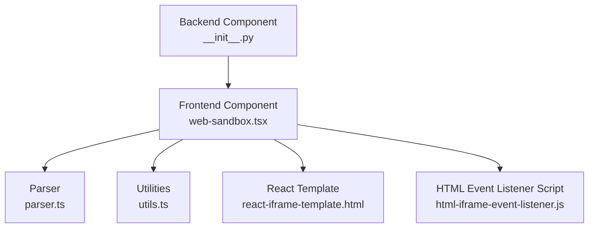
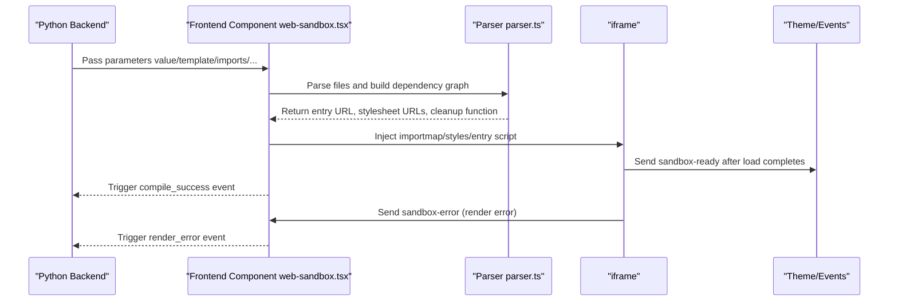
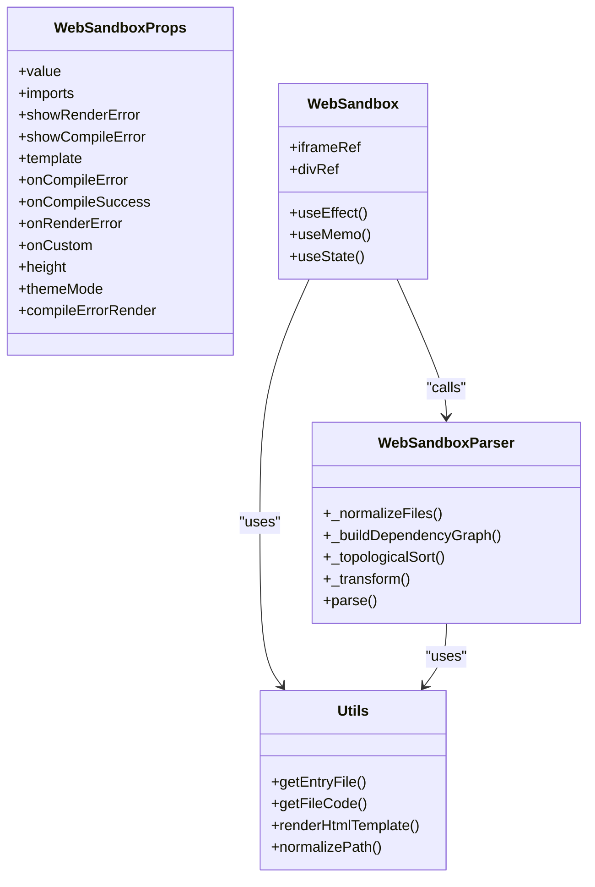

# Configuration Options

<cite>
**Files Referenced in This Document**
- [web_sandbox.tsx](file://frontend/pro/web-sandbox/web-sandbox.tsx)
- [parser.ts](file://frontend/pro/web-sandbox/parser.ts)
- [utils.ts](file://frontend/pro/web-sandbox/utils.ts)
- [react-iframe-template.html](file://frontend/pro/web-sandbox/react-iframe-template.html)
- [html-iframe-event-listener.js](file://frontend/pro/web-sandbox/html-iframe-event-listener.js)
- [__init__.py (Backend Component)](file://backend/modelscope_studio/components/pro/web_sandbox/__init__.py)
- [README (English)](file://docs/components/pro/web_sandbox/README.md)
- [README (Chinese)](file://docs/components/pro/web_sandbox/README-zh_CN.md)
</cite>

## Table of Contents

1. [Introduction](#introduction)
2. [Project Structure](#project-structure)
3. [Core Components](#core-components)
4. [Architecture Overview](#architecture-overview)
5. [Detailed Component Analysis](#detailed-component-analysis)
6. [Dependency Analysis](#dependency-analysis)
7. [Performance Considerations](#performance-considerations)
8. [Troubleshooting Guide](#troubleshooting-guide)
9. [Conclusion](#conclusion)
10. [Appendix](#appendix)

## Introduction

This document is intended for users and maintainers of the WebSandbox component. It systematically covers configuration parameters and behaviors, including the purpose, default values, and applicable scenarios of key parameters such as `template`, `show_render_error`, `show_compile_error`, `imports`, and `height`. It also provides typical configuration examples, best practices, and solutions to common issues to help readers quickly understand and correctly use the component.

## Project Structure

WebSandbox consists of three parts: "backend component definition + frontend rendering implementation + sandbox parsing and bundling tools":

- **Backend component**: Receives parameters from the Python layer, exposes events and slots, and determines the frontend resource directory.
- **Frontend component**: Builds the importmap, parses files, generates Blob URLs, injects them into the iframe, and handles errors and events.
- **Tools and templates**: The parser handles dependency graph construction, topological sorting, and code transformation; templates and event listener scripts manage iframe lifecycle and error reporting.

**Diagram Sources**

- [**init**.py (Backend Component):15-73](file://backend/modelscope_studio/components/pro/web_sandbox/__init__.py#L15-L73)
- [web_sandbox.tsx:37-365](file://frontend/pro/web-sandbox/web-sandbox.tsx#L37-L365)
- [parser.ts:14-314](file://frontend/pro/web-sandbox/parser.ts#L14-L314)
- [utils.ts:1-83](file://frontend/pro/web-sandbox/utils.ts#L1-L83)
- [react-iframe-template.html:1-43](file://frontend/pro/web-sandbox/react-iframe-template.html#L1-L43)
- [html-iframe-event-listener.js:1-13](file://frontend/pro/web-sandbox/html-iframe-event-listener.js#L1-L13)

**Section Sources**

- [**init**.py (Backend Component):15-73](file://backend/modelscope_studio/components/pro/web_sandbox/__init__.py#L15-L73)
- [web_sandbox.tsx:37-365](file://frontend/pro/web-sandbox/web-sandbox.tsx#L37-L365)
- [parser.ts:14-314](file://frontend/pro/web-sandbox/parser.ts#L14-L314)
- [utils.ts:1-83](file://frontend/pro/web-sandbox/utils.ts#L1-L83)
- [react-iframe-template.html:1-43](file://frontend/pro/web-sandbox/react-iframe-template.html#L1-L43)
- [html-iframe-event-listener.js:1-13](file://frontend/pro/web-sandbox/html-iframe-event-listener.js#L1-L13)

## Core Components

- **Backend component class**: Defines the component's constructor parameters, event bindings, and frontend resource directory mapping.
- **Frontend component**: Receives props, builds importmap, parses files and generates iframe content, handles compile and render errors, and dispatches events.
- **Parser**: Builds a dependency graph from input files, performs topological sorting followed by code transformation, and generates Blob URLs and stylesheet links.
- **Utilities**: Provides default entry file lists, path normalization, template rendering, and entry file selection helpers.
- **Templates and event listeners**: Inject importmap and styles into the React template; listen for load completion and error events and report them via postMessage.

**Section Sources**

- [**init**.py (Backend Component):15-73](file://backend/modelscope_studio/components/pro/web_sandbox/__init__.py#L15-L73)
- [web_sandbox.tsx:37-365](file://frontend/pro/web-sandbox/web-sandbox.tsx#L37-L365)
- [parser.ts:14-314](file://frontend/pro/web-sandbox/parser.ts#L14-L314)
- [utils.ts:20-83](file://frontend/pro/web-sandbox/utils.ts#L20-L83)
- [react-iframe-template.html:7-42](file://frontend/pro/web-sandbox/react-iframe-template.html#L7-L42)
- [html-iframe-event-listener.js:1-13](file://frontend/pro/web-sandbox/html-iframe-event-listener.js#L1-L13)

## Architecture Overview

The diagram below shows the overall flow from backend to frontend to iframe: backend passes parameters → frontend builds importmap and parses files → generates iframe content → main window listens for messages and handles error and success events.

**Diagram Sources**

- [web_sandbox.tsx:79-218](file://frontend/pro/web-sandbox/web-sandbox.tsx#L79-L218)
- [parser.ts:285-312](file://frontend/pro/web-sandbox/parser.ts#L285-L312)
- [react-iframe-template.html:16-40](file://frontend/pro/web-sandbox/react-iframe-template.html#L16-L40)
- [html-iframe-event-listener.js:1-13](file://frontend/pro/web-sandbox/html-iframe-event-listener.js#L1-L13)

## Detailed Component Analysis

### Parameter Overview and Defaults

- **template**
  - Type: `'react'` | `'html'`
  - Default: `'react'`
  - Purpose: Determines the rendering template type, affecting the default entry file and automatically injected React dependencies.
  - Use case: Previewing React or HTML code.
- **show_render_error**
  - Type: `bool`
  - Default: `True`
  - Purpose: Whether to display a notification and trigger an event callback when a render-time error occurs.
  - Use case: Show runtime errors explicitly during development and debugging.
- **show_compile_error**
  - Type: `bool`
  - Default: `True`
  - Purpose: Whether to display an error UI when compilation fails (can be replaced with a custom slot or function).
  - Use case: Directly display compile error messages in the UI.
- **compile_error_render**
  - Type: `str | None`
  - Default: `None`
  - Purpose: A JavaScript function string for customizing the compile failure rendering logic.
  - Use case: Need more refined error display or theme-consistent styling.
- **imports**
  - Type: `Dict[str, str] | None`
  - Default: `None`
  - Purpose: Corresponds to the `imports` field of importmap, used for adding online dependencies. When `template='react'`, React-related dependencies are automatically injected.
  - Use case: Importing third-party libraries, CDN resources, or overriding the default React version.
- **height**
  - Type: `str | float | int`
  - Default: `400`
  - Purpose: Component height; a number represents pixels, a string represents a CSS unit.
  - Use case: Adapting to different layouts and responsive requirements.

**Section Sources**

- [README (English):38-46](file://docs/components/pro/web_sandbox/README.md#L38-L46)
- [README (Chinese):38-46](file://docs/components/pro/web_sandbox/README-zh_CN.md#L38-L46)
- [web_sandbox.tsx:21-35](file://frontend/pro/web-sandbox/web-sandbox.tsx#L21-L35)
- [**init**.py (Backend Component):37-67](file://backend/modelscope_studio/components/pro/web_sandbox/__init__.py#L37-L67)

### Parameter Details and Behavior

#### template

- **Impact points**:
  - Default entry file: When `template='react'`, the default entry is `index.tsx/index.jsx/index.ts/index.js`; when `template='html'`, the default entry is `index.html`.
  - Automatic React dependency injection: When `template='react'` and `imports` does not override, CDN mappings for `react` and `react-dom` are automatically added.
- **Typical usage**:
  - Preview a React app: `template='react'`, provide the entry file (e.g., `index.tsx`).
  - Preview static HTML: `template='html'`, provide `index.html`.
- **Notes**:
  - If multiple candidate entry files are provided, use the `is_entry` flag to explicitly mark the main entry.

**Section Sources**

- [utils.ts:20-26](file://frontend/pro/web-sandbox/utils.ts#L20-L26)
- [utils.ts:48-75](file://frontend/pro/web-sandbox/utils.ts#L48-L75)
- [web_sandbox.tsx:80-92](file://frontend/pro/web-sandbox/web-sandbox.tsx#L80-L92)

#### show_render_error

- **Behavior**:
  - When a render error occurs inside the iframe (captured by `window.error` or the HTML event listener), if enabled, a notification is displayed and the `render_error` event is triggered.
- **Recommendations**:
  - Keep it `True` during development for quick problem identification.
  - Can be disabled in production based on business policy to avoid exposing low-level errors to users.

**Section Sources**

- [web_sandbox.tsx:262-281](file://frontend/pro/web-sandbox/web-sandbox.tsx#L262-L281)
- [html-iframe-event-listener.js:1-13](file://frontend/pro/web-sandbox/html-iframe-event-listener.js#L1-L13)

#### show_compile_error

- **Behavior**:
  - When compilation fails (parser throws an error or entry is missing), if enabled, an error UI is displayed; otherwise, no error interface is shown.
  - Can be combined with `compile_error_render` or the `compileErrorRender` slot for custom display.
- **Recommendations**:
  - Recommended to enable when there are many frontend errors so users can intuitively perceive problems.

**Section Sources**

- [web_sandbox.tsx:317-342](file://frontend/pro/web-sandbox/web-sandbox.tsx#L317-L342)
- [web_sandbox.tsx:203-217](file://frontend/pro/web-sandbox/web-sandbox.tsx#L203-L217)

#### compile_error_render

- **Behavior**:
  - Accepts a JavaScript function string to customize compile failure rendering.
  - Can also be provided as a React node via the `compileErrorRender` slot.
- **Recommendations**:
  - Use theme-consistent error styling, or add interactive elements like retry buttons or copy error info.

**Section Sources**

- [web_sandbox.tsx:317-342](file://frontend/pro/web-sandbox/web-sandbox.tsx#L317-L342)
- [**init**.py (Backend Component):35-35](file://backend/modelscope_studio/components/pro/web_sandbox/__init__.py#L35-L35)

#### imports

- **Behavior**:
  - Used as `importmap.imports`. When `template='react'`, built-in React mappings are merged first, then user-provided `imports` are layered on top.
  - Supports overriding the default React version or adding other dependencies.
- **Recommendations**:
  - Prefer stable CDNs; ensure cross-origin accessibility.
  - For local dependencies, consider bundling strategies or Blob URL approaches.

**Section Sources**

- [web_sandbox.tsx:80-92](file://frontend/pro/web-sandbox/web-sandbox.tsx#L80-L92)
- [README (English):45-45](file://docs/components/pro/web_sandbox/README.md#L45-L45)
- [README (Chinese):45-45](file://docs/components/pro/web_sandbox/README-zh_CN.md#L45-L45)

#### height

- **Behavior**:
  - Number: interpreted in pixels; string: parsed as CSS units.
- **Recommendations**:
  - Maintain consistent unit style within the container layout; works more flexibly with CSS Grid/Flex.

**Section Sources**

- [web_sandbox.tsx:312-315](file://frontend/pro/web-sandbox/web-sandbox.tsx#L312-L315)
- [README (English):46-46](file://docs/components/pro/web_sandbox/README.md#L46-L46)
- [README (Chinese):46-46](file://docs/components/pro/web_sandbox/README-zh_CN.md#L46-L46)

### Typical Configuration Combinations

- **Preview a React app (default)**
  - `template='react'`, `imports` empty or only overriding the React version, `value` provides the entry file.
- **Preview an HTML page**
  - `template='html'`, `value` provides `index.html`, inline scripts in HTML if necessary.
- **Custom error display**
  - `show_compile_error=True`, `compile_error_render` provides a function string or use the `compileErrorRender` slot.
- **Adaptive height**
  - `height='100%'` or a specific pixel value, combined with parent container layout.

**Section Sources**

- [README (English):7-18](file://docs/components/pro/web_sandbox/README.md#L7-L18)
- [README (Chinese):7-18](file://docs/components/pro/web_sandbox/README-zh_CN.md#L7-L18)
- [web_sandbox.tsx:317-342](file://frontend/pro/web-sandbox/web-sandbox.tsx#L317-L342)

## Dependency Analysis

- The frontend component depends on the parser and utilities; the parser internally uses Babel Standalone for code transformation and dependency analysis.
- Templates and event listener scripts are injected into the iframe, managing lifecycle and error reporting.
- The backend component defines events and slots; the frontend component binds and triggers them at runtime.

**Diagram Sources**

- [web_sandbox.tsx:21-35](file://frontend/pro/web-sandbox/web-sandbox.tsx#L21-L35)
- [web_sandbox.tsx:37-365](file://frontend/pro/web-sandbox/web-sandbox.tsx#L37-L365)
- [parser.ts:14-314](file://frontend/pro/web-sandbox/parser.ts#L14-L314)
- [utils.ts:1-83](file://frontend/pro/web-sandbox/utils.ts#L1-L83)

**Section Sources**

- [web_sandbox.tsx:37-365](file://frontend/pro/web-sandbox/web-sandbox.tsx#L37-L365)
- [parser.ts:14-314](file://frontend/pro/web-sandbox/parser.ts#L14-L314)
- [utils.ts:1-83](file://frontend/pro/web-sandbox/utils.ts#L1-L83)

## Performance Considerations

- **Compilation and transformation**
  - The parser performs transformation and dependency analysis on each JS/CSS file; the number and size of files directly affect compile time.
  - Recommendation: Reduce unnecessary dependencies, split entry files, and avoid circular dependencies.
- **Blob URLs and memory**
  - Transformed code and styles generate Blob URLs that are reclaimed when the component unmounts; still monitor memory usage with large numbers of files.
- **iframe rendering**
  - The React template injects importmap and entry modules; initial loading may be affected by network and CDN performance.
- **Theme and events**
  - Theme switching is passed via postMessage to avoid frequent redraws; error notifications only appear when the relevant switch is enabled.

[This section contains general performance recommendations with no specific file references]

## Troubleshooting Guide

- **Compilation failure**
  - Symptom: UI displays a compile error or triggers the `compile_error` event.
  - Diagnosis points:
    - Check whether there is a valid entry file in `value` (default filename for the template type or an `is_entry` marker).
    - Check whether dependencies in `imports` are accessible and match the template type.
    - Check whether the error message contains specific files and error stack traces.
- **Render error**
  - Symptom: An error is thrown inside the iframe; the main window shows a notification and triggers the `render_error` event.
  - Diagnosis points:
    - Disable `show_render_error` and observe if the error still occurs, to determine if the error is caused by the UI display.
    - Check that importmap and styles are correctly injected into the template.
- **Circular dependency**
  - Symptom: The parser throws a circular dependency error.
  - Diagnosis points:
    - Inspect inter-file import relationships; split or abstract common modules.
- **Height issue**
  - Symptom: Content is clipped or scrollbar behavior is abnormal.
  - Diagnosis points:
    - Confirm that the `height` input format (number vs. CSS unit string) is consistent with the parent container dimensions.

**Section Sources**

- [web_sandbox.tsx:203-217](file://frontend/pro/web-sandbox/web-sandbox.tsx#L203-L217)
- [web_sandbox.tsx:262-281](file://frontend/pro/web-sandbox/web-sandbox.tsx#L262-L281)
- [parser.ts:128-174](file://frontend/pro/web-sandbox/parser.ts#L128-L174)
- [react-iframe-template.html:7-12](file://frontend/pro/web-sandbox/react-iframe-template.html#L7-L12)

## Conclusion

WebSandbox provides a safe and controlled sandbox preview capability for React and HTML code through a clear parameter system and comprehensive error handling mechanism. Properly configuring `template`, `imports`, `show_*` toggles, and `height` can meet the needs of various scenarios from development debugging to production display. For complex projects, it is recommended to standardize dependency and entry file naming first, and combine custom error display to improve observability and user experience.

[This section is a summary with no specific file references]

## Appendix

### API Reference (Parameters, Events, Slots)

- **Parameters**
  - `value`: File collection; `template`: `'react'|'html'`; `imports`: importmap.imports; `show_render_error`/`show_compile_error`: Boolean toggles; `compile_error_render`: JS function string; `height`: height.
- **Events**
  - `compile_success`, `compile_error`, `render_error`, `custom`.
- **Slots**
  - `compileErrorRender`.

**Section Sources**

- [README (English):38-61](file://docs/components/pro/web_sandbox/README.md#L38-L61)
- [README (Chinese):38-70](file://docs/components/pro/web_sandbox/README-zh_CN.md#L38-L70)
- [**init**.py (Backend Component):19-35](file://backend/modelscope_studio/components/pro/web_sandbox/__init__.py#L19-L35)
