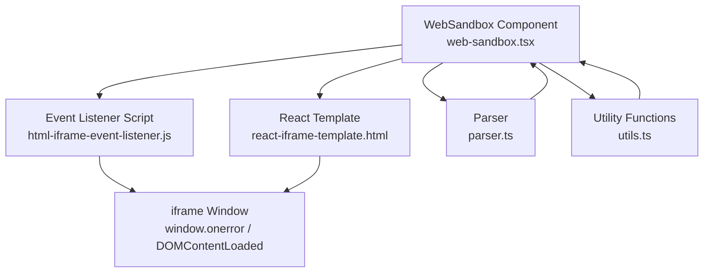
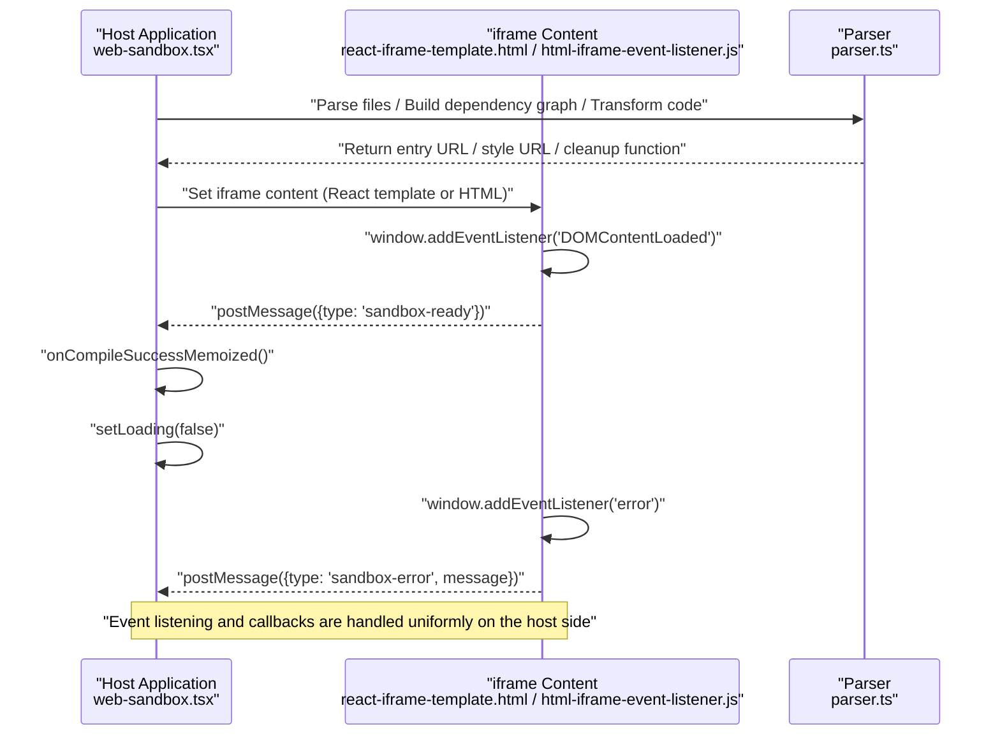
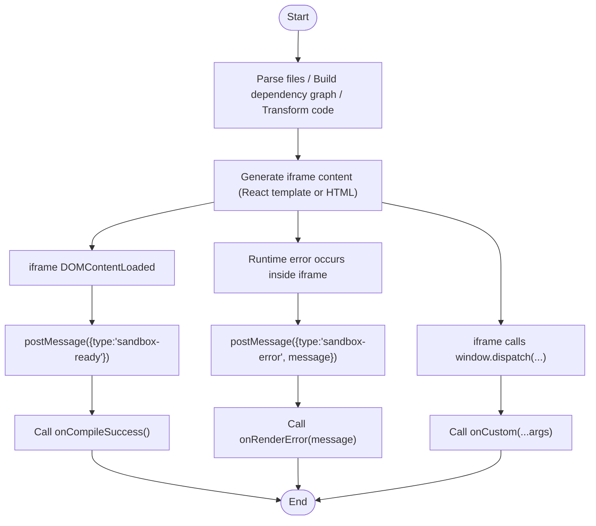
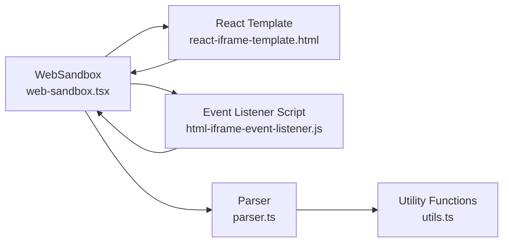

# Event Handling

<cite>
**Files Referenced in This Document**
- [web-sandbox.tsx](file://frontend/pro/web-sandbox/web-sandbox.tsx)
- [html-iframe-event-listener.js](file://frontend/pro/web-sandbox/html-iframe-event-listener.js)
- [react-iframe-template.html](file://frontend/pro/web-sandbox/react-iframe-template.html)
- [parser.ts](file://frontend/pro/web-sandbox/parser.ts)
- [utils.ts](file://frontend/pro/web-sandbox/utils.ts)
- [README.md](file://docs/components/pro/web_sandbox/README.md)
</cite>

## Table of Contents

1. [Introduction](#introduction)
2. [Project Structure](#project-structure)
3. [Core Components](#core-components)
4. [Architecture Overview](#architecture-overview)
5. [Detailed Component Analysis](#detailed-component-analysis)
6. [Dependency Analysis](#dependency-analysis)
7. [Performance Considerations](#performance-considerations)
8. [Troubleshooting Guide](#troubleshooting-guide)
9. [Conclusion](#conclusion)

## Introduction

This chapter is intended for developers using the WebSandbox component. It systematically explains the event types supported by the component, when they are triggered, callback parameters, and usage patterns. It also analyzes the relationship between events and the sandbox security mechanism based on the source code, and provides reference paths, debugging tips, and troubleshooting guidance to help quickly identify issues and achieve stable integration.

## Project Structure

WebSandbox resides in the frontend `pro` component directory. Its core consists of the following files:

- Component implementation: web-sandbox.tsx
- Sandbox iframe event listener script: html-iframe-event-listener.js
- React template (iframe content): react-iframe-template.html
- File parsing and bundling: parser.ts
- Utility functions: utils.ts
- Documentation and examples: docs/components/pro/web_sandbox/README.md

Diagram Sources

- [web-sandbox.tsx:1-365](file://frontend/pro/web-sandbox/web-sandbox.tsx#L1-L365)
- [html-iframe-event-listener.js:1-13](file://frontend/pro/web-sandbox/html-iframe-event-listener.js#L1-L13)
- [react-iframe-template.html:1-43](file://frontend/pro/web-sandbox/react-iframe-template.html#L1-L43)
- [parser.ts:1-314](file://frontend/pro/web-sandbox/parser.ts#L1-L314)
- [utils.ts:1-83](file://frontend/pro/web-sandbox/utils.ts#L1-L83)

Section Sources

- [web-sandbox.tsx:1-365](file://frontend/pro/web-sandbox/web-sandbox.tsx#L1-L365)
- [README.md:1-70](file://docs/components/pro/web_sandbox/README.md#L1-L70)

## Core Components

WebSandbox is a sandbox component that renders React or HTML code inside an iframe on the page. It is responsible for:

- Parsing the incoming file set, building a dependency graph, and performing transformation
- Generating styles and entry resources, injecting them into the iframe
- Passing events between the host and iframe via postMessage
- Exposing event callbacks for the compile and render phases to the caller

Section Sources

- [web-sandbox.tsx:21-35](file://frontend/pro/web-sandbox/web-sandbox.tsx#L21-L35)
- [web-sandbox.tsx:79-92](file://frontend/pro/web-sandbox/web-sandbox.tsx#L79-L92)
- [web-sandbox.tsx:284-297](file://frontend/pro/web-sandbox/web-sandbox.tsx#L284-L297)

## Architecture Overview

WebSandbox's event flow originates from inside the iframe, is forwarded via window event listeners as postMessage, and is then received by the host listening to window messages and dispatched to corresponding callbacks.

Diagram Sources

- [web-sandbox.tsx:244-297](file://frontend/pro/web-sandbox/web-sandbox.tsx#L244-L297)
- [react-iframe-template.html:17-28](file://frontend/pro/web-sandbox/react-iframe-template.html#L17-L28)
- [html-iframe-event-listener.js:1-13](file://frontend/pro/web-sandbox/html-iframe-event-listener.js#L1-L13)

## Detailed Component Analysis

### Event Types and Trigger Timing

- **compile_success** (Compilation Success)
  - Trigger: After `DOMContentLoaded` fires inside the iframe, a `sandbox-ready` message is sent to the parent window; the host calls the `onCompileSuccess` callback upon receiving the message.
  - Callback parameters: None
  - Usage: Register an `onCompileSuccess` callback on WebSandbox to execute subsequent logic when the sandbox is ready (e.g., hiding loading state, enabling interactions).
  - Reference paths:
    - [web-sandbox.tsx:277-279](file://frontend/pro/web-sandbox/web-sandbox.tsx#L277-L279)
    - [react-iframe-template.html:24-28](file://frontend/pro/web-sandbox/react-iframe-template.html#L24-L28)

- **compile_error** (Compilation Error)
  - Trigger: When an exception occurs during parsing and transformation, the component catches it and calls the `onCompileError` callback; the error message is also saved to local state and can be combined with `showCompileError` and `compileErrorRender` to control error display.
  - Callback parameters: `message` (string)
  - Usage: Register an `onCompileError` callback on WebSandbox for logging, reporting, or guiding users to fix their code.
  - Reference paths:
    - [web-sandbox.tsx:203-218](file://frontend/pro/web-sandbox/web-sandbox.tsx#L203-L218)
    - [parser.ts:285-312](file://frontend/pro/web-sandbox/parser.ts#L285-L312)

- **render_error** (Render Error)
  - Trigger: When a runtime error occurs inside the iframe (`window.onerror`), a `sandbox-error` message is sent to the parent window; the host calls the `onRenderError` callback and decides whether to show a notification based on `showRenderError`.
  - Callback parameters: `message` (string)
  - Usage: Register an `onRenderError` callback on WebSandbox to catch render-time exceptions and perform fallback handling.
  - Reference paths:
    - [web-sandbox.tsx:267-276](file://frontend/pro/web-sandbox/web-sandbox.tsx#L267-L276)
    - [html-iframe-event-listener.js:1-6](file://frontend/pro/web-sandbox/html-iframe-event-listener.js#L1-L6)
    - [react-iframe-template.html:17-22](file://frontend/pro/web-sandbox/react-iframe-template.html#L17-L22)

- **custom** (Custom Event)
  - Trigger: The host injects a `dispatch` function into the iframe's `window`; code inside the iframe can actively dispatch custom events to the host via `window.dispatch(...args)`; the host calls the `onCustom` callback upon receiving the message.
  - Callback parameters: `...args` (any parameter sequence)
  - Usage: Register an `onCustom` callback on WebSandbox to receive custom business events from inside the iframe (e.g., clicks, state changes).
  - Reference paths:
    - [web-sandbox.tsx:249-256](file://frontend/pro/web-sandbox/web-sandbox.tsx#L249-L256)
    - [web-sandbox.tsx:299-306](file://frontend/pro/web-sandbox/web-sandbox.tsx#L299-L306)

Section Sources

- [web-sandbox.tsx:262-297](file://frontend/pro/web-sandbox/web-sandbox.tsx#L262-L297)
- [html-iframe-event-listener.js:1-13](file://frontend/pro/web-sandbox/html-iframe-event-listener.js#L1-L13)
- [react-iframe-template.html:17-28](file://frontend/pro/web-sandbox/react-iframe-template.html#L17-L28)
- [README.md:48-56](file://docs/components/pro/web_sandbox/README.md#L48-L56)

### Event Listening and Handling Flow

Diagram Sources

- [web-sandbox.tsx:244-297](file://frontend/pro/web-sandbox/web-sandbox.tsx#L244-L297)
- [react-iframe-template.html:24-28](file://frontend/pro/web-sandbox/react-iframe-template.html#L24-L28)
- [html-iframe-event-listener.js:1-6](file://frontend/pro/web-sandbox/html-iframe-event-listener.js#L1-L6)

### Relationship Between Events and Sandbox Security Mechanism

- **Same-origin policy and postMessage**: The iframe and host communicate via postMessage, avoiding direct cross-origin access and reducing XSS risks.
- **Only necessary interfaces exposed**: The host injects `dispatch` into the iframe's `window`, allowing the iframe to actively report events, but it cannot directly access the host's DOM or global objects.
- **Error isolation**: Errors inside the iframe are captured via `window.onerror` and reported without disrupting the host runtime environment.
- **Theme injection**: The host injects the theme mode via postMessage; the iframe can only read this read-only information and cannot tamper with the host context.
- Reference paths:
  - [web-sandbox.tsx:249-261](file://frontend/pro/web-sandbox/web-sandbox.tsx#L249-L261)
  - [html-iframe-event-listener.js:1-6](file://frontend/pro/web-sandbox/html-iframe-event-listener.js#L1-L6)
  - [react-iframe-template.html:17-22](file://frontend/pro/web-sandbox/react-iframe-template.html#L17-L22)

Section Sources

- [web-sandbox.tsx:249-261](file://frontend/pro/web-sandbox/web-sandbox.tsx#L249-L261)
- [html-iframe-event-listener.js:1-6](file://frontend/pro/web-sandbox/html-iframe-event-listener.js#L1-L6)
- [react-iframe-template.html:17-22](file://frontend/pro/web-sandbox/react-iframe-template.html#L17-L22)

### Complete Examples of Event Listening and Handling (Reference Paths)

- React template example (HTML/JSX/TSX entry files)
  - [react-iframe-template.html:30-40](file://frontend/pro/web-sandbox/react-iframe-template.html#L30-L40)
- Compile error handling (`onCompileError`)
  - [web-sandbox.tsx:203-218](file://frontend/pro/web-sandbox/web-sandbox.tsx#L203-L218)
- Render error handling (`onRenderError`)
  - [web-sandbox.tsx:267-276](file://frontend/pro/web-sandbox/web-sandbox.tsx#L267-L276)
- Compile success handling (`onCompileSuccess`)
  - [web-sandbox.tsx:277-279](file://frontend/pro/web-sandbox/web-sandbox.tsx#L277-L279)
- Custom event handling (`onCustom`)
  - [web-sandbox.tsx:249-256](file://frontend/pro/web-sandbox/web-sandbox.tsx#L249-L256)

Section Sources

- [react-iframe-template.html:30-40](file://frontend/pro/web-sandbox/react-iframe-template.html#L30-L40)
- [web-sandbox.tsx:203-218](file://frontend/pro/web-sandbox/web-sandbox.tsx#L203-L218)
- [web-sandbox.tsx:267-276](file://frontend/pro/web-sandbox/web-sandbox.tsx#L267-L276)
- [web-sandbox.tsx:277-279](file://frontend/pro/web-sandbox/web-sandbox.tsx#L277-L279)
- [web-sandbox.tsx:249-256](file://frontend/pro/web-sandbox/web-sandbox.tsx#L249-L256)

## Dependency Analysis

- **Component and template/script coupling**
  - WebSandbox injects importmap, styles, and entry modules via `react-iframe-template.html`; it uses `html-iframe-event-listener.js` to uniformly forward error and ready events.
- **Parser and utility functions**
  - `parser.ts` handles dependency analysis, transformation, and resource generation; `utils.ts` provides path normalization, entry file selection, and other helpers.
- **Event source and destination**
  - Event source: `window.onerror` and `DOMContentLoaded` inside the iframe; `dispatch` calls from inside the iframe
  - Event destination: Host window message listener dispatches to `onCompileSuccess` / `onCompileError` / `onRenderError` / `onCustom`

Diagram Sources

- [web-sandbox.tsx:1-20](file://frontend/pro/web-sandbox/web-sandbox.tsx#L1-L20)
- [react-iframe-template.html:1-43](file://frontend/pro/web-sandbox/react-iframe-template.html#L1-L43)
- [html-iframe-event-listener.js:1-13](file://frontend/pro/web-sandbox/html-iframe-event-listener.js#L1-L13)
- [parser.ts:1-314](file://frontend/pro/web-sandbox/parser.ts#L1-L314)
- [utils.ts:1-83](file://frontend/pro/web-sandbox/utils.ts#L1-L83)

Section Sources

- [web-sandbox.tsx:1-20](file://frontend/pro/web-sandbox/web-sandbox.tsx#L1-L20)
- [parser.ts:1-314](file://frontend/pro/web-sandbox/parser.ts#L1-L314)
- [utils.ts:1-83](file://frontend/pro/web-sandbox/utils.ts#L1-L83)

## Performance Considerations

- **Resource release**: Blob URLs generated by the parser are reclaimed uniformly in the cleanup function to prevent memory leaks.
  - Reference path: [parser.ts:306-311](file://frontend/pro/web-sandbox/parser.ts#L306-L311)
- **Loading state control**: Close the loading state promptly after successful compilation to improve user experience.
  - Reference path: [web-sandbox.tsx:277-279](file://frontend/pro/web-sandbox/web-sandbox.tsx#L277-L279)
- **Event listener deduplication**: The component rebinds the window message listener when `iframeUrl` updates, ensuring no duplicate bindings that could cause performance issues.
  - Reference path: [web-sandbox.tsx:284-288](file://frontend/pro/web-sandbox/web-sandbox.tsx#L284-L288)

## Troubleshooting Guide

- **Compile error (compile_error)**
  - Symptom: Component displays an error area or triggers the `onCompileError` callback
  - Diagnosis:
    - Check whether the entry file is correct (default entry for `template='react'` is `index.*`; for `html` it's `index.html`)
      - Reference path: [utils.ts:48-75](file://frontend/pro/web-sandbox/utils.ts#L48-L75)
    - Check whether third-party dependency mappings (`imports`) are correct
      - Reference path: [web-sandbox.tsx:79-92](file://frontend/pro/web-sandbox/web-sandbox.tsx#L79-L92)
    - Check the error stack thrown by the parser (circular dependencies, syntax errors, etc.)
      - Reference path: [parser.ts:166-170](file://frontend/pro/web-sandbox/parser.ts#L166-L170), [parser.ts:292-298](file://frontend/pro/web-sandbox/parser.ts#L292-L298)
- **Render error (render_error)**
  - Symptom: Runtime error inside the iframe triggers the `onRenderError` callback
  - Diagnosis:
    - Confirm that the entry module exported by the template is a function (React component)
      - Reference path: [react-iframe-template.html:35-39](file://frontend/pro/web-sandbox/react-iframe-template.html#L35-L39)
    - Check whether styles and importmap are correctly injected
      - Reference path: [react-iframe-template.html:7-12](file://frontend/pro/web-sandbox/react-iframe-template.html#L7-L12)
- **Custom event (custom)**
  - Symptom: Code inside the iframe actively reports an event via `window.dispatch(...)`, triggering the `onCustom` callback on the host
  - Diagnosis:
    - Confirm that the host has injected `dispatch` into the iframe's `window`
      - Reference path: [web-sandbox.tsx:249-256](file://frontend/pro/web-sandbox/web-sandbox.tsx#L249-L256)
- **Event not triggered**
  - Symptom: Compile success or render error events are not called back
  - Diagnosis:
    - Confirm that the event listener script is correctly injected inside the iframe
      - Reference path: [react-iframe-template.html:17-28](file://frontend/pro/web-sandbox/react-iframe-template.html#L17-L28), [html-iframe-event-listener.js:1-13](file://frontend/pro/web-sandbox/html-iframe-event-listener.js#L1-L13)
    - Confirm that the host window message listener is correctly bound and unbound
      - Reference path: [web-sandbox.tsx:284-288](file://frontend/pro/web-sandbox/web-sandbox.tsx#L284-L288)

Section Sources

- [utils.ts:48-75](file://frontend/pro/web-sandbox/utils.ts#L48-L75)
- [parser.ts:166-170](file://frontend/pro/web-sandbox/parser.ts#L166-L170)
- [parser.ts:292-298](file://frontend/pro/web-sandbox/parser.ts#L292-L298)
- [react-iframe-template.html:35-39](file://frontend/pro/web-sandbox/react-iframe-template.html#L35-L39)
- [react-iframe-template.html:7-12](file://frontend/pro/web-sandbox/react-iframe-template.html#L7-L12)
- [web-sandbox.tsx:249-256](file://frontend/pro/web-sandbox/web-sandbox.tsx#L249-L256)
- [web-sandbox.tsx:284-288](file://frontend/pro/web-sandbox/web-sandbox.tsx#L284-L288)

## Conclusion

WebSandbox provides controllable, observable, and easily extensible capabilities for frontend code preview through a standardized event model (`compile_success`, `compile_error`, `render_error`, `custom`) and iframe security boundaries. By making proper use of event callbacks and error handling mechanisms, rich interactive and debugging experiences can be achieved while maintaining security.
