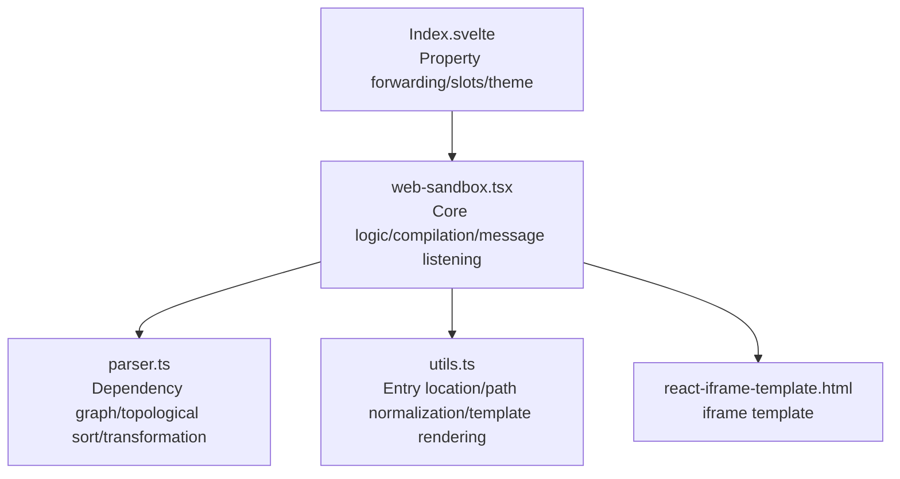
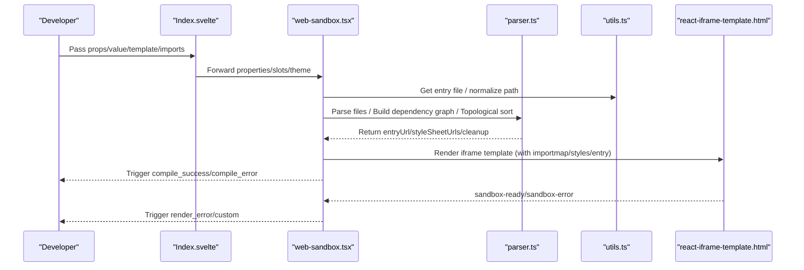
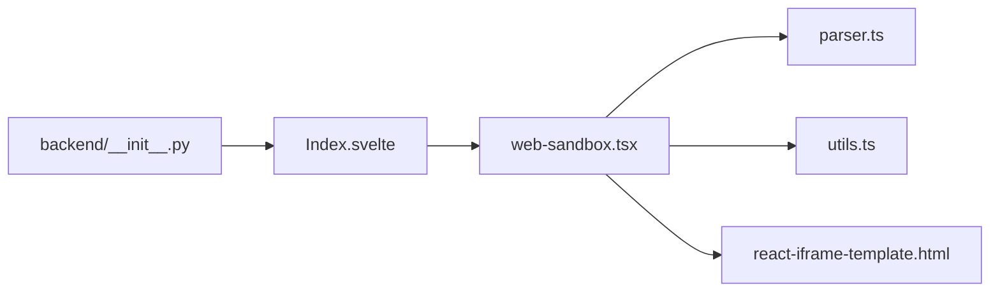

# Integration Examples

<cite>
**Files Referenced in This Document**
- [web-sandbox.tsx](file://frontend/pro/web-sandbox/web-sandbox.tsx)
- [Index.svelte](file://frontend/pro/web-sandbox/Index.svelte)
- [parser.ts](file://frontend/pro/web-sandbox/parser.ts)
- [utils.ts](file://frontend/pro/web-sandbox/utils.ts)
- [react-iframe-template.html](file://frontend/pro/web-sandbox/react-iframe-template.html)
- [README-zh_CN.md](file://docs/components/pro/web_sandbox/README-zh_CN.md)
- [__init__.py](file://backend/modelscope_studio/components/pro/web_sandbox/__init__.py)
</cite>

## Table of Contents

1. [Introduction](#introduction)
2. [Project Structure](#project-structure)
3. [Core Components](#core-components)
4. [Architecture Overview](#architecture-overview)
5. [Detailed Component Analysis](#detailed-component-analysis)
6. [Dependency Analysis](#dependency-analysis)
7. [Performance Considerations](#performance-considerations)
8. [Troubleshooting Guide](#troubleshooting-guide)
9. [Conclusion](#conclusion)
10. [Appendix](#appendix)

## Introduction

This document is intended for developers and systematically introduces the usage and best practices of the WebSandbox component, covering:

- HTML rendering examples and considerations
- React component rendering examples and template type selection
- Error handling and event communication
- Complex scenarios: dynamic content rendering, event communication, and style customization
- A progressive example path from simple to complex
- Complete runnable example descriptions (provided as "code snippet paths")

The goal is to help you quickly get started and correctly use the component without having to read the source code directly.

## Project Structure

WebSandbox consists of three parts:

- **Frontend Svelte wrapper layer**: Responsible for property forwarding, slot rendering, and theme injection
- **Core React component**: Responsible for file parsing, dependency graph construction, compilation, and iframe rendering
- **Parser and utilities**: Responsible for file normalization, dependency analysis, transformation, and resource cleanup

Diagram Sources

- [Index.svelte:1-75](file://frontend/pro/web-sandbox/Index.svelte#L1-L75)
- [web-sandbox.tsx:37-363](file://frontend/pro/web-sandbox/web-sandbox.tsx#L37-L363)
- [parser.ts:14-314](file://frontend/pro/web-sandbox/parser.ts#L14-L314)
- [utils.ts:28-83](file://frontend/pro/web-sandbox/utils.ts#L28-L83)
- [react-iframe-template.html:1-43](file://frontend/pro/web-sandbox/react-iframe-template.html#L1-L43)

Section Sources

- [Index.svelte:1-75](file://frontend/pro/web-sandbox/Index.svelte#L1-L75)
- [web-sandbox.tsx:37-363](file://frontend/pro/web-sandbox/web-sandbox.tsx#L37-L363)
- [parser.ts:14-314](file://frontend/pro/web-sandbox/parser.ts#L14-L314)
- [utils.ts:28-83](file://frontend/pro/web-sandbox/utils.ts#L28-L83)
- [react-iframe-template.html:1-43](file://frontend/pro/web-sandbox/react-iframe-template.html#L1-L43)

## Core Components

- **Component name**: WebSandbox
- **Supported template types**: react, html
- **Key capabilities**:
  - Takes a set of frontend files (JS/TS/JSX/TSX/HTML/CSS) as input and generates runnable iframe content
  - Automatically injects importmap, supporting third-party dependencies and style resources
  - Provides compile/render event callbacks and error display
  - Supports custom error render slots and functions
  - Theme mode forwarding and event communication bridging

Section Sources

- [web-sandbox.tsx:21-35](file://frontend/pro/web-sandbox/web-sandbox.tsx#L21-L35)
- [README-zh_CN.md:34-70](file://docs/components/pro/web_sandbox/README-zh_CN.md#L34-L70)

## Architecture Overview

WebSandbox's workflow is divided into two major phases: "file parsing and compilation" and "iframe rendering and event communication".

Diagram Sources

- [Index.svelte:12-75](file://frontend/pro/web-sandbox/Index.svelte#L12-L75)
- [web-sandbox.tsx:94-218](file://frontend/pro/web-sandbox/web-sandbox.tsx#L94-L218)
- [parser.ts:285-312](file://frontend/pro/web-sandbox/parser.ts#L285-L312)
- [utils.ts:48-75](file://frontend/pro/web-sandbox/utils.ts#L48-L75)
- [react-iframe-template.html:7-40](file://frontend/pro/web-sandbox/react-iframe-template.html#L7-L40)

## Detailed Component Analysis

### HTML Rendering Example

- **Applicable scenario**: Directly render an HTML page, supporting inline scripts and stylesheets
- **Key points**:
  - `template` must be set to `html`
  - Default entry file is `index.html`; can also be manually specified with `is_entry`
  - Inline scripts are extracted and included in compilation while preserving the original structure
  - importmap and style links are automatically injected
- Example path:
  - [HTML Example Placeholder:22-24](file://docs/components/pro/web_sandbox/README-zh_CN.md#L22-L24)

Section Sources

- [web-sandbox.tsx:110-186](file://frontend/pro/web-sandbox/web-sandbox.tsx#L110-L186)
- [utils.ts:48-75](file://frontend/pro/web-sandbox/utils.ts#L48-L75)
- [README-zh_CN.md:22-24](file://docs/components/pro/web_sandbox/README-zh_CN.md#L22-L24)

### React Component Rendering Example

- **Applicable scenario**: Render a single-file React component (functional or class component)
- **Key points**:
  - `template` defaults to `react`; importmap for `react` and `react-dom` is automatically injected
  - Default entry file is `index.(ts|tsx|js|jsx)`
  - Supports TS/TSX and JSX; automatically enables React automatic runtime
  - CSS imports are extracted as independent style resources
- Example path:
  - [React Example Placeholder:7-18](file://docs/components/pro/web_sandbox/README-zh_CN.md#L7-L18)

Section Sources

- [web-sandbox.tsx:187-202](file://frontend/pro/web-sandbox/web-sandbox.tsx#L187-L202)
- [parser.ts:176-283](file://frontend/pro/web-sandbox/parser.ts#L176-L283)
- [README-zh_CN.md:7-18](file://docs/components/pro/web_sandbox/README-zh_CN.md#L7-L18)

### Error Handling Example

- **Compile-time errors**: File parsing/transformation exceptions, circular dependencies, missing entry files
- **Runtime errors**: `DOMContentLoaded` and global `error` events inside the iframe
- **Optional display strategies**:
  - Built-in Alert error prompt
  - Custom `compileErrorRender` slot or function
  - Get status via event callbacks `onCompileError` / `onRenderError` / `onCompileSuccess`
- Example path:
  - [Error Handling Example Placeholder:30-32](file://docs/components/pro/web_sandbox/README-zh_CN.md#L30-L32)

Section Sources

- [web-sandbox.tsx:203-218](file://frontend/pro/web-sandbox/web-sandbox.tsx#L203-L218)
- [web-sandbox.tsx:317-342](file://frontend/pro/web-sandbox/web-sandbox.tsx#L317-L342)
- [README-zh_CN.md:30-32](file://docs/components/pro/web_sandbox/README-zh_CN.md#L30-L32)

### Event Communication Example

- **Messages sent from the component to the outside**:
  - `sandbox-ready`: Compilation complete, iframe is ready
  - `sandbox-error`: Runtime error, with `message` payload
- **Events dispatched from outside to inside the component**:
  - Via `window.dispatch` or custom event bridging (triggered by business code inside the iframe)
- Example path:
  - [Event Communication Example Placeholder:26-28](file://docs/components/pro/web_sandbox/README-zh_CN.md#L26-L28)

Section Sources

- [web-sandbox.tsx:262-282](file://frontend/pro/web-sandbox/web-sandbox.tsx#L262-L282)
- [react-iframe-template.html:17-28](file://frontend/pro/web-sandbox/react-iframe-template.html#L17-L28)
- [README-zh_CN.md:48-55](file://docs/components/pro/web_sandbox/README-zh_CN.md#L48-L55)

### Style Customization and Import

- **Third-party CSS**: Referenced via importmap mapping or `http(s)` address directly
- **Local CSS**: Extracted as independent Blob URLs and injected into the iframe
- **Custom styles**: Can inject additional `link` tags in the HTML template, or inject via the stylesheet resource list in the React template
- Example path:
  - [Style Customization Example Placeholder:45-46](file://docs/components/pro/web_sandbox/README-zh_CN.md#L45-L46)

Section Sources

- [parser.ts:258-276](file://frontend/pro/web-sandbox/parser.ts#L258-L276)
- [web-sandbox.tsx:221-242](file://frontend/pro/web-sandbox/web-sandbox.tsx#L221-L242)

### Complex Scenario: Dynamic Content Rendering and Event Bridging

- **Dynamic content**: Dynamically update the file collection via `value`; the component re-parses and rebuilds the iframe
- **Event bridging**: Send custom events from inside the iframe via `window.dispatch`; the parent component receives them via `onCustom`
- **Theme synchronization**: The component injects `themeMode` into the iframe and synchronizes the theme via postMessage
- Example path:
  - [Dynamic Content and Event Bridging Example Placeholder:26-28](file://docs/components/pro/web_sandbox/README-zh_CN.md#L26-L28)

Section Sources

- [web-sandbox.tsx:244-297](file://frontend/pro/web-sandbox/web-sandbox.tsx#L244-L297)
- [Index.svelte:60-75](file://frontend/pro/web-sandbox/Index.svelte#L60-L75)

### Best Practices

- **Specify the entry file clearly**: Prefer the default entry; use the `is_entry` flag for custom entries
- **Control dependency size**: Split modules reasonably; avoid repeatedly importing large libraries
- **Error visibility**: In production, enable `showCompileError`/`showRenderError` and customize error rendering
- **Theme consistency**: Unify `themeMode` to ensure consistency with the host application
- **Performance optimization**: Use on-demand loading and caching for large CSS/JS files

Section Sources

- [utils.ts:48-75](file://frontend/pro/web-sandbox/utils.ts#L48-L75)
- [web-sandbox.tsx:317-342](file://frontend/pro/web-sandbox/web-sandbox.tsx#L317-L342)

## Dependency Analysis

The key dependency chain for WebSandbox is as follows:

Diagram Sources

- [web-sandbox.tsx:1-19](file://frontend/pro/web-sandbox/web-sandbox.tsx#L1-L19)
- [parser.ts:1-12](file://frontend/pro/web-sandbox/parser.ts#L1-L12)
- [utils.ts:1-1](file://frontend/pro/web-sandbox/utils.ts#L1-L1)
- [react-iframe-template.html:1-10](file://frontend/pro/web-sandbox/react-iframe-template.html#L1-L10)
- [Index.svelte:1-12](file://frontend/pro/web-sandbox/Index.svelte#L1-L12)
- [**init**.py:69-85](file://backend/modelscope_studio/components/pro/web_sandbox/__init__.py#L69-L85)

Section Sources

- [web-sandbox.tsx:1-19](file://frontend/pro/web-sandbox/web-sandbox.tsx#L1-L19)
- [parser.ts:1-12](file://frontend/pro/web-sandbox/parser.ts#L1-L12)
- [utils.ts:1-1](file://frontend/pro/web-sandbox/utils.ts#L1-L1)
- [react-iframe-template.html:1-10](file://frontend/pro/web-sandbox/react-iframe-template.html#L1-L10)
- [Index.svelte:1-12](file://frontend/pro/web-sandbox/Index.svelte#L1-L12)
- [**init**.py:69-85](file://backend/modelscope_studio/components/pro/web_sandbox/__init__.py#L69-L85)

## Performance Considerations

- **File parsing and transformation**: Uses topological sorting to ensure dependency order and avoid redundant transformations
- **Blob URL management**: Transformed JS/CSS is injected uniformly as Blob URLs for easy cleanup
- **iframe lifecycle**: Actively calls `revokeObjectURL` when the component unmounts to prevent memory leaks
- **Style injection**: CSS resources are injected on demand to reduce loading of irrelevant styles
- **Theme synchronization**: Injected once via postMessage to avoid frequent redraws

Section Sources

- [parser.ts:129-174](file://frontend/pro/web-sandbox/parser.ts#L129-L174)
- [parser.ts:306-312](file://frontend/pro/web-sandbox/parser.ts#L306-L312)
- [web-sandbox.tsx:299-306](file://frontend/pro/web-sandbox/web-sandbox.tsx#L299-L306)

## Troubleshooting Guide

- **Compilation failure**
  - Symptom: Built-in error prompt is displayed or `onCompileError` is triggered
  - Diagnosis: Check whether the entry file exists, whether dependencies are in the importmap, and whether circular dependencies exist
  - Reference path: [Compile error handling:203-218](file://frontend/pro/web-sandbox/web-sandbox.tsx#L203-L218)
- **Runtime failure**
  - Symptom: `onRenderError` is triggered; a notification appears inside the iframe
  - Diagnosis: Check iframe console errors; confirm that the entry export is a valid component
  - Reference path: [Runtime error listener:262-282](file://frontend/pro/web-sandbox/web-sandbox.tsx#L262-L282)
- **Event not received**
  - Symptom: `onCustom` is not triggered
  - Diagnosis: Confirm that `dispatch` is called inside the iframe and that theme synchronization has taken effect
  - Reference path: [Theme injection and event dispatch:244-297](file://frontend/pro/web-sandbox/web-sandbox.tsx#L244-L297)
- **Style not applied**
  - Symptom: CSS is not loaded or there are style conflicts
  - Diagnosis: Check importmap mappings; verify that relative CSS is correctly extracted as Blob URLs
  - Reference path: [Style extraction and injection:258-276](file://frontend/pro/web-sandbox/parser.ts#L258-L276)

Section Sources

- [web-sandbox.tsx:203-218](file://frontend/pro/web-sandbox/web-sandbox.tsx#L203-L218)
- [web-sandbox.tsx:262-282](file://frontend/pro/web-sandbox/web-sandbox.tsx#L262-L282)
- [web-sandbox.tsx:244-297](file://frontend/pro/web-sandbox/web-sandbox.tsx#L244-L297)
- [parser.ts:258-276](file://frontend/pro/web-sandbox/parser.ts#L258-L276)

## Conclusion

WebSandbox provides complete capabilities for rendering React and HTML in a secure sandbox. Through clear file input, automated dependency analysis and transformation, and comprehensive event and error handling mechanisms, developers can quickly build dynamic preview and interactive demo scenarios. It is recommended to combine the example paths and best practices in this document to progressively expand to more complex dynamic rendering and event communication requirements.

## Appendix

- Component API and event reference
  - [API and event descriptions:34-55](file://docs/components/pro/web_sandbox/README-zh_CN.md#L34-L55)
- Backend wrapper and frontend directory mapping
  - [Backend component wrapper:69-85](file://backend/modelscope_studio/components/pro/web_sandbox/__init__.py#L69-L85)
- Svelte wrapper layer and property forwarding
  - [Svelte wrapper layer:12-75](file://frontend/pro/web-sandbox/Index.svelte#L12-L75)
