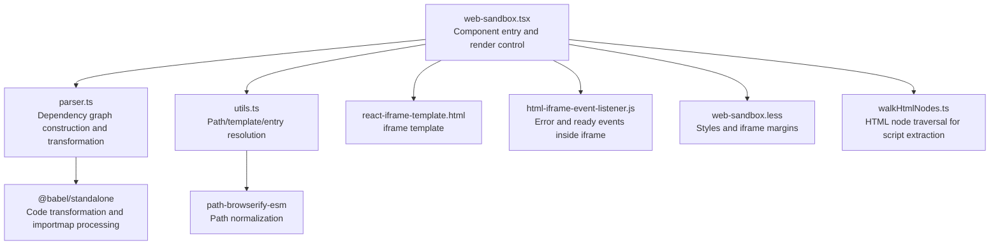
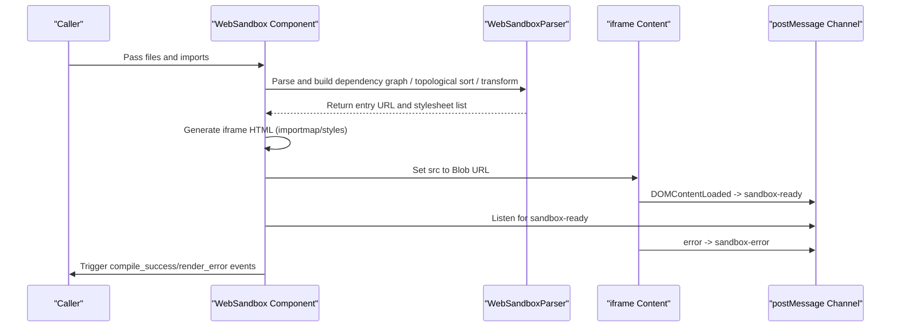
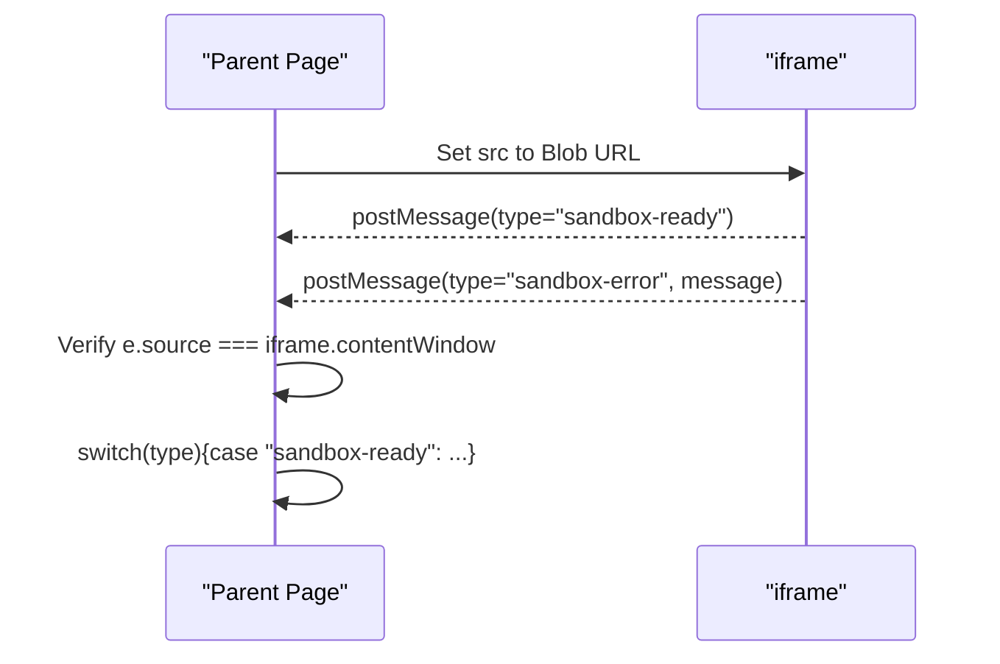
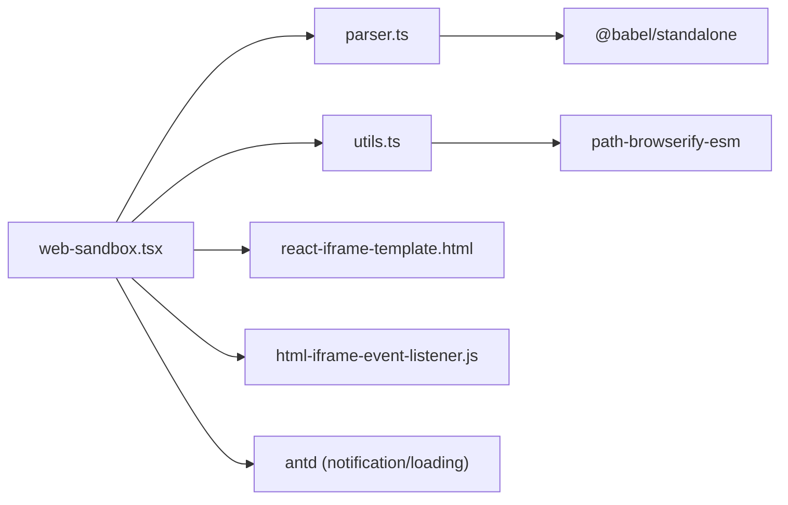

# Security Mechanism

<cite>
**Files Referenced in This Document**
- [web-sandbox.tsx](file://frontend/pro/web-sandbox/web-sandbox.tsx)
- [parser.ts](file://frontend/pro/web-sandbox/parser.ts)
- [utils.ts](file://frontend/pro/web-sandbox/utils.ts)
- [html-iframe-event-listener.js](file://frontend/pro/web-sandbox/html-iframe-event-listener.js)
- [react-iframe-template.html](file://frontend/pro/web-sandbox/react-iframe-template.html)
- [walkHtmlNodes.ts](file://frontend/utils/walkHtmlNodes.ts)
- [web-sandbox.less](file://frontend/pro/web-sandbox/web-sandbox.less)
- [package.json](file://frontend/package.json)
- [README.md (WebSandbox Docs)](file://docs/components/pro/web_sandbox/README.md)
</cite>

## Table of Contents

1. [Introduction](#introduction)
2. [Project Structure](#project-structure)
3. [Core Components](#core-components)
4. [Architecture Overview](#architecture-overview)
5. [Detailed Component Analysis](#detailed-component-analysis)
6. [Dependency Analysis](#dependency-analysis)
7. [Performance and Security Trade-offs](#performance-and-security-trade-offs)
8. [Troubleshooting Guide](#troubleshooting-guide)
9. [Conclusion](#conclusion)
10. [Appendix: Security Configuration and Best Practices](#appendix-security-configuration-and-best-practices)

## Introduction

This document focuses on the security mechanisms of the WebSandbox component, systematically explaining its browser iframe-based security isolation principles, how cross-origin and content security policies are implemented, the security implementation of event listeners and message passing, and key protections against malicious content injection and XSS. Actionable security configuration recommendations, audit checklists, and vulnerability protection guidelines are also provided.

## Project Structure

WebSandbox resides in the `pro` subdirectory of the frontend project. Its core consists of the following modules:

- Component entry and render control: web-sandbox.tsx
- Sandbox parsing and bundling: parser.ts
- Utilities and templates: utils.ts, react-iframe-template.html, web-sandbox.less
- Event listener inside iframe: html-iframe-event-listener.js
- Script processing helper for HTML template mode: walkHtmlNodes.ts
- Dependency declarations: package.json
- Component documentation: docs/components/pro/web_sandbox/README.md

Diagram Sources

- [web-sandbox.tsx:1-365](file://frontend/pro/web-sandbox/web-sandbox.tsx#L1-L365)
- [parser.ts:1-314](file://frontend/pro/web-sandbox/parser.ts#L1-L314)
- [utils.ts:1-83](file://frontend/pro/web-sandbox/utils.ts#L1-L83)
- [react-iframe-template.html:1-43](file://frontend/pro/web-sandbox/react-iframe-template.html#L1-L43)
- [html-iframe-event-listener.js:1-13](file://frontend/pro/web-sandbox/html-iframe-event-listener.js#L1-L13)
- [walkHtmlNodes.ts:1-19](file://frontend/utils/walkHtmlNodes.ts#L1-L19)
- [package.json:1-59](file://frontend/package.json#L1-L59)

Section Sources

- [web-sandbox.tsx:1-365](file://frontend/pro/web-sandbox/web-sandbox.tsx#L1-L365)
- [parser.ts:1-314](file://frontend/pro/web-sandbox/parser.ts#L1-L314)
- [utils.ts:1-83](file://frontend/pro/web-sandbox/utils.ts#L1-L83)
- [react-iframe-template.html:1-43](file://frontend/pro/web-sandbox/react-iframe-template.html#L1-L43)
- [html-iframe-event-listener.js:1-13](file://frontend/pro/web-sandbox/html-iframe-event-listener.js#L1-L13)
- [walkHtmlNodes.ts:1-19](file://frontend/utils/walkHtmlNodes.ts#L1-L19)
- [package.json:1-59](file://frontend/package.json#L1-L59)
- [README.md (WebSandbox Docs):1-70](file://docs/components/pro/web_sandbox/README.md#L1-L70)

## Core Components

- **WebSandbox main component**: Responsible for receiving source code file sets, building importmaps, selecting template types, generating iframe content, handling compile/render errors, and communicating with the iframe via postMessage.
- **WebSandboxParser**: Performs dependency graph construction, topological sorting, Babel transformation, CSS processing, and Blob URL generation on input files; outputs the entry URL and stylesheet list; provides a cleanup function for memory reclamation.
- **Utilities**: Path normalization, default entry file identification, template rendering, HTML node traversal, etc.
- **iframe template and event listeners**: Injects importmap and styles into the template; inside the iframe, listens for error and ready events and reports them via postMessage.

Section Sources

- [web-sandbox.tsx:21-365](file://frontend/pro/web-sandbox/web-sandbox.tsx#L21-L365)
- [parser.ts:14-314](file://frontend/pro/web-sandbox/parser.ts#L14-L314)
- [utils.ts:3-83](file://frontend/pro/web-sandbox/utils.ts#L3-L83)
- [react-iframe-template.html:1-43](file://frontend/pro/web-sandbox/react-iframe-template.html#L1-L43)
- [html-iframe-event-listener.js:1-13](file://frontend/pro/web-sandbox/html-iframe-event-listener.js#L1-L13)

## Architecture Overview

WebSandbox's security isolation is built on the browser iframe, combined with importmap, Babel transformation, Blob URLs, and the postMessage event channel to implement a "least privilege" runtime environment.

Diagram Sources

- [web-sandbox.tsx:94-218](file://frontend/pro/web-sandbox/web-sandbox.tsx#L94-L218)
- [parser.ts:285-312](file://frontend/pro/web-sandbox/parser.ts#L285-L312)
- [react-iframe-template.html:16-40](file://frontend/pro/web-sandbox/react-iframe-template.html#L16-L40)
- [html-iframe-event-listener.js:1-12](file://frontend/pro/web-sandbox/html-iframe-event-listener.js#L1-L12)

## Detailed Component Analysis

### Security Isolation Principles and Implementation

- **Browser-level isolation**: By default, iframes operate in a different origin context from the parent page, with an independent execution environment and DOM, naturally blocking scripts from directly accessing parent page global objects.
- **Least privilege**: Only necessary importmap and styles are injected; no additional permissions or capabilities are granted.
- **Process boundary**: React/JS code inside the iframe executes in an isolated thread, avoiding shared state with the host's main thread.

Section Sources

- [web-sandbox.tsx:350-356](file://frontend/pro/web-sandbox/web-sandbox.tsx#L350-L356)
- [react-iframe-template.html:7-12](file://frontend/pro/web-sandbox/react-iframe-template.html#L7-L12)

### iframe Security Policy and Cross-Origin Restrictions

- **Same-origin policy**: When the iframe and parent page share the same origin, direct access is possible; for cross-origin scenarios, communication must go through postMessage. WebSandbox strictly limits message source and type, accepting only specific messages from the iframe.
- **CSP**: The component does not explicitly set CSP headers, but reduces external link risks via Blob URLs and importmap. For stronger guarantees, CSP headers can be set at the server or gateway layer.
- **Cross-site scripting**: Scripts inside the iframe cannot directly access the parent page's DOM unless the parent page explicitly exposes the iframe's `contentWindow` (WebSandbox only passes theme and custom dispatch functions, without exposing sensitive interfaces).

Section Sources

- [web-sandbox.tsx:244-297](file://frontend/pro/web-sandbox/web-sandbox.tsx#L244-L297)
- [html-iframe-event-listener.js:1-12](file://frontend/pro/web-sandbox/html-iframe-event-listener.js#L1-L12)
- [react-iframe-template.html:16-29](file://frontend/pro/web-sandbox/react-iframe-template.html#L16-L29)

### Content Security Policy (CSP) and Resource Loading

- **importmap**: Injected into the iframe to restrict the source of third-party dependencies, avoiding loading uncontrolled scripts.
- **Styles and CSS**: Relative CSS is injected via Blob URLs; external CSS only allows `http(s)` or addresses already mapped in the importmap.
- **Malicious script filtering**: In HTML template mode, the component scans and replaces inline scripts with transformed Blob URLs, avoiding direct execution of untrusted scripts.

Section Sources

- [react-iframe-template.html:7-12](file://frontend/pro/web-sandbox/react-iframe-template.html#L7-L12)
- [parser.ts:258-276](file://frontend/pro/web-sandbox/parser.ts#L258-L276)
- [web-sandbox.tsx:110-179](file://frontend/pro/web-sandbox/web-sandbox.tsx#L110-L179)

### Event Listener and Message Passing Mechanism

- **iframe ready and error reporting**: Inside the iframe, `DOMContentLoaded` and `error` events are listened to; `sandbox-ready` and `sandbox-error` messages are sent via postMessage.
- **Parent page listening**: The parent page only accepts messages from the iframe, dispatching them to corresponding callbacks (render error/compile success) based on `type`, and securely passing theme and custom dispatch functions.
- **Event source verification**: Message source is strictly limited to `iframe.contentWindow` to prevent spoofed messages.

Diagram Sources

- [web-sandbox.tsx:262-282](file://frontend/pro/web-sandbox/web-sandbox.tsx#L262-L282)
- [html-iframe-event-listener.js:1-12](file://frontend/pro/web-sandbox/html-iframe-event-listener.js#L1-L12)
- [react-iframe-template.html:16-29](file://frontend/pro/web-sandbox/react-iframe-template.html#L16-L29)

### Malicious Content Injection and XSS Protection

- **Input normalization**: Paths and entry files are normalized to prevent path traversal and ambiguity.
- **Code transformation**: Babel is used to transform JS/TSX/JSX, replacing relative imports with Blob URLs and removing or transforming CSS imports, reducing the chance of directly executing untrusted scripts.
- **HTML template mode**: Inline scripts are scanned and replaced, converted to Blob URLs, and injected into the DOM, preventing direct execution of user-input scripts.
- **Error isolation**: Errors inside the iframe are reported via postMessage; the parent page only displays descriptive information without echoing raw stack traces or source code.

Section Sources

- [utils.ts:28-34](file://frontend/pro/web-sandbox/utils.ts#L28-L34)
- [parser.ts:176-283](file://frontend/pro/web-sandbox/parser.ts#L176-L283)
- [web-sandbox.tsx:110-179](file://frontend/pro/web-sandbox/web-sandbox.tsx#L110-L179)
- [html-iframe-event-listener.js:1-12](file://frontend/pro/web-sandbox/html-iframe-event-listener.js#L1-L12)

### Security-Related Third-Party Dependencies

- **@babel/standalone**: Used for browser-side code transformation and import path replacement; a key component for secure transformation.
- **path-browserify-esm**: Used for path normalization to prevent path injection.
- **antd**: Provides notifications and loading indicators for error display and user experience.

Section Sources

- [package.json:8-39](file://frontend/package.json#L8-L39)
- [parser.ts:1-12](file://frontend/pro/web-sandbox/parser.ts#L1-L12)
- [utils.ts:1-8](file://frontend/pro/web-sandbox/utils.ts#L1-L8)

## Dependency Analysis

WebSandbox's security implementation relies on multi-module collaboration: the component layer handles control and message bridging; the parsing layer handles dependencies and code transformation; the utility layer handles path and template processing; the iframe layer handles event reporting and isolation.

Diagram Sources

- [web-sandbox.tsx:1-19](file://frontend/pro/web-sandbox/web-sandbox.tsx#L1-L19)
- [parser.ts:1-12](file://frontend/pro/web-sandbox/parser.ts#L1-L12)
- [utils.ts:1-8](file://frontend/pro/web-sandbox/utils.ts#L1-L8)
- [react-iframe-template.html:1-43](file://frontend/pro/web-sandbox/react-iframe-template.html#L1-L43)
- [html-iframe-event-listener.js:1-13](file://frontend/pro/web-sandbox/html-iframe-event-listener.js#L1-L13)
- [package.json:8-39](file://frontend/package.json#L8-L39)

Section Sources

- [web-sandbox.tsx:1-365](file://frontend/pro/web-sandbox/web-sandbox.tsx#L1-L365)
- [parser.ts:1-314](file://frontend/pro/web-sandbox/parser.ts#L1-L314)
- [utils.ts:1-83](file://frontend/pro/web-sandbox/utils.ts#L1-L83)
- [react-iframe-template.html:1-43](file://frontend/pro/web-sandbox/react-iframe-template.html#L1-L43)
- [html-iframe-event-listener.js:1-13](file://frontend/pro/web-sandbox/html-iframe-event-listener.js#L1-L13)
- [package.json:1-59](file://frontend/package.json#L1-L59)

## Performance and Security Trade-offs

- **Transformation cost**: Babel transformation and Blob URL creation introduce some overhead; consider enabling caching and incremental update strategies for larger input sizes.
- **Message listening**: Listen only to messages from the iframe to avoid performance issues caused by frequent events.
- **Styles and scripts**: Prefer injecting relative CSS via Blob URLs to reduce network requests; strictly whitelist external CSS sources.

[This section contains general recommendations with no specific section sources]

## Troubleshooting Guide

- **Compilation failure**: Check whether input files contain circular dependencies, syntax errors, or missing entry files; the component throws an error during the parsing phase and triggers the compile error callback.
- **Render error**: Errors inside the iframe are reported via postMessage; the parent page displays an error notification or triggers the render error callback. Enable `showRenderError` to view specific information.
- **Theme and custom events**: Confirm that the parent page correctly sets `themeMode` and the `onCustom` callback; the iframe receives theme changes via postMessage.
- **Style anomalies**: Check importmap and style injection logic; ensure style URLs are correct and accessible.

Section Sources

- [web-sandbox.tsx:203-218](file://frontend/pro/web-sandbox/web-sandbox.tsx#L203-L218)
- [web-sandbox.tsx:267-281](file://frontend/pro/web-sandbox/web-sandbox.tsx#L267-L281)
- [parser.ts:128-174](file://frontend/pro/web-sandbox/parser.ts#L128-L174)

## Conclusion

WebSandbox achieves least-privilege execution and effective security isolation for user-input code through browser iframe isolation, importmap and Babel transformation, Blob URL injection, and a strictly controlled postMessage event channel. Combined with path normalization and error reporting mechanisms, it significantly reduces XSS and malicious script risks while maintaining usability.

[This section is a summary with no specific section sources]

## Appendix: Security Configuration and Best Practices

### Security Configuration Recommendations

- **Restrict third-party dependency sources**: Use importmap to explicitly specify third-party library versions and domains, avoiding loading uncontrolled scripts.
- **Strengthen CSP**: Set `Content-Security-Policy` at the server or gateway layer to restrict script execution sources and inline scripts.
- **Principle of least privilege**: Only inject necessary styles and scripts; avoid exposing sensitive host interfaces to the iframe.
- **Resource whitelist**: Apply a whitelist policy for external CSS/JS, allowing only `https` or trusted domains.

### Best Practices

- **Input validation**: Strictly validate user-input file names and paths to prevent path traversal.
- **Error message sanitization**: Error displays should avoid exposing internal paths and source code details.
- **Incremental updates**: Enable caching and incremental transformation for large projects to improve performance and security.
- **Audit logging**: Record key compile and runtime events to facilitate tracking and auditing.

### Vulnerability Protection Guide

- **XSS protection**: Avoid directly concatenating user input with `innerHTML`; use Blob URLs to replace inline scripts.
- **Circular dependency detection**: Circular dependencies are detected and blocked during the parsing phase to prevent abnormal behavior.
- **Cross-site messages**: Strictly validate the source and type of postMessage messages; reject messages from unknown origins.

Section Sources

- [README.md (WebSandbox Docs):34-70](file://docs/components/pro/web_sandbox/README.md#L34-L70)
- [web-sandbox.tsx:110-179](file://frontend/pro/web-sandbox/web-sandbox.tsx#L110-L179)
- [parser.ts:128-174](file://frontend/pro/web-sandbox/parser.ts#L128-L174)
