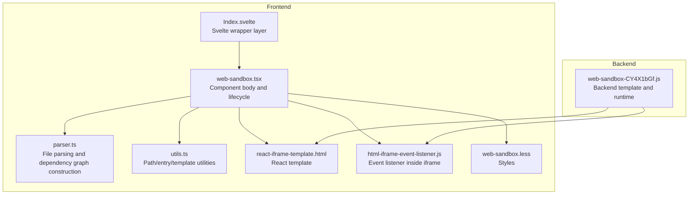
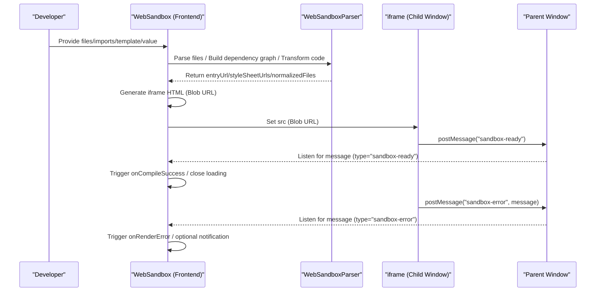
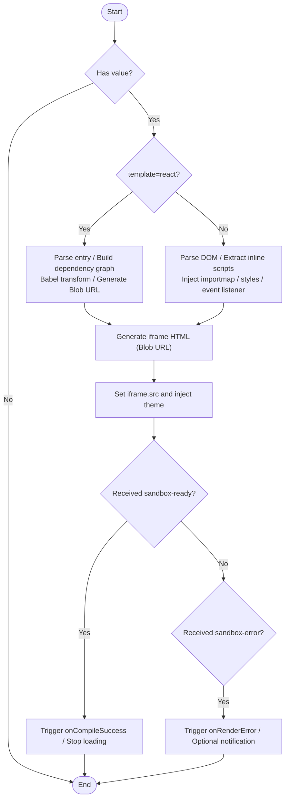
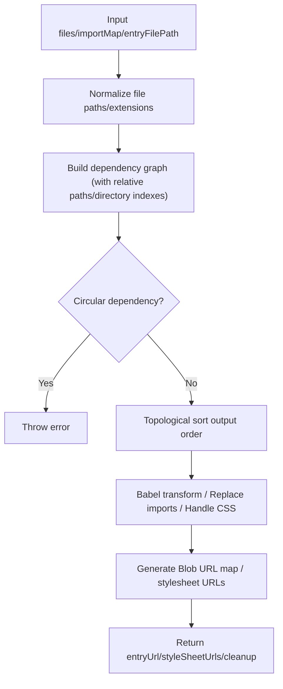
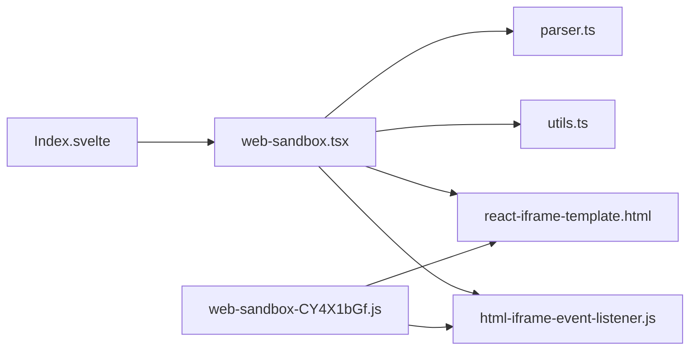

# WebSandbox

<cite>
**Files Referenced in This Document**
- [web-sandbox.tsx](file://frontend/pro/web-sandbox/web-sandbox.tsx)
- [parser.ts](file://frontend/pro/web-sandbox/parser.ts)
- [utils.ts](file://frontend/pro/web-sandbox/utils.ts)
- [react-iframe-template.html](file://frontend/pro/web-sandbox/react-iframe-template.html)
- [html-iframe-event-listener.js](file://frontend/pro/web-sandbox/html-iframe-event-listener.js)
- [web-sandbox.less](file://frontend/pro/web-sandbox/web-sandbox.less)
- [Index.svelte](file://frontend/pro/web-sandbox/Index.svelte)
- [web-sandbox-CY4X1bGf.js](file://backend/modelscope_studio/components/pro/web_sandbox/templates/component/web-sandbox-CY4X1bGf.js)
</cite>

## Table of Contents

1. [Introduction](#introduction)
2. [Project Structure](#project-structure)
3. [Core Components](#core-components)
4. [Architecture Overview](#architecture-overview)
5. [Detailed Component Analysis](#detailed-component-analysis)
6. [Dependency Analysis](#dependency-analysis)
7. [Performance Considerations](#performance-considerations)
8. [Troubleshooting Guide](#troubleshooting-guide)
9. [Conclusion](#conclusion)
10. [Appendix: Usage Examples and Best Practices](#appendix-usage-examples-and-best-practices)

## Introduction

WebSandbox is a component for safely rendering third-party or user-provided content in a controlled environment. It supports two modes:

- **React Mode**: Compiles, bundles, and runs code starting from a React application entry file, suitable for complex interactions and component-based scenarios.
- **HTML Mode**: Parses and injects HTML documents, inlining scripts and styles, suitable for quickly rendering static or semi-static pages.

The component isolates execution environments through iframes, uses postMessage for parent-child window event communication, and provides comprehensive error handling and theme adaptation capabilities to ensure safe rendering without disrupting the host application.

## Project Structure

The frontend core resides in `frontend/pro/web-sandbox`. Backend templates are generated by the Python backend and injected at runtime. The Svelte layer handles bridging and property forwarding.

**Diagram Sources**

- [web-sandbox.tsx:1-365](file://frontend/pro/web-sandbox/web-sandbox.tsx#L1-L365)
- [parser.ts:1-314](file://frontend/pro/web-sandbox/parser.ts#L1-L314)
- [utils.ts:1-83](file://frontend/pro/web-sandbox/utils.ts#L1-L83)
- [react-iframe-template.html:1-43](file://frontend/pro/web-sandbox/react-iframe-template.html#L1-L43)
- [html-iframe-event-listener.js:1-13](file://frontend/pro/web-sandbox/html-iframe-event-listener.js#L1-L13)
- [web-sandbox.less:1-24](file://frontend/pro/web-sandbox/web-sandbox.less#L1-L24)
- [Index.svelte:1-76](file://frontend/pro/web-sandbox/Index.svelte#L1-L76)
- [web-sandbox-CY4X1bGf.js:163-205](file://backend/modelscope_studio/components/pro/web_sandbox/templates/component/web-sandbox-CY4X1bGf.js#L163-L205)

**Section Sources**

- [web-sandbox.tsx:1-365](file://frontend/pro/web-sandbox/web-sandbox.tsx#L1-L365)
- [Index.svelte:1-76](file://frontend/pro/web-sandbox/Index.svelte#L1-L76)
- [web-sandbox-CY4X1bGf.js:163-205](file://backend/modelscope_studio/components/pro/web_sandbox/templates/component/web-sandbox-CY4X1bGf.js#L163-L205)

## Core Components

- **WebSandbox Main Component**: Responsible for receiving input files, building import maps, parsing/transforming files, generating iframe content, handling messages and errors, and injecting theme and event listener scripts.
- **WebSandboxParser**: Based on Babel Standalone, analyzes dependencies, performs topological sorting, replaces relative imports with Blob URLs, extracts stylesheets, and produces a runnable asset manifest.
- **Utilities**: Path normalization, entry file inference, HTML template rendering, and file content extraction.
- **Templates and Event Listeners**: React template and HTML event listener scripts, both notifying the parent window of "ready" and "error" states via postMessage.

Key responsibilities and behaviors:

- **Security Isolation**: iframe and parent window communicate via postMessage; styles and scripts are injected via Blob URLs to avoid cross-origin risks.
- **Error Handling**: Compile-time and runtime errors are reported separately; notification display and fallback rendering are optional.
- **Theme Adaptation**: Injects theme mode into iframe, supporting dynamic updates.
- **Event Communication**: Sends "ready" after iframe loads; runtime errors are reported via "error" events.

**Section Sources**

- [web-sandbox.tsx:21-55](file://frontend/pro/web-sandbox/web-sandbox.tsx#L21-L55)
- [parser.ts:14-314](file://frontend/pro/web-sandbox/parser.ts#L14-L314)
- [utils.ts:20-83](file://frontend/pro/web-sandbox/utils.ts#L20-L83)
- [react-iframe-template.html:1-43](file://frontend/pro/web-sandbox/react-iframe-template.html#L1-L43)
- [html-iframe-event-listener.js:1-13](file://frontend/pro/web-sandbox/html-iframe-event-listener.js#L1-L13)

## Architecture Overview

The overall WebSandbox flow is divided into two phases: "Compilation & Injection" and "iframe Rendering & Communication".

**Diagram Sources**

- [web-sandbox.tsx:94-218](file://frontend/pro/web-sandbox/web-sandbox.tsx#L94-L218)
- [web-sandbox.tsx:220-297](file://frontend/pro/web-sandbox/web-sandbox.tsx#L220-L297)
- [react-iframe-template.html:16-40](file://frontend/pro/web-sandbox/react-iframe-template.html#L16-L40)
- [html-iframe-event-listener.js:1-13](file://frontend/pro/web-sandbox/html-iframe-event-listener.js#L1-L13)

## Detailed Component Analysis

### WebSandbox Main Component (React)

- **Input props and defaults**: value, imports, template, showRenderError, showCompileError, height, className, style, onCompileError, onRenderError, onCompileSuccess, onCustom, compileErrorRender, etc.
- **Import mapping**: Selects built-in React/ReactDOM mappings based on `template`, then merges user-defined `imports`.
- **Compilation flow**:
  - React mode: Parse entry file, build dependency graph, Babel transform, replace relative imports with Blob URLs, collect stylesheets, generate entry URL.
  - HTML mode: Parse DOM, extract and rewrite inline scripts, inject importmap and style links, inject event listener script, generate full HTML Blob URL.
- **iframe lifecycle**: Create Blob URL → Inject theme and custom dispatch function → Listen for `sandbox-ready` and `sandbox-error` → Clean up URLs.
- **Error handling**: Compile-time errors via `onCompileError` and optional `compileErrorRender` or slot; runtime errors via `onRenderError` and notification.

**Diagram Sources**

- [web-sandbox.tsx:94-218](file://frontend/pro/web-sandbox/web-sandbox.tsx#L94-L218)
- [web-sandbox.tsx:220-297](file://frontend/pro/web-sandbox/web-sandbox.tsx#L220-L297)

**Section Sources**

- [web-sandbox.tsx:21-365](file://frontend/pro/web-sandbox/web-sandbox.tsx#L21-L365)

### WebSandboxParser

- **File normalization**: Normalizes paths, recognizes JS/TS/JSX/TSX/CSS extensions.
- **Dependency graph construction**: Analyzes import declarations from AST, handles relative paths and directory indexes, generates adjacency list.
- **Topological sorting**: Detects circular dependencies and throws errors.
- **Code transformation**: Babel transforms React/TSX, replaces relative imports with Blob URLs, removes or retains CSS imports, generates stylesheet Blob URLs.
- **Output**: entryUrl, styleSheetUrls, normalizedFiles, cleanup (reclaims Blob URLs).

**Diagram Sources**

- [parser.ts:28-314](file://frontend/pro/web-sandbox/parser.ts#L28-L314)

**Section Sources**

- [parser.ts:14-314](file://frontend/pro/web-sandbox/parser.ts#L14-L314)

### Utility Module

- **Path and entry**: normalizePath, getEntryFile, getFileCode, renderHtmlTemplate.
- **Default entry file sets**: Default entry file lists for React mode and HTML mode.

**Section Sources**

- [utils.ts:20-83](file://frontend/pro/web-sandbox/utils.ts#L20-L83)

### Templates and Event Listeners

- **React template**: Contains importmap, style injection, event listener script, and entry module loading.
- **HTML event listener**: Captures `error` and `DOMContentLoaded` inside the iframe, notifies the parent window via postMessage.

**Section Sources**

- [react-iframe-template.html:1-43](file://frontend/pro/web-sandbox/react-iframe-template.html#L1-L43)
- [html-iframe-event-listener.js:1-13](file://frontend/pro/web-sandbox/html-iframe-event-listener.js#L1-L13)

### Svelte Wrapper Layer and Backend Template

- **Svelte layer**: Responsible for property forwarding, visibility control, slot and theme passing.
- **Backend template**: Generates iframe HTML templates and event listener scripts consistent with the frontend to ensure front/backend consistency.

**Section Sources**

- [Index.svelte:1-76](file://frontend/pro/web-sandbox/Index.svelte#L1-L76)
- [web-sandbox-CY4X1bGf.js:163-205](file://backend/modelscope_studio/components/pro/web_sandbox/templates/component/web-sandbox-CY4X1bGf.js#L163-L205)

## Dependency Analysis

- **Component coupling**:
  - WebSandbox has direct dependencies on parser.ts, utils.ts, templates, and event listener scripts.
  - The Svelte layer acts only as a bridge and does not directly participate in business logic.
- **External dependencies**:
  - Babel Standalone for code transformation and AST analysis.
  - Ant Design's notification/Alert for error messages.
  - React/ReactDOM introduced via importmap in React mode.
- **Potential circular dependencies**:
  - The parser avoids circular dependencies internally through topological sorting; if user files have circular imports, an error will be thrown during the compilation phase.

**Diagram Sources**

- [web-sandbox.tsx:1-20](file://frontend/pro/web-sandbox/web-sandbox.tsx#L1-L20)
- [parser.ts:1-12](file://frontend/pro/web-sandbox/parser.ts#L1-L12)
- [utils.ts:1-1](file://frontend/pro/web-sandbox/utils.ts#L1-L1)
- [react-iframe-template.html:1-43](file://frontend/pro/web-sandbox/react-iframe-template.html#L1-L43)
- [html-iframe-event-listener.js:1-13](file://frontend/pro/web-sandbox/html-iframe-event-listener.js#L1-L13)
- [Index.svelte:1-12](file://frontend/pro/web-sandbox/Index.svelte#L1-L12)
- [web-sandbox-CY4X1bGf.js:163-205](file://backend/modelscope_studio/components/pro/web_sandbox/templates/component/web-sandbox-CY4X1bGf.js#L163-L205)

**Section Sources**

- [web-sandbox.tsx:1-365](file://frontend/pro/web-sandbox/web-sandbox.tsx#L1-L365)
- [parser.ts:1-314](file://frontend/pro/web-sandbox/parser.ts#L1-L314)
- [utils.ts:1-83](file://frontend/pro/web-sandbox/utils.ts#L1-L83)
- [Index.svelte:1-76](file://frontend/pro/web-sandbox/Index.svelte#L1-L76)
- [web-sandbox-CY4X1bGf.js:163-205](file://backend/modelscope_studio/components/pro/web_sandbox/templates/component/web-sandbox-CY4X1bGf.js#L163-L205)

## Performance Considerations

- **Blob URL management**: Both the parser and the component maintain Blob URL mappings and reclaim them during cleanup to avoid memory leaks.
- **Lazy loading and async**: The Svelte wrapper uses async component loading to reduce initial render pressure.
- **Dependency graph optimization**: Topological sorting and sequential transformation reduce redundant work.
- **Style injection**: CSS is injected via Blob URLs or external links to avoid blocking main thread rendering.
- **Event listeners**: Listening starts only after the iframe is ready, reducing unnecessary communication overhead.

[This section contains general performance recommendations with no specific file references]

## Troubleshooting Guide

- **Compile-time errors**
  - Symptom: Component displays a compile error; `onCompileError` callback is triggered.
  - Diagnosis: Check whether `imports` are correct, whether `template` and the entry file match, and whether circular dependencies exist.
  - Reference: [web-sandbox.tsx:203-218](file://frontend/pro/web-sandbox/web-sandbox.tsx#L203-L218), [parser.ts:128-174](file://frontend/pro/web-sandbox/parser.ts#L128-L174)
- **Runtime errors**
  - Symptom: iframe reports an error; parent window receives `sandbox-error`.
  - Diagnosis: Check the `onRenderError` callback and notification; verify that third-party libraries are correctly referenced via importmap.
  - Reference: [web-sandbox.tsx:262-282](file://frontend/pro/web-sandbox/web-sandbox.tsx#L262-L282), [html-iframe-event-listener.js:1-13](file://frontend/pro/web-sandbox/html-iframe-event-listener.js#L1-L13)
- **"Ready" event not triggered**
  - Symptom: `onCompileSuccess` is not triggered; loading state persists.
  - Diagnosis: Verify that the template correctly injects the event listener script; check whether the Blob URL is valid.
  - Reference: [react-iframe-template.html:16-40](file://frontend/pro/web-sandbox/react-iframe-template.html#L16-L40)
- **Missing styles**
  - Symptom: Page has no styles or styles appear abnormal.
  - Diagnosis: Verify that `styleSheetUrls` are generated; check CSS import paths and importmap.
  - Reference: [parser.ts:258-276](file://frontend/pro/web-sandbox/parser.ts#L258-L276)
- **Theme not applied**
  - Symptom: Theme inside iframe is inconsistent with the host application.
  - Diagnosis: Confirm that `themeMode` is passed in and the message is dispatched; check whether the theme is correctly received inside the iframe.
  - Reference: [web-sandbox.tsx:244-261](file://frontend/pro/web-sandbox/web-sandbox.tsx#L244-L261)

**Section Sources**

- [web-sandbox.tsx:203-297](file://frontend/pro/web-sandbox/web-sandbox.tsx#L203-L297)
- [parser.ts:128-276](file://frontend/pro/web-sandbox/parser.ts#L128-L276)
- [react-iframe-template.html:16-40](file://frontend/pro/web-sandbox/react-iframe-template.html#L16-L40)
- [html-iframe-event-listener.js:1-13](file://frontend/pro/web-sandbox/html-iframe-event-listener.js#L1-L13)

## Conclusion

WebSandbox achieves safe rendering of third-party or user-provided content through rigorous file parsing and transformation, secure iframe isolation, and a unified event communication mechanism. Its dual-mode (React/HTML) design balances flexibility and ease of use, and combined with comprehensive error handling and theme adaptation, it meets the needs of most scenarios requiring safe rendering.

[This section is a summary with no specific file references]

## Appendix: Usage Examples and Best Practices

### Configuration Props Overview

- `value`: A dictionary of file objects, supporting strings or objects with `is_entry` flag.
- `imports`: Custom importmap overriding the default React/ReactDOM mappings.
- `template`: `'react'` or `'html'`.
- `showRenderError` / `showCompileError`: Whether to display runtime/compile error notifications.
- `onCompileError` / `onRenderError` / `onCompileSuccess` / `onCustom`: Event callbacks.
- `compileErrorRender`: Custom compile error renderer.
- `height` / `className` / `style`: Container style controls.

Reference:

- [web-sandbox.tsx:21-55](file://frontend/pro/web-sandbox/web-sandbox.tsx#L21-L55)

### Security Policy and Event Handling

- **Custom event handling**: Use `onCustom` to dispatch events from inside the iframe to the parent window, enabling loosely coupled communication.
- **Security boundary**: iframe and parent window communicate via postMessage, avoiding direct DOM access; Blob URLs isolate scripts and styles.
- **Error capture**: Errors inside the iframe are uniformly reported; the parent window can choose to display notifications or handle them silently.

Reference:

- [web-sandbox.tsx:244-297](file://frontend/pro/web-sandbox/web-sandbox.tsx#L244-L297)
- [html-iframe-event-listener.js:1-13](file://frontend/pro/web-sandbox/html-iframe-event-listener.js#L1-L13)

### Usage Examples (Step-by-Step)

- **React Mode**
  - Prepare the entry file (e.g., `index.tsx`), mark it with `is_entry` in `value` or use the default entry.
  - If third-party libraries are needed, provide their URLs in `imports`.
  - Set `template='react'`, render the component, and listen to `onCompileSuccess` and `onRenderError`.
  - Reference: [web-sandbox.tsx:94-218](file://frontend/pro/web-sandbox/web-sandbox.tsx#L94-L218), [react-iframe-template.html:1-43](file://frontend/pro/web-sandbox/react-iframe-template.html#L1-L43)
- **HTML Mode**
  - Prepare `index.html`; inline scripts will be extracted and transformed automatically.
  - Set `template='html'`; the component will automatically inject importmap, styles, and event listener scripts.
  - Reference: [web-sandbox.tsx:110-218](file://frontend/pro/web-sandbox/web-sandbox.tsx#L110-L218), [html-iframe-event-listener.js:1-13](file://frontend/pro/web-sandbox/html-iframe-event-listener.js#L1-L13)

### Best Practices

- Prefer React mode for better type support and ecosystem compatibility.
- Add third-party libraries to `imports` to avoid cross-origin CDN script issues.
- Enable `showRenderError` in production to catch runtime issues promptly.
- Use the `compileErrorRender` slot or function to customize the error UI for better user experience.
- Remember to clean up Blob URLs to prevent memory leaks.

[This section contains general guidelines with no specific file references]
