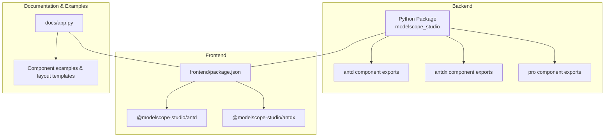
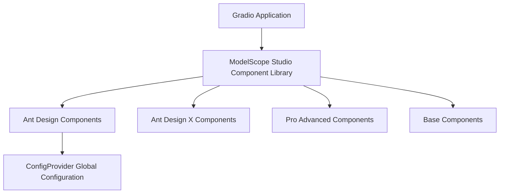
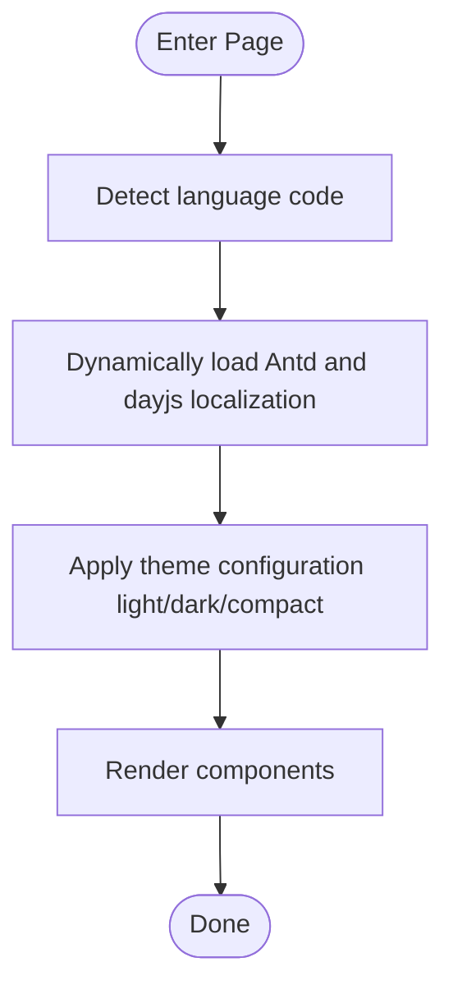
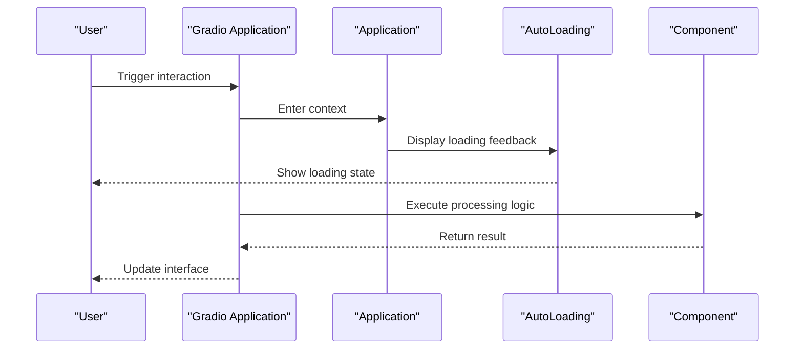
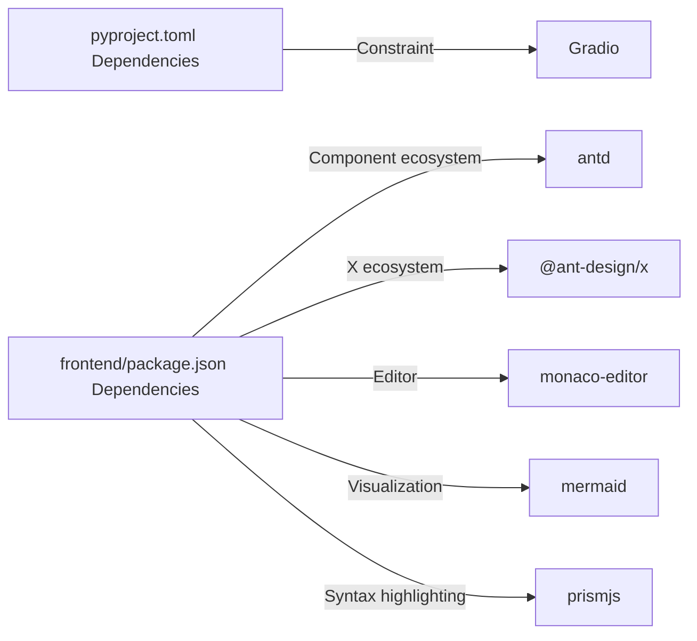

# Core Features

<cite>
**Files referenced in this document**
- [backend/modelscope_studio/__init__.py](file://backend/modelscope_studio/__init__.py)
- [backend/modelscope_studio/version.py](file://backend/modelscope_studio/version.py)
- [backend/modelscope_studio/components/__init__.py](file://backend/modelscope_studio/components/__init__.py)
- [backend/modelscope_studio/components/antd/components.py](file://backend/modelscope_studio/components/antd/components.py)
- [backend/modelscope_studio/components/antdx/components.py](file://backend/modelscope_studio/components/antdx/components.py)
- [backend/modelscope_studio/components/pro/components.py](file://backend/modelscope_studio/components/pro/components.py)
- [frontend/package.json](file://frontend/package.json)
- [frontend/antd/package.json](file://frontend/antd/package.json)
- [frontend/antdx/package.json](file://frontend/antdx/package.json)
- [pyproject.toml](file://pyproject.toml)
- [docs/README.md](file://docs/README.md)
- [docs/FAQ.md](file://docs/FAQ.md)
- [docs/app.py](file://docs/app.py)
- [frontend/antd/config-provider/locales.ts](file://frontend/antd/config-provider/locales.ts)
- [docs/components/antd/config_provider/demos/basic.py](file://docs/components/antd/config_provider/demos/basic.py)
- [docs/components/base/application/demos/theme_adaptation.py](file://docs/components/base/application/demos/theme_adaptation.py)
- [docs/components/pro/web_sandbox/demos/react.py](file://docs/components/pro/web_sandbox/demos/react.py)
</cite>

## Table of Contents

1. [Introduction](#introduction)
2. [Project Structure](#project-structure)
3. [Core Components](#core-components)
4. [Architecture Overview](#architecture-overview)
5. [Detailed Component Analysis](#detailed-component-analysis)
6. [Dependency Analysis](#dependency-analysis)
7. [Performance Considerations](#performance-considerations)
8. [Troubleshooting Guide](#troubleshooting-guide)
9. [Conclusion](#conclusion)
10. [Appendix](#appendix)

## Introduction

ModelScope Studio is a third-party component library based on Gradio, designed to provide developers with richer UI components and stronger page layout capabilities. While maintaining good compatibility with native Gradio components, it introduces the Ant Design (Antd) and Ant Design X (Antdx) UI ecosystems, and extends with a Pro advanced component family, covering diverse needs from general interactions to AI scenarios. Its core features include:

- Supported UI libraries: Ant Design, Ant Design X
- Component count statistics: The Antd component family includes many commonly used UI components; Antdx focuses on conversational and prompt scenarios; Pro components provide advanced capabilities such as chatbot, multimodal input, code editor, and web sandbox
- Gradio integration: Seamlessly connects with Gradio's event system, state management, queue and concurrency control
- Advantages over native Gradio: Compared to native Gradio components, ModelScope Studio focuses more on page layout optimization and component flexibility, making it suitable for building more visually appealing and maintainable user interfaces
- Development scenarios: Machine learning applications, AI interactive interfaces, multimodal experiences, visualization and demo spaces
- Internationalization and theming: Built-in multi-language mapping and theme customization, supporting light/dark modes and compact algorithm
- Performance optimization: Improves response speed through on-demand frontend bundling, template caching, and Gradio queue concurrency configuration

## Project Structure

The project adopts a front-end/back-end separated multi-package organization:

- Backend Python package: Provides component exports and packaging metadata
- Frontend Svelte packages: Split by module into Antd/Antdx/Base/Pro, with each component as an independent directory and template
- Documentation and examples: Aggregate component examples and layout templates through the docs application

Diagram Sources

- [backend/modelscope_studio/components/**init**.py:1-5](file://backend/modelscope_studio/components/__init__.py#L1-L5)
- [frontend/package.json:1-59](file://frontend/package.json#L1-L59)
- [docs/app.py:577-590](file://docs/app.py#L577-L590)

Section Sources

- [backend/modelscope_studio/components/**init**.py:1-5](file://backend/modelscope_studio/components/__init__.py#L1-L5)
- [frontend/package.json:1-59](file://frontend/package.json#L1-L59)
- [docs/app.py:577-590](file://docs/app.py#L577-L590)

## Core Components

The core of ModelScope Studio consists of three major component families:

- Antd component family: Covers general, layout, navigation, data entry, data display, feedback, and global configuration categories, with a rich set of components suitable for complex business scenarios
- Antdx component family: Specialized components for AI interaction, such as conversation bubbles, prompt collections, senders, thought chains, welcome messages, etc.
- Pro component family: Provides advanced capabilities such as chatbot, multimodal input, Monaco editor, web sandbox, etc.

Section Sources

- [backend/modelscope_studio/components/antd/components.py:1-144](file://backend/modelscope_studio/components/antd/components.py#L1-L144)
- [backend/modelscope_studio/components/antdx/components.py:1-40](file://backend/modelscope_studio/components/antdx/components.py#L1-L40)
- [backend/modelscope_studio/components/pro/components.py:1-8](file://backend/modelscope_studio/components/pro/components.py#L1-L8)

## Architecture Overview

The following diagram shows the position of ModelScope Studio within the Gradio ecosystem and its interaction relationships:

Diagram Sources

- [docs/README.md:32-42](file://docs/README.md#L32-L42)
- [docs/app.py:577-590](file://docs/app.py#L577-L590)

Section Sources

- [docs/README.md:32-42](file://docs/README.md#L32-L42)
- [docs/app.py:577-590](file://docs/app.py#L577-L590)

## Detailed Component Analysis

### Antd Component Family

The Antd component family is the main body of ModelScope Studio, covering a wide functional domain, suitable for building enterprise-level or complex interactive interfaces. Typical components include:

- Layout: Layout, Grid, Flex, Space, Splitter
- Navigation: Anchor, Breadcrumb, Dropdown, Menu, Pagination, Steps
- Data Entry: AutoComplete, Cascader, Checkbox, ColorPicker, DatePicker, Form, Input, InputNumber, Mentions, Radio, Rate, Select, Slider, Switch, TimePicker, Transfer, TreeSelect, Upload
- Data Display: Avatar, Badge, Calendar, Card, Carousel, Collapse, Descriptions, Empty, Image, List, Popover, QRCode, Segmented, Statistic, Table, Tabs, Tag, Timeline, Tooltip, Tour, Tree
- Feedback: Alert, Drawer, Message, Modal, Notification, Popconfirm, Progress, Result, Skeleton, Spin, Watermark
- General: Button, FloatButton, Icon, Typography
- Global Configuration: ConfigProvider (theme, locale, direction)

Component count statistics (based on backend export manifest):

- Antd main components: approximately 120+ specific components (including sub-modules)
- Antdx specialized components: approximately 30+ components
- Pro advanced components: approximately 4 components

Section Sources

- [backend/modelscope_studio/components/antd/components.py:1-144](file://backend/modelscope_studio/components/antd/components.py#L1-L144)
- [backend/modelscope_studio/components/antdx/components.py:1-40](file://backend/modelscope_studio/components/antdx/components.py#L1-L40)
- [backend/modelscope_studio/components/pro/components.py:1-8](file://backend/modelscope_studio/components/pro/components.py#L1-L8)
- [pyproject.toml:48-244](file://pyproject.toml#L48-L244)

### Antdx Component Family

Antdx is designed specifically for AI interaction, emphasizing the complete conversational chain of "wake—express—confirm—feedback—tool":

- Wake: Welcome, Prompts
- Express: Attachments, Sender, Suggestion
- Confirm: ThoughtChain
- Feedback: Actions
- Tool: XProvider
- General: Bubble, Conversations

These components, combined with ConfigProvider, theme, and internationalization, can quickly build high-quality AI conversational interfaces.

Section Sources

- [backend/modelscope_studio/components/antdx/components.py:1-40](file://backend/modelscope_studio/components/antdx/components.py#L1-L40)

### Pro Component Family

Pro components focus on advanced interaction and demo scenarios:

- Chatbot: Conversational applications
- MultimodalInput: Multimodal input
- MonacoEditor: Code editor
- WebSandbox: Web sandbox preview

Section Sources

- [backend/modelscope_studio/components/pro/components.py:1-8](file://backend/modelscope_studio/components/pro/components.py#L1-L8)

### Internationalization and Theme Customization

- Internationalization: The frontend provides multi-language mapping, supporting conversion from language codes to Antd/dayjs localization
- Theme customization: ConfigProvider supports theme algorithms (light/dark, compact), primary color, and direction switching
- Examples: Documentation provides basic theme and color adjustment examples, as well as application-level theme adaptation examples

Diagram Sources

- [frontend/antd/config-provider/locales.ts:12-87](file://frontend/antd/config-provider/locales.ts#L12-L87)
- [docs/components/antd/config_provider/demos/basic.py:54-74](file://docs/components/antd/config_provider/demos/basic.py#L54-L74)
- [docs/components/base/application/demos/theme_adaptation.py:6-8](file://docs/components/base/application/demos/theme_adaptation.py#L6-L8)

Section Sources

- [frontend/antd/config-provider/locales.ts:12-87](file://frontend/antd/config-provider/locales.ts#L12-L87)
- [docs/components/antd/config_provider/demos/basic.py:54-74](file://docs/components/antd/config_provider/demos/basic.py#L54-L74)
- [docs/components/base/application/demos/theme_adaptation.py:6-8](file://docs/components/base/application/demos/theme_adaptation.py#L6-L8)

### Gradio Integration and Page Layout Optimization

- Events and state: Collaborate with Gradio's event system through base components such as Application, AutoLoading, etc.
- Layout optimization: Use Flex, Grid, Layout, Space, Splitter, and other components for flexible layout
- Interaction feedback: The AutoLoading component is used to display loading feedback during interactions, avoiding blank waits caused by missing Gradio's default loading state

Diagram Sources

- [docs/FAQ.md:7-19](file://docs/FAQ.md#L7-L19)
- [docs/app.py:577-590](file://docs/app.py#L577-L590)

Section Sources

- [docs/FAQ.md:7-19](file://docs/FAQ.md#L7-L19)
- [docs/app.py:577-590](file://docs/app.py#L577-L590)

## Dependency Analysis

- Python-side dependencies: Gradio version range constraints ensure compatibility with different versions
- Frontend dependencies: Ant Design, Ant Design X, React, Svelte, Monaco Editor, Mermaid, KaTeX, Prism, etc.
- Packaging and release: Built with hatchling; artifact list includes many template resources for on-demand frontend loading

Diagram Sources

- [pyproject.toml:26-26](file://pyproject.toml#L26-L26)
- [frontend/package.json:8-40](file://frontend/package.json#L8-L40)

Section Sources

- [pyproject.toml:26-26](file://pyproject.toml#L26-L26)
- [frontend/package.json:8-40](file://frontend/package.json#L8-L40)

## Performance Considerations

- Concurrency and queues: Example applications enable queue and concurrency limits, which helps maintain stable operation under high load
- Templates and resources: The artifact list includes many template resources; it is recommended to load on demand in production environments to reduce initial page size
- SSR note: SSR must be disabled in Hugging Face Space to avoid custom component rendering issues

Section Sources

- [docs/app.py:592-594](file://docs/app.py#L592-L594)
- [docs/FAQ.md:3-5](file://docs/FAQ.md#L3-L5)
- [pyproject.toml:48-244](file://pyproject.toml#L48-L244)

## Troubleshooting Guide

- Hugging Face Space page not displaying: Add parameter `ssr_mode=False`
- Long wait after interactions: When the AutoLoading component is not used, Gradio's default loading state may not display; it is recommended to use AutoLoading globally
- Theme/language not taking effect: Check whether the `theme` and `locale` settings of ConfigProvider are correctly passed down the component tree

Section Sources

- [docs/FAQ.md:3-19](file://docs/FAQ.md#L3-L19)
- [docs/components/antd/config_provider/demos/basic.py:54-74](file://docs/components/antd/config_provider/demos/basic.py#L54-L74)

## Conclusion

ModelScope Studio, through the Antd, Antdx, and Pro component families combined with Gradio's event and state mechanisms, provides significant enhancements in page layout, component flexibility, and AI interaction experience. Its internationalization and theme customization capabilities, complete examples and documentation, make it the ideal choice for building machine learning and AI interactive interfaces. For scenarios requiring complex layouts and rich interactions, ModelScope Studio can effectively improve development efficiency and user experience.

## Appendix

- Usage Scenario Examples
  - Machine learning model demos: Use Layout, Grid, Form, Table, Modal, and other components to display data and results
  - AI conversational interfaces: Use Antdx components like Bubble, Sender, Prompts, ThoughtChain to build natural conversation flows
  - Code and visualization: Use Pro's MonacoEditor and Mermaid to implement code editing and flowchart display
  - Multimodal input: Use Pro's MultimodalInput to build text/image/audio input scenarios
  - Web preview: Use Pro's WebSandbox to quickly embed external pages for demo

Section Sources

- [docs/components/pro/web_sandbox/demos/react.py:74-97](file://docs/components/pro/web_sandbox/demos/react.py#L74-L97)
- [docs/components/antd/config_provider/demos/basic.py:54-74](file://docs/components/antd/config_provider/demos/basic.py#L54-L74)
- [docs/components/base/application/demos/theme_adaptation.py:18-30](file://docs/components/base/application/demos/theme_adaptation.py#L18-L30)
