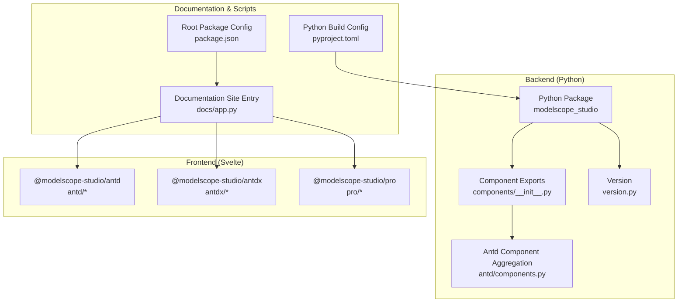
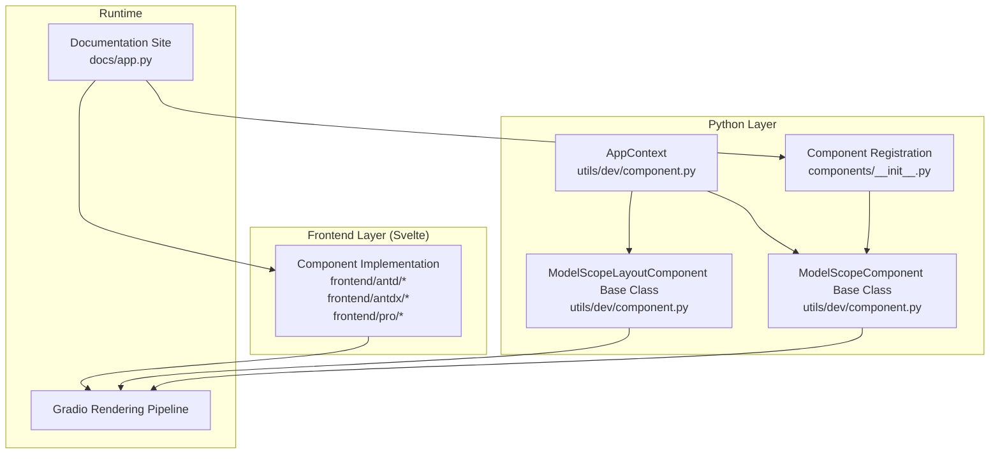
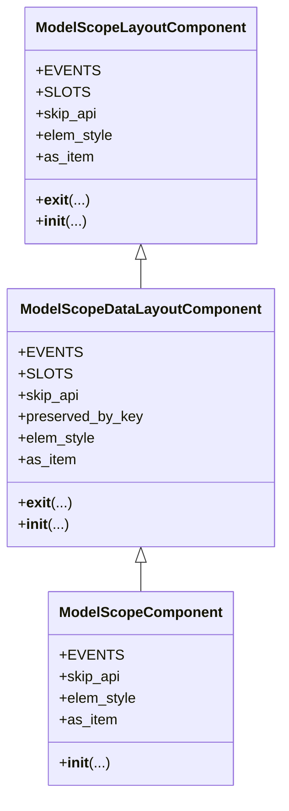
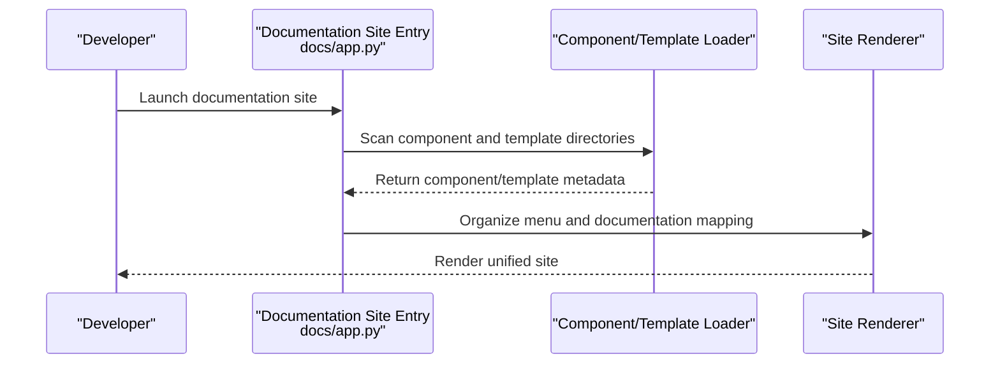
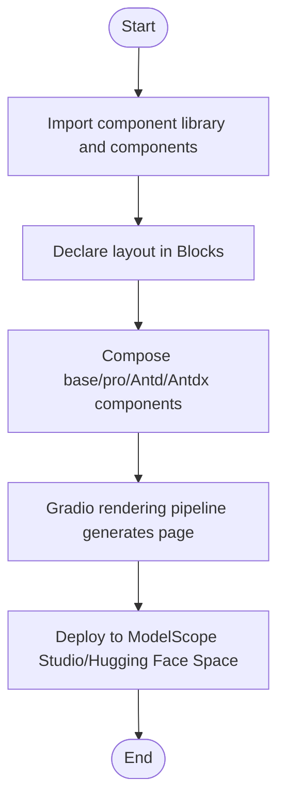
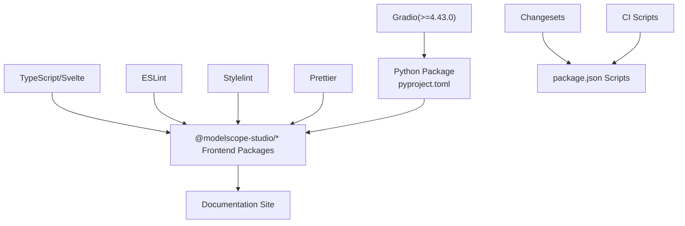

# Project Introduction

<cite>
**Files referenced in this document**   
- [README.md](file://README.md)
- [README-zh_CN.md](file://README-zh_CN.md)
- [backend/modelscope_studio/__init__.py](file://backend/modelscope_studio/__init__.py)
- [backend/modelscope_studio/version.py](file://backend/modelscope_studio/version.py)
- [package.json](file://package.json)
- [pyproject.toml](file://pyproject.toml)
- [backend/modelscope_studio/components/__init__.py](file://backend/modelscope_studio/components/__init__.py)
- [backend/modelscope_studio/components/antd/components.py](file://backend/modelscope_studio/components/antd/components.py)
- [backend/modelscope_studio/utils/dev/component.py](file://backend/modelscope_studio/utils/dev/component.py)
- [docs/app.py](file://docs/app.py)
- [frontend/antd/package.json](file://frontend/antd/package.json)
- [frontend/antdx/package.json](file://frontend/antdx/package.json)
- [frontend/pro/package.json](file://frontend/pro/package.json)
</cite>

## Table of Contents

1. [Introduction](#introduction)
2. [Project Structure](#project-structure)
3. [Core Components](#core-components)
4. [Architecture Overview](#architecture-overview)
5. [Detailed Component Analysis](#detailed-component-analysis)
6. [Dependency Analysis](#dependency-analysis)
7. [Performance Considerations](#performance-considerations)
8. [Troubleshooting Guide](#troubleshooting-guide)
9. [Conclusion](#conclusion)
10. [Appendix](#appendix)

## Introduction

ModelScope Studio is a third-party component library based on Gradio, designed to provide developers with richer and more flexible UI-building capabilities. By integrating the Ant Design and Ant Design X (Antd/Antdx) ecosystems, along with a self-developed base and professional component system, it helps users quickly build visually appealing and maintainable interactive interfaces while retaining the ease of use of Gradio.

- Core Value Proposition
  - Stronger page layout and component flexibility: Compared to native Gradio components, ModelScope Studio focuses more on page layout and component composition, making it ideal for applications that prioritize visual and interactive experience.
  - Seamless integration with the Gradio ecosystem: Can be used independently or mixed with existing Gradio components to meet interface needs of varying complexity.
  - Multi-platform deployment support: Supports platforms such as ModelScope Studio and Hugging Face Space, providing a consistent development and release experience.

- Design Philosophy
  - Core principle of "component as a service," providing reusable and composable UI components.
  - Simplifies complex layout and data flow management through context and slot mechanisms.
  - Maintains deep compatibility with Gradio to reduce migration and learning costs.

- Relationship with ModelScope and Gradio Ecosystems
  - Leveraging Gradio's Blocks/Interface rendering and event system, ModelScope Studio exposes Antd/Antdx components and professional components as Gradio components, allowing the Python side to declaratively compose frontend components.
  - On the ModelScope Studio platform and Hugging Face Space, users can directly run examples and templates to quickly validate UI effects.

- Background and Goals
  - Background: While Gradio provides an extremely simple interface entry for model applications, there is still room for improvement in complex layouts and professional interactions; the Ant Design ecosystem is mature but its direct integration with Gradio is not seamless enough.
  - Goal: Build a component library with "lightweight access, powerful composition" that covers full-stack UI needs from basic layout to professional interactions, driving the engineering and standardization of model application interfaces.

- Core Problems Solved
  - High page layout complexity: Reduces nesting levels and logical complexity through layout components and slot mechanisms.
  - Component reuse and consistency: A unified Antd/Antdx component system ensures cross-module consistency and maintainability.
  - Multi-platform deployment consistency: Provides stable SSR/CSR configuration recommendations to avoid display anomalies on different platforms.

- Open Source Philosophy and Community Contribution
  - License: Apache-2.0, encouraging enterprise and individual use and contributions within compliance.
  - Contributing: Welcome feedback via Issues/PR, supplementing documentation, improving components, or fixing defects; follow code standards and change processes.
  - Releases and versioning: Manage versions and changelogs through Changesets; CI pipeline handles build and release.

- Future Plans
  - Expand component matrix: Continuously improve Antd/Antdx and professional components to cover more business scenarios.
  - Optimize developer experience: Improve documentation site, example templates, and debugging toolchain.
  - Platform adaptation: Enhance adaptation and best practices for ModelScope Studio, Hugging Face Space, and other platforms.

**Section Sources**

- [README.md:17-32](file://README.md#L17-L32)
- [README-zh_CN.md:17-32](file://README-zh_CN.md#L17-L32)

## Project Structure

The project adopts a front-end/back-end separated multi-package workspace structure. The backend Python package provides component registration and version information; the frontend implements each component in Svelte and integrates with the Gradio build toolchain; the documentation site dynamically loads component examples and templates through Python.

**Diagram Sources**

- [backend/modelscope_studio/components/**init**.py:1-5](file://backend/modelscope_studio/components/__init__.py#L1-L5)
- [backend/modelscope_studio/components/antd/components.py:1-144](file://backend/modelscope_studio/components/antd/components.py#L1-L144)
- [backend/modelscope_studio/version.py:1-2](file://backend/modelscope_studio/version.py#L1-L2)
- [docs/app.py:1-595](file://docs/app.py#L1-L595)
- [package.json:1-55](file://package.json#L1-L55)
- [pyproject.toml:1-257](file://pyproject.toml#L1-L257)

**Section Sources**

- [backend/modelscope_studio/components/**init**.py:1-5](file://backend/modelscope_studio/components/__init__.py#L1-L5)
- [backend/modelscope_studio/components/antd/components.py:1-144](file://backend/modelscope_studio/components/antd/components.py#L1-L144)
- [docs/app.py:1-595](file://docs/app.py#L1-L595)
- [package.json:1-55](file://package.json#L1-L55)
- [pyproject.toml:1-257](file://pyproject.toml#L1-L257)

## Core Components

ModelScope Studio's component system is divided into three major categories:

- Base components (base): Provide layout, rendering control and context capabilities, such as Application, AutoLoading, Slot, Fragment, Each, Filter, Div, Span, Text, Markdown, etc.
- Ant Design components (antd): Cover Antd's general, layout, navigation, data entry, data display, feedback, and other categories, including a large number of sub-components and composite forms.
- Ant Design X components (antdx): A professional component collection for conversational and collaborative scenarios, such as Bubble, Conversations, Sender, ThoughtChain, Actions, etc.
- Pro components (pro): Advanced components for specific business needs, such as Chatbot, Monaco Editor, Multimodal Input, Web Sandbox, etc.

These components are exposed on the Python side through a unified registration and export mechanism, making it easy to compose them as needed within Blocks.

**Section Sources**

- [backend/modelscope_studio/components/**init**.py:1-5](file://backend/modelscope_studio/components/__init__.py#L1-L5)
- [backend/modelscope_studio/components/antd/components.py:1-144](file://backend/modelscope_studio/components/antd/components.py#L1-L144)
- [docs/app.py:189-509](file://docs/app.py#L189-L509)

## Architecture Overview

ModelScope Studio's overall architecture revolves around "Python component definition + Svelte frontend implementation + Gradio rendering pipeline." On the Python side, components are injected into Blocks as Gradio components through component base classes and context mechanisms; the frontend uses Svelte to implement component UIs and packages and distributes them through Gradio's build toolchain; the documentation site dynamically loads component examples and templates, forming a closed loop of "develop—demo—publish."

**Diagram Sources**

- [backend/modelscope_studio/utils/dev/component.py:11-169](file://backend/modelscope_studio/utils/dev/component.py#L11-L169)
- [backend/modelscope_studio/components/**init**.py:1-5](file://backend/modelscope_studio/components/__init__.py#L1-L5)
- [docs/app.py:1-595](file://docs/app.py#L1-L595)
- [frontend/antd/package.json:1-6](file://frontend/antd/package.json#L1-L6)
- [frontend/antdx/package.json:1-6](file://frontend/antdx/package.json#L1-L6)
- [frontend/pro/package.json:1-6](file://frontend/pro/package.json#L1-L6)

## Detailed Component Analysis

### Component Base Classes and Context Mechanism

ModelScope Studio supports the component system through three base classes:

- ModelScopeComponent: For data-type components, with value passing, event binding, rendering control, and other capabilities.
- ModelScopeLayoutComponent: For layout-type components, supporting layout markers and context switching.
- ModelScopeDataLayoutComponent: Combines data and layout characteristics for complex container components.

These base classes unify component lifecycle, property injection, and context association, ensuring consistent component behavior within Blocks.

**Diagram Sources**

- [backend/modelscope_studio/utils/dev/component.py:11-169](file://backend/modelscope_studio/utils/dev/component.py#L11-L169)

**Section Sources**

- [backend/modelscope_studio/utils/dev/component.py:11-169](file://backend/modelscope_studio/utils/dev/component.py#L11-L169)

### Ant Design Component Aggregation

Antd components are uniformly exposed through centralized export files, covering general, layout, navigation, data entry, data display, feedback, and other categories, making it easy to import and use on the Python side as needed.

```mermaid
graph LR
ANTD_ALL["antd/components.py"] --> BUTTON["Button"]
ANTD_ALL --> INPUT["Input"]
ANTD_ALL --> FORM["Form"]
ANTD_ALL --> TABLE["Table"]
ANTD_ALL --> MODAL["Modal"]
ANTD_ALL --> LAYOUT["Layout"]
ANTD_ALL --> MENU["Menu"]
ANTD_ALL --> TREE["Tree"]
ANTD_ALL --> UPLOAD["Upload"]
ANTD_ALL --> PROGRESS["Progress"]
ANTD_ALL --> ALERT["Alert"]
ANTD_ALL --> DRAWER["Drawer"]
ANTD_ALL --> PAGINATION["Pagination"]
ANTD_ALL --> SPIN["Spin"]
ANTD_ALL --> MESSAGE["Message"]
ANTD_ALL --> NOTIFICATION["Notification"]
ANTD_ALL --> TYPGRAPHY["Typography"]
ANTD_ALL --> GRID["Grid"]
ANTD_ALL --> SPACE["Space"]
ANTD_ALL --> SPLITTER["Splitter"]
ANTD_ALL --> STATISTIC["Statistic"]
ANTD_ALL --> TOUR["Tour"]
ANTD_ALL --> WATERMARK["Watermark"]
ANTD_ALL --> QR_CODE["QRCode"]
ANTD_ALL --> CALENDAR["Calendar"]
ANTD_ALL --> CAROUSEL["Carousel"]
ANTD_ALL --> COLLAPSE["Collapse"]
ANTD_ALL --> DESCRIPTIONS["Descriptions"]
ANTD_ALL --> EMPTY["Empty"]
ANTD_ALL --> IMAGE["Image"]
ANTD_ALL --> LIST["List"]
ANTD_ALL --> POPOVER["Popover"]
ANTD_ALL --> SEGMENTED["Segmented"]
ANTD_ALL --> TIME_PICKER["TimePicker"]
ANTD_ALL --> TIMELINE["Timeline"]
ANTD_ALL --> TOOLTIP["Tooltip"]
ANTD_ALL --> TRANSFER["Transfer"]
ANTD_ALL --> TREE_SELECT["TreeSelect"]
ANTD_ALL --> SKELETON["Skeleton"]
ANTD_ALL --> SWITCH["Switch"]
ANTD_ALL --> SLIDER["Slider"]
ANTD_ALL --> SELECT["Select"]
ANTD_ALL --> RADIO["Radio"]
ANTD_ALL --> RATE["Rate"]
ANTD_ALL --> CHECKBOX["Checkbox"]
ANTD_ALL --> COLOR_PICKER["ColorPicker"]
ANTD_ALL --> DATE_PICKER["DatePicker"]
ANTD_ALL --> AUTO_COMPLETE["AutoComplete"]
ANTD_ALL --> CASCADER["Cascader"]
ANTD_ALL --> MENTIONS["Mentions"]
ANTD_ALL --> FLOAT_BUTTON["FloatButton"]
ANTD_ALL --> ICON["Icon"]
ANTD_ALL --> DIVIDER["Divider"]
ANTD_ALL --> DROPDOWN["Dropdown"]
ANTD_ALL --> BADGE["Badge"]
ANTD_ALL --> AVATAR["Avatar"]
ANTD_ALL --> RESULT["Result"]
ANTD_ALL --> POPCONFIRM["Popconfirm"]
```

**Diagram Sources**

- [backend/modelscope_studio/components/antd/components.py:1-144](file://backend/modelscope_studio/components/antd/components.py#L1-L144)

**Section Sources**

- [backend/modelscope_studio/components/antd/components.py:1-144](file://backend/modelscope_studio/components/antd/components.py#L1-L144)

### Documentation Site and Example Loading

The documentation site dynamically imports `app.py` from each component directory, aggregating component examples and descriptions to form a unified navigation and display interface; it also supports layout templates and multi-language environment switching.

**Diagram Sources**

- [docs/app.py:19-61](file://docs/app.py#L19-L61)
- [docs/app.py:577-595](file://docs/app.py#L577-L595)

**Section Sources**

- [docs/app.py:19-61](file://docs/app.py#L19-L61)
- [docs/app.py:577-595](file://docs/app.py#L577-L595)

### Conceptual Overview

The following conceptual flowchart shows the key steps from component declaration to page rendering, helping beginners understand the overall workflow.

[This is a conceptual flowchart and does not correspond to specific source files, hence no diagram source]

## Dependency Analysis

- Runtime Dependencies
  - Gradio: As the core rendering and event system, ModelScope Studio extends component capabilities on top of it.
- Build and Development Dependencies
  - Gradio CLI: Provides component build and development server functionality.
  - TypeScript/Svelte: Frontend component implementation and type checking.
  - Prettier/ESLint/Stylelint: Code style and quality assurance.
- Release and Version Management
  - Changesets: Version and changelog management.
  - CI scripts: Automated build, validation, and release.

**Diagram Sources**

- [pyproject.toml:26](file://pyproject.toml#L26)
- [package.json:8-25](file://package.json#L8-L25)

**Section Sources**

- [pyproject.toml:26](file://pyproject.toml#L26)
- [package.json:8-25](file://package.json#L8-L25)

## Performance Considerations

- Component lazy loading and on-demand imports: Prioritize importing only required components to reduce initial bundle size.
- Frontend build optimization: Leverage Gradio CLI's build capabilities and caching strategy to shorten incremental build times.
- Rendering concurrency and queues: Set reasonable concurrency and queue sizes in documentation sites and examples to avoid blocking.
- Platform differences: When using Hugging Face Space, pay attention to `ssr_mode` parameter configuration to avoid page rendering anomalies.

[This section is general guidance and does not involve specific file analysis]

## Troubleshooting Guide

- Hugging Face Space page display anomalies
  - Symptom: Blank page or components not rendering correctly.
  - Fix: Add `ssr_mode=False` parameter in `demo.launch()`.
  - Reference: [README.md:32](file://README.md#L32), [README-zh_CN.md:32](file://README-zh_CN.md#L32), [docs/app.py:594](file://docs/app.py#L594)

- Component import path error
  - Symptom: Module or component not found.
  - Fix: Verify that the component namespace and import path match, e.g., `modelscope_studio.components.antd`, `modelscope_studio.components.base`, etc.
  - Reference: [backend/modelscope_studio/components/**init**.py:1-5](file://backend/modelscope_studio/components/__init__.py#L1-L5)

- Documentation site development mode
  - Symptom: Local development cannot hot-reload or examples are not displayed.
  - Fix: Use `gradio cc dev docs/app.py` to start the development server, and ensure the corresponding `app.py` exists in the docs directory.
  - Reference: [README.md:96-100](file://README.md#L96-L100), [docs/app.py:10](file://docs/app.py#L10)

**Section Sources**

- [README.md:32](file://README.md#L32)
- [README-zh_CN.md:32](file://README-zh_CN.md#L32)
- [docs/app.py:594](file://docs/app.py#L594)
- [backend/modelscope_studio/components/**init**.py:1-5](file://backend/modelscope_studio/components/__init__.py#L1-L5)
- [README.md:96-100](file://README.md#L96-L100)
- [docs/app.py:10](file://docs/app.py#L10)

## Conclusion

ModelScope Studio, built on Gradio and integrating the Ant Design and Ant Design X ecosystems, has constructed a complete component system covering base, professional, and Antd/Antdx components. While maintaining Gradio's ease of use, it significantly enhances page layout and component composition capabilities, making it suitable for model application UI development from prototype to production. Through a comprehensive documentation site, version management, and platform adaptation, the project provides clear onboarding paths and stable technical support for both beginners and experienced developers.

[This section is a summary and does not involve specific file analysis]

## Appendix

- Quick Start
  - Installation: `pip install modelscope_studio`
  - Example: Compose `ms.Application`, `antd.ConfigProvider`, `antd.DatePicker`, and other components within Blocks.
  - Reference: [README.md:38-57](file://README.md#L38-L57), [README-zh_CN.md:38-57](file://README-zh_CN.md#L38-L57)

- Version and Release
  - Current version: 2.0.0
  - Release scripts: build, dev, version, ci:\*, etc.
  - Reference: [backend/modelscope_studio/version.py:1-2](file://backend/modelscope_studio/version.py#L1-L2), [package.json:8-25](file://package.json#L8-L25)

**Section Sources**

- [README.md:38-57](file://README.md#L38-L57)
- [README-zh_CN.md:38-57](file://README-zh_CN.md#L38-L57)
- [backend/modelscope_studio/version.py:1-2](file://backend/modelscope_studio/version.py#L1-L2)
- [package.json:8-25](file://package.json#L8-L25)
