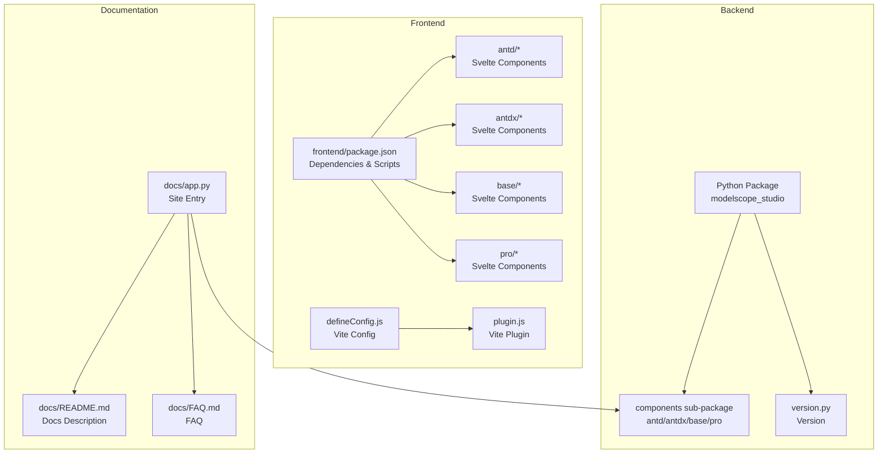
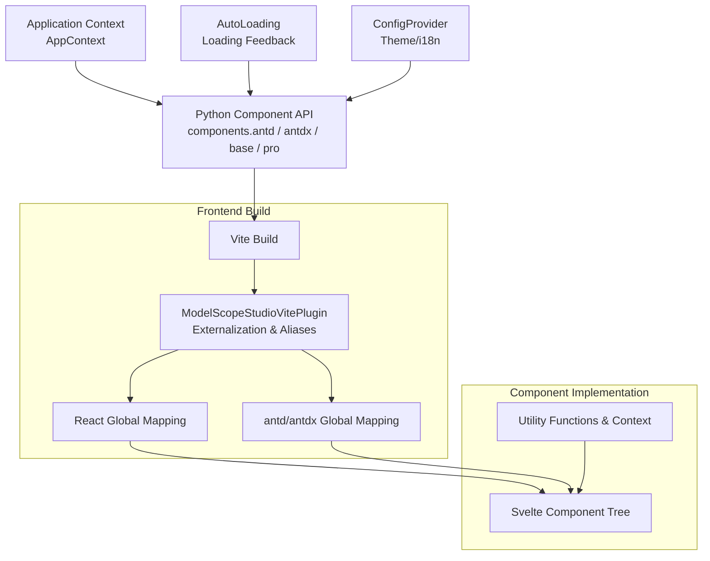
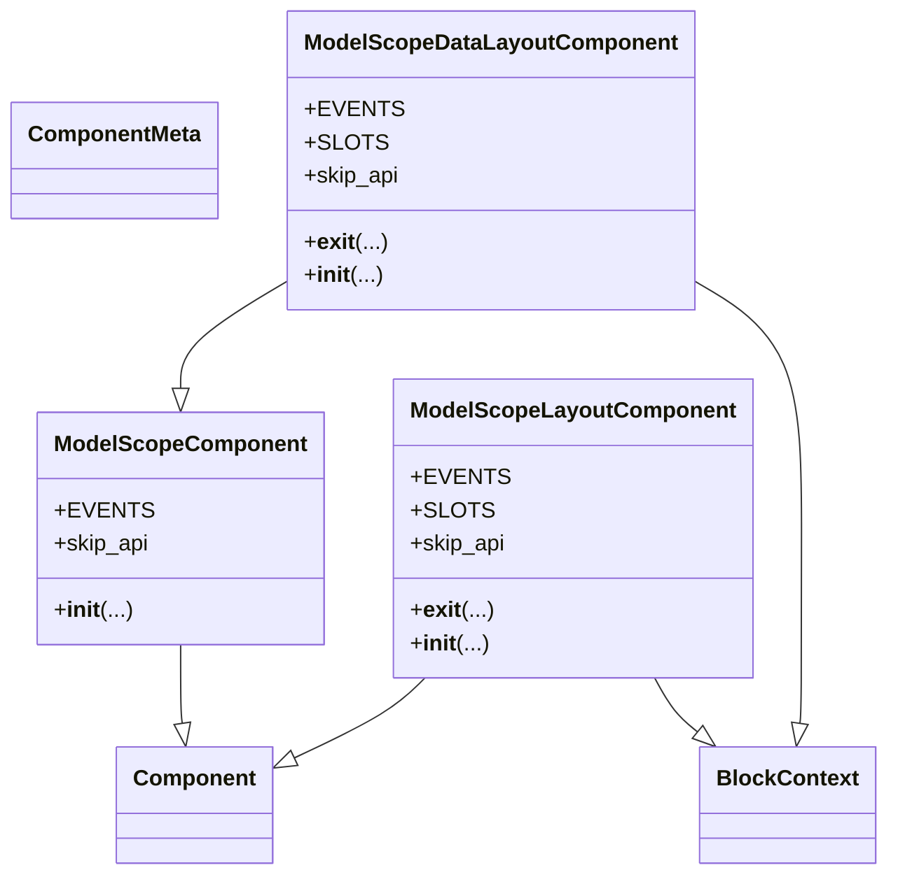
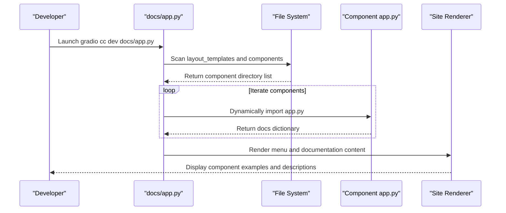
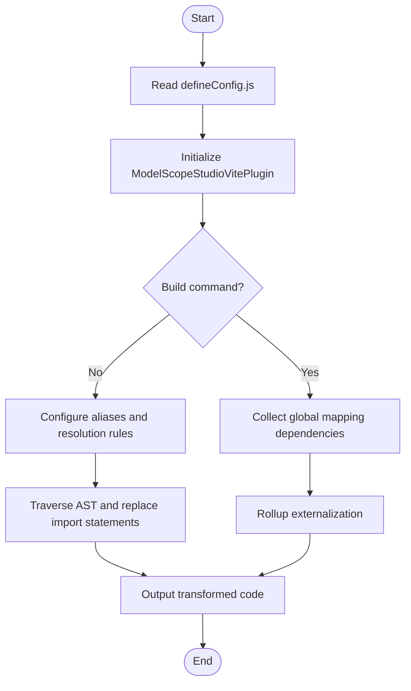
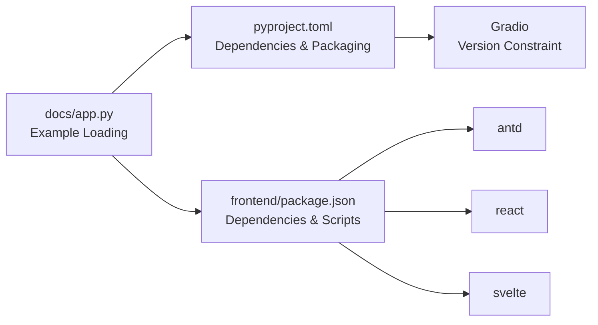

# Project Overview

<cite>
**Files referenced in this document**
- [README.md](file://README.md)
- [README-zh_CN.md](file://README-zh_CN.md)
- [package.json](file://package.json)
- [pyproject.toml](file://pyproject.toml)
- [backend/modelscope_studio/version.py](file://backend/modelscope_studio/version.py)
- [backend/modelscope_studio/__init__.py](file://backend/modelscope_studio/__init__.py)
- [backend/modelscope_studio/components/__init__.py](file://backend/modelscope_studio/components/__init__.py)
- [backend/modelscope_studio/components/antd/components.py](file://backend/modelscope_studio/components/antd/components.py)
- [backend/modelscope_studio/components/antdx/components.py](file://backend/modelscope_studio/components/antdx/components.py)
- [backend/modelscope_studio/utils/dev/component.py](file://backend/modelscope_studio/utils/dev/component.py)
- [backend/modelscope_studio/utils/dev/app_context.py](file://backend/modelscope_studio/utils/dev/app_context.py)
- [frontend/package.json](file://frontend/package.json)
- [frontend/defineConfig.js](file://frontend/defineConfig.js)
- [frontend/plugin.js](file://frontend/plugin.js)
- [docs/README.md](file://docs/README.md)
- [docs/app.py](file://docs/app.py)
- [docs/FAQ.md](file://docs/FAQ.md)
</cite>

## Table of Contents

1. [Introduction](#introduction)
2. [Project Structure](#project-structure)
3. [Core Components](#core-components)
4. [Architecture Overview](#architecture-overview)
5. [Detailed Component Analysis](#detailed-component-analysis)
6. [Dependency Analysis](#dependency-analysis)
7. [Performance Considerations](#performance-considerations)
8. [Troubleshooting Guide](#troubleshooting-guide)
9. [Conclusion](#conclusion)
10. [Appendix](#appendix)

## Introduction

ModelScope Studio is a third-party component library based on Gradio, designed to provide developers with more customizable UI-building capabilities and richer component usage patterns. The project supports both Ant Design and Ant Design X UI ecosystems, and achieves cross-framework component bridging and rendering through a unified Python component interface and a frontend Svelte/React technology stack.

- Core Goals
  - Improve page layout and component flexibility to help build more visually appealing user interfaces
  - Maintain good compatibility with native Gradio components to meet diverse interaction needs from simple to complex
  - Enhance developer experience and user experience through the Application context and AutoLoading feedback mechanism

- Key Features
  - Three-tier component system: base components, Ant Design components (antd), Ant Design X components (antdx), and Pro components (pro)
  - Frontend uses Vite + Svelte + React preprocessing bridge, along with a custom Vite plugin for module aliasing and externalization
  - Supports multi-language site and documentation system, covering Chinese, English, and Japanese

- Use Cases
  - Quickly build data visualization and interactive demo pages
  - Deploy interactive applications on Hugging Face Space or ModelScope Studio platforms
  - Workflows requiring complex forms, tables, charts, and conversational interactions

- Design Philosophy
  - Uses Gradio Blocks as the host, encapsulating frontend Svelte components through Python component wrappers to achieve integrated "Python logic + customizable UI" development
  - Provides unified theme, lifecycle, and loading state management through context components such as ConfigProvider, Application, and AutoLoading

- Relationship with Ant Design / Ant Design X
  - antd components map directly to the Ant Design component ecosystem, providing richer layout and interaction capabilities
  - antdx components focus on conversational experiences and knowledge workflows, such as Bubble, Sender, ThoughtChain, etc.
  - pro components provide professional-grade interaction capabilities, such as Chatbot, Monaco Editor, Web Sandbox, etc.

- Technical Architecture
  - Backend: Python handles component exports and version information; component registration is centralized in the components sub-package
  - Frontend: Svelte component tree + React preprocessing bridge; Vite build and plugin inject global variables
  - Documentation: Based on the docs site with dynamically loaded component examples, supporting multiple languages and layout templates

- Development History and Versions
  - Current version: 2.0.0
  - License: Apache-2.0
  - Dependency range: Gradio >= 4.43.0 and <= 6.8.0

- Usage Recommendations
  - When deploying on Hugging Face Space, set `ssr_mode=False`
  - Globally include AutoLoading for consistent loading feedback
  - To migrate legacy components, simply wrap with `ms.Application` to continue using them

**Section Sources**

- [README.md:17-101](file://README.md#L17-L101)
- [README-zh_CN.md:17-101](file://README-zh_CN.md#L17-L101)
- [docs/README.md:32-75](file://docs/README.md#L32-L75)
- [docs/FAQ.md:1-20](file://docs/FAQ.md#L1-L20)

## Project Structure

The project uses a front-end/back-end separated, multi-package collaborative organization:

- backend/modelscope_studio: Python backend components and packaging configuration
- frontend: Frontend components (Svelte/React) and build configuration
- docs: Documentation site and example applications
- config/scripts: Changesets, publish scripts, and Lint configuration

**Diagram Sources**

- [backend/modelscope_studio/**init**.py:1-3](file://backend/modelscope_studio/__init__.py#L1-L3)
- [backend/modelscope_studio/components/**init**.py:1-5](file://backend/modelscope_studio/components/__init__.py#L1-L5)
- [frontend/package.json:1-59](file://frontend/package.json#L1-L59)
- [frontend/defineConfig.js:1-19](file://frontend/defineConfig.js#L1-L19)
- [frontend/plugin.js:1-168](file://frontend/plugin.js#L1-L168)
- [docs/app.py:1-200](file://docs/app.py#L1-L200)
- [docs/README.md:1-75](file://docs/README.md#L1-L75)
- [docs/FAQ.md:1-20](file://docs/FAQ.md#L1-L20)

**Section Sources**

- [backend/modelscope_studio/**init**.py:1-3](file://backend/modelscope_studio/__init__.py#L1-L3)
- [backend/modelscope_studio/components/**init**.py:1-5](file://backend/modelscope_studio/components/__init__.py#L1-L5)
- [frontend/package.json:1-59](file://frontend/package.json#L1-L59)
- [docs/app.py:1-200](file://docs/app.py#L1-L200)

## Core Components

- Component Categories
  - antd: Covers the full range of Ant Design component families including general, layout, navigation, data entry, data display, feedback, etc.
  - antdx: Component family oriented toward conversational experience, such as Bubble, Sender, ThoughtChain, Prompts, etc.
  - base: Basic layout and rendering utility components, such as Application, AutoLoading, Slot, Fragment, Each, Filter, Markdown, etc.
  - pro: Professional interaction components, such as Chatbot, Monaco Editor, Web Sandbox, Multimodal Input, etc.

- Exports and Aggregation
  - The backend `components/__init__.py` centralizes exports of antd, antdx, base, and pro components, making it easy to import by namespace
  - `antd/components.py` and `antdx/components.py` respectively list component classes for each sub-module, forming a unified Python API

- Key Context Components
  - Application: Application-level context used to establish the component tree and lifecycle management
  - AutoLoading: Automatic loading feedback component, ensuring interactive operations have consistent loading indicators
  - ConfigProvider: Theme and internationalization configuration provider, spanning the antd component tree

- Development Base Classes
  - ModelScopeComponent / ModelScopeLayoutComponent / ModelScopeDataLayoutComponent: Provide unified lifecycle, slot, and rendering control for components

**Section Sources**

- [backend/modelscope_studio/components/**init**.py:1-5](file://backend/modelscope_studio/components/__init__.py#L1-L5)
- [backend/modelscope_studio/components/antd/components.py:1-144](file://backend/modelscope_studio/components/antd/components.py#L1-L144)
- [backend/modelscope_studio/components/antdx/components.py:1-40](file://backend/modelscope_studio/components/antdx/components.py#L1-L40)
- [backend/modelscope_studio/utils/dev/component.py:11-169](file://backend/modelscope_studio/utils/dev/component.py#L11-L169)

## Architecture Overview

The overall architecture revolves around "Python component → frontend Svelte component → Gradio rendering". The frontend maps React/antd/antdx and other dependencies to global variables via Vite plugins, reducing bundle size and improving loading efficiency.

**Diagram Sources**

- [backend/modelscope_studio/utils/dev/app_context.py:1-25](file://backend/modelscope_studio/utils/dev/app_context.py#L1-L25)
- [frontend/defineConfig.js:1-19](file://frontend/defineConfig.js#L1-L19)
- [frontend/plugin.js:1-168](file://frontend/plugin.js#L1-L168)
- [frontend/package.json:1-59](file://frontend/package.json#L1-L59)

## Detailed Component Analysis

### Component Class Hierarchy

The following class diagram shows the relationship between backend component base classes and their typical derived components, reflecting unified lifecycle and rendering strategies.

**Diagram Sources**

- [backend/modelscope_studio/utils/dev/component.py:11-169](file://backend/modelscope_studio/utils/dev/component.py#L11-L169)

**Section Sources**

- [backend/modelscope_studio/utils/dev/component.py:11-169](file://backend/modelscope_studio/utils/dev/component.py#L11-L169)

### Documentation Site and Example Loading Flow

The documentation site dynamically scans `app.py` for each component under `docs/components`, aggregates them to generate the sidebar and documentation content, and supports layout templates and multi-language switching.

**Diagram Sources**

- [docs/app.py:19-61](file://docs/app.py#L19-L61)

**Section Sources**

- [docs/app.py:19-61](file://docs/app.py#L19-L61)

### Frontend Build and Module Externalization

The frontend uses a custom Vite plugin to map React, antd, antdx, and other dependencies to global variables, avoiding repeated bundling. Externalization is performed during the build phase to reduce artifact size.

**Diagram Sources**

- [frontend/defineConfig.js:1-19](file://frontend/defineConfig.js#L1-L19)
- [frontend/plugin.js:41-168](file://frontend/plugin.js#L41-L168)

**Section Sources**

- [frontend/defineConfig.js:1-19](file://frontend/defineConfig.js#L1-L19)
- [frontend/plugin.js:1-168](file://frontend/plugin.js#L1-L168)

### Component Namespaces and Import Conventions

- On the Python side, import corresponding components via `modelscope_studio.components.antd`, `antdx`, `base`, `pro`
- It is recommended to wrap the outermost layer of your application with `ms.Application` to enable context and lifecycle management
- For legacy components, they can also be used by wrapping with `ms.Application`

**Section Sources**

- [README.md:49-78](file://README.md#L49-L78)
- [docs/README.md:64-75](file://docs/README.md#L64-L75)

## Dependency Analysis

- Python Side
  - Dependencies: Gradio (version range constrained)
  - Optional dependencies: Build and release-related tools
  - Packaging: Built with hatchling; artifact list includes many component template resources

- Frontend Side
  - Dependencies: antd, @ant-design/x, @gradio/\*, monaco-editor, svelte, react, etc.
  - Build: Vite + React-SWC + Less; plugin handles externalization and alias replacement

- Documentation and Site
  - Based on `docs/app.py` dynamically loading component examples; supports multiple languages and layout templates

**Diagram Sources**

- [pyproject.toml:26](file://pyproject.toml#L26)
- [frontend/package.json:8-40](file://frontend/package.json#L8-L40)
- [docs/app.py:19-61](file://docs/app.py#L19-L61)

**Section Sources**

- [pyproject.toml:9-43](file://pyproject.toml#L9-L43)
- [frontend/package.json:1-59](file://frontend/package.json#L1-L59)
- [docs/app.py:19-61](file://docs/app.py#L19-L61)

## Performance Considerations

- Frontend Externalization and Aliasing
  - Maps React, antd, antdx, etc. to global variables via Vite plugin, reducing repeated bundling and size
  - Rollup externalization during build phase further reduces artifact size

- Component Loading Feedback
  - AutoLoading provides unified loading placeholders, improving perceived performance during interaction delays
  - It is recommended to include AutoLoading at least once globally to avoid missing Gradio's default loading state

- Documentation and Examples
  - `docs/app.py` uses on-demand dynamic imports of component `app.py`, reducing initial load pressure

**Section Sources**

- [frontend/plugin.js:41-168](file://frontend/plugin.js#L41-L168)
- [docs/FAQ.md:7-20](file://docs/FAQ.md#L7-L20)
- [docs/app.py:19-61](file://docs/app.py#L19-L61)

## Troubleshooting Guide

- Hugging Face Space page not displaying or style anomalies
  - Solution: Add `ssr_mode=False` parameter in `demo.launch()`

- Slow operation response or no feedback
  - Cause: Independent loading feedback mechanism of each component and waiting time caused by Gradio frontend/backend communication
  - Solution: Globally include the AutoLoading component to ensure loading state is visible

- Missing Application context warning
  - Symptom: A warning is triggered when the outermost layer is not wrapped with `ms.Application`
  - Solution: Wrap with `ms.Application` at the outermost layer

**Section Sources**

- [docs/FAQ.md:1-20](file://docs/FAQ.md#L1-L20)
- [backend/modelscope_studio/utils/dev/app_context.py:16-21](file://backend/modelscope_studio/utils/dev/app_context.py#L16-L21)
- [README.md:32](file://README.md#L32)

## Conclusion

ModelScope Studio, with Gradio as its core, combines the rich component ecosystems of Ant Design and Ant Design X to provide an integrated solution from basic layout to professional interactions. Through a unified Python component API, frontend Svelte/React bridging, and Vite plugin optimizations, the project strikes a balance between ease of use and performance. For beginners, it is recommended to start with base components and Application/AutoLoading; for experienced developers, exploring antdx and pro components can quickly build conversational and professional-grade interactive applications.

## Appendix

- Version and License
  - Version: 2.0.0
  - License: Apache-2.0
  - Author: ModelScope team

- Installation and Quick Start
  - Install `modelscope_studio` via pip
  - Use `modelscope_studio.components.antd` and `modelscope_studio.components.base` within Blocks

- Development and Contributing
  - Backend installation: `pip install -e '.'`
  - Frontend installation: `pnpm install`
  - Build: `pnpm build`
  - Start documentation: `gradio cc dev docs/app.py`

**Section Sources**

- [backend/modelscope_studio/version.py:1-2](file://backend/modelscope_studio/version.py#L1-L2)
- [package.json:1-55](file://package.json#L1-L55)
- [pyproject.toml:9-43](file://pyproject.toml#L9-L43)
- [README.md:38-101](file://README.md#L38-L101)
- [README-zh_CN.md:38-101](file://README-zh_CN.md#L38-L101)
