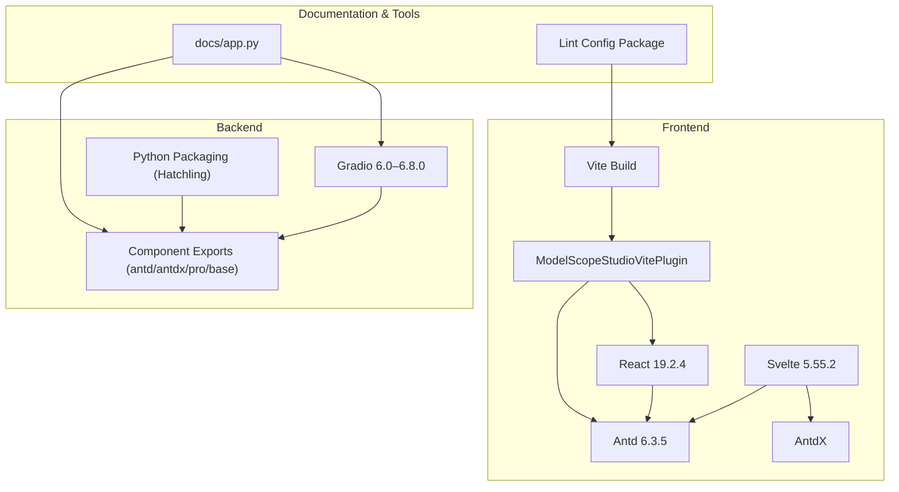
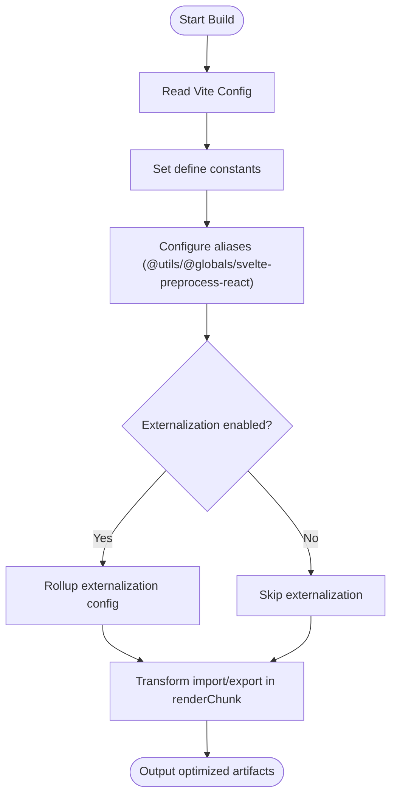
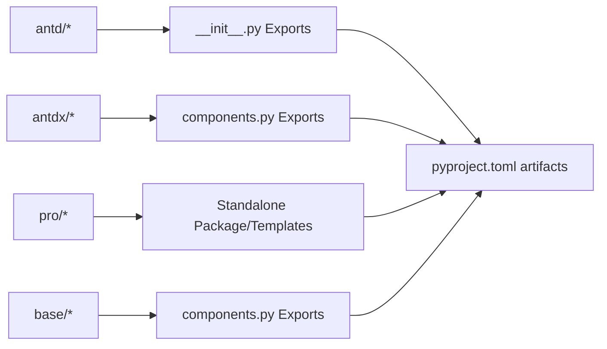
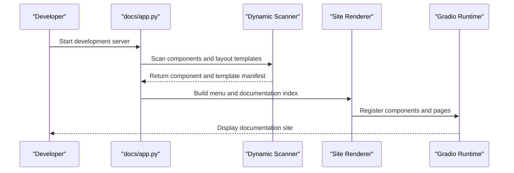
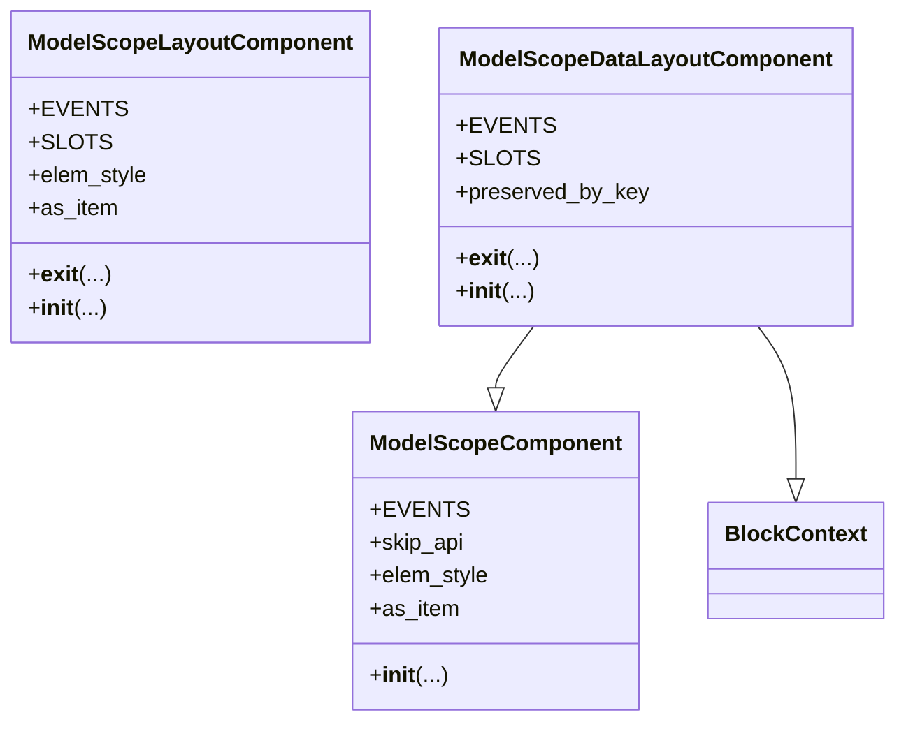
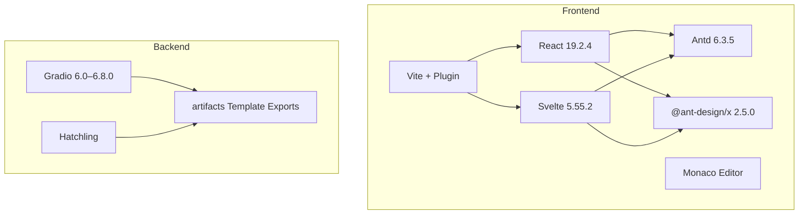

# Tech Stack

<cite>
**Files referenced in this document**
- [package.json](file://package.json)
- [pyproject.toml](file://pyproject.toml)
- [pnpm-workspace.yaml](file://pnpm-workspace.yaml)
- [frontend/package.json](file://frontend/package.json)
- [frontend/defineConfig.js](file://frontend/defineConfig.js)
- [frontend/plugin.js](file://frontend/plugin.js)
- [frontend/tsconfig.json](file://frontend/tsconfig.json)
- [svelte-tsconfig.json](file://svelte-tsconfig.json)
- [docs/app.py](file://docs/app.py)
- [backend/modelscope_studio/version.py](file://backend/modelscope_studio/version.py)
- [backend/modelscope_studio/components/antd/__init__.py](file://backend/modelscope_studio/components/antd/__init__.py)
- [backend/modelscope_studio/components/antd/components.py](file://backend/modelscope_studio/components/antd/components.py)
- [backend/modelscope_studio/components/antdx/components.py](file://backend/modelscope_studio/components/antdx/components.py)
- [backend/modelscope_studio/utils/dev/component.py](file://backend/modelscope_studio/utils/dev/component.py)
- [config/lint-config/package.json](file://config/lint-config/package.json)
</cite>

## Table of Contents

1. [Introduction](#introduction)
2. [Project Structure](#project-structure)
3. [Core Components](#core-components)
4. [Architecture Overview](#architecture-overview)
5. [Detailed Component Analysis](#detailed-component-analysis)
6. [Dependency Analysis](#dependency-analysis)
7. [Performance Considerations](#performance-considerations)
8. [Troubleshooting Guide](#troubleshooting-guide)
9. [Conclusion](#conclusion)
10. [Appendix](#appendix)

## Introduction

This document is aimed at developers and maintainers of the ModelScope Studio project. It systematically reviews and explains the project's technology stack and architecture design, with key coverage of:

- Python backend tech stack: Gradio 6.0–6.8.0, component library organization and packaging strategy
- Frontend tech stack: Svelte 5.55.2, Ant Design 6.3.5, Ant Design X, React 19.2.4, Vite build and plugin system
- Monorepo architecture: Workspace division, package management and build process
- Development toolchain: ESLint, Stylelint, Prettier, TypeScript, Svelte checking
- Testing and release: Changeset version management, PyPI publish scripts
- Best practices: Component architecture, plugin system, build optimization and error handling

## Project Structure

ModelScope Studio uses a Monorepo architecture, where the root directory manages multiple sub-packages and configuration modules through the pnpm workspace. The frontend is built around Svelte, combined with the React ecosystem and Ant Design/Ant Design X component system; the backend is based on Gradio's custom component mechanism, providing rich UI components and advanced capabilities.

```mermaid
graph TB
Root["Repository Root"] --> Frontend["Frontend Packages<br/>frontend/"]
Root --> Backend["Python Package<br/>backend/modelscope_studio/"]
Root --> Config["Configuration & Toolchain<br/>config/"]
Root --> Docs["Documentation Site<br/>docs/"]
Root --> Scripts["Scripts & Release<br/>scripts/"]
Frontend --> Antd["Antd Component Collection<br/>frontend/antd/"]
Frontend --> Antdx["AntdX Component Collection<br/>frontend/antdx/"]
Frontend --> Pro["Pro Advanced Components<br/>frontend/pro/"]
Frontend --> Base["Base Components<br/>frontend/base/"]
Frontend --> Utils["Utilities & Aliases<br/>frontend/utils/"]
Frontend --> Plugin["Vite Plugin<br/>frontend/plugin.js"]
Frontend --> Define["Vite Config Factory<br/>frontend/defineConfig.js"]
Backend --> PyPkg["Python Packaging Config<br/>pyproject.toml"]
Backend --> Version["Version<br/>backend/modelscope_studio/version.py"]
Backend --> Components["Component Export Entry<br/>backend/modelscope_studio/components/antd/__init__.py"]
Backend --> DevUtil["Dev Utilities & Context<br/>backend/modelscope_studio/utils/dev/component.py"]
Docs --> AppPy["Documentation App Entry<br/>docs/app.py"]
Config --> Lint["Lint Config Package<br/>config/lint-config/package.json"]
```

Diagram Sources

- [pnpm-workspace.yaml:1-12](file://pnpm-workspace.yaml#L1-L12)
- [frontend/package.json:1-59](file://frontend/package.json#L1-L59)
- [pyproject.toml:1-257](file://pyproject.toml#L1-L257)
- [docs/app.py:1-595](file://docs/app.py#L1-L595)

Section Sources

- [pnpm-workspace.yaml:1-12](file://pnpm-workspace.yaml#L1-L12)
- [frontend/package.json:1-59](file://frontend/package.json#L1-L59)
- [pyproject.toml:1-257](file://pyproject.toml#L1-L257)
- [docs/app.py:1-595](file://docs/app.py#L1-L595)

## Core Components

- Python Backend
  - Gradio 6.0–6.8.0: The foundational framework for component runtime and page rendering, responsible for component lifecycle, events, and state management.
  - Component organization: Split into antd, antdx, pro, base four namespaces by functional domain for on-demand imports and documentation generation.
  - Packaging and distribution: Built with Hatchling; artifacts explicitly export each component's template resources; wheel contains only the backend package path.
- Frontend
  - Svelte 5.55.2: Component compiler and runtime with smaller footprint and faster hot-reload experience.
  - Ant Design 6.3.5 and Ant Design X: The former provides general UI capabilities; the latter focuses on conversational and collaborative scenarios.
  - React 19.2.4: Bridges the React ecosystem through Vite plugin, enabling mixed use with Svelte and sharing global objects.
  - Vite build: Uses custom plugins for externalization and alias mapping to reduce artifact size and improve loading efficiency.
- Documentation and Site
  - docs/app.py: Dynamically scans components and layout templates to generate a multi-tab documentation site, supporting Chinese/English switching and theming.

Section Sources

- [backend/modelscope_studio/components/antd/**init**.py:1-150](file://backend/modelscope_studio/components/antd/__init__.py#L1-L150)
- [backend/modelscope_studio/components/antd/components.py:1-144](file://backend/modelscope_studio/components/antd/components.py#L1-L144)
- [backend/modelscope_studio/components/antdx/components.py:1-40](file://backend/modelscope_studio/components/antdx/components.py#L1-L40)
- [pyproject.toml:45-257](file://pyproject.toml#L45-L257)
- [docs/app.py:1-595](file://docs/app.py#L1-L595)

## Architecture Overview

The overall architecture consists of "frontend component layer + backend component layer + documentation & toolchain." The frontend externalizes React/AntD and other dependencies to host globals via Vite plugin; Svelte components consume them directly in the browser; the backend registers Python components as reusable modules through Gradio, and renders and demos them in the documentation site.

Diagram Sources

- [frontend/plugin.js:1-168](file://frontend/plugin.js#L1-L168)
- [frontend/package.json:1-59](file://frontend/package.json#L1-L59)
- [pyproject.toml:1-257](file://pyproject.toml#L1-L257)
- [docs/app.py:1-595](file://docs/app.py#L1-L595)
- [config/lint-config/package.json:1-48](file://config/lint-config/package.json#L1-L48)

## Detailed Component Analysis

### Frontend Vite Plugin and Build Optimization

The plugin is responsible for:

- Externalizing React, Ant Design, AntdX, dayjs, monaco-loader, and other dependencies as `window.ms_globals.*`, avoiding repeated bundling
- Setting `define` constants at build stage to ensure consistent production environment behavior
- Simplifying import paths through alias mapping of `@utils`, `@globals`, `svelte-preprocess-react`
- Transforming import/export declarations in the `renderChunk` stage to rewrite module references as global accesses, reducing runtime overhead

Diagram Sources

- [frontend/defineConfig.js:1-19](file://frontend/defineConfig.js#L1-L19)
- [frontend/plugin.js:41-168](file://frontend/plugin.js#L41-L168)

Section Sources

- [frontend/defineConfig.js:1-19](file://frontend/defineConfig.js#L1-L19)
- [frontend/plugin.js:1-168](file://frontend/plugin.js#L1-L168)

### Component Exports and Namespaces

- antd: Covers the official Ant Design component system, split by module, providing full types and template resources
- antdx: Extended component collection for conversational and collaborative scenarios, such as Bubble, Conversations, Sender, etc.
- pro: Advanced business components, such as Chatbot, Monaco Editor, Web Sandbox
- base: Basic rendering and layout components, such as Application, AutoLoading, Slot, Fragment, Each, Filter, Markdown, etc.

Diagram Sources

- [backend/modelscope_studio/components/antd/**init**.py:1-150](file://backend/modelscope_studio/components/antd/__init__.py#L1-L150)
- [backend/modelscope_studio/components/antd/components.py:1-144](file://backend/modelscope_studio/components/antd/components.py#L1-L144)
- [backend/modelscope_studio/components/antdx/components.py:1-40](file://backend/modelscope_studio/components/antdx/components.py#L1-L40)
- [pyproject.toml:45-257](file://pyproject.toml#L45-L257)

Section Sources

- [backend/modelscope_studio/components/antd/**init**.py:1-150](file://backend/modelscope_studio/components/antd/__init__.py#L1-L150)
- [backend/modelscope_studio/components/antd/components.py:1-144](file://backend/modelscope_studio/components/antd/components.py#L1-L144)
- [backend/modelscope_studio/components/antdx/components.py:1-40](file://backend/modelscope_studio/components/antdx/components.py#L1-L40)
- [pyproject.toml:45-257](file://pyproject.toml#L45-L257)

### Documentation Site and Dynamic Routing

`docs/app.py` dynamically scans components and layout templates to build a multi-tab documentation site:

- Supports Chinese/English content switching
- Generates menu and documentation index for each component
- Renders unified entry point via Site; optimizes queue and concurrency parameters

Diagram Sources

- [docs/app.py:1-595](file://docs/app.py#L1-L595)

Section Sources

- [docs/app.py:1-595](file://docs/app.py#L1-L595)

### Component Base Classes and Context

The backend provides three types of component base classes for unified lifecycle, slot, and rendering control:

- ModelScopeComponent: Standard component base class, supporting events, visibility, styles, and other properties
- ModelScopeLayoutComponent: Layout component base class, supporting BlockContext and internal layout markers
- ModelScopeDataLayoutComponent: Mixed data and layout component, inheriting component and context capabilities

Diagram Sources

- [backend/modelscope_studio/utils/dev/component.py:11-169](file://backend/modelscope_studio/utils/dev/component.py#L11-L169)

Section Sources

- [backend/modelscope_studio/utils/dev/component.py:11-169](file://backend/modelscope_studio/utils/dev/component.py#L11-L169)

## Dependency Analysis

- Frontend dependencies
  - React and Ant Design: Externalized via Vite plugin to reduce bundle size
  - Svelte 5.55.2: Core compiler and runtime
  - Ant Design X: Provides conversational and collaborative component ecosystem
  - Monaco Editor and React ecosystem: For code editing and highlighting
- Backend dependencies
  - Gradio 6.0–6.8.0: Component runtime and page rendering
  - Build tools: Hatchling, Hatch-requirements-txt, Fancy-PyPI-Readme
  - artifacts explicitly export each component template; wheel contains only the backend path
- Toolchain
  - ESLint, Stylelint, Prettier, TypeScript, Svelte checking
  - Changesets for version management and change tracking

Diagram Sources

- [frontend/package.json:8-40](file://frontend/package.json#L8-L40)
- [pyproject.toml:45-257](file://pyproject.toml#L45-L257)
- [frontend/plugin.js:5-20](file://frontend/plugin.js#L5-L20)

Section Sources

- [frontend/package.json:1-59](file://frontend/package.json#L1-L59)
- [pyproject.toml:1-257](file://pyproject.toml#L1-L257)
- [frontend/plugin.js:1-168](file://frontend/plugin.js#L1-L168)

## Performance Considerations

- Externalization strategy: Externalizing React, Antd, AntdX, and other dependencies via Vite plugin significantly reduces frontend bundle size and initial load time
- Build target: ESNext module target, leveraging modern browser features to reduce transpilation costs
- Component templates: Backend accurately exports template resources via artifacts, avoiding redundant files in the wheel
- Concurrency and queues: Set queue and concurrency limits at documentation site startup to ensure demo stability

Section Sources

- [frontend/plugin.js:41-76](file://frontend/plugin.js#L41-L76)
- [frontend/tsconfig.json:1-8](file://frontend/tsconfig.json#L1-L8)
- [pyproject.toml:45-257](file://pyproject.toml#L45-L257)
- [docs/app.py:592-595](file://docs/app.py#L592-L595)

## Troubleshooting Guide

- Build failure or externalization anomalies
  - Check whether the Vite plugin correctly configures externals and aliases
  - Confirm that the global variable `window.ms_globals` exposes the required modules
- Component not displaying or style missing
  - Verify that artifact paths and template exports match
  - Ensure Gradio version is within the 6.0–6.8.0 range
- Documentation site fails to start
  - Check the scanning logic and menu building in `docs/app.py`
  - Confirm that the component's `app.py` exists and contains the `docs` field
- Lint or formatting errors
  - Use the unified lint configuration package to ensure consistent rules
  - Prioritize running formatting and type checking before ESLint/Stylelint

Section Sources

- [frontend/plugin.js:41-76](file://frontend/plugin.js#L41-L76)
- [pyproject.toml:45-257](file://pyproject.toml#L45-L257)
- [docs/app.py:19-61](file://docs/app.py#L19-L61)
- [config/lint-config/package.json:1-48](file://config/lint-config/package.json#L1-L48)

## Conclusion

ModelScope Studio uses a Monorepo as its backbone, with the frontend powered by dual Svelte and React engines, and the backend based on Gradio, forming a reusable "component as a service" ecosystem. Through Vite plugin externalization and alias mapping, precise artifact exports, and a unified Lint/formatting toolchain, the project achieves balance in maintainability, performance, and developer experience. It is recommended to continuously improve component documentation and automated testing in subsequent iterations to further enhance delivery quality and team collaboration efficiency.

## Appendix

- Version and Meta Information
  - Repository version: 2.0.0
  - Python package version: Aligned with repository version
- Key Configuration References
  - Frontend workspace and dependencies: [frontend/package.json:1-59](file://frontend/package.json#L1-L59)
  - Python packaging and exports: [pyproject.toml:45-257](file://pyproject.toml#L45-L257)
  - Workspace declaration: [pnpm-workspace.yaml:1-12](file://pnpm-workspace.yaml#L1-L12)
  - TypeScript and Svelte configuration: [frontend/tsconfig.json:1-8](file://frontend/tsconfig.json#L1-L8), [svelte-tsconfig.json:1-4](file://svelte-tsconfig.json#L1-L4)
  - Documentation site entry: [docs/app.py:1-595](file://docs/app.py#L1-L595)
  - Lint configuration package: [config/lint-config/package.json:1-48](file://config/lint-config/package.json#L1-L48)
