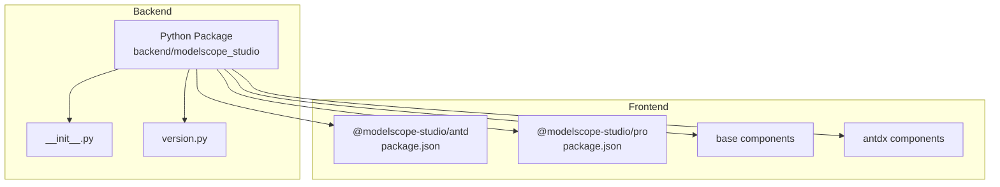
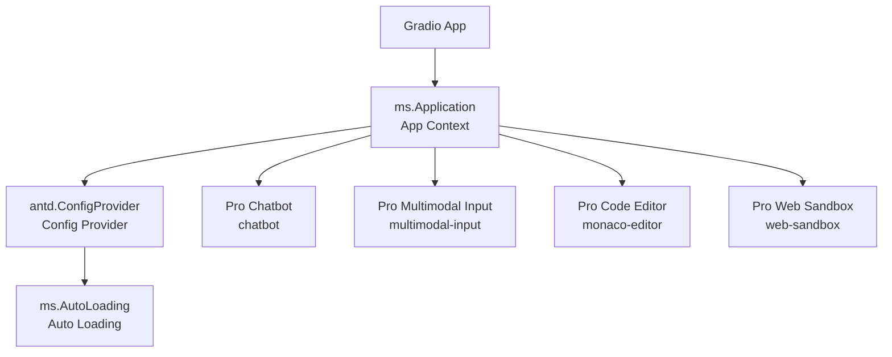
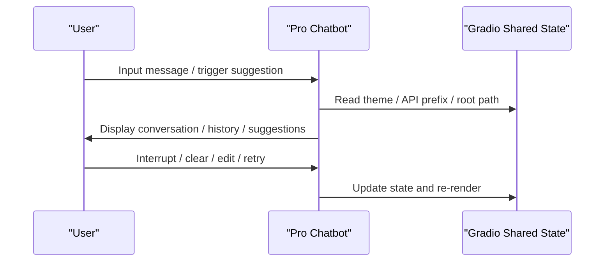
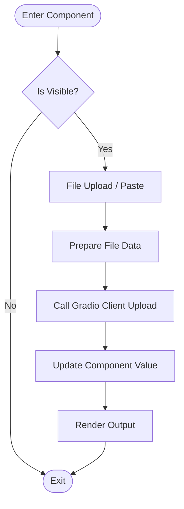
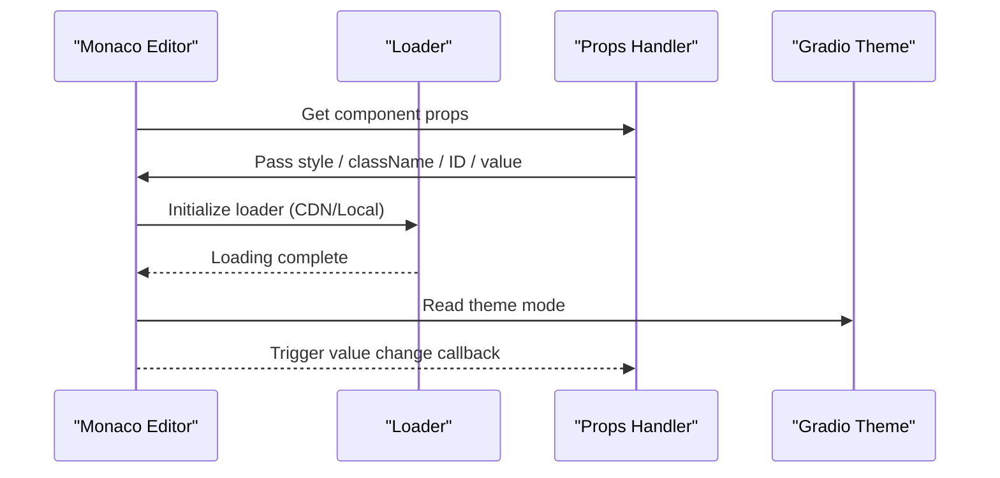
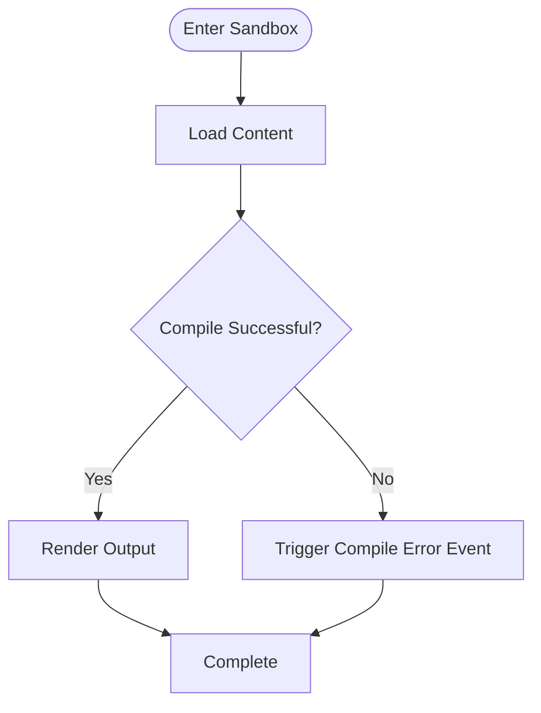
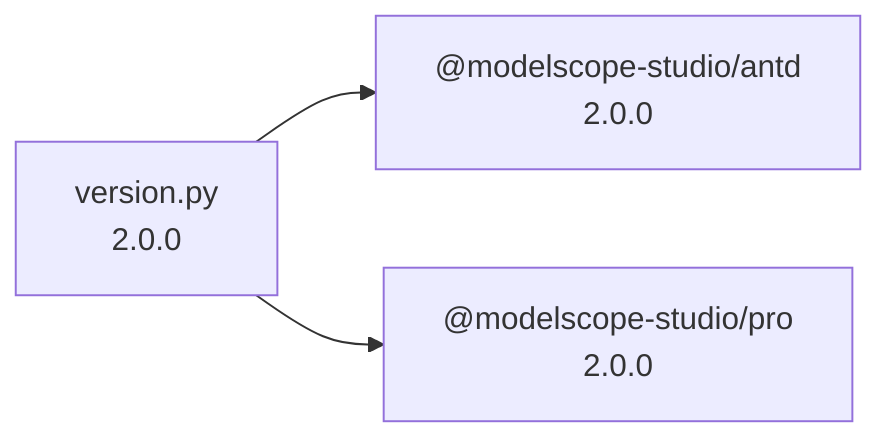

# Use Cases

<cite>
**Files Referenced in This Document**
- [README-zh_CN.md](file://README-zh_CN.md)
- [README.md](file://README.md)
- [backend/modelscope_studio/__init__.py](file://backend/modelscope_studio/__init__.py)
- [backend/modelscope_studio/version.py](file://backend/modelscope_studio/version.py)
- [frontend/antd/package.json](file://frontend/antd/package.json)
- [frontend/pro/package.json](file://frontend/pro/package.json)
- [backend/modelscope_studio/components/antd/components.py](file://backend/modelscope_studio/components/antd/components.py)
- [backend/modelscope_studio/components/pro/components.py](file://backend/modelscope_studio/components/pro/components.py)
- [frontend/pro/chatbot/Index.svelte](file://frontend/pro/chatbot/Index.svelte)
- [frontend/pro/multimodal-input/Index.svelte](file://frontend/pro/multimodal-input/Index.svelte)
- [frontend/pro/web-sandbox/Index.svelte](file://frontend/pro/web-sandbox/Index.svelte)
- [frontend/pro/monaco-editor/Index.svelte](file://frontend/pro/monaco-editor/Index.svelte)
- [docs/layout_templates/chatbot/README-zh_CN.md](file://docs/layout_templates/chatbot/README-zh_CN.md)
- [docs/layout_templates/coder_artifacts/README-zh_CN.md](file://docs/layout_templates/coder_artifacts/README-zh_CN.md)
- [docs/demos/example.py](file://docs/demos/example.py)
- [docs/README-zh_CN.md](file://docs/README-zh_CN.md)
</cite>

## Table of Contents

1. [Introduction](#introduction)
2. [Project Structure](#project-structure)
3. [Core Components](#core-components)
4. [Architecture Overview](#architecture-overview)
5. [Detailed Component Analysis](#detailed-component-analysis)
6. [Dependency Analysis](#dependency-analysis)
7. [Performance Considerations](#performance-considerations)
8. [Troubleshooting Guide](#troubleshooting-guide)
9. [Conclusion](#conclusion)
10. [Appendix](#appendix)

## Introduction

ModelScope Studio is a third-party component library built on Gradio, providing developers with more customizable interface-building capabilities and richer component usage patterns. It supports both the Ant Design and Ant Design X UI ecosystems, and offers Pro scenario-specific components (such as chatbot, multimodal input, code editor, web sandbox, etc.), making it ideal for rapidly building professional-grade frontends in machine learning and AI applications.

- Compared to Gradio's native components, ModelScope Studio emphasizes page layout flexibility and component richness, making it suitable for projects that prioritize visual and interactive experiences.
- When an application requires extensive built-in data processing on the Python side, it can be combined with Gradio's native components; ModelScope Studio serves as an optimization layer to enhance frontend presentation.
- When deploying in Hugging Face Space, set `ssr_mode=False` in `demo.launch()` to avoid page rendering issues.

Section Sources

- [README-zh_CN.md:26-32](file://README-zh_CN.md#L26-L32)
- [README.md:26-32](file://README.md#L26-L32)

## Project Structure

The project adopts a frontend-backend separation with a multi-package organization:

- Backend Python package: Provides component exports and version information, uniformly exposing component collections.
- Frontend Svelte packages: Split into sub-packages by module — antd, antdx, base, pro — corresponding to UI components, base capabilities, and Pro scenario components.
- Documentation and examples: Contains component documentation, layout templates, and demo scripts for rapid onboarding.

Diagram Sources

- [backend/modelscope_studio/**init**.py:1-3](file://backend/modelscope_studio/__init__.py#L1-L3)
- [backend/modelscope_studio/version.py:1-2](file://backend/modelscope_studio/version.py#L1-L2)
- [frontend/antd/package.json:1-6](file://frontend/antd/package.json#L1-L6)
- [frontend/pro/package.json:1-6](file://frontend/pro/package.json#L1-L6)

Section Sources

- [backend/modelscope_studio/**init**.py:1-3](file://backend/modelscope_studio/__init__.py#L1-L3)
- [backend/modelscope_studio/version.py:1-2](file://backend/modelscope_studio/version.py#L1-L2)
- [frontend/antd/package.json:1-6](file://frontend/antd/package.json#L1-L6)
- [frontend/pro/package.json:1-6](file://frontend/pro/package.json#L1-L6)

## Core Components

- Ant Design component family: Covers a full-chain UI component set for forms, layouts, feedback, navigation, data entry, and display, meeting standard business interface needs.
- Pro scenario-specific components: Dedicated components for AI/ML applications, including chatbot, multimodal input, code editor, and web sandbox.
- Base components: Provides common capabilities such as application context, auto-loading, text/paragraph/slot, supporting complex layouts and dynamic rendering.

Section Sources

- [backend/modelscope_studio/components/antd/components.py:1-144](file://backend/modelscope_studio/components/antd/components.py#L1-L144)
- [backend/modelscope_studio/components/pro/components.py:1-8](file://backend/modelscope_studio/components/pro/components.py#L1-L8)
- [docs/README-zh_CN.md:14-26](file://docs/README-zh_CN.md#L14-L26)

## Architecture Overview

ModelScope Studio's frontend components are implemented in Svelte and bridge React components into the Svelte context via `@svelte-preprocess-react`, enabling seamless integration with Gradio. Pro components further encapsulate logic for sharing state with Gradio (such as theme, API prefix, root path), ensuring stability across different deployment environments.

Diagram Sources

- [docs/demos/example.py:5-10](file://docs/demos/example.py#L5-L10)
- [frontend/pro/chatbot/Index.svelte:12-88](file://frontend/pro/chatbot/Index.svelte#L12-L88)
- [frontend/pro/multimodal-input/Index.svelte:13-96](file://frontend/pro/multimodal-input/Index.svelte#L13-L96)
- [frontend/pro/monaco-editor/Index.svelte:12-98](file://frontend/pro/monaco-editor/Index.svelte#L12-L98)
- [frontend/pro/web-sandbox/Index.svelte:12-74](file://frontend/pro/web-sandbox/Index.svelte#L12-L74)

## Detailed Component Analysis

### Pro Chatbot

- Use cases: AI chatbot interfaces, multi-turn conversation management, conversation history editing/retry/deletion, interruption prompts, input suggestions, attachment uploads, etc.
- Key features: Supports concurrent multi-session management, fine-grained history control, input suggestion triggers, attachment upload limits and format restrictions.
- Usage recommendations: Combine Gradio shared state and theme configuration to ensure consistent appearance and behavior across different deployment environments.

Diagram Sources

- [frontend/pro/chatbot/Index.svelte:67-88](file://frontend/pro/chatbot/Index.svelte#L67-L88)
- [docs/layout_templates/chatbot/README-zh_CN.md:7-11](file://docs/layout_templates/chatbot/README-zh_CN.md#L7-L11)

Section Sources

- [frontend/pro/chatbot/Index.svelte:12-88](file://frontend/pro/chatbot/Index.svelte#L12-L88)
- [docs/layout_templates/chatbot/README-zh_CN.md:1-20](file://docs/layout_templates/chatbot/README-zh_CN.md#L1-L20)

### Pro Multimodal Input

- Use cases: Interfaces in AI applications that require simultaneous text and multimedia (images/files) input, such as image description, document Q&A, code generation, etc.
- Key features: Supports file uploads, paste uploads, value change callbacks, and Gradio client integration.
- Usage recommendations: Set reasonable upload count and format restrictions, and combine with backend processing to ensure security and performance.

Diagram Sources

- [frontend/pro/multimodal-input/Index.svelte:68-96](file://frontend/pro/multimodal-input/Index.svelte#L68-L96)

Section Sources

- [frontend/pro/multimodal-input/Index.svelte:13-96](file://frontend/pro/multimodal-input/Index.svelte#L13-L96)

### Pro Monaco Editor

- Use cases: AI assistant/code generation tools, online IDE previews, code comparison and diff editing.
- Key features: Supports CDN/local loader modes, theme adaptation, value change callbacks, slot extensions.
- Usage recommendations: Choose the appropriate loader mode based on the deployment environment to avoid cross-origin and resource loading issues.

Diagram Sources

- [frontend/pro/monaco-editor/Index.svelte:61-89](file://frontend/pro/monaco-editor/Index.svelte#L61-L89)

Section Sources

- [frontend/pro/monaco-editor/Index.svelte:12-98](file://frontend/pro/monaco-editor/Index.svelte#L12-L98)

### Pro Web Sandbox

- Use cases: Online preview/debug of HTML/CSS/JS snippets, suitable for AI-assisted development and teaching demos.
- Key features: Compile error/success events, render error events, theme mode adaptation, slot extensions.
- Usage recommendations: Strictly control sandbox content and permissions to avoid executing untrusted code.

Diagram Sources

- [frontend/pro/web-sandbox/Index.svelte:60-74](file://frontend/pro/web-sandbox/Index.svelte#L60-L74)

Section Sources

- [frontend/pro/web-sandbox/Index.svelte:12-74](file://frontend/pro/web-sandbox/Index.svelte#L12-L74)

### Ant Design Component Family

- Use cases: General business interface construction, such as form filling, list display, pagination navigation, notification reminders, etc.
- Key features: Covers a complete component matrix aligned with the UI design system, supporting internationalization and theme switching.
- Usage recommendations: Use ConfigProvider for global configuration, combined with AutoLoading to improve initial screen experience.

Section Sources

- [backend/modelscope_studio/components/antd/components.py:1-144](file://backend/modelscope_studio/components/antd/components.py#L1-L144)
- [docs/demos/example.py:5-10](file://docs/demos/example.py#L5-L10)

## Dependency Analysis

- Version and naming: Both `@modelscope-studio/antd` and `@modelscope-studio/pro` frontend packages are labeled `2.0.0`, and the backend `version.py` also points to the same semantic version, ensuring frontend-backend consistency.
- Integration with Gradio: Components render and interact through Gradio shared state (root, api_prefix, theme), ensuring consistency across different deployment environments (including Hugging Face Space).
- Deployment notes: When deploying in Hugging Face Space, set `ssr_mode=False` in `demo.launch()` to avoid SSR-related page rendering issues.

Diagram Sources

- [backend/modelscope_studio/version.py:1-2](file://backend/modelscope_studio/version.py#L1-L2)
- [frontend/antd/package.json:1-6](file://frontend/antd/package.json#L1-L6)
- [frontend/pro/package.json:1-6](file://frontend/pro/package.json#L1-L6)

Section Sources

- [backend/modelscope_studio/version.py:1-2](file://backend/modelscope_studio/version.py#L1-L2)
- [frontend/antd/package.json:1-6](file://frontend/antd/package.json#L1-L6)
- [frontend/pro/package.json:1-6](file://frontend/pro/package.json#L1-L6)
- [README-zh_CN.md:32](file://README-zh_CN.md#L32)
- [README.md:32](file://README.md#L32)

## Performance Considerations

- On-demand loading and lazy loading: Pro components universally adopt `importComponent` and dynamic `import` to reduce initial bundle size and first-screen blocking.
- Theme and resources: Monaco Editor supports CDN/local loaders, which can be chosen based on network and security policies to avoid unnecessary resource downloads.
- File uploads: The multimodal input component uploads files through the Gradio client; it is recommended to limit file size and type on the frontend to reduce backend pressure.
- SSR note: Disable SSR in Hugging Face Space to avoid compatibility issues caused by server-side rendering.

Section Sources

- [frontend/pro/monaco-editor/Index.svelte:61-70](file://frontend/pro/monaco-editor/Index.svelte#L61-L70)
- [frontend/pro/multimodal-input/Index.svelte:68-75](file://frontend/pro/multimodal-input/Index.svelte#L68-L75)
- [README-zh_CN.md:32](file://README-zh_CN.md#L32)
- [README.md:32](file://README.md#L32)

## Troubleshooting Guide

- Page not displayed or rendering abnormally: Add `ssr_mode=False` to `demo.launch()`, especially in Hugging Face Space environments.
- Component not visible: Check the component's `visible` property and parent container layout; confirm that `ms.Application` wrapping level is correct.
- Editor loading failure: Confirm the `_loader` configuration (cdn/local) and `cdn_url` are valid; avoid cross-origin and resource path issues.
- Upload failure: Check file type and count limits; confirm the Gradio client upload interface is available.

Section Sources

- [README-zh_CN.md:32](file://README-zh_CN.md#L32)
- [README.md:32](file://README.md#L32)
- [frontend/pro/monaco-editor/Index.svelte:61-70](file://frontend/pro/monaco-editor/Index.svelte#L61-L70)
- [frontend/pro/multimodal-input/Index.svelte:68-75](file://frontend/pro/multimodal-input/Index.svelte#L68-L75)

## Conclusion

ModelScope Studio provides a highly customizable, high-performance frontend interface solution for machine learning and AI applications through Ant Design and Pro scenario-specific components. It excels in the following areas:

- Deep integration with Gradio, simplifying the frontend development workflow for AI applications.
- Provides AI-oriented specialized components including chatbot, multimodal input, code editor, and web sandbox, covering common business scenarios.
- Supports flexible theme and internationalization configuration, adapting to multiple deployment environments.

When to choose:

- Need to build visually appealing, interaction-rich AI application interfaces.
- Need scenario-specific capabilities such as multimodal input, conversation management, code editing, and online preview.
- Have differentiated deployment requirements (e.g., Hugging Face Space) that require SSR control.

When not to choose:

- The application requires extensive built-in data processing and computation on the Python side; prefer Gradio's native components.
- Extremely sensitive to frontend performance and resource usage, and do not require complex UI or interactions.

## Appendix

- Quick start example: Use `ms.Application`, `antd.ConfigProvider`, and `ms.AutoLoading` to wrap components inside Blocks, then launch the demo.
- Layout templates: The chatbot and Coder Artifacts templates provide out-of-the-box scenario-specific interfaces.

Section Sources

- [docs/demos/example.py:5-10](file://docs/demos/example.py#L5-L10)
- [docs/layout_templates/chatbot/README-zh_CN.md:1-20](file://docs/layout_templates/chatbot/README-zh_CN.md#L1-L20)
- [docs/layout_templates/coder_artifacts/README-zh_CN.md:1-8](file://docs/layout_templates/coder_artifacts/README-zh_CN.md#L1-L8)
