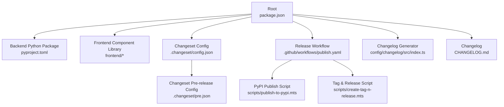
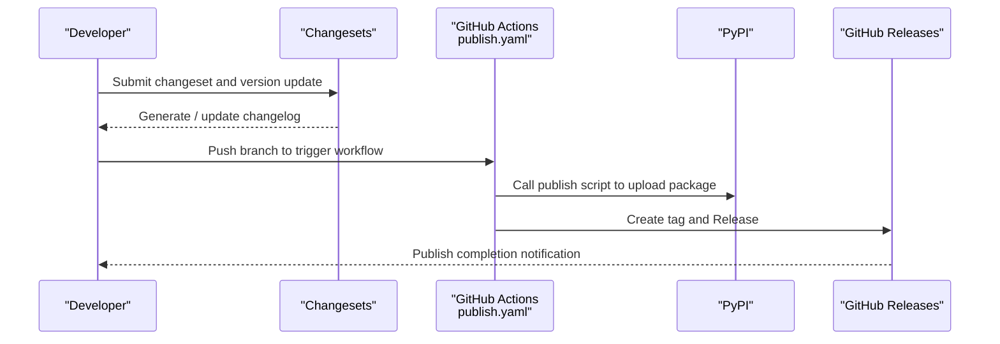
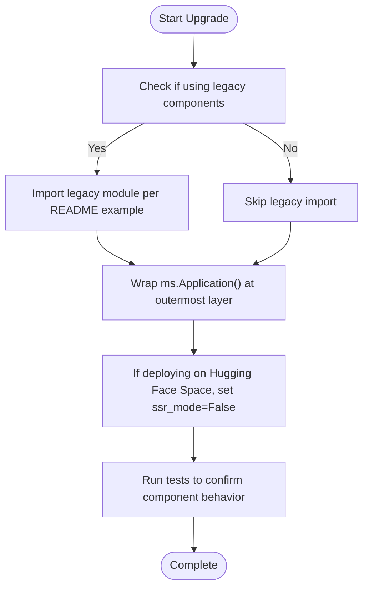
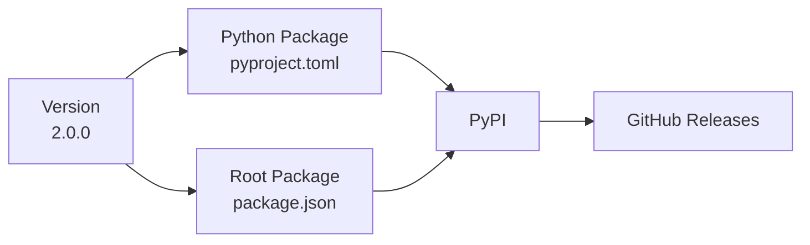

# Version Info

<cite>
**Files Referenced in This Document**
- [backend/modelscope_studio/version.py](file://backend/modelscope_studio/version.py)
- [package.json](file://package.json)
- [pyproject.toml](file://pyproject.toml)
- [CHANGELOG.md](file://CHANGELOG.md)
- [.changeset/config.json](file://.changeset/config.json)
- [.changeset/pre.json](file://.changeset/pre.json)
- [.github/workflows/publish.yaml](file://.github/workflows/publish.yaml)
- [scripts/create-tag-n-release.mts](file://scripts/create-tag-n-release.mts)
- [scripts/publish-to-pypi.mts](file://scripts/publish-to-pypi.mts)
- [config/changelog/src/index.ts](file://config/changelog/src/index.ts)
- [README.md](file://README.md)
- [docs/FAQ.md](file://docs/FAQ.md)
</cite>

## Update Summary

**Changes**

- Version number updated from 2.0.0-beta.0 to 2.0.0
- Gradio dependency version requirement updated to standard syntax format
- Updated changelog to reflect features of 2.0.0

## Table of Contents

1. [Introduction](#introduction)
2. [Project Structure](#project-structure)
3. [Core Components](#core-components)
4. [Architecture Overview](#architecture-overview)
5. [Detailed Component Analysis](#detailed-component-analysis)
6. [Dependency Analysis](#dependency-analysis)
7. [Performance Considerations](#performance-considerations)
8. [Troubleshooting Guide](#troubleshooting-guide)
9. [Conclusion](#conclusion)
10. [Appendix](#appendix)

## Introduction

This document is intended for ModelScope Studio users and maintainers, systematically organizing project version information, including version history, current version status, upgrade paths, compatibility policies, long-term support and support lifecycle, known issues and security updates, how to view changelogs, and release frequency. In particular, for the major changes and migration paths in version 1.0, it provides actionable upgrade steps and best practices.

## Project Structure

ModelScope Studio is organized using a multi-package workspace (pnpm workspace). The core backend is published as a Python package, the frontend is built as a Svelte component library, and version and changelog generation is managed through the Changesets toolchain. The release process is automated by GitHub Actions, completing the build, uploading to PyPI, creating tags, and publishing GitHub Releases.

**Diagram Sources**

- [package.json:1-55](file://package.json#L1-L55)
- [pyproject.toml:1-258](file://pyproject.toml#L1-L258)
- [.changeset/config.json:1-15](file://.changeset/config.json#L1-L15)
- [.changeset/pre.json:1-16](file://.changeset/pre.json#L1-L16)
- [.github/workflows/publish.yaml:1-74](file://.github/workflows/publish.yaml#L1-L74)
- [scripts/publish-to-pypi.mts:1-60](file://scripts/publish-to-pypi.mts#L1-L60)
- [scripts/create-tag-n-release.mts:1-131](file://scripts/create-tag-n-release.mts#L1-L131)
- [config/changelog/src/index.ts:1-222](file://config/changelog/src/index.ts#L1-L222)
- [CHANGELOG.md:1-455](file://CHANGELOG.md#L1-L455)

**Section Sources**

- [package.json:1-55](file://package.json#L1-L55)
- [pyproject.toml:1-258](file://pyproject.toml#L1-L258)

## Core Components

- **Current Version Status**
  - Backend Python package version: 2.0.0
  - Frontend and workspace root package version: 2.0.0
- **Version Number Sources**
  - Backend Python package version is defined in [backend/modelscope_studio/version.py:1-2](file://backend/modelscope_studio/version.py#L1-L2)
  - Root package version is defined in [package.json:1-55](file://package.json#L1-L55)
  - Python package version is defined in [pyproject.toml:1-258](file://pyproject.toml#L1-L258)
- **Changelog**
  - Root-level changelog at [CHANGELOG.md:1-455](file://CHANGELOG.md#L1-L455)
  - Changeset toolchain configuration at [.changeset/config.json:1-15](file://.changeset/config.json#L1-L15) and [.changeset/pre.json:1-16](file://.changeset/pre.json#L1-L16)
  - Changelog generator at [config/changelog/src/index.ts:1-222](file://config/changelog/src/index.ts#L1-L222)

**Section Sources**

- [backend/modelscope_studio/version.py:1-2](file://backend/modelscope_studio/version.py#L1-L2)
- [package.json:1-55](file://package.json#L1-L55)
- [pyproject.toml:1-258](file://pyproject.toml#L1-L258)
- [CHANGELOG.md:1-455](file://CHANGELOG.md#L1-L455)
- [.changeset/config.json:1-15](file://.changeset/config.json#L1-L15)
- [.changeset/pre.json:1-16](file://.changeset/pre.json#L1-L16)
- [config/changelog/src/index.ts:1-222](file://config/changelog/src/index.ts#L1-L222)

## Architecture Overview

The end-to-end flow for release and version management is as follows:

**Diagram Sources**

- [.github/workflows/publish.yaml:1-74](file://.github/workflows/publish.yaml#L1-L74)
- [scripts/publish-to-pypi.mts:1-60](file://scripts/publish-to-pypi.mts#L1-L60)
- [scripts/create-tag-n-release.mts:1-131](file://scripts/create-tag-n-release.mts#L1-L131)

**Section Sources**

- [.github/workflows/publish.yaml:1-74](file://.github/workflows/publish.yaml#L1-L74)
- [scripts/publish-to-pypi.mts:1-60](file://scripts/publish-to-pypi.mts#L1-L60)
- [scripts/create-tag-n-release.mts:1-131](file://scripts/create-tag-n-release.mts#L1-L131)

## Detailed Component Analysis

### Version History and Current Status

- **Latest Stable Version**
  - Current backend version: 2.0.0
  - Frontend and root package version: 2.0.0
- **Version History and Major Milestones**
  - 2.0.0: Added complete new features for Ant Design and Ant Design X
  - 2.0.0-beta.0: Full migration to Gradio 6.0, Ant Design 6.0, and Ant Design X 2.0
  - 1.x series: Includes many component enhancements, Pro component introduction, i18n support, form actions, etc.
  - 1.0.0: Migration from Gradio to version 5, integration of Ant Design
  - 0.x series: Early versions, progressively introducing custom components and Gradio 5 migration preparation

**Section Sources**

- [CHANGELOG.md:1-455](file://CHANGELOG.md#L1-L455)
- [backend/modelscope_studio/version.py:1-2](file://backend/modelscope_studio/version.py#L1-L2)
- [package.json:1-55](file://package.json#L1-L55)
- [pyproject.toml:1-258](file://pyproject.toml#L1-L258)

### Upgrade Path and 1.0 Breaking Changes

- **Breaking Changes in Version 1.0**
  - Gradio migrated from 4.x to 5.x
  - Component parameters and lifecycle adjustments, ensuring event bindings are correct
  - Added AutoLoading component to optimize loading feedback
- **Upgrade Steps from Older Versions to 1.0**
  - Wrap the Application component at the outermost layer of the application; keep existing component imports and usage unchanged
  - If you need to continue using components from the legacy module, import them following the README examples
  - If deploying on Hugging Face Space, add `ssr_mode=False` in `demo.launch()`

**Diagram Sources**

- [README.md:64-78](file://README.md#L64-L78)
- [docs/FAQ.md:1-20](file://docs/FAQ.md#L1-L20)

**Section Sources**

- [README.md:64-78](file://README.md#L64-L78)
- [docs/FAQ.md:1-20](file://docs/FAQ.md#L1-L20)

### Version Compatibility Policy

- **Python Compatibility**
  - Python version requirement: >=3.8
  - Gradio dependency range: gradio>=6.0,<=6.8.0 (current 2.0.0)
- **Frontend-Backend Version Alignment**
  - Both root package and backend Python package declare 2.0.0; it is recommended to keep them in sync
- **Browser and Runtime Environment**
  - Recommended to develop and test in mainstream browsers
  - SSR must be disabled when deploying on Hugging Face Space

**Section Sources**

- [pyproject.toml:15-26](file://pyproject.toml#L15-L26)
- [package.json:1-55](file://package.json#L1-L55)
- [README.md:34-37](file://README.md#L34-L37)
- [docs/FAQ.md:1-20](file://docs/FAQ.md#L1-L20)

### Long-Term Support and Support Lifecycle

- **No explicit LTS plan or support lifecycle statement is currently published**
- **Recommended to follow the root-level CHANGELOG.md and release workflows for the latest version updates and release cadence**

**Section Sources**

- [CHANGELOG.md:1-455](file://CHANGELOG.md#L1-L455)
- [.github/workflows/publish.yaml:1-74](file://.github/workflows/publish.yaml#L1-L74)

### Known Issues, Security Updates, and Bug Fixes

- **Known Issues**
  - Hugging Face Space enables SSR by default, which may cause custom component display issues; must be disabled manually
  - Earlier versions had encoding and event binding issues, fixed in subsequent versions
- **Security Updates and Bug Fixes**
  - The changelog contains many fix entries (Fixes), covering upload logic, styles, rendering, event binding, etc.
  - It is recommended to upgrade to versions containing the corresponding fixes first

**Section Sources**

- [docs/FAQ.md:1-20](file://docs/FAQ.md#L1-L20)
- [CHANGELOG.md:1-455](file://CHANGELOG.md#L1-L455)

### Version Selection Recommendations

- **Production Environment**
  - Prefer stable versions (non-beta); if beta must be used, evaluate risks carefully with the changelog
- **Development and Experimentation**
  - Beta versions can be chosen to experience new features, but watch for potential API changes and compatibility issues
- **Integration with the Gradio Ecosystem**
  - Ensure the Gradio version meets the dependency range (gradio>=6.0,<=6.8.0)

**Section Sources**

- [pyproject.toml:26-26](file://pyproject.toml#L26-L26)
- [package.json:1-55](file://package.json#L1-L55)

### Viewing Changelogs and Release Frequency

- **Viewing the Changelog**
  - The root-level CHANGELOG.md records a summary of changes for all versions
  - The Changesets toolchain generates entries based on commit messages, making it easy to track PRs, commits, and contributors
- **Release Frequency**
  - The release workflow is triggered on main branch pushes; the specific frequency depends on commit frequency and changeset strategy
  - Changeset pre-release configuration supports pre-release management with the beta tag

**Section Sources**

- [CHANGELOG.md:1-455](file://CHANGELOG.md#L1-L455)
- [.changeset/config.json:1-15](file://.changeset/config.json#L1-L15)
- [.changeset/pre.json:1-16](file://.changeset/pre.json#L1-L16)
- [.github/workflows/publish.yaml:1-74](file://.github/workflows/publish.yaml#L1-L74)

## Dependency Analysis

- **Version Consistency**
  - The backend Python package version and the root package version are kept consistent (2.0.0), which facilitates publishing and rollback
- **Dependency Range**
  - Gradio dependency range is strictly defined to avoid incompatibilities with higher versions
- **Release Chain**
  - Changesets generates changelog → GitHub Actions triggers build and release → PyPI upload → Create tag and Release

**Diagram Sources**

- [backend/modelscope_studio/version.py:1-2](file://backend/modelscope_studio/version.py#L1-L2)
- [package.json:1-55](file://package.json#L1-L55)
- [pyproject.toml:1-258](file://pyproject.toml#L1-L258)

**Section Sources**

- [backend/modelscope_studio/version.py:1-2](file://backend/modelscope_studio/version.py#L1-L2)
- [package.json:1-55](file://package.json#L1-L55)
- [pyproject.toml:1-258](file://pyproject.toml#L1-L258)

## Performance Considerations

- **Loading Feedback**
  - It is recommended to use the AutoLoading component globally to reduce blank screens or flickering during frontend-backend interaction waits
- **Rendering and Event Binding**
  - Version 1.0 optimized event binding logic, reducing unnecessary re-renders after upgrading
- **Uploads and File Handling**
  - Multiple versions have fixed upload logic and file retention issues; it is recommended to upgrade to versions containing the relevant fixes

**Section Sources**

- [docs/FAQ.md:1-20](file://docs/FAQ.md#L1-L20)
- [CHANGELOG.md:1-455](file://CHANGELOG.md#L1-L455)

## Troubleshooting Guide

- **Display Issues on Hugging Face Space**
  - Solution: Add `ssr_mode=False` to `demo.launch()`
- **Abnormal Upload Component Behavior**
  - Recommended to upgrade to versions containing upload logic fixes
- **Event Binding and Rendering Issues**
  - Version 1.0 has fixed related issues; it is recommended to upgrade to 1.0 or higher

**Section Sources**

- [docs/FAQ.md:1-20](file://docs/FAQ.md#L1-L20)
- [CHANGELOG.md:1-455](file://CHANGELOG.md#L1-L455)

## Conclusion

ModelScope Studio current stable release is 2.0.0. The comprehensive migration to Gradio 6 and Ant Design 6 brings significant feature enhancements and stability improvements. This version adds complete new features for Ant Design and Ant Design X, further improving the component ecosystem. The key to upgrading to 1.0 is wrapping the Application component at the outermost layer of the application, and disabling SSR when necessary to adapt to Hugging Face Space.

## Appendix

- **Quick Reference**
  - Current version: 2.0.0
  - Python compatibility: >=3.8
  - Gradio dependency: gradio>=6.0,<=6.8.0
  - Changelog: Root-level CHANGELOG.md
  - Release workflow: .github/workflows/publish.yaml

**Section Sources**

- [CHANGELOG.md:1-455](file://CHANGELOG.md#L1-L455)
- [pyproject.toml:15-26](file://pyproject.toml#L15-L26)
- [package.json:1-55](file://package.json#L1-L55)
- [.github/workflows/publish.yaml:1-74](file://.github/workflows/publish.yaml#L1-L74)
