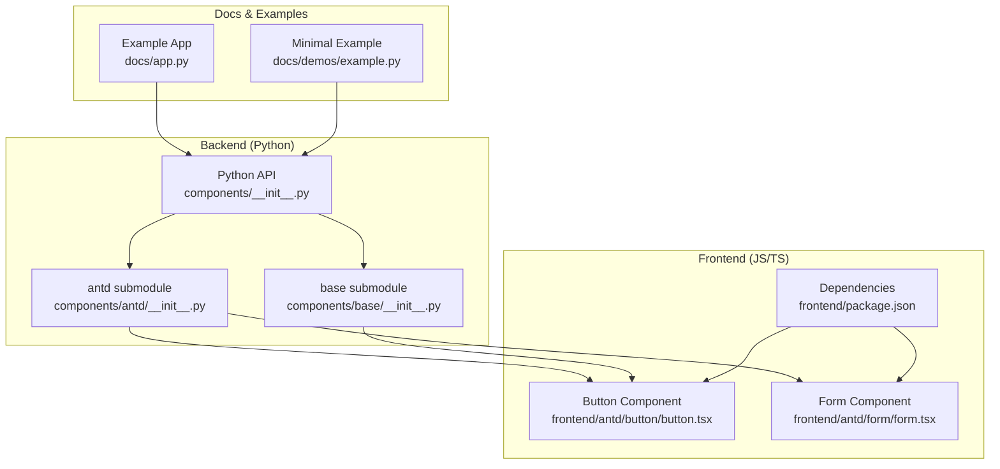
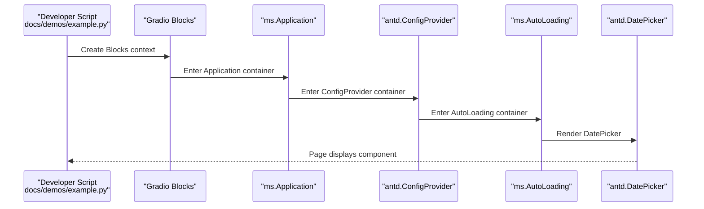
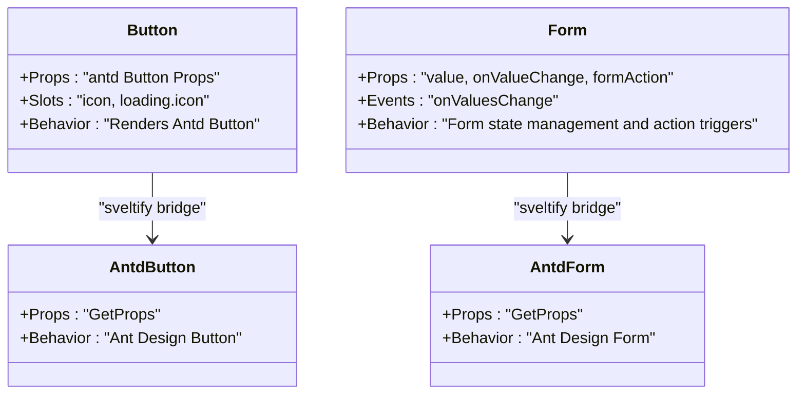
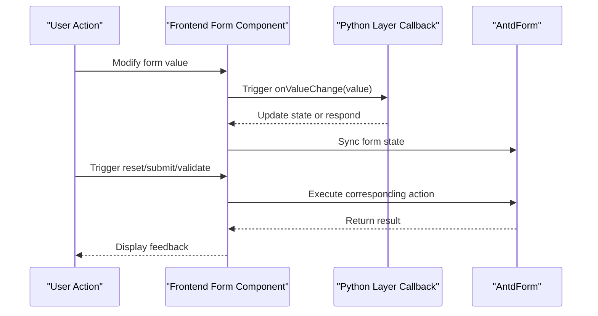
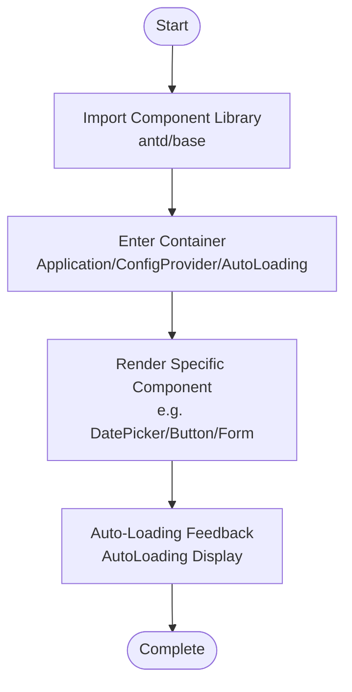
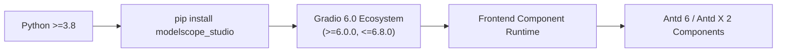

# Quick Start

<cite>
**Files Referenced in This Document**
- [README.md](file://README.md)
- [pyproject.toml](file://pyproject.toml)
- [docs/requirements.txt](file://docs/requirements.txt)
- [docs/demos/example.py](file://docs/demos/example.py)
- [docs/FAQ.md](file://docs/FAQ.md)
- [backend/modelscope_studio/__init__.py](file://backend/modelscope_studio/__init__.py)
- [backend/modelscope_studio/components/__init__.py](file://backend/modelscope_studio/components/__init__.py)
- [backend/modelscope_studio/components/antd/__init__.py](file://backend/modelscope_studio/components/antd/__init__.py)
- [backend/modelscope_studio/components/base/__init__.py](file://backend/modelscope_studio/components/base/__init__.py)
- [frontend/package.json](file://frontend/package.json)
- [frontend/antd/button/button.tsx](file://frontend/antd/button/button.tsx)
- [frontend/antd/form/form.tsx](file://frontend/antd/form/form.tsx)
- [docs/app.py](file://docs/app.py)
- [backend/modelscope_studio/version.py](file://backend/modelscope_studio/version.py)
</cite>

## Update Summary

**Changes**

- Updated Gradio version requirement: migrated from 4.43.0+ to 6.0.0+
- Added version constraint description and migration guidance
- Updated dependency ranges and version constraints
- Strengthened version compatibility warnings

## Table of Contents

1. [Introduction](#introduction)
2. [Project Structure](#project-structure)
3. [Core Components](#core-components)
4. [Architecture Overview](#architecture-overview)
5. [Detailed Component Analysis](#detailed-component-analysis)
6. [Dependency Analysis](#dependency-analysis)
7. [Performance Notes](#performance-notes)
8. [Troubleshooting Guide](#troubleshooting-guide)
9. [Conclusion](#conclusion)
10. [Appendix](#appendix)

## Introduction

This guide is intended for first-time ModelScope Studio users, helping you complete installation and get up and running in the shortest time possible, and master the basic methods for importing the component library and creating basic interfaces. You will learn:

- Installation and environment preparation (Python version, dependencies)
- Steps to run the minimal working example
- Component library import and usage patterns
- Quick resolution of common issues

**Important Update**: ModelScope Studio 2.0.0 has migrated to the Gradio 6.0 ecosystem, supporting version ranges >=6.0.0 and <=6.8.0.

## Project Structure

ModelScope Studio is a third-party component library based on Gradio, providing richer page layouts and component forms. The project adopts a layered design of "backend Python package + frontend Svelte/React components":

- Backend: Python package wrapping component interfaces and template resources
- Frontend: Svelte/React components bridging Ant Design/Ant Design X via @svelte-preprocess-react
- Documentation and examples: Displayed via docs/app.py showing components and layout templates



**Diagram Sources**

- [backend/modelscope_studio/components/**init**.py:1-5](file://backend/modelscope_studio/components/__init__.py#L1-L5)
- [backend/modelscope_studio/components/antd/**init**.py:1-150](file://backend/modelscope_studio/components/antd/__init__.py#L1-L150)
- [backend/modelscope_studio/components/base/**init**.py:1-11](file://backend/modelscope_studio/components/base/__init__.py#L1-L11)
- [frontend/antd/button/button.tsx:1-39](file://frontend/antd/button/button.tsx#L1-L39)
- [frontend/antd/form/form.tsx:1-79](file://frontend/antd/form/form.tsx#L1-L79)
- [frontend/package.json:1-59](file://frontend/package.json#L1-L59)
- [docs/app.py:1-595](file://docs/app.py#L1-L595)
- [docs/demos/example.py:1-11](file://docs/demos/example.py#L1-L11)

**Section Sources**

- [backend/modelscope_studio/components/**init**.py:1-5](file://backend/modelscope_studio/components/__init__.py#L1-L5)
- [backend/modelscope_studio/components/antd/**init**.py:1-150](file://backend/modelscope_studio/components/antd/__init__.py#L1-L150)
- [backend/modelscope_studio/components/base/**init**.py:1-11](file://backend/modelscope_studio/components/base/__init__.py#L1-L11)
- [frontend/package.json:1-59](file://frontend/package.json#L1-L59)
- [docs/app.py:1-595](file://docs/app.py#L1-L595)

## Core Components

- Component library entry point: Import submodules via `modelscope_studio.components.*`
  - antd: Ant Design component collection
  - base: Base layout and rendering components (e.g., Application, AutoLoading, Slot, Fragment, Div, Text, Markdown, etc.)
- Key component usage patterns
  - Use context containers: `ms.Application`, `antd.ConfigProvider`, `ms.AutoLoading`
  - Directly nest specific components (e.g., `antd.DatePicker`) inside containers

**Section Sources**

- [backend/modelscope_studio/components/**init**.py:1-5](file://backend/modelscope_studio/components/__init__.py#L1-L5)
- [backend/modelscope_studio/components/antd/**init**.py:1-150](file://backend/modelscope_studio/components/antd/__init__.py#L1-L150)
- [backend/modelscope_studio/components/base/**init**.py:1-11](file://backend/modelscope_studio/components/base/__init__.py#L1-L11)

## Architecture Overview

The diagram below shows the call chain from the Python application to frontend components, and the dynamic loading mechanism of the documentation site for components.



**Diagram Sources**

- [docs/demos/example.py:5-10](file://docs/demos/example.py#L5-L10)
- [docs/app.py:1-595](file://docs/app.py#L1-L595)

**Section Sources**

- [docs/demos/example.py:1-11](file://docs/demos/example.py#L1-L11)
- [docs/app.py:1-595](file://docs/app.py#L1-L595)

## Detailed Component Analysis

### Component Usage Patterns and Best Practices

- Using container composition
  - It is recommended to wrap `ms.Application` at the outermost layer, then wrap `antd.ConfigProvider` and `ms.AutoLoading` inside, to get global configuration and auto-loading feedback
- Component import and instantiation
  - Import required components via `modelscope_studio.components.antd` or `modelscope_studio.components.base`
  - Directly instantiate components within the container scope
- Commonly used component examples
  - Base components: Button, Text, Div, Markdown
  - Data entry: Form, Input, DatePicker, Select
  - Feedback and notifications: Message, Modal, Notification, Spin

**Section Sources**

- [backend/modelscope_studio/components/antd/**init**.py:1-150](file://backend/modelscope_studio/components/antd/__init__.py#L1-L150)
- [backend/modelscope_studio/components/base/**init**.py:1-11](file://backend/modelscope_studio/components/base/__init__.py#L1-L11)

### Component Class Relationships (Code Level)

The following class diagram shows the mapping between frontend components and Ant Design, reflecting the component bridging and slot mechanism.



**Diagram Sources**

- [frontend/antd/button/button.tsx:8-36](file://frontend/antd/button/button.tsx#L8-L36)
- [frontend/antd/form/form.tsx:15-76](file://frontend/antd/form/form.tsx#L15-L76)

**Section Sources**

- [frontend/antd/button/button.tsx:1-39](file://frontend/antd/button/button.tsx#L1-L39)
- [frontend/antd/form/form.tsx:1-79](file://frontend/antd/form/form.tsx#L1-L79)

### API Workflow (Form Example)



**Diagram Sources**

- [frontend/antd/form/form.tsx:32-45](file://frontend/antd/form/form.tsx#L32-L45)
- [frontend/antd/form/form.tsx:69-72](file://frontend/antd/form/form.tsx#L69-L72)

**Section Sources**

- [frontend/antd/form/form.tsx:1-79](file://frontend/antd/form/form.tsx#L1-L79)

### Complex Logic Flow (Component Loading and Rendering)



**Diagram Sources**

- [docs/demos/example.py:5-10](file://docs/demos/example.py#L5-L10)
- [docs/FAQ.md:7-19](file://docs/FAQ.md#L7-L19)

**Section Sources**

- [docs/demos/example.py:1-11](file://docs/demos/example.py#L1-L11)
- [docs/FAQ.md:1-20](file://docs/FAQ.md#L1-L20)

## Dependency Analysis

- Python environment and version
  - Python version requirement: >=3.8
  - **Gradio dependency range**: >=6.0.0 and <=6.8.0
  - **Important note**: The current example uses 5.34.1, but version 2.0.0 has migrated to the Gradio 6.0 ecosystem
- Frontend dependencies
  - Ant Design 6.x, Ant Design X 2.x, React 19, Svelte 5, @gradio/\* series, etc.
- Documentation and example dependencies
  - Example scripts and the documentation site use `modelscope_studio==2.0.0`

**Important Update**: For version migration details, please refer to [Migration Guide](#migration-guide)



**Diagram Sources**

- [pyproject.toml:15-26](file://pyproject.toml#L15-L26)
- [docs/requirements.txt:1-4](file://docs/requirements.txt#L1-4)
- [frontend/package.json:8-40](file://frontend/package.json#L8-L40)

**Section Sources**

- [pyproject.toml:1-257](file://pyproject.toml#L1-L257)
- [docs/requirements.txt:1-4](file://docs/requirements.txt#L1-L4)
- [frontend/package.json:1-59](file://frontend/package.json#L1-L59)

### Migration Guide

**Gradio 6.0 Migration Guide**

ModelScope Studio 2.0.0 has completed a major migration from Gradio 4.x to 6.x, involving the following key changes:

#### Version Range Description

- **Supported versions**: >=6.0.0 and <=6.8.0
- **Unsupported versions**: <6.0.0 or >6.8.0
- **Migration reason**: Gradio 6.0 introduced major architectural changes that require corresponding component adaptations

#### Using Pre-Migration Versions

If your project is still using Gradio versions from 4.43.0 to before 6.0.0, please use the 1.x version:

```bash
pip install modelscope_studio~=1.0
```

#### Using Post-Migration Versions

For new projects with Gradio 6.0+, use the latest version:

```bash
pip install modelscope_studio==2.0.0
```

#### Compatibility Notes

- **Hugging Face Space**: Still requires `ssr_mode=False`
- **Component API**: Most APIs maintain backward compatibility
- **Performance Improvements**: Gradio 6.0 provides better performance and stability

**Section Sources**

- [README.md:36-50](file://README.md#L36-L50)
- [pyproject.toml:26](file://pyproject.toml#L26)
- [backend/modelscope_studio/version.py:1-2](file://backend/modelscope_studio/version.py#L1-L2)

## Performance Notes

- Interaction latency and loading feedback
  - The component library independently provides a loading feedback mechanism; it is recommended to enable AutoLoading globally to reduce user-perceived wait times
- Concurrency and queuing
  - The documentation site examples use queue and concurrency limit parameters; actual projects can adjust based on requirements

**Section Sources**

- [docs/FAQ.md:7-19](file://docs/FAQ.md#L7-L19)
- [docs/app.py:592-594](file://docs/app.py#L592-L594)

## Troubleshooting Guide

- Hugging Face Space page not displaying
  - Add `ssr_mode=False` to `demo.launch()`
- Slow responses or no feedback
  - Missing AutoLoading container causes no loading feedback; it is recommended to add `ms.AutoLoading` at the application top level
- **Gradio version conflict**
  - Ensure Gradio version is in the range >=6.0.0 and <=6.8.0
  - If using an older version of Gradio, downgrade to modelscope_studio 1.x
  - If using a newer version of Gradio, upgrade to modelscope_studio 2.0.0

**Section Sources**

- [docs/FAQ.md:3-5](file://docs/FAQ.md#L3-L5)
- [docs/FAQ.md:7-19](file://docs/FAQ.md#L7-L19)
- [docs/requirements.txt:1-4](file://docs/requirements.txt#L1-L4)
- [README.md:36-50](file://README.md#L36-L50)

## Conclusion

Through this guide, you have learned:

- How to install and prepare the environment
- How to import the component library and create the minimal working example
- How to use the basic patterns of containers and components
- How to quickly locate and fix common issues
- **Important notes for Gradio version migration**

It is recommended to progressively introduce more components in subsequent development (e.g., Form, Table, Modal), and combine AutoLoading to optimize user experience. Pay attention to version compatibility and ensure the Gradio version meets the currently supported range.

## Appendix

### Installation and Run Steps

- Installation
  - Use pip to install modelscope_studio
- Running
  - Refer to the minimal example script; running it directly will start the local service

**Section Sources**

- [README.md:38-57](file://README.md#L38-L57)
- [docs/demos/example.py:1-11](file://docs/demos/example.py#L1-L11)

### Minimal Example (Path)

- Example script path: [docs/demos/example.py:1-11](file://docs/demos/example.py#L1-L11)
- Run command reference: Execute the Python file in the directory where the example script is located

**Section Sources**

- [docs/demos/example.py:1-11](file://docs/demos/example.py#L1-L11)

### Component Import and Usage (Paths)

- Import antd components: [backend/modelscope_studio/components/antd/**init**.py:1-150](file://backend/modelscope_studio/components/antd/__init__.py#L1-L150)
- Import base components: [backend/modelscope_studio/components/base/**init**.py:1-11](file://backend/modelscope_studio/components/base/__init__.py#L1-L11)
- Component library entry aggregation: [backend/modelscope_studio/components/**init**.py:1-5](file://backend/modelscope_studio/components/__init__.py#L1-L5)
- Python package export entry: [backend/modelscope_studio/**init**.py:1-3](file://backend/modelscope_studio/__init__.py#L1-L3)

**Section Sources**

- [backend/modelscope_studio/components/antd/**init**.py:1-150](file://backend/modelscope_studio/components/antd/__init__.py#L1-L150)
- [backend/modelscope_studio/components/base/**init**.py:1-11](file://backend/modelscope_studio/components/base/__init__.py#L1-L11)
- [backend/modelscope_studio/components/**init**.py:1-5](file://backend/modelscope_studio/components/__init__.py#L1-L5)
- [backend/modelscope_studio/**init**.py:1-3](file://backend/modelscope_studio/__init__.py#L1-L3)

### Documentation Site and Example Entry (Paths)

- Documentation site entry: [docs/app.py:1-595](file://docs/app.py#L1-L595)

**Section Sources**

- [docs/app.py:1-595](file://docs/app.py#L1-L595)

### Version Compatibility Matrix

| Gradio Version    | ModelScope Studio Version | Support Status   |
| ----------------- | ------------------------- | ---------------- |
| >=4.43.0,<6.0.0   | 1.x                       | ✅ Supported     |
| >=6.0.0,<=6.8.0   | 2.0.0                     | ✅ Supported     |
| <4.43.0 or >6.8.0 | Any                       | ❌ Not Supported |

> **⚠️ Note: Why Gradio >6.8.0 is not supported**
> The current version has not yet been fully tested and adapted for Gradio versions above 6.8.0. New versions of Gradio may contain changes to component APIs, boundary behaviors, and internal interfaces; use is not recommended until full coverage has been verified. If you need to use a higher version, please follow the official repository's compatibility update announcements.

**Section Sources**

- [README.md:36-50](file://README.md#L36-L50)
- [pyproject.toml:26](file://pyproject.toml#L26)
- [backend/modelscope_studio/version.py:1-2](file://backend/modelscope_studio/version.py#L1-L2)
