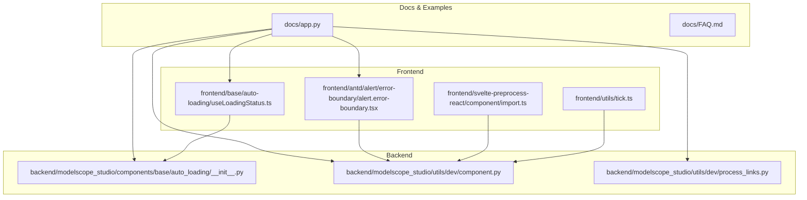
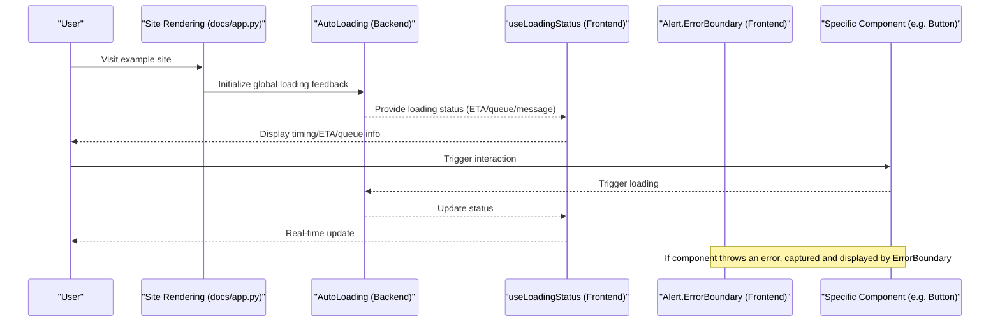
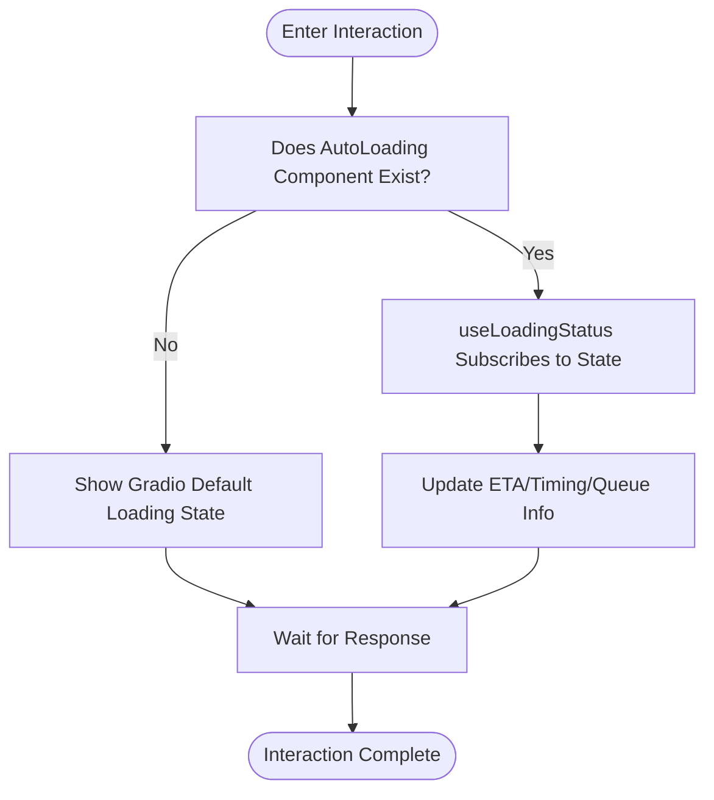
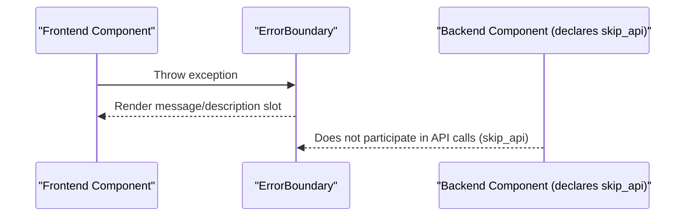
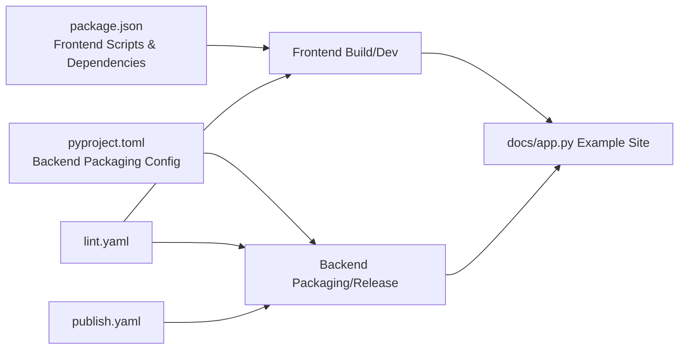

# Troubleshooting

<cite>
**Files Referenced in This Document**
- [README.md](file://README.md)
- [README-zh_CN.md](file://README-zh_CN.md)
- [FAQ.md](file://docs/FAQ.md)
- [FAQ-zh_CN.md](file://docs/FAQ-zh_CN.md)
- [docs/app.py](file://docs/app.py)
- [package.json](file://package.json)
- [pyproject.toml](file://pyproject.toml)
- [backend/modelscope_studio/components/base/auto_loading/__init__.py](file://backend/modelscope_studio/components/base/auto_loading/__init__.py)
- [frontend/base/auto-loading/useLoadingStatus.ts](file://frontend/base/auto-loading/useLoadingStatus.ts)
- [backend/modelscope_studio/utils/dev/component.py](file://backend/modelscope_studio/utils/dev/component.py)
- [backend/modelscope_studio/utils/dev/process_links.py](file://backend/modelscope_studio/utils/dev/process_links.py)
- [.github/workflows/lint.yaml](file://.github/workflows/lint.yaml)
- [.github/workflows/publish.yaml](file://.github/workflows/publish.yaml)
- [frontend/antd/alert/error-boundary/alert.error-boundary.tsx](file://frontend/antd/alert/error-boundary/alert.error-boundary.tsx)
- [backend/modelscope_studio/components/antd/alert/error_boundary/__init__.py](file://backend/modelscope_studio/components/antd/alert/error_boundary/__init__.py)
- [frontend/svelte-preprocess-react/component/import.ts](file://frontend/svelte-preprocess-react/component/import.ts)
- [frontend/utils/tick.ts](file://frontend/utils/tick.ts)
</cite>

## Table of Contents

1. [Introduction](#introduction)
2. [Project Structure](#project-structure)
3. [Core Components](#core-components)
4. [Architecture Overview](#architecture-overview)
5. [Detailed Component Analysis](#detailed-component-analysis)
6. [Dependency Analysis](#dependency-analysis)
7. [Performance Considerations](#performance-considerations)
8. [Troubleshooting Guide](#troubleshooting-guide)
9. [Conclusion](#conclusion)
10. [Appendix](#appendix)

## Introduction

This guide is intended for developers using ModelScope Studio, focusing on systematic troubleshooting and resolution of common issues related to installation, configuration, runtime errors, and performance. Content is sourced from the official documentation, FAQs, example sites, and source code implementations in the repository, covering key paths including frontend components, backend component bridging, auto-loading feedback, error boundaries, link processing, and development and release workflows.

## Project Structure

ModelScope Studio is a third-party component library based on Gradio, providing the Ant Design, Ant Design X, and Pro component ecosystems. The project adopts a frontend-backend separation with a multi-package workspace organization:

- Frontend (Svelte + React preprocessing): Located in the frontend directory, split by component, each with independent build configurations and template directories
- Backend (Python): Located in backend/modelscope_studio, providing component bridging capabilities to Gradio
- Documentation and examples: The docs directory contains example sites and component documentation
- Build and release: package.json and pyproject.toml define scripts and packaging rules; GitHub Actions handles Lint and release

**Diagram Sources**

- [docs/app.py:1-595](file://docs/app.py#L1-L595)
- [frontend/base/auto-loading/useLoadingStatus.ts:1-94](file://frontend/base/auto-loading/useLoadingStatus.ts#L1-L94)
- [frontend/antd/alert/error-boundary/alert.error-boundary.tsx:1-34](file://frontend/antd/alert/error-boundary/alert.error-boundary.tsx#L1-L34)
- [backend/modelscope_studio/components/base/auto_loading/**init**.py:1-65](file://backend/modelscope_studio/components/base/auto_loading/__init__.py#L1-L65)
- [backend/modelscope_studio/utils/dev/component.py:1-169](file://backend/modelscope_studio/utils/dev/component.py#L1-L169)
- [backend/modelscope_studio/utils/dev/process_links.py:1-61](file://backend/modelscope_studio/utils/dev/process_links.py#L1-L61)

**Section Sources**

- [README.md:1-101](file://README.md#L1-L101)
- [README-zh_CN.md:1-101](file://README-zh_CN.md#L1-L101)
- [docs/app.py:1-595](file://docs/app.py#L1-L595)

## Core Components

- Auto-loading feedback (AutoLoading)
  - Backend component: Provides bridging and rendering control for global loading state, queue position, ETA, etc.
  - Frontend Hook: `useLoadingStatus` converts Gradio's state tracking into displayable timing and ETA-formatted output
- Error Boundary (Alert.ErrorBoundary)
  - Frontend: Wraps Ant Design's ErrorBoundary via `sveltify`, supporting slot injection of message and description
  - Backend: Corresponding component definition, declaring `skip_api`, used only for frontend rendering
- Component Base Class and Context
  - Backend: `ModelScopeComponent`/`ModelScopeLayoutComponent`, etc., unifying component lifecycle and App context validation
- Link Processing
  - Backend: `process_links` converts relative links in Markdown/HTML to accessible `/file=...` resource paths

**Section Sources**

- [backend/modelscope_studio/components/base/auto_loading/**init**.py:1-65](file://backend/modelscope_studio/components/base/auto_loading/__init__.py#L1-L65)
- [frontend/base/auto-loading/useLoadingStatus.ts:1-94](file://frontend/base/auto-loading/useLoadingStatus.ts#L1-L94)
- [frontend/antd/alert/error-boundary/alert.error-boundary.tsx:1-34](file://frontend/antd/alert/error-boundary/alert.error-boundary.tsx#L1-L34)
- [backend/modelscope_studio/components/antd/alert/error_boundary/**init**.py:20-72](file://backend/modelscope_studio/components/antd/alert/error_boundary/__init__.py#L20-L72)
- [backend/modelscope_studio/utils/dev/component.py:1-169](file://backend/modelscope_studio/utils/dev/component.py#L1-L169)
- [backend/modelscope_studio/utils/dev/process_links.py:1-61](file://backend/modelscope_studio/utils/dev/process_links.py#L1-L61)

## Architecture Overview

The diagram below shows the key call chain from the example site to component rendering, including the collaboration between auto-loading feedback and error boundaries.

**Diagram Sources**

- [docs/app.py:577-595](file://docs/app.py#L577-L595)
- [backend/modelscope_studio/components/base/auto_loading/**init**.py:1-65](file://backend/modelscope_studio/components/base/auto_loading/__init__.py#L1-L65)
- [frontend/base/auto-loading/useLoadingStatus.ts:1-94](file://frontend/base/auto-loading/useLoadingStatus.ts#L1-L94)
- [frontend/antd/alert/error-boundary/alert.error-boundary.tsx:1-34](file://frontend/antd/alert/error-boundary/alert.error-boundary.tsx#L1-L34)

## Detailed Component Analysis

### Auto-Loading Feedback (AutoLoading)

- Design highlights
  - The backend component does not participate in regular API calls; it only handles rendering and state bridging
  - The frontend Hook uses `requestAnimationFrame` for smooth timing, combined with ETA and queue information for formatted output
- Common issue diagnosis
  - Without AutoLoading, Gradio's default loading state may not display, causing user-perceived latency
  - Large queues or long-running backend tasks will cause ETA fluctuations; evaluate based on queue size and concurrency limits

**Diagram Sources**

- [backend/modelscope_studio/components/base/auto_loading/**init**.py:1-65](file://backend/modelscope_studio/components/base/auto_loading/__init__.py#L1-L65)
- [frontend/base/auto-loading/useLoadingStatus.ts:1-94](file://frontend/base/auto-loading/useLoadingStatus.ts#L1-L94)

**Section Sources**

- [backend/modelscope_studio/components/base/auto_loading/**init**.py:1-65](file://backend/modelscope_studio/components/base/auto_loading/__init__.py#L1-L65)
- [frontend/base/auto-loading/useLoadingStatus.ts:1-94](file://frontend/base/auto-loading/useLoadingStatus.ts#L1-L94)

### Error Boundary (Alert.ErrorBoundary)

- Design highlights
  - Frontend wraps Ant Design's ErrorBoundary via `sveltify`, supporting slot injection of `message`/`description`
  - Backend component declares `skip_api`, preventing it from being treated as a regular component for API calls
- Common issue diagnosis
  - Uncaught exceptions inside components will directly interrupt the UI; ensure critical areas are wrapped with ErrorBoundary
  - When slot content is empty, falls back to props, ensuring error information is visible

**Diagram Sources**

- [frontend/antd/alert/error-boundary/alert.error-boundary.tsx:1-34](file://frontend/antd/alert/error-boundary/alert.error-boundary.tsx#L1-L34)
- [backend/modelscope_studio/components/antd/alert/error_boundary/**init**.py:20-72](file://backend/modelscope_studio/components/antd/alert/error_boundary/__init__.py#L20-L72)

**Section Sources**

- [frontend/antd/alert/error-boundary/alert.error-boundary.tsx:1-34](file://frontend/antd/alert/error-boundary/alert.error-boundary.tsx#L1-L34)
- [backend/modelscope_studio/components/antd/alert/error_boundary/**init**.py:20-72](file://backend/modelscope_studio/components/antd/alert/error_boundary/__init__.py#L20-L72)

### Component Base Class and Context (ModelScopeComponent/Layout)

- Design highlights
  - Uniformly inherits Gradio component metaclass and BlockContext, ensuring parent-child relationships and rendering order are correct
  - Layout-type components default to `skip_api`; data-type components participate in the API flow
- Common issue diagnosis
  - Not being within the Application context will trigger assertion failure
  - Layout components need to sync the layout flag when exiting, to avoid rendering misalignment

**Section Sources**

- [backend/modelscope_studio/utils/dev/component.py:1-169](file://backend/modelscope_studio/utils/dev/component.py#L1-L169)

### Link Processing (process_links)

- Design highlights
  - Converts relative links in Markdown/HTML to `/file=` cache paths for safe Gradio access
- Common issue diagnosis
  - When files don't exist or paths are wrong, returns them as-is; check resource absolute paths and block cache mappings

**Section Sources**

- [backend/modelscope_studio/utils/dev/process_links.py:1-61](file://backend/modelscope_studio/utils/dev/process_links.py#L1-L61)

## Dependency Analysis

- Frontend-Backend Dependencies
  - Frontend uses Svelte 5 and React preprocessing, combined with Gradio's state tracking and component bridging
  - Backend depends on Gradio version ranges to ensure compatibility
- Build and Release
  - Frontend scripts include build, development, formatting, Lint, etc.; backend is packaged via hatchling
  - GitHub Actions handles Lint and release processes

**Diagram Sources**

- [package.json:1-55](file://package.json#L1-L55)
- [pyproject.toml:1-257](file://pyproject.toml#L1-L257)
- [docs/app.py:577-595](file://docs/app.py#L577-L595)
- [.github/workflows/lint.yaml:1-34](file://.github/workflows/lint.yaml#L1-L34)
- [.github/workflows/publish.yaml:1-74](file://.github/workflows/publish.yaml#L1-L74)

**Section Sources**

- [package.json:1-55](file://package.json#L1-L55)
- [pyproject.toml:1-257](file://pyproject.toml#L1-L257)
- [.github/workflows/lint.yaml:1-34](file://.github/workflows/lint.yaml#L1-L34)
- [.github/workflows/publish.yaml:1-74](file://.github/workflows/publish.yaml#L1-L74)

## Performance Considerations

- Loading feedback and queuing
  - Using AutoLoading and `useLoadingStatus` can improve perceived performance, but requires reasonable concurrency and queue limits
- SSR and space deployment
  - SSR must be disabled in Hugging Face Space, otherwise custom components may not display correctly
- Build and caching
  - Frontend build scripts and Gradio resource caching strategies affect initial load and switching performance

**Section Sources**

- [docs/FAQ.md:1-20](file://docs/FAQ.md#L1-L20)
- [docs/FAQ-zh_CN.md:1-20](file://docs/FAQ-zh_CN.md#L1-L20)
- [docs/app.py:592-595](file://docs/app.py#L592-L595)

## Troubleshooting Guide

### 1. Installation and Environment `🛠 All Versions`

- Dependency versions
  - Backend depends on Gradio version ranges; ensure compatibility with the current environment
  - **Gradio 6.0+ specific**: When using modelscope_studio 2.x, ensure gradio>=6.0,<=6.8.0
- Frontend dependencies
  - Use pnpm to install dependencies and run builds; development mode is started via docs/app.py
- Common symptoms
  - Components unavailable or import errors after installation; check Gradio version and Python environment first
- Resolution steps
  - Confirm Gradio version meets requirements
  - Clear cache and reinstall dependencies
  - Validate environment using the example site

**Section Sources**

- [pyproject.toml:26-26](file://pyproject.toml#L26-L26)
- [package.json:8-25](file://package.json#L8-L25)
- [README.md:34-42](file://README.md#L34-L42)
- [README-zh_CN.md:34-42](file://README-zh_CN.md#L34-L42)

### 2. Configuration Issues `🛠 All Versions`

- SSR mode
  - SSR must be disabled in Hugging Face Space, otherwise interface display is abnormal
  - **Version applicability**: Gradio 6.0+ specific (this issue also existed in versions before Gradio 6.0)
- Auto-loading feedback
  - If AutoLoading is not placed, Gradio's default loading state may not display; it is recommended to use AutoLoading at least once globally
- Build and development
  - Development mode uses docs/app.py; production builds use frontend scripts

**Section Sources**

- [docs/FAQ.md:3-5](file://docs/FAQ.md#L3-L5)
- [docs/FAQ-zh_CN.md:3-5](file://docs/FAQ-zh_CN.md#L3-L5)
- [docs/FAQ.md:7-19](file://docs/FAQ.md#L7-L19)
- [docs/FAQ-zh_CN.md:7-19](file://docs/FAQ-zh_CN.md#L7-L19)
- [docs/app.py:592-595](file://docs/app.py#L592-L595)

### 3. Runtime Errors `🛠 Gradio 6.0+ Specific`

- Error boundaries
  - Internal component exceptions are captured and displayed by ErrorBoundary with message/description; if not working, check if wrapping is correct
- Initialization and lazy loading
  - Component lazy loading depends on initialization Promises; if not complete, the component may not be ready; ensure waiting for initialization to complete
- Link access
  - Relative resources need to be converted to `/file=` paths via `process_links`; if resources are missing, returns as-is; check paths and cache

**Section Sources**

- [frontend/antd/alert/error-boundary/alert.error-boundary.tsx:1-34](file://frontend/antd/alert/error-boundary/alert.error-boundary.tsx#L1-L34)
- [backend/modelscope_studio/components/antd/alert/error_boundary/**init**.py:20-72](file://backend/modelscope_studio/components/antd/alert/error_boundary/__init__.py#L20-L72)
- [frontend/svelte-preprocess-react/component/import.ts:1-20](file://frontend/svelte-preprocess-react/component/import.ts#L1-L20)
- [backend/modelscope_studio/utils/dev/process_links.py:48-61](file://backend/modelscope_studio/utils/dev/process_links.py#L48-L61)

### 4. Performance Issues `🛠 All Versions`

- Loading wait and ETA fluctuations
  - Large queues or long-running backend tasks cause ETA fluctuations; can be mitigated by reducing concurrency and optimizing task logic
- Timing and rendering
  - `useLoadingStatus` uses `requestAnimationFrame` for real-time updates, ensuring UI fluency; avoid creating instances repeatedly in high-frequency events
- SSR and space deployment
  - Disabling SSR avoids compatibility issues with custom components in SSR scenarios

**Section Sources**

- [frontend/base/auto-loading/useLoadingStatus.ts:1-94](file://frontend/base/auto-loading/useLoadingStatus.ts#L1-L94)
- [docs/FAQ.md:7-9](file://docs/FAQ.md#L7-L9)
- [docs/FAQ-zh_CN.md:7-9](file://docs/FAQ-zh_CN.md#L7-L9)
- [docs/app.py:592-595](file://docs/app.py#L592-L595)

### 5. Debugging Tips `🛠 All Versions`

- Logs and state
  - Use `useLoadingStatus` to output ETA, timing, and queue position, helping locate latency causes
- Component initialization
  - Wait for `initializePromise` to complete before dynamically importing components, avoiding exceptions due to uninitialized state
- Links and resources
  - Use `process_links` to convert relative links to `/file=` paths, ensuring resources are accessible

**Section Sources**

- [frontend/base/auto-loading/useLoadingStatus.ts:1-94](file://frontend/base/auto-loading/useLoadingStatus.ts#L1-L94)
- [frontend/svelte-preprocess-react/component/import.ts:1-20](file://frontend/svelte-preprocess-react/component/import.ts#L1-L20)
- [backend/modelscope_studio/utils/dev/process_links.py:48-61](file://backend/modelscope_studio/utils/dev/process_links.py#L48-L61)

### 6. Community Support and Issue Reporting `🛠 All Versions`

- Official docs and examples
  - Use the example site to validate issue reproduction and fix effectiveness
- Submitting issues
  - Submit an Issue in the repository, including environment info, dependency versions, minimal reproduction, and expected behavior
- Reference scripts
  - Lint and publish scripts can be used to check and validate the local environment

**Section Sources**

- [docs/app.py:1-595](file://docs/app.py#L1-L595)
- [.github/workflows/lint.yaml:1-34](file://.github/workflows/lint.yaml#L1-L34)
- [.github/workflows/publish.yaml:1-74](file://.github/workflows/publish.yaml#L1-L74)

## Conclusion

By understanding core mechanisms such as AutoLoading, ErrorBoundary, component base classes, and link processing, developers can systematically locate and resolve installation, configuration, runtime, and performance-related issues. It is recommended to disable SSR in Hugging Face Space and enable AutoLoading globally to improve user experience; when issues arise, first check initialization, error boundaries, and resource links, and use the example site for minimal reproduction and validation.

## Appendix

- Key File Index
  - Example site and menu: [docs/app.py:1-595](file://docs/app.py#L1-L595)
  - Auto-loading feedback (backend): [backend/modelscope_studio/components/base/auto_loading/**init**.py:1-65](file://backend/modelscope_studio/components/base/auto_loading/__init__.py#L1-L65)
  - Auto-loading feedback (frontend): [frontend/base/auto-loading/useLoadingStatus.ts:1-94](file://frontend/base/auto-loading/useLoadingStatus.ts#L1-L94)
  - Error boundary (frontend): [frontend/antd/alert/error-boundary/alert.error-boundary.tsx:1-34](file://frontend/antd/alert/error-boundary/alert.error-boundary.tsx#L1-L34)
  - Error boundary (backend): [backend/modelscope_studio/components/antd/alert/error_boundary/**init**.py:20-72](file://backend/modelscope_studio/components/antd/alert/error_boundary/__init__.py#L20-L72)
  - Component base class: [backend/modelscope_studio/utils/dev/component.py:1-169](file://backend/modelscope_studio/utils/dev/component.py#L1-L169)
  - Link processing: [backend/modelscope_studio/utils/dev/process_links.py:1-61](file://backend/modelscope_studio/utils/dev/process_links.py#L1-L61)
  - Frontend scripts: [package.json:1-55](file://package.json#L1-L55)
  - Backend packaging: [pyproject.toml:1-257](file://pyproject.toml#L1-L257)
  - Lint workflow: [.github/workflows/lint.yaml:1-34](file://.github/workflows/lint.yaml#L1-L34)
  - Release workflow: [.github/workflows/publish.yaml:1-74](file://.github/workflows/publish.yaml#L1-L74)
