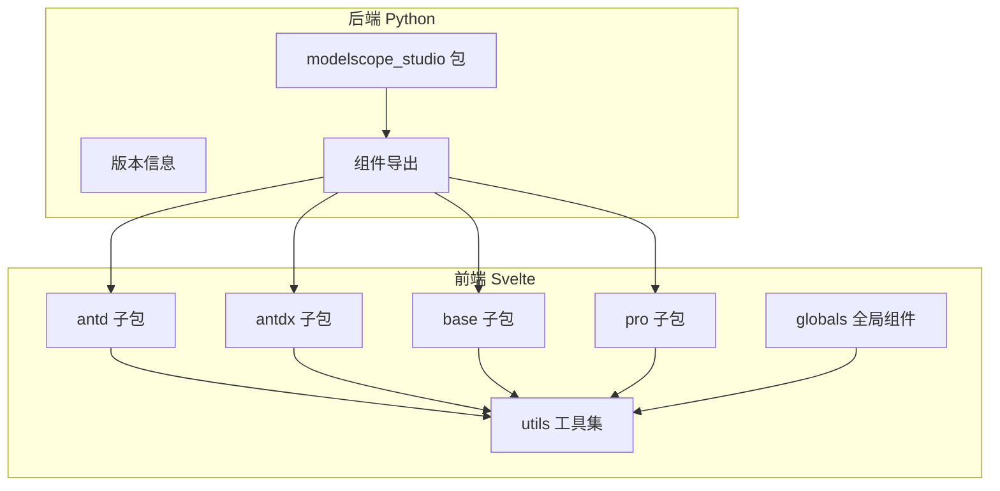
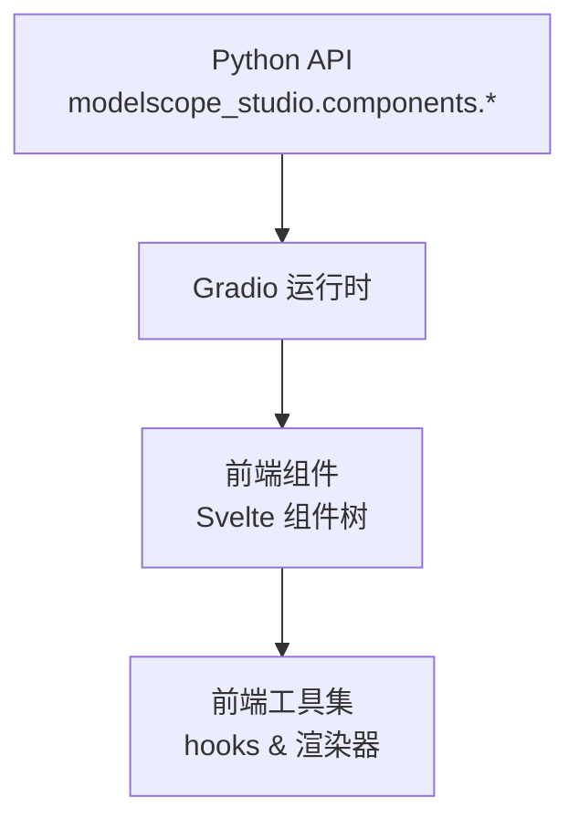
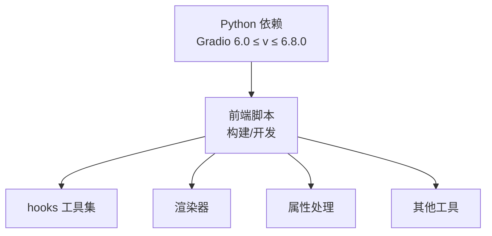

# API 参考

<cite>
**本文档引用的文件**
- [backend/modelscope_studio/__init__.py](file://backend/modelscope_studio/__init__.py)
- [backend/modelscope_studio/version.py](file://backend/modelscope_studio/version.py)
- [backend/modelscope_studio/components/__init__.py](file://backend/modelscope_studio/components/__init__.py)
- [backend/modelscope_studio/components/antd/__init__.py](file://backend/modelscope_studio/components/antd/__init__.py)
- [backend/modelscope_studio/components/antd/components.py](file://backend/modelscope_studio/components/antd/components.py)
- [backend/modelscope_studio/components/antdx/__init__.py](file://backend/modelscope_studio/components/antdx/__init__.py)
- [backend/modelscope_studio/components/antdx/components.py](file://backend/modelscope_studio/components/antdx/components.py)
- [frontend/antd/button/button.tsx](file://frontend/antd/button/button.tsx)
- [frontend/antd/form/form.tsx](file://frontend/antd/form/form.tsx)
- [frontend/antd/table/table.tsx](file://frontend/antd/table/table.tsx)
- [frontend/antdx/bubble/bubble.tsx](file://frontend/antdx/bubble/bubble.tsx)
- [frontend/base/application/application.ts](file://frontend/base/application/application.ts)
- [frontend/pro/chatbot/chatbot.ts](file://frontend/pro/chatbot/chatbot.ts)
- [frontend/pro/monaco-editor/monaco-editor.ts](file://frontend/pro/monaco-editor/monaco-editor.ts)
- [frontend/pro/multimodal-input/multimodal-input.ts](file://frontend/pro/multimodal-input/multimodal-input.ts)
- [frontend/pro/web-sandbox/web-sandbox.ts](file://frontend/pro/web-sandbox/web-sandbox.ts)
- [frontend/utils/hooks/useAsyncEffect.ts](file://frontend/utils/hooks/useAsyncEffect.ts)
- [frontend/utils/hooks/useAsyncMemo.ts](file://frontend/utils/hooks/useAsyncMemo.ts)
- [frontend/utils/hooks/useDeepCompareEffect.ts](file://frontend/utils/hooks/useDeepCompareEffect.ts)
- [frontend/utils/hooks/useEvent.ts](file://frontend/utils/hooks/useEvent.ts)
- [frontend/utils/hooks/useMount.ts](file://frontend/utils/hooks/useMount.ts)
- [frontend/utils/hooks/useUnmount.ts](file://frontend/utils/hooks/useUnmount.ts)
- [frontend/utils/hooks/useUpdateEffect.ts](file://frontend/utils/hooks/useUpdateEffect.ts)
- [frontend/utils/createFunction.ts](file://frontend/utils/createFunction.ts)
- [frontend/utils/renderSlot.tsx](file://frontend/utils/renderSlot.tsx)
- [frontend/utils/renderParamsSlot.tsx](file://frontend/utils/renderParamsSlot.tsx)
- [frontend/utils/renderItems.tsx](file://frontend/utils/renderItems.tsx)
- [frontend/utils/patchProps.tsx](file://frontend/utils/patchProps.tsx)
- [frontend/utils/omitUndefinedProps.ts](file://frontend/utils/omitUndefinedProps.ts)
- [frontend/utils/tick.ts](file://frontend/utils/tick.ts)
- [frontend/utils/upload.ts](file://frontend/utils/upload.ts)
- [frontend/globals/components/index.ts](file://frontend/globals/components/index.ts)
- [pyproject.toml](file://pyproject.toml)
- [package.json](file://package.json)
</cite>

## 目录

1. [简介](#简介)
2. [项目结构](#项目结构)
3. [核心组件](#核心组件)
4. [架构总览](#架构总览)
5. [详细组件分析](#详细组件分析)
6. [依赖分析](#依赖分析)
7. [性能考虑](#性能考虑)
8. [故障排查指南](#故障排查指南)
9. [结论](#结论)
10. [附录](#附录)

## 简介

本文件为 ModelScope Studio 的完整 API 参考文档，覆盖 Python 后端组件与前端 JavaScript/Svelte 组件两大体系。Python API 提供基于 Gradio 的第三方组件库封装，前端以 Svelte 实现，二者通过 Gradio 自定义组件机制协同工作。本文档面向开发者，提供组件导入方式、类定义、方法签名、参数说明、返回值类型（Python）、组件属性与事件（JavaScript/Svelte）、生命周期钩子、公共方法、使用示例与注意事项，并补充参数验证规则、错误处理机制与版本兼容性信息。

## 项目结构

ModelScope Studio 采用前后端分离的多包结构：

- 后端 Python 包：modelscope_studio，提供组件导出与版本信息
- 前端 Svelte 包：多个子包按功能域划分（antd、antdx、base、pro），并提供工具函数与全局组件入口
- 构建与发布：通过 Gradio CLI 进行自定义组件构建，支持禁用自动生成文档

图表来源

- [backend/modelscope_studio/components/**init**.py:1-5](file://backend/modelscope_studio/components/__init__.py#L1-L5)
- [backend/modelscope_studio/components/antd/**init**.py:1-150](file://backend/modelscope_studio/components/antd/__init__.py#L1-L150)
- [backend/modelscope_studio/components/antdx/**init**.py:1-42](file://backend/modelscope_studio/components/antdx/__init__.py#L1-L42)
- [frontend/globals/components/index.ts:1-2](file://frontend/globals/components/index.ts#L1-L2)

章节来源

- [backend/modelscope_studio/**init**.py:1-3](file://backend/modelscope_studio/__init__.py#L1-L3)
- [backend/modelscope_studio/version.py:1-2](file://backend/modelscope_studio/version.py#L1-L2)
- [backend/modelscope_studio/components/**init**.py:1-5](file://backend/modelscope_studio/components/__init__.py#L1-L5)
- [backend/modelscope_studio/components/antd/**init**.py:1-150](file://backend/modelscope_studio/components/antd/__init__.py#L1-L150)
- [backend/modelscope_studio/components/antdx/**init**.py:1-42](file://backend/modelscope_studio/components/antdx/__init__.py#L1-L42)
- [frontend/globals/components/index.ts:1-2](file://frontend/globals/components/index.ts#L1-L2)

## 核心组件

本节概述 Python 与前端组件的导出与组织方式，帮助开发者快速定位目标组件。

- Python 导入与导出
  - 根包导出：从 components 模块导入所有组件，并暴露版本号
  - 组件聚合：按领域分组导出（antd、antdx、base、pro）
  - antd 子包：导出大量 UI 组件别名，便于直接使用
  - antdx 子包：导出对话与内容相关组件
- 前端组件组织
  - 每个组件通常对应一个 Svelte 文件（如 button.tsx、form.tsx、table.tsx）
  - 工具函数集中于 utils，包括 hooks、渲染器、属性修补等
  - globals 提供全局组件入口，当前导出 markdown 子模块

章节来源

- [backend/modelscope_studio/**init**.py:1-3](file://backend/modelscope_studio/__init__.py#L1-L3)
- [backend/modelscope_studio/components/**init**.py:1-5](file://backend/modelscope_studio/components/__init__.py#L1-L5)
- [backend/modelscope_studio/components/antd/**init**.py:1-150](file://backend/modelscope_studio/components/antd/__init__.py#L1-L150)
- [backend/modelscope_studio/components/antd/components.py:1-144](file://backend/modelscope_studio/components/antd/components.py#L1-L144)
- [backend/modelscope_studio/components/antdx/**init**.py:1-42](file://backend/modelscope_studio/components/antdx/__init__.py#L1-L42)
- [backend/modelscope_studio/components/antdx/components.py:1-40](file://backend/modelscope_studio/components/antdx/components.py#L1-L40)
- [frontend/globals/components/index.ts:1-2](file://frontend/globals/components/index.ts#L1-L2)

## 架构总览

下图展示 Python 后端与前端组件的交互关系及数据流：

图表来源

- [backend/modelscope_studio/components/antd/**init**.py:1-150](file://backend/modelscope_studio/components/antd/__init__.py#L1-L150)
- [backend/modelscope_studio/components/antdx/**init**.py:1-42](file://backend/modelscope_studio/components/antdx/__init__.py#L1-L42)
- [frontend/antd/button/button.tsx](file://frontend/antd/button/button.tsx)
- [frontend/antd/form/form.tsx](file://frontend/antd/form/form.tsx)
- [frontend/antd/table/table.tsx](file://frontend/antd/table/table.tsx)
- [frontend/antdx/bubble/bubble.tsx](file://frontend/antdx/bubble/bubble.tsx)

## 详细组件分析

### Python API 参考（概览）

- 版本与依赖
  - 版本：2.0.0
  - 依赖：Gradio 6.0 ≤ v ≤ 6.8.0
- 导入方式
  - from modelscope_studio import 组件名
  - 或 from modelscope_studio.components.antd import 组件名
  - 或 from modelscope_studio.components.antdx import 组件名
  - 或 from modelscope_studio.components.pro import Chatbot, MonacoEditor, MultimodalInput, WebSandbox
- 类与别名
  - antd 子包导出大量组件别名，如 Button、Form、Table 等
  - antdx 子包导出对话与内容相关组件，如 Bubble、Chatbot、Sender 等
  - pro 子包导出专业能力组件：Chatbot、MonacoEditor（含子组件 MonacoEditorDiffEditor）、MultimodalInput、WebSandbox
- 使用示例路径
  - 参考 docs/demos 下各组件示例（例如 chatbot 示例）
- 注意事项
  - 请确保 Gradio 版本满足范围要求
  - 部分组件可能需要额外的前端模板或资源（由构建系统打包）

章节来源

- [pyproject.toml:26-26](file://pyproject.toml#L26-L26)
- [backend/modelscope_studio/version.py:1-2](file://backend/modelscope_studio/version.py#L1-L2)
- [backend/modelscope_studio/components/antd/**init**.py:1-150](file://backend/modelscope_studio/components/antd/__init__.py#L1-L150)
- [backend/modelscope_studio/components/antdx/**init**.py:1-42](file://backend/modelscope_studio/components/antdx/__init__.py#L1-L42)

### JavaScript/Svelte API 参考（概览）

- 组件组织
  - antd：通用 UI 组件，如 Button、Form、Table 等
  - antdx：对话与内容扩展组件，如 Bubble、Sender、ThoughtChain 等
  - base：基础容器与逻辑组件，如 Application、Each、Filter 等
  - pro：专业能力组件，如 Chatbot、MonacoEditor、MultimodalInput、WebSandbox
- 属性、事件与生命周期
  - 属性：通过 props 传递，遵循 Svelte 规范
  - 事件：通过 $on/$off 或 Svelte 事件绑定
  - 生命周期：mount/unmount/update 等钩子由 hooks 提供
- 公共方法
  - 通过 createFunction 等工具创建可调用方法
  - 上传、渲染插槽、属性修补等由 utils 提供

章节来源

- [frontend/antd/button/button.tsx](file://frontend/antd/button/button.tsx)
- [frontend/antd/form/form.tsx](file://frontend/antd/form/form.tsx)
- [frontend/antd/table/table.tsx](file://frontend/antd/table/table.tsx)
- [frontend/antdx/bubble/bubble.tsx](file://frontend/antdx/bubble/bubble.tsx)
- [frontend/base/application/application.ts](file://frontend/base/application/application.ts)
- [frontend/pro/chatbot/chatbot.ts](file://frontend/pro/chatbot/chatbot.ts)
- [frontend/pro/monaco-editor/monaco-editor.ts](file://frontend/pro/monaco-editor/monaco-editor.ts)
- [frontend/pro/multimodal-input/multimodal-input.ts](file://frontend/pro/multimodal-input/multimodal-input.ts)
- [frontend/pro/web-sandbox/web-sandbox.ts](file://frontend/pro/web-sandbox/web-sandbox.ts)

### 组件 A：Button（按钮）

- Python 导入与别名
  - from modelscope_studio.components.antd import Button
- 前端组件
  - 路径：frontend/antd/button/button.tsx
  - 属性：参考组件文件中的 props 定义
  - 事件：参考组件文件中的事件绑定
  - 生命周期：通过 hooks 管理（如 useMount、useUnmount）
- 使用示例
  - 参考 docs/components/antd/button 下的示例文件
- 注意事项
  - 确保与 Gradio 的交互模式一致
  - 如需图标，请使用 Ant Design 图标

章节来源

- [backend/modelscope_studio/components/antd/**init**.py:14-14](file://backend/modelscope_studio/components/antd/__init__.py#L14-L14)
- [frontend/antd/button/button.tsx](file://frontend/antd/button/button.tsx)

### 组件 B：Form（表单）

- Python 导入与别名
  - from modelscope_studio.components.antd import Form, FormItem, FormProvider
- 前端组件
  - 路径：frontend/antd/form/form.tsx
  - 属性：参考组件文件中的 props 定义
  - 事件：参考组件文件中的事件绑定
  - 表单校验：FormItem.Rule 支持规则配置
- 使用示例
  - 参考 docs/components/antd/form 下的示例文件
- 注意事项
  - 表单状态与 Gradio 数据流保持同步
  - Rule 配置需符合 Ant Design 规范

章节来源

- [backend/modelscope_studio/components/antd/**init**.py:48-51](file://backend/modelscope_studio/components/antd/__init__.py#L48-L51)
- [frontend/antd/form/form.tsx](file://frontend/antd/form/form.tsx)

### 组件 C：Table（表格）

- Python 导入与别名
  - from modelscope_studio.components.antd import Table, TableColumn, TableRowSelection
- 前端组件
  - 路径：frontend/antd/table/table.tsx
  - 属性：参考组件文件中的 props 定义
  - 事件：参考组件文件中的事件绑定
  - 选择列：TableRowSelection 提供选择能力
- 使用示例
  - 参考 docs/components/antd/table 下的示例文件
- 注意事项
  - 列配置需与数据结构匹配
  - 选择行为需与 Gradio 输出格式一致

章节来源

- [backend/modelscope_studio/components/antd/**init**.py:116-122](file://backend/modelscope_studio/components/antd/__init__.py#L116-L122)
- [frontend/antd/table/table.tsx](file://frontend/antd/table/table.tsx)

### 组件 D：Bubble（消息气泡）

- Python 导入与别名
  - from modelscope_studio.components.antdx import Bubble
- 前端组件
  - 路径：frontend/antdx/bubble/bubble.tsx
  - 属性：参考组件文件中的 props 定义
  - 事件：参考组件文件中的事件绑定
- 使用示例
  - 参考 docs/components/antdx/bubble 下的示例文件
- 注意事项
  - 消息内容与样式需与对话场景适配

章节来源

- [backend/modelscope_studio/components/antdx/**init**.py:8-13](file://backend/modelscope_studio/components/antdx/__init__.py#L8-L13)
- [frontend/antdx/bubble/bubble.tsx](file://frontend/antdx/bubble/bubble.tsx)

### 组件 E：Application（应用容器）

- 前端组件
  - 路径：frontend/base/application/application.ts
  - 作用：作为应用根容器，管理上下文与布局
- 使用示例
  - 参考 docs/components/base/application 下的示例文件
- 注意事项
  - 与其他基础组件（如 Each、Filter）配合使用

章节来源

- [frontend/base/application/application.ts](file://frontend/base/application/application.ts)

### 组件 F：Chatbot（聊天机器人）

- Python 导入与别名
  - from modelscope_studio.components.pro import Chatbot
- 前端组件
  - 路径：frontend/pro/chatbot/chatbot.ts
  - 属性：参考组件文件中的 props 定义
  - 事件：参考组件文件中的事件绑定
- 使用示例
  - 参考 docs/components/pro/chatbot 下的示例文件
- 注意事项
  - 与后端模型服务对接时注意数据格式

章节来源

- [backend/modelscope_studio/components/pro/components.py:1-20](file://backend/modelscope_studio/components/pro/components.py#L1-L20)
- [frontend/pro/chatbot/chatbot.ts](file://frontend/pro/chatbot/chatbot.ts)

### 组件 G：MonacoEditor（代码编辑器）

- Python 导入与别名
  - from modelscope_studio.components.pro import MonacoEditor
- 前端组件
  - 路径：frontend/pro/monaco-editor/monaco-editor.ts
  - 属性：参考组件文件中的 props 定义
  - 事件：参考组件文件中的事件绑定
- 使用示例
  - 参考 docs/components/pro/monaco_editor 下的示例文件
- 注意事项
  - 编辑器主题与语言配置需与 Gradio 交互一致

章节来源

- [backend/modelscope_studio/components/pro/components.py:1-20](file://backend/modelscope_studio/components/pro/components.py#L1-L20)
- [frontend/pro/monaco-editor/monaco-editor.ts](file://frontend/pro/monaco-editor/monaco-editor.ts)

### 组件 H：MultimodalInput（多模态输入）

- Python 导入与别名
  - from modelscope_studio.components.pro import MultimodalInput
- 前端组件
  - 路径：frontend/pro/multimodal-input/multimodal-input.ts
  - 属性：参考组件文件中的 props 定义
  - 事件：参考组件文件中的事件绑定
- 使用示例
  - 参考 docs/components/pro/multimodal_input 下的示例文件
- 注意事项
  - 输入类型与后端模型接口需匹配

章节来源

- [backend/modelscope_studio/components/pro/components.py:1-20](file://backend/modelscope_studio/components/pro/components.py#L1-L20)
- [frontend/pro/multimodal-input/multimodal-input.ts](file://frontend/pro/multimodal-input/multimodal-input.ts)

### 组件 I：WebSandbox（网页沙盒）

- Python 导入与别名
  - from modelscope_studio.components.pro import WebSandbox
- 前端组件
  - 路径：frontend/pro/web-sandbox/web-sandbox.ts
  - 属性：参考组件文件中的 props 定义
  - 事件：参考组件文件中的事件绑定
- 使用示例
  - 参考 docs/components/pro/web_sandbox 下的示例文件
- 注意事项
  - 安全策略与跨域限制需在部署时配置

章节来源

- [backend/modelscope_studio/components/pro/components.py:1-20](file://backend/modelscope_studio/components/pro/components.py#L1-L20)
- [frontend/pro/web-sandbox/web-sandbox.ts](file://frontend/pro/web-sandbox/web-sandbox.ts)

### 组件 J：全局组件（Markdown）

- 前端组件
  - 路径：frontend/globals/components/index.ts
  - 当前导出 markdown 子模块
- 使用示例
  - 参考 docs/components/base/markdown 下的示例文件
- 注意事项
  - 全局组件需在应用入口统一注册

章节来源

- [frontend/globals/components/index.ts:1-2](file://frontend/globals/components/index.ts#L1-L2)

## 依赖分析

- Python 侧
  - 依赖：Gradio 6.0 ≤ v ≤ 6.8.0
  - 版本：2.0.0
- 前端侧
  - 构建脚本：通过 Gradio CLI 执行组件构建
  - 开发脚本：启动文档站点开发服务器
- 工具与渲染
  - hooks：useMount、useUnmount、useUpdateEffect、useAsyncEffect、useAsyncMemo、useDeepCompareEffect、useEvent
  - 渲染器：renderSlot、renderParamsSlot、renderItems
  - 属性处理：patchProps、omitUndefinedProps
  - 其他：createFunction、tick、upload

图表来源

- [pyproject.toml:26-26](file://pyproject.toml#L26-L26)
- [package.json:8-24](file://package.json#L8-L24)
- [frontend/utils/hooks/useMount.ts](file://frontend/utils/hooks/useMount.ts)
- [frontend/utils/hooks/useUnmount.ts](file://frontend/utils/hooks/useUnmount.ts)
- [frontend/utils/hooks/useUpdateEffect.ts](file://frontend/utils/hooks/useUpdateEffect.ts)
- [frontend/utils/hooks/useAsyncEffect.ts](file://frontend/utils/hooks/useAsyncEffect.ts)
- [frontend/utils/hooks/useAsyncMemo.ts](file://frontend/utils/hooks/useAsyncMemo.ts)
- [frontend/utils/hooks/useDeepCompareEffect.ts](file://frontend/utils/hooks/useDeepCompareEffect.ts)
- [frontend/utils/hooks/useEvent.ts](file://frontend/utils/hooks/useEvent.ts)
- [frontend/utils/renderSlot.tsx](file://frontend/utils/renderSlot.tsx)
- [frontend/utils/renderParamsSlot.tsx](file://frontend/utils/renderParamsSlot.tsx)
- [frontend/utils/renderItems.tsx](file://frontend/utils/renderItems.tsx)
- [frontend/utils/patchProps.tsx](file://frontend/utils/patchProps.tsx)
- [frontend/utils/omitUndefinedProps.ts](file://frontend/utils/omitUndefinedProps.ts)
- [frontend/utils/createFunction.ts](file://frontend/utils/createFunction.ts)
- [frontend/utils/tick.ts](file://frontend/utils/tick.ts)
- [frontend/utils/upload.ts](file://frontend/utils/upload.ts)

章节来源

- [pyproject.toml:26-26](file://pyproject.toml#L26-L26)
- [package.json:8-24](file://package.json#L8-L24)
- [frontend/utils/hooks/useMount.ts](file://frontend/utils/hooks/useMount.ts)
- [frontend/utils/hooks/useUnmount.ts](file://frontend/utils/hooks/useUnmount.ts)
- [frontend/utils/hooks/useUpdateEffect.ts](file://frontend/utils/hooks/useUpdateEffect.ts)
- [frontend/utils/hooks/useAsyncEffect.ts](file://frontend/utils/hooks/useAsyncEffect.ts)
- [frontend/utils/hooks/useAsyncMemo.ts](file://frontend/utils/hooks/useAsyncMemo.ts)
- [frontend/utils/hooks/useDeepCompareEffect.ts](file://frontend/utils/hooks/useDeepCompareEffect.ts)
- [frontend/utils/hooks/useEvent.ts](file://frontend/utils/hooks/useEvent.ts)
- [frontend/utils/renderSlot.tsx](file://frontend/utils/renderSlot.tsx)
- [frontend/utils/renderParamsSlot.tsx](file://frontend/utils/renderParamsSlot.tsx)
- [frontend/utils/renderItems.tsx](file://frontend/utils/renderItems.tsx)
- [frontend/utils/patchProps.tsx](file://frontend/utils/patchProps.tsx)
- [frontend/utils/omitUndefinedProps.ts](file://frontend/utils/omitUndefinedProps.ts)
- [frontend/utils/createFunction.ts](file://frontend/utils/createFunction.ts)
- [frontend/utils/tick.ts](file://frontend/utils/tick.ts)
- [frontend/utils/upload.ts](file://frontend/utils/upload.ts)

## 性能考虑

- 组件懒加载与按需引入：优先使用具体组件导入，避免一次性导入过多模块
- 渲染优化：利用 renderItems、renderParamsSlot 等工具减少重复渲染
- 异步处理：使用 useAsyncEffect/useAsyncMemo 处理异步副作用，避免阻塞主线程
- 属性修补：通过 patchProps 合理合并属性，减少不必要的重渲染
- 上传与资源：upload 工具应结合 Gradio 的上传流程，避免大文件阻塞

## 故障排查指南

- 版本不兼容
  - 症状：运行时报错或功能异常
  - 排查：确认 Gradio 版本在 6.0 ≤ v ≤ 6.8.0 范围内
- 组件未生效
  - 症状：前端组件不显示或无响应
  - 排查：检查组件是否正确导入；确认构建产物已生成；核对 props 传入
- 表单校验失败
  - 症状：提交时报错或无反馈
  - 排查：检查 FormItem.Rule 配置；确认字段名与数据结构一致
- 上传异常
  - 症状：文件上传失败或进度异常
  - 排查：检查 upload 工具调用；确认后端接口与 Gradio 上传协议一致
- 生命周期问题
  - 症状：组件卸载后仍有副作用
  - 排查：确保使用 useUnmount 注册清理逻辑；必要时使用 useUpdateEffect 监听变化

章节来源

- [pyproject.toml:26-26](file://pyproject.toml#L26-L26)
- [frontend/utils/hooks/useUnmount.ts](file://frontend/utils/hooks/useUnmount.ts)
- [frontend/utils/hooks/useUpdateEffect.ts](file://frontend/utils/hooks/useUpdateEffect.ts)
- [frontend/utils/upload.ts](file://frontend/utils/upload.ts)

## 结论

本 API 参考文档梳理了 ModelScope Studio 的 Python 与前端组件体系，明确了导入方式、组件结构、属性与事件、生命周期钩子以及工具函数的使用方法。建议开发者在实际项目中遵循版本约束、按需引入组件、合理使用工具函数，并结合示例文件进行快速集成。

## 附录

- 快速索引
  - Python 组件：参考 antd 与 antdx 子包导出列表
  - 前端组件：参考各子包下的 Svelte 文件
  - 工具函数：参考 utils 目录下的 hooks 与渲染器
- 版本与兼容性
  - Python：2.0.0
  - Gradio：6.0 ≤ v ≤ 6.8.0
- 构建与开发
  - 构建命令：pnpm run build
  - 开发命令：pnpm run dev

章节来源

- [backend/modelscope_studio/version.py:1-2](file://backend/modelscope_studio/version.py#L1-L2)
- [pyproject.toml:26-26](file://pyproject.toml#L26-L26)
- [package.json:8-24](file://package.json#L8-L24)
