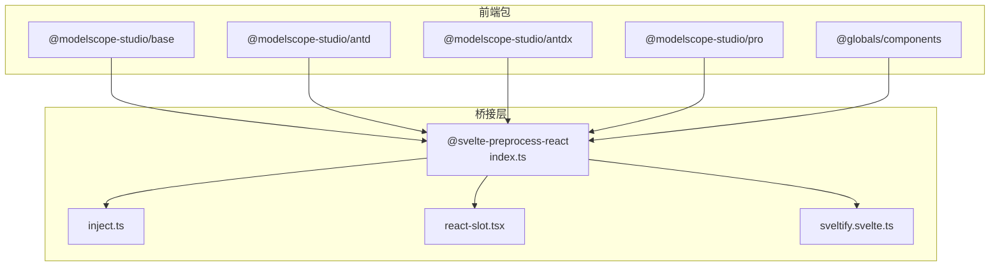
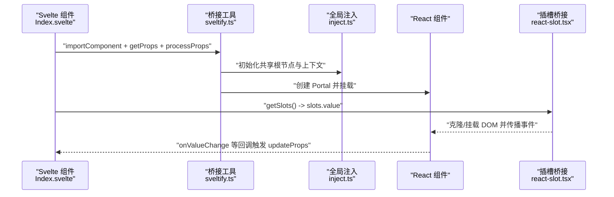
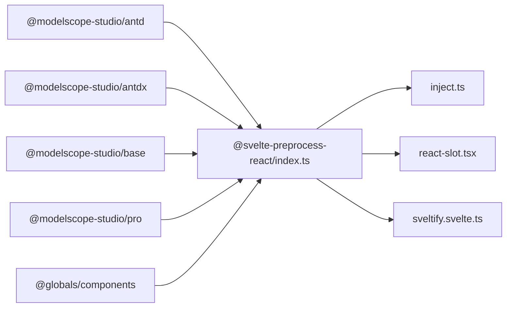

# JavaScript API

<cite>
**本文引用的文件**
- [frontend/package.json](file://frontend/package.json)
- [frontend/tsconfig.json](file://frontend/tsconfig.json)
- [frontend/antd/package.json](file://frontend/antd/package.json)
- [frontend/antdx/package.json](file://frontend/antdx/package.json)
- [frontend/base/package.json](file://frontend/base/package.json)
- [frontend/pro/package.json](file://frontend/pro/package.json)
- [frontend/globals/components/index.ts](file://frontend/globals/components/index.ts)
- [frontend/antd/button/Index.svelte](file://frontend/antd/button/Index.svelte)
- [frontend/antd/form/Index.svelte](file://frontend/antd/form/Index.svelte)
- [frontend/antd/layout/Index.svelte](file://frontend/antd/layout/Index.svelte)
- [frontend/antd/modal/Index.svelte](file://frontend/antd/modal/Index.svelte)
- [frontend/antd/table/Index.svelte](file://frontend/antd/table/Index.svelte)
- [frontend/svelte-preprocess-react/index.ts](file://frontend/svelte-preprocess-react/index.ts)
- [frontend/svelte-preprocess-react/sveltify.svelte.ts](file://frontend/svelte-preprocess-react/sveltify.svelte.ts)
- [frontend/svelte-preprocess-react/inject.ts](file://frontend/svelte-preprocess-react/inject.ts)
- [frontend/svelte-preprocess-react/react-slot.tsx](file://frontend/svelte-preprocess-react/react-slot.tsx)
</cite>

## 目录

1. [简介](#简介)
2. [项目结构](#项目结构)
3. [核心组件](#核心组件)
4. [架构总览](#架构总览)
5. [组件详解](#组件详解)
6. [依赖关系分析](#依赖关系分析)
7. [性能与内存管理](#性能与内存管理)
8. [故障排查指南](#故障排查指南)
9. [结论](#结论)
10. [附录：API 索引与导航](#附录api-索引与导航)

## 简介

本文件为 ModelScope Studio 的 JavaScript API 参考文档，聚焦于前端层的 Svelte 组件与 React 组件桥接方案，覆盖以下要点：

- Svelte 组件的属性定义、事件处理、生命周期与公共方法
- 组件间通信机制（props 传递、事件冒泡、插槽系统）
- React 组件桥接实现（属性转换、事件绑定、状态同步）
- 标准实例化与配置示例（基础与复杂场景）
- 样式定制、主题配置与响应式设计支持
- TypeScript 类型定义、接口规范与泛型使用
- 性能优化、内存管理与最佳实践
- 完整 API 索引与导航

## 项目结构

前端采用多包结构，按功能域拆分：

- 基础组件库：base
- Ant Design 组件库：antd
- Ant Design 扩展组件库：antdx
- Pro 高阶组件库：pro
- 全局组件入口：globals/components

各包均以 Svelte 5 作为核心运行时，并通过自研的 svelte-preprocess-react 桥接方案将 React 组件注入到 Svelte 中。

图表来源

- [frontend/antd/package.json:1-6](file://frontend/antd/package.json#L1-L6)
- [frontend/antdx/package.json:1-6](file://frontend/antdx/package.json#L1-L6)
- [frontend/base/package.json:1-6](file://frontend/base/package.json#L1-L6)
- [frontend/pro/package.json:1-6](file://frontend/pro/package.json#L1-L6)
- [frontend/svelte-preprocess-react/index.ts:1-8](file://frontend/svelte-preprocess-react/index.ts#L1-L8)
- [frontend/svelte-preprocess-react/inject.ts:1-103](file://frontend/svelte-preprocess-react/inject.ts#L1-L103)
- [frontend/svelte-preprocess-react/react-slot.tsx:1-224](file://frontend/svelte-preprocess-react/react-slot.tsx#L1-L224)
- [frontend/svelte-preprocess-react/sveltify.svelte.ts:1-119](file://frontend/svelte-preprocess-react/sveltify.svelte.ts#L1-L119)

章节来源

- [frontend/package.json:1-59](file://frontend/package.json#L1-L59)
- [frontend/tsconfig.json:1-8](file://frontend/tsconfig.json#L1-L8)

## 核心组件

本节概述 Svelte 组件在桥接层中的通用模式与能力边界，便于快速定位与复用。

- 属性透传与过滤
  - 统一通过 getProps 获取外部传入 props，并对可见性、内部标记、元素标识等进行过滤与保留
  - 使用 processProps 将命名映射（如 fields_change → fieldsChange）与额外属性合并
- 插槽系统
  - 通过 getSlots 收集 Svelte 插槽内容，注入 React 组件的 slots 字段
  - ReactSlot 负责将 DOM 克隆或挂载到 React 组件中，支持属性观察与事件克隆
- 异步加载与渲染
  - importComponent 动态导入 React 组件，结合 Svelte await 片段实现异步渲染
- 事件与状态同步
  - onValueChange、onResetFormAction 等回调用于回写父级状态
  - updateProps 用于更新可变属性（如 value）

章节来源

- [frontend/antd/button/Index.svelte:1-74](file://frontend/antd/button/Index.svelte#L1-L74)
- [frontend/antd/form/Index.svelte:1-99](file://frontend/antd/form/Index.svelte#L1-L99)
- [frontend/antd/modal/Index.svelte:1-63](file://frontend/antd/modal/Index.svelte#L1-L63)
- [frontend/antd/table/Index.svelte:1-61](file://frontend/antd/table/Index.svelte#L1-L61)
- [frontend/svelte-preprocess-react/react-slot.tsx:1-224](file://frontend/svelte-preprocess-react/react-slot.tsx#L1-L224)

## 架构总览

下图展示从 Svelte 到 React 的桥接路径与关键节点：

图表来源

- [frontend/svelte-preprocess-react/sveltify.svelte.ts:1-119](file://frontend/svelte-preprocess-react/sveltify.svelte.ts#L1-L119)
- [frontend/svelte-preprocess-react/inject.ts:1-103](file://frontend/svelte-preprocess-react/inject.ts#L1-L103)
- [frontend/svelte-preprocess-react/react-slot.tsx:1-224](file://frontend/svelte-preprocess-react/react-slot.tsx#L1-L224)
- [frontend/antd/button/Index.svelte:1-74](file://frontend/antd/button/Index.svelte#L1-L74)

## 组件详解

### Button（按钮）

- 属性定义
  - additional_props?: Record<string, any>
  - value?: string | undefined
  - as_item?: string | undefined
  - \_internal: { layout?: boolean }
  - href_target?: string
  - 可见性与样式：visible、elem_id、elem_classes、elem_style
- 事件与方法
  - 通过 slots 注入默认插槽内容
  - 通过 className、style、id 进行外观控制
- 生命周期
  - 在 $props() 初始化后，立即进入异步渲染流程
- 复杂度与性能
  - 动态导入与派生计算，避免不必要的重渲染

章节来源

- [frontend/antd/button/Index.svelte:1-74](file://frontend/antd/button/Index.svelte#L1-L74)

### Form（表单）

- 属性定义
  - value?: Record<string, any>
  - form_action?: FormProps['formAction'] | null
  - form_name?: string
  - fields_change?: any
  - finish_failed?: any
  - values_change?: any
  - 内部与样式：\_internal、elem_id、elem_classes、elem_style
- 事件与方法
  - onValueChange 回写 value
  - onResetFormAction 清空 form_action
- 生命周期
  - 异步渲染，仅在 visible 为真时显示
- 复杂度与性能
  - 使用派生属性减少 props 计算开销

章节来源

- [frontend/antd/form/Index.svelte:1-99](file://frontend/antd/form/Index.svelte#L1-L99)

### Modal（模态框）

- 属性定义
  - as_item?: string | undefined
  - \_internal: { layout?: boolean }
  - 可见性与样式：visible、elem_id、elem_classes、elem_style
- 事件与方法
  - 通过 slots 注入内容
- 生命周期
  - 条件渲染，异步加载 React 组件

章节来源

- [frontend/antd/modal/Index.svelte:1-63](file://frontend/antd/modal/Index.svelte#L1-L63)

### Table（表格）

- 属性定义
  - as_item?: string | undefined
  - \_internal: {}
  - 可见性与样式：visible、elem_id、elem_classes、elem_style
- 事件与方法
  - 通过 slots 注入列/行内容
- 生命周期
  - 异步渲染，条件显示

章节来源

- [frontend/antd/table/Index.svelte:1-61](file://frontend/antd/table/Index.svelte#L1-L61)

### Layout（布局）

- 属性定义
  - children: Snippet
  - 其他由 Base 组件承接
- 事件与方法
  - 无显式事件绑定，主要负责结构化渲染
- 生命周期
  - 直接将 props 透传给 Base 组件

章节来源

- [frontend/antd/layout/Index.svelte:1-18](file://frontend/antd/layout/Index.svelte#L1-L18)

### React 插槽桥接（ReactSlot）

- 功能
  - 将 Svelte 插槽克隆并挂载到 React 组件中
  - 支持事件监听器克隆、属性变更观察、类名与内联样式的应用
- 关键参数
  - slot: HTMLElement
  - clone?: boolean
  - style?: React.CSSProperties
  - className?: string
  - observeAttributes?: boolean
- 行为
  - MutationObserver 观察 slot 子树变化，动态重建克隆节点
  - 通过 createPortal 将 React 子树挂载到目标容器

章节来源

- [frontend/svelte-preprocess-react/react-slot.tsx:1-224](file://frontend/svelte-preprocess-react/react-slot.tsx#L1-L224)

### 桥接核心（sveltify）

- 功能
  - 将 React 组件包装为 Svelte 组件，支持 slots、样式、类名、id 透传
  - 维护共享根节点与节点树，实现跨组件树的渲染与更新
- 关键点
  - 初始化 Promise 与全局共享根节点
  - 递归构建节点树并触发 rerender
  - 提供 Sveltified 工厂函数

章节来源

- [frontend/svelte-preprocess-react/sveltify.svelte.ts:1-119](file://frontend/svelte-preprocess-react/sveltify.svelte.ts#L1-L119)

### 全局注入（inject）

- 功能
  - 向 window 注入 React 生态与桥接所需的全局对象
  - 定义自定义元素（react-portal-target、react-child、svelte-slot）
  - 初始化全局状态（initializePromise、sharedRoot、autokey 等）
- 影响
  - 为桥接层提供统一的运行时环境

章节来源

- [frontend/svelte-preprocess-react/inject.ts:1-103](file://frontend/svelte-preprocess-react/inject.ts#L1-L103)

## 依赖关系分析

图表来源

- [frontend/antd/package.json:1-6](file://frontend/antd/package.json#L1-L6)
- [frontend/antdx/package.json:1-6](file://frontend/antdx/package.json#L1-L6)
- [frontend/base/package.json:1-6](file://frontend/base/package.json#L1-L6)
- [frontend/pro/package.json:1-6](file://frontend/pro/package.json#L1-L6)
- [frontend/globals/components/index.ts:1-2](file://frontend/globals/components/index.ts#L1-L2)
- [frontend/svelte-preprocess-react/index.ts:1-8](file://frontend/svelte-preprocess-react/index.ts#L1-L8)
- [frontend/svelte-preprocess-react/inject.ts:1-103](file://frontend/svelte-preprocess-react/inject.ts#L1-L103)
- [frontend/svelte-preprocess-react/react-slot.tsx:1-224](file://frontend/svelte-preprocess-react/react-slot.tsx#L1-L224)
- [frontend/svelte-preprocess-react/sveltify.svelte.ts:1-119](file://frontend/svelte-preprocess-react/sveltify.svelte.ts#L1-L119)

章节来源

- [frontend/package.json:1-59](file://frontend/package.json#L1-L59)
- [frontend/tsconfig.json:1-8](file://frontend/tsconfig.json#L1-L8)

## 性能与内存管理

- 异步组件加载
  - 使用 importComponent 动态导入，避免首屏阻塞
- 派生计算与最小化重渲染
  - 通过 $derived 与 processProps 降低无效渲染
- 插槽克隆策略
  - ReactSlot 默认启用克隆与 MutationObserver，确保 DOM 变更时的稳定性；在高频率更新场景可考虑关闭克隆以减少开销
- Portal 管理
  - inject.ts 统一创建与销毁根节点，避免重复挂载导致的内存泄漏
- 样式与主题
  - 通过 elem_style、elem_classes 与 className 控制样式；Ant Design 主题变量由 antdCssinjs 注入，确保一致的主题体验

[本节为通用指导，无需特定文件来源]

## 故障排查指南

- 插槽未生效
  - 检查是否正确调用 getSlots 并将 slots.value 传入 React 组件
  - 确认 ReactSlot 的 slot 参数指向有效 DOM
- 事件未触发
  - 确保事件名称映射正确（如 fields_change → fieldsChange）
  - 检查 ReactSlot 的 observeAttributes 与 clone 设置
- 样式不生效
  - 确认 elem_style、elem_classes 是否被正确透传
  - 检查主题注入是否完成（inject.ts 初始化）
- 性能问题
  - 减少不必要的 visible 切换
  - 对高频更新场景禁用 ReactSlot 克隆或降低观察粒度

章节来源

- [frontend/antd/form/Index.svelte:60-99](file://frontend/antd/form/Index.svelte#L60-L99)
- [frontend/svelte-preprocess-react/react-slot.tsx:158-224](file://frontend/svelte-preprocess-react/react-slot.tsx#L158-L224)
- [frontend/svelte-preprocess-react/inject.ts:95-103](file://frontend/svelte-preprocess-react/inject.ts#L95-L103)

## 结论

本 API 以 Svelte 为核心，借助自研桥接层将 React 组件无缝集成，形成统一的组件生态。通过标准化的属性透传、事件映射与插槽桥接，开发者可以以一致的方式使用两类组件。配合完善的类型定义与性能优化建议，可在复杂场景中保持良好的开发体验与运行效率。

[本节为总结，无需特定文件来源]

## 附录：API 索引与导航

### 组件分类与入口

- 基础组件：base
- Ant Design 组件：antd
- Ant Design 扩展：antdx
- Pro 高阶组件：pro
- 全局组件入口：globals/components

章节来源

- [frontend/antd/package.json:1-6](file://frontend/antd/package.json#L1-L6)
- [frontend/antdx/package.json:1-6](file://frontend/antdx/package.json#L1-L6)
- [frontend/base/package.json:1-6](file://frontend/base/package.json#L1-L6)
- [frontend/pro/package.json:1-6](file://frontend/pro/package.json#L1-L6)
- [frontend/globals/components/index.ts:1-2](file://frontend/globals/components/index.ts#L1-L2)

### Svelte 组件通用模式

- 属性获取与过滤：getProps
- 属性映射与合并：processProps
- 插槽收集：getSlots
- 异步渲染：importComponent + {#await ...}
- 事件回写：updateProps

章节来源

- [frontend/antd/button/Index.svelte:12-56](file://frontend/antd/button/Index.svelte#L12-L56)
- [frontend/antd/form/Index.svelte:14-71](file://frontend/antd/form/Index.svelte#L14-L71)
- [frontend/antd/modal/Index.svelte:12-47](file://frontend/antd/modal/Index.svelte#L12-L47)
- [frontend/antd/table/Index.svelte:12-45](file://frontend/antd/table/Index.svelte#L12-L45)

### React 组件桥接

- sveltify：将 React 组件包装为 Svelte 组件
- inject：全局运行时注入与初始化
- react-slot：插槽 DOM 克隆与挂载

章节来源

- [frontend/svelte-preprocess-react/sveltify.svelte.ts:30-119](file://frontend/svelte-preprocess-react/sveltify.svelte.ts#L30-L119)
- [frontend/svelte-preprocess-react/inject.ts:20-103](file://frontend/svelte-preprocess-react/inject.ts#L20-L103)
- [frontend/svelte-preprocess-react/react-slot.tsx:109-224](file://frontend/svelte-preprocess-react/react-slot.tsx#L109-L224)

### TypeScript 与类型定义

- 顶层 tsconfig 扩展全局 tsconfig，启用 ESNext 模块与浏览器类型
- 组件内部广泛使用泛型与只读数组约束插槽键名

章节来源

- [frontend/tsconfig.json:1-8](file://frontend/tsconfig.json#L1-L8)
- [frontend/svelte-preprocess-react/sveltify.svelte.ts:9-39](file://frontend/svelte-preprocess-react/sveltify.svelte.ts#L9-L39)
