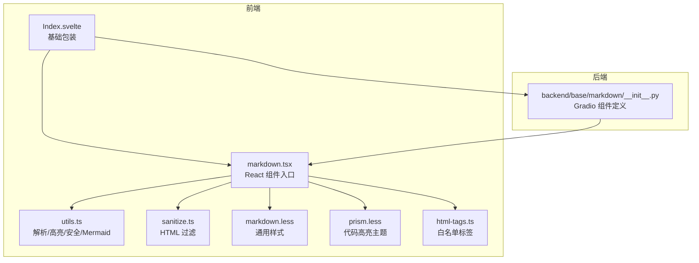
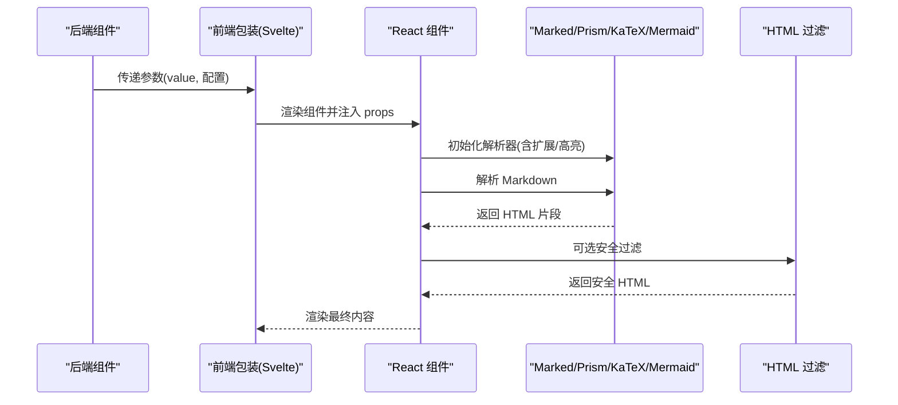
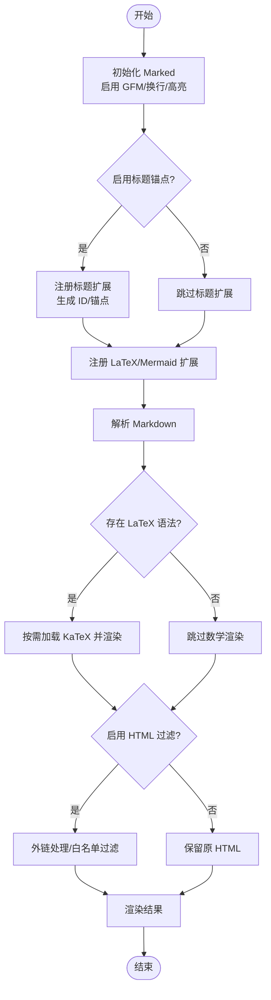
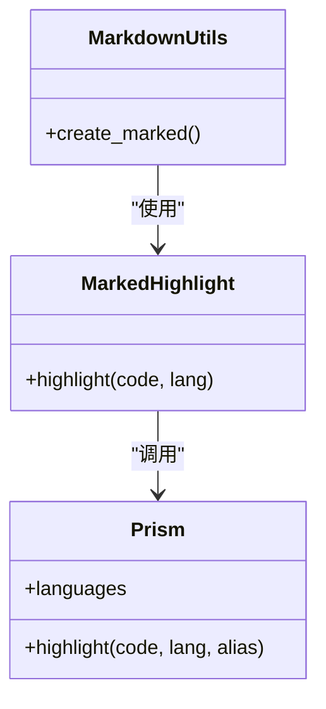
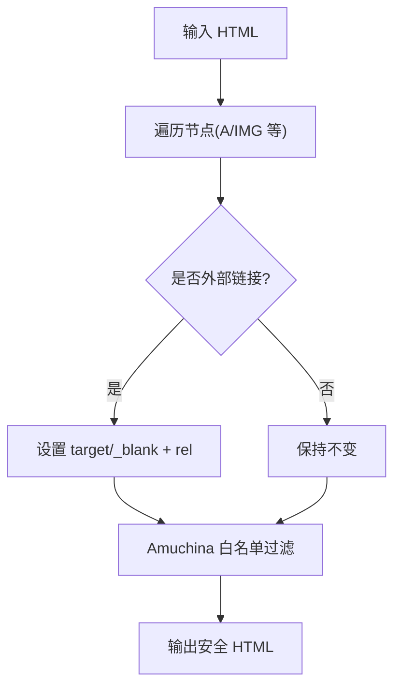
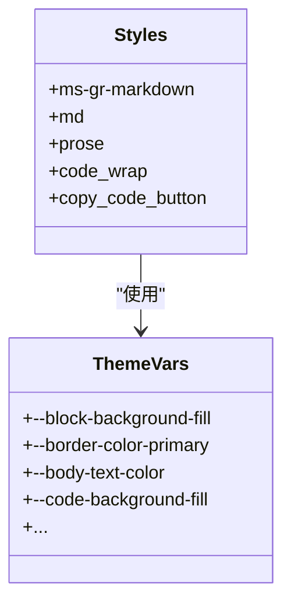
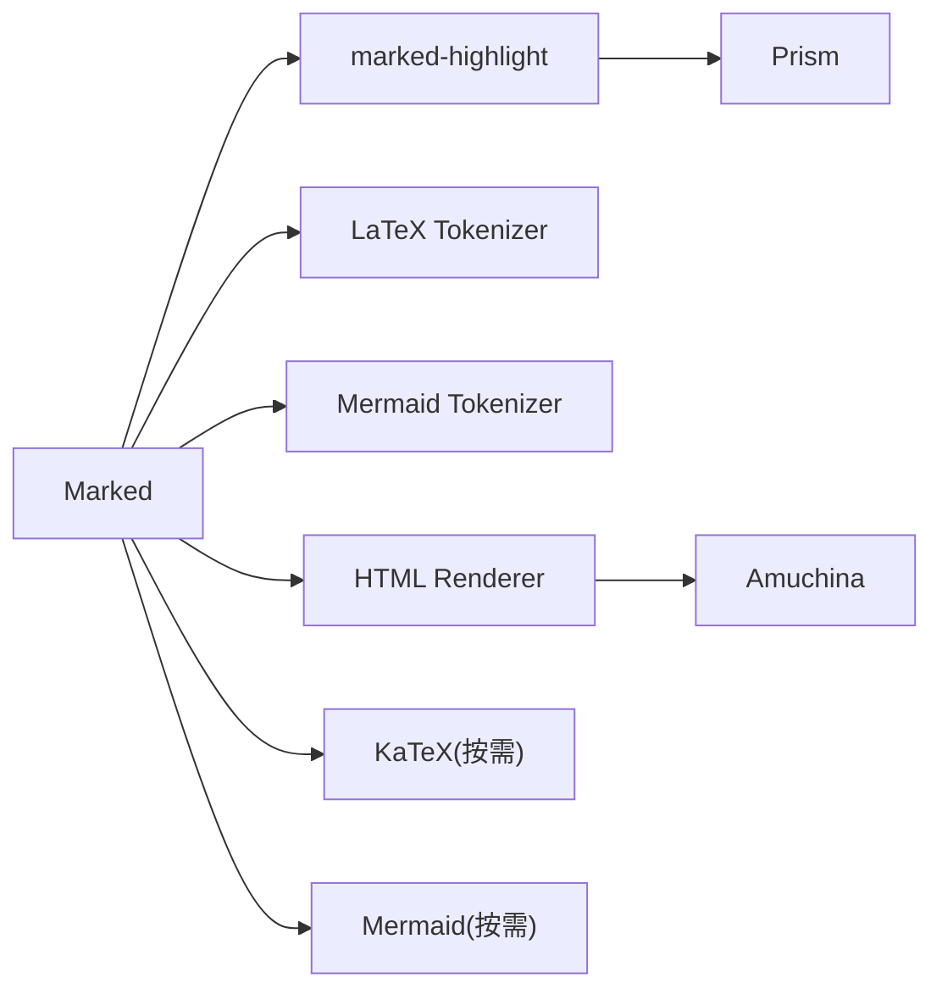

# Markdown 组件 API

<cite>
**本文引用的文件**
- [frontend/globals/components/markdown/index.tsx](file://frontend/globals/components/markdown/index.tsx)
- [frontend/globals/components/markdown/utils.ts](file://frontend/globals/components/markdown/utils.ts)
- [frontend/globals/components/markdown/sanitize.ts](file://frontend/globals/components/markdown/sanitize.ts)
- [frontend/globals/components/markdown/markdown.less](file://frontend/globals/components/markdown/markdown.less)
- [frontend/globals/components/markdown/prism.less](file://frontend/globals/components/markdown/prism.less)
- [frontend/globals/components/markdown/html-tags.ts](file://frontend/globals/components/markdown/html-tags.ts)
- [frontend/base/markdown/Index.svelte](file://frontend/base/markdown/Index.svelte)
- [frontend/base/markdown/markdown.tsx](file://frontend/base/markdown/markdown.tsx)
- [backend/modelscope_studio/components/base/markdown/__init__.py](file://backend/modelscope_studio/components/base/markdown/__init__.py)
- [docs/components/base/markdown/README.md](file://docs/components/base/markdown/README.md)
- [docs/components/base/markdown/demos/basic.py](file://docs/components/base/markdown/demos/basic.py)
- [docs/components/base/markdown/demos/custom_copy_buttons.py](file://docs/components/base/markdown/demos/custom_copy_buttons.py)
</cite>

## 目录

1. [简介](#简介)
2. [项目结构](#项目结构)
3. [核心组件](#核心组件)
4. [架构总览](#架构总览)
5. [详细组件分析](#详细组件分析)
6. [依赖关系分析](#依赖关系分析)
7. [性能考虑](#性能考虑)
8. [故障排查指南](#故障排查指南)
9. [结论](#结论)
10. [附录](#附录)

## 简介

本文件为 ModelScope Studio 基座组件中的 Markdown 组件提供详细的 API 文档，覆盖以下方面：

- 属性定义与默认值
- 渲染选项（行尾换行、标题锚点、数学公式、Mermaid 图表）
- 代码高亮（Prism.js 集成与语言支持）
- 安全过滤（HTML 白名单与外链处理）
- 样式定制（CSS 类名、内联样式、主题变量）
- 使用示例（基础渲染、复制按钮、自定义按钮）
- 性能优化建议（懒加载、缓存策略）
- 常见问题与调试方法

## 项目结构

Markdown 组件由前端 React 组件与后端 Gradio 组件协同实现，并通过 Svelte 包装桥接。前端解析与渲染逻辑集中在全局组件目录，后端负责参数透传与事件绑定。

**图表来源**

- [frontend/base/markdown/Index.svelte:1-63](file://frontend/base/markdown/Index.svelte#L1-L63)
- [frontend/base/markdown/markdown.tsx:1-34](file://frontend/base/markdown/markdown.tsx#L1-L34)
- [frontend/globals/components/markdown/index.tsx:1-272](file://frontend/globals/components/markdown/index.tsx#L1-L272)
- [frontend/globals/components/markdown/utils.ts:1-411](file://frontend/globals/components/markdown/utils.ts#L1-L411)
- [frontend/globals/components/markdown/sanitize.ts:1-26](file://frontend/globals/components/markdown/sanitize.ts#L1-L26)
- [frontend/globals/components/markdown/markdown.less:1-140](file://frontend/globals/components/markdown/markdown.less#L1-L140)
- [frontend/globals/components/markdown/prism.less:1-185](file://frontend/globals/components/markdown/prism.less#L1-L185)
- [frontend/globals/components/markdown/html-tags.ts:1-210](file://frontend/globals/components/markdown/html-tags.ts#L1-L210)
- [backend/modelscope_studio/components/base/markdown/**init**.py:1-174](file://backend/modelscope_studio/components/base/markdown/__init__.py#L1-L174)

**章节来源**

- [frontend/base/markdown/Index.svelte:1-63](file://frontend/base/markdown/Index.svelte#L1-L63)
- [frontend/base/markdown/markdown.tsx:1-34](file://frontend/base/markdown/markdown.tsx#L1-L34)
- [frontend/globals/components/markdown/index.tsx:1-272](file://frontend/globals/components/markdown/index.tsx#L1-L272)
- [backend/modelscope_studio/components/base/markdown/**init**.py:1-174](file://backend/modelscope_studio/components/base/markdown/__init__.py#L1-L174)

## 核心组件

- 前端 React 组件：负责 Markdown 解析、代码高亮、数学公式渲染、Mermaid 图表、HTML 安全过滤、复制按钮交互等。
- 后端 Gradio 组件：负责参数透传、事件绑定（如 copy/change/mouse 系列）、默认值与示例数据。

关键职责划分：

- 解析与渲染：Marked + marked-highlight（Prism）+ 自定义扩展（LaTeX、Mermaid）
- 安全过滤：Amuchina + 外链处理
- 数学公式：KaTeX 按需加载与自动渲染
- 图表：Mermaid 按需加载与错误回退
- 样式：通用样式 + Prism 主题变量

**章节来源**

- [frontend/globals/components/markdown/index.tsx:27-48](file://frontend/globals/components/markdown/index.tsx#L27-L48)
- [frontend/globals/components/markdown/utils.ts:286-344](file://frontend/globals/components/markdown/utils.ts#L286-L344)
- [backend/modelscope_studio/components/base/markdown/**init**.py:11-174](file://backend/modelscope_studio/components/base/markdown/__init__.py#L11-L174)

## 架构总览

Markdown 组件从后端接收参数，经前端包装后进行解析与渲染。解析阶段可启用行尾换行、标题锚点、LaTeX 与 Mermaid 扩展；渲染阶段结合 Prism 进行代码高亮，结合 KaTeX/Mermaid 进行数学与图表渲染，并对输出 HTML 进行安全过滤。

**图表来源**

- [frontend/base/markdown/Index.svelte:19-62](file://frontend/base/markdown/Index.svelte#L19-L62)
- [frontend/globals/components/markdown/index.tsx:86-92](file://frontend/globals/components/markdown/index.tsx#L86-L92)
- [frontend/globals/components/markdown/utils.ts:286-344](file://frontend/globals/components/markdown/utils.ts#L286-L344)
- [frontend/globals/components/markdown/sanitize.ts:12-25](file://frontend/globals/components/markdown/sanitize.ts#L12-L25)

## 详细组件分析

### 属性定义与默认值

- value: 字符串，Markdown 内容
- sanitizeHtml: 布尔，是否启用 HTML 安全过滤，默认开启
- latexDelimiters: 数组，自定义 LaTeX 分隔符，包含 left/right/display 三元组
- lineBreaks: 布尔，是否将换行符转换为  ，默认开启
- headerLinks: 布尔，是否生成标题锚点与链接图标，默认关闭
- showCopyButton: 布尔，是否显示整体复制按钮
- rtl: 布尔，是否启用从右到左布局
- themeMode: 字符串，主题模式（light/dark），用于样式与 Mermaid 主题
- rootUrl: 字符串，根路径，用于外链判断与资源定位
- allowTags: 布尔或字符串数组，控制允许的 HTML/SVG 标签
- onCopy: 回调，复制成功时触发
- onChange: 回调，渲染完成时触发
- copyButtons: 自定义复制按钮集合（通过插槽）

默认 LaTeX 分隔符集合包含多组常见表达式（行内/块级、括号变体等）。

**章节来源**

- [frontend/globals/components/markdown/index.tsx:27-48](file://frontend/globals/components/markdown/index.tsx#L27-L48)
- [frontend/globals/components/markdown/index.tsx:50-60](file://frontend/globals/components/markdown/index.tsx#L50-L60)
- [backend/modelscope_studio/components/base/markdown/**init**.py:54-141](file://backend/modelscope_studio/components/base/markdown/__init__.py#L54-L141)

### 渲染选项与解析器配置

- 行尾换行：由 Marked 的 breaks 选项控制
- 标题锚点：在启用 headerLinks 时，为标题生成 ID 并插入锚点链接图标
- LaTeX：自定义 tokenizer 支持多组分隔符，渲染为块级容器
- Mermaid：自定义 tokenizer 支持代码块标记为 mermaid，渲染为图表
- 代码高亮：通过 marked-highlight 集成 Prism，按语言类名渲染
- HTML 安全：对链接外链添加 target/rel，使用 Amuchina 白名单过滤

**图表来源**

- [frontend/globals/components/markdown/utils.ts:286-344](file://frontend/globals/components/markdown/utils.ts#L286-L344)
- [frontend/globals/components/markdown/index.tsx:107-138](file://frontend/globals/components/markdown/index.tsx#L107-L138)
- [frontend/globals/components/markdown/sanitize.ts:12-25](file://frontend/globals/components/markdown/sanitize.ts#L12-L25)

**章节来源**

- [frontend/globals/components/markdown/utils.ts:286-344](file://frontend/globals/components/markdown/utils.ts#L286-L344)
- [frontend/globals/components/markdown/index.tsx:107-138](file://frontend/globals/components/markdown/index.tsx#L107-L138)

### 代码高亮与语言支持

- 高亮库：Prism.js（marked-highlight 集成）
- 语言支持：内置加载 Python、LaTeX、Bash、JSX、TypeScript、TSX 等常用语言
- 渲染方式：根据代码块语言动态选择 Prism 语言，未识别语言则保持原文
- 主题：通过 prism.less 应用主题变量，深色模式下切换暗色配色

**图表来源**

- [frontend/globals/components/markdown/utils.ts:9-16](file://frontend/globals/components/markdown/utils.ts#L9-L16)
- [frontend/globals/components/markdown/utils.ts:303-310](file://frontend/globals/components/markdown/utils.ts#L303-L310)

**章节来源**

- [frontend/globals/components/markdown/utils.ts:9-16](file://frontend/globals/components/markdown/utils.ts#L9-L16)
- [frontend/globals/components/markdown/utils.ts:303-310](file://frontend/globals/components/markdown/utils.ts#L303-L310)

### HTML 安全过滤与白名单

- 外链处理：对外部链接自动设置 target="\_blank" 与 rel="noopener noreferrer"
- 白名单过滤：基于 Amuchina 对 HTML 进行清理，仅保留标准 HTML 与 SVG 标签
- 允许标签：支持布尔开关或显式数组，对不在白名单内的标签进行转义

**图表来源**

- [frontend/globals/components/markdown/sanitize.ts:12-25](file://frontend/globals/components/markdown/sanitize.ts#L12-L25)
- [frontend/globals/components/markdown/html-tags.ts:206-210](file://frontend/globals/components/markdown/html-tags.ts#L206-L210)

**章节来源**

- [frontend/globals/components/markdown/sanitize.ts:1-26](file://frontend/globals/components/markdown/sanitize.ts#L1-L26)
- [frontend/globals/components/markdown/html-tags.ts:1-210](file://frontend/globals/components/markdown/html-tags.ts#L1-L210)

### 样式定制与主题变量

- CSS 类名：组件根元素包含 ms-gr-markdown 与 md/prose 等类，便于覆盖
- 主题变量：通过 CSS 变量控制颜色、间距、圆角、阴影等
- 代码高亮主题：prism.less 提供明/暗两套配色，随 themeMode 切换
- 复制按钮：绝对定位，支持自定义按钮集合（copy/copied）

**图表来源**

- [frontend/globals/components/markdown/markdown.less:1-140](file://frontend/globals/components/markdown/markdown.less#L1-L140)
- [frontend/globals/components/markdown/prism.less:1-185](file://frontend/globals/components/markdown/prism.less#L1-L185)

**章节来源**

- [frontend/globals/components/markdown/markdown.less:1-140](file://frontend/globals/components/markdown/markdown.less#L1-L140)
- [frontend/globals/components/markdown/prism.less:1-185](file://frontend/globals/components/markdown/prism.less#L1-L185)

### 使用示例

- 基础文本渲染：直接传入 Markdown 字符串
- 显示复制按钮：启用 showCopyButton 或通过插槽提供自定义按钮
- 自定义按钮：使用 Slot 注入两个按钮（如复制/已复制状态）

参考示例脚本与文档：

- 基础示例：[basic.py:1-10](file://docs/components/base/markdown/demos/basic.py#L1-L10)
- 自定义复制按钮：[custom_copy_buttons.py:1-21](file://docs/components/base/markdown/demos/custom_copy_buttons.py#L1-L21)
- 组件说明：[README.md:1-13](file://docs/components/base/markdown/README.md#L1-L13)

**章节来源**

- [docs/components/base/markdown/demos/basic.py:1-10](file://docs/components/base/markdown/demos/basic.py#L1-L10)
- [docs/components/base/markdown/demos/custom_copy_buttons.py:1-21](file://docs/components/base/markdown/demos/custom_copy_buttons.py#L1-L21)
- [docs/components/base/markdown/README.md:1-13](file://docs/components/base/markdown/README.md#L1-L13)

## 依赖关系分析

- 前端依赖
  - Marked：Markdown 解析与渲染
  - marked-highlight + Prism：代码高亮
  - KaTeX：数学公式渲染（按需加载）
  - Mermaid：图表渲染（按需加载）
  - Amuchina：HTML 白名单过滤
  - github-slugger：标题 ID 生成
- 后端依赖
  - Gradio 事件监听：copy/change/mouse 系列
  - 前端目录解析：resolve_frontend_dir("markdown")

**图表来源**

- [frontend/globals/components/markdown/utils.ts:6-18](file://frontend/globals/components/markdown/utils.ts#L6-L18)
- [frontend/globals/components/markdown/utils.ts:286-344](file://frontend/globals/components/markdown/utils.ts#L286-L344)

**章节来源**

- [frontend/globals/components/markdown/utils.ts:6-18](file://frontend/globals/components/markdown/utils.ts#L6-L18)
- [backend/modelscope_studio/components/base/markdown/**init**.py:15-46](file://backend/modelscope_studio/components/base/markdown/__init__.py#L15-L46)

## 性能考虑

- 懒加载
  - KaTeX：首次出现数学公式时才加载样式与自动渲染模块
  - Mermaid：渲染前异步加载并在下一帧执行
  - Prism：在解析阶段按需高亮，避免无谓开销
- 缓存策略
  - 已加载的 KaTeX 模块进行全局标记，避免重复导入
  - Mermaid 初始化参数固定，减少重复初始化成本
- 渲染时机
  - 使用 requestAnimationFrame 将渲染操作推迟到浏览器空闲帧
  - 仅在内容变化时重新解析与渲染
- 安全过滤
  - 仅在启用 sanitizeHtml 时进行过滤，避免不必要的 DOM 解析

**章节来源**

- [frontend/globals/components/markdown/index.tsx:140-173](file://frontend/globals/components/markdown/index.tsx#L140-L173)
- [frontend/globals/components/markdown/utils.ts:177-223](file://frontend/globals/components/markdown/utils.ts#L177-L223)

## 故障排查指南

- 复制按钮无效
  - 检查容器是否正确绑定点击事件（bind_copy_event）
  - 确认 copyButtons 插槽是否正确注入
- 数学公式不渲染
  - 确认 latexDelimiters 是否正确配置
  - 检查是否启用了 sanitizeHtml 导致脚本被移除
- Mermaid 图表报错
  - 查看控制台错误日志
  - 确认 mermaid 代码块闭合与语法正确
  - 检查 themeMode 是否与页面主题一致
- 外链未打开新窗口
  - 确认 rootUrl 与链接 origin 匹配
  - 检查 sanitize 流程中是否正确设置 target/rel
- 代码高亮失效
  - 确认语言标识是否在 Prism 支持列表中
  - 检查 prism.less 是否正确引入与主题变量生效

**章节来源**

- [frontend/globals/components/markdown/utils.ts:346-380](file://frontend/globals/components/markdown/utils.ts#L346-L380)
- [frontend/globals/components/markdown/sanitize.ts:12-25](file://frontend/globals/components/markdown/sanitize.ts#L12-L25)
- [frontend/globals/components/markdown/utils.ts:177-223](file://frontend/globals/components/markdown/utils.ts#L177-L223)

## 结论

ModelScope Studio 的 Markdown 组件在保证安全与可访问性的前提下，提供了丰富的渲染能力与灵活的定制接口。通过 Marked + Prism + KaTeX + Mermaid 的组合，满足从基础文本到复杂公式与图表的多样化需求；通过白名单过滤与外链处理确保输出安全；通过主题变量与样式类名实现一致的视觉风格与良好的可定制性。

## 附录

### 后端组件参数一览

- 参数名称：value、rtl、latex_delimiters、sanitize_html、line_breaks、header_links、allow_tags、show_copy_button、copy_buttons
- 事件：change、copy、click、dblclick、mousedown、mouseup、mouseover、mouseout、mousemove、scroll
- 示例：example_payload/example_value 返回简单 Markdown 字符串

**章节来源**

- [backend/modelscope_studio/components/base/markdown/**init**.py:54-174](file://backend/modelscope_studio/components/base/markdown/__init__.py#L54-L174)

### 前端组件属性一览

- value、sanitizeHtml、latexDelimiters、lineBreaks、headerLinks、showCopyButton、rtl、themeMode、rootUrl、allowTags、onCopy、onChange、copyButtons
- 默认 LaTeX 分隔符集合、复制按钮图标与反馈、Mermaid 错误回退

**章节来源**

- [frontend/globals/components/markdown/index.tsx:27-48](file://frontend/globals/components/markdown/index.tsx#L27-L48)
- [frontend/globals/components/markdown/index.tsx:50-60](file://frontend/globals/components/markdown/index.tsx#L50-L60)
