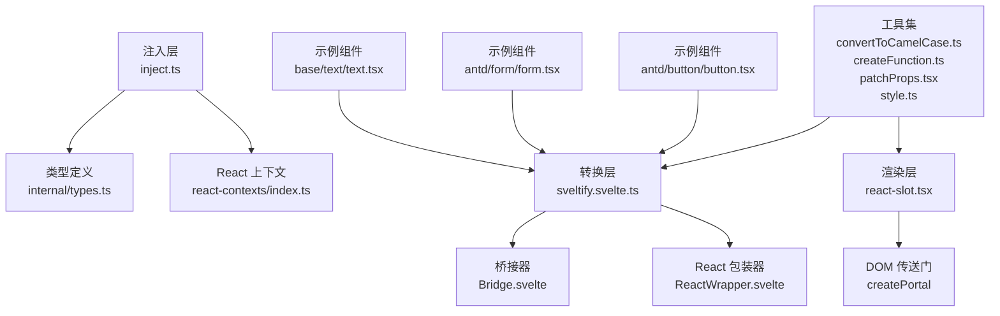
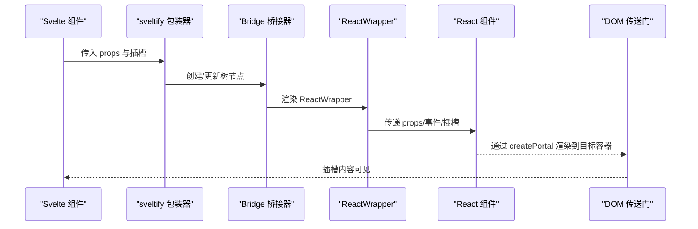
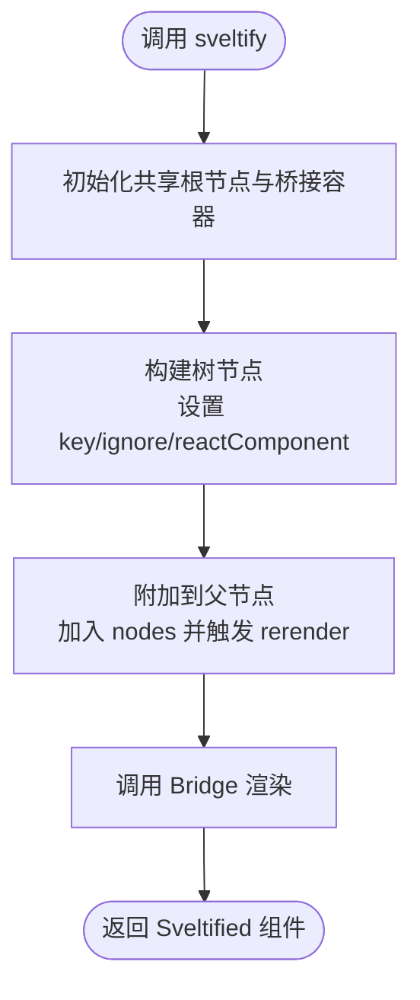
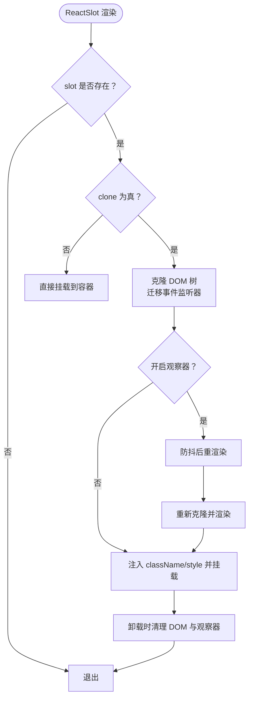
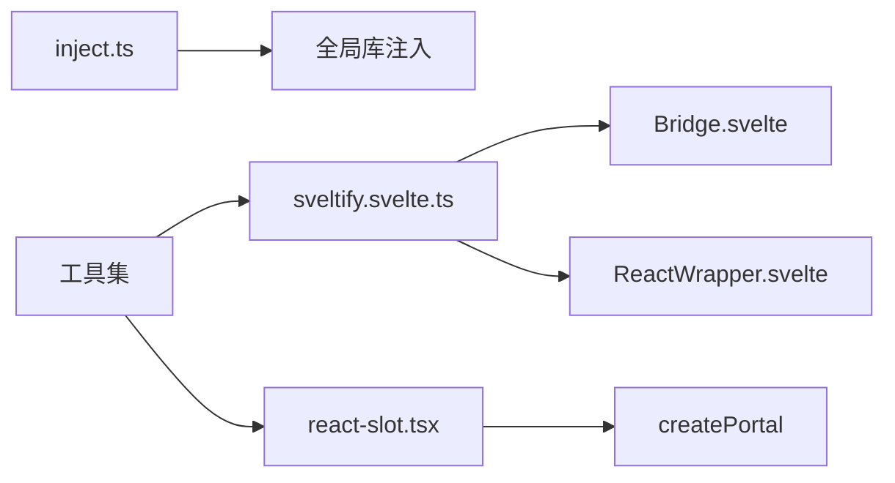

# React 组件桥接 API

<cite>
**本文引用的文件**
- [frontend/svelte-preprocess-react/index.ts](file://frontend/svelte-preprocess-react/index.ts)
- [frontend/svelte-preprocess-react/sveltify.svelte.ts](file://frontend/svelte-preprocess-react/sveltify.svelte.ts)
- [frontend/svelte-preprocess-react/inject.ts](file://frontend/svelte-preprocess-react/inject.ts)
- [frontend/svelte-preprocess-react/react-slot.tsx](file://frontend/svelte-preprocess-react/reactSlot.tsx)
- [frontend/svelte-preprocess-react/internal/types.ts](file://frontend/svelte-preprocess-react/internal/types.ts)
- [frontend/svelte-preprocess-react/react-contexts/index.ts](file://frontend/svelte-preprocess-react/react-contexts/index.ts)
- [frontend/utils/convertToCamelCase.ts](file://frontend/utils/convertToCamelCase.ts)
- [frontend/utils/createFunction.ts](file://frontend/utils/createFunction.ts)
- [frontend/utils/patchProps.tsx](file://frontend/utils/patchProps.tsx)
- [frontend/utils/hooks/useMemoizedEqualValue.ts](file://frontend/utils/hooks/useMemoizedEqualValue.ts)
- [frontend/utils/style.ts](file://frontend/utils/style.ts)
- [frontend/antd/button/button.tsx](file://frontend/antd/button/button.tsx)
- [frontend/antd/form/form.tsx](file://frontend/antd/form/form.tsx)
- [frontend/base/text/text.tsx](file://frontend/base/text/text.tsx)
</cite>

## 目录

1. [简介](#简介)
2. [项目结构](#项目结构)
3. [核心组件](#核心组件)
4. [架构总览](#架构总览)
5. [详细组件分析](#详细组件分析)
6. [依赖关系分析](#依赖关系分析)
7. [性能考虑](#性能考虑)
8. [故障排查指南](#故障排查指南)
9. [结论](#结论)
10. [附录：标准用法与示例路径](#附录标准用法与示例路径)

## 简介

本文件为 ModelScope Studio 的 React 组件桥接系统提供全面的 API 文档，重点覆盖以下方面：

- React 组件到 Svelte 组件的转换机制（sveltify）
- 属性映射、事件绑定与状态同步
- 事件处理（冒泡、委托、自定义事件）
- 生命周期钩子在 Svelte 中的对应实现
- 属性转换规则（驼峰命名、布尔值、函数属性）
- 上下文系统（React Context 与 Svelte Context 的互操作）
- 性能优化（懒加载、缓存、内存管理）
- 错误处理与调试技巧

## 项目结构

桥接系统主要由三部分组成：

- 注入层：初始化全局运行时环境与库桥接
- 转换层：sveltify 将 React 组件包装为 Svelte 组件
- 渲染层：ReactSlot 将 Svelte 插槽内容渲染为 React 元素，并支持克隆与属性注入

图表来源

- [frontend/svelte-preprocess-react/inject.ts:1-103](file://frontend/svelte-preprocess-react/inject.ts#L1-L103)
- [frontend/svelte-preprocess-react/sveltify.svelte.ts:1-119](file://frontend/svelte-preprocess-react/sveltify.svelte.ts#L1-L119)
- [frontend/svelte-preprocess-react/react-slot.tsx:1-224](file://frontend/svelte-preprocess-react/react-slot.tsx#L1-L224)
- [frontend/svelte-preprocess-react/internal/types.ts:1-79](file://frontend/svelte-preprocess-react/internal/types.ts#L1-L79)
- [frontend/svelte-preprocess-react/react-contexts/index.ts:1-123](file://frontend/svelte-preprocess-react/react-contexts/index.ts#L1-L123)
- [frontend/utils/convertToCamelCase.ts:1-22](file://frontend/utils/convertToCamelCase.ts#L1-L22)
- [frontend/utils/createFunction.ts:1-38](file://frontend/utils/createFunction.ts#L1-L38)
- [frontend/utils/patchProps.tsx:1-39](file://frontend/utils/patchProps.tsx#L1-L39)
- [frontend/utils/style.ts:1-77](file://frontend/utils/style.ts#L1-L77)
- [frontend/antd/button/button.tsx:1-39](file://frontend/antd/button/button.tsx#L1-L39)
- [frontend/antd/form/form.tsx:1-79](file://frontend/antd/form/form.tsx#L1-L79)
- [frontend/base/text/text.tsx:1-11](file://frontend/base/text/text.tsx#L1-L11)

章节来源

- [frontend/svelte-preprocess-react/index.ts:1-8](file://frontend/svelte-preprocess-react/index.ts#L1-L8)
- [frontend/svelte-preprocess-react/inject.ts:1-103](file://frontend/svelte-preprocess-react/inject.ts#L1-L103)

## 核心组件

- sveltify：将任意 React 组件包装为 Svelte 组件，负责属性透传、插槽映射、事件桥接与树节点构建。
- ReactSlot：将 Svelte 插槽内容渲染为 React 元素，支持克隆 DOM、事件监听迁移、样式与类名注入。
- 类型系统：统一事件命名、属性剔除与 Svelte/SvelteKit 类型适配。
- 上下文系统：React Context 到 Svelte 的桥接与合并策略。

章节来源

- [frontend/svelte-preprocess-react/sveltify.svelte.ts:27-119](file://frontend/svelte-preprocess-react/sveltify.svelte.ts#L27-L119)
- [frontend/svelte-preprocess-react/react-slot.tsx:8-224](file://frontend/svelte-preprocess-react/react-slot.tsx#L8-L224)
- [frontend/svelte-preprocess-react/internal/types.ts:4-79](file://frontend/svelte-preprocess-react/internal/types.ts#L4-L79)
- [frontend/svelte-preprocess-react/react-contexts/index.ts:1-123](file://frontend/svelte-preprocess-react/react-contexts/index.ts#L1-L123)

## 架构总览

下图展示从 Svelte 使用方到 React 组件的完整调用链路与数据流：

图表来源

- [frontend/svelte-preprocess-react/sveltify.svelte.ts:40-104](file://frontend/svelte-preprocess-react/sveltify.svelte.ts#L40-L104)
- [frontend/svelte-preprocess-react/react-slot.tsx:109-224](file://frontend/svelte-preprocess-react/react-slot.tsx#L109-L224)

## 详细组件分析

### sveltify 函数与转换机制

- 功能概述
  - 将 React 组件包装为 Svelte 组件，自动处理属性透传、插槽映射、事件桥接与树形渲染。
  - 支持可选的忽略渲染选项（ignore）以控制节点是否参与渲染。
- 关键点
  - 初始化共享根节点与桥接容器，确保 React 根挂载在文档头部。
  - 为每个 Svelte 实例生成唯一 key，并建立父子节点关系。
  - 通过 Bridge 与 ReactWrapper 协作完成渲染与更新。
  - 提供 Promise 化返回，等待全局初始化完成后才可使用。
- 参数与返回
  - 第一个参数：React 组件类型（可带通用插槽声明）。
  - 第二个参数：可选配置对象，当前支持 ignore 字段。
  - 返回：Sveltified 类型的 Svelte 组件（Promise 或已初始化版本）。

图表来源

- [frontend/svelte-preprocess-react/sveltify.svelte.ts:40-104](file://frontend/svelte-preprocess-react/sveltify.svelte.ts#L40-L104)

章节来源

- [frontend/svelte-preprocess-react/sveltify.svelte.ts:27-119](file://frontend/svelte-preprocess-react/sveltify.svelte.ts#L27-L119)
- [frontend/svelte-preprocess-react/index.ts:6-8](file://frontend/svelte-preprocess-react/index.ts#L6-L8)

### ReactSlot 插槽渲染与事件处理

- 功能概述
  - 将 Svelte 插槽内容渲染为 React 元素，支持克隆 DOM、迁移事件监听器、注入样式与类名。
  - 可选择观察属性变化，以适配动态渲染场景（如表格列渲染）。
- 关键点
  - 克隆策略：遍历子节点，复制文本节点与元素节点；对 React 元素进行深度克隆并迁移内部注册的副作用。
  - 事件迁移：读取元素上的事件监听列表，重新绑定到克隆节点上。
  - 属性注入：支持 className 与 style 的注入，并将 React 样式对象转换为内联样式。
  - 观察器：使用防抖的 MutationObserver 监听插槽变化，确保动态内容及时反映。
- 参数
  - slot：插槽对应的 HTMLElement。
  - clone：是否克隆 DOM（默认 false）。
  - className/style：注入的类名与样式对象。
  - observeAttributes：是否观察属性变化（默认 false）。

图表来源

- [frontend/svelte-preprocess-react/react-slot.tsx:16-224](file://frontend/svelte-preprocess-react/react-slot.tsx#L16-L224)

章节来源

- [frontend/svelte-preprocess-react/react-slot.tsx:8-224](file://frontend/svelte-preprocess-react/react-slot.tsx#L8-L224)

### 类型系统与事件映射

- 事件命名与映射
  - React 侧事件属性以大写开头（如 onClick），Svelte 侧事件处理器以 on 前缀（如 onClick 对应 on-click）。
  - 类型工具将 React 事件属性映射为 Svelte 事件处理器签名。
- 属性剔除
  - 将 React 事件属性从普通属性中剔除，避免传递给 Svelte 组件导致冲突。
- Svelte Props 适配
  - children 属性被适配为 Svelte 的 Snippet 类型，以支持插槽与片段。

章节来源

- [frontend/svelte-preprocess-react/internal/types.ts:4-79](file://frontend/svelte-preprocess-react/internal/types.ts#L4-L79)

### 上下文系统（React Context 与 Svelte 的互操作）

- React Context
  - 提供 IconFont、FormItem、AutoComplete、Suggestion、SuggestionOpen 等上下文，用于组件间共享状态与回调。
- Svelte 侧桥接
  - 通过 ContextPropsContext 在 ReactSlot 内部读取上下文值，支持强制克隆与参数变更检测。
  - 支持上下文合并策略，避免重复 Provider 导致的状态丢失。
- 使用建议
  - 在需要动态渲染或克隆 DOM 的场景下，结合 forceClone 与 observeAttributes 提升稳定性。

章节来源

- [frontend/svelte-preprocess-react/react-contexts/index.ts:1-123](file://frontend/svelte-preprocess-react/react-contexts/index.ts#L1-L123)

### 属性转换规则与工具

- 驼峰命名转换
  - 将下划线风格的键转换为小驼峰或大驼峰，便于与 React 属性保持一致。
- 布尔值处理
  - 通过工具函数将布尔值正确映射到 React 属性。
- 函数属性绑定
  - 支持字符串形式的函数定义，自动解析为可执行函数，便于从外部传入回调逻辑。
- 插槽属性补丁
  - 对 key 等特殊属性进行内部转存与恢复，避免与 Svelte 内部机制冲突。

章节来源

- [frontend/utils/convertToCamelCase.ts:1-22](file://frontend/utils/convertToCamelCase.ts#L1-L22)
- [frontend/utils/createFunction.ts:1-38](file://frontend/utils/createFunction.ts#L1-L38)
- [frontend/utils/patchProps.tsx:1-39](file://frontend/utils/patchProps.tsx#L1-L39)

### 事件处理机制

- 事件冒泡与委托
  - ReactSlot 在克隆过程中迁移事件监听器，确保克隆后的元素仍能响应事件。
- 自定义事件
  - 通过 ContextPropsContext 与 useFunction 钩子，将自定义回调以稳定函数形式注入 React 组件。
- 样式与单位
  - 将 React 样式对象转换为内联样式字符串或对象，自动添加像素单位（无单位属性除外）。

章节来源

- [frontend/svelte-preprocess-react/react-slot.tsx:67-96](file://frontend/svelte-preprocess-react/react-slot.tsx#L67-L96)
- [frontend/utils/hooks/useMemoizedEqualValue.ts:1-15](file://frontend/utils/hooks/useMemoizedEqualValue.ts#L1-L15)
- [frontend/utils/style.ts:1-77](file://frontend/utils/style.ts#L1-L77)

### 生命周期钩子在 Svelte 中的对应实现

- 初始化
  - 通过全局初始化 Promise 确保运行时环境就绪后再进行渲染。
- 更新
  - 每次节点变更触发 rerender，Bridge 重新渲染 ReactWrapper 与子树。
- 销毁
  - 清理 DOM 节点与观察器，释放资源。

章节来源

- [frontend/svelte-preprocess-react/inject.ts:95-103](file://frontend/svelte-preprocess-react/inject.ts#L95-L103)
- [frontend/svelte-preprocess-react/sveltify.svelte.ts:75-82](file://frontend/svelte-preprocess-react/sveltify.svelte.ts#L75-L82)
- [frontend/svelte-preprocess-react/react-slot.tsx:204-212](file://frontend/svelte-preprocess-react/react-slot.tsx#L204-L212)

## 依赖关系分析

- 运行时依赖
  - React、ReactDOM、@ant-design/cssinjs、@ant-design/icons、@ant-design/x、dayjs 等库通过全局注入提供。
- 工具依赖
  - lodash-es 提供 isEqual、debounce、noop 等工具。
- 组件依赖
  - sveltify 依赖 Bridge 与 ReactWrapper 完成渲染；ReactSlot 依赖 createPortal 与样式工具。

图表来源

- [frontend/svelte-preprocess-react/inject.ts:20-85](file://frontend/svelte-preprocess-react/inject.ts#L20-L85)
- [frontend/svelte-preprocess-react/sveltify.svelte.ts:1-7](file://frontend/svelte-preprocess-react/sveltify.svelte.ts#L1-L7)
- [frontend/svelte-preprocess-react/react-slot.tsx:1-6](file://frontend/svelte-preprocess-react/react-slot.tsx#L1-L6)

章节来源

- [frontend/svelte-preprocess-react/inject.ts:1-103](file://frontend/svelte-preprocess-react/inject.ts#L1-L103)

## 性能考虑

- 懒加载与延迟初始化
  - 通过全局初始化 Promise 与共享根节点，避免重复挂载与多次初始化。
- 缓存与去重
  - 使用 useMemoizedEqualValue 与 ContextPropsContext 的变更检测，减少不必要的重渲染。
- 内存管理
  - 卸载时断开 MutationObserver、移除 DOM 节点与桥接容器，防止内存泄漏。
- 渲染优化
  - ReactSlot 的克隆与观察采用防抖策略，降低频繁变更带来的性能压力。

章节来源

- [frontend/svelte-preprocess-react/react-slot.tsx:180-198](file://frontend/svelte-preprocess-react/react-slot.tsx#L180-L198)
- [frontend/utils/hooks/useMemoizedEqualValue.ts:1-15](file://frontend/utils/hooks/useMemoizedEqualValue.ts#L1-L15)
- [frontend/svelte-preprocess-react/sveltify.svelte.ts:67-82](file://frontend/svelte-preprocess-react/sveltify.svelte.ts#L67-L82)

## 故障排查指南

- 插槽不显示
  - 检查 slot 是否存在且未被销毁；确认 clone 模式与 observeAttributes 设置。
- 事件失效
  - 确认事件监听是否随克隆迁移；检查事件监听器是否被覆盖或移除。
- 样式异常
  - 检查样式对象是否正确转换为内联样式；确认单位是否符合预期。
- 性能问题
  - 合理使用 forceClone 与防抖观察器；避免频繁变更导致的重渲染。
- 上下文冲突
  - 使用 ContextPropsProvider 的合并策略与参数变更检测，避免重复 Provider 导致的状态丢失。

章节来源

- [frontend/svelte-preprocess-react/react-slot.tsx:156-212](file://frontend/svelte-preprocess-react/react-slot.tsx#L156-L212)
- [frontend/utils/style.ts:39-77](file://frontend/utils/style.ts#L39-L77)
- [frontend/svelte-preprocess-react/react-contexts/index.ts:67-123](file://frontend/svelte-preprocess-react/react-contexts/index.ts#L67-L123)

## 结论

ModelScope Studio 的 React 组件桥接系统通过 sveltify 与 ReactSlot 实现了 React 与 Svelte 的无缝协作。其设计强调：

- 明确的类型约束与事件映射
- 稳健的插槽渲染与事件迁移
- 可扩展的上下文系统与性能优化策略
- 清晰的生命周期管理与资源回收

该体系为复杂前端应用提供了统一的组件桥接方案，既保证了开发体验，也兼顾了运行时性能与稳定性。

## 附录：标准用法与示例路径

- 简单组件桥接
  - 示例：基础文本组件桥接
  - 路径：[frontend/base/text/text.tsx:1-11](file://frontend/base/text/text.tsx#L1-L11)
- 复杂组件桥接（含插槽与事件）
  - 示例：按钮组件桥接（图标与加载态插槽）
  - 路径：[frontend/antd/button/button.tsx:1-39](file://frontend/antd/button/button.tsx#L1-L39)
- 表单组件桥接（含状态同步与动作分发）
  - 示例：表单组件桥接（值同步、动作重置、事件转发）
  - 路径：[frontend/antd/form/form.tsx:1-79](file://frontend/antd/form/form.tsx#L1-L79)
- sveltify 使用要点
  - 路径：[frontend/svelte-preprocess-react/sveltify.svelte.ts:27-119](file://frontend/svelte-preprocess-react/sveltify.svelte.ts#L27-L119)
- ReactSlot 使用要点
  - 路径：[frontend/svelte-preprocess-react/react-slot.tsx:8-224](file://frontend/svelte-preprocess-react/react-slot.tsx#L8-L224)
- 类型与事件映射
  - 路径：[frontend/svelte-preprocess-react/internal/types.ts:4-79](file://frontend/svelte-preprocess-react/internal/types.ts#L4-L79)
- 上下文系统
  - 路径：[frontend/svelte-preprocess-react/react-contexts/index.ts:1-123](file://frontend/svelte-preprocess-react/react-contexts/index.ts#L1-L123)
- 属性转换与函数绑定
  - 路径：[frontend/utils/convertToCamelCase.ts:1-22](file://frontend/utils/convertToCamelCase.ts#L1-L22)
  - 路径：[frontend/utils/createFunction.ts:1-38](file://frontend/utils/createFunction.ts#L1-L38)
  - 路径：[frontend/utils/patchProps.tsx:1-39](file://frontend/utils/patchProps.tsx#L1-L39)
- 样式工具
  - 路径：[frontend/utils/style.ts:1-77](file://frontend/utils/style.ts#L1-L77)
