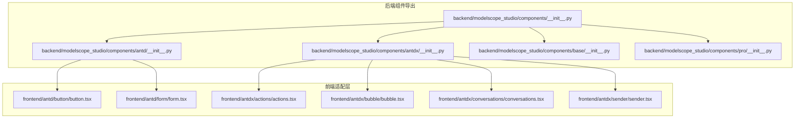
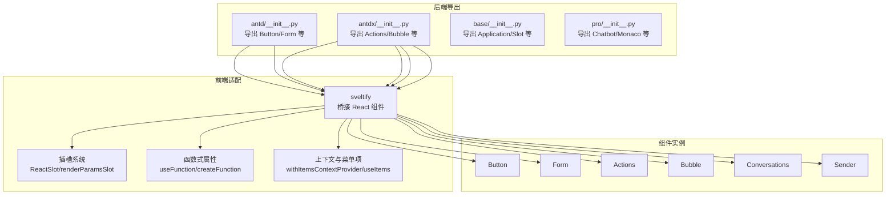
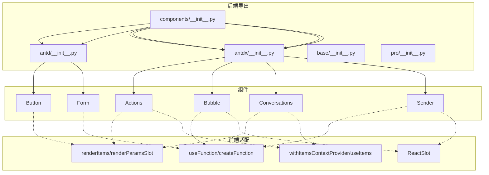

# Ant Design X 组件 API

<cite>
**本文引用的文件**
- [backend/modelscope_studio/components/__init__.py](file://backend/modelscope_studio/components/__init__.py)
- [backend/modelscope_studio/components/antd/__init__.py](file://backend/modelscope_studio/components/antd/__init__.py)
- [backend/modelscope_studio/components/antdx/__init__.py](file://backend/modelscope_studio/components/antdx/__init__.py)
- [backend/modelscope_studio/components/base/__init__.py](file://backend/modelscope_studio/components/base/__init__.py)
- [backend/modelscope_studio/components/pro/__init__.py](file://backend/modelscope_studio/components/pro/__init__.py)
- [frontend/antd/button/button.tsx](file://frontend/antd/button/button.tsx)
- [frontend/antd/form/form.tsx](file://frontend/antd/form/form.tsx)
- [frontend/antdx/actions/actions.tsx](file://frontend/antdx/actions/actions.tsx)
- [frontend/antdx/bubble/bubble.tsx](file://frontend/antdx/bubble/bubble.tsx)
- [frontend/antdx/conversations/conversations.tsx](file://frontend/antdx/conversations/conversations.tsx)
- [frontend/antdx/sender/sender.tsx](file://frontend/antdx/sender/sender.tsx)
</cite>

## 目录

1. [简介](#简介)
2. [项目结构](#项目结构)
3. [核心组件](#核心组件)
4. [架构总览](#架构总览)
5. [组件详解](#组件详解)
6. [依赖关系分析](#依赖关系分析)
7. [性能考量](#性能考量)
8. [故障排查指南](#故障排查指南)
9. [结论](#结论)
10. [附录](#附录)

## 简介

本文件为 ModelScope Studio 中基于 Ant Design X 的 Svelte 组件 API 参考文档，覆盖以下组件族：

- 通用组件：来自 Ant Design（antd）的常用 UI 组件封装
- 唤醒组件：用于引导用户交互、提示或触发流程的组件
- 表达组件：用于内容展示、富文本、对话气泡等表达类组件
- 确认组件：用于二次确认、弹窗确认等交互组件
- 反馈组件：用于消息、通知、进度、结果等反馈类组件
- 工具组件：用于表单、布局、工具栏、上下文等辅助能力

文档重点记录各组件的属性定义、事件处理函数、插槽系统、状态管理与消息传递、对话流程控制机制，并给出面向 AI/ML 场景的使用模式与最佳实践。

## 项目结构

ModelScope Studio 的前端采用 Svelte + Ant Design X 的组合，通过统一的适配层将 React 组件桥接到 Svelte 生态中。后端 Python 层负责导出组件集合，便于在应用中按需引入。

**图示来源**

- [backend/modelscope_studio/components/**init**.py:1-5](file://backend/modelscope_studio/components/__init__.py#L1-L5)
- [backend/modelscope_studio/components/antd/**init**.py:1-151](file://backend/modelscope_studio/components/antd/__init__.py#L1-L151)
- [backend/modelscope_studio/components/antdx/**init**.py:1-42](file://backend/modelscope_studio/components/antdx/__init__.py#L1-L42)
- [frontend/antd/button/button.tsx:1-39](file://frontend/antd/button/button.tsx#L1-L39)
- [frontend/antd/form/form.tsx:1-79](file://frontend/antd/form/form.tsx#L1-L79)
- [frontend/antdx/actions/actions.tsx:1-123](file://frontend/antdx/actions/actions.tsx#L1-L123)
- [frontend/antdx/bubble/bubble.tsx:1-119](file://frontend/antdx/bubble/bubble.tsx#L1-L119)
- [frontend/antdx/conversations/conversations.tsx:1-178](file://frontend/antdx/conversations/conversations.tsx#L1-L178)
- [frontend/antdx/sender/sender.tsx:1-174](file://frontend/antdx/sender/sender.tsx#L1-L174)

**章节来源**

- [backend/modelscope_studio/components/**init**.py:1-5](file://backend/modelscope_studio/components/__init__.py#L1-L5)
- [backend/modelscope_studio/components/antd/**init**.py:1-151](file://backend/modelscope_studio/components/antd/__init__.py#L1-L151)
- [backend/modelscope_studio/components/antdx/**init**.py:1-42](file://backend/modelscope_studio/components/antdx/__init__.py#L1-L42)
- [backend/modelscope_studio/components/base/**init**.py:1-11](file://backend/modelscope_studio/components/base/__init__.py#L1-L11)
- [backend/modelscope_studio/components/pro/**init**.py:1-7](file://backend/modelscope_studio/components/pro/__init__.py#L1-L7)

## 核心组件

本节概述各组件族的关键职责与典型用法，便于快速定位与选型。

- 通用组件（Antd）
  - 职责：提供基础 UI 能力，如按钮、输入框、表单、布局、消息、通知等
  - 典型组件：Button、Form、Input、Modal、Message、Notification 等
  - 特性：通过适配器将 Ant Design 的 React 组件桥接为 Svelte 组件，支持插槽与函数式属性

- 唤醒组件（AntdX）
  - 职责：引导用户进行下一步操作，如动作菜单、提示、技能开关等
  - 典型组件：Actions、Sender、Suggestion、Welcome 等
  - 特性：支持复杂插槽、上下文注入、事件透传与值变更联动

- 表达组件（AntdX）
  - 职责：用于内容表达与对话呈现，如气泡、思维链、文件卡片、附件等
  - 典型组件：Bubble、ThoughtChain、FileCard、Attachments、Prompts 等
  - 特性：支持渲染函数、可编辑配置、头尾部与额外区域插槽

- 确认组件（AntdX）
  - 职责：用于二次确认、弹窗确认等交互
  - 典型组件：Popconfirm、Modal（静态）、Tour 等
  - 特性：与 AntdX 的交互语义一致，保持一致的插槽与事件模型

- 反馈组件（AntdX）
  - 职责：消息、通知、进度、结果等反馈
  - 典型组件：Message、Notification、Progress、Result 等
  - 特性：支持插槽化渲染、函数式回调、状态驱动更新

- 工具组件（AntdX）
  - 职责：表单、布局、上下文、应用容器等辅助能力
  - 典型组件：Form、Layout、XProvider、Markdown、Slot 等
  - 特性：提供上下文、渲染工具函数与插槽系统

**章节来源**

- [frontend/antd/button/button.tsx:1-39](file://frontend/antd/button/button.tsx#L1-L39)
- [frontend/antd/form/form.tsx:1-79](file://frontend/antd/form/form.tsx#L1-L79)
- [frontend/antdx/actions/actions.tsx:1-123](file://frontend/antdx/actions/actions.tsx#L1-L123)
- [frontend/antdx/bubble/bubble.tsx:1-119](file://frontend/antdx/bubble/bubble.tsx#L1-L119)
- [frontend/antdx/conversations/conversations.tsx:1-178](file://frontend/antdx/conversations/conversations.tsx#L1-L178)
- [frontend/antdx/sender/sender.tsx:1-174](file://frontend/antdx/sender/sender.tsx#L1-L174)

## 架构总览

下图展示了从后端组件导出到前端适配层再到具体组件的映射关系，以及插槽与函数式属性的处理路径。

**图示来源**

- [backend/modelscope_studio/components/antd/**init**.py:1-151](file://backend/modelscope_studio/components/antd/__init__.py#L1-L151)
- [backend/modelscope_studio/components/antdx/**init**.py:1-42](file://backend/modelscope_studio/components/antdx/__init__.py#L1-L42)
- [backend/modelscope_studio/components/base/**init**.py:1-11](file://backend/modelscope_studio/components/base/__init__.py#L1-L11)
- [backend/modelscope_studio/components/pro/**init**.py:1-7](file://backend/modelscope_studio/components/pro/__init__.py#L1-L7)
- [frontend/antd/button/button.tsx:1-39](file://frontend/antd/button/button.tsx#L1-L39)
- [frontend/antd/form/form.tsx:1-79](file://frontend/antd/form/form.tsx#L1-L79)
- [frontend/antdx/actions/actions.tsx:1-123](file://frontend/antdx/actions/actions.tsx#L1-L123)
- [frontend/antdx/bubble/bubble.tsx:1-119](file://frontend/antdx/bubble/bubble.tsx#L1-L119)
- [frontend/antdx/conversations/conversations.tsx:1-178](file://frontend/antdx/conversations/conversations.tsx#L1-L178)
- [frontend/antdx/sender/sender.tsx:1-174](file://frontend/antdx/sender/sender.tsx#L1-L174)

## 组件详解

### 通用组件 API（Antd）

#### Button（按钮）

- 作用：将 Ant Design 的 Button 桥接为 Svelte 组件，支持插槽与加载态图标插槽
- 关键点
  - 插槽：icon、loading.icon
  - 值绑定：支持 value 与 children 的智能选择
  - 加载态：loading 支持传入对象并可指定延迟
- 使用要点
  - 当存在插槽时优先使用插槽渲染，否则回退到属性值
  - 通过 useTargets 处理 children 的目标节点

**章节来源**

- [frontend/antd/button/button.tsx:1-39](file://frontend/antd/button/button.tsx#L1-L39)

#### Form（表单）

- 作用：将 Ant Design 的 Form 桥接为 Svelte 组件，提供受控值与动作同步
- 关键点
  - 受控值：value 与 onValueChange
  - 动作同步：formAction（reset/submit/validate）与 onResetFormAction
  - 插槽：requiredMark
  - 回调：onValuesChange
- 使用要点
  - 通过 useEffect 根据 formAction 执行重置/提交/校验
  - 将外部 value 同步到内部 form 实例

**章节来源**

- [frontend/antd/form/form.tsx:1-79](file://frontend/antd/form/form.tsx#L1-L79)

### 唤醒组件 API（AntdX）

#### Actions（动作菜单）

- 作用：将 AntdX 的 Actions 桥接为 Svelte 组件，支持菜单项与下拉渲染插槽
- 关键点
  - 插槽：dropdownProps.menu.items、dropdownProps.menu.expandIcon、dropdownProps.menu.overflowedIndicator、dropdownProps.dropdownRender、dropdownProps.popupRender
  - 上下文：与菜单项上下文集成，支持 items/default 插槽
  - 渲染：renderItems、renderParamsSlot、createFunction
- 使用要点
  - 优先使用插槽中的 items，否则回退到属性 items
  - 对下拉渲染与菜单项进行条件性替换

**章节来源**

- [frontend/antdx/actions/actions.tsx:1-123](file://frontend/antdx/actions/actions.tsx#L1-L123)

#### Sender（发送器）

- 作用：AntdX Sender 的 Svelte 适配，支持上传、粘贴文件、建议上下文、插槽化头部/尾部等
- 关键点
  - 插槽：suffix、header、prefix、footer、skill.\* 系列
  - 事件：onSubmit（在建议未打开时触发）、onChange、onPasteFile
  - 值变更：onValueChange 与 useValueChange
  - 上传：upload 函数返回文件数据数组
- 使用要点
  - 在粘贴文件时调用 upload 并回传路径
  - 通过 slotConfig 格式化结果与自定义渲染

**章节来源**

- [frontend/antdx/sender/sender.tsx:1-174](file://frontend/antdx/sender/sender.tsx#L1-L174)

### 表达组件 API（AntdX）

#### Bubble（气泡）

- 作用：AntdX Bubble 的 Svelte 适配，支持头/体/脚/额外区域与可编辑配置
- 关键点
  - 插槽：avatar、editable.okText、editable.cancelText、content、footer、header、extra、loadingRender、contentRender
  - 函数：typing、contentRender、header/footer/avatar/extra、editable
- 使用要点
  - 支持布尔 editable 或对象配置；当插槽存在时优先使用插槽
  - 通过 useFunction 将属性转换为函数式渲染

**章节来源**

- [frontend/antdx/bubble/bubble.tsx:1-119](file://frontend/antdx/bubble/bubble.tsx#L1-L119)

#### Conversations（会话列表）

- 作用：AntdX Conversations 的 Svelte 适配，支持分组、菜单、插槽化标签等
- 关键点
  - 插槽：menu.trigger、menu.expandIcon、menu.overflowedIndicator、groupable.label
  - 上下文：菜单项上下文与会话项上下文
  - 渲染：renderItems、patchMenuEvents（事件透传）
- 使用要点
  - 支持字符串或对象形式的 menu 配置；当无 items 时自动回退
  - 通过 classNames 注入样式类名

**章节来源**

- [frontend/antdx/conversations/conversations.tsx:1-178](file://frontend/antdx/conversations/conversations.tsx#L1-L178)

### 确认组件 API（AntdX）

- Popconfirm：二次确认弹窗，支持插槽化标题与描述
- Modal（静态）：静态模态框，适合固定内容展示
- Tour：引导漫游，支持步骤与插槽化渲染

[本节为概念性说明，不直接分析具体文件]

### 反馈组件 API（AntdX）

- Message：消息提示，支持插槽化内容与函数式渲染
- Notification：通知提醒，支持插槽化渲染与关闭回调
- Progress：进度条，支持插槽化格式化
- Result：结果页，支持插槽化操作区

[本节为概念性说明，不直接分析具体文件]

### 工具组件 API（AntdX）

- Form：见“通用组件”小节
- Layout：布局容器，支持 Content/Footer/Header/Sider
- XProvider：上下文提供者，为 AntdX 组件提供全局配置
- Markdown：Markdown 渲染组件
- Slot：插槽容器，用于动态内容挂载

**章节来源**

- [backend/modelscope_studio/components/antdx/**init**.py:1-42](file://backend/modelscope_studio/components/antdx/__init__.py#L1-L42)
- [backend/modelscope_studio/components/base/**init**.py:1-11](file://backend/modelscope_studio/components/base/__init__.py#L1-L11)

## 依赖关系分析

**图示来源**

- [backend/modelscope_studio/components/**init**.py:1-5](file://backend/modelscope_studio/components/__init__.py#L1-L5)
- [backend/modelscope_studio/components/antd/**init**.py:1-151](file://backend/modelscope_studio/components/antd/__init__.py#L1-L151)
- [backend/modelscope_studio/components/antdx/**init**.py:1-42](file://backend/modelscope_studio/components/antdx/__init__.py#L1-L42)
- [frontend/antd/button/button.tsx:1-39](file://frontend/antd/button/button.tsx#L1-L39)
- [frontend/antd/form/form.tsx:1-79](file://frontend/antd/form/form.tsx#L1-L79)
- [frontend/antdx/actions/actions.tsx:1-123](file://frontend/antdx/actions/actions.tsx#L1-L123)
- [frontend/antdx/bubble/bubble.tsx:1-119](file://frontend/antdx/bubble/bubble.tsx#L1-L119)
- [frontend/antdx/conversations/conversations.tsx:1-178](file://frontend/antdx/conversations/conversations.tsx#L1-L178)
- [frontend/antdx/sender/sender.tsx:1-174](file://frontend/antdx/sender/sender.tsx#L1-L174)

**章节来源**

- [backend/modelscope_studio/components/**init**.py:1-5](file://backend/modelscope_studio/components/__init__.py#L1-L5)
- [frontend/antd/button/button.tsx:1-39](file://frontend/antd/button/button.tsx#L1-L39)
- [frontend/antd/form/form.tsx:1-79](file://frontend/antd/form/form.tsx#L1-L79)
- [frontend/antdx/actions/actions.tsx:1-123](file://frontend/antdx/actions/actions.tsx#L1-L123)
- [frontend/antdx/bubble/bubble.tsx:1-119](file://frontend/antdx/bubble/bubble.tsx#L1-L119)
- [frontend/antdx/conversations/conversations.tsx:1-178](file://frontend/antdx/conversations/conversations.tsx#L1-L178)
- [frontend/antdx/sender/sender.tsx:1-174](file://frontend/antdx/sender/sender.tsx#L1-L174)

## 性能考量

- 插槽与函数式属性的懒渲染
  - 仅在插槽存在时才渲染对应内容，避免不必要的计算
  - 使用 useMemo 包裹菜单与渲染逻辑，减少重复渲染
- 受控值与动作同步
  - 通过 useEffect 根据 formAction 触发 reset/submit/validate，避免频繁重绘
  - 使用 useValueChange 管理输入值变更，降低上游抖动
- 事件透传与防抖
  - 在菜单事件中对 onClick 进行 DOM 事件冒泡阻止，避免意外触发
  - 对函数式属性使用 useMemoizedFn 缓存回调

[本节为通用指导，不直接分析具体文件]

## 故障排查指南

- 插槽未生效
  - 检查插槽键名是否与组件约定一致（如 menu.items、dropdownRender 等）
  - 确认插槽是否被 children 隐藏或未正确传递
- 值未同步
  - 对于 Form：确认 value 是否正确传入且 onValueChange 是否被触发
  - 对于 Sender：确认 onValueChange 与 useValueChange 的绑定
- 下拉菜单不显示
  - 检查 dropdownProps 与 menu.items 是否正确设置
  - 确认 withItemsContextProvider 是否包裹组件
- 上传失败
  - 确认 upload 函数返回值包含 path 字段
  - 检查 onPasteFile 的回传路径是否正确

**章节来源**

- [frontend/antd/form/form.tsx:32-53](file://frontend/antd/form/form.tsx#L32-L53)
- [frontend/antdx/sender/sender.tsx:135-138](file://frontend/antdx/sender/sender.tsx#L135-L138)
- [frontend/antdx/actions/actions.tsx:39-96](file://frontend/antdx/actions/actions.tsx#L39-L96)

## 结论

本文档梳理了 ModelScope Studio 中 Ant Design X Svelte 组件的 API 与使用模式，重点覆盖了插槽系统、函数式属性、上下文与菜单项集成、值变更与动作同步等关键机制。结合 AI/ML 场景，推荐优先使用 Sender、Bubble、Conversations、Actions 等组件构建对话与表达流程，并通过插槽与函数式属性实现高度定制化的内容渲染与交互行为。

## 附录

### 组件实例化与配置（AI/ML 场景建议）

- 对话流程
  - 使用 Sender 作为输入入口，配置 upload 以支持多模态输入
  - 使用 Bubble 渲染回复内容，必要时启用 editable 以支持二次编辑
  - 使用 Conversations 管理会话列表，配合 menu 与 groupable 实现分组与操作
- 表单与验证
  - 使用 Form 提供受控值与动作同步，结合 reset/submit/validate 控制流程
- 动作与引导
  - 使用 Actions 提供上下文菜单与引导项，结合插槽实现自定义渲染

[本节为概念性说明，不直接分析具体文件]
