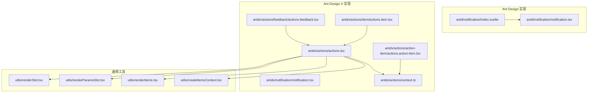
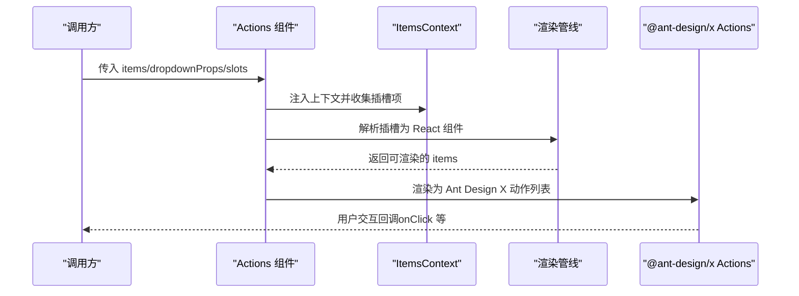
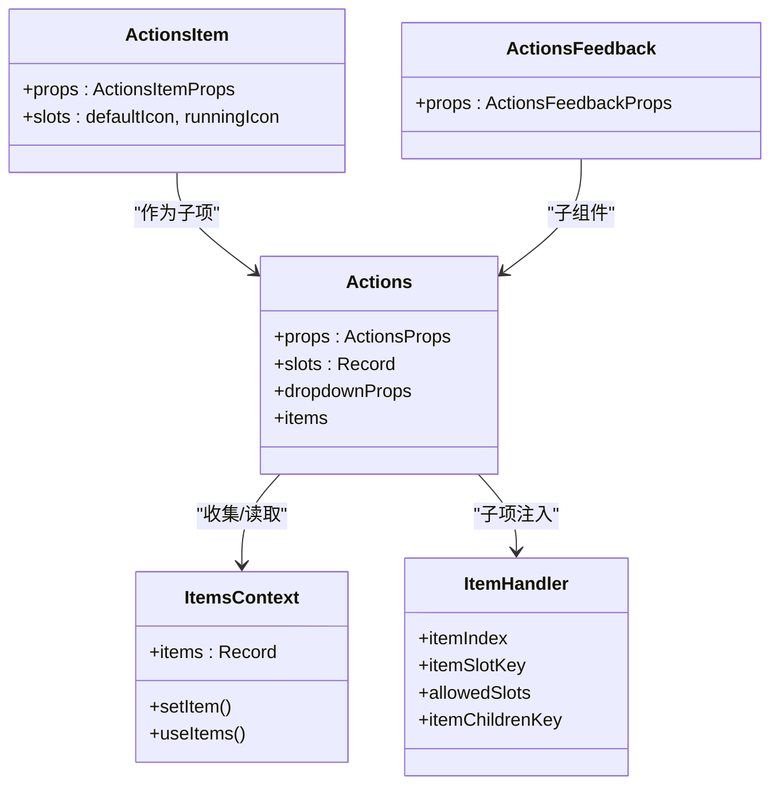
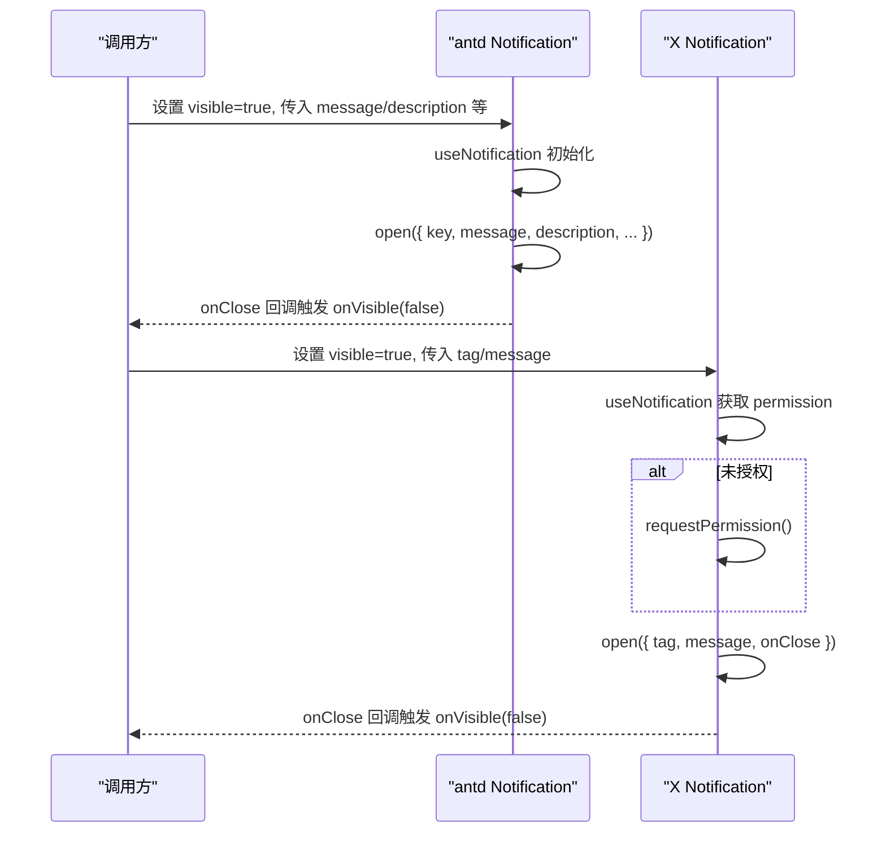
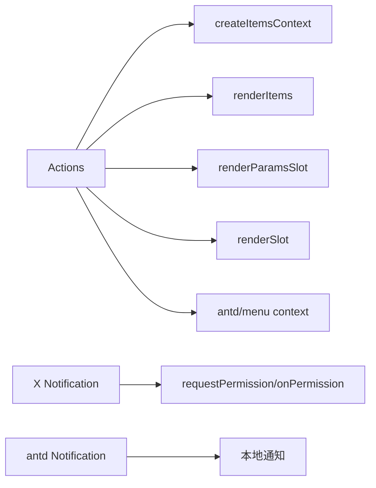

# 反馈组件 API

<cite>
**本文引用的文件**
- [frontend/antd/notification/notification.tsx](file://frontend/antd/notification/notification.tsx)
- [frontend/antd/notification/Index.svelte](file://frontend/antd/notification/Index.svelte)
- [frontend/antdx/notification/notification.tsx](file://frontend/antdx/notification/notification.tsx)
- [frontend/antdx/actions/actions.tsx](file://frontend/antdx/actions/actions.tsx)
- [frontend/antdx/actions/context.ts](file://frontend/antdx/actions/context.ts)
- [frontend/antdx/actions/feedback/actions.feedback.tsx](file://frontend/antdx/actions/feedback/actions.feedback.tsx)
- [frontend/antdx/actions/action-item/actions.action-item.tsx](file://frontend/antdx/actions/action-item/actions.action-item.tsx)
- [frontend/antdx/actions/item/actions.item.tsx](file://frontend/antdx/actions/item/actions.item.tsx)
- [frontend/utils/createItemsContext.tsx](file://frontend/utils/createItemsContext.tsx)
- [frontend/utils/renderItems.tsx](file://frontend/utils/renderItems.tsx)
- [frontend/utils/renderParamsSlot.tsx](file://frontend/utils/renderParamsSlot.tsx)
- [frontend/utils/renderSlot.tsx](file://frontend/utils/renderSlot.tsx)
</cite>

## 目录

1. [简介](#简介)
2. [项目结构](#项目结构)
3. [核心组件](#核心组件)
4. [架构总览](#架构总览)
5. [详细组件分析](#详细组件分析)
6. [依赖关系分析](#依赖关系分析)
7. [性能考量](#性能考量)
8. [故障排查指南](#故障排查指南)
9. [结论](#结论)
10. [附录](#附录)

## 简介

本文件为 ModelScope Studio 中 Ant Design X 的反馈组件 API 参考文档，聚焦两类反馈能力：

- Actions 操作列表组件：用于在对话或工作流中提供可点击的操作项集合，并支持下拉菜单、子项、图标等扩展。
- Notification 通知组件：用于全局提示消息与浏览器原生通知权限管理，覆盖 Ant Design 与 Ant Design X 两套实现。

文档将从接口定义、数据结构、事件与状态管理、用户交互机制、类型规范与最佳实践等方面进行系统阐述，并给出面向 AI 应用的典型使用场景与配置建议。

## 项目结构

反馈组件主要分布在以下路径：

- 前端 Ant Design 实现：frontend/antd/notification
- 前端 Ant Design X 实现：frontend/antdx/notification 与 frontend/antdx/actions
- 通用工具：frontend/utils 下的 items 上下文与渲染工具

图表来源

- [frontend/antd/notification/notification.tsx:1-106](file://frontend/antd/notification/notification.tsx#L1-L106)
- [frontend/antd/notification/Index.svelte:56-79](file://frontend/antd/notification/Index.svelte#L56-L79)
- [frontend/antdx/notification/notification.tsx:1-51](file://frontend/antdx/notification/notification.tsx#L1-L51)
- [frontend/antdx/actions/actions.tsx:1-123](file://frontend/antdx/actions/actions.tsx#L1-L123)
- [frontend/antdx/actions/context.ts:1-7](file://frontend/antdx/actions/context.ts#L1-L7)
- [frontend/antdx/actions/feedback/actions.feedback.tsx:1-16](file://frontend/antdx/actions/feedback/actions.feedback.tsx#L1-L16)
- [frontend/antdx/actions/action-item/actions.action-item.tsx:1-23](file://frontend/antdx/actions/action-item/actions.action-item.tsx#L1-L23)
- [frontend/antdx/actions/item/actions.item.tsx:1-34](file://frontend/antdx/actions/item/actions.item.tsx#L1-L34)
- [frontend/utils/createItemsContext.tsx:1-274](file://frontend/utils/createItemsContext.tsx#L1-L274)
- [frontend/utils/renderItems.tsx:1-114](file://frontend/utils/renderItems.tsx#L1-L114)
- [frontend/utils/renderParamsSlot.tsx:1-51](file://frontend/utils/renderParamsSlot.tsx#L1-L51)
- [frontend/utils/renderSlot.tsx:1-29](file://frontend/utils/renderSlot.tsx#L1-L29)

章节来源

- [frontend/antd/notification/notification.tsx:1-106](file://frontend/antd/notification/notification.tsx#L1-L106)
- [frontend/antd/notification/Index.svelte:56-79](file://frontend/antd/notification/Index.svelte#L56-L79)
- [frontend/antdx/notification/notification.tsx:1-51](file://frontend/antdx/notification/notification.tsx#L1-L51)
- [frontend/antdx/actions/actions.tsx:1-123](file://frontend/antdx/actions/actions.tsx#L1-L123)
- [frontend/antdx/actions/context.ts:1-7](file://frontend/antdx/actions/context.ts#L1-L7)
- [frontend/antdx/actions/feedback/actions.feedback.tsx:1-16](file://frontend/antdx/actions/feedback/actions.feedback.tsx#L1-L16)
- [frontend/antdx/actions/action-item/actions.action-item.tsx:1-23](file://frontend/antdx/actions/action-item/actions.action-item.tsx#L1-L23)
- [frontend/antdx/actions/item/actions.item.tsx:1-34](file://frontend/antdx/actions/item/actions.item.tsx#L1-L34)
- [frontend/utils/createItemsContext.tsx:1-274](file://frontend/utils/createItemsContext.tsx#L1-L274)
- [frontend/utils/renderItems.tsx:1-114](file://frontend/utils/renderItems.tsx#L1-L114)
- [frontend/utils/renderParamsSlot.tsx:1-51](file://frontend/utils/renderParamsSlot.tsx#L1-L51)
- [frontend/utils/renderSlot.tsx:1-29](file://frontend/utils/renderSlot.tsx#L1-L29)

## 核心组件

- Actions 操作列表组件
  - 负责渲染一组可交互的操作项，支持下拉菜单、子项、图标插槽与菜单项上下文注入。
  - 提供 Actions.Feedback 子组件以适配特定反馈场景。
- Notification 通知组件
  - Ant Design 版本：基于 antd.notification.useNotification，支持可见性控制与插槽渲染。
  - Ant Design X 版本：基于 @ant-design/x/notification，内置浏览器通知权限请求与按 tag 关闭能力。

章节来源

- [frontend/antdx/actions/actions.tsx:1-123](file://frontend/antdx/actions/actions.tsx#L1-L123)
- [frontend/antdx/actions/feedback/actions.feedback.tsx:1-16](file://frontend/antdx/actions/feedback/actions.feedback.tsx#L1-L16)
- [frontend/antd/notification/notification.tsx:1-106](file://frontend/antd/notification/notification.tsx#L1-L106)
- [frontend/antdx/notification/notification.tsx:1-51](file://frontend/antdx/notification/notification.tsx#L1-L51)

## 架构总览

反馈组件的运行时架构由“组件桥接层 + 通知/动作库 + 渲染管线”构成：

- 组件桥接层：通过 sveltify 将 Svelte 组件包装为 React 组件，统一对外暴露属性与插槽。
- 通知/动作库：分别对接 antd 与 @ant-design/x 的通知与动作能力。
- 渲染管线：利用 createItemsContext 与 renderItems 等工具，将插槽中的 DOM 节点转换为 React 组件树，支持参数化插槽与克隆策略。

图表来源

- [frontend/antdx/actions/actions.tsx:17-120](file://frontend/antdx/actions/actions.tsx#L17-L120)
- [frontend/utils/createItemsContext.tsx:97-274](file://frontend/utils/createItemsContext.tsx#L97-L274)
- [frontend/utils/renderItems.tsx:8-114](file://frontend/utils/renderItems.tsx#L8-L114)

## 详细组件分析

### Actions 操作列表组件 API

- 组件名称：Actions
- 外观形态：Ant Design X 的 Actions 组件，支持下拉菜单与多级子项。
- 关键属性（部分）：
  - items：操作项数组，支持默认插槽与子项插槽。
  - dropdownProps：透传给下拉菜单的配置，包括 dropdownRender、popupRender、menu 等。
  - slots：插槽映射，支持 menu.expandIcon、menu.overflowedIndicator、menu.items 等。
- 插槽与上下文：
  - 使用 createItemsContext 维护“default”与“items”等插槽项集合。
  - 通过 ItemHandler 将子节点写入上下文，支持 itemProps、itemChildren 等动态计算。
- 渲染流程：
  - 合并外部 items 与插槽解析结果，生成最终的菜单项。
  - 对 dropdownRender/popupRender 与菜单项进行参数化插槽渲染。
- 典型子组件：
  - Actions.Feedback：直接转发 @ant-design/x 的 Actions.Feedback。
  - Actions.Item：封装默认图标与运行中图标的插槽。
  - ActionsActionItem：作为 ItemHandler 的便捷包装，限定允许的插槽键。

图表来源

- [frontend/antdx/actions/actions.tsx:17-120](file://frontend/antdx/actions/actions.tsx#L17-L120)
- [frontend/antdx/actions/item/actions.item.tsx:6-34](file://frontend/antdx/actions/item/actions.item.tsx#L6-L34)
- [frontend/antdx/actions/feedback/actions.feedback.tsx:5-16](file://frontend/antdx/actions/feedback/actions.feedback.tsx#L5-L16)
- [frontend/antdx/actions/context.ts:3-4](file://frontend/antdx/actions/context.ts#L3-L4)
- [frontend/antdx/actions/action-item/actions.action-item.tsx:7-20](file://frontend/antdx/actions/action-item/actions.action-item.tsx#L7-L20)

章节来源

- [frontend/antdx/actions/actions.tsx:1-123](file://frontend/antdx/actions/actions.tsx#L1-L123)
- [frontend/antdx/actions/context.ts:1-7](file://frontend/antdx/actions/context.ts#L1-L7)
- [frontend/antdx/actions/feedback/actions.feedback.tsx:1-16](file://frontend/antdx/actions/feedback/actions.feedback.tsx#L1-L16)
- [frontend/antdx/actions/action-item/actions.action-item.tsx:1-23](file://frontend/antdx/actions/action-item/actions.action-item.tsx#L1-L23)
- [frontend/antdx/actions/item/actions.item.tsx:1-34](file://frontend/antdx/actions/item/actions.item.tsx#L1-L34)
- [frontend/utils/createItemsContext.tsx:20-95](file://frontend/utils/createItemsContext.tsx#L20-L95)
- [frontend/utils/renderItems.tsx:8-114](file://frontend/utils/renderItems.tsx#L8-L114)
- [frontend/utils/renderParamsSlot.tsx:5-51](file://frontend/utils/renderParamsSlot.tsx#L5-L51)
- [frontend/utils/renderSlot.tsx:13-29](file://frontend/utils/renderSlot.tsx#L13-L29)

### Notification 通知组件 API

- Ant Design 版本（antd/notification）
  - 属性要点：
    - visible：是否显示通知。
    - onVisible：关闭时回调，用于同步 visible 状态。
    - notificationKey：唯一标识，用于 destroy/open。
    - 支持插槽：btn、actions、closeIcon、description、icon、message。
  - 行为机制：
    - visible 为真时调用 open；否则 destroy。
    - onClose 回调中先触发 onVisible(false)，再执行用户自定义 onClose。
- Ant Design X 版本（@ant-design/x/notification）
  - 属性要点：
    - visible：是否显示通知。
    - onVisible：关闭时回调。
    - onPermission：浏览器通知权限变化回调。
    - tag：通知标签，用于按 tag 关闭。
  - 行为机制：
    - 首次显示前若未授权则请求权限，仅在 granted 时 open。
    - visible 为真时 open，否则 close(tag)。
    - 组件卸载时自动关闭对应 tag 的通知。

图表来源

- [frontend/antd/notification/notification.tsx:38-95](file://frontend/antd/notification/notification.tsx#L38-L95)
- [frontend/antdx/notification/notification.tsx:17-46](file://frontend/antdx/notification/notification.tsx#L17-L46)

章节来源

- [frontend/antd/notification/notification.tsx:1-106](file://frontend/antd/notification/notification.tsx#L1-L106)
- [frontend/antd/notification/Index.svelte:56-79](file://frontend/antd/notification/Index.svelte#L56-L79)
- [frontend/antdx/notification/notification.tsx:1-51](file://frontend/antdx/notification/notification.tsx#L1-L51)

## 依赖关系分析

- Actions 与渲染工具链
  - Actions 依赖 createItemsContext 维护插槽项集合。
  - 通过 renderItems 将插槽项转换为 React 组件树，支持 children 键与 itemPropsTransformer。
  - renderParamsSlot 与 renderSlot 支持带参插槽与克隆策略。
- Actions 与菜单上下文
  - 与 antd/menu 的上下文配合，优先使用菜单上下文提供的 dropdownProps.menu.items。
- Notification 与权限
  - X 版本内置权限请求与回调，避免重复请求。
  - ANTD 版本不涉及浏览器权限，仅本地通知。

图表来源

- [frontend/antdx/actions/actions.tsx:10-15](file://frontend/antdx/actions/actions.tsx#L10-L15)
- [frontend/utils/createItemsContext.tsx:97-274](file://frontend/utils/createItemsContext.tsx#L97-L274)
- [frontend/utils/renderItems.tsx:8-114](file://frontend/utils/renderItems.tsx#L8-L114)
- [frontend/utils/renderParamsSlot.tsx:5-51](file://frontend/utils/renderParamsSlot.tsx#L5-L51)
- [frontend/utils/renderSlot.tsx:13-29](file://frontend/utils/renderSlot.tsx#L13-L29)
- [frontend/antdx/notification/notification.tsx:13-19](file://frontend/antdx/notification/notification.tsx#L13-L19)

章节来源

- [frontend/antdx/actions/actions.tsx:1-123](file://frontend/antdx/actions/actions.tsx#L1-L123)
- [frontend/utils/createItemsContext.tsx:1-274](file://frontend/utils/createItemsContext.tsx#L1-L274)
- [frontend/utils/renderItems.tsx:1-114](file://frontend/utils/renderItems.tsx#L1-L114)
- [frontend/utils/renderParamsSlot.tsx:1-51](file://frontend/utils/renderParamsSlot.tsx#L1-L51)
- [frontend/utils/renderSlot.tsx:1-29](file://frontend/utils/renderSlot.tsx#L1-L29)
- [frontend/antdx/notification/notification.tsx:1-51](file://frontend/antdx/notification/notification.tsx#L1-L51)

## 性能考量

- 插槽渲染优化
  - 使用 useMemo 包裹 dropdownProps 的修改，减少无效重渲染。
  - renderItems 支持 clone/forceClone 控制，避免不必要的 React 节点重建。
- 通知生命周期
  - ANTD：visible 切换时 destroy 对应 key，卸载时也销毁，避免内存泄漏。
  - X：visible=false 或卸载时按 tag 关闭，确保资源回收。
- 权限请求去抖
  - X 版本在首次打开前检查权限，避免重复请求。

章节来源

- [frontend/antdx/actions/actions.tsx:39-96](file://frontend/antdx/actions/actions.tsx#L39-L96)
- [frontend/antd/notification/notification.tsx:74-95](file://frontend/antd/notification/notification.tsx#L74-L95)
- [frontend/antdx/notification/notification.tsx:17-46](file://frontend/antdx/notification/notification.tsx#L17-L46)

## 故障排查指南

- Actions 无法显示子项
  - 检查插槽键是否正确：default 与 subItems 是否匹配 ItemHandler 的 itemChildrenKey。
  - 确认 allowedSlots 与 itemChildren 的返回值逻辑一致。
- 插槽未生效
  - 确认 slots 中的元素已正确传递到 ItemHandler 或 Actions 的 slots。
  - 若使用参数化插槽，确认 renderParamsSlot 的 targets 与 withParams 配置。
- 通知未显示
  - ANTD：确认 visible 为 true 且 notificationKey 唯一；onClose 中是否调用了 onVisible(false)。
  - X：确认浏览器通知权限为 granted；tag 是否正确传入；onClose 中是否调用了 onVisible(false)。
- 性能问题
  - 检查 dropdownProps 是否频繁变更；尽量复用对象引用或使用 useMemo。
  - 减少不必要的 clone，仅在必要时开启 forceClone。

章节来源

- [frontend/antdx/actions/action-item/actions.action-item.tsx:11-19](file://frontend/antdx/actions/action-item/actions.action-item.tsx#L11-L19)
- [frontend/antdx/actions/context.ts:3-4](file://frontend/antdx/actions/context.ts#L3-L4)
- [frontend/utils/renderParamsSlot.tsx:23-49](file://frontend/utils/renderParamsSlot.tsx#L23-L49)
- [frontend/antd/notification/notification.tsx:38-95](file://frontend/antd/notification/notification.tsx#L38-L95)
- [frontend/antdx/notification/notification.tsx:17-46](file://frontend/antdx/notification/notification.tsx#L17-L46)

## 结论

- Actions 通过插槽与上下文机制，将复杂 UI 结构转化为可组合、可扩展的操作列表，适合在 AI 应用中承载多步骤任务、多轮对话中的操作反馈。
- Notification 在 ANTD 与 X 两端提供了统一的可见性与生命周期管理，X 版本额外支持浏览器通知权限，满足更丰富的用户反馈需求。
- 建议在实际应用中结合业务语义选择合适的实现版本，并遵循插槽与上下文的最佳实践，以获得稳定与高性能的反馈体验。

## 附录

### 类型与接口要点（概要）

- Actions
  - ActionsProps：来自 @ant-design/x，包含 items、dropdownProps 等。
  - ActionsItemProps：Actions.Item 的属性集合。
  - ActionsFeedbackProps：Actions.Feedback 的属性集合。
- Notification
  - ANTD：ArgsProps 与 NotificationConfig，支持 visible、onVisible、插槽等。
  - X：XNotificationOpenArgs，支持 visible、onVisible、onPermission、tag 等。

章节来源

- [frontend/antdx/actions/actions.tsx:3-8](file://frontend/antdx/actions/actions.tsx#L3-L8)
- [frontend/antd/notification/notification.tsx:8-16](file://frontend/antd/notification/notification.tsx#L8-L16)
- [frontend/antdx/notification/notification.tsx:6-11](file://frontend/antdx/notification/notification.tsx#L6-L11)

### 使用场景与最佳实践（建议）

- AI 应用中的操作反馈
  - 使用 Actions.Feedback 快速挂载反馈类操作。
  - 使用 Actions.Item 自定义图标与文案，结合插槽实现动态文案与状态指示。
  - 对于多级菜单，使用 subItems 与 allowedSlots 管理层级结构。
- 通知时机控制
  - ANTD：通过 visible 精准控制显示/隐藏；对关键错误或成功状态使用短时通知。
  - X：在需要系统级提醒时启用，注意权限请求只在首次触发，避免频繁打扰。
- 状态同步
  - onClose 中统一设置 onVisible(false)，保证 UI 与状态一致。
  - 对批量关闭，使用 tag 或 key 进行精准定位。
