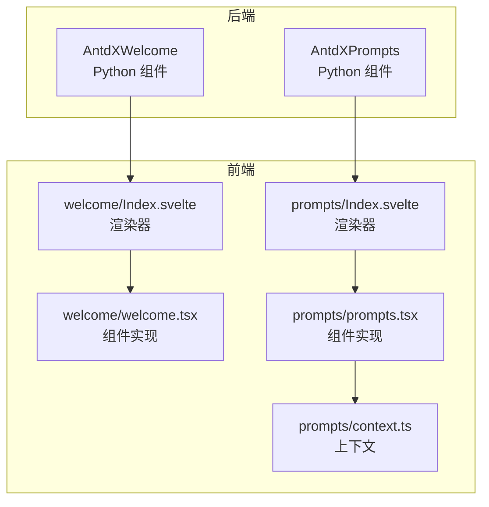
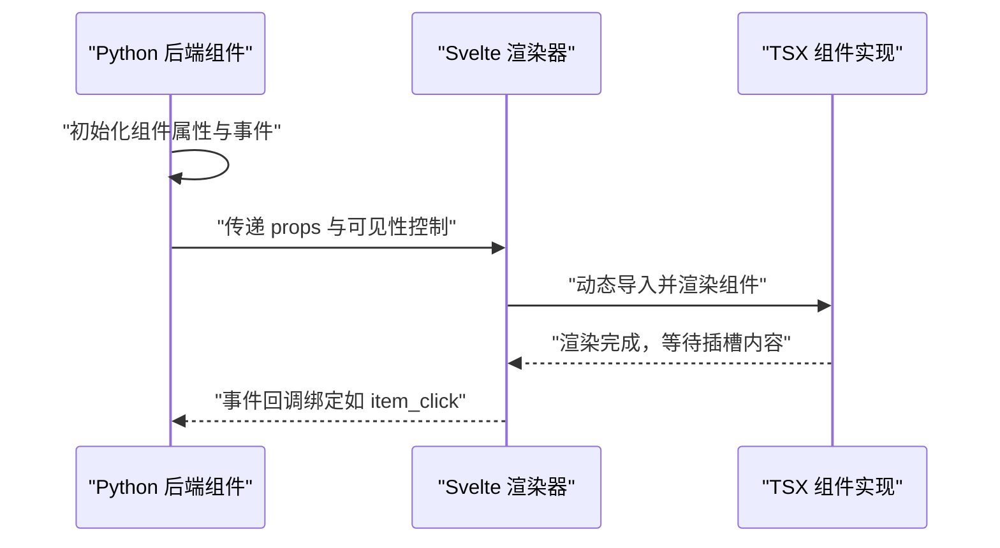
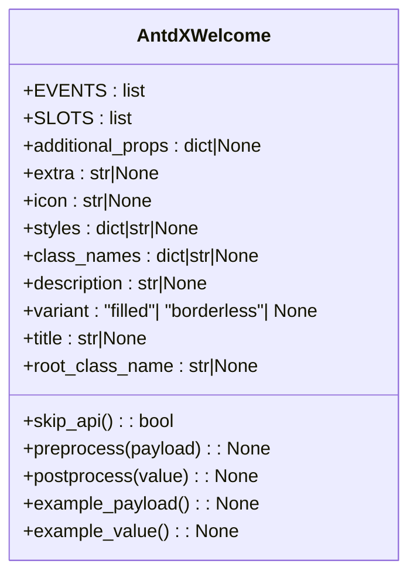
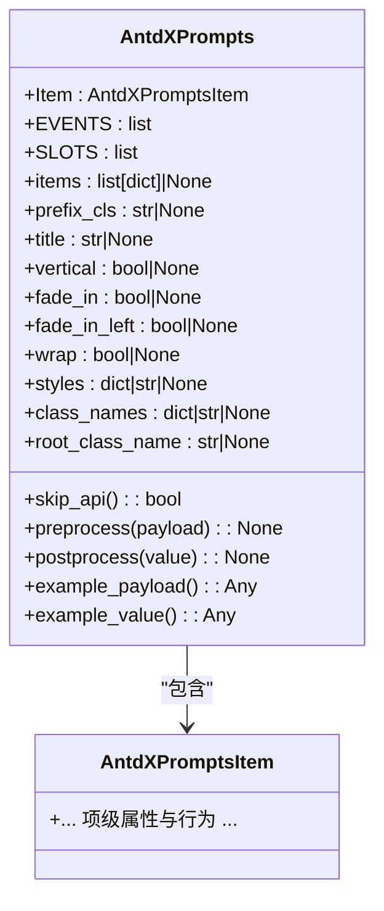
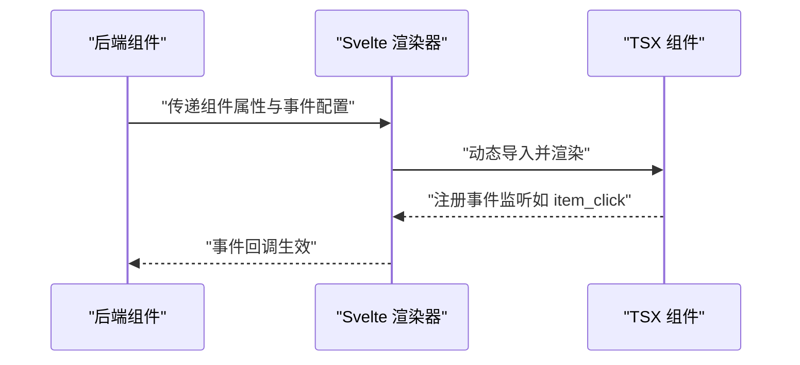
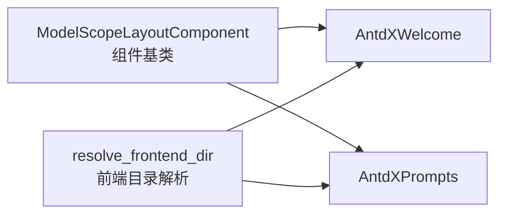

# 唤醒组件 API

<cite>
**本文引用的文件**
- [backend/modelscope_studio/components/antdx/welcome/__init__.py](file://backend/modelscope_studio/components/antdx/welcome/__init__.py)
- [backend/modelscope_studio/components/antdx/prompts/__init__.py](file://backend/modelscope_studio/components/antdx/prompts/__init__.py)
- [frontend/antdx/welcome/Index.svelte](file://frontend/antdx/welcome/Index.svelte)
- [frontend/antdx/welcome/welcome.tsx](file://frontend/antdx/welcome/welcome.tsx)
- [frontend/antdx/prompts/Index.svelte](file://frontend/antdx/prompts/Index.svelte)
- [frontend/antdx/prompts/prompts.tsx](file://frontend/antdx/prompts/prompts.tsx)
- [frontend/antdx/prompts/context.ts](file://frontend/antdx/prompts/context.ts)
- [backend/modelscope_studio/utils/dev/component.py](file://backend/modelscope_studio/utils/dev/component.py)
- [backend/modelscope_studio/utils/dev/resolve_frontend_dir.py](file://backend/modelscope_studio/utils/dev/resolve_frontend_dir.py)
</cite>

## 目录

1. [简介](#简介)
2. [项目结构](#项目结构)
3. [核心组件](#核心组件)
4. [架构总览](#架构总览)
5. [详细组件分析](#详细组件分析)
6. [依赖关系分析](#依赖关系分析)
7. [性能考虑](#性能考虑)
8. [故障排除指南](#故障排除指南)
9. [结论](#结论)
10. [附录](#附录)

## 简介

本文件为 ModelScope Studio 的 Ant Design X 唤醒组件 API 参考文档，聚焦以下两个组件：

- 欢迎组件（AntdXWelcome）：用于在应用首次加载或特定场景下展示欢迎信息，支持标题、描述、图标、额外内容等插槽化配置。
- 提示集组件（AntdXPrompts）：用于展示一组可点击的提示词卡片，支持标题、垂直布局、渐入动画、换行等配置，并提供项点击事件回调。

文档将从系统架构、组件关系、数据流、处理逻辑、集成点、错误处理与性能特性等方面进行深入解析，并提供生命周期钩子、事件处理、状态管理机制以及 TypeScript 类型定义与接口规范，帮助开发者在 AI 应用中实现流畅的首次体验与提示引导。

## 项目结构

ModelScope Studio 的前端采用 Svelte + Ant Design X 组件体系，后端通过 Python 组件桥接前端组件。唤醒与提示集组件分别位于 antdx 模块中，后端组件负责属性传递与事件绑定，前端组件负责渲染与交互。

**图表来源**

- [backend/modelscope_studio/components/antdx/welcome/**init**.py:8-73](file://backend/modelscope_studio/components/antdx/welcome/__init__.py#L8-L73)
- [backend/modelscope_studio/components/antdx/prompts/**init**.py:11-88](file://backend/modelscope_studio/components/antdx/prompts/__init__.py#L11-L88)
- [frontend/antdx/welcome/Index.svelte:1-72](file://frontend/antdx/welcome/Index.svelte#L1-L72)
- [frontend/antdx/welcome/welcome.tsx](file://frontend/antdx/welcome/welcome.tsx)
- [frontend/antdx/prompts/Index.svelte:1-71](file://frontend/antdx/prompts/Index.svelte#L1-L71)
- [frontend/antdx/prompts/prompts.tsx](file://frontend/antdx/prompts/prompts.tsx)
- [frontend/antdx/prompts/context.ts](file://frontend/antdx/prompts/context.ts)

**章节来源**

- [backend/modelscope_studio/components/antdx/welcome/**init**.py:1-73](file://backend/modelscope_studio/components/antdx/welcome/__init__.py#L1-L73)
- [backend/modelscope_studio/components/antdx/prompts/**init**.py:1-88](file://backend/modelscope_studio/components/antdx/prompts/__init__.py#L1-L88)
- [frontend/antdx/welcome/Index.svelte:1-72](file://frontend/antdx/welcome/Index.svelte#L1-L72)
- [frontend/antdx/prompts/Index.svelte:1-71](file://frontend/antdx/prompts/Index.svelte#L1-L71)

## 核心组件

本节概述两个组件的关键职责与能力边界：

- 欢迎组件（AntdXWelcome）
  - 职责：展示欢迎信息，支持多插槽（标题、描述、图标、额外内容），可选样式与变体。
  - 关键点：不暴露标准 API（skip_api 为真），通过插槽与静态资源路径注入实现。
- 提示集组件（AntdXPrompts）
  - 职责：展示一组提示词卡片，支持标题、垂直布局、渐入动画、换行等；提供项点击事件回调。
  - 关键点：内部嵌套项组件，事件绑定通过 EventListener 配置。

**章节来源**

- [backend/modelscope_studio/components/antdx/welcome/**init**.py:8-73](file://backend/modelscope_studio/components/antdx/welcome/__init__.py#L8-L73)
- [backend/modelscope_studio/components/antdx/prompts/**init**.py:11-88](file://backend/modelscope_studio/components/antdx/prompts/__init__.py#L11-L88)

## 架构总览

下图展示了从后端组件到前端渲染器再到具体组件实现的调用链路，以及事件绑定与插槽传递机制。

**图表来源**

- [backend/modelscope_studio/components/antdx/welcome/**init**.py:55-73](file://backend/modelscope_studio/components/antdx/welcome/__init__.py#L55-L73)
- [backend/modelscope_studio/components/antdx/prompts/**init**.py:70-88](file://backend/modelscope_studio/components/antdx/prompts/__init__.py#L70-L88)
- [frontend/antdx/welcome/Index.svelte:10-72](file://frontend/antdx/welcome/Index.svelte#L10-L72)
- [frontend/antdx/prompts/Index.svelte:10-71](file://frontend/antdx/prompts/Index.svelte#L10-L71)

## 详细组件分析

### 欢迎组件（AntdXWelcome）

- 组件定位：用于首次体验或引导场景，承载标题、描述、图标与额外内容等。
- 插槽支持：extra、icon、description、title。
- 属性与行为：
  - 支持额外属性 additional_props、样式 styles/class_names、根类名 root_class_name。
  - 图标参数 icon 会经由静态资源服务处理（serve_static_file）。
  - 不暴露标准 API（skip_api 为真），适合通过插槽与静态资源组合使用。
- 生命周期与钩子：
  - preprocess/postprocess/example_payload/example_value 均返回空值，表明该组件不参与常规数据流转换。
- 典型使用场景：
  - 应用启动后的欢迎页、新用户引导、功能入口提示等。

**图表来源**

- [backend/modelscope_studio/components/antdx/welcome/**init**.py:8-73](file://backend/modelscope_studio/components/antdx/welcome/__init__.py#L8-L73)

**章节来源**

- [backend/modelscope_studio/components/antdx/welcome/**init**.py:8-73](file://backend/modelscope_studio/components/antdx/welcome/__init__.py#L8-L73)
- [frontend/antdx/welcome/Index.svelte:1-72](file://frontend/antdx/welcome/Index.svelte#L1-L72)
- [frontend/antdx/welcome/welcome.tsx](file://frontend/antdx/welcome/welcome.tsx)

### 提示集组件（AntdXPrompts）

- 组件定位：展示一组提示词卡片，支持标题、垂直布局、渐入动画、换行等。
- 内部结构：
  - 内嵌项组件：AntdXPrompts.Item。
  - 事件：item_click（点击提示项时触发）。
- 属性与行为：
  - items：提示项列表（字典数组）。
  - 样式与布局：prefix_cls、vertical、fade_in、fade_in_left、wrap。
  - 支持 additional_props、styles、class_names、root_class_name。
  - 不暴露标准 API（skip_api 为真）。
- 事件处理：
  - 通过 EventListener("item_click") 将点击事件映射到内部状态更新（bind_itemClick_event）。

**图表来源**

- [backend/modelscope_studio/components/antdx/prompts/**init**.py:11-88](file://backend/modelscope_studio/components/antdx/prompts/__init__.py#L11-L88)

**章节来源**

- [backend/modelscope_studio/components/antdx/prompts/**init**.py:11-88](file://backend/modelscope_studio/components/antdx/prompts/__init__.py#L11-L88)
- [frontend/antdx/prompts/Index.svelte:1-71](file://frontend/antdx/prompts/Index.svelte#L1-L71)
- [frontend/antdx/prompts/prompts.tsx](file://frontend/antdx/prompts/prompts.tsx)
- [frontend/antdx/prompts/context.ts](file://frontend/antdx/prompts/context.ts)

### 组件渲染与事件绑定流程

以下序列图展示了后端组件如何通过前端渲染器绑定事件并渲染组件。

**图表来源**

- [backend/modelscope_studio/components/antdx/prompts/**init**.py:18-23](file://backend/modelscope_studio/components/antdx/prompts/__init__.py#L18-L23)
- [frontend/antdx/prompts/Index.svelte:10-71](file://frontend/antdx/prompts/Index.svelte#L10-L71)

## 依赖关系分析

- 组件基类与工具：
  - 所有组件继承自 ModelScopeLayoutComponent，统一处理可见性、元素 ID/类、样式与渲染开关。
  - 前端目录解析通过 resolve_frontend_dir 完成，确保 Python 后端与 Svelte 前端正确映射。
- 组件间耦合：
  - 欢迎组件与提示集组件均为独立 UI 组件，彼此无直接依赖。
  - 提示集组件内部项组件与上下文存在交互，但对外仍以整体组件形式暴露。

**图表来源**

- [backend/modelscope_studio/utils/dev/component.py](file://backend/modelscope_studio/utils/dev/component.py)
- [backend/modelscope_studio/utils/dev/resolve_frontend_dir.py](file://backend/modelscope_studio/utils/dev/resolve_frontend_dir.py)
- [backend/modelscope_studio/components/antdx/welcome/**init**.py:55-55](file://backend/modelscope_studio/components/antdx/welcome/__init__.py#L55-L55)
- [backend/modelscope_studio/components/antdx/prompts/**init**.py:70-70](file://backend/modelscope_studio/components/antdx/prompts/__init__.py#L70-L70)

**章节来源**

- [backend/modelscope_studio/utils/dev/component.py](file://backend/modelscope_studio/utils/dev/component.py)
- [backend/modelscope_studio/utils/dev/resolve_frontend_dir.py](file://backend/modelscope_studio/utils/dev/resolve_frontend_dir.py)
- [backend/modelscope_studio/components/antdx/welcome/**init**.py:55-55](file://backend/modelscope_studio/components/antdx/welcome/__init__.py#L55-L55)
- [backend/modelscope_studio/components/antdx/prompts/**init**.py:70-70](file://backend/modelscope_studio/components/antdx/prompts/__init__.py#L70-L70)

## 性能考虑

- 渲染策略
  - 组件均通过动态导入方式渲染，避免首屏阻塞，提升初始加载性能。
- 事件绑定
  - 事件仅在需要时绑定，且通过内部状态更新减少不必要的重渲染。
- 资源处理
  - 图标等静态资源通过 serve_static_file 处理，建议缓存与预加载以优化用户体验。

[本节为通用指导，无需列出具体文件来源]

## 故障排除指南

- 组件未显示
  - 检查 visible、elem_id、elem_classes、elem_style 是否正确设置。
  - 确认渲染开关 render 为真。
- 插槽内容不生效
  - 确认插槽名称与组件支持的 SLOTS 列表一致（欢迎组件：extra、icon、description、title；提示集组件：title、items）。
- 事件未触发
  - 确认事件监听器已正确配置（提示集组件的 item_click）。
- 图标或静态资源无法加载
  - 确认 icon 路径有效，且 serve_static_file 正常工作。

**章节来源**

- [backend/modelscope_studio/components/antdx/welcome/**init**.py:14-15](file://backend/modelscope_studio/components/antdx/welcome/__init__.py#L14-L15)
- [backend/modelscope_studio/components/antdx/prompts/**init**.py:25-26](file://backend/modelscope_studio/components/antdx/prompts/__init__.py#L25-L26)
- [backend/modelscope_studio/components/antdx/prompts/**init**.py:18-23](file://backend/modelscope_studio/components/antdx/prompts/__init__.py#L18-L23)

## 结论

AntdXWelcome 与 AntdXPrompts 在 ModelScope Studio 中分别承担“欢迎引导”与“提示引导”的核心职责。前者通过插槽与静态资源实现灵活的欢迎页展示，后者通过项点击事件与布局配置提供高效的提示词引导。二者均采用动态渲染与事件绑定机制，具备良好的扩展性与可维护性。结合本文档提供的类型定义、接口规范与最佳实践，开发者可在 AI 应用中快速构建一致、流畅的首次体验与提示引导流程。

[本节为总结性内容，无需列出具体文件来源]

## 附录

### TypeScript 类型定义与接口规范

- 欢迎组件（AntdXWelcome）
  - 支持属性：additional_props、extra、icon、styles、class_names、description、variant、title、root_class_name、as_item、visible、elem_id、elem_classes、elem_style、render。
  - 插槽：extra、icon、description、title。
  - 事件：无。
  - 生命周期钩子：preprocess/postprocess/example_payload/example_value 返回空值。
- 提示集组件（AntdXPrompts）
  - 支持属性：items、prefix_cls、title、vertical、fade_in、fade_in_left、wrap、styles、class_names、root_class_name、additional_props、as_item、visible、elem_id、elem_classes、elem_style、render。
  - 插槽：title、items。
  - 事件：item_click（点击提示项时触发）。
  - 生命周期钩子：preprocess/postprocess/example_payload/example_value 返回空值。

**章节来源**

- [backend/modelscope_studio/components/antdx/welcome/**init**.py:17-54](file://backend/modelscope_studio/components/antdx/welcome/__init__.py#L17-L54)
- [backend/modelscope_studio/components/antdx/welcome/**init**.py:14-15](file://backend/modelscope_studio/components/antdx/welcome/__init__.py#L14-L15)
- [backend/modelscope_studio/components/antdx/welcome/**init**.py:61-69](file://backend/modelscope_studio/components/antdx/welcome/__init__.py#L61-L69)
- [backend/modelscope_studio/components/antdx/prompts/**init**.py:28-68](file://backend/modelscope_studio/components/antdx/prompts/__init__.py#L28-L68)
- [backend/modelscope_studio/components/antdx/prompts/**init**.py:25-26](file://backend/modelscope_studio/components/antdx/prompts/__init__.py#L25-L26)
- [backend/modelscope_studio/components/antdx/prompts/**init**.py:76-87](file://backend/modelscope_studio/components/antdx/prompts/__init__.py#L76-L87)

### 与对话系统的集成方式

- 提示集组件可作为对话输入前的引导层，用户点击提示项后，由上层业务逻辑将提示内容注入到对话输入框或直接发起对话请求。
- 欢迎组件可作为对话会话的入口提示，结合上下文状态决定是否展示。

[本节为概念性说明，无需列出具体文件来源]

### 最佳实践

- 欢迎组件
  - 使用插槽组织标题、描述与图标，保持视觉层次清晰。
  - 对于多语言场景，建议通过外部文案管理模块传入 title 与 description。
- 提示集组件
  - 合理设置 vertical、fade_in、fade_in_left、wrap，以适配不同屏幕尺寸与交互节奏。
  - 为每个提示项提供明确的语义标签，便于无障碍访问与 SEO。
- 事件处理
  - 在 item_click 回调中执行最小必要操作（如将提示内容写入输入框），避免阻塞 UI。
- 状态管理
  - 将提示集的可见性与当前会话状态解耦，允许在不同页面或视图中复用。

[本节为通用指导，无需列出具体文件来源]
