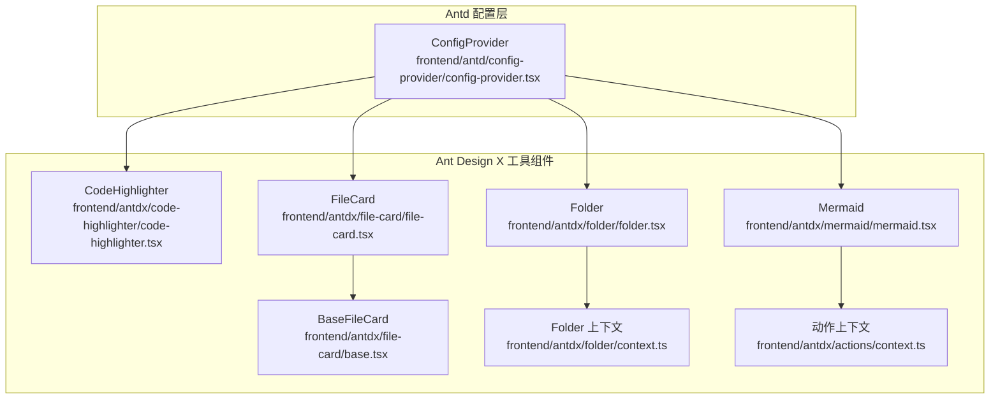
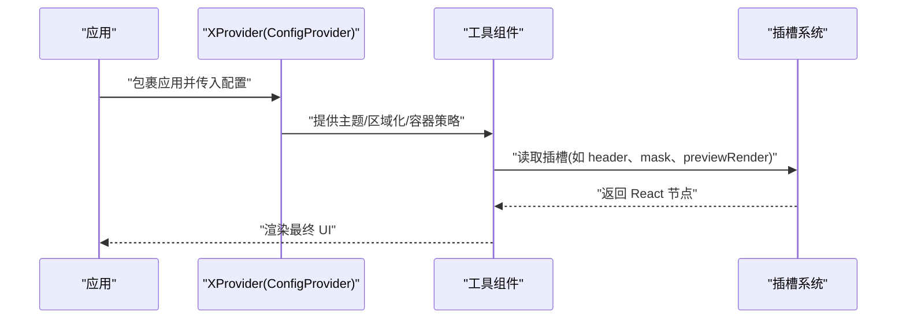
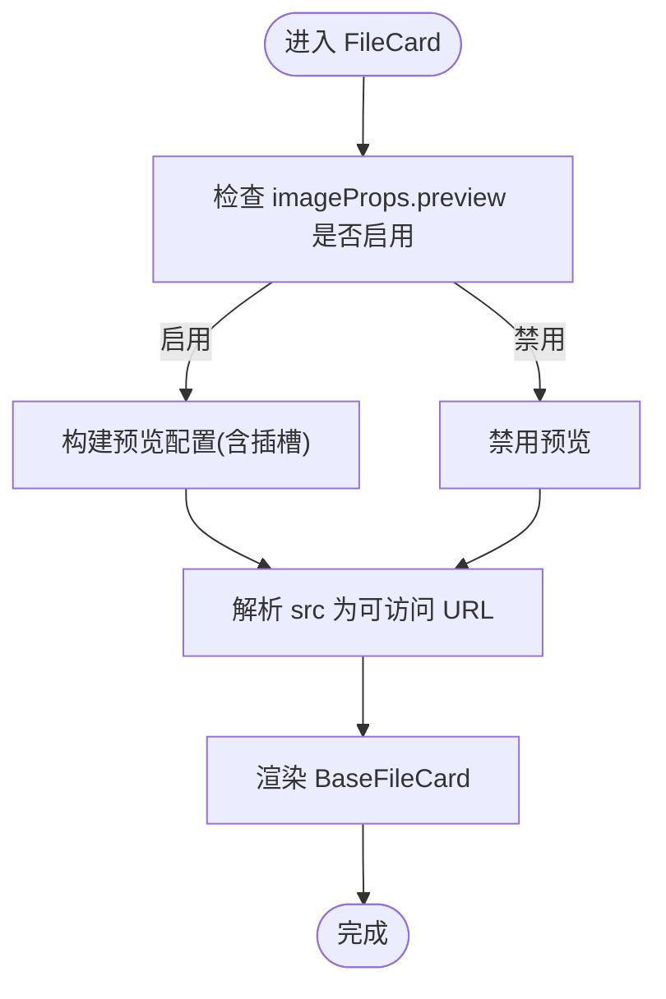
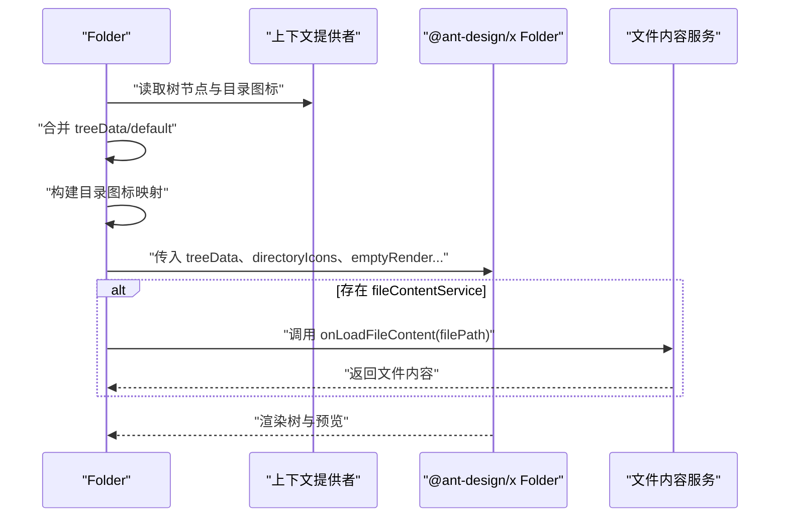
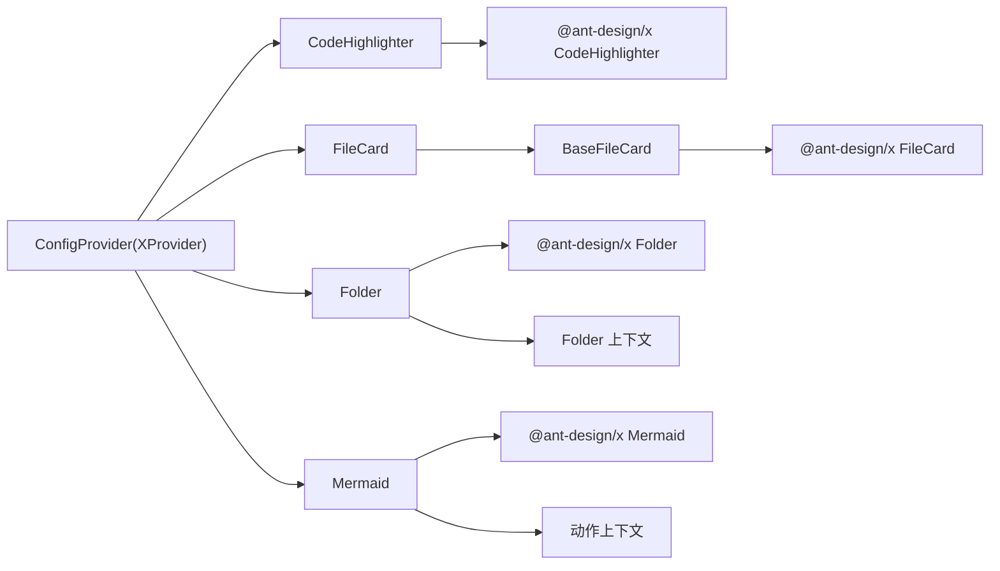

# 工具组件 API

<cite>
**本文引用的文件**
- [frontend/antd/config-provider/config-provider.tsx](file://frontend/antd/config-provider/config-provider.tsx)
- [frontend/antdx/code-highlighter/code-highlighter.tsx](file://frontend/antdx/code-highlighter/code-highlighter.tsx)
- [frontend/antdx/file-card/file-card.tsx](file://frontend/antdx/file-card/file-card.tsx)
- [frontend/antdx/file-card/base.tsx](file://frontend/antdx/file-card/base.tsx)
- [frontend/antdx/folder/folder.tsx](file://frontend/antdx/folder/folder.tsx)
- [frontend/antdx/folder/context.ts](file://frontend/antdx/folder/context.ts)
- [frontend/antdx/mermaid/mermaid.tsx](file://frontend/antdx/mermaid/mermaid.tsx)
- [frontend/antdx/actions/context.ts](file://frontend/antdx/actions/context.ts)
- [docs/components/antdx/x_provider/README.md](file://docs/components/antdx/x_provider/README.md)
</cite>

## 目录

1. [简介](#简介)
2. [项目结构](#项目结构)
3. [核心组件](#核心组件)
4. [架构总览](#架构总览)
5. [组件详解](#组件详解)
6. [依赖关系分析](#依赖关系分析)
7. [性能考量](#性能考量)
8. [故障排查指南](#故障排查指南)
9. [结论](#结论)
10. [附录](#附录)

## 简介

本文件面向 ModelScope Studio 的 Ant Design X 工具组件 API，聚焦以下组件的完整接口与使用方法：

- XProvider 全局配置组件（基于 antd 的 ConfigProvider 扩展）
- CodeHighlighter 代码高亮组件
- FileCard 文件卡片组件
- Folder 文件夹组件
- Mermaid 流程图组件

文档覆盖全局配置方式、代码高亮语言与主题支持、文件管理交互、流程图绘制与动作集成，以及与 Gradio 生态的集成方式。同时提供类型定义要点、上下文提供与状态管理机制、性能优化与扩展最佳实践。

## 项目结构

围绕工具组件的关键目录与文件如下：

- 前端组件实现位于 frontend/antdx 与 frontend/antd 下，分别对应 Ant Design X 组件与 antd 配置层
- 每个组件均通过 sveltify 包装为可在 Svelte 中使用的 React 组件，并通过 slots 与参数桥接
- 组件间共享上下文通过 createItemsContext 提供，用于树节点、目录图标与动作项等

图表来源

- [frontend/antd/config-provider/config-provider.tsx:1-154](file://frontend/antd/config-provider/config-provider.tsx#L1-L154)
- [frontend/antdx/code-highlighter/code-highlighter.tsx:1-54](file://frontend/antdx/code-highlighter/code-highlighter.tsx#L1-L54)
- [frontend/antdx/file-card/file-card.tsx:1-127](file://frontend/antdx/file-card/file-card.tsx#L1-L127)
- [frontend/antdx/file-card/base.tsx:1-44](file://frontend/antdx/file-card/base.tsx#L1-L44)
- [frontend/antdx/folder/folder.tsx:1-123](file://frontend/antdx/folder/folder.tsx#L1-L123)
- [frontend/antdx/folder/context.ts:1-16](file://frontend/antdx/folder/context.ts#L1-L16)
- [frontend/antdx/mermaid/mermaid.tsx:1-87](file://frontend/antdx/mermaid/mermaid.tsx#L1-L87)
- [frontend/antdx/actions/context.ts:1-7](file://frontend/antdx/actions/context.ts#L1-L7)

章节来源

- [frontend/antd/config-provider/config-provider.tsx:1-154](file://frontend/antd/config-provider/config-provider.tsx#L1-L154)
- [frontend/antdx/code-highlighter/code-highlighter.tsx:1-54](file://frontend/antdx/code-highlighter/code-highlighter.tsx#L1-L54)
- [frontend/antdx/file-card/file-card.tsx:1-127](file://frontend/antdx/file-card/file-card.tsx#L1-L127)
- [frontend/antdx/file-card/base.tsx:1-44](file://frontend/antdx/file-card/base.tsx#L1-L44)
- [frontend/antdx/folder/folder.tsx:1-123](file://frontend/antdx/folder/folder.tsx#L1-L123)
- [frontend/antdx/folder/context.ts:1-16](file://frontend/antdx/folder/context.ts#L1-L16)
- [frontend/antdx/mermaid/mermaid.tsx:1-87](file://frontend/antdx/mermaid/mermaid.tsx#L1-L87)
- [frontend/antdx/actions/context.ts:1-7](file://frontend/antdx/actions/context.ts#L1-L7)

## 核心组件

本节概述各组件职责与关键能力：

- XProvider：在 Gradio Blocks 场景中替代 antd 的 ConfigProvider，统一提供 Ant Design X 组件的全局配置（主题、区域化、弹出容器等），并兼容 slots 注入
- CodeHighlighter：封装 @ant-design/x 的代码高亮组件，支持自定义 header 插槽与明暗主题下的语法高亮样式
- FileCard：文件卡片组件，支持图片占位符、预览遮罩、关闭图标、工具栏渲染、指示器与描述文本的插槽化配置
- Folder：文件夹树组件，支持树节点数据、目录图标映射、空态渲染、标题与预览渲染的插槽化注入，并可接入文件内容服务
- Mermaid：流程图组件，支持主题切换、高亮样式、动作项上下文注入与自定义动作

章节来源

- [docs/components/antdx/x_provider/README.md:1-19](file://docs/components/antdx/x_provider/README.md#L1-L19)
- [frontend/antd/config-provider/config-provider.tsx:51-151](file://frontend/antd/config-provider/config-provider.tsx#L51-L151)
- [frontend/antdx/code-highlighter/code-highlighter.tsx:29-51](file://frontend/antdx/code-highlighter/code-highlighter.tsx#L29-L51)
- [frontend/antdx/file-card/file-card.tsx:17-124](file://frontend/antdx/file-card/file-card.tsx#L17-L124)
- [frontend/antdx/folder/folder.tsx:16-120](file://frontend/antdx/folder/folder.tsx#L16-L120)
- [frontend/antdx/mermaid/mermaid.tsx:33-84](file://frontend/antdx/mermaid/mermaid.tsx#L33-L84)

## 架构总览

XProvider 作为顶层配置容器，向下为各工具组件提供统一的主题、区域化与弹出容器策略；工具组件通过 slots 与参数桥接，结合上下文提供者实现灵活的插槽化与动态渲染。

图表来源

- [frontend/antd/config-provider/config-provider.tsx:108-149](file://frontend/antd/config-provider/config-provider.tsx#L108-L149)
- [frontend/antdx/code-highlighter/code-highlighter.tsx:35-49](file://frontend/antdx/code-highlighter/code-highlighter.tsx#L35-L49)
- [frontend/antdx/file-card/file-card.tsx:46-123](file://frontend/antdx/file-card/file-card.tsx#L46-L123)
- [frontend/antdx/folder/folder.tsx:48-116](file://frontend/antdx/folder/folder.tsx#L48-L116)
- [frontend/antdx/mermaid/mermaid.tsx:47-81](file://frontend/antdx/mermaid/mermaid.tsx#L47-L81)

## 组件详解

### XProvider 全局配置组件

- 角色定位：替代 antd 的 ConfigProvider，为 @ant-design/x 组件提供统一的全局配置
- 关键能力
  - 主题模式：支持 themeMode 控制暗色/紧凑算法
  - 区域化：自动根据浏览器语言解析并加载对应 antd/dayjs 本地化资源
  - 弹出容器：支持 getPopupContainer/getTargetContainer 函数注入
  - 插槽化：通过 combinePropsAndSlots 将 slots 注入到组件属性中
  - 自定义渲染：renderEmpty 支持 slot 或函数两种形式
- 使用建议
  - 在 Gradio Blocks 中以 antdx.XProvider 替代 antd.ConfigProvider
  - 通过 themeMode 切换明暗主题，避免重复 key 导致的重渲染问题
  - 合理设置 getPopupContainer，确保浮层渲染在正确容器内

章节来源

- [docs/components/antdx/x_provider/README.md:1-19](file://docs/components/antdx/x_provider/README.md#L1-L19)
- [frontend/antd/config-provider/config-provider.tsx:51-151](file://frontend/antd/config-provider/config-provider.tsx#L51-L151)

### CodeHighlighter 代码高亮组件

- 角色定位：对代码进行语法高亮渲染，支持 header 插槽与明暗主题样式
- 关键能力
  - 语言支持：依赖 react-syntax-highlighter 的 Prism 风格，可直接渲染多种语言
  - 明暗主题：根据 themeMode 切换 materialDark/materialLight 样式，统一去除代码块外边距
  - 插槽化：支持 header 插槽注入自定义头部
  - 值绑定：value 属性或子节点内容均可作为代码输入
- 使用建议
  - 在 AI 应用中，优先使用明暗一致的主题风格，保证阅读体验
  - 通过 header 插槽添加复制、下载等操作按钮

章节来源

- [frontend/antdx/code-highlighter/code-highlighter.tsx:29-51](file://frontend/antdx/code-highlighter/code-highlighter.tsx#L29-L51)

### FileCard 文件卡片组件

- 角色定位：展示文件信息，支持图片占位、预览遮罩、工具栏、指示器与描述文本的插槽化配置
- 关键能力
  - 图片处理：支持占位符、预览容器、关闭图标、工具栏与图片渲染的插槽化
  - 加载状态：spinProps 支持 size、icon、description、indicator 插槽
  - 描述与图标：description、icon 插槽可自定义展示内容
  - 资源解析：通过 BaseFileCard 的 resolveFileSrc 解析相对路径与 FileData
- 使用建议
  - 对于远程图片，确保 rootUrl 与 apiPrefix 正确拼接可访问 URL
  - 预览功能按需开启，避免不必要的 DOM 渲染

图表来源

- [frontend/antdx/file-card/file-card.tsx:34-123](file://frontend/antdx/file-card/file-card.tsx#L34-L123)
- [frontend/antdx/file-card/base.tsx:15-41](file://frontend/antdx/file-card/base.tsx#L15-L41)

章节来源

- [frontend/antdx/file-card/file-card.tsx:17-124](file://frontend/antdx/file-card/file-card.tsx#L17-L124)
- [frontend/antdx/file-card/base.tsx:9-41](file://frontend/antdx/file-card/base.tsx#L9-L41)

### Folder 文件夹组件

- 角色定位：文件夹树组件，支持树节点数据、目录图标映射、空态与标题渲染、预览渲染与文件内容服务
- 关键能力
  - 树节点上下文：通过 withTreeNodeItemsContextProvider 提供 treeData/default 两套数据源
  - 目录图标上下文：通过 withDirectoryIconItemsContextProvider 提供扩展名到图标的映射
  - 预览服务：fileContentService 可注入加载文件内容的回调
  - 插槽化：emptyRender、directoryTitle、previewTitle、previewRender 均支持插槽
- 使用建议
  - treeData 为空时回退至默认节点列表，确保首次渲染稳定
  - 目录图标映射通过插槽收集后转换为字典，便于快速匹配

图表来源

- [frontend/antdx/folder/folder.tsx:24-120](file://frontend/antdx/folder/folder.tsx#L24-L120)
- [frontend/antdx/folder/context.ts:1-16](file://frontend/antdx/folder/context.ts#L1-L16)

章节来源

- [frontend/antdx/folder/folder.tsx:16-120](file://frontend/antdx/folder/folder.tsx#L16-L120)
- [frontend/antdx/folder/context.ts:1-16](file://frontend/antdx/folder/context.ts#L1-L16)

### Mermaid 流程图组件

- 角色定位：流程图绘制组件，支持主题切换、高亮样式与动作项上下文
- 关键能力
  - 主题与高亮：根据 themeMode 切换 dark/base 主题，并应用 Prism 风格
  - 动作上下文：通过 withActionItemsContextProvider 注入自定义动作项
  - 插槽化：header 与 actions.customActions 支持插槽
  - 配置合并：config 中的 theme 将被 themeMode 覆盖
- 使用建议
  - 在 AI 应用中，将复制、下载、全屏等动作通过 actions.customActions 注入
  - 保持主题一致性，避免明暗切换导致的视觉割裂

章节来源

- [frontend/antdx/mermaid/mermaid.tsx:33-84](file://frontend/antdx/mermaid/mermaid.tsx#L33-L84)
- [frontend/antdx/actions/context.ts:1-7](file://frontend/antdx/actions/context.ts#L1-L7)

## 依赖关系分析

- 组件耦合
  - FileCard 依赖 BaseFileCard 进行资源解析，降低重复逻辑
  - Folder 通过上下文提供者注入树节点与目录图标，解耦外部数据源
  - Mermaid 通过动作上下文提供者注入自定义动作，增强可扩展性
- 外部依赖
  - react-syntax-highlighter：提供 Prism 风格的高亮样式
  - @ant-design/x：提供底层组件能力（CodeHighlighter、Folder、Mermaid、FileCard 等）
  - antd：ConfigProvider 的扩展与主题算法
- 循环依赖
  - 当前结构未发现循环依赖，上下文提供者通过 createItemsContext 抽象，避免直接互相引用

图表来源

- [frontend/antdx/code-highlighter/code-highlighter.tsx:1-54](file://frontend/antdx/code-highlighter/code-highlighter.tsx#L1-L54)
- [frontend/antdx/file-card/file-card.tsx:1-127](file://frontend/antdx/file-card/file-card.tsx#L1-L127)
- [frontend/antdx/file-card/base.tsx:1-44](file://frontend/antdx/file-card/base.tsx#L1-L44)
- [frontend/antdx/folder/folder.tsx:1-123](file://frontend/antdx/folder/folder.tsx#L1-L123)
- [frontend/antdx/folder/context.ts:1-16](file://frontend/antdx/folder/context.ts#L1-L16)
- [frontend/antdx/mermaid/mermaid.tsx:1-87](file://frontend/antdx/mermaid/mermaid.tsx#L1-L87)
- [frontend/antdx/actions/context.ts:1-7](file://frontend/antdx/actions/context.ts#L1-L7)
- [frontend/antd/config-provider/config-provider.tsx:1-154](file://frontend/antd/config-provider/config-provider.tsx#L1-L154)

章节来源

- [frontend/antdx/file-card/file-card.tsx:17-124](file://frontend/antdx/file-card/file-card.tsx#L17-L124)
- [frontend/antdx/folder/folder.tsx:16-120](file://frontend/antdx/folder/folder.tsx#L16-L120)
- [frontend/antdx/mermaid/mermaid.tsx:33-84](file://frontend/antdx/mermaid/mermaid.tsx#L33-L84)
- [frontend/antd/config-provider/config-provider.tsx:51-151](file://frontend/antd/config-provider/config-provider.tsx#L51-L151)

## 性能考量

- 渲染策略
  - 合理使用 useMemo 缓存 treeData、directoryIcons、actions.customActions 等计算结果，避免重复渲染
  - 预览容器与工具栏仅在需要时启用，减少 DOM 结构复杂度
- 主题切换
  - themeMode 变更时，通过明暗算法组合与样式对象复用，避免频繁重建样式
- 插槽渲染
  - 使用 renderParamsSlot 与 renderItems 时，尽量传递 clone: true，确保插槽节点独立更新
- 资源解析
  - BaseFileCard 的 resolveFileSrc 仅在 src/rootUrl/apiPrefix 变化时重新计算，避免不必要的 URL 拼接

[本节为通用指导，无需列出具体文件来源]

## 故障排查指南

- 区域化不生效
  - 检查 locale 参数格式是否符合预期，确认 locales 映射存在对应语言包
  - 确认 dayjs.locale 已被正确设置
- 弹出层位置异常
  - 检查 getPopupContainer/getTargetContainer 返回的容器是否可见且层级正确
- 预览不可用
  - 确认 imageProps.preview 未被显式设为 false，且插槽 mask/closeIcon/toolbarRender/imageRender 至少有一个可用
- 文件无法访问
  - 确认 resolveFileSrc 的 rootUrl 与 apiPrefix 拼接正确，必要时使用 FileData.url 字段
- 动作项不显示
  - 确认通过 withActionItemsContextProvider 注入的动作项已正确收集并传递给 actions.customActions

章节来源

- [frontend/antd/config-provider/config-provider.tsx:96-105](file://frontend/antd/config-provider/config-provider.tsx#L96-L105)
- [frontend/antdx/file-card/file-card.tsx:34-123](file://frontend/antdx/file-card/file-card.tsx#L34-L123)
- [frontend/antdx/file-card/base.tsx:15-41](file://frontend/antdx/file-card/base.tsx#L15-L41)
- [frontend/antdx/mermaid/mermaid.tsx:40-84](file://frontend/antdx/mermaid/mermaid.tsx#L40-L84)

## 结论

本文档系统梳理了 ModelScope Studio 中 Ant Design X 工具组件的 API 与使用方式，重点覆盖 XProvider 全局配置、CodeHighlighter、FileCard、Folder、Mermaid 的接口要点与最佳实践。通过插槽化与上下文提供者，组件在 Gradio 生态中实现了高度可定制与可扩展的能力，适用于 AI 应用中的工具集成与内容展示场景。

[本节为总结性内容，无需列出具体文件来源]

## 附录

### 组件 API 速查表

- XProvider
  - 主要属性：themeMode、locale、getPopupContainer、getTargetContainer、renderEmpty、component、className、style、id
  - 插槽：无（通过参数与函数注入）
- CodeHighlighter
  - 主要属性：value、themeMode、highlightProps、header
  - 插槽：header
- FileCard
  - 主要属性：rootUrl、apiPrefix、src、imageProps、spinProps、description、icon、mask
  - 插槽：imageProps.placeholder、imageProps.preview.mask、imageProps.preview.closeIcon、imageProps.preview.toolbarRender、imageProps.preview.imageRender、description、icon、mask、spinProps.icon、spinProps.description、spinProps.indicator
- Folder
  - 主要属性：treeData、directoryIcons、emptyRender、directoryTitle、previewTitle、previewRender、fileContentService
  - 插槽：emptyRender、previewRender、directoryTitle、previewTitle
- Mermaid
  - 主要属性：value、themeMode、config、actions、header
  - 插槽：header、actions.customActions

章节来源

- [frontend/antd/config-provider/config-provider.tsx:51-151](file://frontend/antd/config-provider/config-provider.tsx#L51-L151)
- [frontend/antdx/code-highlighter/code-highlighter.tsx:29-51](file://frontend/antdx/code-highlighter/code-highlighter.tsx#L29-L51)
- [frontend/antdx/file-card/file-card.tsx:17-124](file://frontend/antdx/file-card/file-card.tsx#L17-L124)
- [frontend/antdx/folder/folder.tsx:16-120](file://frontend/antdx/folder/folder.tsx#L16-L120)
- [frontend/antdx/mermaid/mermaid.tsx:33-84](file://frontend/antdx/mermaid/mermaid.tsx#L33-L84)
