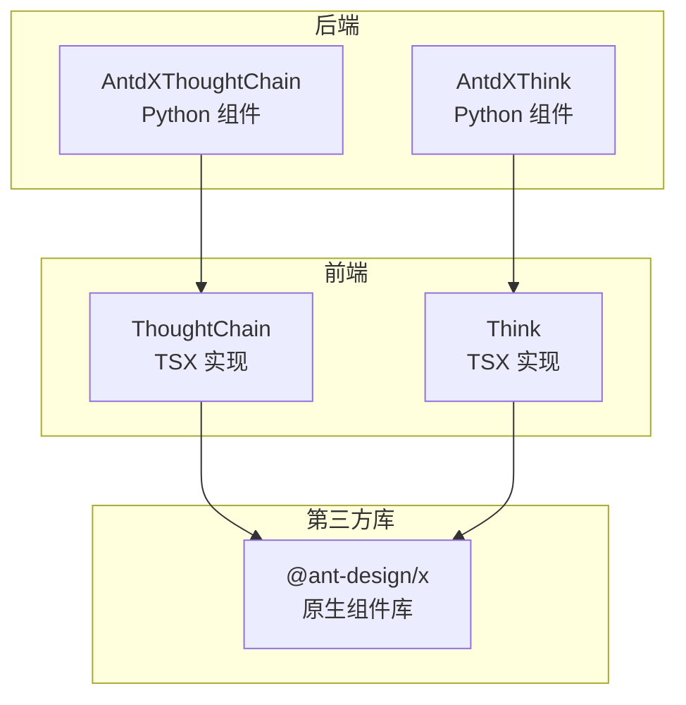
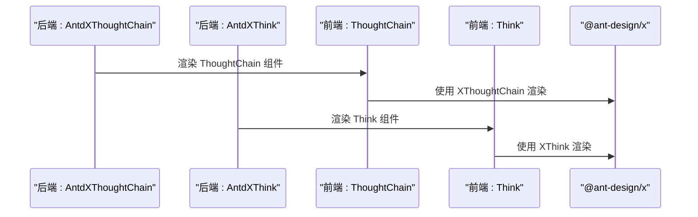
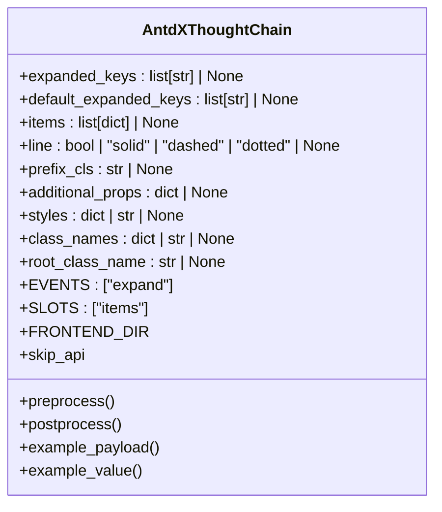
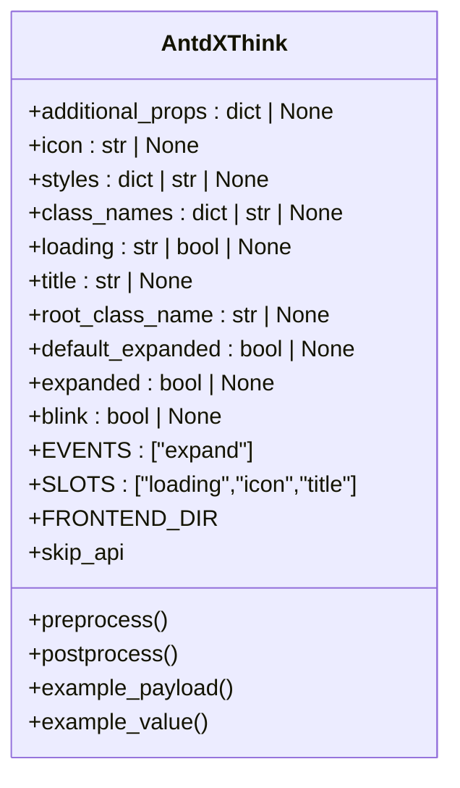
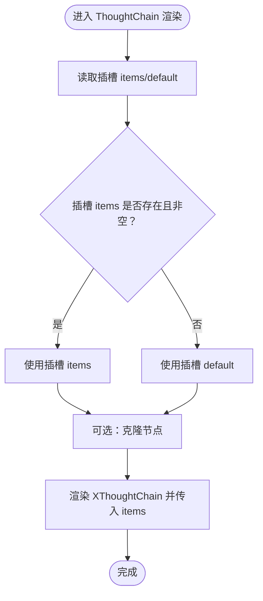
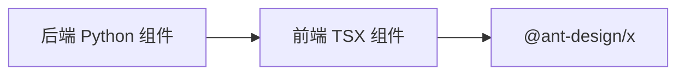

# 确认组件 API

<cite>
**本文引用的文件**
- [thought_chain/__init__.py](file://backend/modelscope_studio/components/antdx/thought_chain/__init__.py)
- [think/__init__.py](file://backend/modelscope_studio/components/antdx/think/__init__.py)
- [thought-chain.tsx](file://frontend/antdx/thought-chain/thought-chain.tsx)
- [think.tsx](file://frontend/antdx/think/think.tsx)
</cite>

## 目录

1. [简介](#简介)
2. [项目结构](#项目结构)
3. [核心组件](#核心组件)
4. [架构总览](#架构总览)
5. [详细组件分析](#详细组件分析)
6. [依赖关系分析](#依赖关系分析)
7. [性能考虑](#性能考虑)
8. [故障排查指南](#故障排查指南)
9. [结论](#结论)
10. [附录](#附录)

## 简介

本文件为 ModelScope Studio 的 Ant Design X 确认组件 API 参考文档，聚焦 ThoughtChain 思考链组件与 Think 思维组件的完整接口与行为说明。内容涵盖：

- 组件的属性、事件与插槽定义
- 思考过程的可视化展示与节点管理机制
- 确认流程的控制与状态管理
- 与 AI 推理过程和决策展示场景的集成建议
- TypeScript 类型与接口规范
- 最佳实践与常见问题排查

## 项目结构

Ant Design X 组件在后端通过 Python 组件包装，在前端通过 Svelte/React 混合桥接至 @ant-design/x 的原生实现。核心文件组织如下：

- 后端 Python 包装：位于 backend/modelscope_studio/components/antdx 下，分别提供 ThoughtChain 与 Think 的 Python 组件类
- 前端实现：位于 frontend/antdx 下，分别提供 thought-chain 与 think 的 TSX 实现

图表来源

- [thought_chain/**init**.py:12-86](file://backend/modelscope_studio/components/antdx/thought_chain/__init__.py#L12-L86)
- [think/**init**.py:8-79](file://backend/modelscope_studio/components/antdx/think/__init__.py#L8-L79)
- [thought-chain.tsx:1-43](file://frontend/antdx/thought-chain/thought-chain.tsx#L1-L43)
- [think.tsx:1-24](file://frontend/antdx/think/think.tsx#L1-L24)

章节来源

- [thought_chain/**init**.py:12-86](file://backend/modelscope_studio/components/antdx/thought_chain/__init__.py#L12-L86)
- [think/**init**.py:8-79](file://backend/modelscope_studio/components/antdx/think/__init__.py#L8-L79)
- [thought-chain.tsx:1-43](file://frontend/antdx/thought-chain/thought-chain.tsx#L1-L43)
- [think.tsx:1-24](file://frontend/antdx/think/think.tsx#L1-L24)

## 核心组件

本节概述两个核心组件的职责与能力边界：

- ThoughtChain（思考链）：用于以树形/列表形式可视化展示推理或决策过程的节点序列，支持展开/折叠、连线样式与节点集合管理
- Think（思维）：用于封装单个思维单元，支持标题、图标、加载态与可展开状态，并提供插槽扩展点

章节来源

- [thought_chain/**init**.py:12-86](file://backend/modelscope_studio/components/antdx/thought_chain/__init__.py#L12-L86)
- [think/**init**.py:8-79](file://backend/modelscope_studio/components/antdx/think/__init__.py#L8-L79)

## 架构总览

下图展示了从后端 Python 组件到前端 TSX 实现再到 @ant-design/x 原生组件的调用链路。

图表来源

- [thought_chain/**init**.py:68-86](file://backend/modelscope_studio/components/antdx/thought_chain/__init__.py#L68-L86)
- [think/**init**.py:61-79](file://backend/modelscope_studio/components/antdx/think/__init__.py#L61-L79)
- [thought-chain.tsx:11-43](file://frontend/antdx/thought-chain/thought-chain.tsx#L11-L43)
- [think.tsx:6-24](file://frontend/antdx/think/think.tsx#L6-L24)

## 详细组件分析

### ThoughtChain（思考链）组件

- 组件定位：用于呈现“思考链”式的数据流或决策序列，支持节点集合(items)、展开键(expanded_keys)、默认展开键(default_expanded_keys)、连线样式(line)等
- 插槽：支持 items 插槽，用于注入节点集合
- 事件：expand 事件，当展开键变化时触发回调
- 属性要点：
  - expanded_keys / default_expanded_keys：控制节点展开状态
  - items：节点数据集合，可由插槽或属性传入
  - line：连线样式，支持布尔值与特定字符串枚举
  - prefix_cls / styles / class_names / root_class_name：样式与类名定制
  - 其他通用属性：visible、elem_id、elem_classes、elem_style、render 等

图表来源

- [thought_chain/**init**.py:30-86](file://backend/modelscope_studio/components/antdx/thought_chain/__init__.py#L30-L86)

章节来源

- [thought_chain/**init**.py:12-86](file://backend/modelscope_studio/components/antdx/thought_chain/__init__.py#L12-L86)
- [thought-chain.tsx:11-43](file://frontend/antdx/thought-chain/thought-chain.tsx#L11-L43)

### Think（思维）组件

- 组件定位：用于封装单个思维单元，支持标题(title)、图标(icon)、加载态(loading)、默认展开(default_expanded)、当前展开(expanded)、闪烁(blink)等
- 插槽：支持 loading、icon、title 三个插槽，允许自定义渲染
- 事件：expand 事件，用于展开状态变更通知
- 属性要点：
  - icon / title / loading：基础展示属性
  - default_expanded / expanded：展开状态控制
  - blink：视觉提示
  - 其他通用属性：visible、elem_id、elem_classes、elem_style、render 等

图表来源

- [think/**init**.py:21-79](file://backend/modelscope_studio/components/antdx/think/__init__.py#L21-L79)

章节来源

- [think/**init**.py:8-79](file://backend/modelscope_studio/components/antdx/think/__init__.py#L8-L79)
- [think.tsx:6-24](file://frontend/antdx/think/think.tsx#L6-L24)

### 前端实现与插槽机制

- ThoughtChain 前端实现通过上下文读取插槽 items/default，并在必要时克隆节点以避免副作用；最终将解析后的 items 传递给 @ant-design/x 的 XThoughtChain
- Think 前端实现通过 ReactSlot 将 slots.loading/icon/title 注入到 @ant-design/x 的 XThink 中，若未提供插槽则回退到属性值

图表来源

- [thought-chain.tsx:14-39](file://frontend/antdx/thought-chain/thought-chain.tsx#L14-L39)

章节来源

- [thought-chain.tsx:1-43](file://frontend/antdx/thought-chain/thought-chain.tsx#L1-L43)
- [think.tsx:6-24](file://frontend/antdx/think/think.tsx#L6-L24)

## 依赖关系分析

- 后端 Python 组件仅负责声明属性、事件、插槽与前端目录映射，不直接处理业务逻辑
- 前端 TSX 组件负责：
  - 解析插槽与属性，合并为 @ant-design/x 所需的 props
  - 通过 sveltify 桥接到 React 生态
- 第三方库 @ant-design/x 提供实际的 UI 行为与样式

图表来源

- [thought_chain/**init**.py:68-86](file://backend/modelscope_studio/components/antdx/thought_chain/__init__.py#L68-L86)
- [think/**init**.py:61-79](file://backend/modelscope_studio/components/antdx/think/__init__.py#L61-L79)
- [thought-chain.tsx:1-43](file://frontend/antdx/thought-chain/thought-chain.tsx#L1-L43)
- [think.tsx:1-24](file://frontend/antdx/think/think.tsx#L1-L24)

章节来源

- [thought_chain/**init**.py:12-86](file://backend/modelscope_studio/components/antdx/thought_chain/__init__.py#L12-L86)
- [think/**init**.py:8-79](file://backend/modelscope_studio/components/antdx/think/__init__.py#L8-L79)
- [thought-chain.tsx:1-43](file://frontend/antdx/thought-chain/thought-chain.tsx#L1-L43)
- [think.tsx:1-24](file://frontend/antdx/think/think.tsx#L1-L24)

## 性能考虑

- 节点克隆：前端在需要时对插槽节点进行克隆，避免共享引用导致的副作用，但会增加内存与计算开销。建议在节点数量较大时谨慎使用
- 插槽解析：优先使用 items 插槽，其次回退到 default 插槽，减少不必要的属性传递
- 展开状态：合理设置 expanded_keys/default_expanded_keys，避免一次性展开过多节点造成渲染压力
- 加载态：Think 组件的 loading 插槽/属性应按需启用，避免冗余的动画与 DOM 结构

## 故障排查指南

- 插槽未生效
  - 检查是否正确使用 items/default 插槽；确认插槽名称大小写与顺序
  - 若使用属性 items，请确保类型与 @ant-design/x 的期望一致
- 展开事件无效
  - 确认已绑定 expand 事件；检查回调中是否更新了 bind_expand_event 或相关状态
- 加载态与插槽冲突
  - 当提供 loading 插槽时，插槽优先于属性；若未提供插槽，将回退到属性值
- 样式与类名
  - 如需覆盖样式，优先使用 styles/class_names/root_class_name；注意与第三方库默认样式的冲突

章节来源

- [thought-chain.tsx:14-39](file://frontend/antdx/thought-chain/thought-chain.tsx#L14-L39)
- [think.tsx:10-17](file://frontend/antdx/think/think.tsx#L10-L17)
- [thought_chain/**init**.py:20-25](file://backend/modelscope_studio/components/antdx/thought_chain/__init__.py#L20-L25)
- [think/**init**.py:12-16](file://backend/modelscope_studio/components/antdx/think/__init__.py#L12-L16)

## 结论

- ThoughtChain 与 Think 组件通过清晰的属性、事件与插槽设计，为 AI 推理与决策过程的可视化提供了稳定的基础
- 建议在大规模节点场景下优化插槽使用与展开策略，结合加载态与样式定制提升用户体验
- 通过 expand 事件与展开状态控制，可实现交互式确认流程与逐步展示

## 附录

### API 规范与类型定义（基于源码）

- AntdXThoughtChain
  - 属性
    - expanded_keys: 列表，节点展开键
    - default_expanded_keys: 列表，初始展开键
    - items: 列表，节点数据
    - line: 布尔或特定字符串，连线样式
    - prefix_cls: 字符串，前缀类名
    - additional_props/styles/class_names/root_class_name: 样式与类名定制
    - visible/elem_id/elem_classes/elem_style/render: 通用属性
  - 事件
    - expand：展开键变化回调
  - 插槽
    - items：节点集合
- AntdXThink
  - 属性
    - icon/title/loading: 图标、标题、加载态
    - default_expanded/expanded: 默认/当前展开状态
    - blink: 闪烁效果
    - styles/class_names/root_class_name: 样式与类名定制
    - visible/elem_id/elem_classes/elem_style/render: 通用属性
  - 事件
    - expand：展开状态变更回调
  - 插槽
    - loading/icon/title：对应属性的插槽替代

章节来源

- [thought_chain/**init**.py:30-86](file://backend/modelscope_studio/components/antdx/thought_chain/__init__.py#L30-L86)
- [think/**init**.py:21-79](file://backend/modelscope_studio/components/antdx/think/__init__.py#L21-L79)

### 集成与最佳实践

- 推理过程可视化
  - 使用 ThoughtChain 展示多步推理/决策序列；每个 Think 代表一个思维单元
  - 通过 expand 控制逐步展示，结合 loading 插槽表示正在思考
- 用户理解优化
  - 合理使用 line 连线样式与 prefix_cls，增强层级感
  - 在 Think 中使用 icon/title 明确角色与意图；必要时使用 blink 提示关注
- 状态管理与流程控制
  - 通过 expanded_keys/default_expanded_keys 管理节点展开；通过 expand 事件驱动后续步骤
  - 对于长链路，建议分页/分段加载，避免一次性渲染过多节点
