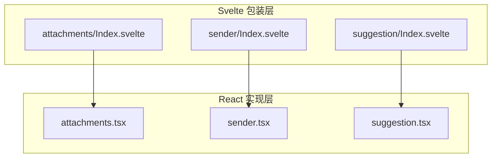
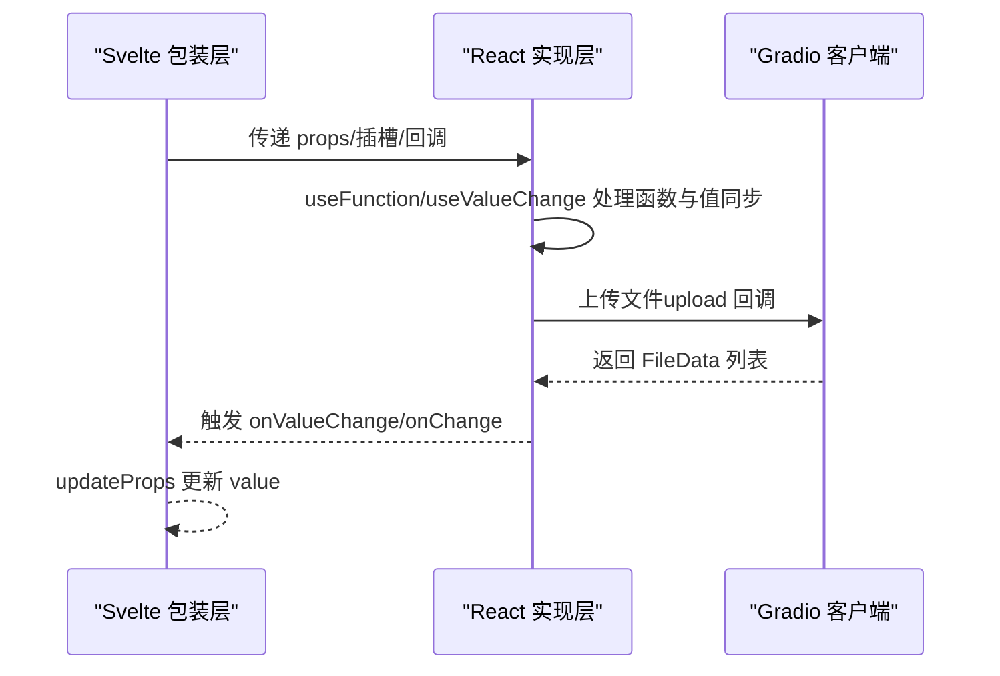
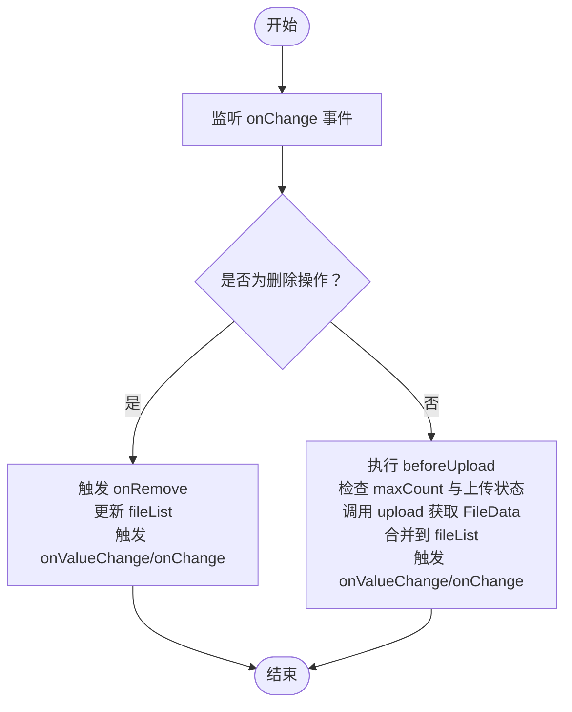
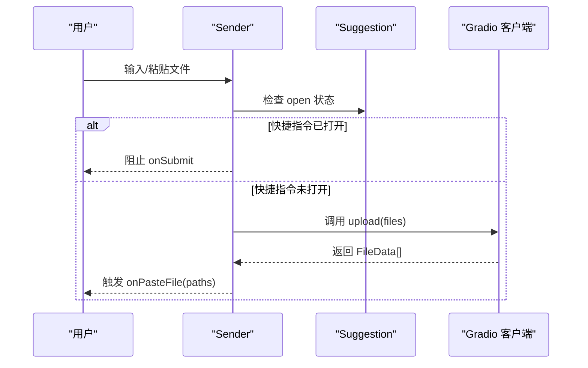
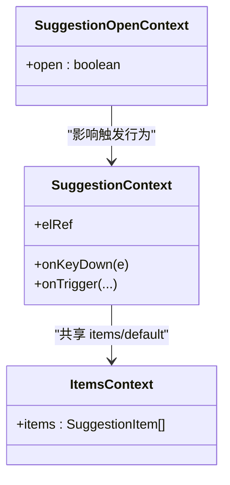
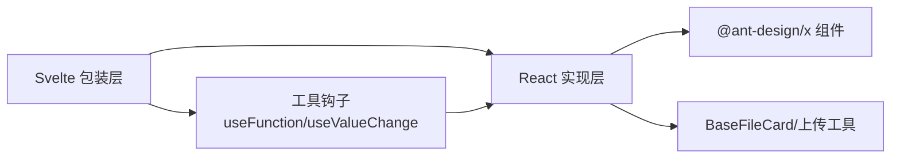

# 表达组件 API

<cite>
**本文引用的文件**
- [frontend/antdx/attachments/Index.svelte](file://frontend/antdx/attachments/Index.svelte)
- [frontend/antdx/attachments/attachments.tsx](file://frontend/antdx/attachments/attachments.tsx)
- [frontend/antdx/sender/Index.svelte](file://frontend/antdx/sender/Index.svelte)
- [frontend/antdx/sender/sender.tsx](file://frontend/antdx/sender/sender.tsx)
- [frontend/antdx/suggestion/Index.svelte](file://frontend/antdx/suggestion/Index.svelte)
- [frontend/antdx/suggestion/suggestion.tsx](file://frontend/antdx/suggestion/suggestion.tsx)
- [frontend/antdx/suggestion/context.ts](file://frontend/antdx/suggestion/context.ts)
- [frontend/antdx/file-card/base.tsx](file://frontend/antdx/file-card/base.tsx)
- [frontend/utils/hooks/useFunction.ts](file://frontend/utils/hooks/useFunction.ts)
- [frontend/utils/hooks/useValueChange.ts](file://frontend/utils/hooks/useValueChange.ts)
- [docs/components/antdx/attachments/README.md](file://docs/components/antdx/attachments/README.md)
- [docs/components/antdx/sender/README.md](file://docs/components/antdx/sender/README.md)
- [docs/components/antdx/suggestion/README.md](file://docs/components/antdx/suggestion/README.md)
</cite>

## 目录

1. [简介](#简介)
2. [项目结构](#项目结构)
3. [核心组件](#核心组件)
4. [架构总览](#架构总览)
5. [详细组件分析](#详细组件分析)
6. [依赖关系分析](#依赖关系分析)
7. [性能考量](#性能考量)
8. [故障排查指南](#故障排查指南)
9. [结论](#结论)
10. [附录](#附录)

## 简介

本文件为 ModelScope Studio 中 Ant Design X 表达组件的 API 参考文档，聚焦以下三个组件：

- 附件组件：用于多模态输入中的文件/图片等附件展示与上传
- 发送器组件：用于聊天消息输入、快捷指令触发与粘贴上传
- 快捷指令组件：用于在输入框中提供可选择的快捷建议项

文档覆盖组件的属性接口、事件回调、数据绑定、状态同步、TypeScript 类型定义、与聊天系统的集成方式，以及多模态数据处理与用户输入优化的最佳实践。

## 项目结构

- 组件以 Svelte 包装层（Index.svelte）+ React 实现层（\*.tsx）的方式组织，通过 svelte-preprocess-react 将 Ant Design X 的 React 组件桥接为 Svelte 组件。
- 附件组件支持自定义占位图、预览容器、图标渲染、列表项渲染等插槽扩展；发送器组件支持前缀/后缀/页眉/页脚插槽、技能面板、粘贴上传；快捷指令组件支持动态项渲染与键盘触发控制。

图表来源

- [frontend/antdx/attachments/Index.svelte:1-98](file://frontend/antdx/attachments/Index.svelte#L1-L98)
- [frontend/antdx/sender/Index.svelte:1-102](file://frontend/antdx/sender/Index.svelte#L1-L102)
- [frontend/antdx/suggestion/Index.svelte:1-75](file://frontend/antdx/suggestion/Index.svelte#L1-L75)
- [frontend/antdx/attachments/attachments.tsx:1-413](file://frontend/antdx/attachments/attachments.tsx#L1-L413)
- [frontend/antdx/sender/sender.tsx:1-174](file://frontend/antdx/sender/sender.tsx#L1-L174)
- [frontend/antdx/suggestion/suggestion.tsx:1-165](file://frontend/antdx/suggestion/suggestion.tsx#L1-L165)

章节来源

- [frontend/antdx/attachments/Index.svelte:1-98](file://frontend/antdx/attachments/Index.svelte#L1-L98)
- [frontend/antdx/sender/Index.svelte:1-102](file://frontend/antdx/sender/Index.svelte#L1-L102)
- [frontend/antdx/suggestion/Index.svelte:1-75](file://frontend/antdx/suggestion/Index.svelte#L1-L75)

## 核心组件

- 附件组件（Attachments）
  - 职责：展示与管理附件列表，支持拖拽/点击上传、限制数量、占位图与预览配置、自定义渲染与图标插槽。
  - 关键属性：items、maxCount、placeholder、imageProps、showUploadList、beforeUpload、customRequest、isImageUrl、itemRender、iconRender、getDropContainer、progress、onChange/onValueChange、upload。
  - 数据流：接收 items 并维护本地 fileList，onChange/onValueChange 同步外部值，upload 回调负责文件上传并回填 uid。
- 发送器组件（Sender）
  - 职责：聊天输入框，支持文本输入、粘贴上传、快捷指令面板、前后缀与页眉页脚插槽、提交拦截与联动。
  - 关键属性：value、onValueChange、onChange、onSubmit、suffix/header/prefix/footer、skill、slotConfig、onPasteFile、upload。
  - 数据流：使用 useValueChange 同步外部 value，拦截提交时若快捷指令打开则不触发 onSubmit，粘贴文件时通过 upload 获取文件路径数组。
- 快捷指令组件（Suggestion）
  - 职责：在输入框内提供可选建议项，支持动态 items 渲染、插槽扩展、键盘触发控制、弹出容器配置。
  - 关键属性：items、open、onOpenChange、getPopupContainer、shouldTrigger、children 插槽。
  - 数据流：内部维护 open 状态，合并 slots 与 props 的 items，通过 SuggestionOpenContext 与子树共享状态。

章节来源

- [frontend/antdx/attachments/attachments.tsx:36-410](file://frontend/antdx/attachments/attachments.tsx#L36-L410)
- [frontend/antdx/sender/sender.tsx:18-171](file://frontend/antdx/sender/sender.tsx#L18-L171)
- [frontend/antdx/suggestion/suggestion.tsx:64-162](file://frontend/antdx/suggestion/suggestion.tsx#L64-L162)

## 架构总览

下图展示了三组件在 Svelte 与 React 层之间的桥接关系与数据流向。

图表来源

- [frontend/antdx/attachments/Index.svelte:77-92](file://frontend/antdx/attachments/Index.svelte#L77-L92)
- [frontend/antdx/sender/Index.svelte:71-78](file://frontend/antdx/sender/Index.svelte#L71-L78)
- [frontend/antdx/attachments/attachments.tsx:329-348](file://frontend/antdx/attachments/attachments.tsx#L329-L348)
- [frontend/antdx/sender/sender.tsx:135-138](file://frontend/antdx/sender/sender.tsx#L135-L138)

## 详细组件分析

### 附件组件（Attachments）

- 类型与接口
  - 导出类型：基于 @ant-design/x 的 AttachmentsProps，额外声明 onValueChange、onChange、upload、items 等。
  - 支持的插槽键：showUploadList.extra、showUploadList.previewIcon、showUploadList.removeIcon、showUploadList.downloadIcon、iconRender、itemRender、placeholder、placeholder.title、placeholder.description、placeholder.icon、imageProps.placeholder、imageProps.preview.mask、imageProps.preview.closeIcon、imageProps.preview.toolbarRender、imageProps.preview.imageRender。
- 上传流程
  - 在 onChange 中区分新增/删除：新增时先执行 beforeUpload，再调用 upload 获取 FileData，合并到 fileList，最后触发 onValueChange。
  - 删除时若未处于上传中，则触发 onRemove 并更新值。
- 配置要点
  - maxCount 控制单/多文件上传策略。
  - imageProps.preview 支持自定义 mask/closeIcon/toolbarRender/imageRender，或完全禁用预览。
  - placeholder 支持对象化配置与插槽组合。
  - showUploadList 支持对象化配置与插槽组合，分别注入 downloadIcon/removeIcon/previewIcon/extra。
- 事件与状态
  - onValueChange：返回 FileData[]，用于外部绑定 value。
  - onChange：返回字符串路径数组，便于下游按路径处理。
  - upload：Promise<(FileData|null)[]>，需保留原始文件 uid 以便后续匹配。

图表来源

- [frontend/antdx/attachments/attachments.tsx:275-354](file://frontend/antdx/attachments/attachments.tsx#L275-L354)

章节来源

- [frontend/antdx/attachments/attachments.tsx:36-410](file://frontend/antdx/attachments/attachments.tsx#L36-L410)
- [frontend/antdx/attachments/Index.svelte:72-92](file://frontend/antdx/attachments/Index.svelte#L72-L92)

### 发送器组件（Sender）

- 类型与接口
  - 导出类型：基于 @ant-design/x 的 SenderProps，额外声明 onValueChange、upload、onPasteFile 等。
  - 插槽键：suffix、header、prefix、footer、skill.title、skill.toolTip.title、skill.closable.closeIcon。
  - slotConfig：支持 formatResult/customRender 函数化包装。
- 提交流程
  - onSubmit 会被拦截：当快捷指令打开时阻止提交，避免误触。
  - onChange 会同步内部 value，并触发外部 onChange。
- 粘贴上传
  - onPasteFile：读取剪贴板文件，调用 upload 获取 FileData 数组，回传路径数组给 onPasteFile。
- 事件与状态
  - onValueChange：外部 value 变更时，通过 useValueChange 同步内部状态。
  - onChange：实时变更通知。
  - upload：Promise<FileData[]>，用于粘贴上传与外部扩展。

图表来源

- [frontend/antdx/sender/sender.tsx:126-138](file://frontend/antdx/sender/sender.tsx#L126-L138)
- [frontend/antdx/suggestion/suggestion.tsx:135-140](file://frontend/antdx/suggestion/suggestion.tsx#L135-L140)

章节来源

- [frontend/antdx/sender/sender.tsx:18-171](file://frontend/antdx/sender/sender.tsx#L18-L171)
- [frontend/antdx/sender/Index.svelte:71-78](file://frontend/antdx/sender/Index.svelte#L71-L78)

### 快捷指令组件（Suggestion）

- 类型与接口
  - 导出类型：基于 @ant-design/x 的 SuggestionProps，额外声明 shouldTrigger、children 插槽。
  - 内部上下文：SuggestionContext/SuggestionOpenContext，向子树传递触发逻辑与 open 状态。
  - 上下文项：withItemsContextProvider 注入 items/default，支持 slots 与 props 合并。
- 触发机制
  - shouldTrigger：允许自定义键盘事件触发逻辑，结合 onTrigger/onKeyDown。
  - open/onOpenChange：受控/非受控模式切换，内部默认 false。
- 插槽与渲染
  - children 插槽：作为渲染容器，配合 ReactSlot 渲染。
  - items：支持函数化与静态数组，内部通过 renderItems/patchSlots 扩展子项的 extra/icon/label 等。

图表来源

- [frontend/antdx/suggestion/suggestion.tsx:22-62](file://frontend/antdx/suggestion/suggestion.tsx#L22-L62)
- [frontend/antdx/suggestion/suggestion.tsx:131-160](file://frontend/antdx/suggestion/suggestion.tsx#L131-L160)
- [frontend/antdx/suggestion/context.ts:1-7](file://frontend/antdx/suggestion/context.ts#L1-L7)

章节来源

- [frontend/antdx/suggestion/suggestion.tsx:64-162](file://frontend/antdx/suggestion/suggestion.tsx#L64-L162)
- [frontend/antdx/suggestion/context.ts:1-7](file://frontend/antdx/suggestion/context.ts#L1-L7)

## 依赖关系分析

- 组件桥接
  - Svelte 包装层通过 importComponent 动态加载 React 实现层，统一处理 props、插槽与回调。
  - 使用 processProps 将驼峰命名映射为 React 期望的属性名（如 keyPress -> keyPress）。
- 工具与钩子
  - useFunction：将传入的函数/插槽转换为稳定函数，避免重复渲染。
  - useValueChange：在受控与非受控之间保持值同步，确保外部 value 变更能正确反映到内部。
- 文件处理
  - BaseFileCard：统一解析文件 src，支持字符串与 FileData，自动拼接可访问 URL。
  - 附件组件内部对 FileData 与 UploadFile 做兼容处理，保证 uid 一致性。

图表来源

- [frontend/antdx/attachments/Index.svelte:28-56](file://frontend/antdx/attachments/Index.svelte#L28-L56)
- [frontend/antdx/sender/Index.svelte:35-66](file://frontend/antdx/sender/Index.svelte#L35-L66)
- [frontend/antdx/suggestion/Index.svelte:26-54](file://frontend/antdx/suggestion/Index.svelte#L26-L54)
- [frontend/utils/hooks/useFunction.ts:5-12](file://frontend/utils/hooks/useFunction.ts#L5-L12)
- [frontend/utils/hooks/useValueChange.ts:9-29](file://frontend/utils/hooks/useValueChange.ts#L9-L29)
- [frontend/antdx/file-card/base.tsx:15-41](file://frontend/antdx/file-card/base.tsx#L15-L41)

章节来源

- [frontend/antdx/attachments/Index.svelte:28-56](file://frontend/antdx/attachments/Index.svelte#L28-L56)
- [frontend/antdx/sender/Index.svelte:35-66](file://frontend/antdx/sender/Index.svelte#L35-L66)
- [frontend/antdx/suggestion/Index.svelte:26-54](file://frontend/antdx/suggestion/Index.svelte#L26-L54)
- [frontend/utils/hooks/useFunction.ts:5-12](file://frontend/utils/hooks/useFunction.ts#L5-L12)
- [frontend/utils/hooks/useValueChange.ts:9-29](file://frontend/utils/hooks/useValueChange.ts#L9-L29)
- [frontend/antdx/file-card/base.tsx:15-41](file://frontend/antdx/file-card/base.tsx#L15-L41)

## 性能考量

- 插槽与函数化
  - 使用 useFunction 包装 props 与插槽，减少不必要的重渲染。
  - 对复杂计算（如 items 渲染）使用 useMemo 与 useMemoizedEqualValue 缓存结果。
- 上传状态
  - 附件组件在上传期间设置 uploading 状态，避免并发上传与误删。
  - 通过 maxCount 与临时 fileList 避免超量上传与 UI 抖动。
- 值同步
  - useValueChange 仅在外部 value 变化时更新内部状态，避免循环更新。

章节来源

- [frontend/antdx/attachments/attachments.tsx:122-132](file://frontend/antdx/attachments/attachments.tsx#L122-L132)
- [frontend/antdx/attachments/attachments.tsx:304-312](file://frontend/antdx/attachments/attachments.tsx#L304-L312)
- [frontend/antdx/sender/sender.tsx:68-72](file://frontend/antdx/sender/sender.tsx#L68-L72)
- [frontend/utils/hooks/useFunction.ts:5-12](file://frontend/utils/hooks/useFunction.ts#L5-L12)
- [frontend/utils/hooks/useValueChange.ts:9-29](file://frontend/utils/hooks/useValueChange.ts#L9-L29)

## 故障排查指南

- 附件上传失败
  - 检查 upload 回调是否正确返回 FileData[]，并保留 uid 与原文件对应。
  - 确认 Gradio 客户端上传路径与 rootUrl/apiPrefix 配置一致。
- 快捷指令不触发
  - 确认 shouldTrigger 是否被设置，且与输入框的 onKeyDown/onTrigger 协同工作。
  - 检查 open 状态是否被外部覆盖，或 SuggestionOpenContext 是否正确传递。
- 发送器提交被拦截
  - 若快捷指令面板打开，onSubmit 会被拦截；关闭面板或等待其关闭后再提交。
- 预览与图标不显示
  - 检查 imageProps.preview 与 showUploadList 的插槽键是否正确配置。
  - 确保插槽内容已正确渲染，必要时使用 ReactSlot 包裹。

章节来源

- [frontend/antdx/attachments/attachments.tsx:329-348](file://frontend/antdx/attachments/attachments.tsx#L329-L348)
- [frontend/antdx/suggestion/suggestion.tsx:135-140](file://frontend/antdx/suggestion/suggestion.tsx#L135-L140)
- [frontend/antdx/sender/sender.tsx:126-130](file://frontend/antdx/sender/sender.tsx#L126-L130)

## 结论

- 附件组件提供了完善的多模态上传能力与灵活的插槽扩展，适合在聊天场景中承载图片/文件等多媒体输入。
- 发送器组件将输入、粘贴上传与快捷指令面板整合，具备良好的交互一致性与可控性。
- 快捷指令组件通过上下文与插槽系统实现高度可定制的建议体验，适配多种触发与渲染需求。
- 建议在实际应用中结合 Gradio 客户端与 BaseFileCard 统一处理文件路径，确保跨模块的一致性与可维护性。

## 附录

- 示例与文档入口
  - 附件组件示例：见文档目录中的 demo 标签
  - 发送器组件示例：见文档目录中的 demo 标签
  - 快捷指令组件示例：见文档目录中的 demo 标签

章节来源

- [docs/components/antdx/attachments/README.md:1-9](file://docs/components/antdx/attachments/README.md#L1-L9)
- [docs/components/antdx/sender/README.md:1-10](file://docs/components/antdx/sender/README.md#L1-L10)
- [docs/components/antdx/suggestion/README.md:1-10](file://docs/components/antdx/suggestion/README.md#L1-L10)
