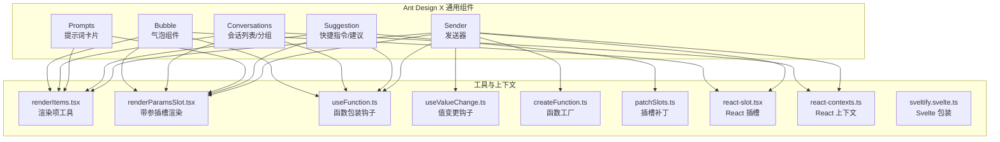
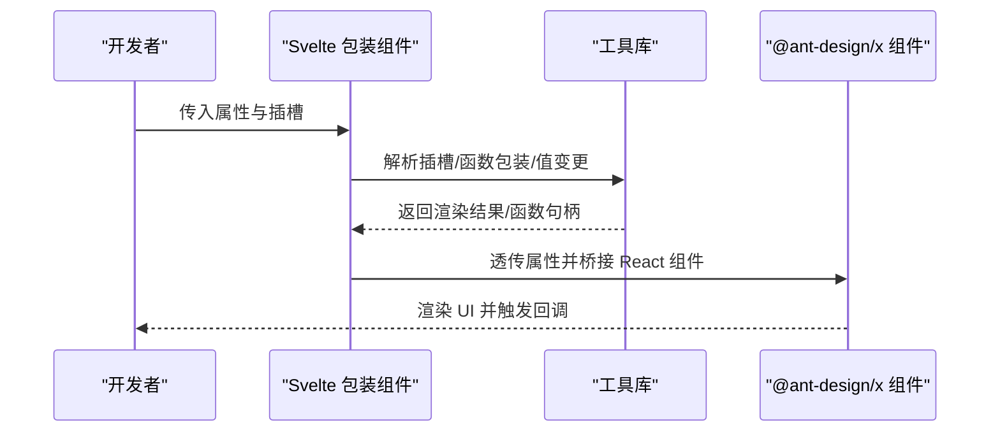
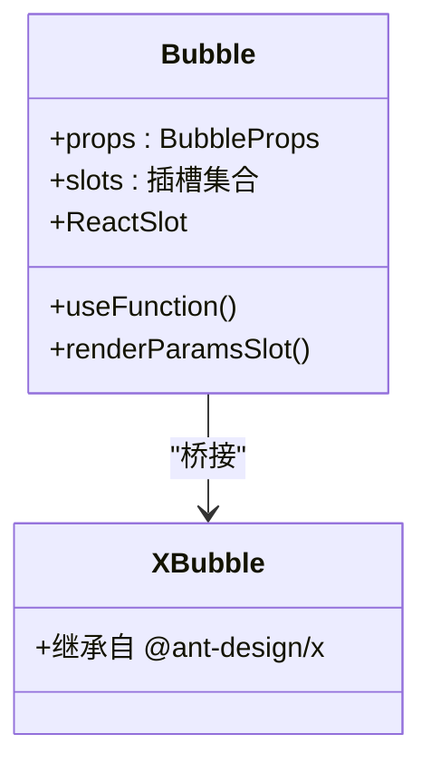
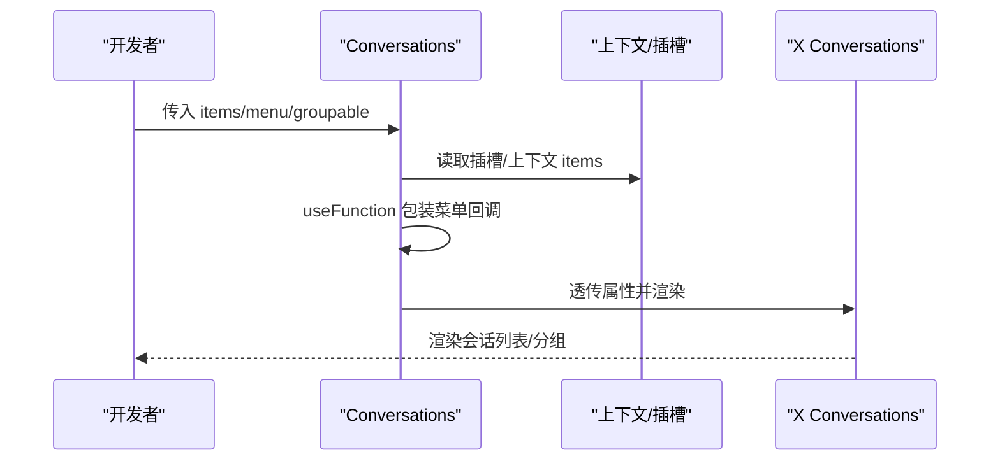
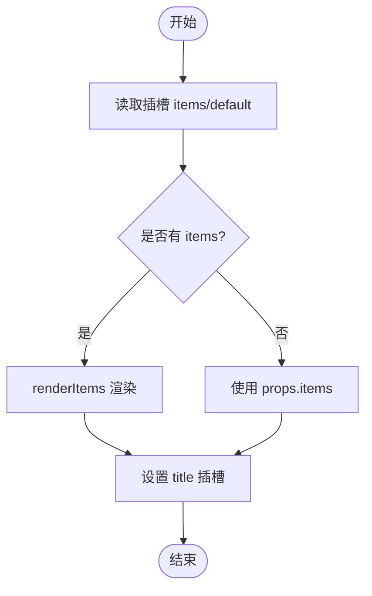
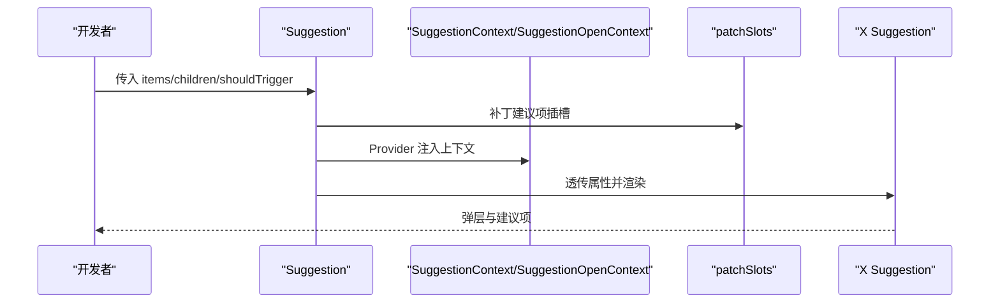
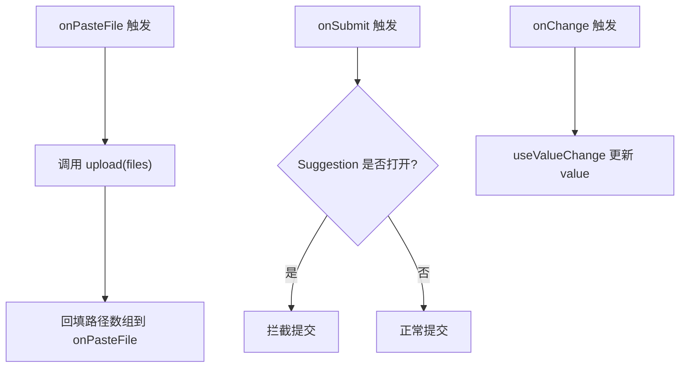
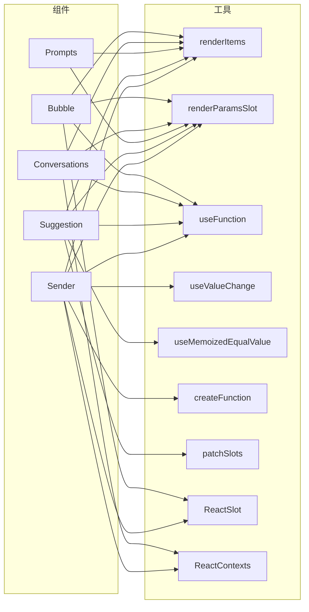

# 通用组件 API

<cite>
**本文引用的文件**
- [bubble.tsx](file://frontend/antdx/bubble/bubble.tsx)
- [conversations.tsx](file://frontend/antdx/conversations/conversations.tsx)
- [prompts.tsx](file://frontend/antdx/prompts/prompts.tsx)
- [suggestion.tsx](file://frontend/antdx/suggestion/suggestion.tsx)
- [sender.tsx](file://frontend/antdx/sender/sender.tsx)
- [context.ts（建议项上下文）](file://frontend/antdx/suggestion/context.ts)
- [context.ts（会话项上下文）](file://frontend/antdx/conversations/context.ts)
- [context.ts（提示项上下文）](file://frontend/antdx/prompts/context.ts)
- [renderItems.tsx](file://frontend/utils/renderItems.tsx)
- [renderParamsSlot.tsx](file://frontend/utils/renderParamsSlot.tsx)
- [useFunction.ts](file://frontend/utils/hooks/useFunction.ts)
- [useValueChange.ts](file://frontend/utils/hooks/useValueChange.ts)
- [createFunction.ts](file://frontend/utils/createFunction.ts)
- [patchSlots.ts](file://frontend/utils/patchSlots.ts)
- [useMemoizedEqualValue.ts](file://frontend/utils/hooks/useMemoizedEqualValue.ts)
- [react-slot.tsx](file://frontend/svelte-preprocess-react/react-slot.tsx)
- [react-contexts.ts](file://frontend/svelte-preprocess-react/react-contexts.ts)
- [sveltify.svelte.ts](file://frontend/svelte-preprocess-react/sveltify.svelte.ts)
</cite>

## 目录

1. [简介](#简介)
2. [项目结构](#项目结构)
3. [核心组件](#核心组件)
4. [架构总览](#架构总览)
5. [详细组件分析](#详细组件分析)
6. [依赖关系分析](#依赖关系分析)
7. [性能考量](#性能考量)
8. [故障排查指南](#故障排查指南)
9. [结论](#结论)
10. [附录](#附录)

## 简介

本文件为 ModelScope Studio 的 Ant Design X 通用组件 API 参考文档，聚焦以下核心通用组件的完整接口说明与使用指南：

- Bubble：对话气泡组件，支持头像、内容、底部栏、额外操作等插槽与渲染函数
- Conversations：对话列表/分组管理，支持菜单、分组标签、溢出指示器等扩展
- Prompts：提示词卡片集合，支持标题插槽与动态项渲染
- Suggestion：快捷指令/建议输入，支持弹层容器、触发策略、子项插槽补丁
- Sender：发送器，支持粘贴上传、技能面板、前缀/后缀/页眉/页脚插槽

文档覆盖属性定义、事件处理、插槽系统、状态管理、消息传递与对话流程控制机制，并给出面向 AI 聊天与对话场景的实例化与配置示例路径、TypeScript 类型与与 Ant Design 组件的集成方式，以及性能优化与最佳实践。

## 项目结构

Ant Design X 通用组件位于前端目录的 antdx 子模块中，采用“Svelte 包装 + React 组件桥接”的架构：通过 svelte-preprocess-react 将 @ant-design/x 的 React 组件以 Svelte 方式使用，同时提供统一的插槽系统与上下文注入能力。

图表来源

- [bubble.tsx:1-119](file://frontend/antdx/bubble/bubble.tsx#L1-L119)
- [conversations.tsx:1-178](file://frontend/antdx/conversations/conversations.tsx#L1-L178)
- [prompts.tsx:1-43](file://frontend/antdx/prompts/prompts.tsx#L1-L43)
- [suggestion.tsx:1-165](file://frontend/antdx/suggestion/suggestion.tsx#L1-L165)
- [sender.tsx:1-174](file://frontend/antdx/sender/sender.tsx#L1-L174)
- [renderItems.tsx](file://frontend/utils/renderItems.tsx)
- [renderParamsSlot.tsx](file://frontend/utils/renderParamsSlot.tsx)
- [useFunction.ts](file://frontend/utils/hooks/useFunction.ts)
- [useValueChange.ts](file://frontend/utils/hooks/useValueChange.ts)
- [createFunction.ts](file://frontend/utils/createFunction.ts)
- [patchSlots.ts](file://frontend/utils/patchSlots.ts)
- [react-slot.tsx](file://frontend/svelte-preprocess-react/react-slot.tsx)
- [react-contexts.ts](file://frontend/svelte-preprocess-react/react-contexts.ts)
- [sveltify.svelte.ts](file://frontend/svelte-preprocess-react/sveltify.svelte.ts)

章节来源

- [bubble.tsx:1-119](file://frontend/antdx/bubble/bubble.tsx#L1-L119)
- [conversations.tsx:1-178](file://frontend/antdx/conversations/conversations.tsx#L1-L178)
- [prompts.tsx:1-43](file://frontend/antdx/prompts/prompts.tsx#L1-L43)
- [suggestion.tsx:1-165](file://frontend/antdx/suggestion/suggestion.tsx#L1-L165)
- [sender.tsx:1-174](file://frontend/antdx/sender/sender.tsx#L1-L174)

## 核心组件

本节概述四个核心通用组件的职责与典型用法，便于快速定位到具体实现与示例路径。

- Bubble（对话气泡）
  - 支持头像、内容、页眉、页脚、额外操作、可编辑文案、加载与内容自定义渲染
  - 插槽键名：avatar、content、header、footer、extra、editable.okText、editable.cancelText、loadingRender、contentRender
  - 典型场景：用户/系统消息展示、可编辑回复、异步加载态

- Conversations（会话管理）
  - 支持会话项列表、分组、菜单、溢出指示器、展开图标、触发器等
  - 插槽键名：menu.items、menu.trigger、menu.expandIcon、menu.overflowedIndicator、groupable.label
  - 典型场景：历史会话浏览、分组折叠、右键菜单操作

- Prompts（提示集）
  - 支持提示词卡片标题插槽与动态项渲染
  - 插槽键名：title
  - 典型场景：聊天引导、快捷提示、模板化输入

- Suggestion（快捷指令）
  - 支持建议项列表、子项插槽补丁、弹层容器、打开状态、键盘触发策略
  - 插槽键名：children
  - 典型场景：@提及、/命令、快捷建议

- Sender（发送器）
  - 支持粘贴上传、技能面板、前缀/后缀/页眉/页脚插槽、值变更与提交拦截
  - 插槽键名：suffix、header、prefix、footer、skill.title、skill.toolTip.title、skill.closable.closeIcon
  - 典型场景：文本输入、文件粘贴上传、技能开关

章节来源

- [bubble.tsx:14-116](file://frontend/antdx/bubble/bubble.tsx#L14-L116)
- [conversations.tsx:59-175](file://frontend/antdx/conversations/conversations.tsx#L59-L175)
- [prompts.tsx:13-40](file://frontend/antdx/prompts/prompts.tsx#L13-L40)
- [suggestion.tsx:64-162](file://frontend/antdx/suggestion/suggestion.tsx#L64-L162)
- [sender.tsx:18-171](file://frontend/antdx/sender/sender.tsx#L18-L171)

## 架构总览

下图展示了通用组件与工具库之间的调用关系与数据流，体现“插槽解析 → 函数包装 → 渲染项生成 → React 组件桥接”的整体流程。

图表来源

- [bubble.tsx:27-115](file://frontend/antdx/bubble/bubble.tsx#L27-L115)
- [conversations.tsx:72-171](file://frontend/antdx/conversations/conversations.tsx#L72-L171)
- [prompts.tsx:16-37](file://frontend/antdx/prompts/prompts.tsx#L16-L37)
- [suggestion.tsx:77-159](file://frontend/antdx/suggestion/suggestion.tsx#L77-L159)
- [sender.tsx:35-169](file://frontend/antdx/sender/sender.tsx#L35-L169)
- [renderItems.tsx](file://frontend/utils/renderItems.tsx)
- [renderParamsSlot.tsx](file://frontend/utils/renderParamsSlot.tsx)
- [useFunction.ts](file://frontend/utils/hooks/useFunction.ts)
- [useValueChange.ts](file://frontend/utils/hooks/useValueChange.ts)
- [createFunction.ts](file://frontend/utils/createFunction.ts)
- [patchSlots.ts](file://frontend/utils/patchSlots.ts)
- [react-slot.tsx](file://frontend/svelte-preprocess-react/react-slot.tsx)

## 详细组件分析

### Bubble 组件 API

- 组件职责
  - 将 @ant-design/x 的 Bubble 以 Svelte 形式封装，提供插槽与函数包装能力
  - 支持可编辑文案、加载与内容自定义渲染、头像/页眉/页脚/额外操作等插槽
- 关键属性与插槽
  - 属性：继承自 BubbleProps，支持 editable、typing、content、avatar、extra、footer、header、loadingRender、contentRender 等
  - 插槽：avatar、content、header、footer、extra、editable.okText、editable.cancelText、loadingRender、contentRender
- 事件与状态
  - 通过 useFunction 包装回调，确保响应式更新；editable 支持布尔或配置对象
- 使用要点
  - 当 editable 配置存在或插槽存在时启用编辑态；loadingRender/contentRender 支持带参插槽
- 示例路径
  - [Bubble 实现:14-116](file://frontend/antdx/bubble/bubble.tsx#L14-L116)

图表来源

- [bubble.tsx:14-116](file://frontend/antdx/bubble/bubble.tsx#L14-L116)

章节来源

- [bubble.tsx:1-119](file://frontend/antdx/bubble/bubble.tsx#L1-L119)

### Conversations 组件 API

- 组件职责
  - 将 @ant-design/x 的 Conversations 以 Svelte 形式封装，提供菜单与分组能力
- 关键属性与插槽
  - 属性：继承自 ConversationsProps，支持 items、menu、groupable、classNames 等
  - 插槽：menu.items、menu.trigger、menu.expandIcon、menu.overflowedIndicator、groupable.label
- 事件与状态
  - 通过 useFunction 包装 menu 回调；对菜单事件进行包裹以传递当前会话上下文
  - 分组标签支持插槽与函数配置
- 使用要点
  - menu 支持字符串或对象；当未提供 items 时可从上下文注入
  - classNames.item 注入样式类名以增强一致性
- 示例路径
  - [Conversations 实现:59-175](file://frontend/antdx/conversations/conversations.tsx#L59-L175)

图表来源

- [conversations.tsx:59-175](file://frontend/antdx/conversations/conversations.tsx#L59-L175)
- [context.ts（会话项上下文）:1-7](file://frontend/antdx/conversations/context.ts#L1-L7)

章节来源

- [conversations.tsx:1-178](file://frontend/antdx/conversations/conversations.tsx#L1-L178)
- [context.ts（会话项上下文）:1-7](file://frontend/antdx/conversations/context.ts#L1-L7)

### Prompts 组件 API

- 组件职责
  - 将 @ant-design/x 的 Prompts 以 Svelte 形式封装，提供标题插槽与动态项渲染
- 关键属性与插槽
  - 属性：继承自 PromptsProps，支持 items、title 等
  - 插槽：title
- 事件与状态
  - 通过 renderItems 动态生成项列表；优先使用插槽 items/default
- 使用要点
  - 适合用于“快捷提示”“模板化输入”等场景
- 示例路径
  - [Prompts 实现:13-40](file://frontend/antdx/prompts/prompts.tsx#L13-L40)

图表来源

- [prompts.tsx:13-40](file://frontend/antdx/prompts/prompts.tsx#L13-L40)
- [context.ts（提示项上下文）:1-7](file://frontend/antdx/prompts/context.ts#L1-L7)

章节来源

- [prompts.tsx:1-43](file://frontend/antdx/prompts/prompts.tsx#L1-L43)
- [context.ts（提示项上下文）:1-7](file://frontend/antdx/prompts/context.ts#L1-L7)

### Suggestion 组件 API

- 组件职责
  - 将 @ant-design/x 的 Suggestion 以 Svelte 形式封装，提供建议项插槽补丁、弹层容器、打开状态与键盘触发策略
- 关键属性与插槽
  - 属性：继承自 SuggestionProps，新增 children 插槽与 shouldTrigger 回调
  - 插槽：children
- 事件与状态
  - 通过 SuggestionOpenContext 与 useSuggestionOpenContext 控制/感知打开状态
  - 通过 patchSlots 对建议项的 icon/label/extra/children 进行插槽补丁
  - 通过 useMemoizedEqualValue 优化渲染开销
- 使用要点
  - 支持在 children 渲染函数中注入上下文，实现 onTrigger/onKeyDown 的定制
  - 支持受控/非受控 open 状态切换
- 示例路径
  - [Suggestion 实现:64-162](file://frontend/antdx/suggestion/suggestion.tsx#L64-L162)

图表来源

- [suggestion.tsx:64-162](file://frontend/antdx/suggestion/suggestion.tsx#L64-L162)
- [context.ts（建议项上下文）:1-7](file://frontend/antdx/suggestion/context.ts#L1-L7)
- [react-contexts.ts](file://frontend/svelte-preprocess-react/react-contexts.ts)

章节来源

- [suggestion.tsx:1-165](file://frontend/antdx/suggestion/suggestion.tsx#L1-L165)
- [context.ts（建议项上下文）:1-7](file://frontend/antdx/suggestion/context.ts#L1-L7)

### Sender 组件 API

- 组件职责
  - 将 @ant-design/x 的 Sender 以 Svelte 形式封装，提供粘贴上传、技能面板、插槽与值变更钩子
- 关键属性与插槽
  - 属性：继承自 SenderProps，新增 upload、onPasteFile、onValueChange 等
  - 插槽：suffix、header、prefix、footer、skill.title、skill.toolTip.title、skill.closable.closeIcon
- 事件与状态
  - 通过 useValueChange 管理受控/非受控 value
  - 通过 useSuggestionOpenContext 在 Suggestion 打开时拦截提交
  - 通过 createFunction/formatResult/customRender 定制 slotConfig
- 使用要点
  - 粘贴文件时调用 upload 并回填路径数组
  - 技能面板支持 tooltip/closable 的插槽与配置组合
- 示例路径
  - [Sender 实现:18-171](file://frontend/antdx/sender/sender.tsx#L18-L171)

图表来源

- [sender.tsx:18-171](file://frontend/antdx/sender/sender.tsx#L18-L171)

章节来源

- [sender.tsx:1-174](file://frontend/antdx/sender/sender.tsx#L1-L174)

## 依赖关系分析

通用组件与工具库之间存在清晰的依赖关系：组件通过上下文与插槽系统消费工具库能力，最终桥接到 @ant-design/x 的 React 组件。

图表来源

- [bubble.tsx:1-119](file://frontend/antdx/bubble/bubble.tsx#L1-L119)
- [conversations.tsx:1-178](file://frontend/antdx/conversations/conversations.tsx#L1-L178)
- [prompts.tsx:1-43](file://frontend/antdx/prompts/prompts.tsx#L1-L43)
- [suggestion.tsx:1-165](file://frontend/antdx/suggestion/suggestion.tsx#L1-L165)
- [sender.tsx:1-174](file://frontend/antdx/sender/sender.tsx#L1-L174)
- [renderItems.tsx](file://frontend/utils/renderItems.tsx)
- [renderParamsSlot.tsx](file://frontend/utils/renderParamsSlot.tsx)
- [useFunction.ts](file://frontend/utils/hooks/useFunction.ts)
- [useValueChange.ts](file://frontend/utils/hooks/useValueChange.ts)
- [createFunction.ts](file://frontend/utils/createFunction.ts)
- [patchSlots.ts](file://frontend/utils/patchSlots.ts)
- [react-slot.tsx](file://frontend/svelte-preprocess-react/react-slot.tsx)
- [react-contexts.ts](file://frontend/svelte-preprocess-react/react-contexts.ts)

章节来源

- [bubble.tsx:1-119](file://frontend/antdx/bubble/bubble.tsx#L1-L119)
- [conversations.tsx:1-178](file://frontend/antdx/conversations/conversations.tsx#L1-L178)
- [prompts.tsx:1-43](file://frontend/antdx/prompts/prompts.tsx#L1-L43)
- [suggestion.tsx:1-165](file://frontend/antdx/suggestion/suggestion.tsx#L1-L165)
- [sender.tsx:1-174](file://frontend/antdx/sender/sender.tsx#L1-L174)

## 性能考量

- 插槽与函数包装
  - 使用 useMemoizedEqualValue 与 useMemo 降低渲染抖动与重复计算
  - 通过 useFunction 包装回调，避免每次渲染产生新函数导致的子组件重渲染
- 渲染项与插槽
  - renderItems 与 renderParamsSlot 仅在必要时执行，减少不必要的克隆与渲染
  - patchSlots 仅对建议项进行按需补丁，避免全量替换
- 值变更与事件拦截
  - useValueChange 统一 value 管理，避免外部状态不一致
  - Sender 在 Suggestion 打开时拦截提交，减少无效请求
- 最佳实践
  - 合理拆分插槽与函数，避免在插槽中执行重型逻辑
  - 对高频更新的数据使用稳定引用，结合 useMemo/useCallback
  - 在 Conversations/Prompts 中尽量复用已解析的 items，减少重复渲染

[本节为通用性能指导，无需特定文件来源]

## 故障排查指南

- 插槽未生效
  - 检查插槽键名是否与组件声明一致（如 bubble 的 editable.okText、conversations 的 menu.items 等）
  - 确认插槽内容是否被正确包裹于 ReactSlot 或 renderParamsSlot
- 事件未触发
  - 确认 useFunction 包装的回调是否正确传递至底层组件
  - 对于 Conversations 的菜单事件，检查 patchMenuEvents 是否正确包裹原事件
- 建议项插槽不显示
  - 确认 patchSlots 已对 icon/label/extra/children 进行补丁
  - 检查 Suggestion 的 children 渲染函数是否返回了正确的节点
- Sender 提交被拦截
  - 确认 SuggestionOpenContext 的状态是否为 true
  - 检查 shouldTrigger 是否在键盘事件中正确触发
- 值未更新
  - 确认 useValueChange 的 onValueChange 是否被调用
  - 检查 props.value 与内部状态同步逻辑

章节来源

- [bubble.tsx:27-115](file://frontend/antdx/bubble/bubble.tsx#L27-L115)
- [conversations.tsx:35-122](file://frontend/antdx/conversations/conversations.tsx#L35-L122)
- [suggestion.tsx:100-159](file://frontend/antdx/suggestion/suggestion.tsx#L100-L159)
- [sender.tsx:126-138](file://frontend/antdx/sender/sender.tsx#L126-L138)

## 结论

ModelScope Studio 的 Ant Design X 通用组件通过统一的插槽系统与函数包装机制，实现了与 @ant-design/x 组件的无缝桥接。Bubble、Conversations、Prompts、Suggestion、Sender 在 AI 聊天与对话场景中提供了强大的可扩展性与易用性。遵循本文档的属性定义、事件处理、插槽系统与状态管理建议，可高效构建高质量的对话界面与交互流程。

[本节为总结性内容，无需特定文件来源]

## 附录

- TypeScript 类型与接口
  - 组件均基于 @ant-design/x 的对应 Props 类型进行扩展或裁剪，确保类型安全
  - 插槽与函数包装通过泛型与工具函数保障类型推断
- 与 Ant Design 组件的集成
  - 通过 svelte-preprocess-react 的 sveltify 与 ReactSlot 实现 Svelte 到 React 的桥接
  - 通过 createFunction/useFunction 等工具实现属性与回调的函数化封装
- 示例路径索引
  - Bubble：[bubble.tsx:14-116](file://frontend/antdx/bubble/bubble.tsx#L14-L116)
  - Conversations：[conversations.tsx:59-175](file://frontend/antdx/conversations/conversations.tsx#L59-L175)
  - Prompts：[prompts.tsx:13-40](file://frontend/antdx/prompts/prompts.tsx#L13-L40)
  - Suggestion：[suggestion.tsx:64-162](file://frontend/antdx/suggestion/suggestion.tsx#L64-L162)
  - Sender：[sender.tsx:18-171](file://frontend/antdx/sender/sender.tsx#L18-L171)

[本节为补充信息，无需特定文件来源]
